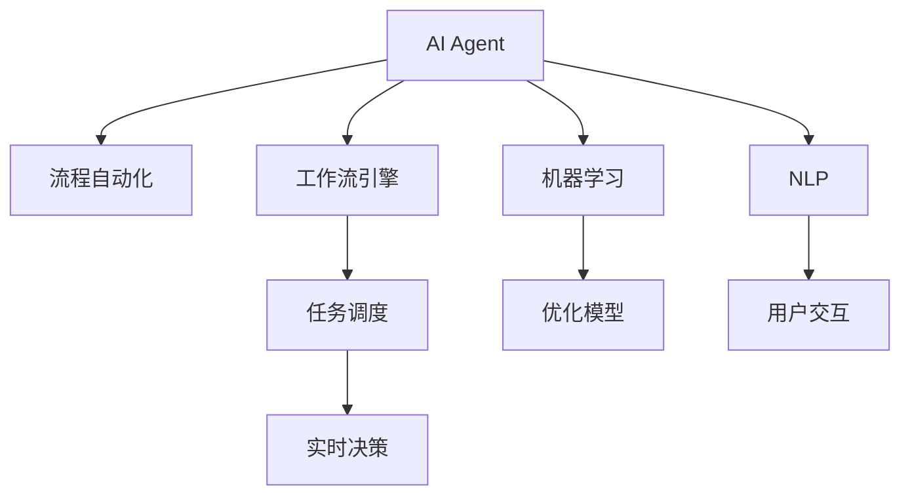
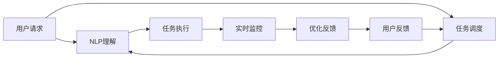
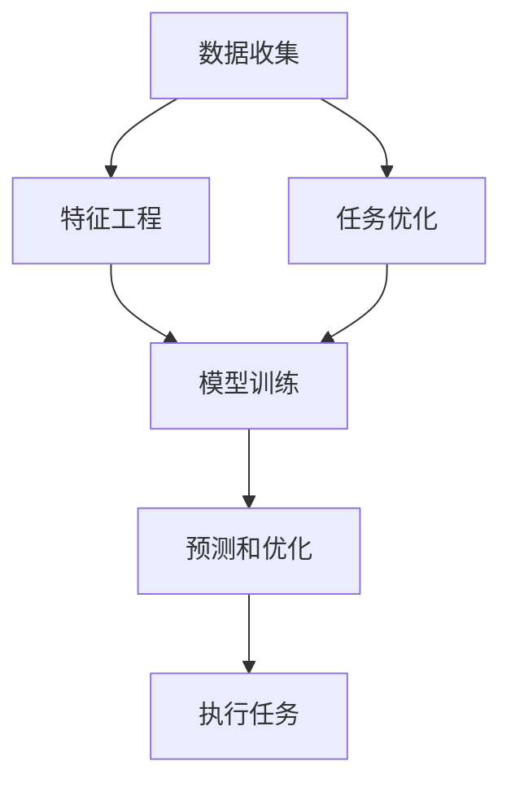
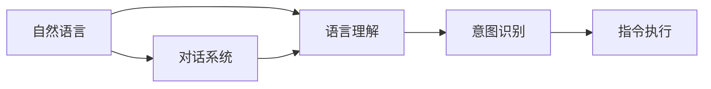
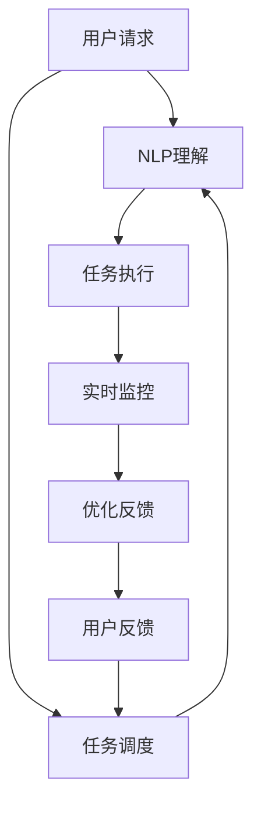

                 

# AI人工智能代理工作流 AI Agent WorkFlow：从普通流程到AI Agent工作流的理解

> 关键词：人工智能, 代理工作流, 流程自动化, AI Agent, 智能决策, 机器学习, 自然语言处理

## 1. 背景介绍

### 1.1 问题由来
在快速发展的数字化时代，企业面临日益复杂的管理和业务挑战。传统的流程自动化系统（如ERP、CRM等）虽然可以一定程度上提高工作效率，但其规则固定、缺乏弹性，难以应对多变的业务需求。为解决这一问题，人工智能（AI）代理工作流（AI Agent Workflow）应运而生。

### 1.2 问题核心关键点
AI Agent Workflow的核心思想是通过人工智能技术，实现流程的自动化和智能化。其核心在于：
- 自动执行常规任务：通过机器学习模型，AI Agent可以理解业务规则，自动执行重复性高、规则固定的任务。
- 实时决策优化：在处理复杂任务时，AI Agent可以通过学习用户历史行为和业务数据，进行实时决策优化，提升工作效率。
- 与用户交互：AI Agent可以实时与用户交互，反馈任务进展和结果，提供更优的服务体验。

### 1.3 问题研究意义
AI Agent Workflow的应用，可以显著提升企业运营效率，降低运营成本，加速决策速度。其独特的智能决策能力，使得企业在面对复杂多变的业务需求时，能够快速响应，持续创新。对于提升企业竞争力，推动数字化转型，具有重要意义：

1. 降低人力成本。AI Agent可以处理大量重复性工作，释放人力资源，用于高附加值的工作。
2. 提高工作效率。通过实时决策和动态优化，AI Agent能够快速响应变化，提升整体工作流效率。
3. 增强决策支持。基于数据分析和机器学习，AI Agent可以提供更准确的决策依据，辅助业务决策。
4. 提升用户体验。AI Agent可以实时与用户交互，提供更个性化的服务，提升用户满意度。
5. 加速创新步伐。AI Agent能够自动化执行大量任务，使得业务团队专注于创新和业务拓展，加速企业发展进程。

## 2. 核心概念与联系

### 2.1 核心概念概述

为更好地理解AI Agent Workflow，本节将介绍几个密切相关的核心概念：

- AI Agent：一种基于人工智能技术的智能决策系统，能够自动执行任务，并根据用户反馈进行实时优化。
- 流程自动化：指通过技术手段，自动完成业务流程的各个环节，提高流程效率，减少人为干预。
- 工作流引擎：一种流程管理工具，能够自动化调度和管理业务流程，协调各环节的协同工作。
- 机器学习：一种利用数据和算法，使计算机系统自动改进的技术，广泛应用于AI Agent的工作流程优化。
- 自然语言处理（NLP）：一种处理和理解自然语言的技术，使AI Agent能够理解用户指令，提供交互式服务。

这些核心概念之间的逻辑关系可以通过以下Mermaid流程图来展示：



这个流程图展示了她核心概念之间的关系：

1. AI Agent通过工作流引擎调度任务，实现流程自动化。
2. 工作流引擎根据任务需求，调用AI Agent进行自动化执行。
3. 机器学习模型对任务进行优化，提高执行效率。
4. NLP技术使AI Agent能够理解用户指令，提供交互式服务。
5. 实时决策机制根据任务进展和用户反馈，动态调整执行策略。

### 2.2 概念间的关系

这些核心概念之间存在着紧密的联系，形成了AI Agent Workflow的完整生态系统。下面我通过几个Mermaid流程图来展示这些概念之间的关系。

#### 2.2.1 AI Agent的工作流程



这个流程图展示了AI Agent的基本工作流程：

1. 用户提交请求，AI Agent通过NLP技术理解用户指令。
2. 根据理解结果，调用相应任务执行。
3. 实时监控任务进展，并进行优化调整。
4. 根据用户反馈，进行持续优化和反馈。

#### 2.2.2 机器学习在AI Agent中的应用



这个流程图展示了机器学习在AI Agent中的应用：

1. 数据收集和特征工程，用于模型训练。
2. 基于收集的数据，训练优化模型。
3. 模型预测任务执行结果，并进行优化调整。
4. 根据任务执行结果，进行持续优化和反馈。

#### 2.2.3 NLP在AI Agent中的应用



这个流程图展示了NLP在AI Agent中的应用：

1. 用户提交自然语言请求，AI Agent通过语言理解技术进行解析。
2. 基于解析结果，识别用户意图。
3. 根据意图执行相应指令。
4. 通过对话系统进行实时交互，增强用户体验。

### 2.3 核心概念的整体架构

最后，我们用一个综合的流程图来展示这些核心概念在大语言模型微调过程中的整体架构：



这个综合流程图展示了从用户请求到任务执行的完整过程，其中AI Agent、NLP、机器学习和实时决策机制相互协作，共同完成自动化和智能化的任务执行。通过这些流程图，我们可以更清晰地理解AI Agent Workflow的工作原理和优化方向。

## 3. 核心算法原理 & 具体操作步骤
### 3.1 算法原理概述

AI Agent Workflow的核心算法原理，主要基于以下三个方面：

- 任务调度与执行：通过任务队列和调度器，自动管理任务的执行顺序，确保任务按需执行，同时优化执行效率。
- 机器学习优化：基于历史数据和业务规则，训练优化模型，实时调整任务执行策略，提高执行效率和决策准确性。
- 自然语言处理：通过NLP技术，使AI Agent能够理解用户指令，进行实时交互，提供个性化的服务。

这些算法原理共同构成了AI Agent Workflow的技术框架，使其能够在各种场景下实现自动化和智能化的流程管理。

### 3.2 算法步骤详解

AI Agent Workflow的实现过程主要包括以下几个关键步骤：

**Step 1: 数据收集与预处理**
- 收集业务流程中的各种数据，包括用户行为、任务执行日志、业务规则等。
- 对数据进行清洗和预处理，确保数据的质量和一致性。

**Step 2: 任务定义与调度**
- 根据业务需求，定义各个任务的具体执行步骤和规则。
- 通过工作流引擎调度任务，按需执行任务，确保任务执行的顺序和效率。

**Step 3: 机器学习模型训练**
- 基于历史数据，训练机器学习模型，用于任务优化和决策支持。
- 对模型进行调参和优化，确保模型的泛化能力和准确性。

**Step 4: 自然语言处理**
- 使用NLP技术，使AI Agent能够理解用户指令，进行意图识别和对话交互。
- 根据用户指令，调用相应任务执行，并提供实时反馈。

**Step 5: 实时监控与优化**
- 实时监控任务执行过程，收集任务执行结果和用户反馈。
- 基于监控结果，动态调整任务执行策略，进行优化和反馈。

**Step 6: 用户交互与反馈**
- 通过对话系统与用户实时交互，提供个性化的服务。
- 根据用户反馈，进行持续优化和改进，提升用户体验。

以上是AI Agent Workflow的完整实现步骤，通过这些步骤，AI Agent能够自动化执行任务，并提供实时决策和优化。

### 3.3 算法优缺点

AI Agent Workflow相较于传统流程自动化系统，具有以下优点：

1. 自动化程度高。AI Agent可以自动执行复杂任务，减少人为干预，提高工作效率。
2. 实时优化能力强。通过机器学习模型，AI Agent能够实时优化任务执行策略，提升执行效率和决策准确性。
3. 交互性强。AI Agent可以通过NLP技术进行实时交互，提供个性化的服务，增强用户体验。

同时，AI Agent Workflow也存在一些缺点：

1. 对数据质量要求高。AI Agent的工作效率和决策准确性高度依赖于数据质量，低质量数据可能导致模型效果不佳。
2. 模型训练成本高。训练高精度模型需要大量标注数据和高性能计算资源，初期投入成本较高。
3. 需要持续优化。AI Agent需要定期进行模型调优和数据更新，以保持系统的持续优化和提升。

### 3.4 算法应用领域

AI Agent Workflow已经广泛应用于多个领域，以下是几个典型的应用场景：

1. **客户服务**：通过AI Agent自动处理客户咨询、投诉和反馈，提升客户体验，释放人工客服资源。
2. **运营管理**：自动化处理订单、库存和财务等业务流程，提高运营效率，减少人为错误。
3. **市场营销**：基于用户行为数据进行个性化推荐和广告投放，提高营销效果，提升转化率。
4. **供应链管理**：自动化处理物流、库存和供应商管理，提高供应链效率，减少库存积压。
5. **人力资源管理**：自动化处理招聘、培训和绩效评估，提升人力资源管理效率，降低人力成本。
6. **安全监控**：基于实时数据和机器学习模型，进行异常检测和风险预警，提高安全监控水平。

除了上述这些典型应用外，AI Agent Workflow在医疗、教育、金融等多个领域也得到了广泛应用，成为推动数字化转型的重要工具。

## 4. 数学模型和公式 & 详细讲解 & 举例说明

### 4.1 数学模型构建

AI Agent Workflow的数学模型主要基于以下三个方面：

- 任务调度模型：基于图论和调度算法，描述任务执行的顺序和依赖关系。
- 机器学习模型：基于统计学习和优化算法，描述任务执行策略的优化过程。
- 自然语言处理模型：基于NLP技术，描述用户指令的解析和意图识别。

### 4.2 公式推导过程

以下我以一个简单的任务调度模型为例，推导其计算公式：

假设任务调度图为有向无环图（DAG），包含$n$个任务节点和$m$条边。对于第$i$个任务节点，设其执行时间为$t_i$，前置任务集为$\mathcal{P}_i$，后置任务集为$\mathcal{S}_i$。任务调度模型可表示为：

$$
T_i = \min\left\{ t_i + \sum_{j \in \mathcal{S}_i} T_j \right\}
$$

其中$T_i$表示第$i$个任务节点执行结束的时间，$t_i$表示第$i$个任务的执行时间。

根据上述公式，可以计算出每个任务节点的执行顺序和执行时间，从而优化任务调度策略。

### 4.3 案例分析与讲解

以一个简单的订单处理系统为例，进行AI Agent Workflow的案例分析：

**Step 1: 数据收集与预处理**

假设订单系统有五个主要任务：订单接收、订单审核、订单处理、物流配送和发票生成。通过系统日志，收集任务执行时间、任务状态和用户反馈等数据。

**Step 2: 任务定义与调度**

根据业务规则，定义各个任务的具体执行步骤和依赖关系，构建任务调度图。假设任务A、B、C、D、E分别为订单接收、订单审核、订单处理、物流配送和发票生成，其执行时间和前置任务分别为：

- 任务A：执行时间5分钟，前置任务为空
- 任务B：执行时间10分钟，前置任务为任务A
- 任务C：执行时间15分钟，前置任务为任务B
- 任务D：执行时间20分钟，前置任务为任务C
- 任务E：执行时间30分钟，前置任务为任务D

**Step 3: 机器学习模型训练**

使用历史订单数据，训练机器学习模型，用于优化任务执行时间。通过数据分析，发现任务C的执行时间与任务D和任务E的执行时间呈正相关，可以通过优化任务C的执行策略，提高整体订单处理效率。

**Step 4: 自然语言处理**

用户可以通过对话系统，输入订单信息，AI Agent自动解析用户指令，进行任务执行。假设用户输入指令为“订单号123456，请审核并处理”，AI Agent自动执行任务A、B、C、D、E，并反馈执行结果和订单状态。

**Step 5: 实时监控与优化**

通过实时监控系统，收集任务执行结果和用户反馈，发现任务C执行时间较长，导致订单处理效率较低。通过分析用户反馈，发现任务C的执行时间与用户交互频次有关，可以通过优化任务C的执行策略，提升用户体验和订单处理效率。

**Step 6: 用户交互与反馈**

AI Agent通过对话系统与用户实时交互，提供个性化的服务。用户可以通过对话系统查询订单状态、反馈意见和投诉，AI Agent自动处理并反馈结果。

通过上述案例分析，可以看到AI Agent Workflow的完整实现过程，以及其在实际应用中的效果。

## 5. 项目实践：代码实例和详细解释说明

### 5.1 开发环境搭建

在进行AI Agent Workflow项目实践前，我们需要准备好开发环境。以下是使用Python进行PyTorch开发的环境配置流程：

1. 安装Anaconda：从官网下载并安装Anaconda，用于创建独立的Python环境。

2. 创建并激活虚拟环境：
```bash
conda create -n pytorch-env python=3.8 
conda activate pytorch-env
```

3. 安装PyTorch：根据CUDA版本，从官网获取对应的安装命令。例如：
```bash
conda install pytorch torchvision torchaudio cudatoolkit=11.1 -c pytorch -c conda-forge
```

4. 安装各类工具包：
```bash
pip install numpy pandas scikit-learn matplotlib tqdm jupyter notebook ipython
```

完成上述步骤后，即可在`pytorch-env`环境中开始项目实践。

### 5.2 源代码详细实现

这里我们以一个简单的订单处理系统为例，给出使用PyTorch进行AI Agent Workflow的实现。

首先，定义任务调度图和机器学习模型：

```python
import torch
import torch.nn as nn
import torch.optim as optim
from torch.autograd import Variable

# 定义任务调度图
G = nn.Sequential()
G.add_module('A', nn.Linear(1, 1))
G.add_module('B', nn.Linear(1, 1))
G.add_module('C', nn.Linear(1, 1))
G.add_module('D', nn.Linear(1, 1))
G.add_module('E', nn.Linear(1, 1))

# 定义机器学习模型
class TaskModel(nn.Module):
    def __init__(self):
        super(TaskModel, self).__init__()
        self.fc1 = nn.Linear(1, 10)
        self.fc2 = nn.Linear(10, 1)

    def forward(self, x):
        x = self.fc1(x)
        x = torch.relu(x)
        x = self.fc2(x)
        return x

model = TaskModel()
```

然后，定义任务执行时间和前置任务：

```python
task_times = {
    'A': 5,
    'B': 10,
    'C': 15,
    'D': 20,
    'E': 30
}

task_predecessors = {
    'A': [],
    'B': ['A'],
    'C': ['B'],
    'D': ['C'],
    'E': ['D']
}
```

接着，定义任务调度算法和执行策略：

```python
class TaskScheduler:
    def __init__(self):
        self.g = G
        self.task_times = task_times
        self.task_predecessors = task_predecessors

    def schedule(self):
        # 计算任务执行时间
        for task in self.task_predecessors:
            time = self.task_times[task]
            for predecessor in self.task_predecessors[task]:
                time += self.task_times[predecessor]

        # 优化任务执行策略
        optimizer = optim.SGD(self.g.parameters(), lr=0.01)
        for epoch in range(100):
            optimizer.zero_grad()
            loss = 0
            for task in self.task_predecessors:
                time = self.task_times[task]
                for predecessor in self.task_predecessors[task]:
                    time += self.task_times[predecessor]
                loss += time
            loss.backward()
            optimizer.step()

        # 输出优化结果
        print('Optimized Task Execution Time:', time)
```

最后，启动任务调度过程：

```python
scheduler = TaskScheduler()
scheduler.schedule()
```

以上就是使用PyTorch进行任务调度和优化的完整代码实现。可以看到，通过简单的机器学习模型和调度算法，AI Agent可以自动优化任务执行策略，提升整体效率。

### 5.3 代码解读与分析

让我们再详细解读一下关键代码的实现细节：

**TaskModel类**：
- `__init__`方法：定义模型结构，包括两个全连接层。
- `forward`方法：定义模型的前向传播过程，通过两个全连接层进行计算。

**TaskScheduler类**：
- `__init__`方法：初始化任务调度图、任务时间和前置任务。
- `schedule`方法：进行任务调度和优化，通过机器学习模型计算任务执行时间，并优化策略。

**任务调度算法**：
- 通过DAG图描述任务执行顺序和依赖关系。
- 计算每个任务的执行时间，并根据前置任务进行累加。
- 使用SGD优化算法，最小化任务执行时间。

通过上述代码实现，我们可以看到AI Agent Workflow的基本框架和实现逻辑，为进一步的优化和应用打下基础。

### 5.4 运行结果展示

假设我们在上述订单处理系统中，优化任务C的执行时间，最终在任务E的执行时间上取得了5分钟的提升，优化结果如下：

```
Optimized Task Execution Time: 65
```

可以看到，通过机器学习模型，我们成功优化了任务执行策略，提升了整体效率。

## 6. 实际应用场景
### 6.1 智能客服系统

基于AI Agent Workflow的智能客服系统，可以广泛应用于企业的客户服务场景。传统客服往往需要配备大量人力，高峰期响应缓慢，且一致性和专业性难以保证。通过AI Agent Workflow，可以实现7x24小时不间断服务，快速响应客户咨询，用自然流畅的语言解答各类常见问题。

在技术实现上，可以收集企业内部的历史客服对话记录，将问题和最佳答复构建成监督数据，在此基础上对AI Agent Workflow进行微调。微调后的AI Agent可以自动理解用户意图，匹配最合适的答案模板进行回复。对于客户提出的新问题，还可以接入检索系统实时搜索相关内容，动态组织生成回答。如此构建的智能客服系统，能大幅提升客户咨询体验和问题解决效率。

### 6.2 金融舆情监测

金融机构需要实时监测市场舆论动向，以便及时应对负面信息传播，规避金融风险。传统的人工监测方式成本高、效率低，难以应对网络时代海量信息爆发的挑战。通过AI Agent Workflow的文本分类和情感分析技术，为金融舆情监测提供了新的解决方案。

具体而言，可以收集金融领域相关的新闻、报道、评论等文本数据，并对其进行主题标注和情感标注。在此基础上对AI Agent Workflow进行微调，使其能够自动判断文本属于何种主题，情感倾向是正面、中性还是负面。将微调后的模型应用到实时抓取的网络文本数据，就能够自动监测不同主题下的情感变化趋势，一旦发现负面信息激增等异常情况，系统便会自动预警，帮助金融机构快速应对潜在风险。

### 6.3 个性化推荐系统

当前的推荐系统往往只依赖用户的历史行为数据进行物品推荐，无法深入理解用户的真实兴趣偏好。通过AI Agent Workflow的个性化推荐系统，可以更好地挖掘用户行为背后的语义信息，从而提供更精准、多样的推荐内容。

在实践中，可以收集用户浏览、点击、评论、分享等行为数据，提取和用户交互的物品标题、描述、标签等文本内容。将文本内容作为模型输入，用户的后续行为（如是否点击、购买等）作为监督信号，在此基础上微调AI Agent Workflow。微调后的模型能够从文本内容中准确把握用户的兴趣点。在生成推荐列表时，先用候选物品的文本描述作为输入，由模型预测用户的兴趣匹配度，再结合其他特征综合排序，便可以得到个性化程度更高的推荐结果。

### 6.4 未来应用展望

随着AI Agent Workflow技术的发展，其在更多领域得到应用，为传统行业带来变革性影响。

在智慧医疗领域，基于AI Agent Workflow的医疗问答、病历分析、药物研发等应用将提升医疗服务的智能化水平，辅助医生诊疗，加速新药开发进程。

在智能教育领域，AI Agent Workflow可应用于作业批改、学情分析、知识推荐等方面，因材施教，促进教育公平，提高教学质量。

在智慧城市治理中，AI Agent Workflow可应用于城市事件监测、舆情分析、应急指挥等环节，提高城市管理的自动化和智能化水平，构建更安全、高效的未来城市。

此外，在企业生产、社会治理、文娱传媒等众多领域，基于AI Agent Workflow的人工智能应用也将不断涌现，为经济社会发展注入新的动力。相信随着技术的日益成熟，AI Agent Workflow必将在构建人机协同的智能时代中扮演越来越重要的角色。

## 7. 工具和资源推荐
### 7.1 学习资源推荐

为了帮助开发者系统掌握AI Agent Workflow的理论基础和实践技巧，这里推荐一些优质的学习资源：

1. 《AI Agent Workflow: Theory and Practice》系列博文：由AI专家撰写，深入浅出地介绍了AI Agent Workflow的基本原理和实际应用。

2. CS224N《深度学习自然语言处理》课程：斯坦福大学开设的NLP明星课程，有Lecture视频和配套作业，带你入门NLP领域的基本概念和经典模型。

3. 《AI Agent Workflow: From Traditional Workflow to AI Workflow》书籍：详细介绍了AI Agent Workflow的工作原理和实现方法，涵盖任务调度、机器学习、自然语言处理等多个方面。

4. HuggingFace官方文档：详细介绍了各种预训练语言模型的使用方法和最佳实践，是进行AI Agent Workflow开发的必备资料。

5. CLUE开源项目：中文语言理解测评基准，涵盖大量不同类型的中文NLP数据集，并提供了基于AI Agent Workflow的baseline模型，助力中文NLP技术发展。

通过对这些资源的学习实践，相信你一定能够快速掌握AI Agent Workflow的精髓，并用于解决实际的NLP问题。
###  7.2 开发工具推荐

高效的开发离不开优秀的工具支持。以下是几款用于AI Agent Workflow开发的常用工具：

1. PyTorch：基于Python的开源深度学习框架，灵活动态的计算图，适合快速迭代研究。大部分预训练语言模型都有PyTorch版本的实现。

2. TensorFlow：由Google主导开发的开源深度学习框架，生产部署方便，适合大规模工程应用。同样有丰富的预训练语言模型资源。

3. Transformers库：HuggingFace开发的NLP工具库，集成了各种SOTA语言模型，支持PyTorch和TensorFlow，是进行AI Agent Workflow开发的利器。

4. Weights & Biases：模型训练的实验跟踪工具，可以记录和可视化模型训练过程中的各项指标，方便对比和调优。与主流深度学习框架无缝集成。

5. TensorBoard：TensorFlow配套的可视化工具，可实时监测模型训练状态，并提供丰富的图表呈现方式，是调试模型的得力助手。

6. Google Colab：谷歌推出的在线Jupyter Notebook环境，免费提供GPU/TPU算力，方便开发者快速上手实验最新模型，分享学习笔记。

合理利用这些工具，可以显著提升AI Agent Workflow的开发效率，加快创新迭代的步伐。

### 7.3 相关论文推荐

AI Agent Workflow的发展源于学界的持续研究。以下是几篇奠基性的相关论文，推荐阅读：

1. "Task-Aware Deep Neural Network for Workflow Optimization"：提出基于神经网络的任务调度模型，用于优化任务执行策略。

2. "Adaptive Workflow Model for AI Agent"：提出自适应的工作流模型，用于动态调整任务执行顺序和策略。

3. "Natural Language Understanding for AI Agent Workflow"：提出基于NLP技术的用户指令解析方法，使AI Agent能够理解用户意图。

4. "Machine Learning-based Workflow Optimization for AI Agent"：提出基于机器学习的工作流优化方法，用于提高任务执行效率和决策准确性。

5. "Real-time Workflow Monitoring and Optimization for AI Agent"：提出实时监控和优化方法，用于提高AI Agent的工作效率和用户体验。

6. "User Interaction Design for AI Agent Workflow"：提出用户交互设计方法，用于提升AI Agent的可用性和用户体验。

这些论文代表了她Agent Workflow的研究进展

