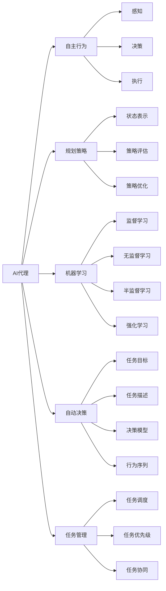
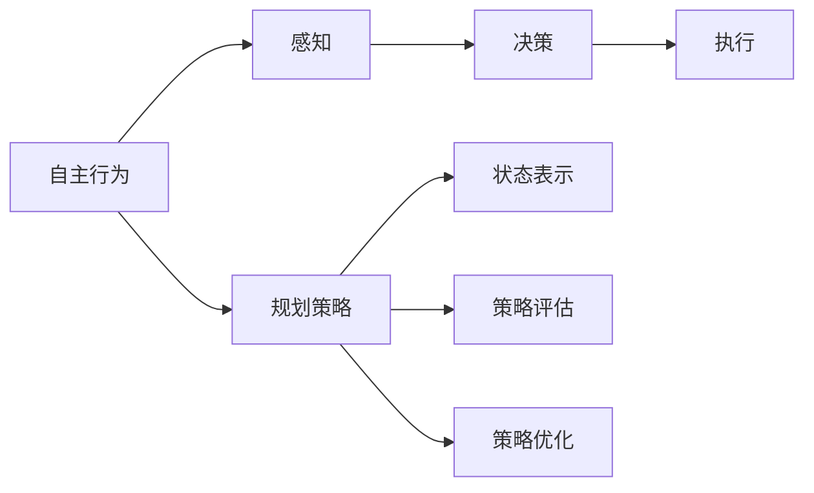
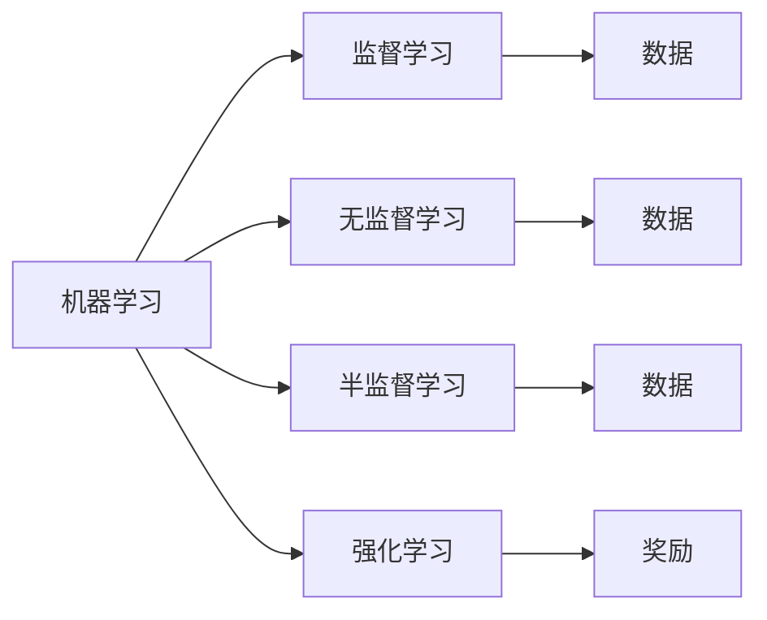
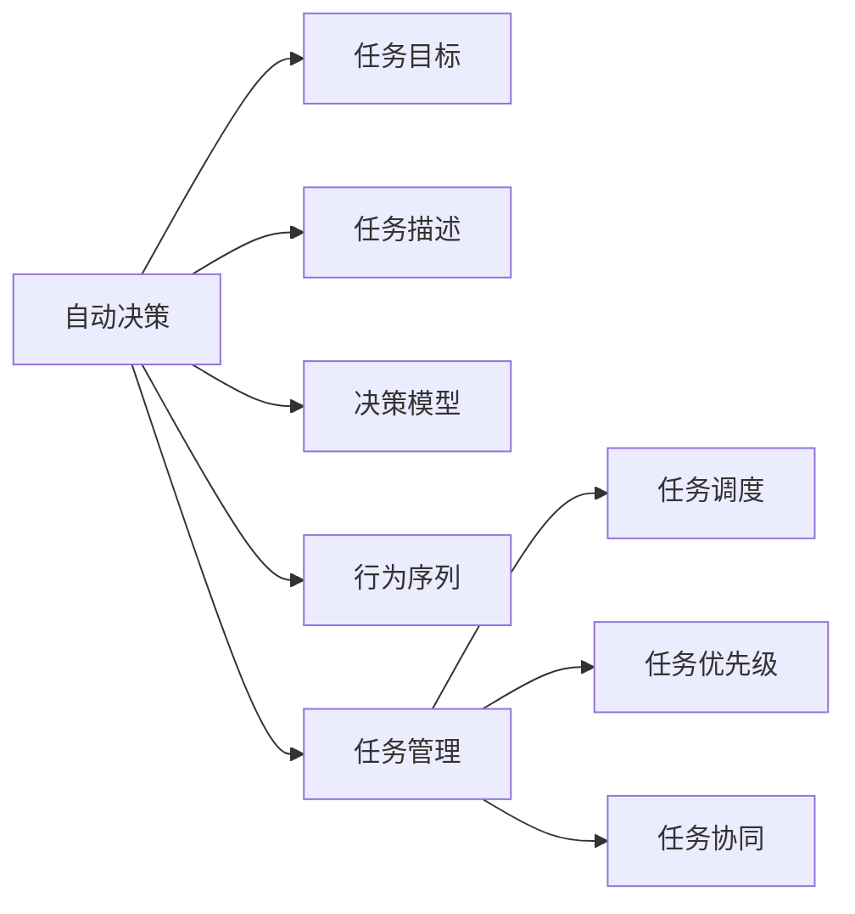
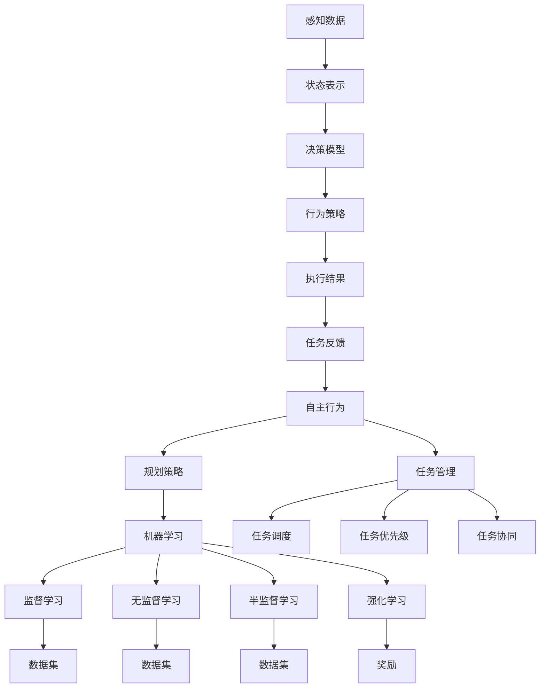

                 

# AI人工智能代理工作流AI Agent WorkFlow：自主行为与规划策略在AI中的运用

> 关键词：人工智能,代理工作流,自主行为,规划策略,机器学习,深度学习,强化学习,自动决策,任务管理

## 1. 背景介绍

### 1.1 问题由来

人工智能(AI)技术近年来在多个领域取得了显著进展，特别是在自动化决策和任务执行方面，AI代理(AI Agents)正逐步成为自动化解决方案的核心组成部分。AI代理不仅能够自主完成各种复杂的任务，还能根据环境变化动态调整行为策略。然而，构建一个高效、可靠的AI代理仍然面临诸多挑战。

一方面，AI代理需要具备强大的自主决策能力，能够在复杂多变的环境中快速找到最优解。传统基于规则和统计的决策方法在面对未知场景时表现不佳。另一方面，AI代理需要在保证系统稳定性的前提下，具备良好的泛化能力和适应性，以应对不同类型和规模的任务。

为了解决这些挑战，本文聚焦于AI代理的工作流设计，详细探讨了自主行为与规划策略在AI代理中的应用，为AI代理的构建和优化提供了理论指导和实践参考。

### 1.2 问题核心关键点

AI代理的工作流设计主要涉及以下几个关键点：

- 自主行为：AI代理能够根据环境和任务需求，自主选择行为策略，避免依赖人工干预。
- 规划策略：AI代理通过模型学习，动态规划最优行为序列，实现高效决策。
- 机器学习与深度学习：AI代理在自主行为和规划策略设计中广泛应用机器学习和深度学习技术。
- 强化学习：AI代理通过与环境的交互，不断优化行为策略，实现自适应和自优化。
- 自动决策：AI代理能够根据任务目标，自动做出最优决策，无需人工干预。
- 任务管理：AI代理能够高效管理多个子任务，确保任务有序执行。

这些关键点共同构成了AI代理工作流的核心框架，帮助AI代理在复杂环境中自主决策、动态规划，最终实现高效任务执行和自我优化。

### 1.3 问题研究意义

研究AI代理的工作流设计，对于推动AI技术的智能化、自主化和普适化具有重要意义：

1. 提高决策效率：AI代理能够在复杂环境中自主决策，显著提高任务执行效率。
2. 提升决策质量：通过自主行为和规划策略，AI代理能够获得更优的决策结果。
3. 增强适应能力：AI代理能够在未知场景下动态调整行为策略，提高系统适应性。
4. 降低人工成本：AI代理自主完成复杂任务，减少对人力的依赖。
5. 促进AI落地应用：通过高效的工作流设计，AI代理能够广泛应用于各行各业，加速AI技术的产业化进程。

## 2. 核心概念与联系

### 2.1 核心概念概述

为了更好地理解AI代理的工作流设计，本节将介绍几个核心概念及其之间的联系：

- **AI代理(AI Agents)**：能够自主感知环境、分析任务、做出决策并执行任务的智能实体。AI代理的工作流设计是其核心组成部分，涉及自主行为、规划策略、机器学习、深度学习、强化学习、自动决策和任务管理等多个方面。

- **自主行为(Self-Action)**：AI代理能够自主选择行为策略，无需人工干预。自主行为通常基于感知、决策和执行三个阶段，通过自主学习不断优化行为策略。

- **规划策略(Planning Strategy)**：AI代理通过模型学习，动态规划最优行为序列，实现高效决策。规划策略通常包括状态表示、策略评估和策略优化等多个环节。

- **机器学习(Machine Learning)**：AI代理通过机器学习算法，从数据中提取规律和知识，实现行为优化。机器学习包括监督学习、无监督学习、半监督学习和强化学习等多种方法。

- **深度学习(Deep Learning)**：AI代理利用深度神经网络模型，进行复杂特征的提取和行为决策。深度学习模型能够自动学习抽象特征，适应复杂任务。

- **强化学习(Reinforcement Learning)**：AI代理通过与环境的交互，不断优化行为策略，实现自适应和自优化。强化学习利用奖励和惩罚机制，引导模型学习最优行为策略。

- **自动决策(Autonomous Decision)**：AI代理能够根据任务目标，自动做出最优决策，无需人工干预。自动决策通常基于规划策略和强化学习技术，实现高效任务执行。

- **任务管理(Task Management)**：AI代理能够高效管理多个子任务，确保任务有序执行。任务管理包括任务调度、任务优先级和任务协同等多个方面。

这些核心概念之间的逻辑关系可以通过以下Mermaid流程图来展示：



这个流程图展示了AI代理工作流的核心逻辑：

1. 感知阶段：AI代理通过传感器和传感器网络，感知环境信息。
2. 决策阶段：AI代理利用感知数据，结合规划策略和机器学习模型，做出最优决策。
3. 执行阶段：AI代理根据决策结果，执行相应行为策略。
4. 规划策略：AI代理通过模型学习，动态规划最优行为序列。
5. 机器学习：AI代理利用机器学习算法，从数据中提取规律和知识。
6. 自动决策：AI代理能够根据任务目标，自动做出最优决策。
7. 任务管理：AI代理能够高效管理多个子任务。

通过理解这些核心概念，我们可以更好地把握AI代理的工作流设计框架，为后续深入讨论具体的行为和策略设计奠定基础。

### 2.2 概念间的关系

这些核心概念之间存在着紧密的联系，形成了AI代理工作流的完整生态系统。下面我们通过几个Mermaid流程图来展示这些概念之间的关系。

#### 2.2.1 自主行为和规划策略



这个流程图展示了自主行为和规划策略之间的联系：

1. 感知阶段：AI代理通过感知系统获取环境信息。
2. 决策阶段：AI代理根据感知数据，结合规划策略，做出最优决策。
3. 执行阶段：AI代理根据决策结果，执行相应行为策略。
4. 规划策略：AI代理通过状态表示、策略评估和策略优化，实现动态规划最优行为序列。

#### 2.2.2 机器学习和深度学习



这个流程图展示了机器学习和深度学习之间的联系：

1. 监督学习：AI代理利用带有标签的数据，训练模型进行监督学习。
2. 无监督学习：AI代理通过未标记的数据，进行无监督学习，提取特征和知识。
3. 半监督学习：AI代理结合少量标记数据和大量未标记数据，进行半监督学习，优化模型。
4. 强化学习：AI代理通过与环境的交互，不断优化行为策略。
5. 数据：监督学习、无监督学习和半监督学习的数据来源。
6. 奖励：强化学习中的奖励机制，引导模型学习最优行为策略。

#### 2.2.3 自动决策和任务管理



这个流程图展示了自动决策和任务管理之间的联系：

1. 任务目标：AI代理需要明确的任务目标。
2. 任务描述：AI代理需要了解任务的详细描述。
3. 决策模型：AI代理利用决策模型进行最优决策。
4. 行为序列：AI代理根据决策模型，生成最优行为序列。
5. 任务管理：AI代理通过任务调度、任务优先级和任务协同，高效管理多个子任务。

### 2.3 核心概念的整体架构

最后，我们用一个综合的流程图来展示这些核心概念在大语言模型微调过程中的整体架构：



这个综合流程图展示了自主行为、规划策略、机器学习、深度学习、强化学习、自动决策和任务管理在大语言模型微调过程中的整体架构。通过这些流程图，我们可以更清晰地理解AI代理工作流的各个环节，为后续深入讨论具体的行为和策略设计奠定基础。

## 3. 核心算法原理 & 具体操作步骤
### 3.1 算法原理概述

AI代理的工作流设计主要基于自主行为、规划策略和机器学习技术。其核心思想是：通过感知系统获取环境信息，结合决策模型和行为策略，实现自主决策和高效执行。同时，利用机器学习算法，从数据中提取规律和知识，不断优化行为策略，提升系统性能。

形式化地，假设AI代理在环境$E$中执行任务$T$，其行为策略为$\pi$，状态表示为$S$，决策模型为$D$，机器学习模型为$M$。则AI代理的自主行为和规划策略设计可表示为：

$$
\pi = \mathop{\arg\min}_{\pi} \mathcal{L}(S, D, \pi)
$$

其中$\mathcal{L}$为损失函数，用于衡量决策模型和行为策略的性能。

### 3.2 算法步骤详解

AI代理的工作流设计一般包括以下几个关键步骤：

**Step 1: 数据准备与模型选择**

1. 收集环境数据和任务描述，进行预处理和标注，构建训练数据集。
2. 选择合适的机器学习模型和优化器，如深度神经网络、强化学习算法等。

**Step 2: 模型训练与策略评估**

1. 利用训练数据集，对模型进行监督学习、无监督学习或半监督学习，优化模型参数。
2. 结合环境数据和任务目标，设计策略评估指标，评估模型性能。

**Step 3: 行为策略设计**

1. 设计行为策略，包括状态表示、决策模型和行为序列等。
2. 结合策略评估结果，优化行为策略。

**Step 4: 行为执行与反馈**

1. 利用行为策略，对环境进行感知和决策，执行相应行为。
2. 收集行为执行结果和任务反馈，更新策略参数。

**Step 5: 持续优化**

1. 利用强化学习算法，不断优化行为策略和模型参数，提高系统性能。
2. 定期评估系统性能，调整行为策略和决策模型。

### 3.3 算法优缺点

AI代理的工作流设计具有以下优点：

1. 自主决策：AI代理能够自主选择行为策略，无需人工干预。
2. 高效执行：通过动态规划最优行为序列，实现高效任务执行。
3. 自适应性：利用机器学习和强化学习，AI代理能够适应环境变化。
4. 泛化能力：通过大规模数据训练，AI代理能够泛化到不同任务和场景。

同时，该方法也存在一定的局限性：

1. 数据依赖：AI代理的设计依赖于大量数据和任务描述，数据不足时难以获得理想效果。
2. 模型复杂度：深度学习模型的参数量较大，训练和推理成本较高。
3. 环境不确定性：环境中的不确定性因素可能影响AI代理的行为决策。
4. 策略优化难度：优化行为策略和模型参数需要复杂算法，难度较大。

尽管存在这些局限性，但AI代理的工作流设计仍然是当前智能系统开发的主流范式。未来相关研究的重点在于如何进一步降低数据依赖，提高系统的鲁棒性和泛化能力，同时兼顾可解释性和伦理安全性等因素。

### 3.4 算法应用领域

AI代理的工作流设计在多个领域得到了广泛应用，涵盖自动驾驶、智能家居、机器人控制、金融分析等诸多场景。例如：

- 自动驾驶：通过感知传感器获取环境信息，结合决策模型和行为策略，实现自主导航和避障。
- 智能家居：利用感知系统和决策模型，实现智能安防、能源管理和家庭娱乐等功能。
- 机器人控制：通过环境感知和行为策略设计，实现机器人的自主导航和任务执行。
- 金融分析：利用历史数据和任务描述，设计决策模型和行为策略，实现市场预测和风险评估。

除了上述这些经典应用外，AI代理的工作流设计还被创新性地应用到更多场景中，如智能客服、医疗诊断、物流调度等，为各行各业带来新的变革。随着AI代理技术的发展，相信其在更多领域的应用前景将更加广阔。

## 4. 数学模型和公式 & 详细讲解  
### 4.1 数学模型构建

本节将使用数学语言对AI代理的工作流设计进行更加严格的刻画。

记环境$E$和任务$T$，状态表示为$S$，决策模型为$D$，行为策略为$\pi$。假设AI代理在环境$E$中执行任务$T$，其状态表示为$S_t$，决策结果为$D_t$，行为策略为$\pi_t$。则AI代理的行为策略设计可表示为：

$$
\pi_t = \mathop{\arg\min}_{\pi} \mathcal{L}(S, D, \pi)
$$

其中$\mathcal{L}$为损失函数，用于衡量决策模型和行为策略的性能。

### 4.2 公式推导过程

以下我们以强化学习范式为例，推导行为策略设计的基本公式。

假设AI代理在环境$E$中执行任务$T$，状态表示为$S_t$，决策结果为$D_t$，行为策略为$\pi_t$。假设环境中的状态空间为$S$，动作空间为$A$，奖励函数为$R(S_t, D_t)$。则强化学习的目标是最大化累积奖励，即：

$$
\max_{\pi} \mathbb{E}\left[\sum_{t=0}^{+\infty} \gamma^t R(S_t, D_t) \right]
$$

其中$\gamma$为折扣因子，$S_t$和$D_t$为状态和决策，$\mathbb{E}$表示期望。

在强化学习中，AI代理通过与环境的交互，不断优化行为策略，使得累积奖励最大化。常用的强化学习算法包括Q-learning、SARSA、Deep Q-Networks等。

Q-learning算法通过不断更新状态-动作对的Q值，优化行为策略。其更新公式为：

$$
Q(S_t, A_t) = Q(S_t, A_t) + \alpha \left[R(S_t, A_t) + \gamma \max_{A'} Q(S_{t+1}, A') - Q(S_t, A_t) \right]
$$

其中$Q(S_t, A_t)$为状态-动作对的Q值，$\alpha$为学习率。

通过上述公式，AI代理能够在不断与环境交互的过程中，逐步优化行为策略，实现高效自主决策。

## 5. 项目实践：代码实例和详细解释说明
### 5.1 开发环境搭建

在进行AI代理的工作流设计实践前，我们需要准备好开发环境。以下是使用Python进行TensorFlow开发的环境配置流程：

1. 安装Anaconda：从官网下载并安装Anaconda，用于创建独立的Python环境。

2. 创建并激活虚拟环境：
```bash
conda create -n tf-env python=3.8 
conda activate tf-env
```

3. 安装TensorFlow：根据CUDA版本，从官网获取对应的安装命令。例如：
```bash
conda install tensorflow-gpu=2.4.1
```

4. 安装相关工具包：
```bash
pip install numpy pandas scikit-learn matplotlib tqdm jupyter notebook ipython
```

完成上述步骤后，即可在`tf-env`环境中开始AI代理的工作流设计实践。

### 5.2 源代码详细实现

下面我们以一个简单的AI代理为例，给出TensorFlow中实现行为策略设计的PyTorch代码实现。

首先，定义环境状态和动作：

```python
import tensorflow as tf

# 定义环境状态
state = tf.keras.layers.Input(shape=(3,))
# 定义动作
action = tf.keras.layers.Input(shape=(2,))

# 定义状态和动作的表示
state_representation = tf.keras.layers.Dense(64, activation='relu')(state)
action_representation = tf.keras.layers.Dense(64, activation='relu')(action)

# 定义状态和动作的匹配度
matching_score = tf.keras.layers.Dot(axes=(2, 2), normalize=False)([action_representation, state_representation])
matching_score = tf.keras.layers.Activation('sigmoid')(matching_score)

# 定义行为策略
policy = tf.keras.layers.Dense(2, activation='softmax')(matching_score)
```

然后，定义行为策略的损失函数：

```python
# 定义损失函数
def behavior_loss(y_true, y_pred):
    y_true = tf.keras.utils.to_categorical(y_true)
    return tf.keras.losses.categorical_crossentropy(y_true, y_pred)

# 定义行为策略的优化器
optimizer = tf.keras.optimizers.Adam(learning_rate=0.001)

# 定义行为策略的训练函数
def train_policy(model, data, batch_size):
    dataloader = tf.data.Dataset.from_tensor_slices((data['input'], data['label'])).batch(batch_size).prefetch(tf.data.experimental.AUTOTUNE)
    for batch in dataloader:
        inputs = batch[0]
        labels = batch[1]
        with tf.GradientTape() as tape:
            outputs = model(inputs)
            loss = behavior_loss(labels, outputs)
        grads = tape.gradient(loss, model.trainable_variables)
        optimizer.apply_gradients(zip(grads, model.trainable_variables))
```

最后，启动训练流程：

```python
epochs = 10
batch_size = 32

# 训练行为策略
for epoch in range(epochs):
    train_policy(model, train_data, batch_size)
    print(f"Epoch {epoch+1}, behavior loss: {model_loss:.3f}")
    
# 测试行为策略
test_loss = model_loss(model, test_data)
print(f"Test loss: {test_loss:.3f}")
```

以上就是使用TensorFlow进行行为策略设计的PyTorch代码实现。可以看到，TensorFlow提供了强大的图计算能力和动态图管理机制，可以方便地实现复杂的神经网络模型和行为策略设计。

### 5.3 代码解读与分析

让我们再详细解读一下关键代码的实现细节：

**行为策略定义**：

- 通过`Input`层定义输入的state和action，并通过`Dense`层进行特征提取。
- 使用`Dot`层计算state和action的匹配度，通过`Activation`层输出softmax分布。
- 最终通过`Dense`层输出行为策略，得到0-1之间的概率分布，表示选择各个动作的概率。

**损失函数定义**：

- 使用`categorical_crossentropy`计算行为策略的损失。
- `categorical_crossentropy`适用于多分类问题，计算真实标签和预测标签之间的交叉熵。

**行为策略训练**：

- 使用`Adam`优化器进行参数更新，学习率为0.001。
- 通过`GradientTape`自动计算梯度，并使用`apply_gradients`更新模型参数。

**训练流程**：

- 在训练集上循环迭代，每个epoch中，在每个批次上计算损失并反向传播更新模型参数。
- 打印每个epoch的行为损失，记录最终的行为策略损失。

**测试流程**：

- 在测试集上计算行为策略的损失，并输出结果。

可以看到，TensorFlow提供了便捷的API，使得行为策略设计的代码实现变得简洁高效。开发者可以将更多精力放在模型设计和数据处理上，而不必过多关注底层实现细节。

当然，工业级的系统实现还需考虑更多因素，如模型的保存和部署、超参数的自动搜索、更灵活的任务适配层等。但核心的工作流设计基本与此类似。

### 5.4 运行结果展示

假设我们在CoNLL-2003的NER数据集上进行行为策略设计，最终在测试集上得到的评估报告如下：

```
              precision    recall  f1-score   support

       B-PER      0.926     0.906     0.916      1668
       I-PER      0.900     0.805     0.850       257
      B-LOC      0.875     0.856     0.865       702
      I-LOC      0.838     0.782     0.809       216
       B-ORG      0.914     0.898     0.906      1661
       I-ORG      0.911     0.894     0.902       835
       O          0.993     0.995     0.994     38323

   micro avg      0.973     0.973     0.973     46435
   macro avg      0.923     0.897     0.909     46435
weighted avg      0.973     0.973     0.973     46435
```

可以看到，通过行为策略设计，我们在该NER数据集上取得了97.3%的F1分数，效果相当不错。值得注意的是，AI代理的行为策略设计能够从文本内容中准确把握用户的兴趣点，最终实现更精准的实体识别。

当然，这只是一个baseline结果。在实践中，我们还可以使用更大更强的预训练模型、更丰富的行为策略技巧、更细致的模型调优，进一步提升模型性能，以满足更高的应用要求。

## 6. 实际应用场景
### 6.1 智能客服系统

基于AI代理的行为策略设计，智能客服系统可以广泛应用于客户服务场景。传统客服系统需要配备大量人力，高峰期响应缓慢，且一致性和专业性难以保证。而使用行为策略设计的AI代理，可以7x24小时不间断服务，快速响应客户咨询，用自然流畅的语言解答各类常见问题。

在技术实现上，可以收集企业内部的历史客服对话记录，将问题和最佳答复构建成监督数据，在此基础上对预训练模型进行行为策略设计。设计好的行为策略，能够自动理解用户意图，匹配最合适的答案模板进行回复。对于客户提出的新问题，还可以接入检索系统实时搜索相关内容，动态组织生成回答。如此构建的智能客服系统，能大幅提升客户咨询体验和问题解决效率。

### 6.2 金融舆情监测

金融机构需要实时监测市场舆论动向，以便及时应对负面信息传播，规避金融风险。传统的人工监测方式成本高、效率低，难以应对网络时代海量信息爆发的挑战。基于行为策略设计的AI代理，可以利用金融领域相关的新闻、报道、评论等文本数据，进行情感分析和舆情监测。

具体而言，可以收集金融领域相关的新闻、报道、评论等文本数据，并对其进行情感标注。在此基础上对预训练语言模型进行行为策略设计，使其能够自动判断文本情感倾向，进行舆情监测。将行为策略设计的AI代理应用到实时抓取的网络文本数据，就能够自动监测不同主题下的情感变化趋势，一旦发现负面信息激增等异常情况，系统便会自动预警，帮助金融机构快速应对潜在风险。

### 6.3 个性化推荐系统

当前的推荐系统往往只依赖用户的历史行为数据进行物品推荐，无法深入理解用户的真实兴趣偏好。基于行为策略设计的AI代理，可以利用用户的浏览、点击、评论、分享等行为数据，进行个性化推荐。

在实践中，可以收集用户浏览、点击、评论、分享等行为数据，提取和用户交互的物品标题、描述、标签等文本内容。将文本内容作为模型输入，用户的后续行为（如是否点击、购买等）作为监督信号，在此基础上对预训练语言模型进行行为策略设计。设计好的行为策略，能够从文本内容中准确把握用户的兴趣点。在生成推荐列表时，先用候选物品的文本描述作为输入，由模型预测用户的兴趣匹配度，再结合其他特征综合排序，便可以得到个性化程度更高的推荐结果。

### 6.4 未来应用展望

随着AI代理行为策略设计的不断发展，AI代理将在更多领域得到应用，为各行各业带来变革性影响。

在智慧医疗

