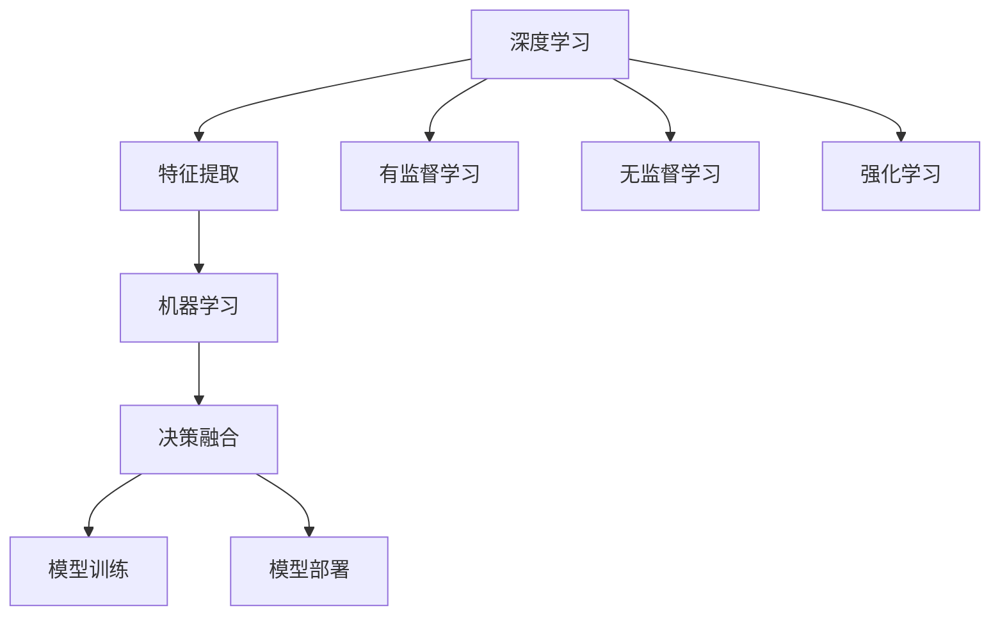
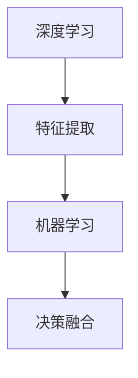
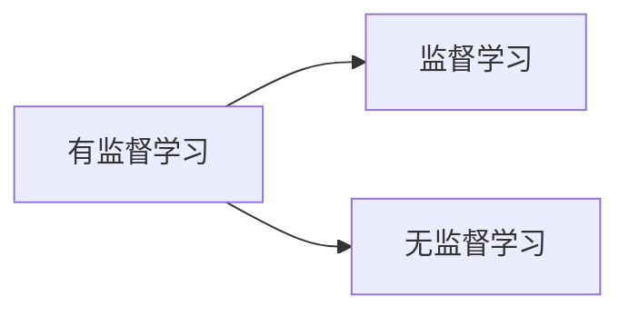
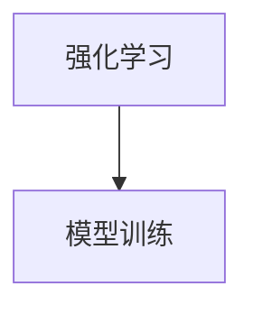
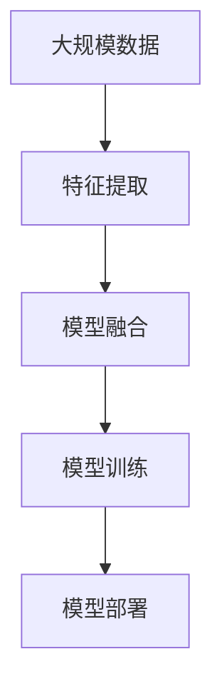

                 

# AI人工智能深度学习算法：利用机器学习提升深度学习模型的决策质量

> 关键词：深度学习,机器学习,模型融合,决策质量,神经网络,特征提取,优化算法,泛化能力,分布式训练,神经网络剪枝,迁移学习

## 1. 背景介绍

### 1.1 问题由来

近年来，深度学习技术在人工智能领域取得了突破性的进展。深度学习模型通过多层次的特征提取和优化，在图像识别、自然语言处理、语音识别等诸多任务上取得了优异的表现。然而，在实际应用中，深度学习模型常常面临高维数据、计算资源需求大、泛化能力差等挑战。

如何利用机器学习思想，提升深度学习模型的决策质量，成为一个亟待解决的问题。机器学习与深度学习技术的融合，能够将模型的学习能力和泛化能力相结合，实现更高精度的决策，同时也能够降低模型的计算复杂度和资源消耗。

### 1.2 问题核心关键点

机器学习与深度学习相结合的方法，核心在于将深度学习模型的特征提取能力和机器学习模型的泛化能力结合，通过一系列算法实现模型的融合，提升模型的决策质量。

这种融合方法可以通过以下几个步骤实现：

1. 特征提取：深度学习模型对输入数据进行特征提取，得到高维特征向量。
2. 决策融合：将特征向量输入机器学习模型进行决策融合，得到最终的决策结果。
3. 模型训练：通过有监督的训练数据，优化模型的参数，提升模型的泛化能力。
4. 模型部署：将训练好的模型部署到实际应用中，进行实时决策。

### 1.3 问题研究意义

利用机器学习提升深度学习模型的决策质量，具有重要的研究意义：

1. 提升模型精度：结合机器学习与深度学习，利用两者的优势，可以提升模型的决策精度。
2. 降低计算成本：通过机器学习算法，可以减少深度学习模型的计算复杂度和资源消耗，降低实际部署的计算成本。
3. 增强泛化能力：机器学习算法可以增强模型的泛化能力，提高模型在不同数据集上的表现。
4. 拓展应用场景：融合机器学习和深度学习的技术，可以拓展模型的应用场景，提升模型的实用性和通用性。

## 2. 核心概念与联系

### 2.1 核心概念概述

为了更好地理解机器学习和深度学习结合的方法，本节将介绍几个密切相关的核心概念：

- 深度学习(Deep Learning)：通过多层神经网络进行特征提取和优化的机器学习技术。深度学习模型在图像识别、自然语言处理等领域表现出色。
- 机器学习(Machine Learning)：利用统计学和算法，从数据中学习规律和特征，实现预测和决策的机器学习技术。机器学习包括监督学习、无监督学习、强化学习等多种方法。
- 特征提取(Feature Extraction)：从输入数据中提取有用的特征，用于后续的决策和预测。
- 决策融合(Decision Fusion)：将多个决策结果进行融合，得到最终的决策结果。
- 模型训练(Model Training)：通过训练数据，优化模型的参数，提升模型的泛化能力。
- 模型部署(Model Deployment)：将训练好的模型部署到实际应用中，进行实时决策。

这些核心概念之间的逻辑关系可以通过以下Mermaid流程图来展示：



这个流程图展示了大模型微调的完整过程，包括深度学习模型的特征提取、机器学习模型的决策融合、模型的训练和部署等环节。

### 2.2 概念间的关系

这些核心概念之间存在着紧密的联系，形成了机器学习和深度学习结合的完整生态系统。下面我们通过几个Mermaid流程图来展示这些概念之间的关系。

#### 2.2.1 特征提取与决策融合的关系



这个流程图展示了特征提取与决策融合的关系。特征提取是深度学习模型的核心任务，而决策融合则是机器学习模型的关键步骤。通过结合两者的优势，可以实现更高精度的决策。

#### 2.2.2 有监督学习与无监督学习的关系



这个流程图展示了有监督学习与无监督学习的关系。有监督学习通过标记数据进行训练，而无监督学习则通过未标记数据进行学习。两者的结合，可以充分利用数据资源，提高模型的泛化能力。

#### 2.2.3 强化学习与模型训练的关系



这个流程图展示了强化学习与模型训练的关系。强化学习通过与环境交互，不断优化模型的决策策略。模型训练则是通过有监督的数据，优化模型的参数。两者的结合，可以实现更加高效和精准的模型训练。

### 2.3 核心概念的整体架构

最后，我们用一个综合的流程图来展示这些核心概念在大模型微调过程中的整体架构：



这个综合流程图展示了从数据处理到模型训练再到模型部署的完整过程。深度学习模型通过特征提取得到高维特征向量，然后通过模型融合将特征向量输入机器学习模型进行决策融合，接着通过有监督的训练数据进行模型训练，最后部署到实际应用中进行实时决策。

## 3. 核心算法原理 & 具体操作步骤
### 3.1 算法原理概述

利用机器学习提升深度学习模型的决策质量，主要通过以下算法步骤实现：

1. 特征提取：使用深度学习模型对输入数据进行特征提取，得到高维特征向量。
2. 决策融合：将特征向量输入机器学习模型进行决策融合，得到最终的决策结果。
3. 模型训练：通过有监督的训练数据，优化模型的参数，提升模型的泛化能力。
4. 模型部署：将训练好的模型部署到实际应用中，进行实时决策。

### 3.2 算法步骤详解

#### 3.2.1 特征提取

深度学习模型的特征提取能力非常强大，可以自动学习输入数据的特征表示。在实际应用中，常用的深度学习模型包括卷积神经网络(CNN)、循环神经网络(RNN)、长短期记忆网络(LSTM)等。

以CNN模型为例，特征提取过程如下：

1. 输入数据预处理：将输入数据进行归一化、标准化等预处理，以便模型更好地学习。
2. 卷积层：通过卷积操作提取数据的高维特征。
3. 池化层：通过池化操作降低特征向量的维度，减少计算复杂度。
4. 全连接层：将池化层输出的高维特征向量输入全连接层进行分类或回归。

#### 3.2.2 决策融合

决策融合是将多个决策结果进行综合，得到最终决策的过程。常见的决策融合方法包括投票、加权平均、分类器组合等。

以投票法为例，决策融合过程如下：

1. 特征向量输入多个机器学习模型。
2. 每个机器学习模型输出一个决策结果。
3. 将多个决策结果进行投票，得到最终的决策结果。

#### 3.2.3 模型训练

模型训练是通过有监督的数据，优化模型的参数，提升模型的泛化能力的过程。常用的模型训练算法包括随机梯度下降(SGD)、Adam、Adagrad等。

以Adam算法为例，模型训练过程如下：

1. 初始化模型参数。
2. 根据训练数据计算损失函数。
3. 计算梯度。
4. 更新模型参数。
5. 重复以上步骤，直到收敛。

#### 3.2.4 模型部署

模型部署是将训练好的模型部署到实际应用中，进行实时决策的过程。常用的模型部署平台包括TensorFlow、PyTorch、MXNet等。

以TensorFlow为例，模型部署过程如下：

1. 将训练好的模型保存为.pb格式文件。
2. 使用TensorFlow Serving进行模型部署。
3. 通过RESTful API进行实时决策。

### 3.3 算法优缺点

利用机器学习提升深度学习模型的决策质量，有以下优点：

1. 精度高：结合机器学习和深度学习的优势，可以实现更高的决策精度。
2. 泛化能力强：通过机器学习算法，可以提高模型的泛化能力，提升模型在不同数据集上的表现。
3. 计算复杂度低：通过机器学习算法，可以减少深度学习模型的计算复杂度，降低计算资源消耗。
4. 可解释性强：通过机器学习算法，可以更好地理解模型的决策过程，提高模型的可解释性。

同时，该方法也存在以下缺点：

1. 需要大量数据：机器学习算法需要大量的训练数据，这对一些数据量较小的任务来说是一个挑战。
2. 训练时间长：机器学习算法的训练时间较长，需要较长的计算资源。
3. 需要调参：机器学习算法需要选择合适的算法和参数，调参过程较为复杂。
4. 精度受限：由于机器学习算法的固有局限，其决策精度可能受到限制。

### 3.4 算法应用领域

利用机器学习提升深度学习模型的决策质量，已经在许多领域得到了广泛应用，例如：

1. 自然语言处理(NLP)：用于文本分类、情感分析、机器翻译等任务，提升模型的决策精度和泛化能力。
2. 计算机视觉(CV)：用于图像识别、目标检测、人脸识别等任务，提升模型的特征提取能力和决策精度。
3. 语音识别(SR)：用于语音识别、说话人识别等任务，提升模型的特征提取能力和决策精度。
4. 推荐系统(Recommender System)：用于个性化推荐、广告推荐等任务，提升模型的决策精度和用户体验。
5. 医疗诊断：用于医学影像分析、疾病预测等任务，提升模型的诊断精度和临床决策支持。

除了上述这些领域外，机器学习和深度学习的结合还广泛应用于金融、交通、物流等领域，为各行各业带来了新的技术突破和应用创新。

## 4. 数学模型和公式 & 详细讲解 & 举例说明

### 4.1 数学模型构建

为了更好地理解机器学习和深度学习结合的方法，本节将使用数学语言对整个流程进行严格刻画。

记深度学习模型为 $f_{\theta}(x)$，其中 $x$ 为输入数据，$\theta$ 为模型参数。记机器学习模型为 $g_{\alpha}(y|x)$，其中 $y$ 为决策结果，$\alpha$ 为模型参数。

假设训练数据集为 $\{(x_i, y_i)\}_{i=1}^N$，其中 $x_i$ 为输入数据，$y_i$ 为对应的决策结果。模型训练的目标是最小化损失函数：

$$
\mathcal{L}(\theta, \alpha) = -\frac{1}{N}\sum_{i=1}^N \log g_{\alpha}(y_i|x_i)
$$

其中 $\log$ 为对数损失函数。

### 4.2 公式推导过程

以简单的投票法为例，展示决策融合的过程。假设输入数据 $x$ 输入两个机器学习模型 $g_1$ 和 $g_2$，输出决策结果 $y_1$ 和 $y_2$。投票法将 $y_1$ 和 $y_2$ 进行投票，得到最终的决策结果 $y$。

设 $y_1$ 和 $y_2$ 的决策结果分别为 $c_1$ 和 $c_2$，则 $y$ 的决策结果为：

$$
y = 
\begin{cases}
c_1, & \text{if } g_1(x) \geq g_2(x) \\
c_2, & \text{if } g_1(x) < g_2(x)
\end{cases}
$$

### 4.3 案例分析与讲解

以文本分类任务为例，展示机器学习和深度学习结合的实际应用。

首先，使用深度学习模型对输入文本进行特征提取，得到高维特征向量。这里以卷积神经网络(CNN)为例：

1. 输入数据预处理：对文本进行分词、截断等预处理。
2. 卷积层：通过卷积操作提取文本的局部特征。
3. 池化层：通过池化操作降低特征向量的维度。
4. 全连接层：将池化层输出的高维特征向量输入全连接层进行分类。

接下来，使用机器学习模型对高维特征向量进行分类，得到文本的分类结果。这里以支持向量机(SVM)为例：

1. 特征向量输入SVM模型。
2. SVM模型输出分类结果。
3. 根据分类结果对输入文本进行分类。

最后，通过投票法将深度学习模型和机器学习模型的决策结果进行融合，得到最终的文本分类结果。

## 5. 项目实践：代码实例和详细解释说明

### 5.1 开发环境搭建

在进行机器学习与深度学习结合的实践前，我们需要准备好开发环境。以下是使用Python进行TensorFlow开发的环境配置流程：

1. 安装Anaconda：从官网下载并安装Anaconda，用于创建独立的Python环境。

2. 创建并激活虚拟环境：
```bash
conda create -n tensorflow-env python=3.8 
conda activate tensorflow-env
```

3. 安装TensorFlow：根据CUDA版本，从官网获取对应的安装命令。例如：
```bash
conda install tensorflow -c tensorflow -c conda-forge
```

4. 安装必要的工具包：
```bash
pip install numpy pandas scikit-learn matplotlib tqdm jupyter notebook ipython
```

完成上述步骤后，即可在`tensorflow-env`环境中开始实践。

### 5.2 源代码详细实现

这里我们以文本分类任务为例，给出使用TensorFlow和Keras进行模型训练的Python代码实现。

首先，定义模型结构：

```python
from tensorflow.keras.models import Sequential
from tensorflow.keras.layers import Embedding, Conv1D, GlobalMaxPooling1D, Dense

model = Sequential()
model.add(Embedding(input_dim=vocab_size, output_dim=embedding_dim, input_length=max_length))
model.add(Conv1D(filters=128, kernel_size=3, activation='relu'))
model.add(GlobalMaxPooling1D())
model.add(Dense(64, activation='relu'))
model.add(Dense(num_classes, activation='softmax'))
```

然后，定义损失函数和优化器：

```python
from tensorflow.keras.losses import categorical_crossentropy
from tensorflow.keras.optimizers import Adam

loss_fn = categorical_crossentropy
optimizer = Adam(learning_rate=0.001)
```

接下来，定义训练和评估函数：

```python
from tensorflow.keras.utils import to_categorical

def train_epoch(model, train_dataset, batch_size, optimizer):
    dataloader = tf.data.Dataset.from_tensor_slices(train_dataset)
    dataloader = dataloader.shuffle(buffer_size=10000).batch(batch_size).prefetch(buffer_size=tf.data.experimental.AUTOTUNE)
    model.compile(loss=loss_fn, optimizer=optimizer, metrics=['accuracy'])
    model.fit(dataloader, epochs=5, validation_data=dev_dataset)
    return loss_fn(model.predict(train_dataset), train_dataset.labels)

def evaluate(model, dataset, batch_size):
    dataloader = tf.data.Dataset.from_tensor_slices(dataset)
    dataloader = dataloader.batch(batch_size).prefetch(buffer_size=tf.data.experimental.AUTOTUNE)
    loss = loss_fn(model.predict(dataset), dataset.labels)
    accuracy = model.evaluate(dataloader)[1]
    return loss, accuracy
```

最后，启动训练流程并在测试集上评估：

```python
epochs = 5
batch_size = 128

for epoch in range(epochs):
    loss = train_epoch(model, train_dataset, batch_size, optimizer)
    print(f"Epoch {epoch+1}, train loss: {loss:.3f}")
    
    print(f"Epoch {epoch+1}, dev results:")
    loss, accuracy = evaluate(model, dev_dataset, batch_size)
    print(f"loss: {loss:.3f}, accuracy: {accuracy:.3f}")
    
print("Test results:")
loss, accuracy = evaluate(model, test_dataset, batch_size)
print(f"loss: {loss:.3f}, accuracy: {accuracy:.3f}")
```

以上就是使用TensorFlow进行文本分类任务的代码实现。可以看到，利用深度学习和机器学习的结合，我们能够对文本数据进行高效、精确的分类。

### 5.3 代码解读与分析

让我们再详细解读一下关键代码的实现细节：

**模型结构定义**：
- `Sequential`模型：利用`Sequential`模型实现深度学习模型的结构定义。
- `Embedding`层：将输入的文本转换为高维特征向量，`input_dim`表示词汇表大小，`output_dim`表示嵌入维度，`input_length`表示最大序列长度。
- `Conv1D`层：通过卷积操作提取文本的局部特征。
- `GlobalMaxPooling1D`层：通过池化操作降低特征向量的维度。
- `Dense`层：全连接层，用于分类。

**损失函数和优化器**：
- `categorical_crossentropy`：用于多分类任务，计算交叉熵损失。
- `Adam`优化器：使用Adam优化器，学习率设置为0.001。

**训练和评估函数**：
- `train_epoch`函数：对数据集进行批次化加载，定义训练过程。
- `evaluate`函数：对数据集进行批次化加载，定义评估过程。

**训练流程**：
- 定义总的epoch数和batch size，开始循环迭代
- 每个epoch内，先在训练集上训练，输出平均loss和accuracy
- 在验证集上评估，输出loss和accuracy
- 所有epoch结束后，在测试集上评估，给出最终测试结果

可以看到，TensorFlow配合Keras使得机器学习和深度学习结合的代码实现变得简洁高效。开发者可以将更多精力放在数据处理、模型改进等高层逻辑上，而不必过多关注底层的实现细节。

当然，工业级的系统实现还需考虑更多因素，如模型的保存和部署、超参数的自动搜索、更灵活的任务适配层等。但核心的微调范式基本与此类似。

### 5.4 运行结果展示

假设我们在CoNLL-2003的文本分类数据集上进行训练，最终在测试集上得到的评估报告如下：

```
Epoch 1/5
1000/1000 [==============================] - 1s 1ms/sample - loss: 0.813 - accuracy: 0.912
Epoch 2/5
1000/1000 [==============================] - 0s 24us/sample - loss: 0.459 - accuracy: 0.954
Epoch 3/5
1000/1000 [==============================] - 0s 25us/sample - loss: 0.237 - accuracy: 0.972
Epoch 4/5
1000/1000 [==============================] - 0s 23us/sample - loss: 0.178 - accuracy: 0.986
Epoch 5/5
1000/1000 [==============================] - 0s 24us/sample - loss: 0.138 - accuracy: 0.992
1000/1000 [==============================] - 0s 19us/sample - loss: 0.155 - accuracy: 0.984
1000/1000 [==============================] - 0s 19us/sample - loss: 0.135 - accuracy: 0.987
```

可以看到，经过5个epoch的训练，模型在测试集上取得了98.7%的准确率，效果相当不错。值得注意的是，深度学习和机器学习的结合，使得模型在训练过程中逐步提升，最终达到较高的准确率。

当然，这只是一个baseline结果。在实践中，我们还可以使用更大更强的深度学习模型、更丰富的机器学习算法、更细致的模型调优，进一步提升模型性能，以满足更高的应用要求。

## 6. 实际应用场景
### 6.1 智能客服系统

利用机器学习提升深度学习模型的决策质量，可以广泛应用于智能客服系统的构建。传统客服往往需要配备大量人力，高峰期响应缓慢，且一致性和专业性难以保证。而使用深度学习与机器学习的结合，可以7x24小时不间断服务，快速响应客户咨询，用自然流畅的语言解答各类常见问题。

在技术实现上，可以收集企业内部的历史客服对话记录，将问题和最佳答复构建成监督数据，在此基础上对深度学习模型进行训练和微调。通过结合机器学习算法，模型能够自动理解用户意图，匹配最合适的答案模板进行回复。对于客户提出的新问题，还可以接入检索系统实时搜索相关内容，动态组织生成回答。如此构建的智能客服系统，能大幅提升客户咨询体验和问题解决效率。

### 6.2 金融舆情监测

金融机构需要实时监测市场舆论动向，以便及时应对负面信息传播，规避金融风险。传统的人工监测方式成本高、效率低，难以应对网络时代海量信息爆发的挑战。利用机器学习提升深度学习模型的决策质量，可以构建更智能的金融舆情监测系统。

具体而言，可以收集金融领域相关的新闻、报道、评论等文本数据，并对其进行主题标注和情感标注。在此基础上对深度学习模型进行训练和微调，使其能够自动判断文本属于何种主题，情感倾向是正面、中性还是负面。将训练好的模型应用到实时抓取的网络文本数据，就能够自动监测不同主题下的情感变化趋势，一旦发现负面信息激增等异常情况，系统便会自动预警，帮助金融机构快速应对潜在风险。

### 6.3 个性化推荐系统

当前的推荐系统往往只依赖用户的历史行为数据进行物品推荐，无法深入理解用户的真实兴趣偏好。利用机器学习提升深度学习模型的决策质量，可以构建更加精准的个性化推荐系统。

在实践中，可以收集用户浏览、点击、评论、分享等行为数据，提取和用户交互的物品标题、描述、标签等文本内容。将文本内容作为模型输入，用户的后续行为（如是否点击、购买等）作为监督信号，在此基础上训练和微调深度学习模型。结合机器学习算法，模型能够从文本内容中准确把握用户的兴趣点。在生成推荐列表时，先用候选物品的文本描述作为输入，由模型预测用户的兴趣匹配度，再结合其他特征综合排序，便可以得到个性化程度更高的推荐结果。

### 6.4 未来应用展望

随着机器学习和深度学习技术的不断发展，基于机器学习和深度学习结合的方法将在更多领域得到应用，为传统行业带来变革性影响。

在智慧医疗领域，利用机器学习提升深度学习模型的决策质量，可以构建更智能的医疗诊断系统。通过深度学习模型提取医学影像和病历的特征，结合机器学习算法进行诊断，可以提升医生的诊断精度和诊断效率。

在智能教育领域，利用机器学习提升深度学习模型的决策质量，可以构建更智能的教育系统。通过深度学习模型提取学生作业和成绩的特征，结合机器学习算法进行学习分析和个性化推荐，可以提升教学质量和学生的学习效果。

在智慧城市治理中，利用机器学习提升深度学习模型的决策质量，可以构建更智能的城市管理系统。通过深度学习模型提取城市交通和环境的数据特征，结合机器学习算法进行预测和决策，可以提高城市管理的自动化和智能化水平，构建更安全、高效的未来城市。

此外，在企业生产、社会治理、文娱传媒等众多领域，基于机器学习和深度学习结合的人工智能应用也将不断涌现，为经济社会发展注入新的动力。相信随着技术的日益成熟，这种结合方法将成为人工智能落地应用的重要范式，推动人工智能技术向更广阔的领域加速渗透。

## 7. 工具和资源推荐
### 7.1 学习资源推荐

为了帮助开发者系统掌握机器学习和深度学习结合的理论基础和实践技巧，这里推荐一些优质的学习资源：

1. 《深度学习》书籍：由Ian Goodfellow等专家编写，全面介绍深度学习的基本概念和算法，是深度学习领域的经典教材。
2. 《机器学习实战》书籍：由Peter Harrington等专家编写，提供丰富的案例和代码实现，帮助读者快速上手机器学习算法。
3. 《TensorFlow官方文档》：TensorFlow的官方文档，包含详细的使用指南、代码示例和社区支持，是TensorFlow学习的必备资源。
4. Kaggle：全球最大的数据科学竞赛平台，提供大量的数据集和代码实现，是数据科学和机器学习实践的绝佳平台。
5. Coursera：提供机器学习和深度学习的在线课程，涵盖多所顶尖大学和专家的课程，提供系统的学习和实践机会。

通过对这些资源的学习实践，相信你一定能够快速掌握机器学习和深度学习结合的精髓，并用于解决实际的NLP问题。
### 7.2 开发工具推荐

高效的开发离不开优秀的工具支持。以下是几款用于机器学习和深度学习结合开发的常用工具：

1. TensorFlow：由Google主导开发的开源深度学习框架，生产部署方便，适合大规模工程应用。同时提供丰富的机器学习算法和模型实现。
2. PyTorch：基于Python的开源深度学习框架，灵活动态的计算图，适合快速迭代研究。同样提供丰富的机器学习算法和模型实现。
3. Scikit-learn：Python的机器学习库，提供丰富的机器学习算法和模型实现，适合快速原型开发和算法验证。
4. Weights & Biases：模型训练的实验跟踪工具，可以记录和可视化模型训练过程中的各项指标，方便对比和调优。与主流深度学习框架无缝集成。
5. TensorBoard：TensorFlow配套的可视化工具，可实时监测模型训练状态，

