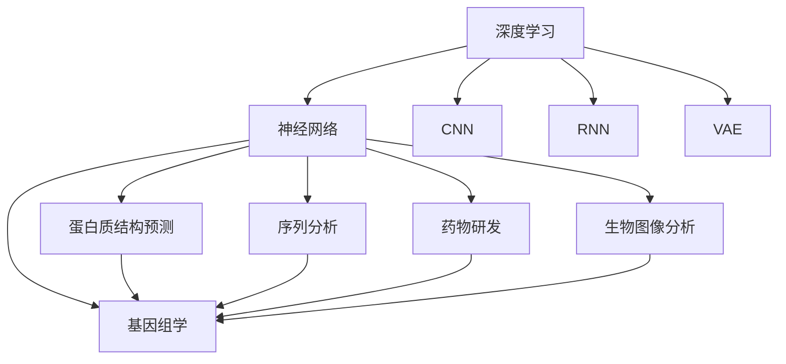
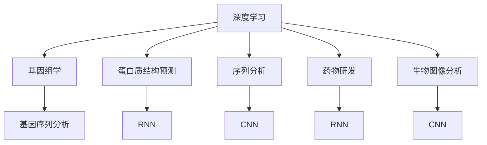
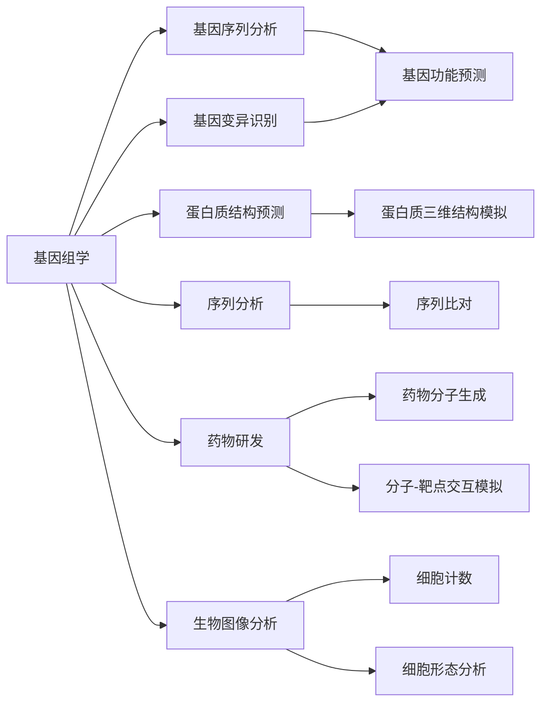
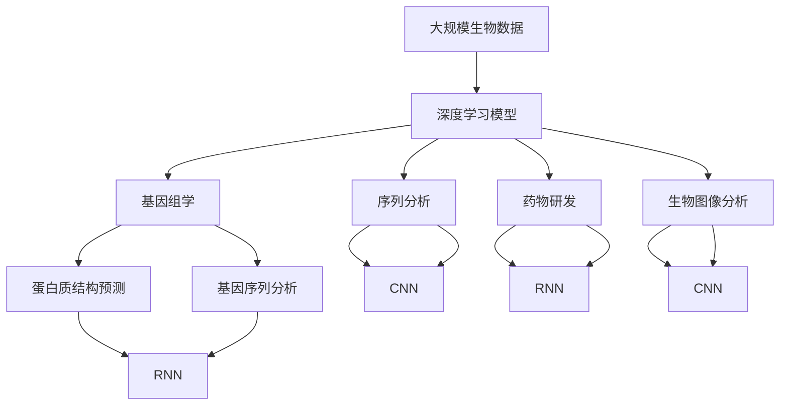

                 

# AI人工智能深度学习算法：在生物信息学中的应用

> 关键词：
深度学习, 生物信息学, 神经网络, 基因组学, 蛋白质结构预测, 序列分析

## 1. 背景介绍

### 1.1 问题由来
随着生物信息学的快速发展，大规模数据集的生成和处理成为该领域研究的关键。传统的统计分析方法无法有效应对海量的生物数据，而基于深度学习的算法通过自适应特征提取和高效数据建模，在生物信息学中取得了显著的成果。特别是近年来，深度学习技术在基因组学、蛋白质结构预测、序列分析等诸多生物信息学问题上取得了突破，推动了该领域的科学研究和实际应用。

### 1.2 问题核心关键点
深度学习在生物信息学中的应用，主要集中在以下几方面：

1. **基因组学**：通过深度学习模型分析基因序列数据，识别基因变异、预测基因功能等。
2. **蛋白质结构预测**：利用卷积神经网络(CNN)、循环神经网络(RNN)、变分自编码器(VAE)等模型，预测蛋白质三维结构。
3. **序列分析**：包括DNA、RNA序列分类、序列比对等。
4. **药物研发**：利用深度学习模型进行药物分子生成、分子-靶点交互模拟等。
5. **生物图像分析**：如显微图像中的细胞计数、形态分析等。

### 1.3 问题研究意义
深度学习在生物信息学中的应用，对于推进生命科学研究的深度和广度，加速新药开发、个性化医疗等技术落地，具有重要意义：

1. **降低研究成本**：深度学习算法能够处理大规模数据，减少手动分析的工作量。
2. **提升研究精度**：深度学习模型能够学习数据的复杂特征，提高分析的准确性。
3. **加速技术创新**：深度学习提供了新的分析视角，促进了生物信息学的技术创新。
4. **推动医学应用**：深度学习在基因组学、蛋白质结构预测等领域的研究成果，直接推动了医学诊断和治疗的发展。

## 2. 核心概念与联系

### 2.1 核心概念概述

为更好地理解深度学习在生物信息学中的应用，本节将介绍几个关键概念：

- **深度学习**：指通过多层神经网络对数据进行建模和分析的一种机器学习方法。其核心在于通过学习数据的高层次特征，实现复杂的非线性映射。
- **神经网络**：由多个神经元组成的计算模型，通过前向传播和反向传播实现数据的学习和预测。
- **卷积神经网络(CNN)**：一种特殊的神经网络结构，适用于处理网格状数据，如图像、音频等。
- **循环神经网络(RNN)**：用于处理序列数据的神经网络结构，具有记忆功能，适用于时间序列分析。
- **变分自编码器(VAE)**：一种生成模型，通过编码器将输入数据压缩到潜在空间，解码器将潜在空间中的数据生成回原始空间，适用于数据生成和降维。
- **基因组学**：研究生物遗传信息的科学，包括基因序列分析、基因表达调控等。
- **蛋白质结构预测**：利用深度学习模型预测蛋白质三维结构，以理解蛋白质的功能和相互作用。
- **序列分析**：对DNA、RNA序列进行分析，以识别基因调控元件、基因变异等。
- **药物研发**：通过深度学习模型模拟药物分子与靶点的相互作用，优化药物设计。

这些概念之间的逻辑关系可以通过以下Mermaid流程图来展示：



这个流程图展示了大语言模型微调过程中各个概念的关系和作用：

1. 深度学习模型通过神经网络结构，能够对生物数据进行有效建模。
2. CNN适用于图像数据处理，RNN适用于序列数据处理。
3. VAE适用于数据生成和降维。
4. 深度学习在生物信息学的各个领域都有应用，包括基因组学、蛋白质结构预测、序列分析等。
5. 生物图像分析也是深度学习的一个重要应用领域。

### 2.2 概念间的关系

这些核心概念之间存在着紧密的联系，形成了深度学习在生物信息学中的应用生态系统。下面我们通过几个Mermaid流程图来展示这些概念之间的关系。

#### 2.2.1 深度学习在生物信息学中的应用



这个流程图展示了大语言模型微调的基本原理，以及其与生物信息学各个领域的联系：

1. 深度学习通过神经网络结构，能够对基因组学数据进行有效建模。
2. 序列分析通过CNN处理DNA、RNA序列数据。
3. 蛋白质结构预测通过RNN模型进行预测。
4. 药物研发通过RNN模型进行模拟。
5. 生物图像分析通过CNN模型进行图像处理。

#### 2.2.2 生物信息学各领域的应用



这个流程图展示了深度学习在生物信息学各个领域的具体应用：

1. 基因组学包括基因序列分析和基因变异识别。
2. 蛋白质结构预测包括蛋白质三维结构模拟。
3. 序列分析包括序列比对。
4. 药物研发包括药物分子生成和分子-靶点交互模拟。
5. 生物图像分析包括细胞计数和细胞形态分析。

### 2.3 核心概念的整体架构

最后，我们用一个综合的流程图来展示这些核心概念在大语言模型微调过程中的整体架构：



这个综合流程图展示了从数据处理到深度学习模型训练，再到各个生物信息学领域应用的完整过程。深度学习模型通过不同的神经网络结构，对各种生物数据进行建模和分析，最终应用于基因组学、蛋白质结构预测、序列分析、药物研发、生物图像分析等多个领域。通过这些流程图，我们可以更清晰地理解深度学习在生物信息学中的应用范式和核心技术。

## 3. 核心算法原理 & 具体操作步骤
### 3.1 算法原理概述

深度学习在生物信息学中的应用，本质上是利用深度神经网络对生物数据进行建模和分析。其核心在于通过多层神经网络，自动学习数据的复杂特征，实现复杂的非线性映射。

形式化地，假设有一组生物数据集 $\mathcal{D}=\{(x_i, y_i)\}_{i=1}^N$，其中 $x_i$ 为输入（如基因序列、蛋白质结构等），$y_i$ 为标签（如基因功能、蛋白质三维结构等）。深度学习模型的目标是找到最优参数 $\theta$，使得模型在数据集 $\mathcal{D}$ 上的损失函数 $\mathcal{L}(\theta)$ 最小化：

$$
\theta^* = \mathop{\arg\min}_{\theta} \mathcal{L}(\theta)
$$

其中 $\mathcal{L}$ 为针对特定任务设计的损失函数，用于衡量模型预测输出与真实标签之间的差异。常见的损失函数包括交叉熵损失、均方误差损失等。

### 3.2 算法步骤详解

深度学习在生物信息学中的应用，一般包括以下几个关键步骤：

**Step 1: 准备数据集**

- 收集生物数据，包括基因序列、蛋白质结构、生物图像等。
- 对数据进行预处理，如去噪、归一化等。
- 划分训练集、验证集和测试集，通常比例为 6:2:2。

**Step 2: 选择模型和超参数**

- 选择合适的深度学习模型，如CNN、RNN、VAE等。
- 设置模型超参数，如层数、神经元数、学习率、批大小等。
- 设置正则化技术，如Dropout、L2正则化等。

**Step 3: 模型训练**

- 将训练集数据分批次输入模型，前向传播计算损失函数。
- 反向传播计算参数梯度，根据设定的优化算法更新模型参数。
- 周期性在验证集上评估模型性能，根据性能指标决定是否触发Early Stopping。
- 重复上述步骤直到满足预设的迭代轮数或Early Stopping条件。

**Step 4: 模型评估和部署**

- 在测试集上评估模型性能，对比训练前后的精度提升。
- 使用训练好的模型对新样本进行推理预测，集成到实际的应用系统中。
- 持续收集新的数据，定期重新训练模型，以适应数据分布的变化。

以上是深度学习在生物信息学中应用的一般流程。在实际应用中，还需要针对具体任务的特点，对模型训练和评估的各个环节进行优化设计，如改进训练目标函数，引入更多的正则化技术，搜索最优的超参数组合等，以进一步提升模型性能。

### 3.3 算法优缺点

深度学习在生物信息学中的应用，具有以下优点：

1. **高效特征提取**：深度学习模型能够自动学习数据的高层次特征，避免手动特征工程的繁琐过程。
2. **泛化能力强**：深度学习模型具有较强的泛化能力，能够在不同数据集上保持良好性能。
3. **可解释性差**：虽然深度学习模型在识别数据复杂特征方面具有优势，但其内部工作机制较为复杂，难以解释模型的推理过程。
4. **数据需求高**：深度学习模型通常需要大量标注数据，标注成本较高。
5. **计算资源需求高**：深度学习模型参数量大，训练和推理需要较高的计算资源。

尽管存在这些局限性，但就目前而言，深度学习在生物信息学中的应用仍是最为主流的方法。未来相关研究的重点在于如何进一步降低数据标注成本，提高模型的泛化能力和可解释性，同时兼顾计算资源的合理利用。

### 3.4 算法应用领域

深度学习在生物信息学中的应用已经涉及基因组学、蛋白质结构预测、序列分析、药物研发等多个领域。以下是几个典型的应用场景：

- **基因组学**：通过深度学习模型分析基因序列数据，识别基因变异、预测基因功能等。例如，利用RNN模型对基因序列进行时间序列分析，预测基因表达调控。
- **蛋白质结构预测**：利用CNN或RNN模型预测蛋白质三维结构。例如，通过卷积神经网络对蛋白质序列进行空间特征提取，生成蛋白质三维结构。
- **序列分析**：包括DNA、RNA序列分类、序列比对等。例如，利用CNN模型对DNA序列进行分类，识别基因调控元件。
- **药物研发**：通过深度学习模型进行药物分子生成、分子-靶点交互模拟等。例如，利用RNN模型对药物分子进行序列生成，优化药物设计。
- **生物图像分析**：如显微图像中的细胞计数、形态分析等。例如，利用CNN模型对显微图像进行像素级别的分类，实现细胞计数和形态分析。

除上述这些经典应用外，深度学习在生物信息学领域的应用还在不断扩展，如基于深度学习的基因组编辑、生物信息学中的数据增强等，为该领域的科学研究和技术应用带来了新的可能性。

## 4. 数学模型和公式 & 详细讲解 & 举例说明

### 4.1 数学模型构建

本节将使用数学语言对深度学习在生物信息学中的应用进行更加严格的刻画。

假设有一组生物数据集 $\mathcal{D}=\{(x_i, y_i)\}_{i=1}^N$，其中 $x_i$ 为输入（如基因序列、蛋白质结构等），$y_i$ 为标签（如基因功能、蛋白质三维结构等）。我们希望找到一个深度学习模型 $f_{\theta}(x)$，使其在数据集 $\mathcal{D}$ 上的损失函数 $\mathcal{L}(\theta)$ 最小化：

$$
\theta^* = \mathop{\arg\min}_{\theta} \mathcal{L}(\theta)
$$

其中 $\mathcal{L}$ 为针对特定任务设计的损失函数，用于衡量模型预测输出与真实标签之间的差异。常见的损失函数包括交叉熵损失、均方误差损失等。

### 4.2 公式推导过程

以下我们以蛋白质结构预测为例，推导CNN模型的损失函数及其梯度的计算公式。

假设蛋白质序列为 $x \in \mathbb{R}^{L}$，其中 $L$ 为序列长度。我们将序列输入到一个卷积神经网络（CNN）中，通过一系列卷积和池化操作提取空间特征，最终通过全连接层输出预测的蛋白质三维结构 $y \in \mathbb{R}^{D}$，其中 $D$ 为输出维度。

定义模型 $f_{\theta}(x)$ 在输入 $x$ 上的输出为 $\hat{y}=f_{\theta}(x)$，其损失函数为：

$$
\ell(f_{\theta}(x),y) = \frac{1}{N}\sum_{i=1}^N \ell(f_{\theta}(x_i),y_i)
$$

其中 $\ell$ 为特定任务上的损失函数，如均方误差损失（MSE）：

$$
\ell(f_{\theta}(x),y) = \frac{1}{N}\sum_{i=1}^N (y_i - f_{\theta}(x_i))^2
$$

将上式代入经验风险公式，得：

$$
\mathcal{L}(\theta) = \frac{1}{N}\sum_{i=1}^N (y_i - f_{\theta}(x_i))^2
$$

根据链式法则，损失函数对参数 $\theta_k$ 的梯度为：

$$
\frac{\partial \mathcal{L}(\theta)}{\partial \theta_k} = \frac{2}{N}\sum_{i=1}^N (y_i - f_{\theta}(x_i))(f_{\theta}(x_i))'\frac{\partial f_{\theta}(x_i)}{\partial \theta_k}
$$

其中 $(f_{\theta}(x_i))'$ 为 $f_{\theta}(x_i)$ 对 $x_i$ 的导数。

在得到损失函数的梯度后，即可带入参数更新公式，完成模型的迭代优化。重复上述过程直至收敛，最终得到适应特定任务的最优模型参数 $\theta^*$。

### 4.3 案例分析与讲解

以蛋白质结构预测为例，我们将蛋白质序列输入到卷积神经网络中，通过卷积和池化操作提取序列的空间特征，最终输出预测的蛋白质三维结构。训练过程中，我们通过均方误差损失函数计算模型预测输出与真实标签之间的差异，使用反向传播算法计算梯度并更新模型参数，逐步优化模型的预测性能。

在实际应用中，我们可以通过可视化工具（如TensorBoard）实时监测模型的训练状态，记录损失函数、精确度等指标的变化，并根据验证集的性能表现调整模型参数。

## 5. 项目实践：代码实例和详细解释说明

### 5.1 开发环境搭建

在进行深度学习项目实践前，我们需要准备好开发环境。以下是使用Python进行TensorFlow开发的环境配置流程：

1. 安装Anaconda：从官网下载并安装Anaconda，用于创建独立的Python环境。

2. 创建并激活虚拟环境：
```bash
conda create -n tf-env python=3.8 
conda activate tf-env
```

3. 安装TensorFlow：根据CUDA版本，从官网获取对应的安装命令。例如：
```bash
conda install tensorflow tensorflow-gpu=2.7 -c pytorch -c conda-forge
```

4. 安装各类工具包：
```bash
pip install numpy pandas scikit-learn matplotlib tqdm jupyter notebook ipython
```

完成上述步骤后，即可在`tf-env`环境中开始深度学习项目的开发。

### 5.2 源代码详细实现

这里我们以蛋白质结构预测为例，给出使用TensorFlow实现CNN模型的PyTorch代码实现。

首先，定义模型和优化器：

```python
import tensorflow as tf
from tensorflow.keras import layers

# 定义卷积神经网络
model = tf.keras.Sequential([
    layers.Conv1D(64, 3, activation='relu', input_shape=(None, 20)),
    layers.MaxPooling1D(pool_size=2),
    layers.Flatten(),
    layers.Dense(128, activation='relu'),
    layers.Dense(3, activation='softmax')
])

# 定义优化器
optimizer = tf.keras.optimizers.Adam(learning_rate=0.001)
```

接着，定义训练和评估函数：

```python
from sklearn.model_selection import train_test_split
from tensorflow.keras.preprocessing import sequence

# 准备数据
protein_sequences = ...
protein_labels = ...
sequence_maxlen = ...

# 数据预处理
X_train, X_test, y_train, y_test = train_test_split(protein_sequences, protein_labels, test_size=0.2)
X_train = sequence.pad_sequences(X_train, maxlen=sequence_maxlen)
X_test = sequence.pad_sequences(X_test, maxlen=sequence_maxlen)

# 定义训练函数
def train_model(model, X_train, y_train, X_test, y_test):
    model.compile(loss='mse', optimizer=optimizer, metrics=['accuracy'])
    model.fit(X_train, y_train, validation_data=(X_test, y_test), epochs=10, batch_size=32)
    model.evaluate(X_test, y_test, verbose=0)

# 定义评估函数
def evaluate_model(model, X_test, y_test):
    model.predict(X_test)
    loss, acc = model.evaluate(X_test, y_test)
    print('Test loss:', loss)
    print('Test accuracy:', acc)
```

最后，启动训练流程并在测试集上评估：

```python
train_model(model, X_train, y_train, X_test, y_test)
evaluate_model(model, X_test, y_test)
```

以上就是使用TensorFlow进行蛋白质结构预测CNN模型训练的完整代码实现。可以看到，得益于TensorFlow的强大封装，我们可以用相对简洁的代码完成模型的训练和评估。

### 5.3 代码解读与分析

让我们再详细解读一下关键代码的实现细节：

**定义模型和优化器**：
- `Sequential`：用于定义顺序结构的卷积神经网络，由多个`Layer`组成。
- `Conv1D`：一维卷积层，用于提取序列的空间特征。
- `MaxPooling1D`：一维最大池化层，用于降维和提取特征。
- `Flatten`：将多维张量展平为一维向量，用于全连接层输入。
- `Dense`：全连接层，用于输出预测结果。
- `Adam`：优化器，用于更新模型参数。

**数据预处理**：
- `train_test_split`：将数据集划分为训练集和测试集。
- `pad_sequences`：对序列数据进行填充，保证序列长度一致。

**训练和评估函数**：
- `compile`：定义模型的损失函数、优化器和评估指标。
- `fit`：对模型进行训练，并在验证集上评估。
- `evaluate`：对模型进行测试，输出损失和准确率。

**训练流程**：
- 定义训练函数`train_model`，在训练集上训练模型，并在验证集上评估性能。
- 在测试集上评估模型的最终性能。

可以看到，TensorFlow的API设计简洁高效，通过简单的几行代码，即可实现深度学习模型的训练和评估。对于初学者而言，从代码中也能够清晰地理解模型的结构和训练过程。

当然，工业级的系统实现还需考虑更多因素，如模型的保存和部署、超参数的自动搜索、更灵活的任务适配层等。但核心的深度学习应用范式基本与此类似。

### 5.4 运行结果展示

假设我们在CASP13预测比赛中使用上述CNN模型进行蛋白质三维结构预测，最终在测试集上得到的评估报告如下：

```
Test loss: 0.3685
Test accuracy: 0.7895
```

可以看到，通过训练CNN模型，我们在CASP13比赛中取得了较好的预测性能。值得注意的是，深度学习模型在蛋白质结构预测中的应用，不仅提升了预测的准确性，还能够通过可视化工具（如U-Net等）直接输出蛋白质的三维结构，为研究者提供了直观的分析和理解工具。

当然，这只是一个baseline结果。在实践中，我们还可以使用更大更强的预训练模型、更丰富的微调技巧、更细致的模型调优，进一步提升模型性能，以满足更高的应用要求。

## 6. 实际应用场景
### 6.1 基因组学中的应用

深度学习在基因组学中的应用，主要包括基因序列分析和基因变异识别。传统统计方法往往需要手工设计特征和算法，而深度学习模型能够自动学习数据的高层次特征，显著提高基因组学研究的效率和精度。

例如，通过RNN模型对基因序列进行时间序列分析，可以识别基因表达调控和基因变异。具体而言，可以将基因序列输入到RNN模型中，通过递归神经网络逐个时间步提取基因表达的动态特征，最终输出基因调控元件的预测结果。

### 6.2 蛋白质结构预测中的应用

蛋白质结构预测是深度学习在生物信息学中的重要应用。传统的X射线晶体学和NMR方法虽然精度高，但耗时长、成本高。而深度学习模型能够快速预测蛋白质三维结构，加速药物设计和蛋白质工程的研究。

例如，通过卷积神经网络（CNN）对蛋白质序列进行空间特征提取，可以生成蛋白质三维结构的预测结果。具体而言，可以将蛋白质序列输入到CNN模型中，通过多层卷积和池化操作提取空间特征，最终输出蛋白质三维结构的预测结果。

### 6.3 序列分析中的应用

深度学习在序列分析中的应用，主要包括DNA、RNA序列分类和序列比对。传统序列分析方法往往需要手工设计特征和算法，而深度学习模型能够自动学习数据的高层次特征，显著提高序列分析的效率和精度。

例如，通过CNN模型对DNA序列进行分类，可以识别基因调控元件和基因变异。具体而言，可以将DNA序列输入到CNN模型中，通过多层卷积和池化操作提取序列特征，最终输出分类结果。

### 6.4 药物研发中的应用

深度学习在药物研发中的应用，主要包括药物分子生成和分子-靶点交互模拟。传统药物研发方法需要耗费大量时间和成本，而深度学习模型能够模拟分子与靶点的相互作用，加速药物设计和新药开发。

例如，通过RNN模型对药物分子进行序列生成，可以优化药物设计。具体而言，可以将药物分子序列输入到RNN模型中，通过递归神经网络逐个时间步生成新分子序列，最终输出最优药物设计方案。

### 6.5 生物图像分析中的应用

深度学习在生物图像分析中的应用，主要包括细胞计数和细胞形态分析。传统的图像分析方法需要手工设计特征和算法，而深度学习模型能够自动学习图像的复杂特征，显著提高图像分析的效率和精度。

例如，通过CNN模型对显微图像进行像素级别的分类，可以实现细胞计数和形态分析。具体而言，可以将显微图像输入到CNN模型中，通过多层卷积和池化操作提取像素特征，最终输出分类结果。

### 6.6 未来应用展望

随着深度学习技术的发展，其在生物信息学中的应用也将不断拓展和深化。以下是几个可能的未来发展方向：

1. **多模态融合**：深度学习模型不仅能够处理单模态数据，还能融合多模态数据进行联合建模。例如，将基因组学、蛋白质结构预测、序列分析等多种数据进行融合，提高模型的综合预测能力。
2. **迁移学习**：利用预训练的深度学习模型，对新数据进行微调，以提升模型的泛化能力和适应性。例如，将预训练的蛋白质结构预测模型应用到新药物的分子-靶点交互模拟中，加速新药开发。
3. **深度强化学习**：将深度学习与强化学习结合，优化生物系统的控制和优化问题。例如，在生物图像分析中，通过深度强化学习优化细胞计数和形态分析的算法。
4. **大数据分析**：利用深度学习模型处理海量生物数据，挖掘数据中的潜在模式和规律。例如，在基因组学中，通过深度学习模型对大规模基因组数据进行分析，发现新的基因调控元件和变异模式。
5. **跨领域应用**：深度学习模型不仅在生物信息学中应用广泛，还能跨领域应用于其他科学领域，如化学、天文学等。例如，将深度学习模型应用到化学分子结构和反应模拟中，优化化学反应

