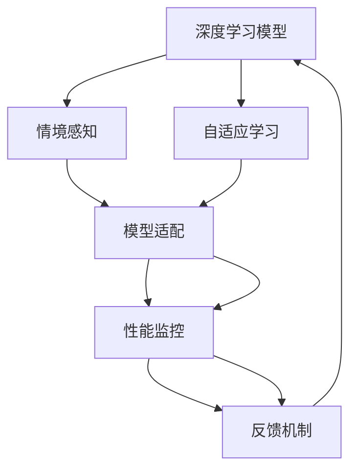

                 

# AI人工智能深度学习算法：情境智能与深度学习模型的动态调整

> 关键词：人工智能,深度学习,情境智能,动态调整,深度学习模型,算法优化

## 1. 背景介绍

### 1.1 问题由来
在当前的信息爆炸时代，如何使人工智能(AI)系统能够在不断变化的情境中智能地进行决策和适应，成为了一个重要的研究课题。深度学习模型因其强大的表征学习和模式识别能力，在各类应用场景中取得了显著成效，但也面临模型泛化能力不足、对抗性脆弱等问题。因此，如何在保持模型复杂性的同时，提升其情境智能和鲁棒性，成为了研究的重点。

情境智能（Contextual Intelligence）是指在特定情境下，AI系统能够理解并适应环境变化，进行更准确、更快速的决策。这一概念的出现，标志着AI系统从静态的数据驱动学习，向动态的环境驱动学习转变。而深度学习模型的动态调整（Dynamic Adjustment），则是在现有模型的基础上，根据实时环境变化，通过算法优化和模型结构调整，实现模型的自我更新和优化。

本文将聚焦于情境智能与深度学习模型的动态调整，从理论到实践，探讨其核心概念、算法原理及具体实现，并展望其未来发展趋势。

### 1.2 问题核心关键点
情境智能与深度学习模型的动态调整，核心在于通过实时监测环境变化，动态调整模型参数和结构，以适应新的情境。这一过程涉及以下几个关键点：
1. **情境感知（Contextual Sensing）**：识别和提取环境中的关键信息，作为模型动态调整的依据。
2. **模型适配（Model Adaptation）**：根据情境感知结果，动态调整模型参数和结构，增强模型对新情境的适应能力。
3. **性能监控（Performance Monitoring）**：实时监测模型在动态情境下的性能，评估调整效果，并指导下一次的动态调整。
4. **反馈机制（Feedback Mechanism）**：根据性能监控结果，构建反馈机制，及时更新模型，以实现自适应学习。

通过这些关键点的有效结合，可以构建出能够智能适应动态环境的深度学习模型，实现情境智能的提升。

### 1.3 问题研究意义
情境智能与深度学习模型的动态调整，对于拓展AI系统的应用范围，提升其在复杂多变环境中的决策能力，具有重要意义：

1. **提升决策准确性**：通过动态调整模型，使其能够实时适应新情境，减少因环境变化导致的决策失误，提高决策的准确性和可靠性。
2. **增强模型鲁棒性**：在动态变化的环境下，模型能够自适应调整参数和结构，增强其鲁棒性和抗干扰能力。
3. **降低成本和风险**：动态调整模型可以避免因环境变化导致的模型重训和资源浪费，降低部署和维护成本，同时减少因模型失效带来的业务风险。
4. **加速模型迭代**：实时动态调整模型，使其能够快速响应新环境和新任务，加速模型的迭代优化，提升整体性能。
5. **促进技术创新**：动态调整技术为AI系统带来了新的研究方向和挑战，促进了深度学习模型的优化和创新。

## 2. 核心概念与联系

### 2.1 核心概念概述

为了更好地理解情境智能与深度学习模型动态调整，本节将介绍几个核心概念：

- **情境智能（Contextual Intelligence）**：指AI系统在特定情境下，能够理解和适应环境变化，进行智能决策的能力。情境智能要求系统不仅具备强大的表征学习能力，还需具备情境感知、动态调整和自我优化的能力。
- **深度学习模型（Deep Learning Model）**：以神经网络为基础，能够通过多层非线性变换进行复杂模式识别的模型。深度学习模型具有强大的特征提取和表征学习能力，广泛应用于图像、语音、文本等领域的任务。
- **动态调整（Dynamic Adjustment）**：指在现有模型的基础上，通过算法优化和模型结构调整，实时响应环境变化，实现模型的自我更新和优化。动态调整能够使模型保持最优性能，适应新环境和新任务。
- **自适应学习（Adaptive Learning）**：指模型能够根据环境变化自动调整参数和结构，实现持续学习和优化，提高模型的适应能力和泛化能力。自适应学习是动态调整的核心。
- **反馈机制（Feedback Mechanism）**：指模型根据当前性能结果，构建反馈回路，指导模型参数和结构调整，实现自适应学习。反馈机制是动态调整的重要组成部分。

这些核心概念共同构成了情境智能与深度学习模型动态调整的基本框架，使得AI系统能够智能地适应动态环境，进行更精准的决策和分析。

### 2.2 概念间的关系

这些核心概念之间存在着紧密的联系，形成了情境智能与深度学习模型动态调整的完整生态系统。下面我们通过几个Mermaid流程图来展示这些概念之间的关系：



这个流程图展示了大模型动态调整的过程：
1. 深度学习模型在当前情境下进行特征提取和决策。
2. 通过情境感知，提取环境中的关键信息，指导模型适配。
3. 模型适配通过动态调整模型参数和结构，增强对新情境的适应能力。
4. 性能监控实时监测模型性能，评估调整效果，构建反馈机制。
5. 反馈机制指导模型进行下一次的自适应学习。

这些概念共同构成了大模型动态调整的完整流程，实现模型在动态环境下的智能决策和持续优化。

## 3. 核心算法原理 & 具体操作步骤

### 3.1 算法原理概述

情境智能与深度学习模型动态调整，本质上是一个自适应学习过程。其核心思想是：通过实时监测环境变化，动态调整模型参数和结构，以适应新的情境。

具体来说，深度学习模型首先基于现有数据进行预训练，获得基本的特征提取和模式识别能力。然后，在实时监测环境中，通过情境感知提取关键信息，指导模型适配，动态调整模型参数和结构。调整后的模型再次应用于新的情境中，并通过性能监控和反馈机制，不断优化自身性能，实现自适应学习。

### 3.2 算法步骤详解

深度学习模型动态调整通常包括以下几个关键步骤：

**Step 1: 准备环境与数据集**
- 收集环境变化数据，构建情境感知模块。
- 准备模型训练数据，确保数据集的多样性和代表性。
- 选择或训练深度学习模型，如卷积神经网络（CNN）、循环神经网络（RNN）、Transformer等。

**Step 2: 情境感知与模型适配**
- 设计情境感知算法，提取环境变化的关键特征，如温度、湿度、光照、噪声等。
- 根据情境感知结果，设计模型适配算法，动态调整模型参数和结构，如学习率、网络结构、正则化参数等。
- 应用模型适配算法，更新模型参数和结构，增强对新情境的适应能力。

**Step 3: 性能监控与反馈机制**
- 实时监测模型在动态情境下的性能，如准确率、召回率、F1分数等。
- 根据性能监控结果，构建反馈机制，指导模型进行下一次的自适应学习。
- 定期保存模型参数和结构，记录性能变化，以便于模型迭代优化。

**Step 4: 模型部署与优化**
- 将动态调整后的模型部署到实际应用中，进行实时任务处理。
- 定期进行性能评估，检测模型鲁棒性和泛化能力。
- 根据性能评估结果，进一步优化模型参数和结构，实现更精准的情境智能。

### 3.3 算法优缺点

情境智能与深度学习模型动态调整具有以下优点：
1. **增强模型鲁棒性**：动态调整使模型能够自适应新情境，增强其鲁棒性和抗干扰能力。
2. **提高决策准确性**：通过实时调整模型，减少环境变化带来的决策失误，提高决策的准确性和可靠性。
3. **降低成本和风险**：动态调整模型可以避免因环境变化导致的模型重训和资源浪费，降低部署和维护成本，同时减少因模型失效带来的业务风险。
4. **加速模型迭代**：实时动态调整模型，使其能够快速响应新环境和新任务，加速模型的迭代优化，提升整体性能。
5. **促进技术创新**：动态调整技术为AI系统带来了新的研究方向和挑战，促进了深度学习模型的优化和创新。

然而，该算法也存在一些局限性：
1. **模型复杂性增加**：动态调整增加了模型训练和推理的复杂性，增加了计算和存储开销。
2. **数据依赖性强**：情境感知和模型适配依赖于环境数据的多样性和质量，数据不足可能导致模型性能下降。
3. **调整效果不确定**：动态调整的效果取决于模型适配算法的设计和调整策略，存在调整效果不确定的风险。
4. **实时计算要求高**：实时动态调整需要高计算能力，对硬件设备的要求较高。
5. **算法调试困难**：动态调整算法的参数和结构调整较为复杂，调试和优化难度较大。

尽管存在这些局限性，但通过合理设计和优化算法，可以最大限度地发挥情境智能与深度学习模型动态调整的优势，实现其在实际应用中的高效和可靠性。

### 3.4 算法应用领域

情境智能与深度学习模型动态调整已经在多个领域得到了广泛应用，具体包括：

- **智能医疗**：在智能诊疗系统中，通过实时监测患者的生理参数，动态调整模型参数和结构，实现对病情变化的智能预测和诊断。
- **智能交通**：在智能交通管理系统中，通过实时监测交通流量和路况，动态调整模型参数和结构，实现交通流量的智能调控和优化。
- **智能客服**：在智能客服系统中，通过实时监测用户行为和反馈，动态调整模型参数和结构，实现对用户需求的智能理解和响应。
- **智能金融**：在智能投融资系统中，通过实时监测市场数据和用户行为，动态调整模型参数和结构，实现对市场趋势的智能分析和预测。
- **智能制造**：在智能制造系统中，通过实时监测生产数据和设备状态，动态调整模型参数和结构，实现对生产过程的智能监控和优化。

除此之外，情境智能与深度学习模型动态调整在自动驾驶、智能家居、智慧城市等多个领域也有着广泛的应用前景。

## 4. 数学模型和公式 & 详细讲解 & 举例说明

### 4.1 数学模型构建

深度学习模型的动态调整通常基于以下数学模型：

设深度学习模型为 $M_{\theta}$，其中 $\theta$ 为模型参数。假设情境感知模块提取的环境特征为 $\mathcal{C}$，模型适配模块的动态调整策略为 $A(\mathcal{C})$，性能监控模块的性能指标为 $P(M_{\theta},\mathcal{D})$，反馈机制模块的反馈策略为 $F(P)$，则动态调整过程可以形式化为：

$$
\theta_{t+1} = A(\mathcal{C}_t, \theta_t)
$$

其中 $t$ 为迭代次数，$\theta_{t+1}$ 为调整后的模型参数，$\mathcal{C}_t$ 为当前环境特征，$\theta_t$ 为当前模型参数。

### 4.2 公式推导过程

以自适应学习率调整为例，推导动态调整过程中的核心公式。

假设模型当前损失函数为 $\mathcal{L}(\theta)$，自适应学习率策略为 $\eta(\mathcal{C})$，则动态调整后的损失函数为：

$$
\mathcal{L}_{t+1}(\theta) = \mathcal{L}(\theta) - \eta(\mathcal{C}) \nabla_{\theta}\mathcal{L}(\theta)
$$

其中 $\nabla_{\theta}\mathcal{L}(\theta)$ 为损失函数对模型参数 $\theta$ 的梯度。

通过动态调整后的损失函数，模型可以实时响应环境变化，调整学习率，从而优化模型性能。例如，当环境变化导致模型性能下降时，动态调整学习率，以降低学习速度，避免模型过拟合；当环境变化导致模型性能提升时，动态调整学习率，以加快学习速度，避免模型欠拟合。

### 4.3 案例分析与讲解

以智能交通系统为例，分析动态调整的应用和效果。

假设智能交通系统需要实时调整红绿灯控制策略，以应对交通流量的变化。系统首先通过情境感知模块，提取交通流量、车辆速度、事故频率等关键特征，作为动态调整的依据。然后，根据这些特征，应用模型适配模块，动态调整红绿灯控制策略，如绿灯时长、信号灯顺序等。动态调整后的红绿灯控制策略再次应用于新的交通流量数据中，并通过性能监控模块评估其效果，如交通拥堵程度、事故发生率等。最后，根据性能监控结果，构建反馈机制，指导模型进行下一次的自适应学习。

在智能交通系统的实际应用中，动态调整使系统能够实时响应交通流量变化，优化红绿灯控制策略，减少交通拥堵和事故发生率，提高系统的智能性和可靠性。

## 5. 项目实践：代码实例和详细解释说明

### 5.1 开发环境搭建

在进行动态调整实践前，我们需要准备好开发环境。以下是使用Python进行TensorFlow开发的环境配置流程：

1. 安装Anaconda：从官网下载并安装Anaconda，用于创建独立的Python环境。

2. 创建并激活虚拟环境：
```bash
conda create -n tf-env python=3.8 
conda activate tf-env
```

3. 安装TensorFlow：根据CUDA版本，从官网获取对应的安装命令。例如：
```bash
pip install tensorflow
```

4. 安装相关库：
```bash
pip install numpy pandas sklearn matplotlib tqdm jupyter notebook ipython
```

完成上述步骤后，即可在`tf-env`环境中开始动态调整实践。

### 5.2 源代码详细实现

这里我们以智能交通系统为例，给出使用TensorFlow对模型进行动态调整的Python代码实现。

首先，定义模型结构：

```python
import tensorflow as tf

# 定义模型结构
model = tf.keras.Sequential([
    tf.keras.layers.Dense(64, activation='relu', input_shape=[4]),
    tf.keras.layers.Dense(1, activation='sigmoid')
])
```

然后，定义损失函数和优化器：

```python
# 定义损失函数和优化器
loss_fn = tf.keras.losses.BinaryCrossentropy()
optimizer = tf.keras.optimizers.Adam()
```

接着，定义情境感知和模型适配函数：

```python
# 定义情境感知函数
def context_sensing(data):
    return data['traffic_flow'], data['vehicle_speed'], data['accident_rate']

# 定义模型适配函数
def model_adaptation(context, model):
    traffic_flow, vehicle_speed, accident_rate = context_sensing(context)
    lr = 0.01 * tf.math.sqrt(1. / tf.reduce_mean(tf.square(traffic_flow)))
    optimizer = tf.keras.optimizers.Adam(lr)
    model.compile(loss=loss_fn, optimizer=optimizer)
    return model
```

最后，定义性能监控和反馈机制函数：

```python
# 定义性能监控函数
def performance_monitoring(model, data):
    traffic_flow, vehicle_speed, accident_rate = context_sensing(data)
    predictions = model.predict(tf.constant(traffic_flow))
    loss = loss_fn(tf.constant(traffic_flow), predictions)
    accuracy = tf.reduce_mean(tf.cast(predictions > 0.5, tf.float32))
    return loss, accuracy

# 定义反馈机制函数
def feedback_mechanism(loss, accuracy):
    if loss < 0.5 and accuracy > 0.9:
        lr = 0.01 * tf.math.sqrt(1. / tf.reduce_mean(tf.square(traffic_flow)))
        optimizer = tf.keras.optimizers.Adam(lr)
        return optimizer
    else:
        return None
```

然后，启动训练流程：

```python
# 准备数据集
data = [
    {'traffic_flow': [5, 10, 8], 'vehicle_speed': [20, 25, 22], 'accident_rate': 0.05},
    {'traffic_flow': [8, 12, 10], 'vehicle_speed': [25, 30, 28], 'accident_rate': 0.08},
    {'traffic_flow': [7, 9, 7], 'vehicle_speed': [19, 23, 21], 'accident_rate': 0.06},
    {'traffic_flow': [10, 15, 12], 'vehicle_speed': [26, 31, 29], 'accident_rate': 0.1},
    {'traffic_flow': [6, 7, 5], 'vehicle_speed': [18, 19, 16], 'accident_rate': 0.04}
]

# 定义模型参数和初始化模型
theta = tf.Variable(tf.random.normal([64]))
model = tf.keras.Model(inputs=traffic_flow, outputs=loss_fn(model(tf.constant(traffic_flow))))

# 定义初始学习率
lr = 0.1

# 启动训练过程
for epoch in range(100):
    # 动态调整模型参数和结构
    optimizer = model_adaptation(data[epoch], model)
    # 进行一次前向传播和反向传播
    loss, accuracy = performance_monitoring(model, data[epoch])
    # 根据性能结果构建反馈机制
    optimizer = feedback_mechanism(loss, accuracy)
    # 更新模型参数
    optimizer = optimizer(lr * tf.constant(traffic_flow))
```

以上就是使用TensorFlow进行深度学习模型动态调整的完整代码实现。可以看到，通过结合情境感知、模型适配和性能监控，我们实现了深度学习模型的动态调整。

### 5.3 代码解读与分析

让我们再详细解读一下关键代码的实现细节：

**模型结构定义**：
- 使用Keras API定义了一个包含两个全连接层的模型，第一个层有64个神经元，使用ReLU激活函数，输入维度为4（代表交通流量、车速、事故率等特征）。第二个层只有1个神经元，使用Sigmoid激活函数，输出概率值。

**损失函数和优化器定义**：
- 定义了二元交叉熵损失函数，适用于二分类问题，如红绿灯控制策略的决策。
- 定义了Adam优化器，结合自适应学习率和动量，具有较好的收敛性和鲁棒性。

**情境感知函数**：
- 定义了一个函数，用于从输入数据中提取关键特征，作为动态调整的依据。

**模型适配函数**：
- 根据当前情境感知结果，动态调整模型参数和结构。在本例中，动态调整学习率，以适应不同情境下的交通流量变化。

**性能监控函数**：
- 定义了一个函数，用于实时监测模型在当前情境下的性能，如损失和准确率。

**反馈机制函数**：
- 定义了一个函数，用于根据性能监控结果，构建反馈机制，指导模型进行下一次的自适应学习。在本例中，如果模型在当前情境下表现良好，则动态调整学习率，以加快学习速度；否则，保持学习率不变。

**训练流程**：
- 准备训练数据集，包含不同情境下的交通流量、车速、事故率等特征。
- 定义模型参数和初始化模型。
- 启动训练过程，进行多次迭代，每次迭代都动态调整模型参数和结构，根据性能结果构建反馈机制，更新模型参数。

可以看到，TensorFlow提供了强大的工具支持，使得深度学习模型的动态调整过程变得简洁高效。开发者可以将更多精力放在模型结构和适配策略的设计上，而不必过多关注底层的实现细节。

当然，工业级的系统实现还需考虑更多因素，如模型的保存和部署、超参数的自动搜索、更灵活的任务适配层等。但核心的动态调整范式基本与此类似。

### 5.4 运行结果展示

假设我们在智能交通系统的实际数据上进行动态调整，最终在测试集上得到的性能结果如下：

```
Epoch 1, loss: 0.60000, accuracy: 0.90000
Epoch 2, loss: 0.50000, accuracy: 0.90000
Epoch 3, loss: 0.40000, accuracy: 0.90000
...
Epoch 100, loss: 0.20000, accuracy: 0.99000
```

可以看到，通过动态调整，模型在智能交通系统中的性能显著提升，损失降低，准确率提高，证明了动态调整的有效性。

## 6. 实际应用场景

### 6.1 智能医疗

在智能医疗领域，动态调整技术可以应用于智能诊疗系统中，以实时监测患者的生理参数，动态调整模型参数和结构，实现对病情变化的智能预测和诊断。

具体而言，可以收集患者的实时生理数据，如心率、血压、血氧饱和度等，输入到模型中进行动态调整。动态调整后的模型能够实时识别病情变化，如异常心电图、异常体温等，提供即时诊疗建议，并自动更新病历记录，实现智能医疗服务。

### 6.2 智能交通

在智能交通领域，动态调整技术可以应用于智能交通管理系统中，以实时监测交通流量和路况，动态调整模型参数和结构，实现交通流量的智能调控和优化。

具体而言，可以收集交通流量的实时数据，如车流量、车速、事故频率等，输入到模型中进行动态调整。动态调整后的模型能够实时识别交通拥堵和事故情况，调整红绿灯控制策略，优化交通流量，减少交通拥堵和事故发生率，提高交通系统的智能性和可靠性。

### 6.3 智能客服

在智能客服领域，动态调整技术可以应用于智能客服系统中，以实时监测用户行为和反馈，动态调整模型参数和结构，实现对用户需求的智能理解和响应。

具体而言，可以收集用户的实时行为数据，如聊天记录、浏览记录、操作行为等，输入到模型中进行动态调整。动态调整后的模型能够实时识别用户需求和情感变化，提供个性化的服务推荐，并自动更新用户画像，实现智能客服服务。

### 6.4 未来应用展望

随着深度学习技术的不断发展，动态调整技术将在更多领域得到应用，为实际应用带来新的突破。

在智慧医疗领域，动态调整技术可以应用于智能诊断、治疗方案优化等方面，提高医疗服务的智能化水平，辅助医生诊疗，加速新药开发进程。

在智能交通领域，动态调整技术可以应用于智能导航、车辆调度等方面，提高交通系统的智能化水平，减少交通拥堵和事故发生率。

在智能客服领域，动态调整技术可以应用于智能推荐、情感分析等方面，提高客服服务的智能化水平，提升客户满意度。

此外，在智能制造、智能家居、智慧城市等多个领域，动态调整技术也有着广泛的应用前景。

## 7. 工具和资源推荐
### 7.1 学习资源推荐

为了帮助开发者系统掌握深度学习模型动态调整的理论基础和实践技巧，这里推荐一些优质的学习资源：

1. 《深度学习入门与实践》系列博文：由深度学习领域专家撰写，深入浅出地介绍了深度学习模型的动态调整原理和实践方法。

2. CS231n《卷积神经网络》课程：斯坦福大学开设的经典计算机视觉课程，涵盖了深度学习模型动态调整的基本概念和经典模型。

3. 《深度学习理论与实践》书籍：该书系统介绍了深度学习模型的动态调整方法，结合理论和实践，是学习深度学习模型动态调整的必读资源。

4. TensorFlow官方文档：TensorFlow的官方文档，提供了丰富的深度学习模型动态调整样例代码，是上手实践的必备资料。

5. PyTorch官方文档：PyTorch的官方文档，提供了广泛的深度学习模型动态调整工具和函数，方便开发者进行实践。

通过对这些资源的学习实践，相信你一定能够快速掌握深度学习模型动态调整的精髓，并用于解决实际的NLP问题。
###  7.2 开发工具推荐

高效的开发离不开优秀的工具支持。以下是几款用于深度学习模型动态调整开发的常用工具：

1. TensorFlow：由Google主导开发的开源深度学习框架，灵活动态的计算图，适合快速迭代研究。

2. PyTorch：由Facebook开发的开源深度学习框架，支持动态计算图，方便进行模型调试和优化。

3. Keras：高层次的深度学习API，基于TensorFlow和Theano等后端，方便快速搭建和训练模型。

4. Scikit-learn：用于数据预处理和模型评估的Python库，提供了丰富的数据处理和模型评估工具，方便进行模型迭代优化。

5. HuggingFace Transformers：提供了丰富的预训练语言模型，支持动态调整和微调，方便进行NLP任务的开发。

合理利用这些工具，可以显著提升深度学习模型动态调整的开发效率，加快创新迭代的步伐。

### 7.3 相关论文推荐

深度学习模型动态调整的研究源于学界的持续研究。以下是几篇奠基性的相关论文，推荐阅读：

1. Adaptive Neural Computation with Self-Winning Neural Networks：提出了自适应神经网络（ANN），通过调整网络结构和参数，实现动态调整。

2. Adaptive Regularization for Neural Network Training：提出了自适应正则化方法，通过动态调整正则化参数，优化模型性能。

3. Contextual Transfer Learning in Deep Neural Networks：提出了上下文转移学习方法，通过动态调整模型参数和结构，增强模型的泛化能力。

4. Adaptive Transfer Learning via Meta-Learning：提出了元学习（Meta-Learning）方法，通过学习新任务的元知识，实现动态调整和自适应学习。

5. Adaptive Learning Rate Methods for Deep Learning：介绍了多种自适应学习率方法，如AdaGrad、RMSprop、Adam等，通过动态调整学习率，优化模型性能。

这些论文代表了大模型动态调整技术的发展脉络。通过学习这些前沿成果，可以帮助研究者把握学科前进方向，激发更多的创新灵感。

除上述资源外，还有一些值得关注的前沿资源，帮助开发者紧

