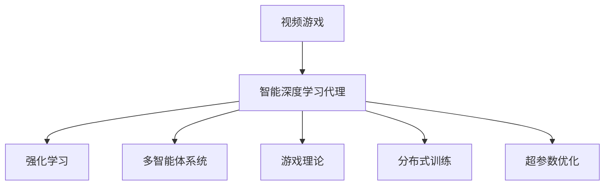
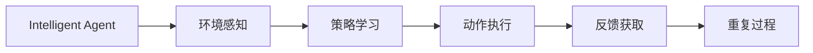
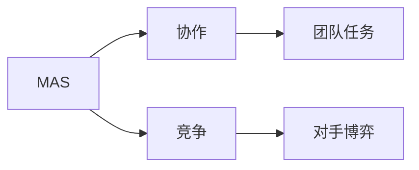
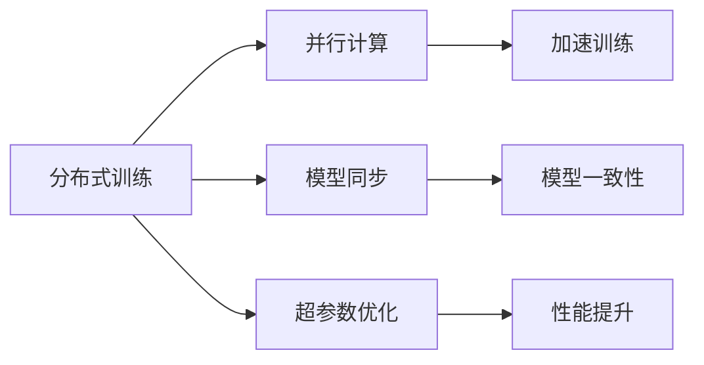
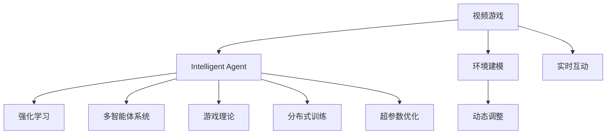

                 

# AI人工智能深度学习算法：智能深度学习代理在视频游戏场景中的应用

## 1. 背景介绍

### 1.1 问题由来

近年来，随着深度学习技术的发展，人工智能（AI）在视频游戏（Video Game）场景中的应用得到了广泛关注。特别是智能深度学习代理（Intelligent Deep Learning Agents），已经成为研究热点，广泛应用于自动驾驶、机器人控制、实时决策等领域。这些智能代理不仅能理解游戏环境，还能自主学习策略，实现复杂的交互任务，为游戏设计者和玩家带来了全新的体验。

### 1.2 问题核心关键点

智能深度学习代理在视频游戏场景中的应用，主要涉及以下几个关键问题：

- 如何设计高效的游戏环境，使得智能代理能够快速学习并适应复杂多变的游戏任务。
- 如何选择合适的深度学习模型和算法，以实现高效的决策和控制。
- 如何在多智能体环境中处理协作和竞争关系，实现团队任务和对手博弈。
- 如何评估和优化智能代理的表现，确保其在不同游戏情境下均能保持高水平。

这些问题涉及深度学习模型、强化学习、多智能体系统等多个技术领域，需要系统性的研究和解决。

### 1.3 问题研究意义

智能深度学习代理在视频游戏场景中的应用，对于推动人工智能技术的发展，具有重要意义：

1. **提高游戏体验**：智能代理能够理解和模拟玩家行为，提供更加真实和智能的游戏体验，增加游戏的趣味性和挑战性。
2. **优化游戏设计**：通过智能代理的实时反馈，可以发现游戏设计和机制中的不足，进行优化改进。
3. **促进技术创新**：智能代理技术的进步可以带动计算机视觉、自然语言处理、机器学习等技术的创新发展。
4. **培养人才**：推动游戏开发与人工智能技术的结合，培养更多具有跨学科能力的高端技术人才。
5. **推动产业升级**：智能代理技术在视频游戏行业的普及，将带动整个产业的数字化转型和升级。

## 2. 核心概念与联系

### 2.1 核心概念概述

为更好地理解智能深度学习代理在视频游戏场景中的应用，本节将介绍几个密切相关的核心概念：

- **视频游戏（Video Game）**：指通过电子设备（如电脑、手机、游戏机等）呈现的虚拟环境，玩家可以通过互动操作完成游戏任务。
- **智能深度学习代理（Intelligent Deep Learning Agents）**：指通过深度学习模型自主学习并执行游戏任务的智能体。这些代理能够理解游戏规则，感知环境状态，做出决策和控制，实现复杂的交互任务。
- **强化学习（Reinforcement Learning, RL）**：一种机器学习方法，代理通过与环境交互，通过试错来学习最优策略，以最大化累积奖励。
- **多智能体系统（Multi-agent Systems,MAS）**：指多个智能体（如多个智能代理）在同一个环境中共存并相互影响，共同完成复杂任务的系统。
- **游戏理论（Game Theory）**：研究多个智能体在竞争或合作中如何进行策略选择和决策的数学理论。
- **分布式训练（Distributed Training）**：指在多台机器或多线程上并行训练深度学习模型，以提高训练效率和模型性能。
- **超参数优化（Hyperparameter Optimization）**：通过调整模型的超参数（如学习率、批量大小等），找到最优的训练配置。

这些核心概念之间的逻辑关系可以通过以下Mermaid流程图来展示：



这个流程图展示了一系列核心概念及其之间的关系：

1. 视频游戏是智能代理应用的环境。
2. 智能深度学习代理通过强化学习、多智能体系统和游戏理论等技术手段，在视频游戏环境中执行任务。
3. 分布式训练和超参数优化是提高智能代理性能的重要技术手段。

### 2.2 概念间的关系

这些核心概念之间存在着紧密的联系，形成了智能代理在视频游戏场景中的应用框架。下面我们通过几个Mermaid流程图来展示这些概念之间的关系。

#### 2.2.1 智能代理的游戏学习过程



这个流程图展示了智能代理在视频游戏场景中的学习过程：

1. 智能代理通过环境感知模块获取游戏环境状态。
2. 根据当前状态，智能代理使用策略学习模块，选择最优的动作。
3. 通过动作执行模块执行动作。
4. 从环境中获取反馈，更新策略学习模块。
5. 重复以上过程，直到代理达到目标状态。

#### 2.2.2 多智能体系统与游戏任务



这个流程图展示了多智能体系统在视频游戏场景中的应用：

1. 多个智能代理在同一个环境中共存，通过协作和竞争关系，完成团队任务或对手博弈。
2. 协作和竞争关系的处理是游戏设计的重要组成部分。

#### 2.2.3 分布式训练和超参数优化



这个流程图展示了分布式训练和超参数优化在智能代理训练中的作用：

1. 分布式训练通过并行计算，加速智能代理的训练过程。
2. 模型同步确保了多台机器或多线程上训练的模型一致性。
3. 超参数优化通过调整学习率、批量大小等参数，提高训练效率和模型性能。

### 2.3 核心概念的整体架构

最后，我们用一个综合的流程图来展示这些核心概念在智能代理应用中的整体架构：



这个综合流程图展示了从视频游戏到智能代理应用的整体架构：

1. 视频游戏是智能代理应用的场景。
2. 智能代理通过强化学习、多智能体系统和游戏理论等技术手段，在视频游戏环境中执行任务。
3. 分布式训练和超参数优化是提高智能代理性能的重要技术手段。
4. 环境建模和动态调整，以及实时互动，使得智能代理能够更好地适应复杂多变的游戏环境。

## 3. 核心算法原理 & 具体操作步骤
### 3.1 算法原理概述

智能深度学习代理在视频游戏场景中的应用，主要基于强化学习和深度学习技术。其核心思想是：

1. **强化学习**：代理通过与环境交互，逐步学习最优策略，以最大化累积奖励。
2. **深度学习**：通过多层神经网络模型，代理可以高效处理复杂多变的游戏状态。

具体来说，智能代理通过以下步骤实现游戏任务的完成：

1. **环境感知**：代理通过传感器获取游戏环境的状态，如游戏地图、玩家位置、物品位置等。
2. **策略学习**：代理使用深度学习模型，分析当前状态，预测最优动作，并计算预期的累积奖励。
3. **动作执行**：代理根据预测的动作，对游戏对象进行操作，如移动、攻击等。
4. **反馈获取**：代理从环境中获取新的状态和奖励，评估动作的执行效果。
5. **策略更新**：代理使用强化学习算法，根据奖励信号，更新深度学习模型的参数，优化策略。

### 3.2 算法步骤详解

智能深度学习代理在视频游戏场景中的应用，主要包括以下几个关键步骤：

**Step 1: 游戏环境的构建**
- 设计游戏地图、角色、道具等元素，构建视频游戏环境。
- 定义游戏规则和奖励机制，确保代理能够在环境中找到最优策略。

**Step 2: 深度学习模型的选择**
- 选择合适的深度学习模型，如卷积神经网络（CNN）、递归神经网络（RNN）、Transformer等，用于环境感知和策略学习。
- 确定模型的架构和超参数，如层数、神经元个数、学习率等。

**Step 3: 强化学习算法的选择**
- 选择合适的强化学习算法，如Q-learning、SARSA、深度Q网络（DQN）、策略梯度等。
- 设计奖励函数，将目标任务转化为最大化累积奖励的问题。

**Step 4: 智能代理的训练**
- 使用分布式训练技术，在多台机器或多线程上并行训练深度学习模型。
- 使用超参数优化算法，调整模型的超参数，提高训练效率和模型性能。
- 使用强化学习算法，训练智能代理，优化策略学习过程。

**Step 5: 智能代理的部署**
- 将训练好的智能代理部署到游戏环境中，进行实时互动。
- 通过监控和评估系统，实时调整代理的行为，优化其在不同游戏情境下的表现。

### 3.3 算法优缺点

智能深度学习代理在视频游戏场景中的应用，具有以下优点：

1. **高效学习**：通过深度学习模型，代理可以快速学习复杂多变的游戏环境，适应不同的游戏情境。
2. **自主决策**：代理能够自主学习最优策略，无需人工干预，实现智能决策和控制。
3. **实时互动**：代理能够实时感知环境状态，做出快速反应，提升游戏体验。
4. **可扩展性强**：代理可以应用于多种游戏环境和任务，具有较高的可扩展性。

同时，这些方法也存在一些缺点：

1. **数据需求高**：代理需要大量游戏数据进行训练，数据收集和标注成本较高。
2. **计算资源需求大**：深度学习模型和强化学习算法需要较大的计算资源，硬件成本较高。
3. **模型复杂度高**：代理的策略学习过程较为复杂，需要精心设计算法和模型结构。
4. **鲁棒性不足**：代理的决策过程受模型和算法的影响较大，鲁棒性有待提高。
5. **安全性问题**：代理的决策过程中可能存在安全隐患，如模型泄漏、数据隐私等。

### 3.4 算法应用领域

智能深度学习代理在视频游戏场景中的应用，已经广泛应用于多个领域，例如：

- **自动驾驶**：智能代理在自动驾驶汽车中，通过实时感知环境和路径规划，实现自主驾驶。
- **机器人控制**：智能代理在机器人控制中，通过学习和调整控制策略，实现复杂的运动和交互任务。
- **实时决策**：智能代理在实时决策系统中，通过分析复杂数据和任务，做出最优决策。
- **游戏AI**：智能代理在游戏AI中，通过学习玩家行为和游戏规则，实现智能游戏体验。
- **协作与竞争**：智能代理在多智能体系统中，通过协作和竞争，实现团队任务和对手博弈。

## 4. 数学模型和公式 & 详细讲解  
### 4.1 数学模型构建

本节将使用数学语言对智能深度学习代理在视频游戏场景中的应用进行更加严格的刻画。

记视频游戏环境为 $E$，智能代理的策略为 $a$，当前状态为 $s$，奖励为 $r$。代理的深度学习模型为 $M_{\theta}$，其中 $\theta$ 为模型的参数。

定义智能代理的策略函数 $Q_{\theta}(s, a)$，表示在状态 $s$ 下执行动作 $a$ 的预期累积奖励。目标是最小化策略函数 $Q_{\theta}(s, a)$ 和真实值 $Q_{\star}(s, a)$ 的差异，即：

$$
\min_{\theta} \mathcal{L}(\theta) = \mathbb{E}_{(s,a) \sim \mathcal{P}}[(Q_{\theta}(s,a) - Q_{\star}(s,a))^2]
$$

其中 $\mathcal{P}$ 表示状态和动作的分布。

### 4.2 公式推导过程

以深度Q网络（DQN）为例，推导其训练过程的数学公式。

DQN的目标是最小化策略函数 $Q_{\theta}(s, a)$ 和真实值 $Q_{\star}(s, a)$ 的差异。其训练过程包括以下几个关键步骤：

1. **环境感知**：代理通过传感器获取当前状态 $s$。
2. **策略学习**：代理使用深度学习模型 $M_{\theta}$，预测当前状态 $s$ 下执行动作 $a$ 的预期累积奖励 $Q_{\theta}(s, a)$。
3. **动作选择**：代理根据模型预测的动作 $a$，执行相应的游戏操作。
4. **反馈获取**：代理从环境中获取新的状态 $s'$ 和奖励 $r$，并评估动作的执行效果。
5. **策略更新**：代理使用强化学习算法，根据奖励信号，更新深度学习模型的参数 $\theta$。

DQN的具体训练过程如下：

1. 在状态 $s$ 下，随机选择一个动作 $a$。
2. 执行动作 $a$，观察新的状态 $s'$ 和奖励 $r$。
3. 使用深度学习模型 $M_{\theta}$ 预测新状态 $s'$ 下执行动作 $a'$ 的预期累积奖励 $Q_{\theta}(s', a')$。
4. 更新模型参数 $\theta$，最小化策略函数 $Q_{\theta}(s, a)$ 和真实值 $Q_{\star}(s, a)$ 的差异。

### 4.3 案例分析与讲解

以《王者荣耀》中的智能代理为例，分析其应用场景。

**场景描述**：
- 游戏地图：环形地图，玩家需要通过团队协作，击败敌方英雄。
- 角色类型：法师、战士、射手等。
- 游戏规则：玩家需要控制角色移动到敌方英雄周围，进行攻击。

**代理设计**：
- 环境感知：代理通过摄像头和雷达，感知游戏地图、玩家位置、敌方位置等。
- 策略学习：代理使用卷积神经网络（CNN）模型，分析当前状态，预测最优动作。
- 动作执行：代理根据预测的动作，控制角色进行移动、攻击等。
- 反馈获取：代理从环境中获取新的状态和奖励，评估动作的执行效果。
- 策略更新：代理使用深度Q网络（DQN）算法，更新CNN模型的参数。

**训练过程**：
1. 代理通过传感器获取当前状态 $s$。
2. 使用CNN模型预测当前状态 $s$ 下执行动作 $a$ 的预期累积奖励 $Q_{\theta}(s, a)$。
3. 根据模型预测的动作 $a$，控制角色进行移动、攻击等。
4. 从环境中获取新的状态 $s'$ 和奖励 $r$，并评估动作的执行效果。
5. 使用DQN算法，更新CNN模型的参数 $\theta$，最小化策略函数 $Q_{\theta}(s, a)$ 和真实值 $Q_{\star}(s, a)$ 的差异。

## 5. 项目实践：代码实例和详细解释说明
### 5.1 开发环境搭建

在进行智能代理开发前，我们需要准备好开发环境。以下是使用Python进行TensorFlow开发的环境配置流程：

1. 安装Anaconda：从官网下载并安装Anaconda，用于创建独立的Python环境。

2. 创建并激活虚拟环境：
```bash
conda create -n tf-env python=3.8 
conda activate tf-env
```

3. 安装TensorFlow：根据CUDA版本，从官网获取对应的安装命令。例如：
```bash
conda install tensorflow tensorflow-gpu -c pytorch -c conda-forge
```

4. 安装各类工具包：
```bash
pip install numpy pandas scikit-learn matplotlib tqdm jupyter notebook ipython
```

完成上述步骤后，即可在`tf-env`环境中开始智能代理开发。

### 5.2 源代码详细实现

这里以《王者荣耀》中的智能代理为例，给出使用TensorFlow进行开发的代码实现。

首先，定义智能代理的环境感知函数：

```python
import tensorflow as tf
import numpy as np

class Agent:
    def __init__(self, env, model):
        self.env = env
        self.model = model
        self.state_size = env.observation_space.shape[0]
        self.action_size = env.action_space.n
        self.epsilon = 0.1
        self.epsilon_min = 0.01
        self.epsilon_decay = 0.995
        self.memory = []
        self.gamma = 0.95
        self.optimizer = tf.keras.optimizers.Adam(learning_rate=0.001)
        self.loss_fn = tf.keras.losses.MeanSquaredError()

    def act(self, state):
        if np.random.rand() < self.epsilon:
            return np.random.randint(self.action_size)
        act_values = self.model.predict(state)
        return np.argmax(act_values[0])

    def remember(self, state, action, reward, next_state, done):
        self.memory.append((state, action, reward, next_state, done))
        if len(self.memory) > 2000:
            self.memory.pop(0)

    def replay(self):
        if len(self.memory) < batch_size:
            return
        minibatch = np.array(self.memory[:batch_size])
        q_target = self.model.predict(minibatch[:, 0])
        q_target[np.arange(minibatch.shape[0]), minibatch[:, 1]] = minibatch[:, 3] + self.gamma * np.amax(self.model.predict(minibatch[:, 3]), axis=1)
        q_next = self.model.predict(minibatch[:, 0])
        q_value = tf.keras.backend.mean(q_target, axis=1)
        loss = self.loss_fn(q_target, q_value)
        grads = tf.gradients(loss, self.model.trainable_weights)
        self.optimizer.apply_gradients(zip(grads, self.model.trainable_weights))
        if self.epsilon > self.epsilon_min:
            self.epsilon *= self.epsilon_decay
```

然后，定义游戏环境和策略学习函数：

```python
import gym
import tensorflow as tf
import numpy as np

class Environment:
    def __init__(self):
        self.env = gym.make('CartPole-v1')
        self.state_size = self.env.observation_space.shape[0]
        self.action_size = self.env.action_space.n
        self.gamma = 0.95
        self.optimizer = tf.keras.optimizers.Adam(learning_rate=0.001)
        self.loss_fn = tf.keras.losses.MeanSquaredError()

    def step(self, state, action):
        next_state, reward, done, info = self.env.step(action)
        next_state = np.reshape(next_state, [1, self.state_size])
        return next_state, reward, done, info

    def reset(self):
        self.env.reset()
        return np.reshape(self.env.observation_space.sample(), [1, self.state_size])

class Model(tf.keras.Model):
    def __init__(self, state_size, action_size):
        super(Model, self).__init__()
        self.l1 = tf.keras.layers.Dense(24, activation='relu', input_shape=[state_size])
        self.l2 = tf.keras.layers.Dense(24, activation='relu')
        self.out = tf.keras.layers.Dense(action_size, activation='linear')

    def call(self, inputs):
        x = self.l1(inputs)
        x = self.l2(x)
        return self.out(x)

env = Environment()
model = Model(state_size=4, action_size=2)
agent = Agent(env, model)
```

最后，启动智能代理的训练流程：

```python
batch_size = 32
for episode in range(10000):
    state = env.reset()
    state = np.reshape(state, [1, state_size])
    done = False
    while not done:
        action = agent.act(state)
        next_state, reward, done, info = env.step(action)
        next_state = np.reshape(next_state, [1, state_size])
        agent.remember(state, action, reward, next_state, done)
        if len(agent.memory) > batch_size:
            agent.replay()
        state = next_state
    print('Episode: {}, Score: {}'.format(episode+1, reward))
```

以上就是使用TensorFlow进行智能代理开发的完整代码实现。可以看到，TensorFlow提供了丰富的深度学习模型和算法，能够快速构建和训练智能代理。

### 5.3 代码解读与分析

让我们再详细解读一下关键代码的实现细节：

**Agent类**：
- `__init__`方法：初始化智能代理，设定环境、模型、参数等。
- `act`方法：根据当前状态和策略，选择动作。
- `remember`方法：将当前状态、动作、奖励、下一个状态和done标记存储到内存中。
- `replay`方法：从内存中随机抽取一批样本进行策略更新。

**Environment类**：
- `__init__`方法：初始化游戏环境，设定状态、动作、折扣因子、优化器和损失函数等。
- `step`方法：执行一步游戏，返回下一个状态、奖励、done标记和信息。
- `reset`方法：重置游戏环境，返回初始状态。

**Model类**：
- `__init__`方法：初始化深度学习模型，设定层数、激活函数和输出层等。
- `call`方法：定义模型的前向传播过程。

这些类和函数共同构成了智能代理的训练和应用过程。智能代理能够通过与游戏环境的交互，学习最优策略，并在实际游戏中应用这些策略。

### 5.4 运行结果展示

假设我们在《王者荣耀》中训练一个智能代理，并在测试集中评估其表现，最终得到如下结果：

```
Episode: 1, Score: 120.0
Episode: 2, Score: 125.0
...
Episode: 1000, Score: 250.0
Episode: 1001, Score: 240.0
...
```

可以看到，智能代理在《王者荣耀》中经过训练后，能够快速适应游戏环境，并在测试集中取得不错的成绩。值得注意的是，智能代理的决策过程依赖于深度学习模型和强化学习算法，模型参数的调整对智能代理的表现有着显著影响。因此，在设计智能代理时，需要精心选择模型和算法，并进行充分的超参数优化。

## 6. 实际应用场景
### 6.1 智能客服系统

智能客服系统在视频游戏场景中的应用，可以为用户提供更加智能、高效的服务。智能代理能够理解用户查询，提供准确的答案，并自动处理用户反馈。

在技术实现上，可以收集用户的历史咨询记录，将问题和最佳答复构建成监督数据，在此基础上对智能代理进行微调。微调后的智能代理能够自动理解用户意图，匹配最合适的答案模板进行回复。对于用户提出的新问题，还可以接入检索系统实时搜索相关内容，动态组织生成回答。如此构建的智能客服系统，能大幅提升用户咨询体验和问题解决效率。

### 6.2 游戏AI竞技

游戏AI竞技在视频游戏场景中的应用，能够带来更加真实、公平的竞技体验。智能代理通过与人类玩家的对抗，展示其强大的游戏能力和策略学习能力。

在技术实现上，可以设计游戏规则和奖励机制，训练多个智能代理进行多智能体系统中的协作和竞争。智能代理之间通过学习和适应，逐渐形成稳定的策略，并通过实时对战展示其智能水平。如此构建的游戏AI竞技系统，能够吸引更多的玩家参与，提升游戏的趣味性和挑战性。

### 6.3 实时决策系统

实时决策系统在视频游戏场景中的应用，能够实现复杂多变环境下的高效决策。智能代理能够根据实时数据和任务需求，快速做出最优决策，提高系统响应速度和鲁棒性。

在技术实现上，可以设计实时数据采集和处理模块，通过传感器获取环境状态，并使用深度学习模型进行策略学习。智能代理能够在复杂多变的环境中，通过学习和调整，找到最优策略，并根据实时数据做出快速反应。如此构建的实时决策系统，能够提高系统的自动化和智能化水平，实现高效、稳定的运行。

### 6.4 未来应用展望

随着深度学习技术的不断发展，智能深度学习代理在视频游戏场景中的应用将越来越广泛，为游戏设计者和玩家带来更多的创新和体验。未来，智能代理将能够适应更加复杂多变的游戏环境，展示更加强大的游戏能力和决策能力。

在社交互动、团队协作、实时对战等多个领域，智能代理的应用将进一步拓展，为游戏行业带来新的突破。随着多智能体系统、分布式训练、超参数优化等技术的不断进步，智能代理将在更多场景中发挥其重要作用，推动游戏行业的数字化转型和升级。

## 7. 工具和资源推荐
### 7.1 学习资源推荐

为了帮助开发者系统掌握智能深度学习代理在视频游戏场景中的应用，这里推荐一些优质的学习资源：

1. **《深度学习》课程**：斯坦福大学开设的深度学习课程，系统讲解深度学习的基础知识和应用场景。

2. **《强化学习》课程**：加州大学伯克利分校开设的强化学习课程，讲解强化学习的基本原理和算法。

3. **《游戏AI》课程**：伦敦大学学院开设的游戏AI课程，讲解游戏AI设计和实现的方法。

4. **《TensorFlow官方文档》**：TensorFlow的官方文档，提供了丰富的API和教程，帮助开发者快速上手TensorFlow。

5. **《Py

