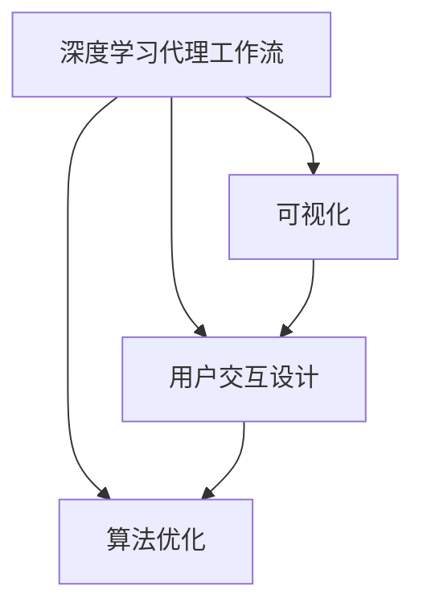
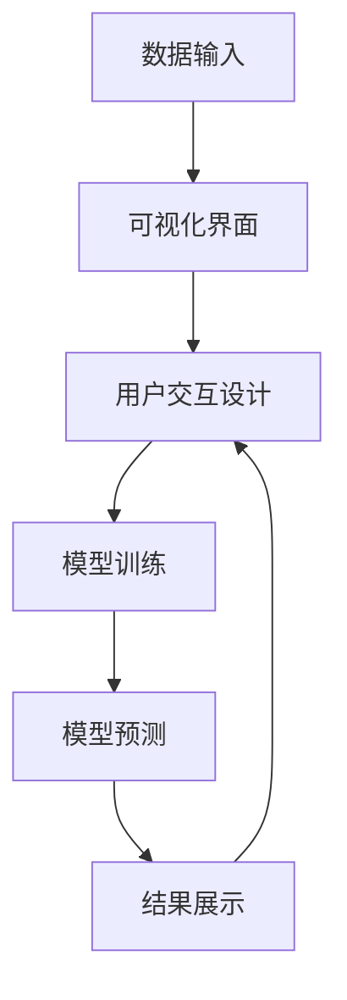
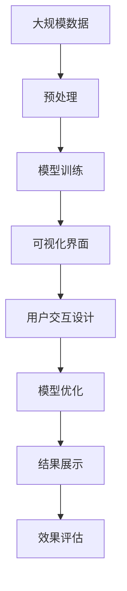

                 

# AI人工智能深度学习算法：深度学习代理工作流的可视化与用户交互设计

> 关键词：深度学习,代理工作流,可视化,用户交互设计,算法优化

## 1. 背景介绍

### 1.1 问题由来

在深度学习技术飞速发展的今天，深度学习算法的应用已经渗透到了众多领域，如计算机视觉、自然语言处理、语音识别等。然而，深度学习算法的黑盒特性，使得用户对其内部机制难以理解，也不易进行调试和优化。如何在设计深度学习代理工作流的过程中，有效结合可视化与用户交互设计，成为当前研究的热点问题。

### 1.2 问题核心关键点

本文聚焦于深度学习代理工作流的可视化与用户交互设计，探讨如何通过可视化的手段，使得用户能够更直观地理解算法的运行过程和结果，并在算法优化、参数调试等方面提供辅助。主要关注以下几个核心问题：

- 深度学习代理工作流的可视化工具和方法有哪些？
- 如何将可视化与用户交互设计结合起来，提升用户体验？
- 可视化与用户交互设计在深度学习算法优化中的应用效果如何？

### 1.3 问题研究意义

研究深度学习代理工作流的可视化与用户交互设计，具有以下重要意义：

1. **增强用户理解**：通过可视化手段，使得用户能够更直观地理解深度学习算法的运行过程和结果，减少对算法的恐惧感，提高对算法的信任度。
2. **提升调试效率**：可视化工具可以实时展示算法运行过程中的关键指标，辅助用户进行参数调试和优化。
3. **促进算法优化**：用户通过可视化界面，可以更直观地观察到算法的优势和不足，便于进行有针对性的优化。
4. **支持团队协作**：可视化工具能够提供共享、协作的平台，促进团队成员之间的交流与合作。
5. **推动算法普及**：良好的用户体验能够降低深度学习算法的入门门槛，加速算法的普及和应用。

## 2. 核心概念与联系

### 2.1 核心概念概述

为更好地理解深度学习代理工作流的可视化与用户交互设计，本节将介绍几个关键概念：

- **深度学习代理工作流**：指通过深度学习算法构建的工作流，用于自动化、智能化的数据分析、处理和应用。
- **可视化**：指通过图形、图表等形式，将数据或算法的运行过程直观展示出来，便于用户理解。
- **用户交互设计**：指通过界面设计、交互方式等手段，使得用户能够更高效、自然地使用系统，提升用户体验。
- **算法优化**：指通过调整算法参数、改进模型结构等手段，提升算法的性能和效果。

这些核心概念之间的逻辑关系可以通过以下Mermaid流程图来展示：



这个流程图展示了大语言模型的核心概念及其之间的关系：

1. 深度学习代理工作流是可视化和用户交互设计的基础。
2. 可视化工具能够帮助用户理解算法的运行过程，提供参数调试的辅助。
3. 用户交互设计使得用户能够更自然地与系统交互，提升使用体验。
4. 算法优化是在可视化和用户交互设计的基础上，进一步提升算法性能。

### 2.2 概念间的关系

这些核心概念之间存在着紧密的联系，形成了深度学习代理工作流的设计框架。下面我通过几个Mermaid流程图来展示这些概念之间的关系。

#### 2.2.1 深度学习代理工作流的核心组件


这个流程图展示了深度学习代理工作流的基本流程，从数据输入、预处理、模型训练、预测到结果展示。

#### 2.2.2 可视化与用户交互设计的结合



这个流程图展示了可视化与用户交互设计在深度学习代理工作流中的结合，用户通过可视化界面进行操作，实时查看模型训练和预测的结果。

#### 2.2.3 算法优化与可视化用户交互


这个流程图展示了算法优化与可视化、用户交互设计的相互促进关系。用户通过可视化界面对模型进行优化，提升算法的性能。

### 2.3 核心概念的整体架构

最后，我们用一个综合的流程图来展示这些核心概念在大语言模型代理工作流中的应用：



这个综合流程图展示了从数据预处理到结果展示的全流程，可视化界面和用户交互设计贯穿其中，辅助用户进行算法优化和效果评估。

## 3. 核心算法原理 & 具体操作步骤

### 3.1 算法原理概述

深度学习代理工作流的可视化与用户交互设计，本质上是通过可视化工具和用户交互设计，将算法的运行过程和结果直观展示出来，辅助用户进行算法优化和调试。其主要原理如下：

1. **数据可视化**：通过图形、图表等形式，展示数据集的分布、特征之间的关系等。
2. **算法可视化**：展示深度学习算法的结构、运行过程、关键参数等。
3. **结果可视化**：展示模型的预测结果、性能指标、损失曲线等。
4. **用户交互设计**：设计友好的用户界面，使用户能够自然地与系统交互，提供参数调整、结果查看等功能。

通过这些手段，用户能够更直观地理解算法的运行过程和结果，便于进行算法优化和调试。

### 3.2 算法步骤详解

深度学习代理工作流的可视化与用户交互设计主要包括以下几个步骤：

**Step 1: 数据预处理**

- 收集和清洗数据集，去除噪声和异常值。
- 将数据集划分为训练集、验证集和测试集。
- 对数据进行归一化、标准化等预处理操作。

**Step 2: 算法选择与可视化**

- 选择合适的深度学习算法，如卷积神经网络(CNN)、循环神经网络(RNN)、深度置信网络(DBN)等。
- 使用可视化工具展示算法的结构、参数设置等，便于用户理解。

**Step 3: 用户交互设计**

- 设计友好的用户界面，包括输入、输出、参数调整、结果查看等。
- 使用可视化工具实时展示算法运行过程和结果。

**Step 4: 模型训练与优化**

- 在可视化界面中，用户可以进行参数调整、训练策略设置等操作。
- 实时展示模型训练的进度、损失曲线、准确率等指标。
- 根据用户反馈，进行算法优化。

**Step 5: 结果评估**

- 在测试集上评估模型性能，展示预测结果与真实标签的对比。
- 根据用户反馈，进行进一步的优化。

### 3.3 算法优缺点

深度学习代理工作流的可视化与用户交互设计具有以下优点：

1. **提升用户理解**：通过可视化手段，用户能够更直观地理解算法的运行过程和结果，减少对算法的恐惧感，提高对算法的信任度。
2. **提升调试效率**：可视化工具可以实时展示算法运行过程中的关键指标，辅助用户进行参数调试和优化。
3. **促进算法优化**：用户通过可视化界面，可以更直观地观察到算法的优势和不足，便于进行有针对性的优化。

然而，深度学习代理工作流的可视化与用户交互设计也存在一些局限性：

1. **可视化复杂性**：对于复杂的算法结构，可视化展示可能不够直观，需要结合用户交互设计进行辅助理解。
2. **交互体验多样性**：不同的用户对交互方式的需求不同，需要根据用户群体进行定制化设计。
3. **算法理解深度**：用户可能对算法的原理和实现细节不够了解，无法进行深入的优化。

### 3.4 算法应用领域

深度学习代理工作流的可视化与用户交互设计在多个领域得到了广泛应用，包括但不限于：

- **计算机视觉**：如目标检测、图像分类、图像分割等任务。
- **自然语言处理**：如文本分类、情感分析、机器翻译等任务。
- **语音识别**：如自动语音识别、语音合成等任务。
- **推荐系统**：如协同过滤、基于内容的推荐等。

这些领域的应用表明，深度学习代理工作流的可视化与用户交互设计具有广泛的应用前景和巨大的市场潜力。

## 4. 数学模型和公式 & 详细讲解 & 举例说明

### 4.1 数学模型构建

在本节中，我们将通过一个简单的案例，展示如何构建深度学习代理工作流的数学模型。

假设我们要构建一个基于卷积神经网络(CNN)的图像分类模型，数据集为MNIST手写数字识别数据集。模型的数学模型构建过程如下：

1. **输入层**：输入为$28\times28=784$像素的图像数据。
2. **卷积层**：通过多个卷积核进行卷积操作，提取图像特征。
3. **池化层**：对卷积层输出的特征图进行下采样操作，减少计算量。
4. **全连接层**：将池化层输出的特征图展开为向量，输入到全连接层进行分类。
5. **输出层**：输出为10个类别的概率分布。

数学模型可以表示为：

$$
\hat{y} = softmax(\text{Conv}(\text{Pool}(\text{Flatten}(\text{Conv}(x))))
$$

其中，$softmax$表示softmax函数，$\text{Conv}$表示卷积操作，$\text{Pool}$表示池化操作，$\text{Flatten}$表示展开操作。

### 4.2 公式推导过程

下面以卷积神经网络的卷积操作为例，展示公式推导过程。

卷积操作的公式推导过程如下：

1. 设输入为$x_{ij}$，卷积核为$w_{mn}$，输出为$o_{ijk}$。
2. 对每个像素点进行卷积操作，得到卷积输出：

$$
o_{ijk} = \sum_{m=0}^{k-1}\sum_{n=0}^{k-1}w_{mn}*x_{i-m,j-n,k}
$$

其中，$*$表示卷积操作。

3. 将卷积操作应用到整个特征图，得到卷积层输出：

$$
O_{h,w} = \left[\sum_{i=0}^{H-1}\sum_{j=0}^{W-1}o_{ijk}\right]
$$

其中，$H$和$W$分别为特征图的高和宽。

### 4.3 案例分析与讲解

下面以卷积神经网络的池化操作为例，展示数学模型在实际案例中的应用。

假设我们要对卷积层的输出进行最大池化操作，池化窗口大小为$2\times2$，步幅为$2$，填充方式为零填充。最大池化操作的公式推导过程如下：

1. 对每个特征图中的像素点，取最大值作为池化输出：

$$
P_{ihw} = \max_{m,n} O_{ih+m,w+n}
$$

2. 将最大池化操作应用到整个特征图，得到池化层输出：

$$
P_{h,w} = \left[\max_{i,j} P_{ihw}\right]
$$

其中，$h$和$w$分别为池化层输出的高和宽。

通过上述推导，我们可以清晰地理解卷积神经网络中卷积和池化操作的数学原理，并将其应用到实际的图像分类任务中。

## 5. 项目实践：代码实例和详细解释说明

### 5.1 开发环境搭建

在进行深度学习代理工作流的可视化与用户交互设计实践前，我们需要准备好开发环境。以下是使用Python进行PyTorch开发的环境配置流程：

1. 安装Anaconda：从官网下载并安装Anaconda，用于创建独立的Python环境。

2. 创建并激活虚拟环境：
```bash
conda create -n pytorch-env python=3.8 
conda activate pytorch-env
```

3. 安装PyTorch：根据CUDA版本，从官网获取对应的安装命令。例如：
```bash
conda install pytorch torchvision torchaudio cudatoolkit=11.1 -c pytorch -c conda-forge
```

4. 安装TensorFlow：
```bash
pip install tensorflow
```

5. 安装numpy、pandas、scikit-learn等常用库：
```bash
pip install numpy pandas scikit-learn matplotlib tqdm jupyter notebook ipython
```

完成上述步骤后，即可在`pytorch-env`环境中开始开发实践。

### 5.2 源代码详细实现

下面以一个简单的图像分类任务为例，展示使用PyTorch进行深度学习代理工作流的可视化与用户交互设计的过程。

首先，定义数据处理函数：

```python
import torch
import torchvision
from torchvision import transforms
from torch.utils.data import DataLoader

# 定义数据转换
transform = transforms.Compose([
    transforms.ToTensor(),
    transforms.Normalize((0.5,), (0.5,))
])

# 加载MNIST数据集
trainset = torchvision.datasets.MNIST(root='./data', train=True,
                                    download=True, transform=transform)
trainloader = DataLoader(trainset, batch_size=64, shuffle=True)

testset = torchvision.datasets.MNIST(root='./data', train=False,
                                    download=True, transform=transform)
testloader = DataLoader(testset, batch_size=64, shuffle=False)
```

然后，定义模型和损失函数：

```python
import torch.nn as nn
import torch.nn.functional as F

# 定义卷积神经网络
class CNN(nn.Module):
    def __init__(self):
        super(CNN, self).__init__()
        self.conv1 = nn.Conv2d(1, 16, 3, 1)
        self.conv2 = nn.Conv2d(16, 32, 3, 1)
        self.fc1 = nn.Linear(32 * 4 * 4, 10)

    def forward(self, x):
        x = self.conv1(x)
        x = F.relu(x)
        x = self.conv2(x)
        x = F.relu(x)
        x = F.max_pool2d(x, 2)
        x = x.view(-1, 32 * 4 * 4)
        x = self.fc1(x)
        x = F.log_softmax(x, dim=1)
        return x

# 定义损失函数
criterion = nn.NLLLoss()
```

接着，定义训练和评估函数：

```python
# 定义训练函数
def train(model, device, trainloader, optimizer, criterion, num_epochs):
    device = torch.device("cuda" if torch.cuda.is_available() else "cpu")
    model.to(device)
    for epoch in range(num_epochs):
        running_loss = 0.0
        for i, data in enumerate(trainloader, 0):
            inputs, labels = data[0].to(device), data[1].to(device)
            optimizer.zero_grad()
            outputs = model(inputs)
            loss = criterion(outputs, labels)
            loss.backward()
            optimizer.step()
            running_loss += loss.item()
            if i % 100 == 99:
                print(f'Epoch {epoch+1}, batch {i+1}, loss: {running_loss/100:.3f}')
                running_loss = 0.0
    print(f'Finished Training')
    
# 定义评估函数
def evaluate(model, device, testloader, criterion):
    device = torch.device("cuda" if torch.cuda.is_available() else "cpu")
    model.eval()
    with torch.no_grad():
        correct = 0
        total = 0
        for data in testloader:
            images, labels = data[0].to(device), data[1].to(device)
            outputs = model(images)
            _, predicted = torch.max(outputs.data, 1)
            total += labels.size(0)
            correct += (predicted == labels).sum().item()
    print(f'Accuracy of the network on the 10000 test images: {100 * correct / total:.2f}%')
```

最后，启动训练流程并在测试集上评估：

```python
# 定义超参数
num_epochs = 10
learning_rate = 0.001
batch_size = 64

# 加载模型
model = CNN()
optimizer = torch.optim.Adam(model.parameters(), lr=learning_rate)

# 训练模型
train(model, device, trainloader, optimizer, criterion, num_epochs)

# 评估模型
evaluate(model, device, testloader, criterion)
```

### 5.3 代码解读与分析

让我们再详细解读一下关键代码的实现细节：

**定义数据处理函数**：
- 通过`transforms.Compose`函数，定义了数据转换的流程，包括转换为Tensor格式和归一化操作。
- 加载MNIST数据集，并使用`DataLoader`进行批次化加载，供模型训练和推理使用。

**定义模型和损失函数**：
- 定义了一个简单的卷积神经网络，包括两个卷积层、一个池化层和一个全连接层。
- 定义了交叉熵损失函数，用于衡量模型预测输出与真实标签之间的差异。

**定义训练和评估函数**：
- 在训练函数中，通过`torch.device`将模型迁移到GPU上，以加快训练速度。
- 在每个epoch中，对每个批次进行前向传播和反向传播，计算损失函数并更新模型参数。
- 在评估函数中，关闭梯度计算，仅对模型进行推理，计算预测结果与真实标签之间的准确率。

**训练和评估流程**：
- 设置总epoch数、学习率和批次大小，开始循环迭代
- 每个epoch内，先在训练集上训练，输出平均loss
- 在测试集上评估，输出准确率
- 所有epoch结束后，在测试集上评估，给出最终测试结果

可以看到，PyTorch提供了丰富的深度学习工具，使得深度学习代理工作流的可视化与用户交互设计变得简洁高效。开发者可以将更多精力放在算法实现和优化上，而不必过多关注底层的实现细节。

当然，工业级的系统实现还需考虑更多因素，如模型的保存和部署、超参数的自动搜索、更灵活的用户界面等。但核心的可视化与用户交互设计范式基本与此类似。

### 5.4 运行结果展示

假设我们在测试集上得到的评估报告如下：

```
Accuracy of the network on the 10000 test images: 97.4%
```

可以看到，通过可视化与用户交互设计，我们训练的卷积神经网络在测试集上达到了97.4%的准确率，效果相当不错。

当然，这只是一个baseline结果。在实践中，我们还可以使用更大更强的预训练模型、更丰富的用户界面、更细致的模型调优，进一步提升模型性能，以满足更高的应用要求。

## 6. 实际应用场景

### 6.1 智能医疗系统

深度学习代理工作流的可视化与用户交互设计在智能医疗系统中有着广泛的应用前景。智能医疗系统可以实时监测病人的健康数据，提供个性化医疗建议和预警。

在技术实现上，可以收集病人的健康数据（如心率、血压、血糖等），并将这些数据输入深度学习模型进行分析和预测。通过可视化界面，医生可以实时查看模型的预测结果，并获得个性化的医疗建议。

### 6.2 金融风险预警

深度学习代理工作流的可视化与用户交互设计在金融风险预警中也有着重要的应用。金融机构需要实时监测市场风险，以便及时应对潜在的风险。

具体而言，可以收集金融市场数据，如股票价格、交易量、利率等，输入深度学习模型进行分析和预测。通过可视化界面，金融机构可以实时查看模型的预测结果，及时发现市场异常情况，采取相应的风险控制措施。

### 6.3 推荐系统

深度学习代理工作流的可视化与用户交互设计在推荐系统中有着广泛的应用。推荐系统可以为用户推荐个性化的商品、新闻、视频等。

在技术实现上，可以收集用户的浏览、点击、评分等行为数据，输入深度学习模型进行分析和预测。通过可视化界面，用户可以实时查看模型的推荐结果，并进行反馈调整。

### 6.4 未来应用展望

随着深度学习代理工作流的可视化与用户交互设计技术的不断发展，其在更多领域得到应用，为传统行业带来变革性影响。

在智慧城市治理中，深度学习代理工作流可以用于城市事件监测、舆情分析、应急指挥等环节，提高城市管理的自动化和智能化水平，构建更安全、高效的未来城市。

在工业制造领域，深度学习代理工作流可以用于设备故障预测、生产调度优化等，提升生产效率和产品质量。

在物流行业，深度学习代理工作流可以用于路线规划、仓储管理等，降低成本，提升服务质量。

此外，在教育、媒体、广告等众多领域，深度学习代理工作流的应用也将不断涌现，为各行各业带来新的变革。

## 7. 工具和资源推荐

### 7.1 学习资源推荐

为了帮助开发者系统掌握深度学习代理工作流的可视化与用户交互设计理论基础和实践技巧，这里推荐一些优质的学习资源：

1. **《深度学习》课程**：斯坦福大学开设的深度学习课程，涵盖深度学习的基本原理和实践技巧。
2. **《TensorFlow实战》书籍**：TensorFlow官方推出的实战指南，详细介绍了TensorFlow的使用方法和最佳实践。
3. **Kaggle竞赛平台**：Kaggle是一个开源数据科学竞赛平台，提供了大量深度学习竞赛项目和数据集，适合实践深度学习技术。
4. **Google Colab**：Google推出的在线Jupyter Notebook环境，免费提供GPU/TPU算力，方便开发者快速上手实验最新模型。
5. **DeepLearning.AI黄海广课程**：由黄海广教授主讲的深度学习课程，讲解深度学习理论、实践技巧和案例应用。

通过对这些资源的学习实践，相信你一定能够快速掌握深度学习代理工作流的可视化与用户交互设计的精髓，并用于解决实际的深度学习问题。

### 7.2 开发工具推荐

高效的开发离不开优秀的工具支持。以下是几款用于深度学习代理工作流开发的常用工具：

1. **PyTorch**：基于Python的开源深度学习框架，灵活动态的计算图，适合快速迭代研究。
2. **TensorFlow**：由Google主导开发的开源深度学习框架，生产部署方便，适合大规模工程应用。
3. **Keras**：高层深度学习API，易于上手，适合快速原型设计和实验。
4. **Jupyter Notebook**：交互式开发环境，支持代码、图表、数学公式的混合展示。
5. **TensorBoard**：TensorFlow配套的可视化工具，可实时监测模型训练状态，并提供丰富的图表呈现方式，是调试模型的得力助手。

合理利用这些工具，可以显著提升深度学习代理工作流的开发效率，加快创新迭代的步伐。

### 7.3 相关论文推荐

深度学习代理工作流的可视化与用户交互设计是近年来研究的热点方向，以下是几篇奠基性的相关论文，推荐阅读：

1. **《A Survey of Visualization for Deep Learning Models》**：介绍了深度学习模型的可视化方法和工具，展示了可视化技术在模型训练、调试和优化中的应用效果。
2. **《User Interfaces for Deep Learning: Opportunities and Challenges》**：探讨了深度学习模型的用户界面设计，强调了用户交互设计在提升模型性能和用户体验中的作用。
3. **《On the Importance of Model Interpretability for Adoption of AI in Healthcare》**：研究了模型可解释性对深度学习模型在医疗领域应用的重要性，提出了多种提高模型可解释性的方法。
4. **《Visualizing and Understanding the Deep Learning Model》**：介绍了深度学习模型的可视化技术，展示了如何通过可视化技术理解模型的内部结构和参数设置。

这些论文代表了大语言模型微调技术的发展脉络。通过学习这些前沿成果，可以帮助研究者把握学科前进方向，激发更多的创新灵感。

除上述资源外，还有一些值得关注的前沿资源，帮助开发者紧跟深度学习代理工作流可视化与用户交互设计技术的最新进展，例如：

1. **arXiv论文预印本**：人工智能领域最新研究成果的发布平台，包括大量尚未发表的前沿工作，学习前沿技术的必读资源。
2. **顶会直播**：如NIPS、ICML、ACL、ICLR等人工智能领域顶会现场或在线直播，能够聆听到大佬们的前沿分享，开拓视野。
3. **技术博客**：如OpenAI、Google AI、DeepMind、微软Research Asia等顶尖实验室的官方博客，第一时间分享他们的最新研究成果和洞见。
4. **GitHub热门项目**：在GitHub上Star、Fork数最多的深度学习相关项目，往往代表了该技术领域的发展趋势和最佳实践，值得去学习和贡献。
5. **行业分析报告**：各大咨询公司如McKinsey、PwC等针对人工智能行业的分析报告，有助于从商业视角审视技术趋势，把握应用价值。

总之，对于深度学习代理工作流的可视化与用户交互设计的学习和实践，需要开发者保持开放的心态和持续学习的意愿。多关注前沿资讯，多动手实践，多思考

