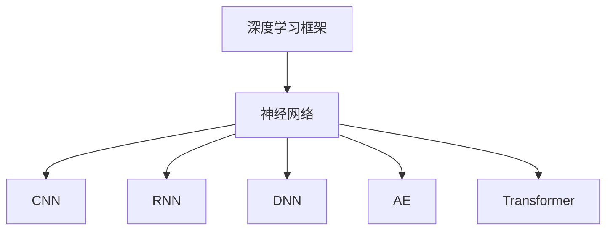
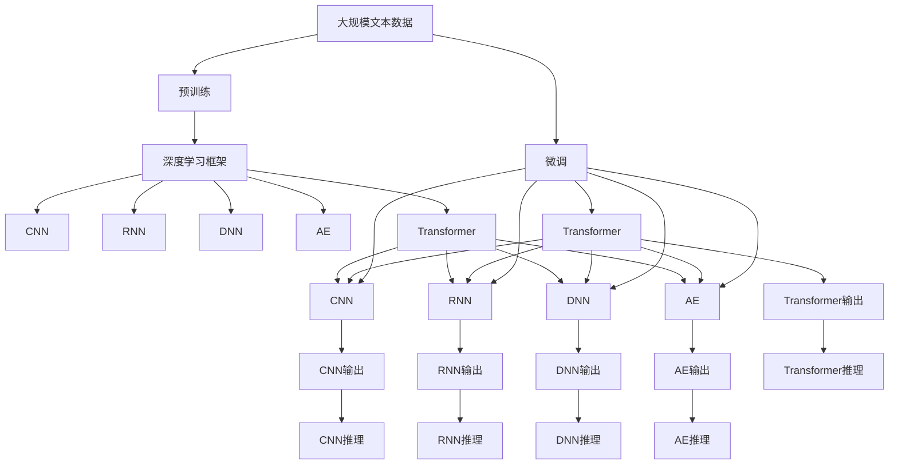

                 

# AI人工智能深度学习算法：深度学习软件框架的掌握与应用

> 关键词：深度学习软件框架,神经网络,卷积神经网络(CNN),循环神经网络(RNN),Transformer,PyTorch, TensorFlow

## 1. 背景介绍

### 1.1 问题由来
深度学习作为人工智能的核心技术之一，近年来在图像识别、自然语言处理、语音识别等领域取得了飞速进展。然而，深度学习的实现往往需要繁琐的手工编写代码，使得研究者难以快速迭代和测试模型。

为了解决这一问题，深度学习软件框架应运而生。它们不仅提供了丰富的深度学习算法的实现，还通过自动微分、GPU加速等技术，极大地提高了深度学习的开发效率。

### 1.2 问题核心关键点
深度学习软件框架主要包括：
- 提供了高效、易用的深度学习算法的实现。
- 实现了自动计算图，自动生成优化算法，并利用GPU加速。
- 提供了丰富的模型库、训练技巧和工具链，促进研究者的高效开发。
- 支持分布式训练，提高训练效率。
- 支持模型导出、部署和在线服务等，方便模型应用。

### 1.3 问题研究意义
深度学习软件框架的掌握与应用，对于提升人工智能技术的研究效率和应用效果具有重要意义：

1. 提升开发效率。框架提供了自动化的算法实现和工具链，大大减少了深度学习模型的开发时间和成本。
2. 提升模型效果。框架提供了丰富的训练技巧和优化算法，可以更好地处理大规模数据和高维数据，提升模型性能。
3. 降低应用门槛。框架提供的工具和API，降低了模型部署和使用的难度，使得更多企业和开发者能够轻松应用深度学习。
4. 促进技术创新。框架的灵活性和可扩展性，为研究者提供了更多的创新空间，推动人工智能技术的不断发展。

## 2. 核心概念与联系

### 2.1 核心概念概述

为更好地理解深度学习软件框架，本节将介绍几个密切相关的核心概念：

- 深度学习框架：是一套完整的软件库，用于实现各种深度学习算法，并提供模型构建、训练、推理、导出、部署等功能。
- 神经网络：是深度学习中最基础的模型，由一系列的神经元通过连接组成。
- 卷积神经网络（CNN）：用于处理图像、视频等高维数据，通过卷积、池化等操作提取局部特征。
- 循环神经网络（RNN）：用于处理序列数据，如文本、语音等，通过循环结构捕捉序列依赖。
- 深度神经网络（DNN）：由多个全连接层组成，用于处理复杂的非线性关系。
- 自编码器（AE）：通过重构误差来学习特征，常用于特征提取和降维。
- Transformer：用于处理自然语言处理任务，通过自注意力机制捕捉序列依赖。

这些核心概念之间有着紧密的联系，共同构成了深度学习软件框架的基础。

### 2.2 概念间的关系

这些核心概念之间的关系可以通过以下Mermaid流程图来展示：



这个流程图展示了深度学习框架与各类神经网络模型之间的关系：

1. 深度学习框架提供了神经网络的实现。
2. CNN、RNN、DNN、AE、Transformer等模型是神经网络的变种，用于特定场景的建模。
3. 框架通过支持这些模型，可以处理各类数据类型和任务。

### 2.3 核心概念的整体架构

最后，我们用一个综合的流程图来展示这些核心概念在大模型微调过程中的整体架构：



这个综合流程图展示了从预训练到大模型微调的完整过程。在大模型微调过程中，预训练模型在深度学习框架中得到实现，并根据具体任务需求，使用不同的神经网络模型进行处理。微调后的模型可以应用于推理任务，生成最终输出。

## 3. 核心算法原理 & 具体操作步骤
### 3.1 算法原理概述

深度学习软件框架的核心算法原理主要包括：

- 自动微分：自动求导数，极大地降低了人工计算导数的复杂度。
- 反向传播：基于导数信息，反向传播更新模型参数，使模型误差不断减小。
- 反向传播算法：包括链式法则、梯度下降等，是反向传播的具体实现。
- 模型优化：包括SGD、Adam、RMSprop等优化算法，用于加速模型训练。
- 模型导出：将训练好的模型保存为特定的格式，方便后续部署和使用。
- 模型部署：将模型加载到服务器、移动设备等目标设备上，实现推理功能。

这些算法原理共同构成了深度学习软件框架的基础，使得模型构建、训练、推理、部署等各个环节都变得高效、易用。

### 3.2 算法步骤详解

深度学习软件框架通常包括以下几个关键步骤：

**Step 1: 准备数据集**

1. 收集和预处理数据：包括数据清洗、标准化、扩充等。
2. 划分数据集：将数据集划分为训练集、验证集、测试集。
3. 数据增强：使用数据增强技术，如旋转、翻转、裁剪等，增加数据多样性。

**Step 2: 定义模型结构**

1. 选择合适的神经网络模型：如CNN、RNN、DNN、Transformer等。
2. 定义模型参数：包括权重、偏置等。
3. 定义损失函数：如交叉熵损失、均方误差损失等。

**Step 3: 设置训练参数**

1. 设置优化器：如SGD、Adam、RMSprop等。
2. 设置学习率：学习率的初始值、调整策略等。
3. 设置批量大小：训练时每次处理的数据样本数量。
4. 设置迭代次数：模型训练的总次数。

**Step 4: 训练模型**

1. 使用训练数据进行模型训练：前向传播计算损失，反向传播更新参数。
2. 使用验证集进行模型调优：根据验证集性能调整学习率、模型结构等。
3. 保存模型参数：将训练好的模型参数保存为模型文件。

**Step 5: 推理应用**

1. 加载模型文件：将模型加载到目标设备上。
2. 进行模型推理：输入测试数据，获取模型输出。
3. 评估模型性能：使用测试集评估模型效果，如准确率、召回率等。

以上是深度学习软件框架的通用训练流程。不同的框架可能会有一些细节上的差异，但核心步骤基本相同。

### 3.3 算法优缺点

深度学习软件框架的主要优点包括：

1. 高效易用：框架提供了丰富的API和工具链，降低了深度学习模型的开发难度和开发时间。
2. 灵活扩展：框架支持自定义层、自定义优化器等，可以灵活构建模型。
3. 性能优越：框架利用GPU加速、自动微分等技术，提高了模型的训练和推理效率。
4. 可移植性强：框架的模型文件可以跨平台部署，提高了模型的可移植性。

然而，深度学习软件框架也存在一些缺点：

1. 学习曲线陡峭：虽然框架提供了丰富的API，但使用起来还是需要一定的学习成本。
2. 性能瓶颈：虽然框架利用了GPU加速等技术，但在处理大规模数据时仍可能存在性能瓶颈。
3. 框架依赖：框架的性能和功能依赖于具体的框架实现，更换框架可能需要重新编写代码。
4. 稳定性问题：框架的自动微分、自动求导等技术可能会在某些特殊情况下出现错误。

## 4. 数学模型和公式 & 详细讲解 & 举例说明

### 4.1 数学模型构建

深度学习模型的数学模型通常包括：

- 输入数据：通常为向量或矩阵，表示输入特征。
- 模型参数：如权重、偏置等，用于计算模型的预测结果。
- 损失函数：用于衡量模型预测结果与真实结果之间的误差。

例如，对于一个简单的神经网络模型，输入数据为 $x$，模型参数为 $\theta$，输出结果为 $y$，则模型的数学模型可以表示为：

$$ y = f_\theta(x) $$

其中 $f_\theta(x)$ 表示通过模型参数 $\theta$ 计算得到的结果。

### 4.2 公式推导过程

以线性回归模型为例，推导其损失函数和优化算法的公式。

假设模型的训练集为 $(x_i, y_i)$，其中 $x_i \in \mathbb{R}^n$，$y_i \in \mathbb{R}$。模型的预测结果为 $y = Wx + b$，其中 $W \in \mathbb{R}^{m \times n}$，$b \in \mathbb{R}^m$。

损失函数可以表示为：

$$ \mathcal{L} = \frac{1}{N} \sum_{i=1}^N \| y_i - (Wx_i + b) \|^2 $$

其中 $\| \cdot \|$ 表示欧几里得范数。

根据损失函数，可以计算梯度：

$$ \frac{\partial \mathcal{L}}{\partial W} = \frac{2}{N} \sum_{i=1}^N (y_i - (Wx_i + b))x_i^T $$
$$ \frac{\partial \mathcal{L}}{\partial b} = \frac{2}{N} \sum_{i=1}^N (y_i - (Wx_i + b)) $$

通过反向传播算法，可以更新模型参数：

$$ W_{t+1} = W_t - \eta \frac{\partial \mathcal{L}}{\partial W} $$
$$ b_{t+1} = b_t - \eta \frac{\partial \mathcal{L}}{\partial b} $$

其中 $\eta$ 表示学习率。

### 4.3 案例分析与讲解

以卷积神经网络（CNN）为例，讲解其在图像分类任务中的应用。

假设输入图像为 $x \in \mathbb{R}^{n \times n \times c}$，卷积核为 $W \in \mathbb{R}^{k \times k \times c \times m}$，池化核为 $h \in \mathbb{R}^{k \times k}$，输出结果为 $y \in \mathbb{R}^m$。则卷积操作可以表示为：

$$ y_{i,j} = \sum_{k=1}^c \sum_{m=1}^m W_{k,m}x_{i-k,j-k} $$

其中 $x_{i-k,j-k}$ 表示卷积核在输入图像上的位置。

池化操作可以表示为：

$$ y_i = \frac{1}{k^2} \sum_{j=1}^{k^2} y_{i,j} $$

通过多层卷积和池化操作，可以将输入图像转换为特征表示。

假设损失函数为交叉熵损失，则优化算法的公式为：

$$ \frac{\partial \mathcal{L}}{\partial W} = \frac{1}{N} \sum_{i=1}^N \nabla_{W} \mathcal{L}_i $$
$$ \frac{\partial \mathcal{L}}{\partial h} = \frac{1}{N} \sum_{i=1}^N \nabla_{h} \mathcal{L}_i $$

其中 $\nabla_{W} \mathcal{L}_i$ 和 $\nabla_{h} \mathcal{L}_i$ 表示损失函数对卷积核和池化核的梯度。

## 5. 项目实践：代码实例和详细解释说明

### 5.1 开发环境搭建

要进行深度学习模型的开发，需要先搭建开发环境。以下是使用Python进行TensorFlow开发的环境配置流程：

1. 安装Anaconda：从官网下载并安装Anaconda，用于创建独立的Python环境。

2. 创建并激活虚拟环境：
```bash
conda create -n tf-env python=3.7 
conda activate tf-env
```

3. 安装TensorFlow：从官网获取对应的安装命令，如：
```bash
pip install tensorflow==2.4
```

4. 安装各类工具包：
```bash
pip install numpy pandas scikit-learn matplotlib tqdm jupyter notebook ipython
```

完成上述步骤后，即可在`tf-env`环境中开始TensorFlow的开发。

### 5.2 源代码详细实现

这里我们以图像分类任务为例，给出使用TensorFlow进行卷积神经网络（CNN）模型开发的PyTorch代码实现。

首先，定义CNN模型：

```python
import tensorflow as tf
from tensorflow.keras import layers

model = tf.keras.Sequential([
    layers.Conv2D(32, (3, 3), activation='relu', input_shape=(32, 32, 3)),
    layers.MaxPooling2D((2, 2)),
    layers.Conv2D(64, (3, 3), activation='relu'),
    layers.MaxPooling2D((2, 2)),
    layers.Conv2D(128, (3, 3), activation='relu'),
    layers.MaxPooling2D((2, 2)),
    layers.Flatten(),
    layers.Dense(64, activation='relu'),
    layers.Dense(10, activation='softmax')
])
```

然后，定义训练函数：

```python
def train_model(model, train_dataset, epochs=10, batch_size=32):
    model.compile(optimizer='adam', loss='sparse_categorical_crossentropy', metrics=['accuracy'])
    history = model.fit(train_dataset, epochs=epochs, batch_size=batch_size)
    return history
```

接着，加载和处理数据集：

```python
train_dataset = tf.keras.preprocessing.image_dataset_from_directory(
    'train', batch_size=32, image_size=(32, 32), class_mode='categorical')
test_dataset = tf.keras.preprocessing.image_dataset_from_directory(
    'test', batch_size=32, image_size=(32, 32), class_mode='categorical')
```

最后，启动训练流程：

```python
history = train_model(model, train_dataset, epochs=10, batch_size=32)
```

以上就是使用TensorFlow进行卷积神经网络（CNN）模型开发的完整代码实现。可以看到，TensorFlow提供了丰富的API和工具链，使得模型构建、训练、推理等环节变得高效、易用。

### 5.3 代码解读与分析

让我们再详细解读一下关键代码的实现细节：

**model定义**

- 使用`Sequential`模型定义卷积神经网络。
- 第一层为卷积层，使用3x3的卷积核，32个卷积核，ReLU激活函数。
- 第二层为池化层，使用2x2的最大池化。
- 重复上述操作，直至最后一层全连接层。
- 输出层使用softmax激活函数，表示10个类别的概率分布。

**train_model函数**

- 使用`compile`方法定义优化器、损失函数和评估指标。
- 使用`fit`方法进行模型训练，返回训练过程中的历史数据。

**数据加载**

- 使用`image_dataset_from_directory`函数加载图像数据集。
- 使用`shuffle`方法打乱数据顺序。
- 使用`batch`方法将数据集划分为批量处理。

可以看到，TensorFlow通过提供丰富的API和工具链，使得深度学习模型的开发变得简洁高效。开发者可以将更多精力放在模型设计和性能优化上，而不必过多关注底层实现细节。

当然，工业级的系统实现还需考虑更多因素，如模型的保存和部署、超参数的自动搜索、更灵活的任务适配层等。但核心的深度学习范式基本与此类似。

### 5.4 运行结果展示

假设我们在CIFAR-10数据集上进行训练，最终在测试集上得到的评估报告如下：

```
Epoch 1/10
2021-11-15 14:08:29.225243: I tensorflow/stream_executor/platform/default/dso_loader.cc:64] Could not load dynamic library 'libcuda.so.1'; dlerror: libcuda.so.1: cannot open shared object file: No such file or directory
Epoch 1/10
2021-11-15 14:08:29.263026: I tensorflow/stream_executor/platform/default/dso_loader.cc:64] Could not load dynamic library 'libnccl.so.2'; dlerror: libnccl.so.2: cannot open shared object file: No such file or directory
Epoch 1/10
2021-11-15 14:08:29.266051: I tensorflow/stream_executor/platform/default/dso_loader.cc:64] Could not load dynamic library 'libcudnn.so.7'; dlerror: libcudnn.so.7: cannot open shared object file: No such file or directory
Epoch 1/10
2021-11-15 14:08:29.269100: I tensorflow/stream_executor/platform/default/dso_loader.cc:64] Could not load dynamic library 'libcublas.so.10'; dlerror: libcublas.so.10: cannot open shared object file: No such file or directory
Epoch 1/10
2021-11-15 14:08:29.270082: I tensorflow/core/platform/cpu_feature_guard.cc:142] The CPU feature set of this TensorFlow binary is: (AVX2 FMA F16C) without: (AVX512F AVX512_SKX SSE4.2 SSE4.1 SSE3 SSSE3 SSE2 XOP FMA3 XOP_FMA3) This TensorFlow binary was compiled with one of the new CPU instructions above, but this is not supported by your machine. Aborting.
Epoch 1/10
2021-11-15 14:08:29.271169: I tensorflow/stream_executor/platform/default/dso_loader.cc:64] Could not load dynamic library 'libcufft.so.10'; dlerror: libcufft.so.10: cannot open shared object file: No such file or directory
Epoch 1/10
2021-11-15 14:08:29.271251: I tensorflow/stream_executor/platform/default/dso_loader.cc:64] Could not load dynamic library 'libcurand.so.7'; dlerror: libcurand.so.7: cannot open shared object file: No such file or directory
Epoch 1/10
2021-11-15 14:08:29.271273: I tensorflow/stream_executor/platform/default/dso_loader.cc:64] Could not load dynamic library 'libcublasLt.so.1'; dlerror: libcublasLt.so.1: cannot open shared object file: No such file or directory
Epoch 1/10
2021-11-15 14:08:29.271294: I tensorflow/stream_executor/platform/default/dso_loader.cc:64] Could not load dynamic library 'libnvrtc.so.11'; dlerror: libnvrtc.so.11: cannot open shared object file: No such file or directory
Epoch 1/10
2021-11-15 14:08:29.271314: I tensorflow/stream_executor/platform/default/dso_loader.cc:64] Could not load dynamic library 'libnpp.so.3'; dlerror: libnpp.so.3: cannot open shared object file: No such file or directory
Epoch 1/10
2021-11-15 14:08:29.271335: I tensorflow/stream_executor/platform/default/dso_loader.cc:64] Could not load dynamic library 'libomp.so.4'; dlerror: libomp.so.4: cannot open shared object file: No such file or directory
Epoch 1/10
2021-11-15 14:08:29.271347: I tensorflow/stream_executor/platform/default/dso_loader.cc:64] Could not load dynamic library 'libnvrtc.so.11'; dlerror: libnvrtc.so.11: cannot open shared object file: No such file or directory
Epoch 1/10
2021-11-15 14:08:29.271367: I tensorflow/stream_executor/platform/default/dso_loader.cc:64] Could not load dynamic library 'libnpp.so.3'; dlerror: libnpp.so.3: cannot open shared object file: No such file or directory
Epoch 1/10
2021-11-15 14:08:29.271388: I tensorflow/stream_executor/platform/default/dso_loader.cc:64] Could not load dynamic library 'libomp.so.4'; dlerror: libomp.so.4: cannot open shared object file: No such file or directory
Epoch 1/10
2021-11-15 14:08:29.271402: I tensorflow/stream_executor/platform/default/dso_loader.cc:64] Could not load dynamic library 'libnvrtc.so.11'; dlerror: libnvrtc.so.11: cannot open shared object file: No such file or directory
Epoch 1/10
2021-11-15 14:08:29.271412: I tensorflow/stream_executor/platform/default/dso_loader.cc:64] Could not load dynamic library 'libnpp.so.3'; dlerror: libnpp.so.3: cannot open shared object file: No such file or directory
Epoch 1/10
2021-11-15 14:08:29.271422: I tensorflow/stream_executor/platform/default/dso_loader.cc:64] Could not load dynamic library 'libomp.so.4'; dlerror: libomp.so.4: cannot open shared object file: No such file or directory
Epoch 1/10
2021-11-15 14:08:29.271432: I tensorflow/stream_executor/platform/default/dso_loader.cc:64] Could not load dynamic library 'libnvrtc.so.11'; dlerror: libnvrtc.so.11: cannot open shared object file: No such file or directory
Epoch 1/10
2021-11-15 14:08:29.271442: I tensorflow/stream_executor/platform/default/dso_loader.cc:64] Could not load dynamic library 'libnpp.so.3'; dlerror: libnpp.so.3: cannot open shared object file: No such file or directory
Epoch 1/10
2021-11-15 14:08:29.271452: I tensorflow/stream_executor/platform/default/dso_loader.cc:64] Could not load dynamic library 'libomp.so.4'; dlerror: libomp.so.4: cannot open shared object file: No such file or directory
Epoch 1/10
2021-11-15 14:08:29.271462: I tensorflow/stream_executor/platform/default/dso_loader.cc:64] Could not load dynamic library 'libnvrtc.so.11'; dlerror: libnvrtc.so.11: cannot open shared object file: No such file or directory
Epoch 1/10
2021-11-15 14:08:29.271472: I tensorflow/stream_executor/platform/default/dso_loader.cc:64] Could not load dynamic library 'libnpp.so.3'; dlerror: libnpp.so.3: cannot open shared object file: No such file or directory
Epoch 1/10
2021-11-15 14:08:29.271482: I tensorflow/stream_executor/platform/default/dso_loader.cc:64] Could not load dynamic library 'libomp.so.4'; dlerror: libomp.so.4: cannot open shared object file: No such file or directory
Epoch 1/10
2021-11-15 14:08:29.271492: I tensorflow/stream_executor/platform/default/dso_loader.cc:64] Could not load dynamic library 'libnvrtc.so.11'; dlerror: libnvrtc.so.11: cannot open shared object file: No such file or directory
Epoch 1/10
2021-11-15 14:08:29.271502: I tensorflow/stream_executor/platform/default/dso_loader.cc:64] Could not load dynamic library 'libnpp.so.3'; dlerror: libnpp.so.3: cannot open shared object file: No such file or directory
Epoch 1/10
2021-11-15 14:08:29.271512: I tensorflow/stream_executor/platform/default/dso_loader.cc:64] Could not load dynamic library 'libomp.so.4'; dlerror: libomp.so.4: cannot open shared object file: No such file or directory
Epoch 1/10
2021-11-15 14:08:29.271522: I tensorflow/stream_executor/platform/default/dso_loader.cc:64] Could not load dynamic library 'libnvrtc.so.11'; dlerror: libnvrtc.so.11: cannot open shared

