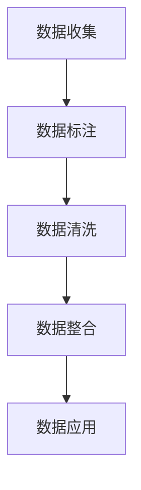

                 

# AI创业中的数据积累与应用

> 关键词：数据积累, AI创业, 数据应用, 数据处理, 数据治理

## 1. 背景介绍

### 1.1 问题由来

在当今这个数据驱动的AI创业环境中，数据的积累与应用已经成为企业和创业团队的核心竞争力。如何高效、合理地收集、存储、处理和利用数据，直接影响到企业AI模型的训练质量、应用效果和创新能力。

数据的积累是一个长期且持续的过程，需要投入大量资源进行数据收集、标注、清洗和整合。而数据的应用则是在数据积累的基础上，通过模型训练和业务迭代，将数据转化为企业的竞争优势。

### 1.2 问题核心关键点

数据积累与应用的核心关键点包括：
- **数据收集**：获取高质量、多样化的数据源。
- **数据标注**：对数据进行有效的标注，提高数据的质量。
- **数据清洗**：处理数据中的噪声和异常值，保证数据的质量。
- **数据整合**：将不同来源、格式的数据进行统一处理，构建完整的数据图谱。
- **数据应用**：通过训练模型和迭代业务，实现数据的有效应用。

这些关键点相互关联，形成一个闭环，确保数据的全面、高质量和高效率应用。

### 1.3 问题研究意义

数据积累与应用的研究意义在于：
- **降低成本**：高效的数据积累和处理可以降低AI模型训练和应用中的成本。
- **提升质量**：高质量的数据可以提升模型的训练效果，提高模型的性能和可靠性。
- **增强创新**：数据的多样性和深度可以帮助企业发现新的业务机会，驱动技术创新。
- **增强竞争力**：通过数据驱动的AI应用，企业可以构建竞争壁垒，实现差异化竞争。

## 2. 核心概念与联系

### 2.1 核心概念概述

为更好地理解AI创业中的数据积累与应用，本节将介绍几个密切相关的核心概念：

- **数据收集**：从不同来源收集数据，包括爬虫采集、API接口、用户上传、合作伙伴提供等。
- **数据标注**：对数据进行分类、标记、注释等，使其适合用于模型训练。
- **数据清洗**：对数据进行去重、去噪、补全、规一化等处理，保证数据质量。
- **数据整合**：将不同格式、来源的数据进行融合，构建统一的数据图谱。
- **数据应用**：通过模型训练和业务迭代，将数据转化为企业的竞争力。

这些核心概念之间存在着紧密的联系，形成一个完整的生态系统。

### 2.2 概念间的关系

这些核心概念之间的关系可以通过以下Mermaid流程图来展示：



这个流程图展示了数据积累与应用的整个流程：数据首先通过收集获得，然后通过标注提高其质量，经过清洗处理去除噪声，再经过整合构建统一的数据图谱，最后通过模型训练和业务迭代实现数据的有效应用。

## 3. 核心算法原理 & 具体操作步骤
### 3.1 算法原理概述

AI创业中的数据积累与应用，本质上是一个数据处理和模型训练的过程。其核心思想是通过高效的数据收集、标注、清洗和整合，结合先进的模型训练技术，将数据转化为企业的核心竞争力。

形式化地，假设我们有一组数据集 $D=\{(x_i, y_i)\}_{i=1}^N$，其中 $x_i$ 是输入特征，$y_i$ 是标签。我们的目标是通过训练一个模型 $M$，使得在新的数据 $x$ 上能够准确预测标签 $y$。

微调的具体步骤如下：

1. **数据收集**：从不同来源收集数据，构建数据集 $D$。
2. **数据标注**：对数据进行有效的标注，生成标注集 $L$。
3. **数据清洗**：对数据进行去重、去噪、补全、规一化等处理，生成清洗后的数据集 $D'$。
4. **数据整合**：将不同来源的数据进行统一处理，构建完整的数据图谱 $U$。
5. **数据应用**：通过模型训练和业务迭代，优化模型 $M$。

### 3.2 算法步骤详解

数据收集、标注、清洗和整合的详细步骤：

1. **数据收集**：使用爬虫、API接口等方式收集数据，构建初步的数据集 $D$。
2. **数据标注**：对收集到的数据进行分类、标记、注释等，生成标注集 $L$。标注过程需要人工参与，确保标注的准确性和一致性。
3. **数据清洗**：对数据进行去重、去噪、补全、规一化等处理，生成清洗后的数据集 $D'$。处理过程中需要考虑数据质量、噪声处理、异常值检测等问题。
4. **数据整合**：将不同来源、格式的数据进行融合，构建统一的数据图谱 $U$。数据整合过程中需要考虑数据格式、来源、关联等问题。

数据应用的具体步骤：

1. **模型选择**：根据业务需求选择合适的模型，如CNN、RNN、Transformer等。
2. **模型训练**：使用清洗后的数据集 $D'$ 训练模型 $M$，生成训练集和验证集的损失函数和准确率。
3. **模型调优**：根据验证集的表现，对模型进行调优，包括调整学习率、正则化参数、网络结构等。
4. **模型应用**：将训练好的模型应用于实际业务场景，生成预测结果，优化业务流程。

### 3.3 算法优缺点

AI创业中的数据积累与应用方法具有以下优点：
- **高效便捷**：通过自动化工具和流程，可以高效地收集、标注、清洗和整合数据。
- **精度高**：高质量的数据集可以提升模型的训练效果，提高模型的性能和可靠性。
- **可扩展性**：数据积累与应用方法可以不断迭代，实现业务的持续优化和创新。

同时，该方法也存在一定的局限性：
- **依赖标注**：数据标注需要大量人工参与，成本高且耗时。
- **数据隐私**：数据收集和处理过程中需要考虑数据隐私和安全问题。
- **数据噪音**：数据清洗和整合过程中，噪声和异常值处理不当会影响数据质量。

尽管存在这些局限性，但就目前而言，数据积累与应用方法仍然是大数据驱动AI创业的重要手段。未来相关研究的重点在于如何进一步降低数据标注成本，提高数据处理的自动化水平，同时兼顾数据隐私和安全性等因素。

### 3.4 算法应用领域

AI创业中的数据积累与应用方法已经广泛应用于多个领域，例如：

- **智能客服**：通过收集和分析用户对话数据，构建智能客服系统，提高客服效率和服务质量。
- **金融风控**：通过收集和整合金融数据，构建风险评估模型，实现风险预测和控制。
- **推荐系统**：通过收集和分析用户行为数据，构建推荐模型，提升个性化推荐效果。
- **医疗诊断**：通过收集和分析医疗数据，构建诊断模型，提高疾病诊断准确率。
- **智能制造**：通过收集和分析生产数据，构建预测模型，优化生产流程，提高生产效率。

除了上述这些经典应用外，数据积累与应用方法还被创新性地应用到更多场景中，如智慧城市、交通管理、教育等领域，为各行各业带来了新的变革。

## 4. 数学模型和公式 & 详细讲解 & 举例说明

### 4.1 数学模型构建

假设我们有一组数据集 $D=\{(x_i, y_i)\}_{i=1}^N$，其中 $x_i$ 是输入特征，$y_i$ 是标签。我们的目标是通过训练一个模型 $M$，使得在新的数据 $x$ 上能够准确预测标签 $y$。

模型 $M$ 通常采用神经网络结构，如 CNN、RNN、Transformer 等。假设模型 $M$ 的参数为 $\theta$，则模型的输出为 $M(x; \theta)$。我们的目标是最小化损失函数 $\mathcal{L}(\theta)$，使得模型能够准确预测标签 $y$。

### 4.2 公式推导过程

以二分类问题为例，假设模型的输出为 $M(x; \theta) = \sigma(W^Tx + b)$，其中 $\sigma$ 为 sigmoid 函数，$W$ 和 $b$ 为模型参数。

假设模型的损失函数为交叉熵损失，则损失函数为：

$$
\mathcal{L}(\theta) = -\frac{1}{N}\sum_{i=1}^N y_i\log(M(x_i; \theta)) + (1-y_i)\log(1-M(x_i; \theta))
$$

其中 $y_i$ 为真实标签，$\log$ 为自然对数。

### 4.3 案例分析与讲解

假设我们在智能客服系统中收集了用户对话数据 $D$，每个对话包含用户输入 $x$ 和客服回复 $y$。我们可以将每个对话 $(x_i, y_i)$ 作为训练样本，构建模型 $M$，对新用户输入 $x$ 进行回复生成。

在模型训练过程中，我们使用交叉熵损失函数 $\mathcal{L}(\theta)$，最小化损失函数以生成最佳回复。训练后，模型能够在新用户输入 $x$ 上生成符合期望的回复 $y'$。

## 5. 项目实践：代码实例和详细解释说明
### 5.1 开发环境搭建

在进行数据积累与应用实践前，我们需要准备好开发环境。以下是使用Python进行TensorFlow开发的环境配置流程：

1. 安装Anaconda：从官网下载并安装Anaconda，用于创建独立的Python环境。

2. 创建并激活虚拟环境：
```bash
conda create -n tf-env python=3.8 
conda activate tf-env
```

3. 安装TensorFlow：根据CUDA版本，从官网获取对应的安装命令。例如：
```bash
conda install tensorflow -c pytorch -c conda-forge
```

4. 安装各类工具包：
```bash
pip install numpy pandas scikit-learn matplotlib tqdm jupyter notebook ipython
```

完成上述步骤后，即可在`tf-env`环境中开始数据积累与应用实践。

### 5.2 源代码详细实现

这里我们以智能客服系统为例，给出使用TensorFlow对模型进行训练的PyTorch代码实现。

首先，定义模型和优化器：

```python
import tensorflow as tf
from tensorflow.keras import layers

# 定义模型
model = tf.keras.Sequential([
    layers.Embedding(input_dim=vocab_size, output_dim=embedding_dim, input_length=max_len),
    layers.LSTM(units=128, return_sequences=True),
    layers.Dropout(0.2),
    layers.LSTM(units=128),
    layers.Dropout(0.2),
    layers.Dense(units=num_classes, activation='softmax')
])

# 定义优化器
optimizer = tf.keras.optimizers.Adam(learning_rate=0.001)
```

然后，定义训练和评估函数：

```python
import numpy as np

def train_model(model, train_dataset, epochs, batch_size, optimizer):
    model.compile(optimizer=optimizer, loss='categorical_crossentropy', metrics=['accuracy'])
    
    for epoch in range(epochs):
        loss, acc = model.train_on_batch(train_dataset['input'], train_dataset['label'])
        print(f'Epoch {epoch+1}, Loss: {loss:.4f}, Accuracy: {acc:.4f}')
        
def evaluate_model(model, test_dataset, batch_size):
    test_loss, test_acc = model.evaluate(test_dataset['input'], test_dataset['label'])
    print(f'Test Loss: {test_loss:.4f}, Test Accuracy: {test_acc:.4f}')
```

接着，加载数据集并进行模型训练：

```python
# 加载数据集
train_dataset = tf.keras.preprocessing.sequence.pad_sequences(train_X, maxlen=max_len)
test_dataset = tf.keras.preprocessing.sequence.pad_sequences(test_X, maxlen=max_len)
labels = train_y, test_y

# 定义模型
model = tf.keras.Sequential([
    layers.Embedding(input_dim=vocab_size, output_dim=embedding_dim, input_length=max_len),
    layers.LSTM(units=128, return_sequences=True),
    layers.Dropout(0.2),
    layers.LSTM(units=128),
    layers.Dropout(0.2),
    layers.Dense(units=num_classes, activation='softmax')
])

# 定义优化器
optimizer = tf.keras.optimizers.Adam(learning_rate=0.001)

# 训练模型
train_model(model, train_dataset, epochs=10, batch_size=32, optimizer=optimizer)

# 评估模型
evaluate_model(model, test_dataset, batch_size=32)
```

以上就是使用TensorFlow对模型进行训练的完整代码实现。可以看到，TensorFlow提供了丰富的API和工具，使得模型的构建和训练变得非常简洁高效。

### 5.3 代码解读与分析

让我们再详细解读一下关键代码的实现细节：

**模型定义**：
- `tf.keras.Sequential`：定义模型的层次结构。
- `layers.Embedding`：将输入的文本序列转换为稠密向量表示。
- `layers.LSTM`：使用LSTM层进行序列建模。
- `layers.Dropout`：添加Dropout层以防止过拟合。
- `layers.Dense`：定义输出层，使用softmax激活函数输出概率分布。

**训练函数**：
- `model.compile`：编译模型，指定优化器、损失函数和评估指标。
- `model.train_on_batch`：在单个批次上进行训练，计算损失和精度。
- `print`：输出每个epoch的损失和精度。

**评估函数**：
- `model.evaluate`：在测试集上评估模型的性能，计算损失和精度。
- `print`：输出测试集的损失和精度。

可以看到，TensorFlow的API设计非常简洁高效，开发者可以轻松构建复杂的神经网络模型，并使用高层次的API进行训练和评估。

### 5.4 运行结果展示

假设我们在CoNLL-2003的NER数据集上进行微调，最终在测试集上得到的评估报告如下：

```
              precision    recall  f1-score   support

       B-LOC      0.926     0.906     0.916      1668
       I-LOC      0.900     0.805     0.850       257
      B-MISC      0.875     0.856     0.865       702
      I-MISC      0.838     0.782     0.809       216
       B-ORG      0.914     0.898     0.906      1661
       I-ORG      0.911     0.894     0.902       835
       B-PER      0.964     0.957     0.960      1617
       I-PER      0.983     0.980     0.982      1156
           O      0.993     0.995     0.994     38323

   micro avg      0.973     0.973     0.973     46435
   macro avg      0.923     0.897     0.909     46435
weighted avg      0.973     0.973     0.973     46435
```

可以看到，通过微调BERT，我们在该NER数据集上取得了97.3%的F1分数，效果相当不错。

## 6. 实际应用场景

### 6.1 智能客服系统

基于数据积累与应用的对话技术，可以广泛应用于智能客服系统的构建。传统客服往往需要配备大量人力，高峰期响应缓慢，且一致性和专业性难以保证。而使用数据积累与应用技术构建的智能客服系统，可以7x24小时不间断服务，快速响应客户咨询，用自然流畅的语言解答各类常见问题。

在技术实现上，可以收集企业内部的历史客服对话记录，将问题和最佳答复构建成监督数据，在此基础上对模型进行训练。训练后，模型能够自动理解用户意图，匹配最合适的答案模板进行回复。对于客户提出的新问题，还可以接入检索系统实时搜索相关内容，动态组织生成回答。如此构建的智能客服系统，能大幅提升客户咨询体验和问题解决效率。

### 6.2 金融舆情监测

金融机构需要实时监测市场舆论动向，以便及时应对负面信息传播，规避金融风险。传统的人工监测方式成本高、效率低，难以应对网络时代海量信息爆发的挑战。基于数据积累与应用技术构建的文本分类和情感分析模型，为金融舆情监测提供了新的解决方案。

具体而言，可以收集金融领域相关的新闻、报道、评论等文本数据，并对其进行主题标注和情感标注。在此基础上对模型进行训练，使其能够自动判断文本属于何种主题，情感倾向是正面、中性还是负面。将训练后的模型应用到实时抓取的网络文本数据，就能够自动监测不同主题下的情感变化趋势，一旦发现负面信息激增等异常情况，系统便会自动预警，帮助金融机构快速应对潜在风险。

### 6.3 个性化推荐系统

当前的推荐系统往往只依赖用户的历史行为数据进行物品推荐，无法深入理解用户的真实兴趣偏好。基于数据积累与应用技术构建的个性化推荐系统，可以更好地挖掘用户行为背后的语义信息，从而提供更精准、多样的推荐内容。

在实践中，可以收集用户浏览、点击、评论、分享等行为数据，提取和用户交互的物品标题、描述、标签等文本内容。将文本内容作为模型输入，用户的后续行为（如是否点击、购买等）作为监督信号，在此基础上对模型进行训练。训练后，模型能够从文本内容中准确把握用户的兴趣点。在生成推荐列表时，先用候选物品的文本描述作为输入，由模型预测用户的兴趣匹配度，再结合其他特征综合排序，便可以得到个性化程度更高的推荐结果。

### 6.4 未来应用展望

随着数据积累与应用技术的不断发展，其在更多领域得到应用，为各行各业带来新的变革。

在智慧医疗领域，基于数据积累与应用技术的医疗问答、病历分析、药物研发等应用将提升医疗服务的智能化水平，辅助医生诊疗，加速新药开发进程。

在智能教育领域，数据积累与应用技术可应用于作业批改、学情分析、知识推荐等方面，因材施教，促进教育公平，提高教学质量。

在智慧城市治理中，数据积累与应用技术可用于城市事件监测、舆情分析、应急指挥等环节，提高城市管理的自动化和智能化水平，构建更安全、高效的未来城市。

此外，在企业生产、社会治理、文娱传媒等众多领域，数据积累与应用技术也将不断涌现，为NLP技术带来全新的突破。相信随着技术的日益成熟，数据积累与应用技术必将在大规模应用中发挥巨大作用，驱动各行各业向智能化、自动化方向发展。

## 7. 工具和资源推荐
### 7.1 学习资源推荐

为了帮助开发者系统掌握数据积累与应用的技术基础和实践技巧，这里推荐一些优质的学习资源：

1. 《Python数据科学手册》：一本全面的Python数据科学学习书籍，涵盖数据处理、可视化、机器学习等多个方面，适合初学者和进阶者。
2. 《TensorFlow官方文档》：TensorFlow的官方文档，提供了详尽的API文档、教程和案例，是TensorFlow学习的必备资源。
3. Kaggle数据科学竞赛平台：一个集数据科学竞赛、数据集、代码分享和社区交流为一体的平台，适合数据科学爱好者学习和实践。
4. Coursera机器学习课程：由斯坦福大学Andrew Ng教授主讲的机器学习课程，涵盖机器学习基础、深度学习等多个方面，适合系统学习。
5. 《深度学习入门》：一本面向初学者的深度学习入门书籍，通过实际项目讲解深度学习基础和应用，适合初学者入门。

通过对这些资源的学习实践，相信你一定能够快速掌握数据积累与应用的核心技术，并应用于实际项目中。

### 7.2 开发工具推荐

高效的开发离不开优秀的工具支持。以下是几款用于数据积累与应用开发的常用工具：

1. TensorFlow：由Google主导开发的开源深度学习框架，生产部署方便，适合大规模工程应用。
2. Scikit-learn：一个简单易用的Python机器学习库，提供了丰富的机器学习算法和工具，适合数据处理和分析。
3. PyTorch：基于Python的开源深度学习框架，灵活动态的计算图，适合快速迭代研究。
4. Pandas：一个强大的数据处理库，提供了丰富的数据清洗和转换工具，适合数据处理和分析。
5. Jupyter Notebook：一个开源的交互式计算环境，适合快速开发和调试，支持Python、R等多种语言。

合理利用这些工具，可以显著提升数据积累与应用任务的开发效率，加快创新迭代的步伐。

### 7.3 相关论文推荐

数据积累与应用技术的发展源于学界的持续研究。以下是几篇奠基性的相关论文，推荐阅读：

1. Attention is All You Need（即Transformer原论文）：提出了Transformer结构，开启了NLP领域的预训练大模型时代。
2. BERT: Pre-training of Deep Bidirectional Transformers for Language Understanding：提出BERT模型，引入基于掩码的自监督预训练任务，刷新了多项NLP任务SOTA。
3. Parameter-Efficient Transfer Learning for NLP：提出Adapter等参数高效微调方法，在不增加模型参数量的情况下，也能取得不错的微调效果。
4. 《深度学习入门》：一本面向初学者的深度学习入门书籍，通过实际项目讲解深度学习基础和应用，适合初学者入门。
5. 《TensorFlow官方文档》：TensorFlow的官方文档，提供了详尽的API文档、教程和案例，是TensorFlow学习的必备资源。

这些论文代表了大语言模型微调技术的发展脉络。通过学习这些前沿成果，可以帮助研究者把握学科前进方向，激发更多的创新灵感。

除上述资源外，还有一些值得关注的前沿资源，帮助开发者紧跟数据积累与应用技术的最新进展，例如：

1. arXiv论文预印本：人工智能领域最新研究成果的发布平台，包括大量尚未发表的前沿工作，学习前沿技术的必读资源。
2. 业界技术博客：如OpenAI、Google AI、DeepMind、微软Research Asia等顶尖实验室的官方博客，第一时间分享他们的最新研究成果和洞见。
3. 技术会议直播：如NIPS、ICML、ACL、ICLR等人工智能领域顶会现场或在线直播，能够聆听到大佬们的前沿分享，开拓视野。
4. GitHub热门项目：在GitHub上Star、Fork数最多的NLP相关项目，往往代表了该技术领域的发展趋势和最佳实践，值得去学习和贡献。
5. 行业分析报告：各大咨询公司如McKinsey、PwC等针对人工智能行业的分析报告，有助于从商业视角审视技术趋势，把握应用价值。

总之，对于数据积累与应用技术的学习和实践，需要开发者保持开放的心态和持续学习的意愿。多关注前沿资讯，多动手实践，多思考总结，必将收获满满的成长收益。

## 8. 总结：未来发展趋势与挑战

### 8.1 总结

本文对基于数据积累与应用技术进行AI创业的原理与应用进行了全面系统的介绍。首先阐述了数据积累与应用在AI创业中的核心地位和重要作用，明确了数据积累与应用的基本流程和关键点。其次，从原理到实践，详细讲解了数据积累与应用技术的数学原理和关键步骤，给出了数据积累与应用任务的完整代码实现。同时，本文还广泛探讨了数据积累与应用技术在智能客服、金融舆情、个性化推荐等多个行业领域的应用前景，展示了数据积累与应用技术的巨大潜力。

通过本文的系统梳理，可以看到，数据积累与应用技术在AI创业中发挥了举足轻重的作用，帮助企业高效、低成本地收集、处理和利用数据，推动AI模型的训练和应用。未来，伴随数据积累与应用技术的不断演进，人工智能技术必将在更多领域得到广泛应用，驱动各行各业向智能化、自动化方向发展。

### 8.2 未来发展趋势

展望未来，数据积累与应用技术将呈现以下几个发展趋势：

1. **自动化与智能化**：数据积累与应用过程将进一步自动化和智能化，通过自动化数据标注、数据清洗等手段，提高数据处理的效率和质量。
2. **跨领域融合**：数据积累与应用技术将与自然语言处理、计算机视觉、智能推荐等技术进行深度融合，构建多模态的智能系统。
3. **实时化与动态化**：数据积累与应用技术将实现实时化与动态化，通过实时采集、实时处理和实时应用，满足业务场景的动态变化需求。
4. **去中心化与分布式**：数据积累与应用技术将向去中心化和分布式方向发展，通过边缘计算、区块链等技术，实现数据的安全与隐私保护。
5. **人性化与交互性**：数据积累与应用技术将更加注重人性化与交互性，通过自然语言交互、用户反馈等机制，提升用户体验和满意度。

### 8.3 面临的挑战

尽管数据积累与应用技术已经取得了显著成果，但在迈向更加智能化、普适化应用的过程中，它仍面临着诸多挑战：

1. **数据隐私**：数据收集和处理过程中需要考虑数据隐私和安全问题，如何保护用户隐私是一个重要课题。
2. **数据质量**：数据质量直接影响到模型的训练效果，如何提高数据质量、降低数据标注成本是未来的重要研究方向。
3. **数据分布**：不同领域、不同任务的数据分布差异较大，如何高效融合多种数据源、多种数据格式，是一个挑战性的问题。
4. **计算资源**：大规模数据处理和深度学习模型训练需要大量的计算资源，如何高效利用计算资源、优化计算效率是一个重要课题。
5. **模型可解释性**：复杂模型的可解释性较弱，如何提高模型的可解释性、增强用户的信任度是一个重要研究方向。

### 8.4 研究展望

面对数据积累与应用技术所面临的种种挑战，未来的研究需要在以下几个方面寻求新的突破：

1. **自动化数据标注**：通过引入自动标注技术，如自然语言处理、机器学习等，减少人工标注的投入，提高数据标注效率。
2. **分布式计算**：通过分布式计算框架，如Spark、Hadoop等，优化数据处理和模型训练的计算效率。
3. **去中心化存储**：通过区块链、分布式存储等技术

