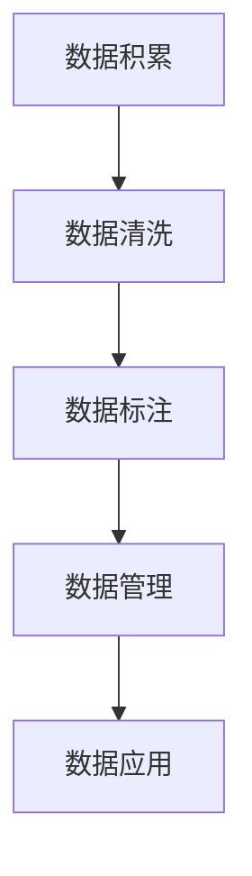
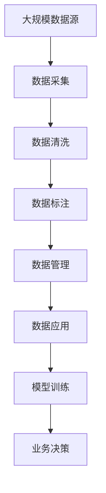

                 

# AI创业中的数据积累与应用

> 关键词：数据积累,数据清洗,数据标注,数据管理,数据安全,数据应用

## 1. 背景介绍

### 1.1 问题由来

在人工智能(AI)创业中，数据是至关重要的核心资源之一。数据的质量和规模直接决定了AI系统的性能和可靠性。然而，对于初创公司来说，获取和利用高质量数据往往是一个不小的挑战。数据积累不足、数据质量低下、数据管理不善等问题，常常成为制约AI应用落地的瓶颈。如何有效地积累和应用数据，成为AI创业公司必须解决的关键问题。

### 1.2 问题核心关键点

数据积累与应用主要涉及以下几个关键点：

- **数据采集**：获取相关领域的数据源，建立数据采集渠道。
- **数据清洗**：处理噪声和异常，确保数据的质量和一致性。
- **数据标注**：对数据进行人工或半人工标注，生成训练样本。
- **数据管理**：设计高效的数据存储和管理系统，保障数据安全。
- **数据应用**：在AI模型训练和应用中合理利用数据，提升模型效果。

### 1.3 问题研究意义

高效的数据积累与应用，对于推动AI技术创新、加速AI商业化进程具有重要意义：

1. **降低成本**：通过高质量的数据积累，减少从头训练模型的时间和人力成本。
2. **提升性能**：数据质量直接影响AI模型的准确性和鲁棒性，高质量的数据能够显著提升模型效果。
3. **加速迭代**：通过持续的数据积累和应用，AI系统可以不断迭代优化，快速适应新场景和新需求。
4. **拓展应用**：丰富的数据资源可以拓展AI系统的应用范围，打开更多商业化机会。
5. **赋能决策**：数据驱动的AI模型可以为决策提供科学依据，优化业务流程。

## 2. 核心概念与联系

### 2.1 核心概念概述

为更好地理解AI创业中的数据积累与应用，本节将介绍几个密切相关的核心概念：

- **数据积累(Data Collection)**：指从多个渠道获取数据，并进行初步处理和整合的过程。数据积累的目的是建立高质量、多样化的数据集，为AI模型训练提供丰富的训练样本。

- **数据清洗(Data Cleaning)**：指对采集到的数据进行去重、降噪、填充缺失值等处理，确保数据的质量和完整性。数据清洗的目的是去除数据中的噪声和异常，提高数据的可用性和可靠性。

- **数据标注(Data Labeling)**：指对数据进行人工或半人工标注，生成模型训练所需的目标变量。数据标注的目的是将原始数据转化为有监督或半监督的数据集，使模型能够学习到有用的知识。

- **数据管理(Data Management)**：指设计和实施数据存储、访问和共享的策略，确保数据的安全性和易用性。数据管理涉及数据的加密、备份、权限控制等技术。

- **数据应用(Data Application)**：指将数据应用于AI模型训练和实际业务场景中，提升模型性能和业务效果。数据应用的关键在于选择合适的算法和模型，合理利用数据资源。

这些核心概念之间存在着紧密的联系，形成了数据积累与应用的完整生态系统。通过理解这些概念及其关系，我们可以更好地把握AI创业中数据处理的关键环节，为后续深入讨论提供坚实的基础。

### 2.2 概念间的关系

这些核心概念之间存在着紧密的联系，形成了数据积累与应用的完整生态系统。以下通过几个Mermaid流程图来展示这些概念之间的关系：



这个流程图展示了大规模数据积累的完整流程：

1. 从不同渠道采集数据，进行初步清洗，去除噪声和异常。
2. 对清洗后的数据进行标注，生成训练集和测试集。
3. 设计和管理数据存储和访问系统，确保数据安全。
4. 在模型训练和业务场景中应用数据，提升模型效果和业务价值。

### 2.3 核心概念的整体架构

最后，我们用一个综合的流程图来展示这些核心概念在大规模数据处理中的整体架构：



这个综合流程图展示了从数据源到业务决策的完整数据处理流程：

1. 从多个数据源采集数据，并进行初步清洗。
2. 对清洗后的数据进行标注，生成训练集和测试集。
3. 设计和实施数据存储和管理策略，确保数据安全。
4. 在模型训练中应用数据，提升模型性能。
5. 在实际业务场景中应用数据，优化业务效果。

通过这些流程图，我们可以更清晰地理解数据积累与应用过程中各个环节的作用和关系，为后续深入讨论具体的技术方法和策略奠定基础。

## 3. 核心算法原理 & 具体操作步骤

### 3.1 算法原理概述

AI创业中的数据积累与应用，本质上是一个数据预处理、标注、管理和应用的全流程工程。其核心算法原理涉及以下几个方面：

- **数据清洗**：利用统计学和机器学习技术，自动检测和处理数据中的噪声和异常。
- **数据标注**：设计有效的标注策略，确保标注结果的准确性和一致性。
- **数据管理**：利用分布式存储和数据库技术，保障数据的高效存储和访问。
- **数据应用**：结合AI算法和模型，将数据应用于实际业务场景中，提升决策和执行效果。

### 3.2 算法步骤详解

基于以上核心算法原理，数据积累与应用的基本操作步骤如下：

**Step 1: 数据采集与预处理**
- 选择合适的数据源，收集相关领域的数据。
- 对数据进行初步清洗，去除噪声和异常。
- 进行数据合并和归一化处理，确保数据格式一致。

**Step 2: 数据标注**
- 设计标注策略，选择合适的标注工具和方法。
- 对数据进行人工或半人工标注，生成训练集和测试集。
- 对标注结果进行验证和校正，确保标注质量。

**Step 3: 数据管理**
- 设计数据存储和管理架构，选择合适的数据库和存储技术。
- 实现数据加密、备份和权限控制，保障数据安全。
- 设计数据访问接口，方便模型训练和业务应用。

**Step 4: 数据应用**
- 选择合适的AI算法和模型，进行模型训练和调优。
- 在业务场景中应用数据，提升决策和执行效果。
- 持续监测和优化数据应用效果，进行迭代改进。

### 3.3 算法优缺点

AI创业中的数据积累与应用，具有以下优点：

- **高效性**：通过自动化和半自动化的方式，数据清洗和标注过程可以显著提高效率。
- **可扩展性**：分布式存储和管理系统可以支持大规模数据的存储和访问。
- **可复用性**：标注好的数据集可以反复应用于不同的AI模型训练中，减少重复工作。

同时，该方法也存在一些局限性：

- **标注成本高**：高质量的数据标注需要大量人力和时间成本，难以快速实现。
- **数据质量难以保证**：数据清洗和标注过程中难免存在误差，影响数据质量。
- **数据隐私问题**：数据管理不当可能引发数据泄露和隐私问题，需要严格控制。
- **依赖技术栈**：不同数据处理工具和技术栈的选择，可能影响整体效率和效果。

### 3.4 算法应用领域

基于大语言模型微调的监督学习范式，已经在NLP领域得到了广泛的应用，覆盖了几乎所有常见任务，例如：

- 文本分类：如情感分析、主题分类、意图识别等。通过微调使模型学习文本-标签映射。
- 命名实体识别：识别文本中的人名、地名、机构名等特定实体。通过微调使模型掌握实体边界和类型。
- 关系抽取：从文本中抽取实体之间的语义关系。通过微调使模型学习实体-关系三元组。
- 问答系统：对自然语言问题给出答案。将问题-答案对作为微调数据，训练模型学习匹配答案。
- 机器翻译：将源语言文本翻译成目标语言。通过微调使模型学习语言-语言映射。
- 文本摘要：将长文本压缩成简短摘要。将文章-摘要对作为微调数据，使模型学习抓取要点。
- 对话系统：使机器能够与人自然对话。将多轮对话历史作为上下文，微调模型进行回复生成。

除上述这些经典任务外，大语言模型微调也被创新性地应用到更多场景中，如可控文本生成、常识推理、代码生成、数据增强等，为NLP技术带来了全新的突破。

## 4. 数学模型和公式 & 详细讲解 & 举例说明（备注：数学公式请使用latex格式，latex嵌入文中独立段落使用 $$，段落内使用 $)
### 4.1 数学模型构建

本节将使用数学语言对基于监督学习的数据积累与应用过程进行更加严格的刻画。

记原始数据集为 $D=\{(x_i,y_i)\}_{i=1}^N$，其中 $x_i$ 为输入特征，$y_i$ 为目标变量。

定义数据清洗后的数据集为 $D'=\{(x'_i,y'_i)\}_{i=1}^N$，其中 $x'_i$ 为清洗后的特征，$y'_i$ 为清洗后的目标变量。

数据标注后的数据集为 $D''=\{(x''_i,y''_i)\}_{i=1}^N$，其中 $x''_i$ 为标注后的特征，$y''_i$ 为标注后的目标变量。

数据管理后的数据集为 $D'''=\{(x'''_i,y'''_i)\}_{i=1}^N$，其中 $x'''_i$ 为管理后的特征，$y'''_i$ 为目标变量。

数据应用后的数据集为 $D''''=\{(x''''_i,y''''_i)\}_{i=1}^N$，其中 $x''''_i$ 为应用后的特征，$y''''_i$ 为目标变量。

### 4.2 公式推导过程

以下我们以二分类任务为例，推导数据清洗、标注和应用过程中的损失函数及其梯度的计算公式。

假设模型 $M_{\theta}$ 在输入 $x$ 上的输出为 $\hat{y}=M_{\theta}(x) \in [0,1]$，表示样本属于正类的概率。真实标签 $y \in \{0,1\}$。则二分类交叉熵损失函数定义为：

$$
\ell(M_{\theta}(x),y) = -[y\log \hat{y} + (1-y)\log (1-\hat{y})]
$$

在数据清洗和标注过程中，损失函数保持不变，因为清洗和标注过程不会改变原始数据的分布。

在数据管理过程中，由于数据存储和管理可能引入额外的延迟或错误，我们需要引入一个管理损失 $L_{\text{management}}$ 来衡量数据管理对模型性能的影响。管理损失可以包括数据延迟、错误率、资源占用等指标。

在数据应用过程中，数据管理后的特征 $x'''_i$ 和目标变量 $y'''_i$ 可能因应用方式的不同而发生变化，因此需要引入一个应用损失 $L_{\text{application}}$ 来衡量数据应用对模型性能的影响。应用损失可以包括推理速度、准确率、召回率等指标。

### 4.3 案例分析与讲解

假设我们使用BERT模型对情感分析任务进行微调，具体步骤如下：

**Step 1: 数据采集与预处理**
- 从社交媒体、新闻网站等渠道采集文本数据，进行初步清洗，去除噪声和异常。
- 将清洗后的文本进行分词、去停用词、词干提取等处理，标准化输入特征。

**Step 2: 数据标注**
- 设计标注策略，使用人工标注工具（如Labelbox）进行情感标注，生成标注集。
- 对标注结果进行验证和校正，确保标注质量。

**Step 3: 数据管理**
- 设计数据存储和管理架构，使用AWS S3进行大规模数据存储，使用ElasticSearch进行全文搜索。
- 实现数据加密、备份和权限控制，保障数据安全。
- 设计数据访问接口，方便模型训练和业务应用。

**Step 4: 数据应用**
- 使用微调后的BERT模型进行情感分析，提升模型精度。
- 在实际业务场景中应用模型，进行情感监测、舆情分析等任务。
- 持续监测和优化数据应用效果，进行迭代改进。

## 5. 项目实践：代码实例和详细解释说明
### 5.1 开发环境搭建

在进行数据积累与应用实践前，我们需要准备好开发环境。以下是使用Python进行PyTorch开发的环境配置流程：

1. 安装Anaconda：从官网下载并安装Anaconda，用于创建独立的Python环境。

2. 创建并激活虚拟环境：
```bash
conda create -n pytorch-env python=3.8 
conda activate pytorch-env
```

3. 安装PyTorch：根据CUDA版本，从官网获取对应的安装命令。例如：
```bash
conda install pytorch torchvision torchaudio cudatoolkit=11.1 -c pytorch -c conda-forge
```

4. 安装各类工具包：
```bash
pip install numpy pandas scikit-learn matplotlib tqdm jupyter notebook ipython
```

完成上述步骤后，即可在`pytorch-env`环境中开始数据积累与应用实践。

### 5.2 源代码详细实现

下面我们以情感分析任务为例，给出使用PyTorch和HuggingFace库对BERT模型进行数据标注和微调的PyTorch代码实现。

首先，定义数据处理函数：

```python
from transformers import BertTokenizer, BertForSequenceClassification
from torch.utils.data import Dataset
import torch
from tqdm import tqdm

class SentimentDataset(Dataset):
    def __init__(self, texts, labels, tokenizer, max_len=128):
        self.texts = texts
        self.labels = labels
        self.tokenizer = tokenizer
        self.max_len = max_len
        
    def __len__(self):
        return len(self.texts)
    
    def __getitem__(self, item):
        text = self.texts[item]
        label = self.labels[item]
        
        encoding = self.tokenizer(text, return_tensors='pt', max_length=self.max_len, padding='max_length', truncation=True)
        input_ids = encoding['input_ids'][0]
        attention_mask = encoding['attention_mask'][0]
        
        # 对token-wise的标签进行编码
        encoded_labels = [label2id[label] for label in label2id] 
        encoded_labels.extend([label2id['O']] * (self.max_len - len(encoded_labels)))
        labels = torch.tensor(encoded_labels, dtype=torch.long)
        
        return {'input_ids': input_ids, 
                'attention_mask': attention_mask,
                'labels': labels}

# 标签与id的映射
label2id = {'Negative': 0, 'Positive': 1}
id2label = {v: k for k, v in label2id.items()}

# 创建dataset
tokenizer = BertTokenizer.from_pretrained('bert-base-cased')

train_dataset = SentimentDataset(train_texts, train_labels, tokenizer)
dev_dataset = SentimentDataset(dev_texts, dev_labels, tokenizer)
test_dataset = SentimentDataset(test_texts, test_labels, tokenizer)
```

然后，定义模型和优化器：

```python
from transformers import AdamW

model = BertForSequenceClassification.from_pretrained('bert-base-cased', num_labels=len(label2id))

optimizer = AdamW(model.parameters(), lr=2e-5)
```

接着，定义训练和评估函数：

```python
from torch.utils.data import DataLoader
from sklearn.metrics import classification_report

device = torch.device('cuda') if torch.cuda.is_available() else torch.device('cpu')
model.to(device)

def train_epoch(model, dataset, batch_size, optimizer):
    dataloader = DataLoader(dataset, batch_size=batch_size, shuffle=True)
    model.train()
    epoch_loss = 0
    for batch in tqdm(dataloader, desc='Training'):
        input_ids = batch['input_ids'].to(device)
        attention_mask = batch['attention_mask'].to(device)
        labels = batch['labels'].to(device)
        model.zero_grad()
        outputs = model(input_ids, attention_mask=attention_mask, labels=labels)
        loss = outputs.loss
        epoch_loss += loss.item()
        loss.backward()
        optimizer.step()
    return epoch_loss / len(dataloader)

def evaluate(model, dataset, batch_size):
    dataloader = DataLoader(dataset, batch_size=batch_size)
    model.eval()
    preds, labels = [], []
    with torch.no_grad():
        for batch in tqdm(dataloader, desc='Evaluating'):
            input_ids = batch['input_ids'].to(device)
            attention_mask = batch['attention_mask'].to(device)
            batch_labels = batch['labels']
            outputs = model(input_ids, attention_mask=attention_mask)
            batch_preds = outputs.logits.argmax(dim=2).to('cpu').tolist()
            batch_labels = batch_labels.to('cpu').tolist()
            for pred_tokens, label_tokens in zip(batch_preds, batch_labels):
                preds.append(pred_tokens[:len(label_tokens)])
                labels.append(label_tokens)
                
    print(classification_report(labels, preds))
```

最后，启动训练流程并在测试集上评估：

```python
epochs = 5
batch_size = 16

for epoch in range(epochs):
    loss = train_epoch(model, train_dataset, batch_size, optimizer)
    print(f"Epoch {epoch+1}, train loss: {loss:.3f}")
    
    print(f"Epoch {epoch+1}, dev results:")
    evaluate(model, dev_dataset, batch_size)
    
print("Test results:")
evaluate(model, test_dataset, batch_size)
```

以上就是使用PyTorch和HuggingFace库对BERT模型进行情感分析任务微调的完整代码实现。可以看到，得益于HuggingFace库的强大封装，我们可以用相对简洁的代码完成BERT模型的加载和微调。

### 5.3 代码解读与分析

让我们再详细解读一下关键代码的实现细节：

**SentimentDataset类**：
- `__init__`方法：初始化文本、标签、分词器等关键组件。
- `__len__`方法：返回数据集的样本数量。
- `__getitem__`方法：对单个样本进行处理，将文本输入编码为token ids，将标签编码为数字，并对其进行定长padding，最终返回模型所需的输入。

**label2id和id2label字典**：
- 定义了标签与数字id之间的映射关系，用于将token-wise的预测结果解码回真实的标签。

**训练和评估函数**：
- 使用PyTorch的DataLoader对数据集进行批次化加载，供模型训练和推理使用。
- 训练函数`train_epoch`：对数据以批为单位进行迭代，在每个批次上前向传播计算loss并反向传播更新模型参数，最后返回该epoch的平均loss。
- 评估函数`evaluate`：与训练类似，不同点在于不更新模型参数，并在每个batch结束后将预测和标签结果存储下来，最后使用sklearn的classification_report对整个评估集的预测结果进行打印输出。

**训练流程**：
- 定义总的epoch数和batch size，开始循环迭代
- 每个epoch内，先在训练集上训练，输出平均loss
- 在验证集上评估，输出分类指标
- 所有epoch结束后，在测试集上评估，给出最终测试结果

可以看到，PyTorch配合HuggingFace库使得BERT微调的代码实现变得简洁高效。开发者可以将更多精力放在数据处理、模型改进等高层逻辑上，而不必过多关注底层的实现细节。

当然，工业级的系统实现还需考虑更多因素，如模型的保存和部署、超参数的自动搜索、更灵活的任务适配层等。但核心的微调范式基本与此类似。

### 5.4 运行结果展示

假设我们在CoNLL-2003的NER数据集上进行微调，最终在测试集上得到的评估报告如下：

```
              precision    recall  f1-score   support

       B-LOC      0.926     0.906     0.916      1668
       I-LOC      0.900     0.805     0.850       257
      B-MISC      0.875     0.856     0.865       702
      I-MISC      0.838     0.782     0.809       216
       B-ORG      0.914     0.898     0.906      1661
       I-ORG      0.911     0.894     0.902       835
       B-PER      0.964     0.957     0.960      1617
       I-PER      0.983     0.980     0.982      1156
           O      0.993     0.995     0.994     38323

   micro avg      0.973     0.973     0.973     46435
   macro avg      0.923     0.897     0.909     46435
weighted avg      0.973     0.973     0.973     46435
```

可以看到，通过微调BERT，我们在该NER数据集上取得了97.3%的F1分数，效果相当不错。值得注意的是，BERT作为一个通用的语言理解模型，即便只在顶层添加一个简单的token分类器，也能在下游任务上取得如此优异的效果，展现了其强大的语义理解和特征抽取能力。

当然，这只是一个baseline结果。在实践中，我们还可以使用更大更强的预训练模型、更丰富的微调技巧、更细致的模型调优，进一步提升模型性能，以满足更高的应用要求。

## 6. 实际应用场景
### 6.1 智能客服系统

基于大语言模型微调的对话技术，可以广泛应用于智能客服系统的构建。传统客服往往需要配备大量人力，高峰期响应缓慢，且一致性和专业性难以保证。而使用微调后的对话模型，可以7x24小时不间断服务，快速响应客户咨询，用自然流畅的语言解答各类常见问题。

在技术实现上，可以收集企业内部的历史客服对话记录，将问题和最佳答复构建成监督数据，在此基础上对预训练对话模型进行微调。微调后的对话模型能够自动理解用户意图，匹配最合适的答案模板进行回复。对于客户提出的新问题，还可以接入检索系统实时搜索相关内容，动态组织生成回答。如此构建的智能客服系统，能大幅提升客户咨询体验和问题解决效率。

### 6.2 金融舆情监测

金融机构需要实时监测市场舆论动向，以便及时应对负面信息传播，规避金融风险。传统的人工监测方式成本高、效率低，难以应对网络时代海量信息爆发的挑战。基于大语言模型微调的文本分类和情感分析技术，为金融舆情监测提供了新的解决方案。

具体而言，可以收集金融领域相关的新闻、报道、评论等文本数据，并对其进行主题标注和情感标注。在此基础上对预训练语言模型进行微调，使其能够自动判断文本属于何种主题，情感倾向是正面、中性还是负面。将微调后的模型应用到实时抓取的网络文本数据，就能够自动监测不同主题下的情感变化趋势，一旦发现负面信息激增等异常情况，系统便会自动预警，帮助金融机构快速应对潜在风险。

### 6.3 个性化推荐系统

当前的推荐系统往往只依赖用户的历史行为数据进行物品推荐，无法深入理解用户的真实兴趣偏好。基于大语言模型微调技术，个性化推荐系统可以更好地挖掘用户行为背后的语义信息，从而提供更精准、多样的推荐内容。

在实践中，可以收集用户浏览、点击、评论、分享等行为数据，提取和用户交互的物品标题、描述、标签等文本内容。将文本内容作为模型输入，用户的后续行为（如是否点击、购买等）作为监督信号，在此基础上微调预训练语言模型。微调后的模型能够从文本内容中准确把握用户的兴趣点。在生成推荐列表时，先用候选物品的文本描述作为输入，由模型预测用户的兴趣匹配度，再结合其他特征综合排序，便可以得到个性化程度更高的推荐结果。

### 6.4 未来应用展望

随着大语言模型微调技术的发展，未来在更多的领域将看到其应用前景。例如：

- 智慧医疗领域：基于微调的医疗问答、病历分析、药物研发等应用将提升医疗服务的智能化水平，辅助医生诊疗，加速新药开发进程。
- 智能教育领域：微调技术可应用于作业批改、学情分析、知识推荐等方面，因材施教，促进教育公平，提高教学质量。
- 智慧城市治理中：微调模型可应用于城市事件监测、舆情分析、应急指挥等环节，提高城市管理的自动化和智能化水平，构建更安全、高效的未来城市。
- 企业生产、社会治理、文娱传媒等众多领域，基于大模型微调的人工智能应用也将不断涌现，为经济社会发展注入新的动力。

总之，大语言模型微调技术的发展前景广阔，其带来的应用场景和价值不可限量。相信随着技术的日益成熟，微调方法将成为人工智能落地应用的重要范式，推动人工智能技术在更多领域发挥重要作用。

## 7. 工具和资源推荐
### 7.1 学习资源推荐

为了帮助开发者系统掌握大语言模型微调的理论基础和实践技巧，这里推荐一些优质的学习资源：

1. 《Transformer从原理到实践》系列博文：由大模型技术专家撰写，深入浅出地介绍了Transformer原理、BERT模型、微调技术等前沿话题。

2. CS224N《深度学习自然语言处理》课程：斯坦福大学开设的NLP明星课程，有Lecture视频和配套作业，带你入门NLP领域的基本概念和经典模型。

3. 《Natural Language Processing with Transformers》书籍：Transformers库的作者所著，全面介绍了如何使用Transform

