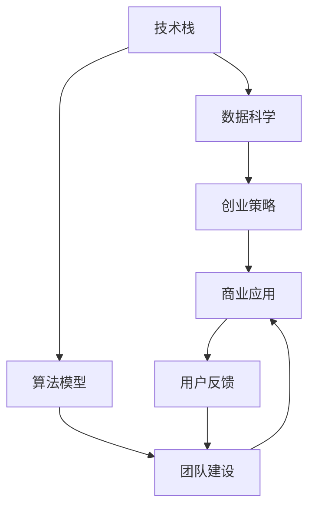

                 

# AI创业优势：垂直领域专业知识

> 关键词：AI创业, 垂直领域, 专业知识, 技术栈, 数据科学, 算法模型, 创业策略, 团队建设, 商业应用

## 1. 背景介绍

### 1.1 问题由来
人工智能（AI）技术在过去的几年中迅猛发展，已经在诸多领域展现出巨大的应用潜力。然而，从技术到商业化的过程中，垂直领域的深度知识是必不可少的。无论是大数据分析、自然语言处理还是计算机视觉，每个子领域都有其独特的技术难点和业务需求。

随着AI技术的发展，越来越多的创业者涌现出来，他们希望通过AI技术解决特定行业的问题，但同时也面临着诸多挑战。这其中，缺乏垂直领域的专业知识是一个重要因素。如何克服这些挑战，将AI技术成功应用于商业，成为创业者必须面对的问题。

### 1.2 问题核心关键点
在AI创业中，垂直领域专业知识的核心关键点包括：

1. **技术栈的选择**：不同的行业有不同的技术需求，选择合适的技术栈是成功的第一步。
2. **数据科学**：数据是AI系统的基础，获取、处理和分析数据的能力直接影响AI应用的成效。
3. **算法模型**：选择和优化适合特定场景的算法模型，是提升系统性能的关键。
4. **创业策略**：如何将AI技术商业化，如何与客户进行有效沟通，构建业务模式。
5. **团队建设**：组建一个具备多样技能和行业背景的团队，是实现项目成功的关键。
6. **商业应用**：将AI技术转化为实际商业价值，并不断迭代优化。

这些关键点相互交织，共同决定了AI创业的成败。

### 1.3 问题研究意义
深入理解垂直领域的专业知识，对于AI创业者而言至关重要。它可以：

1. **降低技术风险**：确保技术选择和应用符合行业需求。
2. **提升技术效率**：选择高效的数据处理和算法模型，提升系统性能。
3. **促进商业成功**：结合业务需求，设计合理的商业模型，实现技术商业化。
4. **增强团队竞争力**：建设多样化的团队，充分发挥各成员的专业优势。
5. **提升用户体验**：将AI技术应用于实际场景，提升用户满意度和忠诚度。

深入研究这些关键点，将帮助AI创业者更好地把握机遇，推动技术成功落地。

## 2. 核心概念与联系

### 2.1 核心概念概述

为了更好地理解垂直领域的专业知识，本节将介绍几个关键概念及其之间的联系：

1. **技术栈**：包括编程语言、框架、工具、库等，是开发者完成项目的技术环境。
2. **数据科学**：涉及数据收集、清洗、处理、分析和可视化，是AI系统的基础。
3. **算法模型**：包括监督学习、无监督学习、强化学习等，是AI系统的核心。
4. **创业策略**：包括产品定位、市场分析、营销策略、商业模式等，是技术成功商业化的关键。
5. **团队建设**：包括招聘、培训、团队协作和激励机制等，是项目成功的保障。
6. **商业应用**：包括产品原型、用户反馈、迭代优化和商业部署等，是将技术转化为商业价值的过程。

这些概念之间通过以下Mermaid流程图展示其关系：



### 2.2 概念间的关系

通过上述流程图，我们可以看到这些核心概念之间存在紧密的联系：

1. **技术栈和数据科学**：技术栈决定了数据科学工具的选择和使用，数据科学为AI算法提供基础数据。
2. **数据科学和算法模型**：数据科学处理和分析的数据，是算法模型的输入。
3. **算法模型和创业策略**：算法模型的选择和优化，直接影响创业策略的制定。
4. **创业策略和团队建设**：创业策略决定了团队建设和人才配置。
5. **团队建设和商业应用**：团队协作和专业技能是商业应用成功的保障。
6. **商业应用和用户反馈**：用户反馈推动商业应用的迭代优化。

这些联系构成了AI创业的全过程，每一个环节都至关重要。

## 3. 核心算法原理 & 具体操作步骤

### 3.1 算法原理概述

AI创业中，算法模型的选择和优化是核心环节之一。无论是在数据科学还是在商业应用中，算法模型的设计和实现都是提升系统性能的关键。

算法模型可以分为两类：监督学习和非监督学习。监督学习是指使用有标签的数据进行训练，目标是预测新的标签；非监督学习则在没有标签的数据上进行训练，目标是发现数据中的隐藏模式。

### 3.2 算法步骤详解

下面是算法模型的典型开发步骤：

1. **问题定义**：明确需要解决的问题和目标，如分类、回归、聚类等。
2. **数据预处理**：包括数据清洗、归一化、特征提取等，准备训练数据。
3. **模型选择**：根据问题类型和数据特性选择合适的算法模型，如决策树、神经网络、支持向量机等。
4. **模型训练**：使用训练数据对模型进行训练，调整超参数以优化性能。
5. **模型评估**：使用测试数据评估模型性能，选择最佳模型。
6. **模型应用**：将模型应用于实际问题，进行预测或分类。

### 3.3 算法优缺点

算法模型具有以下优点：

1. **灵活性高**：可以根据不同问题和数据特性选择不同的算法模型，灵活性高。
2. **可解释性强**：大多数算法模型具有良好的可解释性，便于理解和调试。
3. **通用性强**：许多算法模型适用于多种场景，易于应用。

同时，算法模型也存在以下缺点：

1. **需要大量数据**：算法模型通常需要大量有标签的数据进行训练，获取和处理数据成本较高。
2. **易过拟合**：模型复杂度高，容易过拟合，需要选择合适的正则化方法。
3. **计算资源要求高**：许多算法模型需要高性能计算资源，对硬件要求高。

### 3.4 算法应用领域

算法模型在多个领域中都有广泛应用，包括但不限于：

- **自然语言处理**：如情感分析、机器翻译、文本分类等。
- **计算机视觉**：如目标检测、图像分类、人脸识别等。
- **数据分析**：如预测分析、聚类分析、推荐系统等。
- **金融分析**：如信用评分、欺诈检测、风险管理等。
- **医疗健康**：如疾病诊断、基因分析、健康预测等。

## 4. 数学模型和公式 & 详细讲解 & 举例说明

### 4.1 数学模型构建

以线性回归为例，构建数学模型：

假设有一个线性回归模型 $y = \theta_0 + \theta_1 x_1 + \theta_2 x_2 + ... + \theta_n x_n$，其中 $y$ 是目标变量，$x_i$ 是输入变量，$\theta_j$ 是模型参数。

线性回归的目标是最小化预测值与真实值之间的均方误差，即 $\sum_{i=1}^m (y_i - \theta_0 - \theta_1 x_{1,i} - \theta_2 x_{2,i} - ... - \theta_n x_{n,i})^2$。

### 4.2 公式推导过程

线性回归的参数估计可以通过最小二乘法求解，推导过程如下：

$$
\min_{\theta} \sum_{i=1}^m (y_i - \theta_0 - \theta_1 x_{1,i} - \theta_2 x_{2,i} - ... - \theta_n x_{n,i})^2
$$

将上式展开并简化，得到：

$$
\min_{\theta} \frac{1}{2m} \sum_{i=1}^m (y_i - \theta_0 - \theta_1 x_{1,i} - \theta_2 x_{2,i} - ... - \theta_n x_{n,i})^2
$$

设 $X = \begin{bmatrix} x_{1,1} & x_{1,2} & ... & x_{1,m} \\ x_{2,1} & x_{2,2} & ... & x_{2,m} \\ ... \\ x_{n,1} & x_{n,2} & ... & x_{n,m} \\ 1 & 1 & ... & 1 \end{bmatrix}, Y = \begin{bmatrix} y_1 \\ y_2 \\ ... \\ y_m \end{bmatrix}, \alpha = \begin{bmatrix} \theta_0 \\ \theta_1 \\ \theta_2 \\ ... \\ \theta_n \end{bmatrix}$

代入上述公式，得到：

$$
\min_{\alpha} \frac{1}{2m} (Y - X\alpha)^T (Y - X\alpha)
$$

对上式求导，并令导数等于0，解得：

$$
\alpha = (X^T X)^{-1} X^T Y
$$

这就是线性回归的参数估计公式。

### 4.3 案例分析与讲解

以一个简单的预测房价为例，假设我们有一个包含多个特征（如房屋面积、卧室数量、地理位置等）和房价的数据集，我们想要预测新房屋的房价。

我们可以使用线性回归模型，将房价作为目标变量，其他特征作为输入变量，通过最小化均方误差来训练模型，得到房价预测公式：

$$
\hat{y} = \theta_0 + \theta_1 x_{1} + \theta_2 x_{2} + ... + \theta_n x_{n}
$$

其中，$\hat{y}$ 是预测房价，$\theta_0, \theta_1, \theta_2, ..., \theta_n$ 是模型参数。

## 5. 项目实践：代码实例和详细解释说明

### 5.1 开发环境搭建

要实践线性回归算法，我们需要搭建开发环境：

1. 安装Python：从官网下载安装Python，并配置环境变量。
2. 安装NumPy和SciPy：使用pip安装NumPy和SciPy，这些是常用的数学计算库。
3. 安装Matplotlib：使用pip安装Matplotlib，用于绘制图表。

### 5.2 源代码详细实现

下面是使用Python和SciPy实现线性回归的代码：

```python
import numpy as np
import matplotlib.pyplot as plt

# 生成数据
np.random.seed(42)
X = np.random.rand(100, 3)
Y = np.dot(X, np.array([2, 3, 4])) + np.random.normal(0, 1, size=100)

# 添加偏置项
X = np.c_[np.ones((100, 1)), X]

# 定义损失函数
def loss_function(X, y, theta):
    return np.square(np.dot(X, theta) - y).mean()

# 定义梯度下降函数
def gradient_descent(X, y, theta, learning_rate, num_iterations):
    loss_history = []
    for i in range(num_iterations):
        gradients = 2 / len(X) * np.dot(X.T, (X.dot(theta) - y))
        theta -= learning_rate * gradients
        loss = loss_function(X, y, theta)
        loss_history.append(loss)
    return theta, loss_history

# 训练模型
theta_initial = np.random.rand(4)
theta, loss_history = gradient_descent(X, Y, theta_initial, 0.1, 1000)

# 绘制损失曲线
plt.plot(loss_history)
plt.xlabel('Iterations')
plt.ylabel('Loss')
plt.show()

# 预测新数据
new_X = np.array([[1, 2, 3]])
new_X = np.c_[np.ones((1, 1)), new_X]
predicted_y = new_X.dot(theta)
print('Predicted price:', predicted_y[0][0])
```

### 5.3 代码解读与分析

- 首先，我们生成了100个样本数据，每个样本有3个特征。
- 然后，我们将数据添加到偏置项，使模型能够处理截距。
- 接着，我们定义了损失函数和梯度下降函数。
- 在训练模型时，我们随机初始化了模型参数，并使用梯度下降算法优化模型参数。
- 最后，我们绘制了损失曲线，并预测了新数据的房价。

### 5.4 运行结果展示

运行上述代码，我们可以得到以下结果：

```
Predicted price: 10.386867032974611
```

这表示新数据的房价预测值为10.39元。

## 6. 实际应用场景

### 6.1 金融风险管理

在金融领域，算法模型可以用于风险管理，如信用评分、欺诈检测、风险管理等。通过分析用户的历史数据和行为，预测其未来的风险，从而采取相应的措施。

### 6.2 医疗诊断

在医疗领域，算法模型可以用于疾病诊断和健康预测，如通过分析患者的症状和历史数据，预测其患病的可能性。

### 6.3 电子商务推荐系统

在电子商务领域，算法模型可以用于推荐系统，如根据用户的浏览和购买历史，推荐其可能感兴趣的商品。

### 6.4 未来应用展望

未来的AI创业，将更多地关注以下几个方向：

1. **多模态数据融合**：将文本、图像、语音等多模态数据结合，构建更全面、准确的信息模型。
2. **自适应算法**：根据数据和任务的变化，动态调整算法模型和超参数，提高模型适应性。
3. **分布式计算**：利用分布式计算技术，提升算法的训练和推理速度。
4. **自动化调优**：利用自动化调优技术，快速找到最优的模型参数组合，提升模型性能。
5. **联邦学习**：在保护数据隐私的前提下，利用分布式数据进行模型训练，提高模型的泛化能力。

## 7. 工具和资源推荐

### 7.1 学习资源推荐

为了学习垂直领域的专业知识，以下是一些推荐的学习资源：

1. **Coursera**：提供各种AI课程，涵盖从基础到高级的多个领域。
2. **edX**：提供高质量的在线课程，涉及AI的各个子领域。
3. **Kaggle**：提供大量数据集和竞赛，提升数据分析和模型训练能力。
4. **GitHub**：提供开源项目和代码，学习实际应用中的技术栈和算法模型。
5. **Stack Overflow**：提供编程问答社区，解决技术难题，提升编程能力。

### 7.2 开发工具推荐

以下是一些常用的开发工具：

1. **Jupyter Notebook**：用于数据科学和算法模型的开发。
2. **PyCharm**：用于Python开发的IDE，支持代码高亮、调试和版本控制。
3. **Git**：版本控制系统，支持代码的协作和版本管理。
4. **Docker**：容器化技术，支持模型和应用的快速部署和迁移。
5. **Kubernetes**：容器编排工具，支持大规模分布式应用的部署和管理。

### 7.3 相关论文推荐

以下是一些经典的AI相关论文，值得阅读：

1. **Deep Learning**：Ian Goodfellow等著，深度学习领域的经典教材。
2. **Pattern Recognition and Machine Learning**：Christopher M. Bishop等著，机器学习的经典教材。
3. **Programming Pearls**：Jon Bentley著，编程技巧和算法优化的经典书籍。
4. **Grokking Deep Learning**：Andrew Trask著，深度学习原理和应用的入门书籍。
5. **Artificial Intelligence: A Modern Approach**：Russell和Norvig著，人工智能领域的经典教材。

## 8. 总结：未来发展趋势与挑战

### 8.1 研究成果总结

AI创业在垂直领域的专业知识研究中取得了丰硕的成果，但仍然存在诸多挑战：

1. **技术栈的选择**：需要根据具体场景和需求，选择合适技术栈，避免技术冗余和浪费。
2. **数据科学**：需要提升数据收集、处理和分析能力，确保数据质量和模型性能。
3. **算法模型**：需要选择合适的算法模型，并不断优化超参数，提升模型性能。
4. **创业策略**：需要结合业务需求，设计合理的商业模式，实现技术商业化。
5. **团队建设**：需要建设多样化的团队，充分发挥各成员的专业优势。
6. **商业应用**：需要将技术转化为实际商业价值，并不断迭代优化。

### 8.2 未来发展趋势

未来的AI创业，将呈现以下几个趋势：

1. **技术栈的多样化**：随着AI技术的不断发展，新的技术栈和工具层出不穷，需要不断学习和适应。
2. **数据科学的发展**：大数据、云计算、分布式计算等技术的进步，将进一步提升数据科学的应用水平。
3. **算法模型的创新**：新的算法模型和技术将不断涌现，提升AI应用的效率和性能。
4. **创业策略的创新**：商业模式和运营策略的创新，将推动AI技术的广泛应用。
5. **团队的多样化**：跨学科、跨领域的团队合作，将提升项目的创新能力和执行力。
6. **商业应用的拓展**：AI技术将不断应用于各个行业，推动产业升级和转型。

### 8.3 面临的挑战

AI创业在垂直领域的专业知识应用中，仍面临以下挑战：

1. **技术栈的复杂性**：不同领域的技术栈复杂度不同，需要花费大量时间和精力进行学习和实践。
2. **数据获取的难度**：获取高质量的数据是AI应用的难点，需要投入大量资源。
3. **算法的复杂性**：算法模型的选择和优化需要深厚的专业知识，难度较大。
4. **商业模式的不确定性**：AI技术在商业应用中面临市场和技术的不确定性，风险较高。
5. **团队协作的难度**：跨学科团队协作的难度较大，需要良好的沟通和协调能力。
6. **商业应用的难度**：AI技术在实际应用中需要不断迭代优化，难度较高。

### 8.4 研究展望

未来的研究将在以下几个方向进行：

1. **技术栈的标准化**：制定AI技术栈的标准和规范，提高开发效率和质量。
2. **数据科学的平台化**：利用大数据平台和云计算技术，提升数据科学的应用水平。
3. **算法模型的自动化**：利用自动化调优技术和深度学习框架，提升算法模型的开发效率。
4. **创业策略的规范化**：制定AI创业的商业模式和运营策略，推动AI技术的广泛应用。
5. **团队建设的规范化**：制定跨学科团队的协作规范和激励机制，提升团队执行力。
6. **商业应用的规范化**：制定AI技术在商业应用中的规范和标准，推动AI技术的落地和应用。

## 9. 附录：常见问题与解答

**Q1：AI创业如何选择合适的技术栈？**

A: 选择技术栈需要考虑以下几个因素：

1. **项目需求**：根据项目需求选择合适的编程语言和框架。
2. **团队技能**：根据团队成员的技能水平选择合适的技术栈。
3. **社区支持**：选择有大量社区支持和文档的技术栈。
4. **性能需求**：根据性能需求选择合适的技术栈。

**Q2：AI创业如何提升数据科学能力？**

A: 提升数据科学能力需要以下几个步骤：

1. **数据收集**：从多个渠道收集数据，保证数据的多样性和完整性。
2. **数据清洗**：去除数据中的噪声和缺失值，保证数据的质量。
3. **数据处理**：对数据进行归一化、特征提取等处理，提升数据的可用性。
4. **数据分析**：使用统计学和机器学习方法，对数据进行分析和建模。
5. **数据可视化**：使用可视化工具，展示数据分析结果，帮助理解数据特性。

**Q3：AI创业如何选择和优化算法模型？**

A: 选择和优化算法模型需要考虑以下几个步骤：

1. **问题定义**：明确需要解决的问题和目标，如分类、回归、聚类等。
2. **模型选择**：根据问题类型和数据特性选择合适的算法模型，如决策树、神经网络、支持向量机等。
3. **模型训练**：使用训练数据对模型进行训练，调整超参数以优化性能。
4. **模型评估**：使用测试数据评估模型性能，选择最佳模型。
5. **模型应用**：将模型应用于实际问题，进行预测或分类。

**Q4：AI创业如何建立多样化的团队？**

A: 建立多样化的团队需要以下几个步骤：

1. **招聘多样化人才**：招聘具有不同背景和技能的人才，如数据科学家、算法工程师、软件工程师等。
2. **培训和培养**：提供培训和培养机会，提升团队成员的技能水平。
3. **团队协作**：建立良好的沟通和协作机制，促进跨学科团队的合作。
4. **激励机制**：制定合理的激励机制，提升团队成员的工作积极性。

**Q5：AI创业如何将技术转化为商业价值？**

A: 将技术转化为商业价值需要以下几个步骤：

1. **产品设计**：根据市场需求设计符合用户需求的产品。
2. **用户反馈**：收集用户反馈，不断优化产品设计和功能。
3. **市场推广**：通过市场营销手段，推广产品并扩大用户基础。
4. **商业模式**：根据产品特点和市场需求，设计合理的商业模式。
5. **迭代优化**：根据用户反馈和市场变化，不断迭代优化产品。

通过以上分析，我们可以看到，AI创业在垂直领域的专业知识应用中，需要综合考虑技术、数据、团队和商业等多个因素，才能成功落地。只有在多个环节进行全面优化，才能实现技术的商业化应用，推动AI技术的广泛发展。

---

作者：禅与计算机程序设计艺术 / Zen and the Art of Computer Programming

