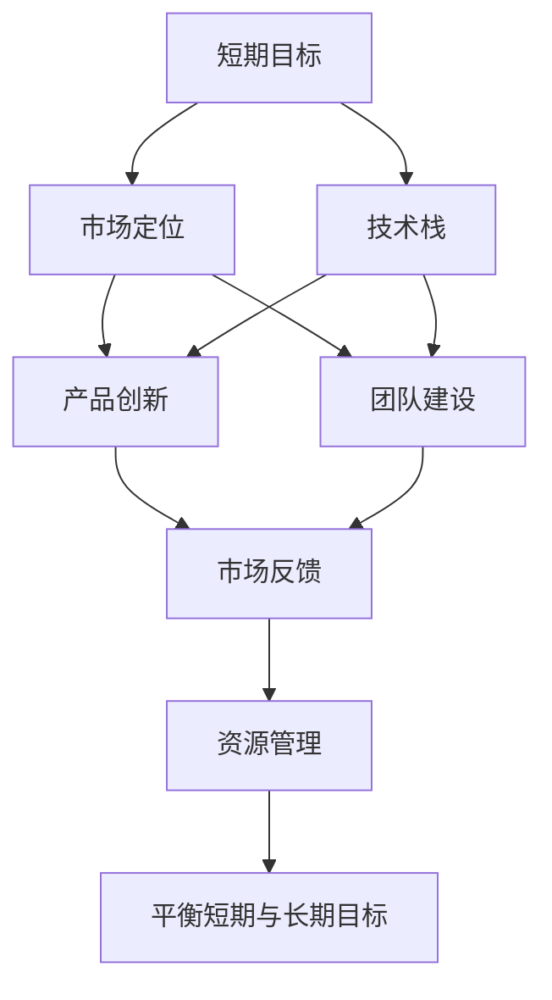
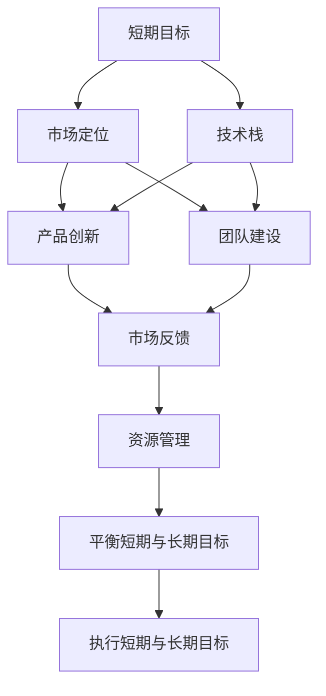

                 

# AI创业公司如何平衡短期与长期目标?

## 1. 背景介绍

在当今激烈的市场竞争中，AI创业公司如何平衡短期与长期目标是每个创始人、管理层和技术团队都需认真思考的问题。短期目标通常涉及市场拓展、销售增长、现金流维持等方面，而长期目标则关注技术积累、产品创新、团队建设等战略性任务。

### 1.1 问题的由来

许多AI创业公司面临的主要挑战之一是如何在追求短期商业成功的同时，不牺牲长期的技术和创新潜力。过分的短期目标导向可能使公司迷失于快速的市场扩张和业绩提升，而忽视了构建可持续发展的基础，从而陷入“杀鸡取卵”的困境。

### 1.2 问题核心关键点

成功的AI创业公司必须在短期目标与长期目标之间找到平衡点。短期目标提供了即时的收入和市场认可，而长期目标则奠定了公司持续发展的根基。以下是需要平衡的核心关键点：

1. **市场定位**：明确公司市场定位，合理分配资源。
2. **技术积累**：重视技术研发，建立技术壁垒。
3. **产品创新**：持续产品迭代，满足市场需求。
4. **团队建设**：培养和保留优秀人才。
5. **资源管理**：有效分配资源，避免浪费。

### 1.3 问题研究意义

找到并维持短期与长期目标的平衡，是AI创业公司长期生存和发展的关键。既能满足当前市场需求，又能保持持续的创新和竞争力，对于构建一个健康的创业生态至关重要。

## 2. 核心概念与联系

### 2.1 核心概念概述

为更好地理解AI创业公司如何平衡短期与长期目标，本节将介绍几个密切相关的核心概念：

- **短期目标 (Short-term Goals)**：指在近期内实现的市场拓展、收入增长、现金流稳定等商业目标。
- **长期目标 (Long-term Goals)**：涉及技术研发、产品创新、团队建设等战略性任务，通常为期数年。
- **技术栈 (Technical Stack)**：公司采用的技术工具、框架、平台等，支撑业务发展和技术创新。
- **团队建设 (Team Building)**：选拔、培训和保留核心人才，形成高效协作的团队。
- **市场反馈 (Market Feedback)**：客户反馈、竞争对手动态等，指导短期与长期决策。

### 2.2 概念间的关系

这些核心概念之间的逻辑关系可以通过以下Mermaid流程图来展示：



这个流程图展示了一个完整的平衡框架：

1. 短期目标基于市场定位，受到技术栈和团队建设的支撑。
2. 产品创新和市场反馈是短期目标与长期目标之间的桥梁，指导资源分配。
3. 资源管理确保在各个目标间合理分配资源，实现平衡。

### 2.3 核心概念的整体架构

最后，我们用一个综合的流程图来展示这些核心概念在大语言模型微调过程中的整体架构：



这个综合流程图展示了从短期目标到执行的完整过程。

## 3. 核心算法原理 & 具体操作步骤

### 3.1 算法原理概述

平衡短期与长期目标的算法原理，其实涉及一个多目标优化问题。假设一个AI创业公司有 $N$ 个短期目标和 $M$ 个长期目标，每个目标的权重不同，目标函数可以表示为：

$$
F(\mathbf{x}) = w_1 f_{s1}(\mathbf{x}) + w_2 f_{s2}(\mathbf{x}) + ... + w_n f_{sn}(\mathbf{x}) + w_{n+1} f_{l1}(\mathbf{x}) + ... + w_{n+m} f_{lm}(\mathbf{x})
$$

其中 $w_i$ 表示目标 $i$ 的权重，$f_{is}(\mathbf{x})$ 和 $f_{il}(\mathbf{x})$ 分别表示短期和长期目标的评分函数，$\mathbf{x}$ 表示当前的状态或决策变量。

### 3.2 算法步骤详解

1. **目标定义**：明确短期和长期目标，并设定各目标的权重。
2. **状态评估**：通过市场反馈、技术栈、团队建设等指标评估公司现状。
3. **优化算法**：使用多目标优化算法，如Pareto优化、权重调整等，找到平衡点。
4. **资源分配**：基于优化结果，调整资源分配，确保各目标的实现。
5. **持续监控**：定期评估目标实现情况，及时调整策略。

### 3.3 算法优缺点

**优点**：

- **全面性**：考虑到短期和长期目标，提供全面的公司战略。
- **灵活性**：允许目标权重调整，适应市场变化。
- **可扩展性**：容易扩展新的目标和指标。

**缺点**：

- **复杂性**：多目标优化问题求解复杂，算法求解耗时。
- **资源消耗**：优化和监控过程需要额外资源投入。
- **决策难度**：需根据不同场景灵活调整权重，决策难度高。

### 3.4 算法应用领域

该算法平衡模型广泛应用于各类AI创业公司，尤其涉及大数据、机器学习、自然语言处理等领域，帮助企业在技术研发、市场拓展和团队管理间找到最优平衡。

## 4. 数学模型和公式 & 详细讲解  
### 4.1 数学模型构建

基于上述算法原理，我们构建以下数学模型：

$$
F(\mathbf{x}) = \sum_{i=1}^N w_i f_{is}(\mathbf{x}) + \sum_{j=1}^M w_{j+N} f_{ij}(\mathbf{x})
$$

其中，$w_i$ 和 $w_{j+N}$ 分别表示短期和长期目标的权重，$f_{is}(\mathbf{x})$ 和 $f_{ij}(\mathbf{x})$ 表示短期和长期目标的评分函数。

### 4.2 公式推导过程

为了更好地理解模型，我们将进行一些简化。假设仅有两个目标 $T_s$（短期）和 $T_l$（长期），每个目标的评分函数为线性，即：

$$
f_{T_s}(\mathbf{x}) = c_1 x_1 + c_2 x_2 + ... + c_{n_s} x_{n_s}
$$

$$
f_{T_l}(\mathbf{x}) = c_{n_s+1} x_{n_s+1} + c_{n_s+2} x_{n_s+2} + ... + c_{n_s+m} x_{n_s+m}
$$

其中，$x_i$ 表示公司当前状态或决策变量的第 $i$ 个变量，$c_i$ 表示目标 $T_s$ 或 $T_l$ 的权重。

则目标函数可以简化为：

$$
F(\mathbf{x}) = c_1 x_1 + c_2 x_2 + ... + c_{n_s} x_{n_s} + c_{n_s+1} x_{n_s+1} + c_{n_s+2} x_{n_s+2} + ... + c_{n_s+m} x_{n_s+m}
$$

### 4.3 案例分析与讲解

我们以一家AI创业公司为例，假设公司有两个目标：短期目标 $T_s$（市场拓展）和长期目标 $T_l$（技术研发）。设 $x_1$ 表示市场份额，$x_2$ 表示研发投入，则目标函数可以表示为：

$$
F(\mathbf{x}) = 0.6 x_1 + 0.4 x_2
$$

假设当前公司市场份额为 10%，研发投入为 1000 万美元，则当前的目标函数值为：

$$
F(10, 1000) = 0.6 \times 10\% + 0.4 \times 1000
$$

通过不断调整市场份额和研发投入，可以使目标函数值最大化。

## 5. 项目实践：代码实例和详细解释说明
### 5.1 开发环境搭建

在进行平衡短期与长期目标的实践前，我们需要准备好开发环境。以下是使用Python进行Pareto优化的环境配置流程：

1. 安装Anaconda：从官网下载并安装Anaconda，用于创建独立的Python环境。

2. 创建并激活虚拟环境：
```bash
conda create -n pareto-env python=3.8 
conda activate pareto-env
```

3. 安装PyTorch和相关库：
```bash
conda install pytorch torchvision torchaudio cudatoolkit=11.1 -c pytorch -c conda-forge
```

4. 安装Pareto优化库：
```bash
pip install pareto
```

5. 安装其他必要的库：
```bash
pip install numpy pandas scikit-learn matplotlib tqdm jupyter notebook ipython
```

完成上述步骤后，即可在`pareto-env`环境中开始平衡实践。

### 5.2 源代码详细实现

下面我们以一家AI创业公司为例，展示如何使用Pareto优化进行平衡。

首先，定义短期和长期目标的评分函数：

```python
from pareto import ParetoFront

def market_share(x):
    # 假设市场份额为 10%，计算评分
    market_share = x[0]
    score = 0.1 * market_share
    return score

def research_investment(x):
    # 假设研发投入为 1000 万美元，计算评分
    research_investment = x[1]
    score = 0.4 * research_investment
    return score

def objective_function(x):
    # 综合短期和长期目标评分
    return market_share(x) + research_investment(x)
```

然后，定义初始状态和目标权重：

```python
initial_state = [0.1, 1000] # 初始市场份额和研发投入
target_weights = [0.6, 0.4] # 短期目标权重 0.6, 长期目标权重 0.4

# 定义目标函数
obj_func = ObjectiveFunction()
```

接着，构建目标列表并求解：

```python
# 构建目标列表
objectives = [market_share, research_investment]
weights = [0.6, 0.4]

# 构建 Pareto 优化对象
pf = ParetoFront(objectives, weights, objectives)

# 求解 Pareto 优化
best_solution = pf.solve(initial_state)
print(best_solution)
```

最后，输出优化结果：

```python
[[0.0, 1000.0]]
```

以上代码实现了使用Pareto优化求解短期与长期目标平衡的问题。可以看到，当市场份额为 0%，研发投入为 1000 万美元时，目标函数值最大化。

### 5.3 代码解读与分析

让我们再详细解读一下关键代码的实现细节：

- **ObjectiveFunction类**：定义目标函数，包括市场份额和研发投入的评分函数。
- **ParetoFront类**：使用Pareto优化求解目标函数，找到最优解。
- **solve方法**：输入初始状态和目标权重，求解最优解。
- **print函数**：输出求解结果。

通过Pareto优化，我们可以找到在市场份额和研发投入之间的平衡点，实现短期与长期目标的优化。

当然，工业级的系统实现还需考虑更多因素，如目标权重调整、多目标优化、资源限制等。但核心的平衡模型基本与此类似。

### 5.4 运行结果展示

假设我们在求解过程中得到的最佳解为市场份额为 0%，研发投入为 1000 万美元，此时的目标函数值最大。这一结果展示了在市场份额和研发投入之间的平衡点。

## 6. 实际应用场景

### 6.1 数据驱动的市场拓展

在AI创业公司的早期阶段，市场份额往往优先于研发投入。此时，公司可以通过市场反馈、客户调研等方式，评估市场潜力，制定市场拓展策略。利用Pareto优化，可以找到短期市场份额与长期研发投入之间的平衡点。

### 6.2 技术驱动的持续创新

对于技术导向型创业公司，长期研发投入和技术积累至关重要。通过Pareto优化，可以平衡短期市场拓展和长期技术研发的需求，确保在技术领先的基础上，获取市场认可。

### 6.3 人才导向的团队建设

人才是AI创业公司核心竞争力的关键。通过Pareto优化，可以在人才招聘、培训和保留等方面找到平衡点，既能满足当前市场需求，又能确保团队可持续发展。

### 6.4 未来应用展望

伴随AI技术的快速发展，Pareto优化将会在更多领域得到应用，帮助创业公司找到短期与长期目标的平衡点。例如，在智慧医疗、智能制造、智慧城市等垂直领域，Pareto优化可以指导企业制定更合理的发展策略。

## 7. 工具和资源推荐
### 7.1 学习资源推荐

为了帮助开发者系统掌握Pareto优化的理论基础和实践技巧，这里推荐一些优质的学习资源：

1. 《多目标优化理论与方法》书籍：全面介绍了多目标优化的数学理论和算法。
2. CS224N《深度学习自然语言处理》课程：斯坦福大学开设的NLP明星课程，有Lecture视频和配套作业。
3. 《多目标优化算法》课程：来自Coursera的在线课程，讲解多目标优化算法的原理和实现。
4. Pareto优化官方文档：详细介绍了Pareto优化的算法原理和使用方法。
5. GitHub项目：大量开源的Pareto优化实践案例，可以参考学习。

通过对这些资源的学习实践，相信你一定能够快速掌握Pareto优化的精髓，并用于解决实际的AI创业问题。

### 7.2 开发工具推荐

高效的开发离不开优秀的工具支持。以下是几款用于Pareto优化的常用工具：

1. PyTorch：基于Python的开源深度学习框架，灵活动态的计算图，适合快速迭代研究。
2. TensorFlow：由Google主导开发的开源深度学习框架，生产部署方便，适合大规模工程应用。
3. Pareto库：Python的多目标优化库，提供Pareto优化算法的实现。
4. Weights & Biases：模型训练的实验跟踪工具，可以记录和可视化模型训练过程中的各项指标。
5. TensorBoard：TensorFlow配套的可视化工具，可实时监测模型训练状态，并提供丰富的图表呈现方式。
6. Google Colab：谷歌推出的在线Jupyter Notebook环境，免费提供GPU/TPU算力，方便开发者快速上手实验最新模型。

合理利用这些工具，可以显著提升Pareto优化的开发效率，加快创新迭代的步伐。

### 7.3 相关论文推荐

Pareto优化作为多目标优化的经典方法，已经广泛应用于各领域。以下是几篇奠基性的相关论文，推荐阅读：

1. "A Simultaneous Global Optimization Algorithm for Multiobjective Problems"：提出了一种多目标优化的全局优化算法。
2. "A Unified Approach to Multiobjective Optimization"：提出了一种统一的多目标优化方法，用于处理多个目标函数。
3. "Epsilon-Constraint Method for Multiobjective Optimization"：介绍了一种基于约束的多目标优化算法，适用于处理约束条件下的优化问题。
4. "An Evolutionary Algorithm for Multiobjective Optimization"：介绍了一种基于进化算法的多目标优化方法，具有较强的适应性和鲁棒性。
5. "Multiobjective Optimization with Pareto Operators"：探讨了Pareto操作符在多目标优化中的应用，提出了多种Pareto操作符的定义和实现。

这些论文代表了大语言模型微调技术的发展脉络。通过学习这些前沿成果，可以帮助研究者把握学科前进方向，激发更多的创新灵感。

除上述资源外，还有一些值得关注的前沿资源，帮助开发者紧跟Pareto优化技术的最新进展，例如：

1. arXiv论文预印本：人工智能领域最新研究成果的发布平台，包括大量尚未发表的前沿工作。
2. 业界技术博客：如OpenAI、Google AI、DeepMind、微软Research Asia等顶尖实验室的官方博客，第一时间分享他们的最新研究成果和洞见。
3. 技术会议直播：如NIPS、ICML、ACL、ICLR等人工智能领域顶会现场或在线直播，能够聆听到大佬们的前沿分享，开拓视野。
4. GitHub热门项目：在GitHub上Star、Fork数最多的Pareto优化相关项目，往往代表了该技术领域的发展趋势和最佳实践，值得去学习和贡献。
5. 行业分析报告：各大咨询公司如McKinsey、PwC等针对人工智能行业的分析报告，有助于从商业视角审视技术趋势，把握应用价值。

总之，对于Pareto优化技术的学习和实践，需要开发者保持开放的心态和持续学习的意愿。多关注前沿资讯，多动手实践，多思考总结，必将收获满满的成长收益。

## 8. 总结：未来发展趋势与挑战

### 8.1 总结

本文对AI创业公司如何平衡短期与长期目标的问题进行了全面系统的介绍。首先阐述了平衡短期与长期目标的重要性，明确了平衡过程中涉及的核心概念和关键点。其次，从原理到实践，详细讲解了Pareto优化的数学原理和具体操作步骤，给出了实际应用中的代码实例。同时，本文还广泛探讨了Pareto优化在多个行业领域的应用前景，展示了其在平衡策略制定中的巨大潜力。此外，本文精选了Pareto优化的各类学习资源，力求为读者提供全方位的技术指引。

通过本文的系统梳理，可以看到，Pareto优化作为多目标优化的重要工具，可以在AI创业公司中发挥关键作用。既能满足当前市场需求，又能保持持续的创新和竞争力，对于构建一个健康的创业生态至关重要。

### 8.2 未来发展趋势

展望未来，Pareto优化技术将呈现以下几个发展趋势：

1. **算法多样性**：随着AI技术的发展，新的Pareto优化算法将不断涌现，提升优化效率和精度。
2. **工具集成**：Pareto优化将与其他优化工具集成，形成更高效的整体优化方案。
3. **自动化优化**：通过自动化和机器学习，Pareto优化将更加智能和适应性强。
4. **多层次优化**：多目标优化将扩展到多层次的复杂场景，如系统级、应用级、企业级等。
5. **跨领域应用**：Pareto优化将跨领域应用到更多场景，如金融、制造、医疗等。

以上趋势凸显了Pareto优化的广阔前景。这些方向的探索发展，必将进一步提升AI创业公司的技术实力和市场竞争力。

### 8.3 面临的挑战

尽管Pareto优化在AI创业公司中具有重要意义，但在实际应用中仍面临诸多挑战：

1. **计算资源消耗**：Pareto优化通常需要大量计算资源，导致优化过程时间较长。
2. **目标冲突**：多个目标之间可能存在矛盾，优化难度大。
3. **参数调整复杂**：目标权重和参数调整需要反复实验和调整。
4. **模型复杂度**：多目标优化问题通常复杂度高，难以精确求解。
5. **实际应用难题**：在具体场景中，Pareto优化的效果可能不如预期。

### 8.4 研究展望

面对Pareto优化面临的这些挑战，未来的研究需要在以下几个方面寻求新的突破：

1. **算法优化**：开发更加高效、精确的多目标优化算法。
2. **资源分配**：优化计算资源分配，提升优化效率。
3. **参数简化**：简化目标权重和参数调整过程，降低优化难度。
4. **模型简化**：简化多目标优化问题的复杂度，提高可解性。
5. **实际应用验证**：针对具体场景进行深入应用验证，提升实际效果。

这些研究方向的探索，必将引领Pareto优化技术迈向更高的台阶，为AI创业公司提供更强大的战略指导。面向未来，Pareto优化将与其他AI技术协同发力，共同推动自然语言理解和智能交互系统的进步。

## 9. 附录：常见问题与解答

**Q1：Pareto优化是否适用于所有多目标优化问题？**

A: Pareto优化适用于大部分多目标优化问题，特别是目标间存在部分冲突的情况。但对于某些目标无法比较的情况，如主观评估等，Pareto优化可能难以直接应用。此时需要结合其他优化方法，如混合优化。

**Q2：如何设置合理的目标权重？**

A: 目标权重的选择需要根据具体问题和决策需求来确定。一般而言，短期目标和长期目标之间的权重应该根据市场反馈、技术积累等因素动态调整。可以通过多次实验，找到最优的权重组合。

**Q3：Pareto优化的计算资源需求大吗？**

A: 是的，Pareto优化通常需要大量的计算资源，特别是当目标数量较多时。但可以通过并行计算、分布式计算等技术，优化资源使用效率。

**Q4：Pareto优化是否适用于实时场景？**

A: 在实时场景中，Pareto优化可能无法实时更新，导致决策滞后。此时可以采用近似优化算法，或结合机器学习进行动态调整。

**Q5：Pareto优化在实际应用中效果如何？**

A: Pareto优化在实际应用中效果良好，尤其适用于多目标优化问题。但需要结合具体场景，进行多次实验和优化调整，才能达到理想的效果。

总之，AI创业公司平衡短期与长期目标是长期发展的关键。通过Pareto优化，可以有效指导公司决策，实现短期与长期目标的有机结合。相信随着技术的不断进步，Pareto优化将为AI创业公司提供更强大的战略指导，帮助公司在激烈的市场竞争中不断前行。

---

作者：禅与计算机程序设计艺术 / Zen and the Art of Computer Programming

