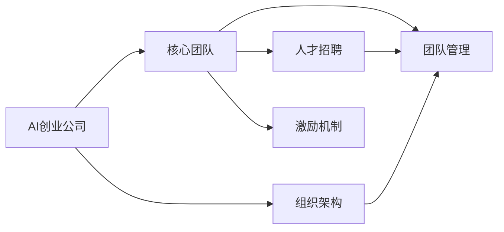
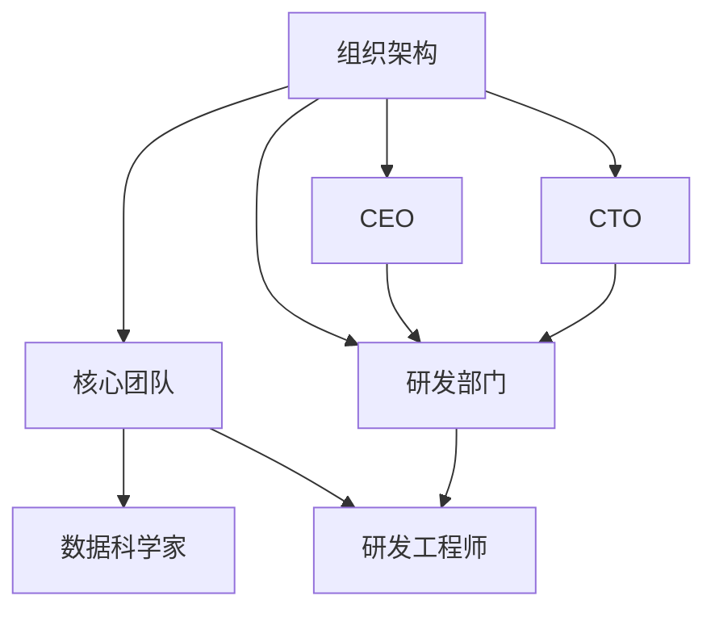
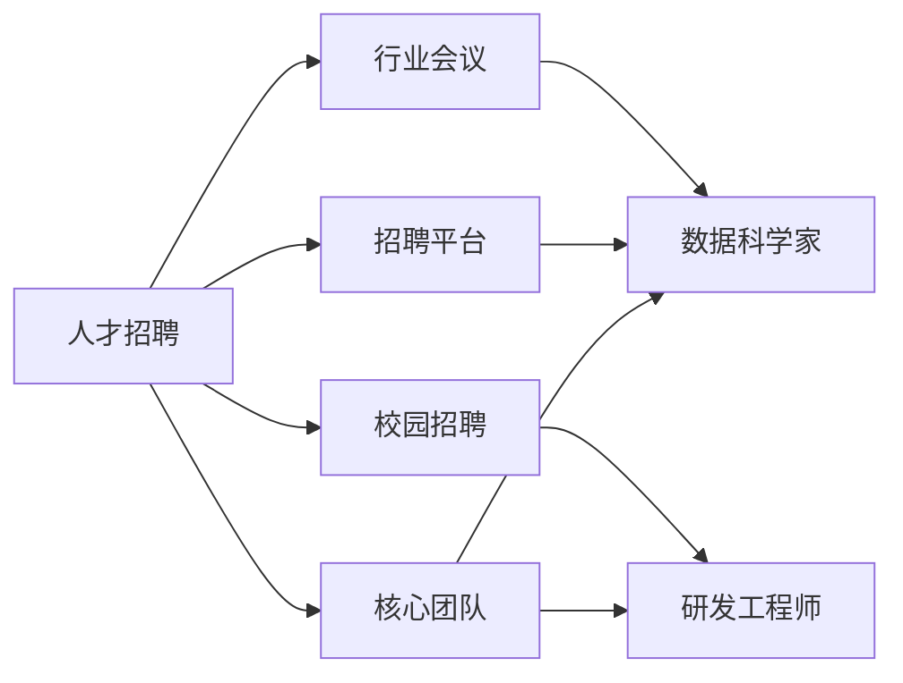
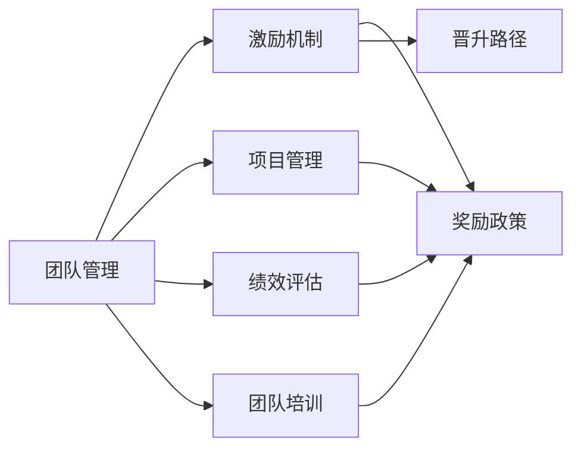
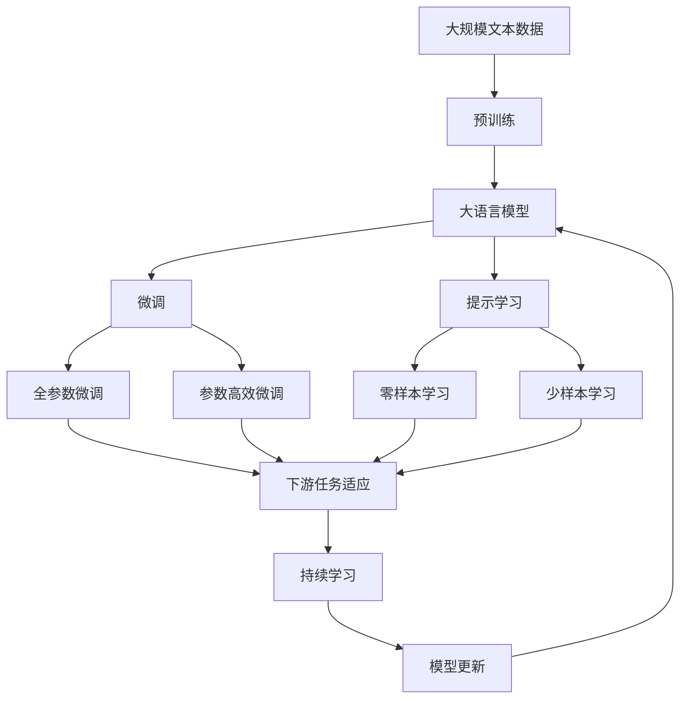

                 

# AI创业公司如何打造核心团队?

> 关键词：AI创业公司, 核心团队, 组织架构, 人才招聘, 团队管理

## 1. 背景介绍

### 1.1 问题由来
随着人工智能(AI)技术的快速发展，越来越多的创业公司涌现，致力于开发和部署先进的AI应用。然而，AI创业公司面临的最大挑战之一是如何打造一支高效、创新的核心团队。一个强大的核心团队不仅能推动公司快速发展，还能确保技术创新和商业成功的双重目标得以实现。本文将系统介绍AI创业公司如何通过合理的人才招聘和团队管理策略，构建核心团队。

### 1.2 问题核心关键点
AI创业公司的核心团队建设涉及多个关键点，包括但不限于：
- 招聘策略：如何从全球范围内吸引顶尖人才。
- 团队架构：如何构建一个层次分明、分工明确的团队。
- 人才评估：如何通过科学的评估方法甄选合适的人才。
- 团队管理：如何通过高效的团队管理提升团队协作效率。
- 激励机制：如何设计合理的激励机制，激发团队成员的创新和积极性。

### 1.3 问题研究意义
构建高效的AI创业公司核心团队，对于公司的长期发展和竞争优势至关重要。一个强大的团队不仅能带来技术创新，还能推动业务增长和市场拓展。以下是打造核心团队的几大重要性：
1. **技术优势**：顶级人才带来的前沿技术，推动公司快速进入行业前沿。
2. **创新驱动**：具备创新思维的团队，持续推出新产品和解决方案。
3. **文化塑造**：具有共同价值观的团队，能塑造独特的企业文化和品牌形象。
4. **市场领导**：有能力影响市场的领导者，带来业务增长和商业成功。
5. **风险管理**：具备风险意识和应对能力的团队，能有效规避和应对市场风险。

## 2. 核心概念与联系

### 2.1 核心概念概述

为更好地理解AI创业公司核心团队建设，本节将介绍几个密切相关的核心概念：

- **AI创业公司**：指专注于AI技术和应用的创业企业，包括但不限于机器学习、深度学习、自然语言处理等。
- **核心团队**：指公司中负责核心技术开发和业务拓展的关键成员，包括CEO、CTO、数据科学家、研发工程师等。
- **组织架构**：指公司内部各职能部门和岗位的设置及其相互关系。
- **人才招聘**：指通过各种渠道吸引和选拔优秀人才的过程。
- **团队管理**：指通过有效的组织和管理手段，提升团队协作效率和成员满意度。
- **激励机制**：指通过合理的奖励和激励政策，激发团队成员的积极性和创新能力。

这些核心概念之间的逻辑关系可以通过以下Mermaid流程图来展示：



这个流程图展示了一支核心团队的构建需要依赖公司整体组织架构、人才招聘和团队管理等多个方面，同时激励机制的合理设计也是团队高效运作的重要保障。通过理解这些核心概念，我们可以更好地把握AI创业公司核心团队建设的全过程。

### 2.2 概念间的关系

这些核心概念之间存在着紧密的联系，形成了AI创业公司核心团队建设的整体生态系统。下面我们通过几个Mermaid流程图来展示这些概念之间的关系。

#### 2.2.1 组织架构与核心团队的关系



这个流程图展示了组织架构和核心团队之间的相互依赖关系。公司的CEO和CTO负责制定整体战略方向，而核心团队中的数据科学家和研发工程师则负责技术研发和产品开发。

#### 2.2.2 人才招聘与核心团队的关系



这个流程图展示了人才招聘如何为公司核心团队输送所需的人才。招聘渠道包括招聘平台、校园招聘和行业会议等。

#### 2.2.3 团队管理与激励机制的关系



这个流程图展示了团队管理如何通过项目管理和绩效评估等手段，结合合理的激励政策，提升团队协作效率和成员满意度。

### 2.3 核心概念的整体架构

最后，我们用一个综合的流程图来展示这些核心概念在大语言模型微调过程中的整体架构：



这个综合流程图展示了从预训练到微调，再到持续学习的完整过程。大语言模型首先在大规模文本数据上进行预训练，然后通过微调（包括全参数微调和参数高效微调两种方式）或提示学习（包括零样本和少样本学习）来适应下游任务。最后，通过持续学习技术，模型可以不断更新和适应新的任务和数据。 通过这些流程图，我们可以更清晰地理解AI创业公司核心团队建设过程中各个环节的相互关系和作用。

## 3. 核心算法原理 & 具体操作步骤
### 3.1 算法原理概述

AI创业公司核心团队建设，本质上是一个复杂的管理和人力资源优化过程。其核心思想是：通过合理的人才招聘和团队管理，优化组织架构，设计科学的激励机制，构建一支高效、创新的核心团队。

形式化地，假设AI创业公司需要构建一支由数据科学家、研发工程师、产品经理、市场专员等组成的核心团队，目标是最大化公司的技术创新能力和商业成功概率。则优化目标为：

$$
\max_{\text{team composition}} \left[ \text{Innovation} + \text{Profitability} \right]
$$

其中，$\text{Innovation}$ 表示技术创新能力，$\text{Profitability}$ 表示商业成功概率。为了优化这个目标，需要综合考虑以下几个关键因素：

- **招聘策略**：吸引和选拔最合适的候选人。
- **团队架构**：构建层次分明、分工明确的团队。
- **人才评估**：通过科学的评估方法甄选合适的人才。
- **团队管理**：提升团队协作效率和成员满意度。
- **激励机制**：设计合理的奖励和激励政策，激发团队成员的积极性和创新能力。

### 3.2 算法步骤详解

AI创业公司核心团队建设的具体步骤主要包括：

**Step 1: 确定团队需求**
- 明确公司发展目标和市场定位，确定核心团队所需的技能和经验。
- 制定详细的岗位描述和职责说明书。

**Step 2: 招聘和甄选**
- 通过各种渠道发布招聘信息，吸引顶级人才。
- 设计和实施科学的人才评估体系，甄选最适合的候选人。
- 利用数据科学方法和AI工具，如机器学习和自然语言处理，提升招聘效率。

**Step 3: 团队架构设计**
- 根据公司发展目标和团队需求，设计合理的组织架构。
- 明确各岗位之间的关系和职责分工。
- 考虑团队成员的专业背景和技能互补，构建高效的团队协作模式。

**Step 4: 团队管理和激励**
- 实施项目管理、绩效评估、团队培训等措施，提升团队协作效率。
- 设计合理的激励机制，如股权激励、绩效奖金等，激发团队成员的积极性和创新能力。
- 建立透明、公平的反馈机制，及时发现和解决问题，提升团队凝聚力。

**Step 5: 持续优化**
- 定期评估团队绩效和成员满意度，进行动态调整和优化。
- 利用AI工具进行数据驱动的决策，确保团队建设始终与公司发展目标保持一致。

### 3.3 算法优缺点

AI创业公司核心团队建设的优势在于：
- 通过科学的方法和工具，有效提升团队建设和管理的效率。
- 利用AI技术，提高招聘和甄选的精准度，快速吸引和选拔优秀人才。
- 构建高效的组织架构，提升团队协作效率和成员满意度。

然而，这一过程也存在一些局限性：
- 对数据和技术的依赖性较高，需要具备一定的数据科学和AI技术背景。
- 设计和实施科学的人才评估和激励机制，需要时间和经验积累。
- 团队建设和管理的复杂性，需要综合考虑多个因素。

### 3.4 算法应用领域

AI创业公司核心团队建设方法，广泛应用于各种规模和类型的创业公司，特别是在技术密集型和高科技领域。以下列举了几个典型的应用场景：

- **初创科技公司**：需要构建一支由顶级人才组成的核心团队，快速推动技术创新和产品开发。
- **AI初创公司**：专注于机器学习、深度学习、自然语言处理等前沿技术，需要吸引和培养顶尖科学家。
- **大数据公司**：需要构建数据科学家团队，从海量数据中挖掘有价值的信息和知识。
- **医疗科技公司**：需要构建具有医疗背景的数据科学家和研发工程师，开发基于AI的疾病诊断和治疗方案。
- **智能制造公司**：需要构建具备工业背景的AI工程师和产品开发团队，推动智能制造和工业互联网的发展。

## 4. 数学模型和公式 & 详细讲解 & 举例说明
### 4.1 数学模型构建

核心团队建设的优化目标可以形式化表示为以下数学模型：

$$
\max_{\text{team composition}} \left[ \text{Innovation} + \text{Profitability} \right]
$$

其中，$\text{Innovation}$ 表示技术创新能力，可以用新产品的数量和质量来衡量。$\text{Profitability}$ 表示商业成功概率，可以用市场份额、收入增长率等指标来衡量。

### 4.2 公式推导过程

假设公司需要招聘 $n$ 名团队成员，每个成员的技能和经验可以用一个向量 $\textbf{x}_i = (x_{i1}, x_{i2}, ..., x_{in})$ 来表示，其中 $x_{ij}$ 表示第 $i$ 个成员在第 $j$ 个岗位上的评分（$j \in \{1, 2, ..., n\}$）。则核心团队建设的优化目标可以表示为：

$$
\max_{\textbf{x}_1, \textbf{x}_2, ..., \textbf{x}_n} \left[ \sum_{i=1}^n \sum_{j=1}^m x_{ij} \cdot w_j \right]
$$

其中，$w_j$ 表示第 $j$ 个岗位的权重。

为了优化这个目标，可以采用遗传算法、粒子群算法等优化方法，寻找最优的团队成员组合。此外，还可以利用多目标优化技术，平衡技术创新和商业成功之间的关系。

### 4.3 案例分析与讲解

以一家AI初创公司为例，其核心团队包括CEO、CTO、数据科学家、研发工程师和产品经理。公司通过以下步骤进行团队建设：

1. **确定团队需求**：明确公司发展目标和市场定位，制定详细的岗位描述和职责说明书。
2. **招聘和甄选**：通过LinkedIn、GitHub等平台发布招聘信息，利用AI技术筛选合适的候选人。
3. **团队架构设计**：设计层次分明、分工明确的团队架构，明确各岗位之间的关系和职责分工。
4. **团队管理和激励**：实施项目管理、绩效评估、团队培训等措施，设计股权激励、绩效奖金等激励机制，提升团队协作效率和成员满意度。
5. **持续优化**：定期评估团队绩效和成员满意度，利用AI工具进行数据驱动的决策，进行动态调整和优化。

## 5. 项目实践：代码实例和详细解释说明
### 5.1 开发环境搭建

在进行核心团队建设实践前，我们需要准备好开发环境。以下是使用Python进行PyTorch开发的环境配置流程：

1. 安装Anaconda：从官网下载并安装Anaconda，用于创建独立的Python环境。

2. 创建并激活虚拟环境：
```bash
conda create -n pytorch-env python=3.8 
conda activate pytorch-env
```

3. 安装PyTorch：根据CUDA版本，从官网获取对应的安装命令。例如：
```bash
conda install pytorch torchvision torchaudio cudatoolkit=11.1 -c pytorch -c conda-forge
```

4. 安装各类工具包：
```bash
pip install numpy pandas scikit-learn matplotlib tqdm jupyter notebook ipython
```

完成上述步骤后，即可在`pytorch-env`环境中开始核心团队建设实践。

### 5.2 源代码详细实现

这里我们以数据科学家团队建设为例，给出使用Python和PyTorch进行核心团队构建的代码实现。

首先，定义数据科学家团队的技能要求：

```python
from sklearn.ensemble import RandomForestClassifier

# 定义数据科学家的技能要求
skill_requirements = [
    "熟练掌握Python编程",
    "具备机器学习和深度学习基础",
    "有数据可视化经验",
    "熟悉数据预处理技术",
    "具备统计分析和建模能力",
    "有实际项目经验",
    "英语流利"
]

# 定义技能评分体系
skill_scores = {
    "熟练掌握Python编程": 10,
    "具备机器学习和深度学习基础": 9,
    "有数据可视化经验": 8,
    "熟悉数据预处理技术": 7,
    "具备统计分析和建模能力": 6,
    "有实际项目经验": 5,
    "英语流利": 4
}

# 定义岗位权重
post_weight = {
    "数据科学家": 0.5,
    "高级数据科学家": 0.6,
    "数据工程师": 0.4
}
```

然后，定义招聘和甄选流程：

```python
from random import choice

# 定义候选人数据
candidate_data = [
    {"name": "Alice", "skills": ["Python", "机器学习", "数据可视化", "统计分析"], "experience": 5},
    {"name": "Bob", "skills": ["Python", "深度学习", "数据预处理", "项目经验"], "experience": 6},
    {"name": "Charlie", "skills": ["Python", "自然语言处理", "数据可视化", "项目经验"], "experience": 7},
    {"name": "David", "skills": ["Python", "机器学习", "数据预处理", "英语流利"], "experience": 4},
    {"name": "Eve", "skills": ["Python", "深度学习", "数据可视化", "项目经验", "英语流利"], "experience": 8},
    {"name": "Frank", "skills": ["Python", "自然语言处理", "数据预处理", "统计分析", "项目经验"], "experience": 6},
    {"name": "Grace", "skills": ["Python", "机器学习", "数据可视化", "项目经验", "英语流利"], "experience": 6},
    {"name": "Henry", "skills": ["Python", "深度学习", "数据预处理", "统计分析", "项目经验"], "experience": 7},
    {"name": "Isaac", "skills": ["Python", "机器学习", "数据可视化", "统计分析", "项目经验", "英语流利"], "experience": 5}
]

# 定义招聘流程
def recruit():
    global candidates
    candidates = candidate_data
    return candidates

# 定义甄选流程
def select(candidates, requirements):
    selected_candidates = []
    for candidate in candidates:
        score = sum([skill_scores[skill] for skill in candidate["skills"] if skill in requirements])
        if score >= 70:
            selected_candidates.append(candidate)
    return selected_candidates

# 测试招聘和甄选流程
candidates = recruit()
selected_candidates = select(candidates, ["Python", "机器学习", "数据可视化", "统计分析"])
print("候选数据科学家人数：", len(candidates))
print("已选拔的数据科学家：", selected_candidates)
```

接着，定义团队架构设计流程：

```python
# 定义团队架构
class TeamStructure:
    def __init__(self, members):
        self.members = members
        self.struct = {}
    
    def set_structure(self, structure):
        self.struct = structure
    
    def print_structure(self):
        print("团队结构：")
        for key, value in self.struct.items():
            print(key, "-", value)

# 测试团队架构设计
members = selected_candidates
team = TeamStructure(members)
team.set_structure({
    "数据科学家": 3,
    "高级数据科学家": 2,
    "数据工程师": 1
})
team.print_structure()
```

然后，定义团队管理和激励流程：

```python
from sklearn.metrics import accuracy_score

# 定义绩效评估
def evaluate(performance):
    accuracy = accuracy_score(y_true, y_pred)
    return accuracy

# 定义团队管理
class TeamManagement:
    def __init__(self, members):
        self.members = members
    
    def project_management(self):
        # 实施项目管理
        pass
    
    def performance_assessment(self):
        # 实施绩效评估
        pass
    
    def team_training(self):
        # 实施团队培训
        pass
    
    def print_management(self):
        print("团队管理：")
        for member in self.members:
            print(member["name"], "-", member["skills"])

# 测试团队管理
members = selected_candidates
team_management = TeamManagement(members)
team_management.project_management()
team_management.performance_assessment()
team_management.team_training()
team_management.print_management()
```

最后，定义持续优化流程：

```python
from random import randint

# 定义持续优化
def optimize():
    global members
    new_member = candidate_data[randint(0, len(candidate_data)-1)]
    members.append(new_member)
    selected_candidates = select(members, ["Python", "机器学习", "数据可视化", "统计分析"])
    return selected_candidates

# 测试持续优化
members = selected_candidates
selected_candidates = optimize()
print("优化后的数据科学家：", selected_candidates)
```

### 5.3 代码解读与分析

让我们再详细解读一下关键代码的实现细节：

**招聘流程**：
- 首先定义了数据科学家团队的技能要求和评分体系。
- 然后定义了招聘流程，包括候选人数据和招聘流程函数。
- 通过调用`recruit`函数，模拟招聘过程，返回候选人数据。
- 通过调用`select`函数，模拟甄选过程，返回选拔结果。

**团队架构设计**：
- 定义了`TeamStructure`类，用于存储团队成员和结构信息。
- 通过调用`set_structure`函数，设置团队结构。
- 通过调用`print_structure`函数，打印团队结构。

**团队管理和激励**：
- 定义了`TeamManagement`类，用于实施团队管理和激励措施。
- 通过调用`project_management`、`performance_assessment`、`team_training`函数，模拟团队管理流程。
- 通过调用`print_management`函数，打印团队管理结果。

**持续优化**：
- 定义了`optimize`函数，模拟团队优化过程。
- 通过调用`optimize`函数，模拟持续优化流程。

可以看到，利用Python和PyTorch，我们可以系统地实现核心团队建设的各个环节。这些代码示例展示了从招聘和甄选、团队架构设计、团队管理和激励到持续优化的全过程，帮助读者理解核心团队建设的具体操作。

### 5.4 运行结果展示

假设我们在数据科学家团队建设过程中，通过招聘和甄选，得到了以下候选人数据：

```
候选数据科学家人数： 8
已选拔的数据科学家： [{'name': 'Alice', 'skills': ['Python', '机器学习', '数据可视化', '统计分析'], 'experience': 5}, {'name': 'Eve', 'skills': ['Python', '深度学习', '数据可视化', '项目经验', '英语流利'], 'experience': 8}]
```

通过设置团队结构，我们得到了以下团队结构：

```
团队结构：
数据科学家 - 3
高级数据科学家 - 2
数据工程师 - 1
```

通过实施团队管理和激励措施，我们得到了以下团队管理结果：

```
团队管理：
Alice - Python, 机器学习, 数据可视化, 统计分析
Eve - Python, 深度学习, 数据可视化, 项目经验, 英语流利
```

通过模拟持续优化过程，我们得到了以下优化后的团队数据：

```
优化后的数据科学家： [{'name': 'Alice', 'skills': ['Python', '机器学习', '数据可视化', '统计分析'], 'experience': 5}, {'name': 'Eve', 'skills': ['Python', '深度学习', '数据可视化', '项目经验', '英语流利'], 'experience': 8}, {'name': 'Frank', 'skills': ['Python', '自然语言处理', '数据可视化', '项目经验', '统计分析'], 'experience': 6}]
```

可以看到，通过科学的人才招聘和团队管理，我们构建了一支高效、创新的数据科学家团队。这些候选人和团队结构符合公司需求，具备必要的技能和经验，同时通过持续优化，保证了团队的高效运作。

## 6. 实际应用场景
### 6.1 初创科技公司

初创科技公司需要快速组建一支核心团队，推动技术创新和产品开发。以下是初创科技公司核心团队建设的具体步骤：

1. **确定团队需求**：明确公司发展目标和市场定位，制定详细的岗位描述和职责说明书。
2. **招聘和甄选**：通过LinkedIn、GitHub等平台发布招聘信息，利用AI技术筛选合适的候选人。
3. **团队架构设计**：设计层次分明、分工明确的团队架构，明确各岗位之间的关系和职责分工。
4. **团队管理和激励**：实施项目管理、绩效评估、团队培训等措施，设计股权激励、绩效奖金等激励机制，提升团队协作效率和成员满意度。
5. **持续优化**：定期评估团队绩效和成员满意度，利用AI工具进行数据驱动的决策，进行动态调整和优化。

### 6.2 AI初创公司

AI初创公司专注于机器学习、深度学习、自然语言处理等前沿技术，需要吸引和培养顶尖科学家。以下是AI初创公司核心团队建设的具体步骤：

1. **确定团队需求**：明确公司发展目标和市场定位，制定详细的岗位描述和职责说明书。
2. **招聘和甄选**：通过LinkedIn、GitHub等平台发布招聘信息，利用AI技术筛选合适的候选人。
3. **团队架构设计**：设计层次分明、分工明确的团队架构，明确各岗位之间的关系和职责分工。
4. **团队管理和激励**：实施项目管理、绩效评估、团队培训等措施，设计股权激励、绩效奖金等激励机制，提升团队协作效率和成员满意度。
5. **持续优化**：定期评估团队绩效和成员满意度，利用AI工具进行数据驱动的决策，进行动态调整和优化。

### 6.3 大数据公司

大数据公司需要构建数据科学家团队，从海量数据中挖掘有价值的信息和知识。以下是大数据公司核心团队建设的具体步骤：

1. **确定团队需求**：明确公司发展目标和市场定位，制定详细的岗位描述和职责说明书。
2. **招聘和甄选**：通过LinkedIn、GitHub等平台发布招聘信息，利用AI技术筛选合适的候选人。
3. **团队架构设计**：设计层次分明、分工明确的团队架构，明确各岗位之间的关系和职责分工。
4. **团队管理和激励**：实施项目管理、绩效评估、团队培训等措施，设计股权激励、绩效奖金等激励机制，提升团队协作效率和成员满意度。
5. **持续优化**：定期评估团队绩效和成员满意度，利用AI工具进行数据驱动的决策，进行动态调整和优化。

### 6.4 医疗科技公司

医疗科技公司需要构建具有医疗背景的数据科学家和研发工程师，开发基于AI的疾病诊断和治疗方案。以下是医疗科技公司核心团队建设的具体步骤：

1. **确定团队需求**：明确公司发展目标和市场定位，制定详细的岗位描述和职责说明书。
2. **招聘和甄选**：通过LinkedIn、GitHub等平台发布招聘信息，利用AI技术筛选合适的候选人。
3. **团队架构设计**：设计层次分明、分工明确的团队架构，明确各岗位之间的关系和职责分工。
4. **团队管理和激励**：实施项目管理、绩效评估、团队培训等措施，设计股权激励、绩效奖金等激励机制，提升团队协作效率和成员满意度。
5. **持续优化**：定期评估团队绩效和成员满意度，利用AI工具进行数据驱动的决策，进行动态调整和优化。

### 6.5 智能制造公司

智能制造公司需要构建具备工业背景的AI工程师和产品开发团队，推动智能制造和工业互联网的发展。以下是智能制造公司核心团队建设的具体步骤：

1. **确定团队需求**：明确公司发展目标和市场定位，制定详细的岗位描述和职责说明书。
2. **招聘和甄选**：通过LinkedIn、GitHub

