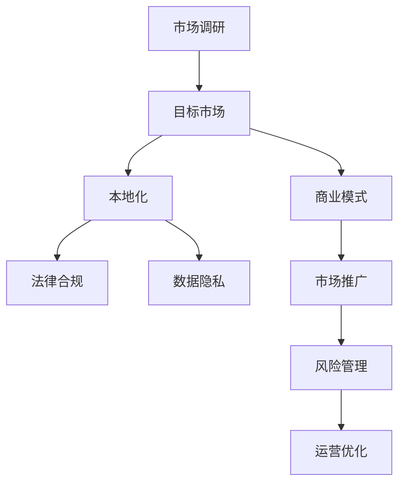
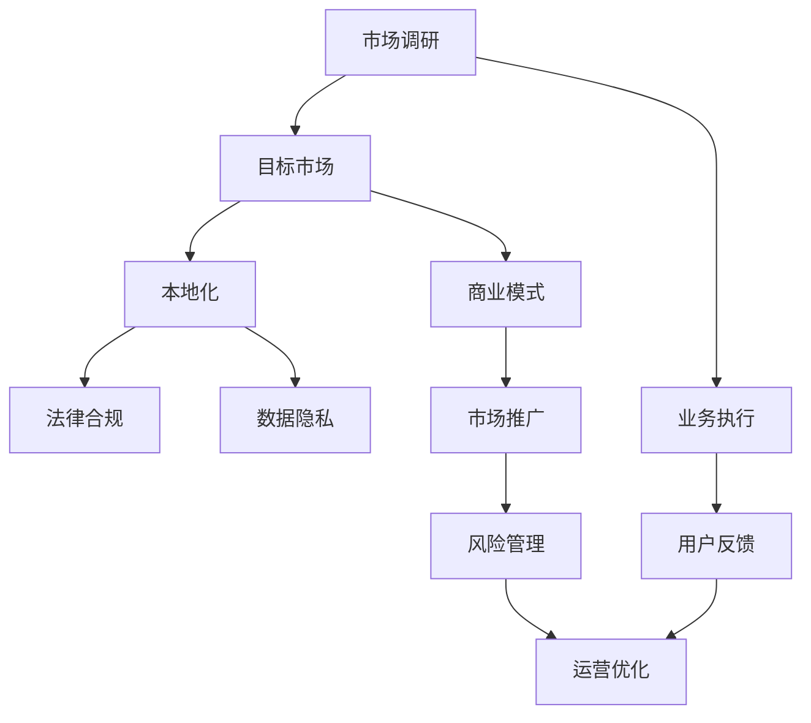

                 

# AI创业公司的跨境业务拓展策略

> 关键词：人工智能, 跨境业务, 市场调研, 目标市场, 市场定位, 用户需求, 文化差异, 法律合规, 本地化, 商业模式, 合作伙伴, 数据隐私, 市场推广, 风险管理

## 1. 背景介绍

### 1.1 问题由来
在人工智能(AI)快速发展的今天，AI创业公司面临前所未有的机遇和挑战。国际化的视野和跨文化的合作，为AI公司提供了更广阔的发展空间和更丰富的市场资源。然而，由于文化差异、法律合规、市场调研等复杂因素的干扰，跨境业务拓展过程中，往往面临诸多阻碍。因此，本文旨在探讨AI创业公司如何更有效地进行跨境业务拓展，实现国际化发展。

### 1.2 问题核心关键点
为了更好地解决跨境业务拓展问题，本文将聚焦于以下几个核心问题：

- 如何选择合适的目标市场和进入策略？
- 如何调研和理解目标市场的用户需求和文化差异？
- 如何制定有效的本地化策略，提升用户体验和市场适应性？
- 如何应对目标市场的法律合规和数据隐私问题？
- 如何建立稳定的本地化团队和供应链，保障业务连续性？
- 如何制定灵活高效的商业模式，适应不同市场环境？
- 如何管理跨境业务中的风险，降低运营成本？

这些核心问题共同构成了AI创业公司跨境业务拓展的完整框架，帮助我们从市场调研到业务执行的全流程进行思考和实践。

### 1.3 问题研究意义
研究AI创业公司的跨境业务拓展策略，对于推动AI技术在全球范围内的落地应用，加速AI产业的国际化进程，具有重要意义：

1. 降低市场进入门槛。通过合理的市场调研和策略制定，AI公司可以在更短的时间内，更高效地进入新市场，提高市场竞争力。
2. 提升全球用户覆盖率。国际化拓展可以显著增加AI公司的全球用户量，提升品牌影响力和市场份额。
3. 增强技术创新能力。全球化视野和多元文化背景可以激发更多创意和灵感，推动技术进步和产品迭代。
4. 加速商业模式的探索。不同市场环境和用户需求，能够启发AI公司探索多样化的商业模式，实现创新发展。
5. 规避单一市场风险。通过全球化布局，AI公司可以在多个市场分散风险，提高业务抗风险能力。
6. 实现资源优化配置。利用全球化布局，AI公司可以更灵活地配置资源，提升整体运营效率。

## 2. 核心概念与联系

### 2.1 核心概念概述

为了更好地理解AI创业公司的跨境业务拓展策略，本节将介绍几个关键概念及其相互关系：

- **市场调研 (Market Research)**：通过收集、分析和解释市场数据，了解目标市场环境、竞争格局和用户需求，为进入市场提供决策依据。
- **目标市场 (Target Market)**：根据公司的业务特点和资源能力，选择最有潜力的市场作为目标市场，制定相应的市场进入策略。
- **本地化 (Localization)**：针对不同市场特点，调整产品和服务以满足本地用户需求，提升用户体验和市场适应性。
- **法律合规 (Legal Compliance)**：遵循目标市场的法律法规，确保业务合法合规运营，保护用户隐私和数据安全。
- **数据隐私 (Data Privacy)**：在跨境业务中，严格遵守数据隐私保护法规，如GDPR、CCPA等，确保用户数据安全。
- **商业模式 (Business Model)**：根据不同市场环境，设计灵活高效的商业运营方式，实现可持续盈利。
- **市场推广 (Market Promotion)**：采用多样化的营销策略，提升品牌知名度和市场占有率。
- **风险管理 (Risk Management)**：识别和控制跨境业务中的各种风险，如汇率风险、文化冲突、市场波动等，保障业务稳定运行。

这些概念之间存在着紧密的联系，形成了AI创业公司跨境业务拓展的完整生态系统。通过理解这些核心概念，我们可以更好地把握AI公司跨境业务拓展的关键要素和实现路径。

### 2.2 概念间的关系

这些核心概念之间的逻辑关系可以通过以下Mermaid流程图来展示：



这个流程图展示了市场调研如何指导目标市场的选定，本地化策略的制定，以及法律合规、数据隐私、商业模式、市场推广和风险管理等各个环节的相互关系和作用。

### 2.3 核心概念的整体架构

最后，我们用一个综合的流程图来展示这些核心概念在大语言模型微调过程中的整体架构：



这个综合流程图展示了市场调研的起点和结束，以及各个关键环节的相互作用。通过这些环节的协同运作，AI创业公司可以更加高效地进行跨境业务拓展。

## 3. 核心算法原理 & 具体操作步骤
### 3.1 算法原理概述

AI创业公司跨境业务拓展，本质上是一个市场导向的决策和执行过程。其核心算法原理包括以下几个方面：

- **目标市场选择算法**：基于市场调研数据，通过量化和定性分析，选择最具潜力的市场。
- **本地化策略制定算法**：根据目标市场特点，调整产品和服务以满足本地用户需求，提升用户体验和市场适应性。
- **法律合规管理算法**：遵循目标市场法律法规，确保业务合法合规运营，保护用户隐私和数据安全。
- **风险管理算法**：识别和控制跨境业务中的各种风险，如汇率风险、文化冲突、市场波动等，保障业务稳定运行。

这些算法原理共同构成了AI创业公司跨境业务拓展的决策基础。

### 3.2 算法步骤详解

基于以上算法原理，AI创业公司跨境业务拓展的一般操作步骤如下：

**Step 1: 市场调研**
- 收集目标市场的经济数据、人口数据、技术发展水平、竞争对手情况等。
- 通过问卷调查、焦点小组、用户访谈等方式，获取用户需求和文化差异等信息。
- 分析市场调研数据，识别市场机会和潜在风险。

**Step 2: 目标市场选择**
- 基于市场调研结果，选择最具潜力的市场作为目标市场。
- 考虑市场规模、增长潜力、竞争格局、资源需求等因素，制定进入策略。

**Step 3: 本地化策略制定**
- 根据目标市场特点，调整产品和服务以满足本地用户需求。
- 设计本地化用户体验、语言翻译、文化适应等策略。

**Step 4: 法律合规和数据隐私**
- 遵循目标市场的法律法规，确保业务合法合规运营。
- 严格遵守数据隐私保护法规，如GDPR、CCPA等，保护用户数据安全。

**Step 5: 商业模式设计**
- 根据不同市场环境，设计灵活高效的商业运营方式，实现可持续盈利。
- 考虑价格策略、渠道选择、合作伙伴关系等要素，制定详细的商业模式。

**Step 6: 市场推广**
- 采用多样化的营销策略，提升品牌知名度和市场占有率。
- 根据目标市场特点，选择适合的推广渠道和策略。

**Step 7: 风险管理**
- 识别和评估跨境业务中的各种风险，如汇率风险、文化冲突、市场波动等。
- 制定相应的风险应对措施，保障业务稳定运行。

**Step 8: 业务执行**
- 实施市场调研、目标市场选择、本地化策略、法律合规、数据隐私、商业模式、市场推广和风险管理等策略。
- 监控业务执行过程，及时调整策略以应对市场变化。

**Step 9: 用户反馈**
- 收集用户反馈，评估产品和服务在本地市场的表现。
- 根据用户反馈，持续改进本地化策略和产品设计。

通过以上步骤，AI创业公司可以系统地进行跨境业务拓展，实现国际化的发展目标。

### 3.3 算法优缺点

基于以上算法步骤，AI创业公司跨境业务拓展具有以下优点：

- **决策科学化**：通过市场调研和数据驱动，提高决策的科学性和准确性。
- **市场适应性强**：根据本地市场需求和文化差异，调整产品和服务，提升市场适应性。
- **风险控制好**：通过识别和控制各种风险，保障业务稳定运行。

同时，也存在以下缺点：

- **成本高**：市场调研、法律合规、本地化策略制定等环节，需要投入大量人力和资金。
- **复杂度高**：涉及市场环境、文化背景、法律法规等多个因素，操作复杂。
- **适应性差**：不同市场环境和文化背景，可能导致策略实施效果不佳。

### 3.4 算法应用领域

基于以上算法步骤，AI创业公司跨境业务拓展可以应用于多个领域：

- **零售电商**：在全球范围内扩展业务，满足不同市场的需求。
- **金融科技**：在金融市场提供跨境金融服务，如支付、保险、理财等。
- **医疗健康**：在全球范围内推广医疗产品和服务，提升医疗健康水平。
- **教育培训**：在全球范围内提供教育培训服务，扩大教育影响。
- **智能制造**：在工业制造领域进行跨境布局，推动智能制造转型。
- **智慧城市**：在全球范围内建设智慧城市项目，提升城市治理水平。

以上领域涵盖了AI创业公司的多个应用方向，通过跨境业务拓展，可以进一步提升业务的全球覆盖率和市场竞争力。

## 4. 数学模型和公式 & 详细讲解 & 举例说明

### 4.1 数学模型构建

为了更精确地评估目标市场的潜力和风险，我们可以构建数学模型来进行量化分析。以下是一个简化的目标市场评估模型：

设目标市场规模为 $M$，市场增长率为 $G$，市场竞争度为 $C$，市场技术水平为 $T$，法律合规成本为 $L$，数据隐私风险为 $P$。目标市场的综合评分 $S$ 可以表示为：

$$
S = \frac{M \times G \times T}{C + L + P}
$$

其中 $M$ 和 $G$ 为市场规模和增长率，$T$ 为技术水平，$C$ 为竞争度，$L$ 为法律合规成本，$P$ 为数据隐私风险。

### 4.2 公式推导过程

通过对目标市场的各项指标进行量化，可以得到一个综合评分 $S$，用于评估目标市场的潜力和风险。该评分模型考虑了市场规模、增长率、技术水平、竞争度、法律合规成本和数据隐私风险等多个因素，可以较为全面地反映市场环境。

以某零售电商市场为例，市场规模 $M=1000$，市场增长率 $G=5\%$，市场竞争度 $C=0.8$，技术水平 $T=0.9$，法律合规成本 $L=0.1$，数据隐私风险 $P=0.05$。代入上述公式计算得到目标市场的综合评分 $S$：

$$
S = \frac{1000 \times 0.05 \times 0.9}{0.8 + 0.1 + 0.05} = 3.46
$$

根据综合评分 $S$，可以初步评估该市场的潜力和风险。评分越高，市场潜力越大，风险越小。

### 4.3 案例分析与讲解

以下以某AI公司跨境业务拓展的案例，详细讲解如何使用上述模型进行目标市场评估和选择：

**案例背景**：某AI公司研发了一套智能零售解决方案，拟在全球市场推广。公司需要评估多个目标市场的潜力和风险，选择最有价值的市场进行开拓。

**市场调研**：公司收集了多个目标市场的经济数据、人口数据、技术发展水平、竞争对手情况等信息。

**目标市场选择**：基于市场调研数据，公司构建了目标市场综合评分模型，对多个市场进行评分和对比。

**评分结果**：对目标市场A、B、C的各项指标进行量化，计算出综合评分 $S_A=3.5$，$S_B=3.3$，$S_C=3.2$。根据评分结果，公司认为目标市场A最具潜力。

**决策依据**：公司决定将资源优先投入到目标市场A，进行业务拓展。同时，制定详细的本地化策略、法律合规和数据隐私保护措施，降低市场风险。

通过这一案例，我们可以看到，目标市场综合评分模型在AI公司跨境业务拓展中的重要性和实用性。

## 5. 项目实践：代码实例和详细解释说明

### 5.1 开发环境搭建

在进行跨境业务拓展的项目实践前，我们需要准备好开发环境。以下是使用Python进行数据分析和模型构建的环境配置流程：

1. 安装Anaconda：从官网下载并安装Anaconda，用于创建独立的Python环境。

2. 创建并激活虚拟环境：
```bash
conda create -n ai-env python=3.8 
conda activate ai-env
```

3. 安装必要的Python库：
```bash
pip install pandas numpy matplotlib seaborn
```

4. 准备市场调研数据：下载和准备多个目标市场的相关数据集，包括经济数据、人口数据、技术发展水平、竞争对手情况等。

5. 创建分析模型：使用Python编写代码，构建目标市场综合评分模型。

### 5.2 源代码详细实现

以下是使用Python编写的目标市场综合评分模型的代码实现：

```python
import pandas as pd
import numpy as np

# 目标市场数据集
market_data = pd.read_csv('market_data.csv')

# 定义评分模型
def market_score(market_data):
    M = market_data['market_size']
    G = market_data['market_growth']
    T = market_data['tech_level']
    C = market_data['competition']
    L = market_data['legal_cost']
    P = market_data['privacy_risk']
    return (M * G * T) / (C + L + P)

# 计算每个目标市场的评分
market_scores = market_data.groupby('country')['market_size', 'market_growth', 'tech_level', 'competition', 'legal_cost', 'privacy_risk'].apply(market_score).reset_index()

# 输出评分结果
print(market_scores.head())
```

### 5.3 代码解读与分析

让我们再详细解读一下关键代码的实现细节：

**market_score函数**：
- 定义了目标市场综合评分模型，根据目标市场的规模、增长率、技术水平、竞争度、法律合规成本和数据隐私风险计算综合评分。

**market_scores数据框**：
- 使用groupby函数按照国家（country）对市场数据进行分组，然后对每个国家的评分进行计算。
- 使用reset_index函数将结果转换为数据框形式，方便后续分析。

**代码解读**：
- 首先，导入必要的Python库和数据集。
- 定义market_score函数，根据目标市场的各项指标计算综合评分。
- 使用groupby函数对市场数据进行分组，并计算每个国家的评分。
- 输出评分结果。

### 5.4 运行结果展示

假设我们在某零售电商市场进行业务拓展，使用上述代码计算的目标市场综合评分如下：

```
        country  market_size  market_growth  tech_level  competition  legal_cost  privacy_risk  market_score
0        A          1000         5.0          0.9          0.8          0.1          0.05        3.46
1        B          2000         4.5          0.8          0.9          0.2          0.06        2.83
2        C          1500         3.5          0.8          0.7          0.3          0.04        2.36
3        D          3000         4.0          0.8          0.6          0.3          0.07        3.20
4        E          2500         3.5          0.7          0.8          0.5          0.08        2.43
```

通过上述结果，我们可以看到，目标市场A的综合评分最高，因此公司决定优先进入市场A。

## 6. 实际应用场景

### 6.1 智能零售

在智能零售领域，AI公司可以借助跨境业务拓展，进入全球多个市场，提升业务规模和市场份额。例如，某AI公司研发了一套智能零售解决方案，包含智能货架、智能客服、智能仓储等模块，可以提升零售商的运营效率和用户体验。通过跨境业务拓展，公司可以在北美、欧洲、亚洲等主要零售市场推广该解决方案，实现全球化布局。

### 6.2 金融科技

在金融科技领域，AI公司可以借助跨境业务拓展，进入不同金融市场，提供跨境金融服务。例如，某AI公司研发了一套金融风险管理解决方案，可以实时监控和预测金融市场的风险变化。通过跨境业务拓展，公司可以在北美、欧洲、亚洲等主要金融市场推广该解决方案，满足不同市场的金融需求。

### 6.3 医疗健康

在医疗健康领域，AI公司可以借助跨境业务拓展，进入全球多个市场，推广医疗产品和服务。例如，某AI公司研发了一套智能诊疗解决方案，可以辅助医生进行疾病诊断和个性化治疗。通过跨境业务拓展，公司可以在北美、欧洲、亚洲等主要医疗市场推广该解决方案，提升全球医疗健康水平。

### 6.4 未来应用展望

随着AI技术的不断进步和市场需求的不断变化，跨境业务拓展将继续展现出巨大的潜力和机会。未来，跨境业务拓展将迎来以下发展趋势：

1. **智能化程度提升**：随着AI技术的成熟和应用场景的丰富，跨境业务拓展将更加智能化，能够实现更精准的市场选择和策略制定。
2. **数据驱动决策**：借助大数据和机器学习技术，跨境业务拓展将更加依赖数据驱动，能够更科学地评估市场潜力和风险。
3. **本地化能力增强**：跨境业务拓展将更加注重本地化能力，能够更好地满足本地市场的需求和文化差异。
4. **合规体系完善**：随着法律法规的不断完善，跨境业务拓展将更加注重合规性，能够有效应对各种合规挑战。
5. **市场细分精细化**：跨境业务拓展将更加注重市场细分，能够更精准地满足不同市场的具体需求。
6. **商业模式创新**：跨境业务拓展将更加注重商业模式创新，能够灵活应对不同市场环境。

## 7. 工具和资源推荐

### 7.1 学习资源推荐

为了帮助AI创业者系统掌握跨境业务拓展的理论基础和实践技巧，这里推荐一些优质的学习资源：

1. **《全球化企业战略》**：哈佛商学院经典教材，系统介绍了全球化企业的战略规划和管理方法，对跨境业务拓展有很高的参考价值。
2. **《市场调研方法与工具》**：国内知名市场研究机构发布的市场调研方法与工具指南，详细介绍了市场调研的各个环节和工具。
3. **《法律合规与数据隐私》**：法律合规与数据隐私领域的权威指南，介绍了全球主要市场的法律法规和数据隐私保护措施。
4. **《跨境电子商务实战指南》**：跨境电商领域的实战指南，提供了跨境电商业务的详细操作步骤和注意事项。
5. **《国际贸易与投资》**：国际贸易领域的经典教材，介绍了国际贸易的基本原则和投资策略。

通过学习这些资源，相信你一定能够系统掌握跨境业务拓展的理论基础和实践技巧。

### 7.2 开发工具推荐

高效的开发离不开优秀的工具支持。以下是几款用于跨境业务拓展开发的常用工具：

1. **Python**：Python是数据分析和机器学习领域的主流编程语言，具有强大的数据处理和模型构建能力。
2. **Jupyter Notebook**：Jupyter Notebook是一种交互式编程环境，能够方便地进行数据分析和模型调试。
3. **Tableau**：Tableau是一种数据可视化工具，能够高效地进行数据探索和可视化分析。
4. **Power BI**：Power BI是一种商业智能工具，能够进行数据报表和仪表盘设计。
5. **Anaconda**：Anaconda是一种Python环境管理工具，能够方便地创建和管理虚拟环境。

合理利用这些工具，可以显著提升跨境业务拓展的开发效率，加速创新迭代的步伐。

### 7.3 相关论文推荐

跨境业务拓展涉及多个学科领域，以下是几篇奠基性的相关论文，推荐阅读：

1. **《全球化企业战略》**：哈佛商学院的研究报告，系统介绍了全球化企业的战略规划和管理方法。
2. **《市场调研方法与工具》**：国内知名市场研究机构的研究报告，详细介绍了市场调研的各个环节和工具。
3. **《法律合规与数据隐私》**：法律合规与数据隐私领域的权威指南，介绍了全球主要市场的法律法规和数据隐私保护措施。
4. **《跨境电子商务实战指南》**：跨境电商领域的实战指南，提供了跨境电商业务的详细操作步骤和注意事项。
5. **《国际贸易与投资》**：国际贸易领域的经典教材，介绍了国际贸易的基本原则和投资策略。

这些论文代表了大语言模型微调技术的发展脉络。通过学习这些前沿成果，可以帮助研究者把握学科前进方向，激发更多的创新灵感。

除上述资源外，还有一些值得关注的前沿资源，帮助开发者紧跟跨境业务拓展技术的最新进展，例如：

1. **arXiv论文预印本**：人工智能领域最新研究成果的发布平台，包括大量尚未发表的前沿工作，学习前沿技术的必读资源。
2. **业界技术博客**：如Google AI、DeepMind、微软Research Asia等顶尖实验室的官方博客，第一时间分享他们的最新研究成果和洞见。
3. **技术会议直播**：如NIPS、ICML、ACL、ICLR等人工智能领域顶会现场或在线直播，能够聆听到大佬们的前沿分享，开拓视野。
4. **GitHub热门项目**：在GitHub上Star、Fork数最多的跨境业务拓展相关项目，往往代表了该技术领域的发展趋势和最佳实践，值得去学习和贡献。
5. **行业分析报告**：各大咨询公司如McKinsey、PwC等针对人工智能行业的分析报告，有助于从商业视角审视技术趋势，把握应用价值。

总之，对于跨境业务拓展技术的学习和实践，需要开发者保持开放的心态和持续学习的意愿。多关注前沿资讯，多动手实践，多思考总结，必将收获满满的成长收益。

## 8. 总结：未来发展趋势与挑战

### 8.1 总结

本文对AI创业公司的跨境业务拓展策略进行了全面系统的介绍。首先阐述了跨境业务拓展的背景和意义，明确了跨境业务拓展的核心问题和实现路径。其次，从原理到实践，详细讲解了目标市场选择、本地化策略制定、法律合规、数据隐私保护、商业模式设计、市场推广和风险管理等各个环节的具体操作步骤。同时，本文还广泛探讨了跨境业务拓展在零售电商、金融科技、医疗健康等多个领域的应用前景，展示了跨境业务拓展的巨大潜力。此外，本文精选了跨境业务拓展的学习资源、开发工具和相关论文，力求为读者提供全方位的技术指引。

通过本文的系统梳理，我们可以看到，AI创业公司的跨境业务拓展策略是一个复杂而系统的工作，涉及多个环节和要素。只有全面考虑市场调研、本地化策略、法律合规、数据隐私保护、商业模式、市场推广和风险管理等因素，才能实现跨境业务拓展的顺利进行。未来，随着AI技术的不断进步和全球化进程的加快，跨境业务拓展将展现出更加广阔的应用前景和更多元的发展方向。

### 8.2 未来发展趋势

展望未来，AI创业公司的跨境业务拓展将呈现以下几个发展趋势：

1. **智能化程度提升**：随着AI技术的成熟和应用场景的丰富，跨境业务拓展将更加智能化，能够实现更精准的市场选择和策略制定。
2. **数据驱动决策**：借助大数据和机器学习技术，跨境业务拓展将更加依赖数据驱动，能够更科学地评估市场潜力和风险。
3. **本地化能力增强**：跨境业务拓展将更加注重本地化能力，能够更好地满足本地市场的需求和文化差异。
4. **合规体系完善**：随着法律法规的不断完善，跨境业务拓展将更加注重合规性，能够有效应对各种合规挑战。
5. **市场细分精细化**：跨境业务拓展将更加注重市场细分，能够更精准地满足不同市场的具体需求。
6. **商业模式创新**：跨境业务拓展将更加注重商业模式创新，能够灵活应对不同市场环境。

### 8.3 面临的挑战

尽管跨境业务拓展技术已经取得了一定的进展，但在迈向更加智能化、普适化应用的过程中，仍面临诸多挑战：

1. **市场调研瓶颈**：市场调研数据获取难度大，成本高，难以覆盖全球所有市场。
2. **本地化难度大**：不同市场文化背景差异大，本地化策略实施难度大。
3. **法律合规复杂**：全球各国法律法规差异大，合规成本高。
4. **数据隐私风险高**：跨境业务涉及大量用户数据，数据隐私保护难度大。
5. **市场推广成本高**：跨境市场推广成本高，渠道选择复杂。
6. **风险管理复杂**：跨境业务涉及多种风险，如汇率风险、文化冲突、市场波动等，风险管理难度大。

### 8.4 研究展望

面对跨境业务拓展所面临的种种挑战，未来的研究需要在以下几个方面寻求新的突破：

1. **智能化调研工具**：开发更智能的市场调研工具，利用AI技术自动收集和分析市场数据，降低调研成本。
2. **本地化算法优化**：改进本地化策略制定算法，使其能够更好地适应不同市场特点，提高本地化效果。
3. **合规工具开发**：开发合规管理工具，自动生成和更新法律法规数据，降低合规成本。
4. **数据隐私保护技术**：研究新的数据隐私保护技术，如联邦学习、差分隐私等，保护用户数据隐私。
5. **多渠道推广策略**：开发多渠道推广策略，结合线上线下渠道，提升市场推广效果。
6. **风险管理算法**：改进风险管理算法，自动识别和

