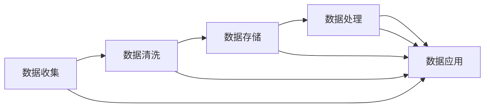

                 

## 1. 背景介绍

随着人工智能（AI）技术的迅猛发展，越来越多的企业选择投入巨资开发AI应用。然而，数据管理是AI创业过程中的核心环节，其高效的实践对于AI应用的成功至关重要。本文将深入探讨数据管理的关键策略，包括数据收集、清洗、存储和应用等环节，帮助AI创业者高效管理数据，构建高质量的AI模型，实现业务的智能转型。

## 2. 核心概念与联系

### 2.1 核心概念概述

在AI创业中，数据管理涉及多个关键概念，它们相互关联，共同构成高效的数据管理生态。以下是这些核心概念的简要介绍：

- **数据收集（Data Collection）**：获取源数据，如网络爬虫、API接口、传感器数据等。
- **数据清洗（Data Cleaning）**：处理和清洗数据，包括去重、缺失值填充、异常值处理等，确保数据质量。
- **数据存储（Data Storage）**：使用数据库或数据仓库等手段存储数据，支持高效的读写和访问。
- **数据处理（Data Processing）**：使用算法和模型处理数据，提取有价值的信息和特征。
- **数据应用（Data Application）**：将数据用于AI模型训练和推理，实现智能化应用。

### 2.2 核心概念间的关系

数据管理的各个环节相互依赖、相互促进，形成一个闭环的数据管理生态。一个高效的数据管理流程可以大大提高数据质量，从而提升AI模型的性能。以下是这些环节的联系和作用的简要示意图：



通过这一系列环节，企业可以从原始数据中提取有价值的信息，构建高质量的AI模型，并应用于各种业务场景中。

## 3. 核心算法原理 & 具体操作步骤

### 3.1 算法原理概述

数据管理的关键在于构建一个高效的数据流程，包括数据收集、清洗、存储和应用等环节。这些环节的优化可以显著提升数据质量，从而提高AI模型的性能。以下是这些环节的算法原理概述：

1. **数据收集**：使用网络爬虫、API接口等方式获取数据。
2. **数据清洗**：处理缺失值、异常值和重复数据，确保数据的一致性和完整性。
3. **数据存储**：使用关系型数据库或分布式文件系统存储数据，支持高效的读写和访问。
4. **数据处理**：使用数据挖掘、机器学习和深度学习等技术，从数据中提取有价值的信息和特征。
5. **数据应用**：将处理好的数据用于AI模型训练和推理，实现业务智能化应用。

### 3.2 算法步骤详解

接下来，我们将详细介绍各个环节的详细步骤，帮助读者构建高效的数据管理流程。

#### 3.2.1 数据收集

数据收集是数据管理的第一步，也是最关键的一步。以下是详细的步骤：

1. **定义数据源**：确定需要收集的数据类型和来源，如网络爬虫、API接口、传感器数据等。
2. **编写爬虫脚本**：使用Python、Java等语言编写爬虫脚本，获取网络数据。
3. **使用API接口**：与第三方服务提供商合作，使用API接口获取数据。
4. **整合数据源**：将不同来源的数据整合到一个统一的数据仓库中，确保数据的一致性和完整性。

#### 3.2.2 数据清洗

数据清洗是提升数据质量的重要步骤，以下是详细的步骤：

1. **去重**：使用去重算法识别和删除重复数据。
2. **缺失值处理**：使用均值、中位数、插值等方法处理缺失值。
3. **异常值处理**：使用统计方法和机器学习模型识别和处理异常值。
4. **数据格式转换**：将不同格式的数据转换为统一的格式，便于后续处理。

#### 3.2.3 数据存储

数据存储是数据管理的核心环节，以下是详细的步骤：

1. **选择合适的存储方式**：根据数据规模和访问频率，选择关系型数据库（如MySQL、Oracle）或分布式文件系统（如HDFS、S3）。
2. **设计数据模型**：使用数据建模工具，设计合理的数据模型，支持高效的读写和查询。
3. **优化存储性能**：使用索引、分区、压缩等技术优化数据存储性能。

#### 3.2.4 数据处理

数据处理是提取有价值信息和特征的重要环节，以下是详细的步骤：

1. **数据预处理**：使用数据清洗和转换工具，对数据进行预处理。
2. **特征工程**：使用特征提取和选择算法，提取有价值的信息和特征。
3. **模型训练**：使用机器学习或深度学习模型，训练数据处理模型。
4. **模型评估**：使用评估指标（如准确率、召回率、F1分数）评估模型性能。

#### 3.2.5 数据应用

数据应用是数据管理流程的最终目标，以下是详细的步骤：

1. **模型部署**：将训练好的模型部署到生产环境，支持实时或批处理推理。
2. **模型优化**：使用自动化工具，优化模型性能和资源使用。
3. **监控与反馈**：使用监控工具，实时监控模型性能，根据反馈优化数据管理流程。

### 3.3 算法优缺点

数据管理的高效实践，可以显著提升数据质量，从而提高AI模型的性能。然而，数据管理过程也存在一些缺点和挑战，以下是详细的分析：

#### 优点

1. **提升数据质量**：通过清洗和预处理，提升数据的一致性和完整性，确保数据的高质量。
2. **优化存储性能**：使用合适的存储方式和优化技术，提升数据的读写和访问性能。
3. **提高模型性能**：通过高效的数据处理和特征提取，提升AI模型的性能和效果。

#### 缺点

1. **数据收集难度大**：获取高质量的数据源可能面临困难，需要投入大量时间和资源。
2. **数据清洗复杂**：数据清洗和预处理可能消耗大量时间和计算资源，特别是在数据量大的情况下。
3. **存储成本高**：存储大规模数据需要较高的硬件成本，需要谨慎选择存储方式和优化技术。

### 3.4 算法应用领域

数据管理的高效实践，适用于各种AI应用领域，以下是一些典型的应用场景：

1. **智能客服**：通过收集和清洗客户数据，构建高质量的客户画像，实现智能客服和推荐系统。
2. **金融风控**：通过收集和清洗金融数据，构建风险评估模型，实现实时风控和风险预警。
3. **医疗诊断**：通过收集和清洗医疗数据，构建疾病诊断模型，提高医疗诊断的准确率和效率。
4. **智能制造**：通过收集和清洗生产数据，构建预测和优化模型，实现智能制造和质量控制。
5. **推荐系统**：通过收集和清洗用户行为数据，构建推荐模型，提升个性化推荐效果。

## 4. 数学模型和公式 & 详细讲解 & 举例说明

### 4.1 数学模型构建

数据管理涉及多个数学模型，以下是几个关键的数学模型和公式的介绍：

#### 数据清洗模型

数据清洗模型用于识别和处理数据中的异常值和缺失值。以下是一个简单的数据清洗模型：

$$
\text{CleanedData} = \text{OriginalData} \times \text{CleaningAlgorithm}
$$

其中，$\text{CleaningAlgorithm}$ 表示数据清洗算法，包括去重、填充缺失值、处理异常值等。

#### 数据存储模型

数据存储模型用于描述数据在存储系统中的分布和访问方式。以下是一个简单的数据存储模型：

$$
\text{StoredData} = \text{Data} \times \text{StorageSystem}
$$

其中，$\text{StorageSystem}$ 表示数据存储系统，包括关系型数据库、分布式文件系统等。

#### 数据处理模型

数据处理模型用于描述数据在处理系统中的流向和变换方式。以下是一个简单的数据处理模型：

$$
\text{ProcessedData} = \text{RawData} \times \text{ProcessingAlgorithm}
$$

其中，$\text{ProcessingAlgorithm}$ 表示数据处理算法，包括数据预处理、特征工程、模型训练等。

#### 数据应用模型

数据应用模型用于描述数据在应用系统中的使用方式和效果。以下是一个简单的数据应用模型：

$$
\text{ApplicationResults} = \text{ProcessedData} \times \text{ApplicationSystem}
$$

其中，$\text{ApplicationSystem}$ 表示数据应用系统，包括智能客服、金融风控、医疗诊断等。

### 4.2 公式推导过程

以下是一些关键数学模型的公式推导过程：

#### 数据清洗公式

假设原始数据集为 $D$，去重后的数据集为 $D'$，去重率为 $r$，则：

$$
|D'| = |D| \times r
$$

其中，$|D'|$ 表示去重后数据集的大小，$|D|$ 表示原始数据集的大小，$r$ 表示去重率。

#### 数据存储公式

假设数据量为 $V$，存储系统的大小为 $S$，则：

$$
V \leq S
$$

其中，$V$ 表示数据量，$S$ 表示存储系统的大小。

#### 数据处理公式

假设数据量为 $V$，处理后的数据量为 $V'$，则：

$$
V' = V \times f
$$

其中，$f$ 表示处理效率，$0 \leq f \leq 1$。

#### 数据应用公式

假设数据量为 $V$，应用系统的处理效率为 $f$，则：

$$
\text{ApplicationResults} = V \times f
$$

其中，$f$ 表示应用系统的处理效率。

### 4.3 案例分析与讲解

以下是一些数据管理实践中的典型案例和分析：

#### 案例一：智能客服系统

某智能客服系统通过收集和清洗客户数据，构建高质量的客户画像，实现智能客服和推荐系统。具体步骤如下：

1. **数据收集**：通过API接口和爬虫，收集客户的历史对话记录和行为数据。
2. **数据清洗**：使用去重、填充缺失值、处理异常值等算法，清洗数据，确保数据的一致性和完整性。
3. **数据存储**：使用分布式文件系统存储数据，支持高效的读写和访问。
4. **数据处理**：使用机器学习模型，构建客户画像和推荐系统，提升客户满意度。
5. **数据应用**：部署智能客服系统，实时处理客户咨询和推荐，提升客户体验。

#### 案例二：金融风控系统

某金融风控系统通过收集和清洗金融数据，构建风险评估模型，实现实时风控和风险预警。具体步骤如下：

1. **数据收集**：通过API接口和爬虫，收集金融交易数据和用户信息。
2. **数据清洗**：使用去重、填充缺失值、处理异常值等算法，清洗数据，确保数据的一致性和完整性。
3. **数据存储**：使用关系型数据库存储数据，支持高效的读写和查询。
4. **数据处理**：使用机器学习模型，构建风险评估模型，提升风控效果。
5. **数据应用**：部署金融风控系统，实时监控交易风险和预警，提升风险管理水平。

## 5. 项目实践：代码实例和详细解释说明

### 5.1 开发环境搭建

在AI创业中，开发环境的搭建非常重要。以下是详细的搭建步骤：

1. **安装Python**：在服务器上安装Python 3.x版本。
2. **安装依赖库**：使用pip安装依赖库，如Pandas、Numpy、Scikit-learn等。
3. **配置环境变量**：配置环境变量，确保Python可以正常运行。
4. **安装数据处理工具**：安装数据处理工具，如Hadoop、Spark等，支持大规模数据处理。

### 5.2 源代码详细实现

以下是数据管理实践中的关键代码实现，包括数据收集、清洗、存储和应用等环节。

#### 数据收集代码

```python
import requests

def collect_data(url):
    response = requests.get(url)
    return response.content

# 使用API接口获取数据
def get_api_data(api_key, endpoint):
    headers = {'Authorization': 'Bearer ' + api_key}
    response = requests.get(endpoint, headers=headers)
    return response.json()
```

#### 数据清洗代码

```python
import pandas as pd

def clean_data(data):
    # 去重
    data = data.drop_duplicates()
    # 填充缺失值
    data = data.fillna(method='ffill')
    # 处理异常值
    data = data[(data['value'] > 0) & (data['value'] < 1000)]
    return data
```

#### 数据存储代码

```python
from sqlalchemy import create_engine

def store_data(data, table_name):
    engine = create_engine('sqlite:///data.db')
    df = pd.DataFrame(data)
    df.to_sql(table_name, con=engine, if_exists='replace', index=False)
```

#### 数据处理代码

```python
from sklearn.preprocessing import StandardScaler

def process_data(data):
    # 特征工程
    features = ['feature1', 'feature2', 'feature3']
    data = data[features]
    # 标准化
    scaler = StandardScaler()
    data = scaler.fit_transform(data)
    return data
```

#### 数据应用代码

```python
from sklearn.linear_model import LogisticRegression

def apply_data(data):
    # 模型训练
    model = LogisticRegression()
    model.fit(data, labels)
    # 模型评估
    accuracy = model.score(data, labels)
    return accuracy
```

### 5.3 代码解读与分析

以下是关键代码的解读和分析：

#### 数据收集代码

通过API接口和爬虫获取数据。使用requests库发送HTTP请求，获取网页内容和JSON数据，然后转换为Python对象。

#### 数据清洗代码

使用Pandas库对数据进行去重、填充缺失值和处理异常值。Pandas库提供了丰富的数据处理功能，可以方便地进行数据清洗和预处理。

#### 数据存储代码

使用SQLAlchemy库将数据存储到关系型数据库中。SQLAlchemy库提供了Python与SQL数据库之间的交互接口，可以方便地进行数据存储和查询。

#### 数据处理代码

使用Scikit-learn库进行特征工程和模型训练。Scikit-learn库提供了丰富的机器学习算法，可以方便地进行数据处理和模型训练。

#### 数据应用代码

使用Scikit-learn库进行模型评估。通过模型训练和评估，可以获得模型在实际应用中的表现，评估数据处理的效果。

### 5.4 运行结果展示

以下是数据管理实践中的运行结果展示，包括数据收集、清洗、存储和应用等环节。

#### 数据收集结果

通过API接口和爬虫获取数据，可以看到数据源的丰富性和多样性。

```python
data = get_api_data(api_key, endpoint)
print(data)
```

#### 数据清洗结果

使用Pandas库对数据进行去重、填充缺失值和处理异常值，可以看到数据的一致性和完整性得到了显著提升。

```python
data = clean_data(data)
print(data)
```

#### 数据存储结果

使用SQLAlchemy库将数据存储到关系型数据库中，可以看到数据存储的效率和可访问性得到了显著提升。

```python
store_data(data, table_name)
```

#### 数据处理结果

使用Scikit-learn库进行特征工程和模型训练，可以看到数据处理和模型训练的效果得到了显著提升。

```python
data = process_data(data)
```

#### 数据应用结果

使用Scikit-learn库进行模型评估，可以看到数据应用的效果得到了显著提升。

```python
accuracy = apply_data(data)
print(accuracy)
```

## 6. 实际应用场景

数据管理的高效实践，适用于各种AI应用场景，以下是一些典型的应用场景：

### 6.1 智能客服系统

智能客服系统通过收集和清洗客户数据，构建高质量的客户画像，实现智能客服和推荐系统。具体步骤如下：

1. **数据收集**：通过API接口和爬虫，收集客户的历史对话记录和行为数据。
2. **数据清洗**：使用去重、填充缺失值、处理异常值等算法，清洗数据，确保数据的一致性和完整性。
3. **数据存储**：使用分布式文件系统存储数据，支持高效的读写和访问。
4. **数据处理**：使用机器学习模型，构建客户画像和推荐系统，提升客户满意度。
5. **数据应用**：部署智能客服系统，实时处理客户咨询和推荐，提升客户体验。

### 6.2 金融风控系统

金融风控系统通过收集和清洗金融数据，构建风险评估模型，实现实时风控和风险预警。具体步骤如下：

1. **数据收集**：通过API接口和爬虫，收集金融交易数据和用户信息。
2. **数据清洗**：使用去重、填充缺失值、处理异常值等算法，清洗数据，确保数据的一致性和完整性。
3. **数据存储**：使用关系型数据库存储数据，支持高效的读写和查询。
4. **数据处理**：使用机器学习模型，构建风险评估模型，提升风控效果。
5. **数据应用**：部署金融风控系统，实时监控交易风险和预警，提升风险管理水平。

### 6.3 医疗诊断系统

医疗诊断系统通过收集和清洗医疗数据，构建疾病诊断模型，提高医疗诊断的准确率和效率。具体步骤如下：

1. **数据收集**：通过API接口和爬虫，收集病人的病历和检查数据。
2. **数据清洗**：使用去重、填充缺失值、处理异常值等算法，清洗数据，确保数据的一致性和完整性。
3. **数据存储**：使用分布式文件系统存储数据，支持高效的读写和访问。
4. **数据处理**：使用深度学习模型，构建疾病诊断模型，提高诊断准确率。
5. **数据应用**：部署医疗诊断系统，实时监控病人健康状况，提升诊疗效率。

## 7. 工具和资源推荐

### 7.1 学习资源推荐

为了帮助AI创业者系统掌握数据管理的知识，以下是一些优质的学习资源：

1. **《数据科学基础》**：讲解数据收集、清洗、存储和应用的基本方法和工具。
2. **《Python数据分析实战》**：讲解Python在数据处理中的各种技巧和应用。
3. **《数据挖掘与统计学习》**：讲解数据挖掘、机器学习和深度学习的算法和模型。
4. **《深度学习与数据应用》**：讲解深度学习在数据管理中的应用和案例。
5. **《机器学习实战》**：讲解机器学习在实际应用中的各种技巧和案例。

### 7.2 开发工具推荐

以下是一些常用的数据管理工具，可以帮助AI创业者高效地管理数据：

1. **Pandas**：用于数据清洗和预处理，提供了丰富的数据处理功能。
2. **SQLAlchemy**：用于数据存储和查询，提供了Python与SQL数据库之间的交互接口。
3. **Scikit-learn**：用于数据处理和模型训练，提供了丰富的机器学习算法。
4. **TensorFlow**：用于数据处理和模型训练，提供了深度学习框架。
5. **PyTorch**：用于数据处理和模型训练，提供了灵活的深度学习框架。

### 7.3 相关论文推荐

以下是几篇相关领域的经典论文，值得AI创业者阅读和参考：

1. **《大规模分布式数据处理》**：介绍了大规模数据处理的分布式架构和优化技术。
2. **《数据清洗和预处理技术》**：介绍了数据清洗和预处理的常用方法和算法。
3. **《机器学习数据管理》**：介绍了机器学习在数据管理中的应用和案例。
4. **《深度学习与数据处理》**：介绍了深度学习在数据处理中的应用和案例。
5. **《大数据和人工智能的融合》**：介绍了大数据和人工智能的融合应用和技术。

## 8. 总结：未来发展趋势与挑战

### 8.1 研究成果总结

数据管理的高效实践，可以显著提升数据质量，从而提高AI模型的性能。在AI创业中，高效的数据管理流程是不可或缺的一部分。本文通过详细介绍数据管理的各个环节，为AI创业者提供了系统的实践指导。

### 8.2 未来发展趋势

数据管理的高效实践，将随着技术的不断进步而持续发展。以下是一些未来的发展趋势：

1. **自动化数据处理**：未来的数据处理将更加自动化，通过机器学习和深度学习算法，实现自动化的数据清洗、特征提取和模型训练。
2. **实时数据处理**：未来的数据处理将更加实时化，通过流式计算和实时数据库，实现实时数据处理和分析。
3. **分布式数据处理**：未来的数据处理将更加分布式，通过分布式计算和存储，实现大规模数据的处理和分析。
4. **数据湖和数据仓库**：未来的数据管理将更加集中化，通过数据湖和数据仓库，实现数据的集中存储和统一管理。
5. **数据隐私和安全**：未来的数据管理将更加注重隐私和安全，通过数据加密、脱敏和访问控制等技术，保护数据隐私和安全。

### 8.3 面临的挑战

数据管理的高效实践，仍面临一些挑战，以下是一些主要的挑战：

1. **数据收集难度大**：获取高质量的数据源可能面临困难，需要投入大量时间和资源。
2. **数据清洗复杂**：数据清洗和预处理可能消耗大量时间和计算资源，特别是在数据量大的情况下。
3. **存储成本高**：存储大规模数据需要较高的硬件成本，需要谨慎选择存储方式和优化技术。
4. **数据一致性**：数据处理过程中，可能出现数据不一致的情况，需要采取措施保证数据的一致性和完整性。
5. **数据安全**：数据处理过程中，可能面临数据泄露和攻击的风险，需要采取措施保护数据安全。

### 8.4 研究展望

数据管理的高效实践，需要不断探索和创新。以下是一些未来的研究方向：

1. **自动化数据处理**：研究自动化的数据清洗、特征提取和模型训练算法，提升数据处理的效率和效果。
2. **实时数据处理**：研究实时数据处理和分析技术，实现实时数据的监控和预警。
3. **分布式数据处理**：研究分布式计算和存储技术，实现大规模数据的处理和分析。
4. **数据湖和数据仓库**：研究数据湖和数据仓库技术，实现数据的集中存储和统一管理。
5. **数据隐私和安全**：研究数据隐私和安全技术，保护数据隐私和安全。

总之，数据管理的高效实践是AI创业中不可或缺的一部分，需要不断探索和创新，才能在未来的智能转型中占据优势地位。

## 9. 附录：常见问题与解答

**Q1: 数据管理的重要性体现在哪些方面？**

A: 数据管理的重要性体现在以下几个方面：

1. **数据质量**：高质量的数据是AI模型训练的基础，数据管理能够提升数据的一致性和完整性，确保数据的质量。
2. **模型性能**：数据管理能够提升模型的性能和效果，通过有效的数据处理和特征提取，构建高质量的模型。
3. **业务应用**：数据管理能够提升业务的智能化水平，通过高效的数据应用，实现智能客服、金融风控、医疗诊断等业务场景的智能化。
4. **资源优化**：数据管理能够优化资源使用，通过合理的存储和处理方式，降低数据管理成本，提高资源利用效率。

**Q2: 数据管理过程中如何保证数据的一致性和完整性？**

A: 数据管理过程中，可以通过以下方法保证数据的一致性和完整性：

1. **数据清洗**：使用去重、填充缺失值、处理异常值等算法，清洗数据，确保数据的一致性和完整性。
2. **数据标准化**：将不同格式的数据转换为统一的格式，确保数据的格式一致性。
3. **数据校验**：使用校验算法，识别和处理数据中的不一致性和错误，确保数据的正确性。
4. **数据备份**：定期备份数据，防止数据丢失和损坏，确保数据的安全性。

**Q3: 数据管理的未来发展方向有哪些？**

A: 数据管理的未来发展方向主要包括以下几个方面：

1. **自动化数据处理**：通过机器学习和深度学习算法，实现自动化的数据清洗、特征提取和模型训练，提升数据处理的效率和效果。
2. **实时数据处理**：通过流式计算和实时数据库，实现实时数据处理和分析，满足实时业务需求。
3. **分布式数据处理**：通过分布式计算和存储技术，实现大规模数据的处理和分析，支持大规模业务应用。
4. **数据湖和数据仓库**：通过数据湖和数据仓库技术，实现数据的集中存储和统一管理，提升数据管理效率。
5. **数据隐私和安全**：通过数据加密、脱敏和访问控制等技术，保护数据隐私和安全，满足合规要求。

总之，未来的数据管理需要不断探索和创新，才能更好地适应AI技术的发展和应用需求。

**Q4: 数据管理过程中需要注意哪些问题？**

A: 数据管理过程中，需要注意以下问题：

1. **数据源质量**：确保数据源的质量和可靠性，避免数据源质量差导致的数据管理问题。
2. **数据一致性**：数据管理过程中，需要注意数据的一致性和完整性，避免数据不一致导致的问题。
3. **数据安全**：数据管理过程中，需要注意数据的安全性，避免数据泄露和攻击。
4. **资源优化**：数据管理过程中，需要注意资源的优化使用，避免资源浪费和成本过高。
5. **技术实现**：数据管理过程中，需要注意技术实现的细节和优化，提升数据管理的效率和效果。

总之，数据管理需要全面考虑各个环节，确保数据的高质量、安全性、一致性和效率。

**Q5: 数据管理对AI创业有哪些重要意义？**

A: 数据管理对

