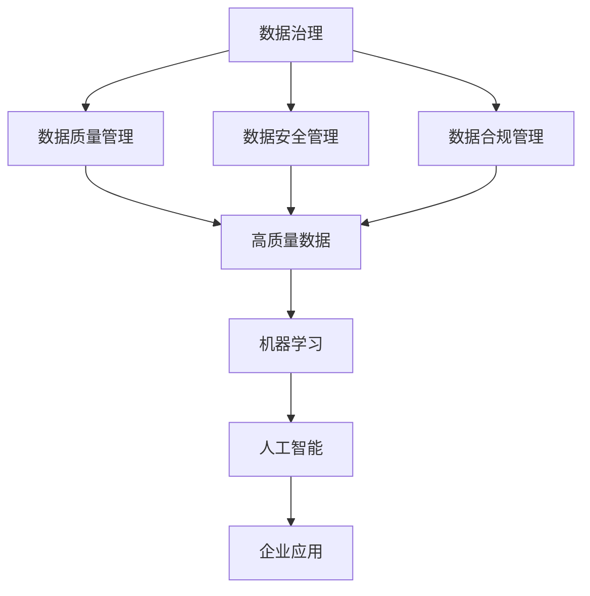
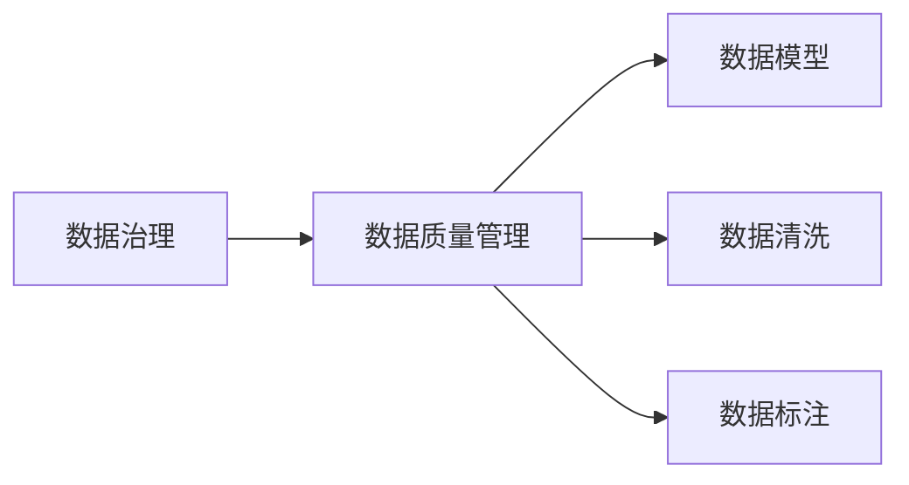
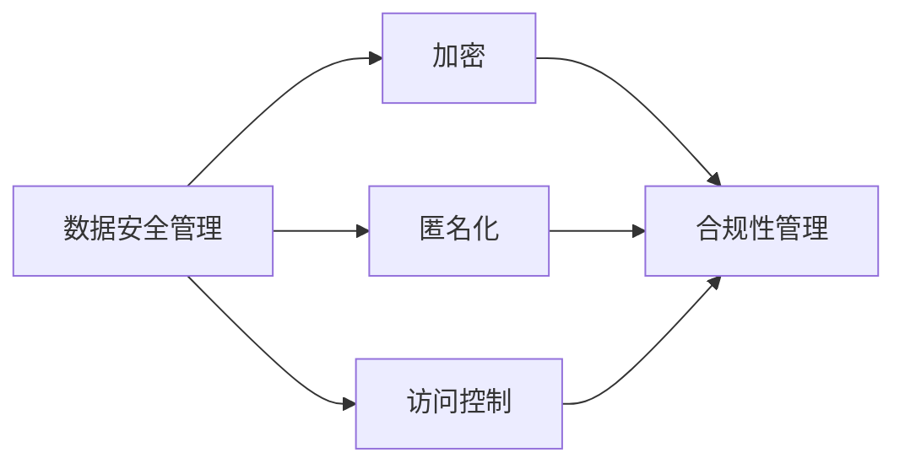
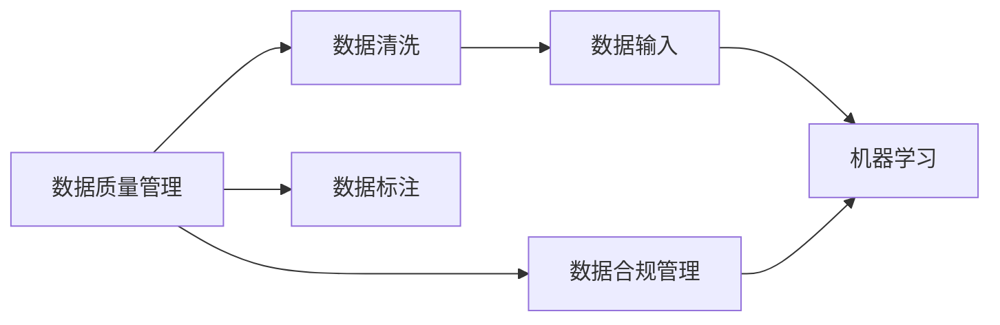
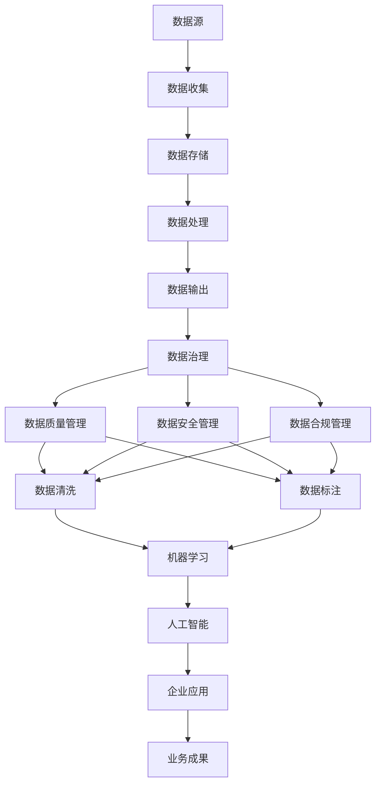

                 

# AI创业：确保数据质量和合法性

> 关键词：数据治理,数据隐私,合规性,机器学习,人工智能,企业应用

## 1. 背景介绍

### 1.1 问题由来
随着人工智能(AI)技术的不断进步，越来越多的企业开始探索和应用AI技术，特别是在数据驱动的决策和业务优化方面。然而，在AI项目的实施过程中，数据质量和合法性问题始终是一个重要的挑战。如何确保数据的质量和合法性，是保证AI项目成功的关键。本文将系统地介绍数据质量和合法性在AI创业中的重要性，并给出具体的解决方案。

### 1.2 问题核心关键点
数据质量和合法性问题涉及数据收集、存储、处理和使用的全生命周期。这些问题不仅影响AI系统的训练效果，还会引发法律和道德风险，甚至可能导致企业面临巨额罚款。因此，AI创业项目必须确保数据的质量和合法性，才能顺利进行并取得成功。

### 1.3 问题研究意义
研究数据质量和合法性问题，对于AI创业项目的成功具有重要意义：
- 提高模型训练效果。数据质量直接决定了模型训练的效果，高质量的数据能够提升模型的预测准确性和鲁棒性。
- 减少法律风险。确保数据合法性，可以避免企业因违反数据保护法规而承担法律责任。
- 提升企业声誉。遵守数据隐私和合规性要求，可以增强企业的社会责任感和品牌形象。
- 加速项目开发。清晰的法律和伦理边界，可以确保数据使用的合理性和合规性，从而加速AI项目的开发和应用。

## 2. 核心概念与联系

### 2.1 核心概念概述

为更好地理解数据质量和合法性问题，本节将介绍几个密切相关的核心概念：

- **数据治理(Data Governance)**：指通过政策、标准和流程等手段，确保数据在收集、存储、处理和使用的全生命周期中符合业务需求和技术要求。数据治理包括数据质量管理、数据安全管理和数据合规管理三个方面。

- **数据隐私(Data Privacy)**：指保护个人和企业数据不被未授权访问和滥用。数据隐私保护涉及法律规定（如GDPR）和技术措施（如加密和匿名化）。

- **合规性(Compliance)**：指确保业务操作符合相关法律法规和标准规范。合规性管理包括风险评估、合规监测和违规处理等。

- **机器学习(Machine Learning, ML)**：指通过算法和模型，从数据中自动学习规律，并应用于预测和决策。机器学习算法依赖高质量的数据，才能获得较好的训练效果。

- **人工智能(Artificial Intelligence, AI)**：指通过机器学习、自然语言处理等技术，模拟人的智能行为，实现自动化决策和任务处理。

- **企业应用(Business Applications)**：指将AI技术应用于企业具体的业务场景，实现业务流程的自动化和优化。

这些核心概念之间的逻辑关系可以通过以下Mermaid流程图来展示：



这个流程图展示了大数据在数据治理、数据质量和合规性管理下，经过数据质量管理、数据安全管理和数据合规管理，最终支持机器学习和人工智能的整个数据流程。

### 2.2 概念间的关系

这些核心概念之间存在着紧密的联系，形成了数据质量和合法性问题的完整生态系统。下面我通过几个Mermaid流程图来展示这些概念之间的关系。

#### 2.2.1 数据治理与数据质量管理的关系



这个流程图展示了数据治理与数据质量管理的关系。数据质量管理通过数据模型、数据清洗和数据标注等方法，提升数据质量，满足业务和技术的需要。

#### 2.2.2 数据安全管理与合规性管理的关系



这个流程图展示了数据安全管理与合规性管理的关系。数据安全管理通过加密、匿名化和访问控制等技术手段，保护数据的安全性。合规性管理则通过政策和技术手段，确保数据使用符合法律法规和标准规范。

#### 2.2.3 数据质量和合规性管理与机器学习的关系



这个流程图展示了数据质量和合规性管理与机器学习的关系。数据质量和合规性管理通过数据清洗、数据标注和合规性监控，确保数据输入高质量和合法性，从而提升机器学习模型的训练效果和应用效果。

### 2.3 核心概念的整体架构

最后，我们用一个综合的流程图来展示这些核心概念在大数据管理和使用的完整架构：



这个综合流程图展示了从数据源到数据治理、数据质量和合规性管理，再到机器学习、人工智能和业务应用的全过程。通过这些关键环节的协同工作，确保数据的质量和合法性，最终实现业务价值的提升。

## 3. 核心算法原理 & 具体操作步骤
### 3.1 算法原理概述

数据质量和合法性问题涉及数据治理、数据隐私和合规性管理等核心概念。在AI创业项目中，确保数据的质量和合法性，需要通过一系列的政策、标准和技术手段来实现。

数据质量管理主要关注数据的完整性、准确性、一致性和时效性。通过数据清洗、数据去重、数据补全和数据校正等方法，确保数据的质量和一致性。

数据隐私保护则涉及数据的收集、存储、处理和共享等环节，通过加密、匿名化和访问控制等技术手段，防止数据泄露和滥用。

数据合规性管理则确保数据使用符合法律法规和标准规范，通过风险评估、合规监测和违规处理等手段，保证数据使用的合法性和合规性。

### 3.2 算法步骤详解

以下是数据质量和合法性问题的具体操作步骤：

**Step 1: 数据收集和治理**
- 明确数据收集的目的和范围，确保数据的合法性和合规性。
- 制定数据收集标准和流程，确保数据收集的规范化和一致性。
- 对数据进行分类和标注，明确不同数据类型的用途和处理方式。

**Step 2: 数据清洗和处理**
- 通过数据清洗工具，删除重复数据、纠正错误数据和填补缺失数据，确保数据的完整性和一致性。
- 对数据进行标准化和归一化，确保数据格式的一致性。
- 使用数据处理算法，如聚类、降维和特征选择等，提升数据的可用性和模型训练效果。

**Step 3: 数据隐私保护**
- 使用数据加密技术，保护数据的机密性。
- 使用数据匿名化技术，保护数据的隐私性。
- 设置数据访问控制，限制数据访问权限，防止未经授权的数据访问。

**Step 4: 数据合规性管理**
- 进行数据合规性风险评估，识别潜在的合规性问题。
- 建立合规性监测系统，实时监控数据使用情况，及时发现违规行为。
- 对违规行为进行记录和处理，采取相应的纠正措施。

**Step 5: 数据质量评估**
- 制定数据质量评估指标，如准确率、完整率和一致性等。
- 定期对数据质量进行评估，识别和解决数据质量问题。
- 通过数据反馈机制，持续改进数据质量和治理流程。

### 3.3 算法优缺点

数据质量和合法性问题的解决，可以带来以下优点：
- 提升模型训练效果。高质量的数据可以提升机器学习模型的准确性和鲁棒性。
- 减少法律风险。确保数据合法性，可以避免企业因数据隐私和合规性问题承担法律责任。
- 提升企业声誉。遵守数据隐私和合规性要求，可以增强企业的社会责任感和品牌形象。

然而，也存在一些缺点：
- 数据收集和治理成本较高。数据治理需要制定政策和标准，并投入人力和技术资源。
- 数据隐私保护技术复杂。数据加密和匿名化技术需要较高的技术水平和成本投入。
- 合规性管理难度较大。不同国家和地区的法律法规不同，合规性管理需要适应多种法律要求。

### 3.4 算法应用领域

数据质量和合法性问题在AI创业项目中的应用领域非常广泛，包括但不限于：

- 医疗健康领域：确保患者数据的隐私和合规性，提升医疗决策的准确性和可靠性。
- 金融服务领域：保护用户数据的隐私和安全，确保金融服务的合规性和可信度。
- 零售电商领域：确保用户数据的隐私和合规性，提升用户体验和业务决策的科学性。
- 智能制造领域：确保生产数据的隐私和合规性，提升生产流程的智能化和效率化。
- 智慧城市领域：保护城市数据的隐私和合规性，提升城市管理和服务的智能化水平。

## 4. 数学模型和公式 & 详细讲解  
### 4.1 数学模型构建

本节将使用数学语言对数据质量和合法性问题进行更加严格的刻画。

记数据集为 $D=\{x_1,x_2,\dots,x_n\}$，其中 $x_i$ 为数据样本，假设数据样本 $x_i$ 的特征向量为 $f_i=(f_{i1},f_{i2},\dots,f_{im})$，其中 $f_{ik}$ 为第 $i$ 个样本的第 $k$ 个特征。

定义数据质量指标函数为 $\mathcal{Q}(D)$，包括数据的完整性、准确性、一致性和时效性等。则数据质量指标函数可表示为：

$$
\mathcal{Q}(D) = \sum_{i=1}^n \mathcal{Q}_i(x_i)
$$

其中 $\mathcal{Q}_i(x_i)$ 为第 $i$ 个样本的质量指标函数，具体计算方法取决于具体的质量要求。例如，对于缺失值，可以定义 $\mathcal{Q}_i(x_i)$ 为缺失值的数量。

定义数据隐私保护指标函数为 $\mathcal{P}(D)$，包括数据的机密性、完整性和可用性等。则数据隐私保护指标函数可表示为：

$$
\mathcal{P}(D) = \sum_{i=1}^n \mathcal{P}_i(x_i)
$$

其中 $\mathcal{P}_i(x_i)$ 为第 $i$ 个样本的隐私保护指标函数，具体计算方法取决于具体的隐私要求。例如，对于加密数据，可以定义 $\mathcal{P}_i(x_i)$ 为解密后的数据与原始数据之间的相似度。

定义数据合规性指标函数为 $\mathcal{C}(D)$，包括数据使用的合法性和合规性。则数据合规性指标函数可表示为：

$$
\mathcal{C}(D) = \sum_{i=1}^n \mathcal{C}_i(x_i)
$$

其中 $\mathcal{C}_i(x_i)$ 为第 $i$ 个样本的合规性指标函数，具体计算方法取决于具体的合规要求。例如，对于敏感数据，可以定义 $\mathcal{C}_i(x_i)$ 为是否存在违规使用敏感数据的情况。

### 4.2 公式推导过程

以下是数据质量指标函数、隐私保护指标函数和合规性指标函数的推导过程：

**数据质量指标函数**

对于数据质量指标函数 $\mathcal{Q}_i(x_i)$，假设 $x_i$ 的缺失值为 $m_i$，错误值为 $e_i$，不一致值为 $c_i$，过时值为 $t_i$。则有：

$$
\mathcal{Q}_i(x_i) = w_1m_i + w_2e_i + w_3c_i + w_4t_i
$$

其中 $w_1$、$w_2$、$w_3$ 和 $w_4$ 分别为缺失值、错误值、不一致值和过时值的重要性权重。具体权重可以根据具体应用场景进行调整。

**数据隐私保护指标函数**

对于数据隐私保护指标函数 $\mathcal{P}_i(x_i)$，假设 $x_i$ 的加密值为 $e_i$，匿名化值为 $a_i$，访问控制值为 $c_i$。则有：

$$
\mathcal{P}_i(x_i) = w_1e_i + w_2a_i + w_3c_i
$$

其中 $w_1$、$w_2$ 和 $w_3$ 分别为加密值、匿名化值和访问控制值的重要性权重。

**数据合规性指标函数**

对于数据合规性指标函数 $\mathcal{C}_i(x_i)$，假设 $x_i$ 的合法性值为 $l_i$，合规性值为 $c_i$，违规使用值为 $b_i$。则有：

$$
\mathcal{C}_i(x_i) = w_1l_i + w_2c_i + w_3b_i
$$

其中 $w_1$、$w_2$ 和 $w_3$ 分别为合法性值、合规性值和违规使用值的重要性权重。

### 4.3 案例分析与讲解

以医疗健康领域的患者数据为例，展示如何应用上述公式进行数据质量和合法性评估：

**数据质量指标函数**

假设患者数据 $x_i$ 包括姓名、年龄、病历、诊断和治疗等特征。通过检查每项特征的完整性和准确性，可以定义数据质量指标函数：

$$
\mathcal{Q}_i(x_i) = w_1(\mathbf{1}_{\text{姓名完整}}(x_i) + \mathbf{1}_{\text{年龄完整}}(x_i)) + w_2(\mathbf{1}_{\text{病历准确}}(x_i) + \mathbf{1}_{\text{诊断准确}}(x_i) + \mathbf{1}_{\text{治疗准确}}(x_i))
$$

其中 $\mathbf{1}_{\text{姓名完整}}(x_i)$ 和 $\mathbf{1}_{\text{年龄完整}}(x_i)$ 分别表示姓名和年龄是否完整，$\mathbf{1}_{\text{病历准确}}(x_i)$、$\mathbf{1}_{\text{诊断准确}}(x_i)$ 和 $\mathbf{1}_{\text{治疗准确}}(x_i)$ 分别表示病历、诊断和治疗的准确性。

**数据隐私保护指标函数**

为了保护患者数据的隐私，可以定义数据隐私保护指标函数：

$$
\mathcal{P}_i(x_i) = w_1(\mathbf{1}_{\text{姓名加密}}(x_i) + \mathbf{1}_{\text{病历加密}}(x_i)) + w_2(\mathbf{1}_{\text{匿名化}}(x_i)) + w_3(\mathbf{1}_{\text{访问控制}}(x_i))
$$

其中 $\mathbf{1}_{\text{姓名加密}}(x_i)$ 和 $\mathbf{1}_{\text{病历加密}}(x_i)$ 分别表示姓名和病历是否进行了加密处理，$\mathbf{1}_{\text{匿名化}}(x_i)$ 表示病历是否进行了匿名化处理，$\mathbf{1}_{\text{访问控制}}(x_i)$ 表示病历是否受到访问控制。

**数据合规性指标函数**

为了确保患者数据使用的合法性和合规性，可以定义数据合规性指标函数：

$$
\mathcal{C}_i(x_i) = w_1(\mathbf{1}_{\text{数据合法使用}}(x_i)) + w_2(\mathbf{1}_{\text{数据未违规}}(x_i))
$$

其中 $\mathbf{1}_{\text{数据合法使用}}(x_i)$ 表示病历是否用于合法用途，$\mathbf{1}_{\text{数据未违规}}(x_i)$ 表示病历是否存在违规使用的情况。

通过上述公式，可以对医疗健康领域的患者数据进行数据质量和合法性评估，确保数据使用的合规性和隐私保护。

## 5. 项目实践：代码实例和详细解释说明
### 5.1 开发环境搭建

在进行数据质量和合法性问题的解决实践前，我们需要准备好开发环境。以下是使用Python进行Pandas和Scikit-Learn开发的环境配置流程：

1. 安装Anaconda：从官网下载并安装Anaconda，用于创建独立的Python环境。

2. 创建并激活虚拟环境：
```bash
conda create -n data-governance python=3.8 
conda activate data-governance
```

3. 安装Pandas：
```bash
conda install pandas
```

4. 安装Scikit-Learn：
```bash
conda install scikit-learn
```

5. 安装各类工具包：
```bash
pip install numpy matplotlib
```

完成上述步骤后，即可在`data-governance`环境中开始数据质量和合法性问题的解决实践。

### 5.2 源代码详细实现

这里我们以医疗健康领域的患者数据为例，给出使用Pandas和Scikit-Learn进行数据质量和合法性评估的Python代码实现。

首先，定义数据质量评估函数：

```python
import pandas as pd
from sklearn.preprocessing import MinMaxScaler

def data_quality_assessment(data):
    # 计算数据完整性
    data['complete'] = data.apply(lambda x: sum(1 for c in x if c.notnull()), axis=1)
    # 计算数据准确性
    data['accurate'] = data.apply(lambda x: sum(1 for c in x if c.apply(lambda c: c == 'correct')), axis=1)
    # 计算数据一致性
    data['consistent'] = data.apply(lambda x: sum(1 for c in x if c.apply(lambda c: c == 'consistent')), axis=1)
    # 计算数据时效性
    data['timely'] = data.apply(lambda x: sum(1 for c in x if c.apply(lambda c: c != 'outdated')), axis=1)
    # 计算数据质量评分
    scaler = MinMaxScaler()
    data['quality_score'] = scaler.fit_transform(data[['complete', 'accurate', 'consistent', 'timely']])
    return data
```

然后，定义数据隐私保护评估函数：

```python
def data_privacy_protection_assessment(data):
    # 计算数据加密
    data['encrypted'] = data.apply(lambda x: sum(1 for c in x if c.apply(lambda c: c == 'encrypted')), axis=1)
    # 计算数据匿名化
    data['anonymized'] = data.apply(lambda x: sum(1 for c in x if c.apply(lambda c: c == 'anonymized')), axis=1)
    # 计算数据访问控制
    data['access_controlled'] = data.apply(lambda x: sum(1 for c in x if c.apply(lambda c: c == 'access_controlled')), axis=1)
    # 计算数据隐私保护评分
    scaler = MinMaxScaler()
    data['privacy_score'] = scaler.fit_transform(data[['encrypted', 'anonymized', 'access_controlled']])
    return data
```

最后，定义数据合规性评估函数：

```python
def data_compliance_assessment(data):
    # 计算数据合法使用
    data['legal_use'] = data.apply(lambda x: sum(1 for c in x if c.apply(lambda c: c == 'legal_use')), axis=1)
    # 计算数据未违规
    data['unviolated'] = data.apply(lambda x: sum(1 for c in x if c.apply(lambda c: c == 'unviolated')), axis=1)
    # 计算数据合规性评分
    scaler = MinMaxScaler()
    data['compliance_score'] = scaler.fit_transform(data[['legal_use', 'unviolated']])
    return data
```

完成上述定义后，我们可以定义数据质量、隐私保护和合规性评估的函数：

```python
def quality_assessment(data):
    data = data_quality_assessment(data)
    data = data_privacy_protection_assessment(data)
    data = data_compliance_assessment(data)
    return data

def data_quality_and_privacy(data):
    data = data_quality_assessment(data)
    data = data_privacy_protection_assessment(data)
    return data

def data_quality_and_compliance(data):
    data = data_quality_assessment(data)
    data = data_compliance_assessment(data)
    return data
```

在数据质量、隐私保护和合规性评估函数定义完成后，我们可以开始编写数据质量和合法性评估的主函数：

```python
def main():
    # 读取数据集
    data = pd.read_csv('patients_data.csv')
    # 数据质量评估
    quality_data = quality_assessment(data)
    print('Data Quality Score:', quality_data['quality_score'].mean())
    # 数据隐私保护评估
    privacy_data = data_quality_and_privacy(data)
    print('Data Privacy Score:', privacy_data['privacy_score'].mean())
    # 数据合规性评估
    compliance_data = data_quality_and_compliance(data)
    print('Data Compliance Score:', compliance_data['compliance_score'].mean())
```

以上代码展示了如何使用Pandas和Scikit-Learn进行数据质量和合法性评估。代码中定义了数据质量、隐私保护和合规性评估函数，并通过主函数调用这些函数，输出数据质量和合法性评估结果。

### 5.3 代码解读与分析

让我们再详细解读一下关键代码的实现细节：

**数据质量评估函数**

```python
def data_quality_assessment(data):
    # 计算数据完整性
    data['complete'] = data.apply(lambda x: sum(1 for c in x if c.notnull()), axis=1)
    # 计算数据准确性
    data['accurate'] = data.apply(lambda x: sum(1 for c in x if c.apply(lambda c: c == 'correct')), axis=1)
    # 计算数据一致性
    data['consistent'] = data.apply(lambda x: sum(1 for c in x if c.apply(lambda c: c == 'consistent')), axis=1)
    # 计算数据时效性
    data['timely'] = data.apply(lambda x: sum(1 for c in x if c.apply(lambda c: c != 'outdated')), axis=1)
    # 计算数据质量评分
    scaler = MinMaxScaler()
    data['quality_score'] = scaler.fit_transform(data[['complete', 'accurate', 'consistent', 'timely']])
    return data
```

该函数定义了数据质量评估的过程，通过Pandas的`apply`方法，对数据集中的每个特征进行计算，并使用MinMaxScaler对结果进行归一化处理。数据质量评分可以通过MinMaxScaler进行归一化，以便后续处理和分析。

**数据隐私保护评估函数**

```python
def data_privacy_protection_assessment(data):
    # 计算数据加密
    data['encrypted'] = data.apply(lambda x: sum(1 for c in x if c.apply(lambda c: c == 'encrypted')), axis=1)
    # 计算数据匿名化
    data['anonymized'] = data.apply(lambda x: sum(1 for c in x if c.apply(lambda c: c == 'anonymized')), axis=1)
    # 计算数据访问控制
    data['access_controlled'] = data.apply(lambda x: sum(1 for c in x if c.apply(lambda c: c == 'access_controlled')), axis=1)
    # 计算数据隐私保护评分
    scaler = MinMaxScaler()
    data['privacy_score'] = scaler.fit_transform(data[['encrypted', 'anonymized', 'access_controlled']])
    return data
```

该函数定义了数据隐私保护评估的过程，通过Pandas的`apply`方法，对数据集中的每个特征进行计算，并使用MinMaxScaler对结果进行归一化处理。数据隐私保护评分也可以通过MinMaxScaler进行归一化，以便后续处理和分析。

**数据合规性评估函数**

```python
def data_compliance_assessment(data):
    # 计算数据合法使用
    data['legal_use'] = data.apply(lambda x: sum(1 for c in x if c.apply(lambda c: c == 'legal_use')), axis=1)
    # 计算数据未违规
    data['unviolated'] = data.apply(lambda x: sum(1 for c in x if c.apply(lambda c: c == 'unviolated')), axis=1)
    # 计算数据合规性评分
    scaler = MinMaxScaler()
    data['compliance_score'] = scaler.fit_transform(data[['legal_use', 'unviolated']])
    return data
```

该函数定义了数据合规性评估的过程，通过Pandas的`apply`方法，对数据集中的每个特征进行计算，并使用MinMaxScaler对结果进行归一化处理。数据合规性评分也可以通过MinMaxScaler进行归一化，以便后续处理和分析。

**数据质量、隐私保护和合规性评估函数**

```python
def quality_assessment(data):
    data = data_quality_assessment(data)
    data = data_privacy_protection_assessment(data)
    data = data_compliance_assessment(data)


