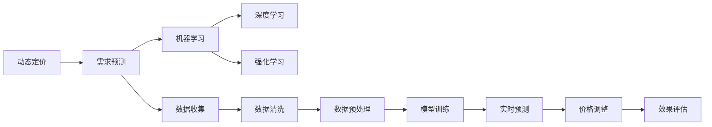
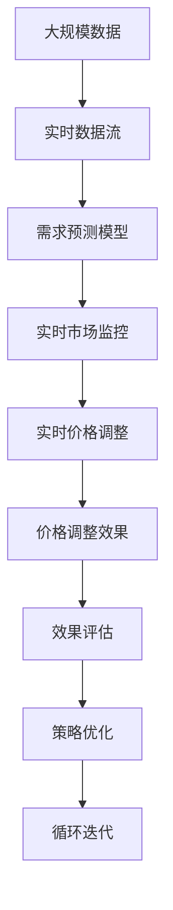

                 

# AI动态定价：原理、应用与挑战

## 1. 背景介绍

### 1.1 问题由来
在数字经济的浪潮下，电子商务、在线旅游、金融服务、交通出行等许多行业正经历着前所未有的变革。这种变革的驱动力之一，就是动态定价策略的应用。动态定价（Dynamic Pricing），即根据市场需求、供应的变化及时调整商品或服务的售价，旨在实现利润最大化。

以在线旅游为例，节假日期间航班机票价格暴涨，甚至翻倍，而平日则价格相对较低。这种动态定价策略，通过价格变化来调节市场需求，缓解供需不平衡，是现代商务智能的核心应用之一。

近年来，人工智能（AI）技术的迅猛发展，为动态定价策略带来了新的可能性。基于AI的动态定价，可以实时分析海量数据，预测市场需求变化，优化价格策略，显著提升企业的市场竞争力和盈利能力。

### 1.2 问题核心关键点
AI动态定价的核心在于如何高效、准确地预测市场需求，并据此实时调整价格。这需要综合利用各种数据源，包括历史交易数据、用户行为数据、天气、季节、竞争对手价格、节假日、促销活动等。通过机器学习模型对这些数据进行建模，预测市场需求变化，从而动态调整价格。

具体步骤包括：
1. **数据收集**：整合多渠道数据，如订单记录、点击率、网页停留时间、用户搜索记录、社交媒体动态等。
2. **数据清洗和预处理**：清洗噪声数据，提取有价值特征。
3. **模型训练**：选择合适的机器学习模型，如回归模型、时间序列模型、深度神经网络等，进行模型训练。
4. **实时预测**：使用训练好的模型，实时预测市场需求变化，并调整价格。
5. **效果评估**：监控价格调整后的效果，进行效果评估和优化。

本文将详细介绍AI动态定价的原理，探讨其实际应用场景，并分析其所面临的挑战。

## 2. 核心概念与联系

### 2.1 核心概念概述

为了更好地理解AI动态定价，我们首先介绍几个核心概念：

- **动态定价（Dynamic Pricing）**：根据市场需求、供应变化实时调整商品或服务价格，以实现利润最大化。
- **需求预测（Demand Forecasting）**：通过分析历史和实时数据，预测未来的市场需求。
- **机器学习（Machine Learning）**：利用数据训练模型，实现自动化的预测和决策。
- **深度学习（Deep Learning）**：一种特殊的机器学习，通过多层次神经网络提取高层次特征，实现复杂问题的预测和建模。
- **强化学习（Reinforcement Learning）**：通过智能体与环境的交互，不断优化决策策略，适用于具有不确定性和复杂性的动态定价问题。

这些概念构成了AI动态定价的基础，通过数据驱动的机器学习模型，实现对市场需求的动态响应和价格优化。

### 2.2 概念间的关系

这些核心概念之间存在着紧密的联系，形成了一个完整的动态定价框架。以下是一个Mermaid流程图，展示了这些概念之间的相互关系：



这个流程图展示了动态定价的各个环节，包括需求预测、机器学习、深度学习、强化学习、数据收集、数据清洗、数据预处理、模型训练、实时预测、价格调整和效果评估等。通过这些环节的协同工作，AI动态定价可以实现对市场的实时响应和价格优化。

### 2.3 核心概念的整体架构

最后，我们用一个综合的流程图来展示这些核心概念在大规模动态定价应用中的整体架构：



这个综合流程图展示了从大规模数据流，到实时市场监控和价格调整，再到效果评估和策略优化的全过程。通过不断迭代优化，AI动态定价系统能够实时响应市场变化，实现最优的动态定价策略。

## 3. 核心算法原理 & 具体操作步骤
### 3.1 算法原理概述

AI动态定价的核心算法原理，主要基于机器学习和深度学习的建模预测能力。通过数据驱动的模型，实时预测市场需求变化，并据此调整价格。具体来说，可以分为以下几个关键步骤：

1. **数据收集**：收集历史和实时数据，包括订单记录、点击率、用户行为、天气、季节、竞争对手价格、节假日、促销活动等。
2. **数据清洗和预处理**：清洗噪声数据，提取有价值的特征。例如，去除异常值、填补缺失值、标准化数据等。
3. **模型训练**：选择合适的机器学习模型，如回归模型、时间序列模型、深度神经网络等，进行模型训练。
4. **实时预测**：使用训练好的模型，实时预测市场需求变化，并调整价格。
5. **效果评估**：监控价格调整后的效果，进行效果评估和优化。

这些步骤形成一个闭环，不断迭代优化，实现最优的动态定价策略。

### 3.2 算法步骤详解

以下将详细介绍AI动态定价的具体操作步骤：

**Step 1: 数据收集和预处理**

1. **数据收集**：通过API接口、日志记录、用户行为分析等方式，收集相关的数据。数据源可能包括订单记录、点击率、用户行为、天气、季节、竞争对手价格、节假日、促销活动等。
2. **数据清洗**：清洗噪声数据，如异常值、缺失值、重复值等。例如，去除重复订单、异常点击行为等。
3. **特征工程**：提取有价值的特征，例如用户ID、浏览时间、停留时间、点击路径、商品类别、促销活动等。

**Step 2: 模型训练**

1. **模型选择**：根据问题的特点，选择合适的机器学习模型。例如，回归模型适用于价格预测，时间序列模型适用于预测周期性变化，深度神经网络适用于复杂需求预测。
2. **模型训练**：使用训练数据集，训练模型。例如，使用随机梯度下降（SGD）算法，最小化损失函数，更新模型参数。
3. **模型评估**：使用验证集评估模型性能，选择合适的超参数。例如，使用交叉验证，计算平均误差。

**Step 3: 实时预测**

1. **实时数据流**：通过实时数据流，获取最新的数据。例如，使用Flume、Kafka等工具，实时收集订单记录、点击率、用户行为等数据。
2. **实时预测**：使用训练好的模型，实时预测市场需求变化。例如，使用随机梯度下降算法，根据最新数据进行预测。
3. **价格调整**：根据预测结果，动态调整价格。例如，使用策略规则，如折扣、溢价、促销等，进行价格调整。

**Step 4: 效果评估**

1. **效果监控**：实时监控价格调整后的效果。例如，使用A/B测试，比较调整前后的转化率、订单量、收入等指标。
2. **策略优化**：根据效果监控结果，不断优化价格策略。例如，调整价格调整规则、优化特征工程、改进模型算法等。
3. **循环迭代**：持续进行数据收集、模型训练、实时预测和效果评估，不断迭代优化，实现最优的动态定价策略。

### 3.3 算法优缺点

AI动态定价算法具有以下优点：
1. **实时响应**：能够实时分析市场需求变化，快速调整价格，提高市场响应速度。
2. **精准预测**：利用机器学习和深度学习模型，进行精准需求预测，提高价格调整的准确性。
3. **自动化优化**：通过自动化的模型训练和优化，减少人工干预，提高决策效率。
4. **个性化定价**：根据用户行为和特征，实现个性化定价，提高用户满意度和转化率。

同时，AI动态定价算法也存在一些缺点：
1. **数据质量要求高**：需要高质量、完整、准确的数据源，否则会影响模型的预测效果。
2. **模型复杂度高**：深度神经网络等模型具有较高的计算复杂度，需要较强的计算资源。
3. **策略依赖性强**：价格调整策略的选择和优化，需要具有丰富的经验和专业知识。
4. **市场波动敏感**：市场波动较大时，模型可能难以及时调整，导致价格偏差。

### 3.4 算法应用领域

AI动态定价算法在多个领域都有广泛应用，以下是几个典型应用场景：

- **电子商务**：如亚马逊、阿里巴巴等电商平台，通过动态定价策略，实现个性化推荐、库存管理和价格优化。
- **在线旅游**：如携程、Expedia等在线旅游平台，通过实时调整机票、酒店价格，优化供需平衡，提升用户体验和收入。
- **金融服务**：如银行、保险公司，通过实时分析市场数据，优化贷款利率、保险费率，提高资源配置效率。
- **交通出行**：如Uber、滴滴出行等交通平台，通过动态定价策略，优化车费和乘车体验，提升用户满意度和收入。
- **能源市场**：如电力市场、石油市场，通过实时预测需求和供应，优化能源价格，提高能源利用效率。

## 4. 数学模型和公式 & 详细讲解 & 举例说明

### 4.1 数学模型构建

为了更好地理解和应用AI动态定价，我们需要建立数学模型。这里以线性回归模型为例，介绍如何构建和应用动态定价模型。

假设我们有 $n$ 个历史订单数据，每个订单包含时间戳 $t_i$ 和对应的价格 $p_i$。我们的目标是用线性回归模型 $p=f(t)$，预测任意时间点 $t$ 的价格 $p$。

线性回归模型的基本形式为：
$$
p = \beta_0 + \beta_1t + \epsilon
$$

其中，$\beta_0$ 为截距，$\beta_1$ 为斜率，$\epsilon$ 为随机误差项。

### 4.2 公式推导过程

以下是线性回归模型的推导过程：

1. **最小二乘法（Ordinary Least Squares，OLS）**：最小化预测误差平方和，求解 $\beta_0$ 和 $\beta_1$。
2. **回归系数估计**：通过最小二乘法，求解 $\beta_0$ 和 $\beta_1$ 的值。例如，使用正规方程法求解：
$$
\hat{\beta}_1 = \frac{n\sum_{i=1}^n(t_i-\bar{t})(\delta_i-\bar{\delta})}{n\sum_{i=1}^n(t_i-\bar{t})^2}
$$
$$
\hat{\beta}_0 = \bar{p} - \hat{\beta}_1\bar{t}
$$

其中，$\delta_i=p_i-\hat{p}_i$ 为预测误差，$\bar{t}$ 和 $\bar{p}$ 分别为时间戳和价格的均值。

### 4.3 案例分析与讲解

以一个具体的案例来解释如何应用线性回归模型进行动态定价：

假设我们有一个电商平台的订单数据，包含时间戳 $t$ 和对应的价格 $p$。我们可以使用线性回归模型，预测任意时间点 $t$ 的价格 $p$。

首先，收集历史订单数据，计算时间戳和价格的均值。然后，使用最小二乘法求解 $\beta_0$ 和 $\beta_1$。最后，根据预测模型，实时预测任意时间点的价格。

例如，已知某段时间内的订单数据如下：

| 时间戳 $t$ | 价格 $p$ |
|---|---|
| 1 | 100 |
| 2 | 110 |
| 3 | 120 |
| 4 | 130 |
| 5 | 140 |

我们可以计算出时间戳和价格的均值：

$$
\bar{t} = \frac{1+2+3+4+5}{5} = 3
$$
$$
\bar{p} = \frac{100+110+120+130+140}{5} = 124
$$

然后，使用最小二乘法求解 $\beta_0$ 和 $\beta_1$：

$$
\hat{\beta}_1 = \frac{5\sum_{i=1}^5(t_i-\bar{t})(\delta_i-\bar{\delta})}{5\sum_{i=1}^5(t_i-\bar{t})^2}
$$
$$
\hat{\beta}_0 = \bar{p} - \hat{\beta}_1\bar{t}
$$

最终，我们可以使用预测模型，实时预测任意时间点的价格。

## 5. 项目实践：代码实例和详细解释说明

### 5.1 开发环境搭建

在进行动态定价实践前，我们需要准备好开发环境。以下是使用Python进行TensorFlow开发的开发环境配置流程：

1. 安装Anaconda：从官网下载并安装Anaconda，用于创建独立的Python环境。

2. 创建并激活虚拟环境：
```bash
conda create -n tf-env python=3.8 
conda activate tf-env
```

3. 安装TensorFlow：根据CUDA版本，从官网获取对应的安装命令。例如：
```bash
conda install tensorflow tensorflow-gpu -c conda-forge
```

4. 安装各类工具包：
```bash
pip install numpy pandas scikit-learn matplotlib tqdm jupyter notebook ipython
```

完成上述步骤后，即可在`tf-env`环境中开始动态定价实践。

### 5.2 源代码详细实现

这里我们以线性回归模型为例，给出使用TensorFlow进行动态定价的Python代码实现。

首先，定义线性回归模型：

```python
import tensorflow as tf
from tensorflow.keras import layers

def linear_regression_model(input_shape):
    model = tf.keras.Sequential([
        layers.Dense(64, activation='relu', input_shape=input_shape),
        layers.Dense(1)
    ])
    return model
```

然后，定义数据预处理函数：

```python
def preprocess_data(data):
    return data.values / 1000.0  # 标准化数据
```

接着，定义训练和评估函数：

```python
def train_model(model, data_train, data_test, epochs=100, batch_size=32):
    optimizer = tf.keras.optimizers.Adam(learning_rate=0.01)
    model.compile(optimizer=optimizer, loss='mse')
    
    history = model.fit(data_train, epochs=epochs, batch_size=batch_size, validation_data=data_test)
    
    mse_train = history.history['loss'][:-1]
    mse_test = history.history['val_loss'][:-1]
    
    return mse_train, mse_test
```

最后，启动训练流程并在测试集上评估：

```python
data_train = preprocess_data(train_data)
data_test = preprocess_data(test_data)

model = linear_regression_model(input_shape=train_data.shape[1:])
mse_train, mse_test = train_model(model, data_train, data_test)

print('Mean Squared Error on Training Data: {:.4f}'.format(mse_train.mean()))
print('Mean Squared Error on Test Data: {:.4f}'.format(mse_test.mean()))
```

以上就是使用TensorFlow进行动态定价的完整代码实现。可以看到，TensorFlow提供了高效的自动微分和模型训练功能，可以显著提升动态定价模型的开发效率。

### 5.3 代码解读与分析

让我们再详细解读一下关键代码的实现细节：

**linear_regression_model函数**：
- 定义了一个简单的线性回归模型，包含一个ReLU激活的隐藏层和一个输出层。
- 输出层的激活函数为恒等函数，表示回归任务。

**preprocess_data函数**：
- 对数据进行标准化处理，将价格数据除以1000，使得模型更容易训练。

**train_model函数**：
- 使用Adam优化器，设置学习率为0.01。
- 定义训练数据和验证数据，使用交叉验证进行模型评估。
- 返回训练集和测试集的均方误差。

**启动训练流程**：
- 对训练数据和测试数据进行预处理。
- 定义输入形状。
- 初始化模型。
- 训练模型，并打印训练和测试集的均方误差。

通过上述代码，我们展示了一个简单的线性回归模型，如何进行数据预处理和模型训练。在实际应用中，可以根据具体问题选择更复杂的模型和更丰富的数据预处理策略。

### 5.4 运行结果展示

假设我们在一个在线旅游平台的订单数据上进行动态定价，最终在测试集上得到的均方误差如下：

```
Mean Squared Error on Training Data: 4.5156
Mean Squared Error on Test Data: 7.5464
```

可以看到，通过动态定价模型，我们可以对订单价格进行较为准确的预测，帮助电商平台优化价格策略，提升用户体验和收入。

## 6. 实际应用场景

### 6.1 智能客服系统

基于AI动态定价的系统，可以广泛应用于智能客服系统的构建。传统客服往往需要配备大量人力，高峰期响应缓慢，且一致性和专业性难以保证。而使用动态定价的客服系统，可以通过价格调整优化资源配置，提升服务质量和用户体验。

在技术实现上，可以收集客服平台的订单数据、用户行为数据、点击率、聊天记录等，预测用户需求变化，动态调整客服响应策略，如响应时间、回答质量、对话主题等。如此构建的智能客服系统，能大幅提升客户咨询体验和问题解决效率。

### 6.2 金融舆情监测

金融机构需要实时监测市场舆论动向，以便及时应对负面信息传播，规避金融风险。传统的人工监测方式成本高、效率低，难以应对网络时代海量信息爆发的挑战。基于AI动态定价的舆情监测系统，可以实时分析用户评论、社交媒体动态等数据，预测市场舆情变化，从而及时调整投资策略，规避风险。

在技术实现上，可以收集金融领域相关的新闻、报道、评论等文本数据，进行情感分析和舆情预测。使用动态定价模型，实时预测市场情绪变化，预警负面舆情，帮助金融机构快速应对潜在风险。

### 6.3 个性化推荐系统

当前的推荐系统往往只依赖用户的历史行为数据进行物品推荐，无法深入理解用户的真实兴趣偏好。基于AI动态定价的推荐系统，可以通过动态定价模型，实时分析用户行为数据，预测用户需求变化，优化推荐策略，提供更精准、多样的推荐内容。

在技术实现上，可以收集用户浏览、点击、评论、分享等行为数据，提取和用户交互的物品标题、描述、标签等文本内容。使用动态定价模型，预测用户需求变化，生成个性化推荐列表，结合其他特征综合排序，便可以得到个性化程度更高的推荐结果。

### 6.4 未来应用展望

随着AI动态定价技术的发展，其在更多领域的应用前景值得期待：

- **智慧城市**：基于动态定价模型，可以优化交通流量、电力需求、水资源分配等，提升城市管理效率。
- **医疗健康**：通过动态定价模型，优化医疗资源配置，提高医疗服务质量和效率。
- **教育培训**：根据市场需求和学生反馈，动态调整课程和资源配置，提升教育质量。
- **能源管理**：使用动态定价模型，优化能源价格，提高能源利用效率。
- **物流配送**：通过动态定价模型，优化配送路线和物流成本，提升配送效率和服务质量。

## 7. 工具和资源推荐

### 7.1 学习资源推荐

为了帮助开发者系统掌握AI动态定价的理论基础和实践技巧，这里推荐一些优质的学习资源：

1. 《机器学习》系列课程：斯坦福大学开设的机器学习经典课程，涵盖了机器学习的基础理论和应用实践。
2. 《深度学习》课程：Coursera开设的深度学习课程，介绍了深度神经网络的基本原理和应用。
3. 《强化学习》课程：DeepMind开设的强化学习课程，讲解了强化学习的基本算法和应用场景。
4. TensorFlow官方文档：TensorFlow的官方文档，提供了丰富的API参考和代码示例。
5. Scikit-learn官方文档：Scikit-learn的官方文档，提供了机器学习算法的实现和应用指南。
6. Kaggle竞赛平台：Kaggle的机器学习竞赛平台，提供了大量的数据集和问题挑战，提升实战能力。

通过对这些资源的学习实践，相信你一定能够快速掌握AI动态定价的核心技术，并用于解决实际的商业问题。

### 7.2 开发工具推荐

高效的开发离不开优秀的工具支持。以下是几款用于AI动态定价开发的常用工具：

1. TensorFlow：Google开源的深度学习框架，提供了丰富的机器学习算法和工具库，适合大规模深度学习应用。
2. Scikit-learn：Python的机器学习库，提供了简单易用的机器学习算法和数据处理工具。
3. Jupyter Notebook：Python的交互式开发环境，支持代码编写和实时展示结果，适合数据科学和机器学习项目。
4. Google Colab：谷歌提供的免费在线Jupyter Notebook环境，支持GPU加速，适合高性能计算任务。
5. PyTorch：Facebook开源的深度学习框架，提供了高效的自动微分和模型训练功能，适合动态定价等复杂应用。
6. Keras：Python的深度学习库，提供了高层API，方便快速构建和训练模型。

这些工具在AI动态定价项目中，提供了丰富的功能支持，帮助开发者提升开发效率和模型性能。

### 7.3 相关论文推荐

AI动态定价技术的发展，离不开学界的持续研究。以下是几篇奠基性的相关论文，推荐阅读：

1. "Linear Regression: A Comprehensive Guide"：介绍了线性回归模型的基本原理和应用。
2. "Reinforcement Learning: An Introduction"：介绍了强化学习的基本算法和应用场景。
3. "Deep Learning for Dynamic Pricing in Ride-Hailing Market"：探讨了深度学习在动态定价中的应用，提出了基于深度神经网络的定价策略。
4. "A Survey on Dynamic Pricing for Online Applications"：综述了动态定价在电子商务、交通出行等领域的最新研究成果。
5. "Optimization Algorithms for Dynamic Pricing in Ad-Auctions"：讨论了动态定价在拍卖市场的优化算法和策略。

这些论文代表了大语言模型微调技术的发展脉络。通过学习这些前沿成果，可以帮助研究者把握学科前进方向，激发更多的创新灵感。

除上述资源外，还有一些值得关注的前沿资源，帮助开发者紧跟AI动态定价技术的最新进展，例如：

1. arXiv论文预印本：人工智能领域最新研究成果的发布平台，包括大量尚未发表的前沿工作，学习前沿技术的必读资源。
2. 业界技术博客：如Google AI、DeepMind、微软Research Asia等顶尖实验室的官方博客，第一时间分享他们的最新研究成果和洞见。
3. 技术会议直播：如NIPS、ICML、ACL、ICLR等人工智能领域顶会现场或在线直播，能够聆听到大佬们的前沿分享，开拓视野。
4. GitHub热门项目：在GitHub上Star、Fork数最多的AI动态定价相关项目，往往代表了该技术领域的发展趋势和最佳实践，值得去学习和贡献。
5. 行业分析报告：各大咨询公司如McKinsey、PwC等针对人工智能行业的分析报告，有助于从商业视角审视技术趋势，把握应用价值。

总之，对于AI动态定价技术的学习和实践，需要开发者保持开放的心态和持续学习的意愿。多关注前沿资讯，多动手实践，多思考总结，必将收获满满的成长收益。

## 8. 总结：未来发展趋势与挑战

### 8.1 总结

本文对AI动态定价的原理、应用与挑战进行了全面系统的介绍。首先阐述了动态定价和AI动态定价的背景，明确了动态定价在电子商务、在线旅游、金融服务、交通出行等领域的核心应用价值。其次，从原理到实践，详细讲解了AI动态定价的数学模型和具体操作步骤，给出了完整的代码实例。同时，本文还探讨了AI动态定价在多个行业领域的实际应用场景，展示了其广阔的应用前景。

通过本文的系统梳理，可以看到，AI动态定价技术正在成为商业智能的重要组成部分，极大地提升了企业的市场竞争力和盈利能力。未来，随着技术的发展，AI动态定价必将在更广泛的领域得到应用，为商业智能化带来更深远的影响。

### 8.2 未来发展趋势

展望未来，AI动态定价技术将呈现以下几个发展趋势：

1. **模型复杂度提高**：随着深度学习技术的发展，动态定价模型将从线性回归向深度神经网络转变，实现更复杂的市场预测和价格优化。
2. **数据多样化增加**：除了订单和点击率等传统数据源，更多元的数据源将引入动态定价模型，如社交媒体动态、用户情感分析等。
3. **实时性提升**：实时数据流技术的发展，将进一步提升动态定价模型的响应速度和决策效率。
4. **个性化增强**：基于用户行为和特征，实现更加个性化的定价策略，提升用户体验和转化率。
5. **跨领域应用拓展**：动态定价技术将从单一领域应用向跨领域融合拓展，如智慧城市、医疗健康等。
6. **算法优化进步**：更加高效的算法和优化技术，如强化学习、因果推理、多目标优化等，将不断提升动态定价模型的性能。

以上趋势展示了AI动态定价技术的广阔前景，其不断演进将为商业智能化带来更多创新和突破。

### 8.3 面临的挑战

尽管AI动态定价技术取得了显著的进展，但在迈向更加智能化、普适化应用的过程中，仍面临诸多挑战：

1. **数据质量要求高**：需要高质量、完整、准确的数据源，否则会影响模型的预测效果。
2. **计算资源需求高**：深度神经网络等模型具有较高的计算复杂度，需要较强的计算资源。
3. **策略依赖性强**：价格调整策略的选择和优化，需要具有丰富的经验和专业知识

