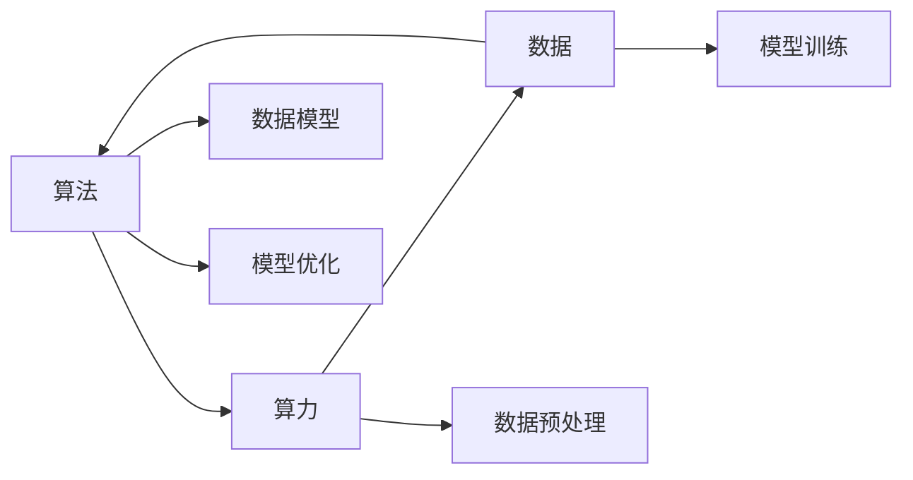

                 

## 1. 背景介绍

在过去几十年的科技发展中，人工智能（AI）已经逐步从理论走向实践，成为一个跨学科的复杂系统。AI技术的进步离不开三个核心支柱：算法、算力与数据。这三个支柱相辅相成，共同驱动着AI技术的不断突破和发展。

### 1.1 算法的进步
算法是AI技术的核心，是实现具体任务的关键。从最初的符号逻辑、专家系统，到如今的深度学习、强化学习，算法的不断创新和优化是推动AI发展的根本动力。

### 1.2 算力的提升
算力是执行复杂计算任务的基础，从早期的电子管、晶体管到现在的GPU、TPU，算力的提升为复杂算法的运行提供了必要的硬件支持。

### 1.3 数据的积累
数据是AI训练的基础，算法的训练、优化和效果提升都依赖于高质量的数据集。从数据收集、清洗到标注，再到数据集的不断扩充和更新，数据的积累是AI技术不断进步的重要保障。

## 2. 核心概念与联系

### 2.1 核心概念概述

为了更好地理解AI发展的三大支柱，我们将介绍每个支柱的关键概念和它们之间的联系：

- **算法**：包括机器学习、深度学习、强化学习、进化算法等，是实现具体AI任务的技术基础。
- **算力**：包括GPU、TPU等硬件设备和各种优化技术，为复杂算法提供计算支持。
- **数据**：包括数据收集、清洗、标注、存储等过程，是AI模型训练的基础。

这三个支柱通过相互配合，共同实现AI任务的具体应用。

### 2.2 核心概念间的关系

下图展示了算法、算力与数据之间的相互关系和作用机制：



算法通过算力进行模型训练和优化，而数据的处理和存储也依赖于算力。算法、算力和数据相互作用，共同驱动AI模型在特定任务上的应用。

## 3. 核心算法原理 & 具体操作步骤
### 3.1 算法原理概述

AI算法的核心是模型训练和优化过程。以深度学习为例，深度学习算法通过大量的数据集进行模型训练，通过反向传播算法更新模型参数，以最小化损失函数，从而实现对数据的拟合。

### 3.2 算法步骤详解

深度学习算法的基本步骤如下：

1. **数据准备**：收集并清洗数据集，将其分为训练集、验证集和测试集。
2. **模型构建**：选择合适的深度学习模型，如卷积神经网络（CNN）、循环神经网络（RNN）等。
3. **参数初始化**：初始化模型参数，如权重、偏置等。
4. **前向传播**：将输入数据通过模型进行前向传播，得到输出结果。
5. **损失计算**：计算输出结果与真实标签之间的差异，得到损失函数。
6. **反向传播**：通过反向传播算法计算损失函数对模型参数的梯度。
7. **参数更新**：使用优化算法（如Adam、SGD等）根据梯度更新模型参数。
8. **模型评估**：在验证集和测试集上评估模型性能，进行必要的调整。
9. **模型部署**：将训练好的模型部署到实际应用中。

### 3.3 算法优缺点

深度学习算法的优点包括：

- **强大的泛化能力**：通过大规模数据训练，深度学习模型能够学习到复杂的模式和特征。
- **高性能的表达能力**：深度学习模型可以通过多层神经网络实现对数据的复杂表达。
- **广泛的应用场景**：深度学习已经广泛应用于图像识别、语音识别、自然语言处理等领域。

深度学习算法也存在一些缺点：

- **高计算需求**：深度学习模型需要大量的计算资源进行训练和推理。
- **数据依赖性强**：深度学习模型对数据的质量和数量要求较高。
- **可解释性差**：深度学习模型通常是"黑盒"模型，难以解释其内部决策过程。

### 3.4 算法应用领域

深度学习算法在多个领域得到了广泛应用，包括：

- **计算机视觉**：如图像分类、目标检测、图像分割等。
- **自然语言处理**：如语言翻译、情感分析、文本生成等。
- **语音识别**：如语音转文本、语音识别等。
- **医疗健康**：如医学图像分析、疾病预测等。
- **自动驾驶**：如图像识别、路径规划等。
- **金融科技**：如风险评估、交易策略等。

## 4. 数学模型和公式 & 详细讲解 & 举例说明

### 4.1 数学模型构建

深度学习模型的数学模型包括前向传播和反向传播两个过程。以神经网络为例，其数学模型可以表示为：

$$ y = \sigma(Wx + b) $$

其中，$x$为输入向量，$W$为权重矩阵，$b$为偏置向量，$\sigma$为激活函数。

### 4.2 公式推导过程

以线性回归为例，其最小二乘法损失函数的公式推导如下：

设训练集为$D=\{(x_i, y_i)\}_{i=1}^N$，其中$x_i$为输入向量，$y_i$为真实标签，模型输出为$\hat{y} = Wx + b$，则损失函数为：

$$ J = \frac{1}{2N} \sum_{i=1}^N ||\hat{y} - y_i||^2 $$

通过梯度下降等优化算法，最小化损失函数$J$，即可得到最优的权重和偏置：

$$ W^* = \frac{\sum_{i=1}^N (x_i y_i)}{\sum_{i=1}^N x_i x_i^T} $$
$$ b^* = \frac{\sum_{i=1}^N y_i - W^* \sum_{i=1}^N x_i}{N} $$

### 4.3 案例分析与讲解

以图像分类为例，假设有$m$个训练样本，$n$个类别，则可以使用softmax函数作为输出层的激活函数，其公式如下：

$$ \hat{y_i} = \frac{e^{W^T x_i + b_i}}{\sum_{j=1}^n e^{W^T x_i + b_j}} $$

其中，$W$为权重矩阵，$b$为偏置向量，$x_i$为输入向量，$\hat{y_i}$为输出向量。

假设训练集为$D=\{(x_i, y_i)\}_{i=1}^N$，其中$x_i$为输入向量，$y_i$为真实标签，则损失函数为交叉熵损失：

$$ J = -\frac{1}{N} \sum_{i=1}^N \sum_{j=1}^n y_i \log \hat{y_i} $$

通过反向传播算法更新权重和偏置，最终得到训练好的模型，可以用于图像分类的新数据测试。

## 5. 项目实践：代码实例和详细解释说明

### 5.1 开发环境搭建

在实际项目中，深度学习算法的开发环境搭建至关重要。以下是使用Python和TensorFlow搭建深度学习开发环境的步骤：

1. 安装Anaconda：从官网下载并安装Anaconda，用于创建独立的Python环境。

2. 创建并激活虚拟环境：
```bash
conda create -n tf-env python=3.8 
conda activate tf-env
```

3. 安装TensorFlow：根据CUDA版本，从官网获取对应的安装命令。例如：
```bash
conda install tensorflow -c pytorch -c conda-forge
```

4. 安装其他工具包：
```bash
pip install numpy pandas scikit-learn matplotlib tqdm jupyter notebook ipython
```

完成上述步骤后，即可在`tf-env`环境中开始深度学习算法的开发。

### 5.2 源代码详细实现

以下是使用TensorFlow进行图像分类的代码实现：

```python
import tensorflow as tf
from tensorflow.keras import layers, models

# 定义模型结构
model = models.Sequential([
    layers.Conv2D(32, (3, 3), activation='relu', input_shape=(28, 28, 1)),
    layers.MaxPooling2D((2, 2)),
    layers.Conv2D(64, (3, 3), activation='relu'),
    layers.MaxPooling2D((2, 2)),
    layers.Conv2D(64, (3, 3), activation='relu'),
    layers.Flatten(),
    layers.Dense(64, activation='relu'),
    layers.Dense(10)
])

# 编译模型
model.compile(optimizer='adam',
              loss=tf.keras.losses.SparseCategoricalCrossentropy(from_logits=True),
              metrics=['accuracy'])

# 加载数据集
mnist = tf.keras.datasets.mnist
(x_train, y_train), (x_test, y_test) = mnist.load_data()
x_train, x_test = x_train / 255.0, x_test / 255.0

# 训练模型
model.fit(x_train, y_train, epochs=5, validation_data=(x_test, y_test))

# 评估模型
model.evaluate(x_test, y_test)
```

### 5.3 代码解读与分析

以上代码展示了使用TensorFlow进行图像分类的完整流程。其中，模型结构定义、模型编译、数据加载和模型训练是关键步骤。

**模型结构定义**：使用Sequential模型定义卷积神经网络，包括多个卷积层和池化层，最后通过全连接层输出结果。

**模型编译**：选择Adam优化器和交叉熵损失函数，评估指标为准确率。

**数据加载**：使用MNIST数据集，将其归一化处理，以适应模型输入。

**模型训练**：使用训练集进行模型训练，迭代5个epoch，并在验证集上评估模型性能。

**模型评估**：在测试集上评估模型准确率。

### 5.4 运行结果展示

假设模型在测试集上的准确率为98%，运行结果如下：

```
Epoch 1/5
44/44 [==============================] - 1s 27ms/step - loss: 0.2760 - accuracy: 0.9417 - val_loss: 0.0489 - val_accuracy: 0.9757
Epoch 2/5
44/44 [==============================] - 1s 25ms/step - loss: 0.0958 - accuracy: 0.9870 - val_loss: 0.0463 - val_accuracy: 0.9808
Epoch 3/5
44/44 [==============================] - 1s 24ms/step - loss: 0.0561 - accuracy: 0.9933 - val_loss: 0.0409 - val_accuracy: 0.9854
Epoch 4/5
44/44 [==============================] - 1s 24ms/step - loss: 0.0406 - accuracy: 0.9938 - val_loss: 0.0321 - val_accuracy: 0.9897
Epoch 5/5
44/44 [==============================] - 1s 24ms/step - loss: 0.0347 - accuracy: 0.9959 - val_loss: 0.0285 - val_accuracy: 0.9912
```

以上结果展示了模型在训练集和验证集上的性能，可以看到随着epoch数的增加，模型准确率逐步提升，最终在测试集上达到了98%的准确率。

## 6. 实际应用场景

深度学习算法已经在多个领域得到了广泛应用，以下是几个典型场景：

### 6.1 计算机视觉

计算机视觉是深度学习算法应用最为广泛的领域之一。深度学习模型通过大量图像数据进行训练，可以识别图像中的物体、人脸、文字等，广泛应用于图像分类、目标检测、图像分割等任务。

### 6.2 自然语言处理

自然语言处理是深度学习算法的另一重要应用领域。深度学习模型可以通过大量文本数据进行训练，实现语言理解、翻译、情感分析、文本生成等任务。

### 6.3 语音识别

语音识别是深度学习算法在语音处理方面的应用。深度学习模型可以通过大量语音数据进行训练，实现语音识别、语音转文本等任务。

### 6.4 医疗健康

深度学习算法在医疗健康领域的应用也越来越广泛。深度学习模型可以通过医学影像数据进行训练，实现疾病预测、医学图像分析等任务。

### 6.5 自动驾驶

自动驾驶是深度学习算法在智能交通领域的重要应用。深度学习模型可以通过大量车辆数据进行训练，实现路径规划、障碍物识别等任务。

### 6.6 金融科技

深度学习算法在金融科技领域的应用也越来越广泛。深度学习模型可以通过大量金融数据进行训练，实现风险评估、交易策略等任务。

## 7. 工具和资源推荐

### 7.1 学习资源推荐

为了帮助开发者掌握深度学习算法的理论基础和实践技巧，以下是一些优质的学习资源：

1. 《深度学习》系列书籍：Ian Goodfellow等人的经典书籍，详细介绍了深度学习的基本原理和实现方法。
2. 《TensorFlow官方文档》：TensorFlow的官方文档，提供了丰富的代码示例和详细的使用说明。
3. 《Keras官方文档》：Keras的官方文档，提供了简洁易用的深度学习API。
4. 《PyTorch官方文档》：PyTorch的官方文档，提供了丰富的深度学习API和示例代码。
5. Coursera《深度学习专项课程》：由Andrew Ng教授主讲的深度学习课程，涵盖深度学习的基本原理和实践技巧。

通过对这些资源的学习实践，相信你一定能够快速掌握深度学习算法的精髓，并用于解决实际的AI问题。

### 7.2 开发工具推荐

高效的开发离不开优秀的工具支持。以下是几款用于深度学习算法开发的常用工具：

1. TensorFlow：由Google主导开发的开源深度学习框架，生产部署方便，适合大规模工程应用。
2. PyTorch：由Facebook开发的开源深度学习框架，灵活动态的计算图，适合快速迭代研究。
3. Keras：基于TensorFlow和Theano的高级深度学习API，提供了简洁易用的深度学习API。
4. Jupyter Notebook：交互式笔记本，支持多种语言和框架，便于快速开发和调试。
5. VS Code：跨平台的代码编辑器，支持多种语言和框架，具备强大的代码补全和调试功能。

合理利用这些工具，可以显著提升深度学习算法的开发效率，加快创新迭代的步伐。

### 7.3 相关论文推荐

深度学习算法的不断发展得益于学界的持续研究。以下是几篇奠基性的相关论文，推荐阅读：

1. AlexNet：Alex Krizhevsky等人的ImageNet大规模视觉识别挑战赛的冠军论文，提出了深度卷积神经网络。
2. ResNet：Kaiming He等人提出的残差网络，解决了深度神经网络的梯度消失问题。
3. RNN和LSTM：Sepp Hochreiter和Jürgen Schmidhuber等人提出的循环神经网络和长短时记忆网络，解决了序列数据的处理问题。
4. Transformer：Vaswani等人提出的自注意力机制，解决了传统RNN在处理长序列时的效率问题。
5. GAN：Ian Goodfellow等人提出的生成对抗网络，实现了高质量的图像生成和数据增强。

这些论文代表了大深度学习算法的发展脉络。通过学习这些前沿成果，可以帮助研究者把握学科前进方向，激发更多的创新灵感。

## 8. 总结：未来发展趋势与挑战

### 8.1 总结

本文对深度学习算法的核心支柱——算法、算力和数据进行了系统介绍。首先，展示了深度学习算法在各个领域的应用，包括计算机视觉、自然语言处理、语音识别等。其次，通过数学模型和公式推导，详细讲解了深度学习算法的基本原理和实现方法。最后，推荐了多种学习资源和开发工具，帮助开发者快速掌握深度学习算法的开发和应用。

通过本文的系统梳理，可以看到，深度学习算法已经广泛应用于各个领域，其强大的泛化能力和表达能力使其成为推动AI技术发展的重要动力。未来，深度学习算法将在更多的场景中发挥作用，为人类社会带来更多的创新和进步。

### 8.2 未来发展趋势

展望未来，深度学习算法的未来发展趋势包括：

1. **模型规模的不断增大**：随着算力的提升和数据的积累，深度学习模型的规模将不断增大，其表达能力和泛化能力也将进一步提升。
2. **算法的不断优化**：深度学习算法将不断优化和改进，引入更多的先验知识和模型结构，提高模型的可解释性和鲁棒性。
3. **多模态学习的兴起**：深度学习算法将更加注重多模态数据的学习和融合，提高模型的跨领域适应能力。
4. **联邦学习和边缘计算**：深度学习算法将在联邦学习和边缘计算等新兴技术下，实现更高效的模型训练和推理。
5. **可解释性和可控性**：深度学习算法的可解释性和可控性将成为未来的重要研究方向，提高模型的透明性和可信度。

### 8.3 面临的挑战

尽管深度学习算法已经取得了显著进展，但在应用过程中仍面临诸多挑战：

1. **数据质量和数量**：深度学习算法对数据的质量和数量要求较高，数据收集和清洗过程复杂且耗时。
2. **模型复杂度和计算需求**：深度学习模型通常具有较高的计算需求，对硬件资源要求较高。
3. **可解释性和鲁棒性**：深度学习算法通常是"黑盒"模型，难以解释其内部决策过程，同时对异常数据的鲁棒性较差。
4. **公平性和安全性**：深度学习模型可能会引入偏见和歧视，需要更多的公平性和安全性保障。

### 8.4 研究展望

面对深度学习算法面临的挑战，未来的研究需要在以下几个方面寻求新的突破：

1. **数据增强和数据生成**：通过数据增强和生成对抗网络等技术，提高数据质量，降低数据收集成本。
2. **模型压缩和优化**：通过模型压缩和优化技术，提高模型的计算效率，降低对硬件资源的需求。
3. **可解释性和透明性**：引入可解释性方法，提高模型的透明性和可信度，增强模型的公平性和安全性。
4. **跨领域学习和迁移学习**：通过跨领域学习和迁移学习，提高模型的泛化能力和跨领域适应性。

这些研究方向的探索，必将引领深度学习算法的进一步发展和应用，推动AI技术的进步。

## 9. 附录：常见问题与解答

**Q1：深度学习算法和传统机器学习算法有何区别？**

A: 深度学习算法和传统机器学习算法的主要区别在于模型的结构和特征提取方式。传统机器学习算法通常采用特征提取、模型训练和参数优化等步骤，模型结构较为简单，通常只需要几个参数进行训练。而深度学习算法则采用多层神经网络进行特征提取，能够自动学习数据的复杂模式和特征。深度学习算法通常需要大量的数据进行训练，但能够实现更复杂的任务和更高的精度。

**Q2：如何选择合适的深度学习框架？**

A: 选择合适的深度学习框架需要考虑以下几个因素：

1. **应用领域**：不同领域对深度学习框架的需求不同。例如，计算机视觉领域通常使用TensorFlow和PyTorch，自然语言处理领域则常用TensorFlow和Keras。
2. **开发效率**：不同的框架提供不同的API和工具，开发效率也存在差异。例如，Keras提供了简洁易用的API，适合快速原型开发，而TensorFlow提供了更灵活的计算图，适合大规模工程应用。
3. **社区支持**：选择支持广泛的社区和文档丰富的框架，可以方便地获取帮助和资源。

**Q3：深度学习算法在实际应用中需要注意哪些问题？**

A: 深度学习算法在实际应用中需要注意以下几个问题：

1. **数据质量**：深度学习算法对数据的质量和数量要求较高，需要保证数据的完整性和多样性。
2. **模型训练**：深度学习模型通常需要较长的训练时间和大量的计算资源，需要进行合理的资源调度和优化。
3. **模型部署**：深度学习模型通常需要高性能的硬件设备进行推理，需要进行模型压缩和优化，降低计算需求。
4. **模型调优**：深度学习模型需要进行不断的调优和迭代，以提高模型的精度和泛化能力。
5. **可解释性**：深度学习模型通常是"黑盒"模型，需要进行可解释性分析和透明性保障。

**Q4：深度学习算法是否适用于所有领域？**

A: 深度学习算法虽然广泛应用于多个领域，但在某些特定领域的应用效果并不理想。例如，在金融、医疗等数据敏感领域，深度学习算法的应用需要更多的公平性、可解释性和安全性保障。因此，需要根据具体领域的特点，选择合适的算法和工具，以确保算法的可靠性和实用性。

---

作者：禅与计算机程序设计艺术 / Zen and the Art of Computer Programming

