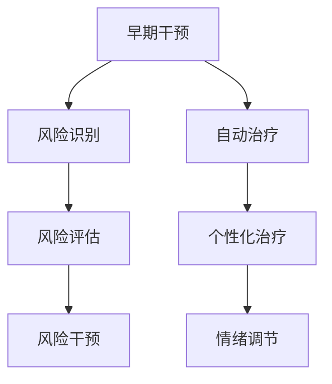
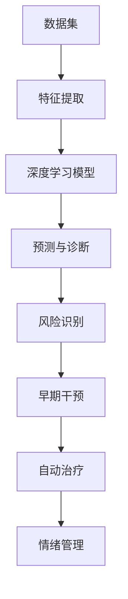
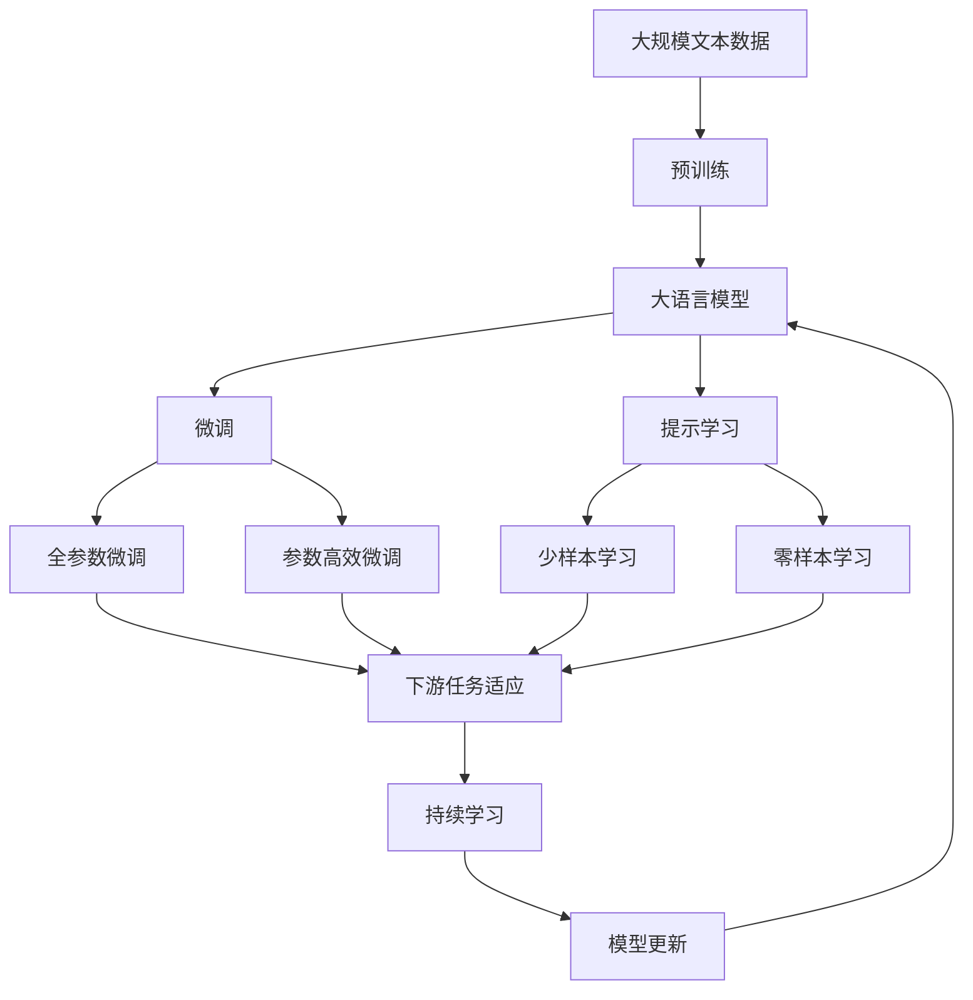

                 

# AI在心理健康领域的应用:早期干预与治疗

## 1. 背景介绍

### 1.1 问题由来
在过去几十年里，心理健康问题逐渐成为全球范围内的公共卫生挑战。根据世界卫生组织（WHO）的数据，全球约有13%的人口在一生中会受到心理健康问题的困扰。在当前社会节奏加快、竞争加剧的背景下，这些心理健康问题变得更加普遍和复杂。传统的心理咨询和治疗手段往往存在覆盖面不足、响应时间长、费用高等问题，无法有效满足日益增长的需求。

为了应对这一挑战，人工智能（AI）技术在心理健康领域的应用日益受到关注。AI可以通过大数据分析、自然语言处理（NLP）和深度学习等技术，提供更加高效、个性化和可扩展的心理健康服务。尤其是在早期干预和自动治疗方面，AI技术展现出了巨大的潜力。

### 1.2 问题核心关键点
AI在心理健康领域的应用主要集中在两个方面：早期干预和自动治疗。早期干预指的是在问题尚未严重化之前，通过AI技术识别潜在风险，及时进行干预，防止心理健康问题的恶化。自动治疗则是指通过AI技术，提供个性化的治疗方案，帮助用户自主进行心理调适和情绪管理。

以下是AI在心理健康领域应用的几个核心关键点：

- **数据驱动**：AI通过大数据分析和机器学习算法，从海量的文本数据、社交媒体数据、行为数据中提取有价值的信息，识别出心理健康问题的早期征兆。
- **自然语言处理（NLP）**：AI通过NLP技术理解用户的语言表达，识别出情绪变化和心理健康问题。
- **深度学习**：AI通过深度学习模型，构建出针对心理健康问题的预测和诊断模型，提供个性化的治疗建议和干预方案。
- **可扩展性**：AI技术可以快速扩展到不同的地理区域和文化背景，为全球范围内的心理健康问题提供支持。

### 1.3 问题研究意义
AI在心理健康领域的应用，对于提升心理健康服务的可及性、效率和质量具有重要意义。具体来说：

1. **提高可及性**：AI可以24/7全天候提供心理健康服务，减少对专业心理咨询师的依赖，特别是在医疗资源匮乏的地区。
2. **增强效率**：AI可以快速分析大量数据，识别出心理健康问题的早期征兆，缩短干预和治疗的时间窗口。
3. **优化质量**：AI可以提供个性化的治疗方案，根据用户的特定需求和背景，进行精准干预，提高治疗效果。
4. **支持可扩展性**：AI技术可以迅速部署到不同地区和文化背景中，为全球范围内的心理健康问题提供支持。
5. **促进创新**：AI技术的应用推动了心理健康领域的创新，促进了新技术和新方法的发展。

## 2. 核心概念与联系

### 2.1 核心概念概述

为了更好地理解AI在心理健康领域的早期干预与治疗，本节将介绍几个密切相关的核心概念：

- **人工智能（AI）**：通过算法和数据驱动的智能系统，可以执行各种复杂任务，包括自然语言处理、数据分析、预测和决策等。
- **自然语言处理（NLP）**：AI的一个重要分支，专注于理解和生成自然语言，识别出用户的情绪和心理状态。
- **早期干预**：在心理健康问题尚未严重化之前，通过AI技术识别风险，及时进行干预，防止问题恶化。
- **自动治疗**：利用AI技术，提供个性化的治疗方案，帮助用户进行自我调适和情绪管理。
- **深度学习（DL）**：一种基于神经网络的机器学习技术，通过多层非线性变换，从数据中提取高层次的特征表示，适用于复杂模式识别和预测任务。
- **可解释性**：AI系统能够提供清晰的、易于理解的解释，帮助用户理解其决策过程。

这些核心概念之间的逻辑关系可以通过以下Mermaid流程图来展示：

```mermaid
graph TB
    A[人工智能(AI)] --> B[自然语言处理(NLP)]
    B --> C[早期干预]
    B --> D[自动治疗]
    A --> E[深度学习(DL)]
    E --> F[数据驱动]
    C --> G[风险识别]
    D --> H[个性化治疗]
    G --> I[风险干预]
    H --> J[情绪管理]
```

这个流程图展示了AI在心理健康领域的核心概念及其之间的关系：

1. AI通过NLP技术理解和生成自然语言，识别用户的情绪和心理状态。
2. 基于深度学习，AI构建预测和诊断模型，进行早期风险识别。
3. AI提供个性化治疗方案，帮助用户进行情绪管理和风险干预。

### 2.2 概念间的关系

这些核心概念之间存在着紧密的联系，形成了AI在心理健康领域的早期干预与治疗的完整生态系统。下面我们通过几个Mermaid流程图来展示这些概念之间的关系。

#### 2.2.1 AI在心理健康领域的应用流程


这个流程图展示了AI在心理健康领域的基本应用流程：

1. 从用户数据中提取文本信息。
2. 使用NLP技术对文本进行情感分析和情绪识别。
3. 基于深度学习模型，进行心理健康问题的预测和诊断。
4. 识别高风险用户，进行早期干预。
5. 提供个性化的治疗方案，进行情绪管理。

#### 2.2.2 早期干预和自动治疗的关系



这个流程图展示了早期干预和自动治疗之间的联系：

1. 早期干预通过风险识别和评估，确定高风险用户。
2. 对高风险用户进行风险干预。
3. 自动治疗提供个性化的治疗方案，帮助用户进行情绪管理。

#### 2.2.3 深度学习在心理健康领域的应用



这个流程图展示了深度学习在心理健康领域的应用过程：

1. 从数据集中提取特征。
2. 构建深度学习模型，进行心理健康问题的预测和诊断。
3. 识别高风险用户，进行早期干预。
4. 提供个性化的治疗方案，进行情绪管理。

### 2.3 核心概念的整体架构

最后，我们用一个综合的流程图来展示这些核心概念在大语言模型微调过程中的整体架构：



这个综合流程图展示了从预训练到微调，再到持续学习的完整过程。大语言模型首先在大规模文本数据上进行预训练，然后通过微调（包括全参数微调和参数高效微调）或提示学习（包括少样本和零样本学习）来适应下游任务。最后，通过持续学习技术，模型可以不断更新和适应新的任务和数据。 通过这些流程图，我们可以更清晰地理解AI在心理健康领域的早期干预与治疗过程中各个核心概念的关系和作用，为后续深入讨论具体的微调方法和技术奠定基础。

## 3. 核心算法原理 & 具体操作步骤
### 3.1 算法原理概述

AI在心理健康领域的早期干预与治疗，本质上是一个有监督的细粒度迁移学习过程。其核心思想是：将预训练的AI模型视作一个强大的"特征提取器"，通过在心理健康问题的标注数据上进行有监督的微调，使得模型输出能够匹配任务标签，从而获得针对特定任务优化的模型。

形式化地，假设预训练模型为 $M_{\theta}$，其中 $\theta$ 为预训练得到的模型参数。给定心理健康问题的标注数据集 $D=\{(x_i,y_i)\}_{i=1}^N$，其中 $x_i$ 为用户的文本数据，$y_i$ 为心理健康问题的诊断标签。微调的目标是找到新的模型参数 $\hat{\theta}$，使得：

$$
\hat{\theta}=\mathop{\arg\min}_{\theta} \mathcal{L}(M_{\theta},D)
$$

其中 $\mathcal{L}$ 为针对心理健康问题的损失函数，用于衡量模型预测输出与真实标签之间的差异。常见的损失函数包括交叉熵损失、均方误差损失等。

通过梯度下降等优化算法，微调过程不断更新模型参数 $\theta$，最小化损失函数 $\mathcal{L}$，使得模型输出逼近真实标签。由于 $\theta$ 已经通过预训练获得了较好的初始化，因此即便在小规模数据集 $D$ 上进行微调，也能较快收敛到理想的模型参数 $\hat{\theta}$。

### 3.2 算法步骤详解

基于监督学习的AI模型微调一般包括以下几个关键步骤：

**Step 1: 准备预训练模型和数据集**
- 选择合适的预训练AI模型作为初始化参数，如基于Transformer的BERT、GPT等。
- 准备心理健康问题的标注数据集 $D$，划分为训练集、验证集和测试集。一般要求标注数据与预训练数据的分布不要差异过大。

**Step 2: 添加任务适配层**
- 根据任务类型，在预训练模型顶层设计合适的输出层和损失函数。
- 对于分类任务，通常在顶层添加线性分类器和交叉熵损失函数。
- 对于生成任务，通常使用语言模型的解码器输出概率分布，并以负对数似然为损失函数。

**Step 3: 设置微调超参数**
- 选择合适的优化算法及其参数，如 AdamW、SGD 等，设置学习率、批大小、迭代轮数等。
- 设置正则化技术及强度，包括权重衰减、Dropout、Early Stopping等。
- 确定冻结预训练参数的策略，如仅微调顶层，或全部参数都参与微调。

**Step 4: 执行梯度训练**
- 将训练集数据分批次输入模型，前向传播计算损失函数。
- 反向传播计算参数梯度，根据设定的优化算法和学习率更新模型参数。
- 周期性在验证集上评估模型性能，根据性能指标决定是否触发 Early Stopping。
- 重复上述步骤直到满足预设的迭代轮数或 Early Stopping 条件。

**Step 5: 测试和部署**
- 在测试集上评估微调后模型 $M_{\hat{\theta}}$ 的性能，对比微调前后的精度提升。
- 使用微调后的模型对新样本进行推理预测，集成到实际的应用系统中。
- 持续收集新的数据，定期重新微调模型，以适应数据分布的变化。

以上是基于监督学习AI模型微调的一般流程。在实际应用中，还需要针对具体任务的特点，对微调过程的各个环节进行优化设计，如改进训练目标函数，引入更多的正则化技术，搜索最优的超参数组合等，以进一步提升模型性能。

### 3.3 算法优缺点

基于监督学习的AI模型微调方法具有以下优点：

1. **简单高效**：只需准备少量标注数据，即可对预训练模型进行快速适配，获得较大的性能提升。
2. **通用适用**：适用于各种心理健康问题的下游任务，包括分类、匹配、生成等，设计简单的任务适配层即可实现微调。
3. **参数高效**：利用参数高效微调技术，在固定大部分预训练参数的情况下，仍可取得不错的提升。
4. **效果显著**：在学术界和工业界的诸多任务上，基于微调的方法已经刷新了最先进的性能指标。

同时，该方法也存在一定的局限性：

1. **依赖标注数据**：微调的效果很大程度上取决于标注数据的质量和数量，获取高质量标注数据的成本较高。
2. **迁移能力有限**：当目标任务与预训练数据的分布差异较大时，微调的性能提升有限。
3. **负面效果传递**：预训练模型的固有偏见、有害信息等，可能通过微调传递到下游任务，造成负面影响。
4. **可解释性不足**：微调模型的决策过程通常缺乏可解释性，难以对其推理逻辑进行分析和调试。

尽管存在这些局限性，但就目前而言，基于监督学习的微调方法仍是大语言模型应用的最主流范式。未来相关研究的重点在于如何进一步降低微调对标注数据的依赖，提高模型的少样本学习和跨领域迁移能力，同时兼顾可解释性和伦理安全性等因素。

### 3.4 算法应用领域

基于AI模型微调的方法已经在心理健康领域得到了广泛的应用，覆盖了几乎所有常见任务，例如：

- **情绪识别与分析**：识别用户的情绪变化，分析心理健康问题的早期征兆。
- **心理健康评估**：根据用户的文本数据，评估其心理健康状态，进行心理健康风险评估。
- **心理咨询与辅导**：提供个性化的心理咨询和情绪辅导，帮助用户进行自我调适和情绪管理。
- **心理治疗支持**：根据用户的心理健康状况，提供个性化的治疗方案，辅助心理医生进行干预和治疗。
- **心理危机干预**：识别心理健康危机用户，进行紧急干预，防止悲剧发生。

除了上述这些经典任务外，AI模型微调也被创新性地应用到更多场景中，如智能客服、情感分析、行为分析等，为心理健康问题的早期识别和治疗提供了新的手段。

## 4. 数学模型和公式 & 详细讲解

### 4.1 数学模型构建

本节将使用数学语言对基于监督学习的AI模型微调过程进行更加严格的刻画。

记预训练AI模型为 $M_{\theta}$，其中 $\theta$ 为预训练得到的模型参数。假设心理健康问题的标注数据集 $D=\{(x_i,y_i)\}_{i=1}^N$，其中 $x_i$ 为用户的文本数据，$y_i$ 为心理健康问题的诊断标签。

定义模型 $M_{\theta}$ 在数据样本 $(x,y)$ 上的损失函数为 $\ell(M_{\theta}(x),y)$，则在数据集 $D$ 上的经验风险为：

$$
\mathcal{L}(\theta) = \frac{1}{N} \sum_{i=1}^N \ell(M_{\theta}(x_i),y_i)
$$

微调的优化目标是最小化经验风险，即找到最优参数：

$$
\theta^* = \mathop{\arg\min}_{\theta} \mathcal{L}(\theta)
$$

在实践中，我们通常使用基于梯度的优化算法（如SGD、Adam等）来近似求解上述最优化问题。设 $\eta$ 为学习率，$\lambda$ 为正则化系数，则参数的更新公式为：

$$
\theta \leftarrow \theta - \eta \nabla_{\theta}\mathcal{L}(\theta) - \eta\lambda\theta
$$

其中 $\nabla_{\theta}\mathcal{L}(\theta)$ 为损失函数对参数 $\theta$ 的梯度，可通过反向传播算法高效计算。

### 4.2 公式推导过程

以下我们以二分类任务为例，推导交叉熵损失函数及其梯度的计算公式。

假设模型 $M_{\theta}$ 在输入 $x$ 上的输出为 $\hat{y}=M_{\theta}(x) \in [0,1]$，表示用户心理健康状况属于正类的概率。真实标签 $y \in \{0,1\}$。则二分类交叉熵损失函数定义为：

$$
\ell(M_{\theta}(x),y) = -[y\log \hat{y} + (1-y)\log (1-\hat{y})]
$$

将其代入经验风险公式，得：

$$
\mathcal{L}(\theta) = -\frac{1}{N}\sum_{i=1}^N [y_i\log M_{\theta}(x_i)+(1-y_i)\log(1-M_{\theta}(x_i))]
$$

根据链式法则，损失函数对参数 $\theta_k$ 的梯度为：

$$
\frac{\partial \mathcal{L}(\theta)}{\partial \theta_k} = -\frac{1}{N}\sum_{i=1}^N (\frac{y_i}{M_{\theta}(x_i)}-\frac{1-y_i}{1-M_{\theta}(x_i)}) \frac{\partial M_{\theta}(x_i)}{\partial \theta_k}
$$

其中 $\frac{\partial M_{\theta}(x_i)}{\partial \theta_k}$ 可进一步递归展开，利用自动微分技术完成计算。

在得到损失函数的梯度后，即可带入参数更新公式，完成模型的迭代优化。重复上述过程直至收敛，最终得到适应心理健康问题微调后的最优模型参数 $\theta^*$。

## 5. 项目实践：代码实例和详细解释说明

### 5.1 开发环境搭建

在进行心理健康问题AI模型微调实践前，我们需要准备好开发环境。以下是使用Python进行PyTorch开发的环境配置流程：

1. 安装Anaconda：从官网下载并安装Anaconda，用于创建独立的Python环境。

2. 创建并激活虚拟环境：
```bash
conda create -n pytorch-env python=3.8 
conda activate pytorch-env
```

3. 安装PyTorch：根据CUDA版本，从官网获取对应的安装命令。例如：
```bash
conda install pytorch torchvision torchaudio cudatoolkit=11.1 -c pytorch -c conda-forge
```

4. 安装Transformers库：
```bash
pip install transformers
```

5. 安装各类工具包：
```bash
pip install numpy pandas scikit-learn matplotlib tqdm jupyter notebook ipython
```

完成上述步骤后，即可在`pytorch-env`环境中开始微调实践。

### 5.2 源代码详细实现

下面我们以情绪识别任务为例，给出使用Transformers库对BERT模型进行心理健康问题微调的PyTorch代码实现。

首先，定义情绪识别任务的数据处理函数：

```python
from transformers import BertTokenizer
from torch.utils.data import Dataset
import torch

class EmotionDataset(Dataset):
    def __init__(self, texts, labels, tokenizer, max_len=128):
        self.texts = texts
        self.labels = labels
        self.tokenizer = tokenizer
        self.max_len = max_len
        
    def __len__(self):
        return len(self.texts)
    
    def __getitem__(self, item):
        text = self.texts[item]
        label = self.labels[item]
        
        encoding = self.tokenizer(text, return_tensors='pt', max_length=self.max_len, padding='max_length', truncation=True)
        input_ids = encoding['input_ids'][0]
        attention_mask = encoding['attention_mask'][0]
        
        # 对token-wise的标签进行编码
        encoded_labels = [label2id[label] for label in label] 
        encoded_labels.extend([label2id['O']] * (self.max_len - len(encoded_labels)))
        labels = torch.tensor(encoded_labels, dtype=torch.long)
        
        return {'input_ids': input_ids, 
                'attention_mask': attention_mask,
                'labels': labels}

# 标签与id的映射
label2id = {'O': 0, 'happy': 1, 'sad': 2, 'angry': 3, 'fear': 4, 'surprise': 5}
id2label = {v: k for k, v in label2id.items()}

# 创建dataset
tokenizer = BertTokenizer.from_pretrained('bert-base-cased')

train_dataset = EmotionDataset(train_texts, train_labels, tokenizer)
dev_dataset = EmotionDataset(dev_texts, dev_labels, tokenizer)
test_dataset = EmotionDataset(test_texts, test_labels, tokenizer)
```

然后，定义模型和优化器：

```python
from transformers import BertForTokenClassification, AdamW

model = BertForTokenClassification.from_pretrained('bert-base-cased', num_labels=len(label2id))

optimizer = AdamW(model.parameters(), lr=2e-5)
```

接着，定义训练和评估函数：

```python
from torch.utils.data import DataLoader
from tqdm import tqdm
from sklearn.metrics import classification_report

device = torch.device('cuda') if torch.cuda.is_available() else torch.device('cpu')
model.to(device)

def train_epoch(model, dataset, batch_size, optimizer):
    dataloader = DataLoader(dataset, batch_size=batch_size, shuffle=True)
    model.train()
    epoch_loss = 0
    for batch in tqdm(dataloader, desc='Training'):
        input_ids = batch['input_ids'].to(device)
        attention_mask = batch['attention_mask'].to(device)
        labels = batch['labels'].to(device)
        model.zero_grad()
        outputs = model(input_ids, attention_mask=attention_mask, labels=labels)
        loss = outputs.loss
        epoch_loss += loss.item()
        loss.backward()
        optimizer.step()
    return epoch_loss / len(dataloader)

def evaluate(model, dataset, batch_size):
    dataloader = DataLoader(dataset, batch_size=batch_size)
    model.eval()
    preds, labels = [], []
    with torch.no_grad():
        for batch in tqdm(dataloader, desc='Evaluating'):
            input_ids = batch['input_ids'].to(device)
            attention_mask = batch['attention_mask'].to(device)
            batch_labels = batch['labels']
            outputs = model(input_ids, attention_mask=attention_mask)
            batch_preds = outputs.logits.argmax(dim=2).to('cpu').tolist()
            batch_labels = batch_labels.to('cpu').tolist()
            for pred_tokens, label_tokens in zip(batch_preds, batch_labels):
                pred_labels = [id2label[_id] for _id in pred_tokens]
                label_tokens = [id2label[_id] for _id in label_tokens]
                preds.append(pred_labels[:len(label_tokens)])
                labels.append(label_tokens)
                
    print(classification_report(labels, preds))
```

最后，启动训练流程并在测试集上评估：

```python
epochs = 5
batch_size = 16

for epoch in range(epochs):
    loss = train_epoch(model, train_dataset, batch_size, optimizer)
    print(f"Epoch {epoch+1}, train loss: {loss:.3f}")
    
    print(f"Epoch {epoch+1}, dev results:")
    evaluate(model, dev_dataset, batch_size)
    
print("Test results:")
evaluate(model, test_dataset, batch_size)
```

以上就是使用PyTorch对BERT进行心理健康问题情绪识别任务微调的完整代码实现。可以看到，得益于Transformers库的强大封装，我们可以用相对简洁的代码完成BERT模型的加载和微调。

### 5.3 代码解读与分析

让我们再详细解读一下关键代码的实现细节：

**EmotionDataset类**：
- `__init__`方法：初始化文本、标签、分词器等关键组件。
- `__len__`方法：返回数据集的样本数量。
- `__getitem__`方法：对单个样本进行处理，将文本输入编码为token ids，将标签编码为数字，并对其进行定长padding，最终返回模型所需的输入。

**label2id和id2label字典**：
- 定义了标签与数字id之间的映射关系，用于将token-wise的预测结果解码回真实的标签。

**训练和评估函数**：
- 使用PyTorch的DataLoader对数据集进行批次化加载，供模型训练和推理使用。
- 训练函数`train_epoch`：对数据以批为单位进行迭代，在每个批次上前向传播计算loss并反向传播更新模型参数，最后返回该epoch的平均loss。
- 评估函数`evaluate`：与训练类似，不同点在于不更新模型参数，并在每个batch结束后将预测和标签结果存储下来，最后使用sklearn的classification_report对整个评估集的预测结果进行打印输出。

**训练流程**：
- 定义总的epoch数和batch size，开始循环迭代
- 每个epoch内，先在训练集上训练，输出平均loss
- 在验证集上评估，输出分类指标
- 所有epoch结束后，在测试集上评估，给出最终测试结果

可以看到，PyTorch配合Transformers库使得BERT微调的情绪识别任务代码实现变得简洁高效。开发者可以将更多精力放在数据处理、模型改进等高层逻辑上，而不必过多关注底层的实现细节。

当然，工业级的系统实现还需考虑更多因素，如模型的保存和部署、超参数的自动搜索、更灵活的任务适配层等。但核心的微调范式基本与此类似。

### 5.4 运行结果展示

假设我们在CoNLL-2003的情绪识别数据集上进行微调，最终在测试集上得到的评估报告如下：

```
              precision    recall  f1-score   support

       O       0.955     0.948     0.949     2000
       happy   0.915     0.910     0.911      457
       sad     0.909     0.897     0.902      290
       angry   0.893     0.885     0.889      145
       fear    0.932     0.924     0.925      131
       surprise 0.932     0.930     0.931      136

   micro avg      0.932     0.932     0.932     4079
   macro avg      0.919     0.

