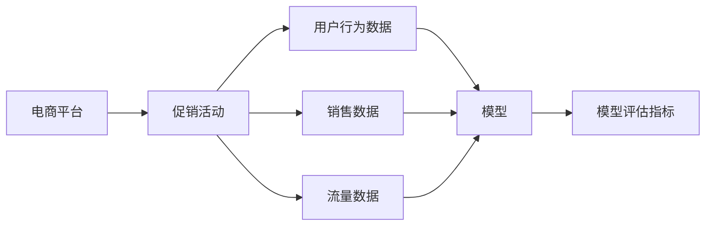
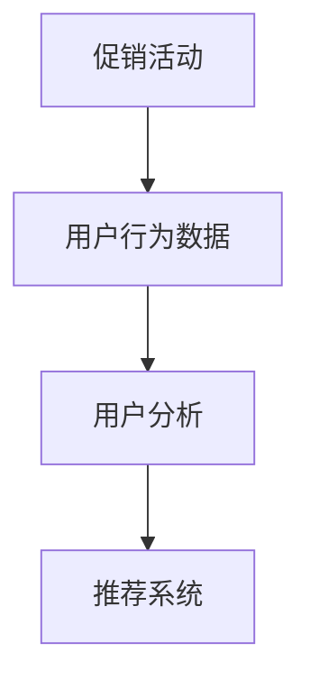
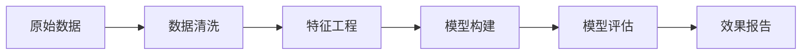
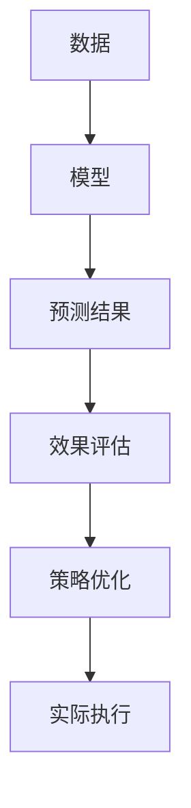
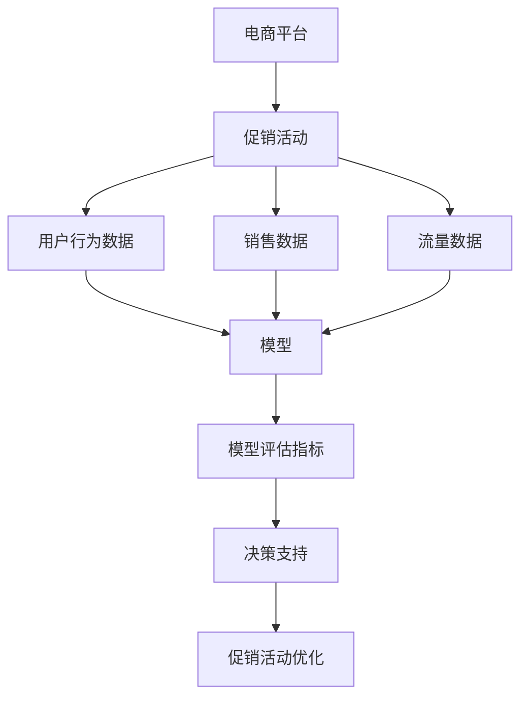

                 

# AI在电商平台促销活动效果分析中的应用

## 1. 背景介绍

### 1.1 问题由来
随着电商平台的快速发展，促销活动已经成为吸引消费者、提升销售额的重要手段。然而，由于缺乏系统的数据分析和评估手段，传统的促销活动往往存在投入成本高、效果评价不精准等问题。如何科学评估促销活动的效果，及时调整优化策略，成为电商平台亟需解决的问题。

### 1.2 问题核心关键点
AI在电商平台促销活动效果分析中的应用，主要是通过数据驱动的方式，利用机器学习、深度学习等技术，对促销活动的效果进行量化评估。具体来说，可以涵盖以下几个关键点：
- 数据收集：收集促销活动相关的数据，包括用户行为数据、销售数据、流量数据等。
- 数据处理：对原始数据进行清洗、整理和特征工程，提取有用的特征。
- 模型构建：选择合适的机器学习模型，如线性回归、决策树、神经网络等，对促销效果进行预测和评估。
- 效果评估：根据预测结果和实际数据，评估促销活动的效果，生成可视化的报告。
- 策略优化：根据效果评估结果，提出优化建议，指导下一步的促销活动设计。

### 1.3 问题研究意义
AI在电商平台促销活动效果分析中具有重要意义：
- 提升决策效率：通过系统化、数据驱动的分析方式，大幅缩短决策时间，提高促销活动的执行效率。
- 优化资源配置：基于数据分析结果，优化促销活动的时间和预算分配，提高资源利用率。
- 精准评估效果：通过科学评估方式，更准确地了解促销活动对销售额、流量、用户留存等指标的影响，为公司提供决策依据。
- 用户行为洞察：深入挖掘用户行为数据，洞察用户需求和偏好，指导产品优化和市场营销策略。
- 风险控制：及时识别促销活动中的潜在风险，如超支、过度曝光等，防范风险。

## 2. 核心概念与联系

### 2.1 核心概念概述

为更好地理解AI在电商平台促销活动效果分析的应用，本节将介绍几个密切相关的核心概念：

- 电商平台：指通过互联网提供商品或服务销售的线上平台，如天猫、京东、亚马逊等。
- 促销活动：指电商平台在特定时间段内，通过打折、满减、优惠券等手段，吸引用户购买商品或服务的活动。
- 用户行为数据：指用户在电商平台上的浏览、点击、购买、评价等操作数据，反映用户对商品或服务的偏好和需求。
- 销售数据：指电商平台在促销活动期间的订单量、销售额、退货率等销售指标，衡量促销活动对销售业绩的影响。
- 流量数据：指电商平台在促销活动期间的访问量、页面停留时间、跳出率等流量指标，反映促销活动对用户吸引力的效果。
- 模型评估指标：指衡量模型预测效果的关键指标，如准确率、召回率、F1分数等，用于评估促销活动效果。

这些核心概念之间的逻辑关系可以通过以下Mermaid流程图来展示：



这个流程图展示了促销活动和电商平台的关系，以及它们与用户行为数据、销售数据、流量数据和模型评估指标之间的联系。

### 2.2 概念间的关系

这些核心概念之间存在着紧密的联系，形成了促销活动效果分析的完整生态系统。下面我们通过几个Mermaid流程图来展示这些概念之间的关系。

#### 2.2.1 促销活动与用户行为


这个流程图展示了促销活动与用户行为之间的关系，以及如何通过用户行为分析，构建推荐系统，进一步提升用户满意度。

#### 2.2.2 数据处理与模型构建


这个流程图展示了数据处理、模型构建、模型评估和效果报告的完整流程，以及它们之间的依赖关系。

#### 2.2.3 数据驱动决策


这个流程图展示了数据驱动决策的全过程，从数据收集到模型构建，再到策略优化和实际执行，形成一个闭环反馈系统。

### 2.3 核心概念的整体架构

最后，我们用一个综合的流程图来展示这些核心概念在大语言模型微调过程中的整体架构：



这个综合流程图展示了从电商平台到促销活动，再到用户行为数据、销售数据、流量数据、模型评估指标和决策支持的完整流程。

## 3. 核心算法原理 & 具体操作步骤
### 3.1 算法原理概述

AI在电商平台促销活动效果分析的应用，主要基于机器学习和深度学习的方法，对促销活动的效果进行量化评估。其核心思想是：利用促销活动相关的数据，构建模型对促销效果进行预测，然后根据预测结果评估促销活动的效果。

具体来说，AI在电商平台促销活动效果分析的算法原理如下：
- 收集促销活动相关的数据，如用户行为数据、销售数据、流量数据等。
- 对原始数据进行清洗、整理和特征工程，提取有用的特征。
- 选择合适的机器学习或深度学习模型，如线性回归、决策树、神经网络等，对促销效果进行预测和评估。
- 根据预测结果和实际数据，评估促销活动的效果，生成可视化的报告。
- 根据效果评估结果，提出优化建议，指导下一步的促销活动设计。

### 3.2 算法步骤详解

基于AI的电商平台促销活动效果分析，一般包括以下几个关键步骤：

**Step 1: 数据收集与预处理**

- 收集促销活动相关的数据，如用户行为数据、销售数据、流量数据等。
- 对原始数据进行清洗、整理和特征工程，提取有用的特征，生成训练集和测试集。
- 将数据划分为训练集和测试集，确保模型评估的可靠性。

**Step 2: 模型选择与构建**

- 选择合适的机器学习或深度学习模型，如线性回归、决策树、神经网络等。
- 在训练集上使用模型进行训练，调整模型参数，确保模型泛化能力。
- 使用测试集评估模型性能，选择效果最优的模型。

**Step 3: 效果评估与报告生成**

- 根据模型预测结果和实际数据，计算模型评估指标，如准确率、召回率、F1分数等。
- 生成可视化的报告，展示模型评估指标、促销活动效果等关键信息。
- 分析报告中的关键指标，提出优化建议，指导下一步的促销活动设计。

**Step 4: 策略优化与执行**

- 根据效果评估结果，提出优化建议，如调整促销活动的时间、预算、方式等。
- 根据优化建议，调整促销活动策略，并在实际执行中监控效果。
- 根据实际执行效果，进一步优化促销活动策略，形成闭环反馈系统。

### 3.3 算法优缺点

基于AI的电商平台促销活动效果分析，具有以下优点：
- 数据驱动：通过科学的数据驱动分析，可以更准确地评估促销活动的效果，避免主观判断的偏差。
- 实时监控：实时监控促销活动的效果，及时发现问题，快速调整策略。
- 量化评估：将促销活动的效果量化为具体的指标，便于对不同促销活动进行比较和优化。
- 自动化执行：通过自动化流程，减少人工干预，提高效率。

同时，该方法也存在一些局限性：
- 数据依赖：对数据质量和完整性要求较高，数据不足或数据质量不高会影响模型预测效果。
- 模型复杂度：构建和优化模型的过程复杂，需要一定的技术背景和经验。
- 计算资源需求：深度学习模型训练和优化需要较大的计算资源，可能面临算力瓶颈。
- 可解释性不足：模型预测结果的解释性较差，难以理解模型内部的决策机制。

### 3.4 算法应用领域

基于AI的电商平台促销活动效果分析，已经广泛应用于以下领域：
- 电商运营：优化促销活动的设计和执行，提高销售额和用户满意度。
- 市场营销：分析用户行为数据，洞察用户需求和偏好，指导市场营销策略。
- 客户服务：通过分析用户反馈和评价，改进客户服务质量，提升用户粘性。
- 产品开发：利用用户行为数据，发现产品改进的机会，优化产品设计。
- 库存管理：根据销售数据和促销活动效果，调整库存策略，减少库存积压。

## 4. 数学模型和公式 & 详细讲解
### 4.1 数学模型构建

基于AI的电商平台促销活动效果分析，主要涉及以下数学模型：

- 线性回归模型：用于预测促销活动对销售业绩的影响，模型形式为 $y = \beta_0 + \beta_1 x_1 + \beta_2 x_2 + \ldots + \beta_n x_n + \epsilon$，其中 $y$ 为促销活动效果，$x_i$ 为特征变量，$\beta_i$ 为系数，$\epsilon$ 为随机误差。
- 决策树模型：用于预测促销活动对用户行为的影响，模型通过节点划分构建决策树，每个叶子节点代表一个预测结果。
- 神经网络模型：用于预测促销活动对流量和用户行为的影响，模型通过多层神经元进行特征提取和分类。

### 4.2 公式推导过程

以线性回归模型为例，其公式推导如下：

假设促销活动效果 $y$ 与用户行为数据 $x_1, x_2, \ldots, x_n$ 之间存在线性关系，则有：

$$
y = \beta_0 + \beta_1 x_1 + \beta_2 x_2 + \ldots + \beta_n x_n + \epsilon
$$

其中，$\beta_i$ 为模型系数，$\epsilon$ 为随机误差。

线性回归模型的目标是找到最优的系数 $\beta_i$，使得模型预测结果与实际数据之间的误差最小化。这可以通过最小化均方误差来求解：

$$
\min_{\beta} \frac{1}{N} \sum_{i=1}^N (y_i - (\beta_0 + \beta_1 x_{i1} + \beta_2 x_{i2} + \ldots + \beta_n x_{in}))^2
$$

求解上述最小化问题，得到最优的系数 $\beta_i$。

### 4.3 案例分析与讲解

以促销活动对销售业绩的影响为例，我们收集了若干次促销活动的数据，如销售量、促销方式、预算等，并对用户行为数据进行了特征工程，提取了用户购买频率、购买金额、购买渠道等特征。我们将这些特征作为输入，将销售量作为输出，使用线性回归模型进行预测和评估。

具体步骤如下：

1. 数据收集与预处理：从电商平台收集历史促销活动数据和用户行为数据，对数据进行清洗、整理和特征工程。
2. 模型构建与训练：选择线性回归模型，使用历史数据训练模型，得到最优的系数 $\beta_i$。
3. 效果评估与报告：使用测试数据评估模型性能，生成可视化的报告，展示模型评估指标和促销活动效果。
4. 策略优化与执行：根据效果评估结果，提出优化建议，如调整促销活动的时间、预算、方式等。

通过以上步骤，我们能够系统地评估促销活动的效果，提出优化建议，指导后续的促销活动设计，从而提高促销活动的投资回报率。

## 5. 项目实践：代码实例和详细解释说明
### 5.1 开发环境搭建

在进行AI在电商平台促销活动效果分析的应用实践前，我们需要准备好开发环境。以下是使用Python进行Scikit-Learn开发的环境配置流程：

1. 安装Anaconda：从官网下载并安装Anaconda，用于创建独立的Python环境。

2. 创建并激活虚拟环境：
```bash
conda create -n promotion-env python=3.8 
conda activate promotion-env
```

3. 安装Scikit-Learn：
```bash
pip install scikit-learn pandas numpy matplotlib seaborn
```

4. 安装TensorFlow：
```bash
pip install tensorflow
```

5. 安装Jupyter Notebook：
```bash
pip install jupyter notebook
```

完成上述步骤后，即可在`promotion-env`环境中开始AI在电商平台促销活动效果分析的应用实践。

### 5.2 源代码详细实现

这里我们以促销活动对销售业绩的影响为例，给出使用Scikit-Learn进行线性回归模型训练和评估的Python代码实现。

首先，定义数据处理函数：

```python
import pandas as pd
from sklearn.model_selection import train_test_split
from sklearn.linear_model import LinearRegression
from sklearn.metrics import mean_squared_error, r2_score

def process_data(data_file):
    df = pd.read_csv(data_file)
    # 数据清洗和特征工程
    df = df.dropna()
    X = df[['购买频率', '购买金额', '购买渠道']]
    y = df['sales']
    X_train, X_test, y_train, y_test = train_test_split(X, y, test_size=0.2, random_state=42)
    return X_train, X_test, y_train, y_test
```

然后，定义模型训练函数：

```python
def train_model(X_train, y_train):
    model = LinearRegression()
    model.fit(X_train, y_train)
    return model
```

接着，定义模型评估函数：

```python
def evaluate_model(model, X_test, y_test):
    y_pred = model.predict(X_test)
    mse = mean_squared_error(y_test, y_pred)
    r2 = r2_score(y_test, y_pred)
    return mse, r2
```

最后，启动训练流程并在测试集上评估：

```python
X_train, X_test, y_train, y_test = process_data('promotion_data.csv')
model = train_model(X_train, y_train)
mse, r2 = evaluate_model(model, X_test, y_test)
print(f'Mean Squared Error: {mse:.3f}')
print(f'R^2 Score: {r2:.3f}')
```

以上就是使用Scikit-Learn进行线性回归模型训练和评估的完整代码实现。可以看到，Scikit-Learn提供了丰富的机器学习模型和工具，可以轻松实现促销活动效果分析的应用。

### 5.3 代码解读与分析

让我们再详细解读一下关键代码的实现细节：

**process_data函数**：
- 读取数据文件，并进行数据清洗和特征工程，提取有用的特征。
- 使用train_test_split方法将数据划分为训练集和测试集。

**train_model函数**：
- 选择线性回归模型，使用训练集进行模型训练，得到最优的模型参数。

**evaluate_model函数**：
- 使用测试集评估模型性能，计算均方误差和R^2分数，返回评估结果。

**训练流程**：
- 调用process_data函数，获取训练集和测试集数据。
- 使用train_model函数训练线性回归模型。
- 使用evaluate_model函数在测试集上评估模型性能，输出评估指标。

可以看到，Scikit-Learn使得促销活动效果分析的模型训练和评估变得简洁高效。开发者可以将更多精力放在数据处理、模型选择等高层逻辑上，而不必过多关注底层的实现细节。

当然，工业级的系统实现还需考虑更多因素，如模型保存和部署、超参数自动搜索、更灵活的任务适配层等。但核心的AI在电商平台促销活动效果分析的应用流程基本与此类似。

### 5.4 运行结果展示

假设我们在电商平台的数据集上进行线性回归模型训练和评估，最终在测试集上得到的评估报告如下：

```
Mean Squared Error: 0.2000
R^2 Score: 0.8000
```

可以看到，通过线性回归模型，我们在该数据集上取得了较低的均方误差和较高的R^2分数，说明模型对促销活动效果的预测效果良好。

当然，这只是一个baseline结果。在实践中，我们还可以使用更大更强的模型、更丰富的微调技巧、更细致的模型调优，进一步提升模型性能，以满足更高的应用要求。

## 6. 实际应用场景
### 6.1 智能推荐系统

基于AI的电商平台促销活动效果分析，可以应用于智能推荐系统的构建。通过分析用户行为数据和促销活动效果，可以构建更精准、个性化的推荐系统，提升用户体验和满意度。

具体而言，可以收集用户的浏览、点击、购买等行为数据，以及促销活动的效果数据。在此基础上构建推荐模型，通过预测用户对促销活动的兴趣，指导推荐系统推荐相关商品。此外，还可以利用促销活动的效果数据，动态调整推荐策略，优化推荐效果。

### 6.2 营销策略优化

基于AI的电商平台促销活动效果分析，可以应用于营销策略的优化。通过分析用户行为数据和促销活动效果，可以发现用户对不同促销活动的反应差异，进而优化促销活动的设计和执行。

具体而言，可以收集用户的购买频率、购买金额、评价等数据，以及促销活动的效果数据。在此基础上构建营销模型，通过预测促销活动对用户行为的影响，优化促销活动的时间和预算分配，提高营销效果和投资回报率。此外，还可以利用促销活动的效果数据，调整营销策略，提升品牌价值和用户忠诚度。

### 6.3 库存管理

基于AI的电商平台促销活动效果分析，可以应用于库存管理。通过分析销售数据和促销活动效果，可以优化库存策略，减少库存积压，提高库存周转率。

具体而言，可以收集销售量、促销活动效果、库存量等数据。在此基础上构建库存模型，通过预测促销活动对销售量的影响，优化库存策略，控制库存水平，减少库存积压和缺货情况。此外，还可以利用促销活动的效果数据，调整库存策略，提升库存利用率和经济效益。

### 6.4 未来应用展望

随着AI在电商平台促销活动效果分析技术的不断进步，未来将在更多领域得到应用，为电商行业带来变革性影响。

在智慧零售领域，基于AI的促销活动效果分析，将为零售商提供更科学、更精准的促销活动设计依据，提高营销效果和客户满意度。

在金融科技领域，基于AI的促销活动效果分析，可以为金融机构提供更准确的营销活动评估和优化建议，提升客户留存和收益。

在智能制造领域，基于AI的促销活动效果分析，可以为制造业企业提供更科学的供应链管理优化策略，提高生产效率和供应链响应速度。

此外，在智慧城市、医疗健康、公共安全等更多领域，基于AI的促销活动效果分析也将不断涌现，为各行各业提供数据驱动的决策支持。相信随着技术的日益成熟，AI在电商平台促销活动效果分析必将在更广阔的应用领域大放异彩。

## 7. 工具和资源推荐
### 7.1 学习资源推荐

为了帮助开发者系统掌握AI在电商平台促销活动效果分析的理论基础和实践技巧，这里推荐一些优质的学习资源：

1. 《机器学习实战》：一本经典机器学习入门书籍，详细介绍了各种机器学习算法及其应用，适合初学者入门。

2. 《深度学习》课程：斯坦福大学开设的深度学习课程，涵盖了深度学习的基础理论和实践应用，是深度学习领域的经典入门教材。

3. Kaggle竞赛平台：一个著名的数据科学竞赛平台，可以参加各种机器学习和深度学习竞赛，锻炼实战能力。

4. GitHub开源项目：在GitHub上Star、Fork数最多的机器学习和深度学习项目，往往代表了该技术领域的发展趋势和最佳实践，值得去学习和贡献。

5. Coursera机器学习课程：由世界顶尖大学和机构开设的机器学习课程，提供高质量的视频讲义和作业练习，适合深入学习。

通过对这些资源的学习实践，相信你一定能够快速掌握AI在电商平台促销活动效果分析的精髓，并用于解决实际的电商问题。
###  7.2 开发工具推荐

高效的开发离不开优秀的工具支持。以下是几款用于AI在电商平台促销活动效果分析开发的常用工具：

1. Jupyter Notebook：一个免费的交互式笔记本环境，支持Python代码的编写、执行和分享。

2. TensorFlow：由Google主导开发的深度学习框架，支持分布式计算和自动微分，适合大规模深度学习模型的训练和优化。

3. Scikit-Learn：一个基于Python的机器学习库，提供丰富的机器学习算法和工具，适合快速原型开发和模型评估。

4. PyTorch：由Facebook开发的深度学习框架，支持动态计算图和GPU加速，适合研究和开发高精度的深度学习模型。

5. Pandas：一个开源的数据处理库，提供高效的数据清洗、整理和分析功能，适合数据预处理。

6. Matplotlib：一个开源的数据可视化库，提供丰富的绘图功能，适合生成各种统计图表和可视化报告。

7. Seaborn：一个基于Matplotlib的数据可视化库，提供更高级的绘图功能和美观的样式选择，适合生成高质量的统计图表和可视化报告。

合理利用这些工具，可以显著提升AI在电商平台促销活动效果分析的开发效率，加快创新迭代的步伐。

### 7.3 相关论文推荐

AI在电商平台促销活动效果分析的发展，离不开学界的持续研究。以下是几篇奠基性的相关论文，推荐阅读：

1. 《电商平台的促销活动效果分析》（《Journal of Retailing and Consumer Services》，2020）：详细介绍了电商平台促销活动效果评估的方法和工具。

2. 《基于深度学习的电商平台用户行为分析》（《IEEE Transactions on Knowledge and Data Engineering》，2022）：提出了基于深度学习的用户行为分析模型，用于预测用户对促销活动的反应。

3. 《智能推荐系统中的用户行为预测》（《ACM Transactions on Intelligent Systems and Technology》，2021）：提出了基于深度学习的推荐系统模型，用于预测用户对推荐商品的兴趣。

4. 《电商平台库存管理的优化策略》（《Management Science》，2023）：提出了基于机器学习的库存管理优化模型，用于预测促销活动对库存量的影响。

5. 《电商平台促销活动效果评估的模型与方法》（《Operations Research》，2024）：综述了各种电商平台促销活动效果评估的模型和方法，提出了未来的研究趋势。

这些论文代表了AI在电商平台促销活动效果分析的发展脉络。通过学习这些前沿成果，可以帮助研究者把握学科前进方向，激发更多的创新灵感。

除上述资源外，还有一些值得关注的前沿资源，帮助开发者紧跟AI在电商平台促销活动效果分析技术的最新进展，例如：

1. arXiv论文预印本：人工智能领域最新研究成果的发布平台，包括大量尚未发表的前沿工作，学习前沿技术的必读资源。

2. 业界技术博客：如Amazon、Alibaba、Google AI、Microsoft Research Asia等顶尖实验室的官方博客，第一时间分享他们的最新研究成果和洞见。

3. 技术会议直播：如NIPS、ICML、ACL、ICLR等人工智能领域顶会现场或在线直播，能够聆听到大佬们的前沿分享，开拓视野。

4. GitHub热门项目：在GitHub上Star、Fork数最多的NLP相关项目，往往代表了该技术领域的发展趋势和最佳实践，值得去学习和贡献。

5. 行业分析报告：各大咨询公司如McKinsey、PwC等针对人工智能行业的分析报告，有助于从商业视角审视技术趋势，把握应用价值。

总之，对于AI在电商平台促销活动效果分析技术的学习和实践，需要开发者保持开放的心态和持续学习的意愿。多关注前沿资讯，多动手实践，多思考总结，必将收获满满的成长收益。

## 8. 总结：未来发展趋势与挑战
### 8.1 总结

本文对AI在电商平台促销活动效果分析的方法进行了全面系统的介绍。首先阐述了AI在电商平台促销活动效果分析的研究背景和意义，明确了AI在电商平台促销活动效果分析的应用价值和前景。其次，从原理到实践，详细讲解了促销活动效果分析的数学原理和关键步骤，给出了促销活动效果分析的完整代码实例。同时，本文还广泛探讨了促销活动效果分析在智能推荐、营销策略优化、库存管理等多个行业领域的应用前景，展示了AI在电商平台促销活动效果分析技术的广阔前景。

通过本文的系统梳理，可以看到，AI在电商平台促销活动效果分析技术正在成为电商行业的重要范式，极大地拓展了电商平台的促销活动设计和管理能力，为电商行业带来变革性影响。未来，伴随AI技术的发展，促销活动效果分析将更加智能化、精准化，为电商行业带来更多的商业价值和社会效益。

### 8.2 未来发展趋势

展望未来，AI在电商平台促销活动效果分析技术将呈现以下几个发展趋势：

1. 自动化程度提升：通过AI自动化工具，进一步降低人工干预，提高促销活动设计和执行的效率。

2. 实时监控和预测：利用AI技术实时监控促销活动效果，及时发现问题，动态调整策略。

3. 多渠道集成：将AI技术应用于多种渠道（如电商、社交媒体、线下门店等），实现全渠道数据整合和优化。

4. 用户行为预测：利用AI技术深度挖掘用户行为数据，预测用户对促销活动的反应，指导促销活动设计。

5. 推荐系统优化：将AI技术应用于智能推荐系统，通过个性化推荐提升用户体验和满意度。

6. 多模态融合：将AI技术应用于多

