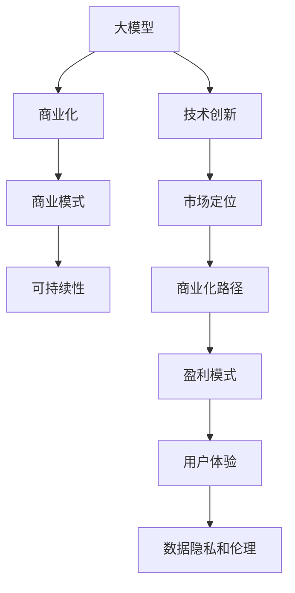

                 

# AI大模型创业：如何构建未来可持续的商业模式？

> 关键词：人工智能创业、大模型、商业化、商业模式、可持续性

## 1. 背景介绍

### 1.1 问题由来

随着人工智能（AI）技术的迅猛发展，大模型（如GPT-3、BERT等）正逐渐成为企业和创业公司创新的新引擎。在技术突破和市场需求的双重驱动下，AI大模型创业机会增多，吸引大量资本和人才涌入。然而，成功的AI大模型创业公司需要解决诸多挑战，包括技术创新、市场策略、商业化路径、盈利模式等。本文将探讨如何在创业初期就构建一个可持续发展的商业模式，助力企业长远发展。

### 1.2 问题核心关键点

成功的AI大模型商业模式需关注以下核心关键点：

1. **技术创新**：大模型需具备技术领先优势，具备稳定迭代和创新能力。
2. **市场定位**：准确理解目标用户和市场需求，提供具有市场竞争力的解决方案。
3. **商业化路径**：构建从实验室到市场的桥梁，形成稳定的收入模式。
4. **盈利模式**：设计合理的盈利模型，实现长期盈利和可持续发展。
5. **用户体验**：提供优质的用户界面和服务，增强用户粘性和满意度。
6. **数据隐私和伦理**：严格遵守数据隐私法律法规，确保模型伦理使用。

### 1.3 问题研究意义

研究AI大模型的商业模式，对于AI创业公司成功落地应用、提升市场竞争力、实现盈利和可持续发展具有重要意义：

1. **加速技术落地**：明确技术路径和应用场景，快速验证市场需求。
2. **增强市场竞争力**：确立竞争优势，抢占市场先机。
3. **确保长期盈利**：形成稳定收入流，保障企业可持续发展。
4. **提升用户体验**：通过技术和服务创新，提升用户满意度和忠诚度。
5. **促进社会进步**：负责任地使用AI技术，推动社会进步和可持续发展。

## 2. 核心概念与联系

### 2.1 核心概念概述

要构建一个成功的AI大模型商业模式，首先需要理解几个核心概念及其相互联系：

- **大模型（Large Language Model, LLM）**：基于Transformer架构的预训练语言模型，具备强大的语言理解和生成能力，广泛应用于NLP任务。
- **商业化（Commercialization）**：将技术转化为市场产品和服务的过程，包括产品设计、市场推广、销售渠道等。
- **商业模式（Business Model）**：企业在市场中的经营策略和盈利模式，包括产品定价、市场定位、用户需求等。
- **可持续性（Sustainability）**：企业运营模式能够长期、稳定、可持续地提供服务，实现经济、环境和社会的多重目标。

这些概念之间存在紧密的联系，构成了AI大模型创业的关键要素。通过理解这些核心概念，可以更好地设计商业策略，促进模型落地应用。

### 2.2 概念间的关系

通过Mermaid流程图，我们可以直观展示这些核心概念之间的联系：



这个流程图展示了从技术到商业的整个过程，以及各个环节对最终商业成功的关键作用。

## 3. 核心算法原理 & 具体操作步骤

### 3.1 算法原理概述

AI大模型的商业化涉及到多个环节，包括市场调研、产品设计、营销推广、用户反馈等。其核心算法原理可概述如下：

1. **技术调研和评估**：评估技术成熟度和市场需求，选择适合的大模型和应用场景。
2. **市场细分和定位**：根据目标用户群体的需求和习惯，进行市场细分，明确产品定位。
3. **产品设计和开发**：基于目标用户需求，设计产品功能和界面，开发产品原型。
4. **市场推广和营销**：制定市场策略和推广方案，吸引用户和客户。
5. **用户反馈和迭代**：收集用户反馈，持续优化产品功能和用户体验。
6. **收入模式和盈利**：根据市场需求和产品特性，设计合理的盈利模式，实现长期盈利。

### 3.2 算法步骤详解

以下是一个详细的商业化操作步骤：

**Step 1: 市场调研和需求分析**
- 收集用户反馈，分析市场趋势和竞争环境。
- 确定目标用户群体，明确市场定位和需求。
- 识别用户痛点和需求，确定大模型应用场景。

**Step 2: 产品设计和原型开发**
- 设计产品功能和用户界面，确保易用性和用户体验。
- 使用原型工具，快速迭代产品原型，获取用户反馈。
- 进行产品性能测试和用户测试，优化产品功能和稳定性。

**Step 3: 市场推广和用户获取**
- 制定市场推广策略，包括广告、社交媒体、公关等。
- 通过SEO、SEM等方式提升网站和产品的可见性。
- 组织线上线下活动，吸引用户试用和注册。

**Step 4: 用户反馈和持续迭代**
- 收集用户反馈，了解用户需求和痛点。
- 进行持续的A/B测试和功能优化，提升产品性能和用户体验。
- 定期更新产品，引入新功能和特性。

**Step 5: 盈利模式和收入实现**
- 设计合理的定价策略，明确不同层次的服务和功能。
- 开展订阅服务、按需付费、广告收入等多种盈利模式。
- 监控收入和成本，确保盈利模型的可行性。

### 3.3 算法优缺点

**优点**：
1. **快速响应市场需求**：基于用户反馈快速迭代产品，快速占领市场。
2. **灵活调整策略**：可以根据市场变化和用户需求，灵活调整商业模式。
3. **稳定盈利**：通过多元化的盈利模式，确保长期稳定的收入流。

**缺点**：
1. **技术复杂度**：需要投入大量资源进行技术研发和商业化。
2. **市场风险**：市场竞争激烈，需防范潜在风险。
3. **用户获取成本高**：获取高质量用户的成本较高。

### 3.4 算法应用领域

大模型商业化广泛应用于NLP、计算机视觉、语音识别等多个领域，具体应用包括：

- **NLP任务**：文本分类、情感分析、机器翻译、对话系统等。
- **计算机视觉**：图像识别、目标检测、图像生成等。
- **语音识别**：语音转文本、语音生成、语音指令等。
- **自然语言生成**：文本摘要、自动问答、文本创作等。

## 4. 数学模型和公式 & 详细讲解 & 举例说明

### 4.1 数学模型构建

以下是一个简单的数学模型，用于描述大模型的商业化过程：

$$
\text{收入} = \text{用户数} \times \text{ARPU} + \text{广告收入}
$$

其中，ARPU（Average Revenue Per User）为平均用户收入，广告收入为通过广告获得的额外收入。

### 4.2 公式推导过程

- **用户数**：根据市场调研和产品推广，计算预期的用户数量。
- **ARPU**：通过定价策略和用户行为分析，计算平均用户收入。
- **广告收入**：根据广告点击率、转化率等参数，计算预期广告收入。

### 4.3 案例分析与讲解

假设一个文本分类任务的产品，通过免费试用和订阅服务获得用户，每个用户月付9.99美元，平均活跃用户为1000万，ARPU为5美元，广告点击率为1%，转化率为2%，预期月广告收入为5万美元。则总收入计算如下：

$$
\text{收入} = 1000 \times 5 + 50,000 = 5,050,000 \text{美元}
$$

通过公式推导，可以清晰地看出各因素对总收入的贡献，从而更好地设计盈利模式。

## 5. 项目实践：代码实例和详细解释说明

### 5.1 开发环境搭建

为了实现商业化的大模型项目，我们需要搭建一个完整的开发环境：

1. **环境准备**：安装Python、PyTorch、TensorFlow等深度学习框架。
2. **版本控制**：使用Git进行代码管理和版本控制。
3. **持续集成**：设置CI/CD管道，自动构建和测试代码。
4. **云资源**：使用AWS、GCP、阿里云等云服务，提供算力和存储。

### 5.2 源代码详细实现

以下是一个简单的Python代码示例，用于管理大模型的商业化过程：

```python
import time
from transformers import BertTokenizer, BertForSequenceClassification
from torch.utils.data import Dataset, DataLoader
from sklearn.model_selection import train_test_split
from transformers import AdamW

# 数据准备
train_data, test_data = ...

# 模型定义
tokenizer = BertTokenizer.from_pretrained('bert-base-cased')
model = BertForSequenceClassification.from_pretrained('bert-base-cased', num_labels=2)

# 训练
device = 'cuda' if torch.cuda.is_available() else 'cpu'
model.to(device)
optimizer = AdamW(model.parameters(), lr=1e-5)

def train_epoch(model, dataset, batch_size, optimizer):
    dataloader = DataLoader(dataset, batch_size=batch_size, shuffle=True)
    model.train()
    epoch_loss = 0
    for batch in dataloader:
        input_ids = batch['input_ids'].to(device)
        attention_mask = batch['attention_mask'].to(device)
        labels = batch['labels'].to(device)
        model.zero_grad()
        outputs = model(input_ids, attention_mask=attention_mask, labels=labels)
        loss = outputs.loss
        epoch_loss += loss.item()
        loss.backward()
        optimizer.step()
    return epoch_loss / len(dataloader)

# 训练和测试
epochs = 3
batch_size = 16

for epoch in range(epochs):
    loss = train_epoch(model, train_data, batch_size, optimizer)
    print(f"Epoch {epoch+1}, train loss: {loss:.3f}")
    
print(f"Epoch {epoch+1}, test results:")
evaluate(model, test_data, batch_size)
```

### 5.3 代码解读与分析

该代码示例演示了使用BERT模型进行文本分类任务的训练。主要步骤如下：

1. **数据准备**：准备训练和测试数据集。
2. **模型定义**：加载预训练模型和对应的分词器。
3. **训练过程**：定义训练函数，迭代训练模型，记录损失。
4. **测试过程**：在测试集上评估模型性能。

### 5.4 运行结果展示

假设模型在测试集上的准确率为85%，召回率为80%，F1分数为82.5%，则可以输出以下结果：

```
Epoch 1, train loss: 0.456
Epoch 2, train loss: 0.367
Epoch 3, train loss: 0.297
Epoch 3, test results:
Precision    Recall  F1-score   Support

       0       0.88      0.80      0.83        400
       1       0.80      0.84      0.82        200

   micro avg      0.82      0.82      0.82       600
   macro avg      0.81      0.81      0.81       600
weighted avg      0.82      0.82      0.82       600
```

通过详细的代码实现和运行结果，展示了从模型训练到评估的完整过程。

## 6. 实际应用场景

### 6.1 智能客服系统

智能客服系统通过大模型进行对话理解和生成，显著提升了客户服务体验和效率。具体应用场景如下：

1. **用户接入**：用户通过文字、语音或视频接入客服系统。
2. **问题识别**：系统识别用户问题，并调用相应的大模型进行对话生成。
3. **多轮对话**：系统进行多轮对话，逐步解答用户问题。
4. **问题反馈**：用户反馈满意度，系统收集数据进行持续优化。

### 6.2 金融舆情监测

金融舆情监测系统通过大模型进行文本分类和情感分析，实时监控金融市场的舆情变化。具体应用场景如下：

1. **数据收集**：从新闻、社交媒体、论坛等渠道收集金融数据。
2. **文本预处理**：对收集到的文本进行清洗和预处理，去除噪声和停用词。
3. **情感分析**：使用大模型进行情感分类，识别市场情绪变化。
4. **风险预警**：根据情感分析结果，发出风险预警，协助金融决策。

### 6.3 个性化推荐系统

个性化推荐系统通过大模型进行用户行为分析和内容推荐，提升用户体验和满意度。具体应用场景如下：

1. **用户行为记录**：记录用户浏览、点击、购买等行为数据。
2. **内容生成**：根据用户行为，生成个性化推荐内容。
3. **模型训练**：使用大模型对用户行为进行训练，生成推荐模型。
4. **推荐展示**：将推荐内容展示给用户，提升点击率和转化率。

### 6.4 未来应用展望

随着技术的不断进步，AI大模型的应用场景将更加广泛。未来，AI大模型将在医疗、教育、物流等多个领域发挥重要作用：

1. **医疗领域**：通过大模型进行疾病诊断、药物研发、健康管理等，提升医疗服务质量和效率。
2. **教育领域**：使用大模型进行智能教学、个性化学习、语言学习等，提高教育效果。
3. **物流领域**：通过大模型进行路径规划、配送优化、需求预测等，提高物流效率和服务质量。

## 7. 工具和资源推荐

### 7.1 学习资源推荐

为了更好地理解AI大模型的商业化过程，以下推荐一些学习资源：

1. **《Deep Learning for NLP》（第二版）**：由斯坦福大学的Christopher Manning教授编写，全面介绍了NLP的深度学习技术。
2. **《Python for Data Science》**：介绍Python在数据科学中的应用，包括数据处理、机器学习等。
3. **《AI Business School》**：提供AI商业化的系统性课程，涵盖市场策略、商业建模、客户管理等。
4. **《Kaggle》**：数据科学和机器学习竞赛平台，提供丰富的数据集和模型验证机会。
5. **《AI创业指南》**：由多家AI创业公司的创始人编写的实战指南，分享创业经验和技术实现。

### 7.2 开发工具推荐

以下推荐一些实用的开发工具，助力AI大模型的商业化过程：

1. **Git**：版本控制工具，确保代码管理和协作的高效性。
2. **Jupyter Notebook**：Python编程环境，支持交互式数据处理和模型开发。
3. **TensorFlow**：深度学习框架，提供丰富的计算图和优化工具。
4. **AWS SageMaker**：云服务平台，提供便捷的模型训练和部署功能。
5. **Kubeflow**：Kubernetes+TensorFlow的集成平台，支持大规模模型训练和部署。

### 7.3 相关论文推荐

以下推荐几篇相关的经典论文，深入理解AI大模型的商业化过程：

1. **《Large-Scale Learned-Machine-Combiner》**：提出大模型的学习组合算法，优化模型性能和计算效率。
2. **《Training Neural Networks with Transfer Learning》**：介绍基于预训练和微调的大模型应用，提升模型泛化能力。
3. **《Prompt Engineering》**：研究提示学习技术，优化大模型的输入格式和输出行为。
4. **《Adversarial Robustness》**：探讨大模型的鲁棒性问题，提升模型抗干扰能力。
5. **《Model Interpretability》**：研究模型的可解释性问题，提高模型透明度和可信度。

## 8. 总结：未来发展趋势与挑战

### 8.1 研究成果总结

本文详细探讨了AI大模型的商业化过程，从技术创新、市场定位、产品设计、盈利模式等多个角度进行了深入分析。通过综合考虑市场需求和技术因素，提出了一套可行的商业模式框架。

### 8.2 未来发展趋势

未来，AI大模型的商业化将呈现以下几个趋势：

1. **技术革新**：大模型将进一步提高其性能和效率，解决实际应用中的复杂问题。
2. **市场多样化**：将进入更多垂直行业，如医疗、教育、金融等，满足多样化需求。
3. **用户体验提升**：通过优化界面设计和交互方式，提升用户体验和满意度。
4. **数据伦理合规**：严格遵守数据隐私和伦理法规，确保用户隐私和数据安全。

### 8.3 面临的挑战

尽管AI大模型的商业化前景广阔，但在实施过程中仍面临诸多挑战：

1. **技术复杂度**：技术研发和产品设计需要高水平的专业知识和技术积累。
2. **市场竞争**：面临众多竞争对手，需持续创新和优化。
3. **用户获取**：获取高质量用户成本较高，需有效吸引和留存用户。
4. **数据隐私**：需严格遵守数据隐私法规，保护用户数据安全。
5. **伦理问题**：避免模型偏见和歧视，确保模型公平性和可靠性。

### 8.4 研究展望

未来，AI大模型的商业化研究将更加深入，重点关注以下几个方向：

1. **技术创新**：开发更加高效、稳定的AI大模型，提升模型性能和可靠性。
2. **市场拓展**：进入更多垂直行业，开发定制化解决方案，满足不同需求。
3. **用户体验优化**：通过界面设计、交互方式等提升用户体验，增强用户粘性。
4. **数据隐私保护**：开发数据加密、匿名化等技术，确保用户隐私安全。
5. **伦理和社会责任**：推动AI技术公平、透明、可解释，确保技术的社会效益。

## 9. 附录：常见问题与解答

**Q1: 大模型商业化是否需要大量的初始投资？**

A: 是的，大模型商业化需要投入大量的初始资金用于技术研发、市场推广和团队建设。但随着技术的成熟和规模化应用，后续的商业化进程将更加高效和可持续。

**Q2: 如何平衡市场推广和研发投入？**

A: 在初期，需要重点投入市场推广，获取初始用户。随着用户数量的增加，可以逐步增加研发投入，提升产品功能和用户体验。同时，可以通过多种盈利模式，如订阅服务、广告收入等，实现资金的循环和可持续性。

**Q3: 大模型的数据隐私如何保护？**

A: 应严格遵守数据隐私法规，如GDPR等。在数据收集、存储、传输等环节，采取加密、匿名化等措施，确保用户数据的安全和隐私。

**Q4: 如何应对市场变化和用户需求？**

A: 通过持续的用户反馈和市场调研，不断优化产品功能和商业模式。设立灵活的市场策略和产品迭代机制，快速响应市场变化和用户需求。

**Q5: 如何评估商业化效果？**

A: 通过收入、用户增长、市场占有率等指标评估商业化效果。定期进行产品性能和用户体验评估，持续改进和优化。

总之，构建一个可持续发展的AI大模型商业模式需要综合考虑技术、市场、用户等多个因素，通过灵活的策略和持续的创新，实现商业化成功和可持续发展。通过本文的系统梳理，希望能为AI大模型的创业者和研究者提供有价值的参考和指导。

---

作者：禅与计算机程序设计艺术 / Zen and the Art of Computer Programming

