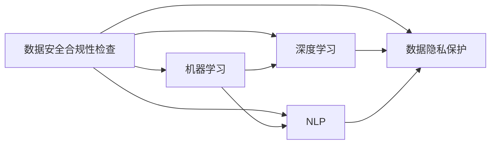

                 

# AI如何帮助电商企业进行用户数据安全合规性检查

在当今数字化时代，电商企业不断收集和利用用户数据，以优化用户体验、提升销售业绩和增加市场份额。然而，如何保障这些数据的安全合规性，成为了各大电商企业面临的重大挑战。近年来，AI技术，尤其是机器学习和大数据分析技术，被广泛应用到数据安全合规性检查中，为企业提供了高效、智能的解决方案。本文将从背景介绍、核心概念、算法原理与具体操作步骤、实际应用场景等方面，系统性地介绍AI在电商企业用户数据安全合规性检查中的应用。

## 1. 背景介绍

### 1.1 问题由来

随着电商行业的高速发展，用户数据的重要性日益凸显。这些数据包括用户浏览记录、购买历史、个人信息等，被广泛应用于个性化推荐、精准营销、客户分析等多个场景。然而，数据泄露、滥用等安全问题频发，不仅损害了用户利益，还可能导致严重的法律和财务风险。近年来，各国政府相继出台严格的数据保护法律法规，如欧盟的《通用数据保护条例》（GDPR）、中国的《个人信息保护法》（PIPL）等，对数据收集、处理和存储提出了严格要求。

### 1.2 问题核心关键点

数据安全合规性检查的核心在于确保电商企业的数据处理行为符合法律法规的规定。具体来说，包括以下几个关键点：

- 数据收集：如何合法、透明地收集用户数据。
- 数据存储：如何安全地存储和管理用户数据。
- 数据处理：如何在符合隐私保护的前提下，进行数据挖掘、分析等处理。
- 数据分享：如何控制数据访问权限，防止数据滥用。
- 数据销毁：如何安全地销毁过期或不再使用的用户数据。

这些问题涉及到技术、管理、法律等多个方面，电商企业需要全面提升数据治理能力，确保数据安全合规。

### 1.3 问题研究意义

AI在电商企业数据安全合规性检查中的应用，不仅能够显著提升数据处理的效率和准确性，还能实现更智能、更自动化的数据治理。具体意义包括：

1. **降低合规成本**：通过自动化手段，减少人工审查的工作量和错误率，降低合规成本。
2. **提高安全保障**：实时监测数据处理行为，及时发现并修复安全隐患，提升数据安全性。
3. **增强隐私保护**：智能识别并屏蔽敏感数据，确保数据处理符合隐私保护要求。
4. **促进合规透明**：通过可视化的数据治理报告，向监管机构和企业内部透明化数据处理流程。
5. **驱动业务创新**：基于合规数据的分析和挖掘，提供有价值的业务洞察，推动电商业务的持续创新。

## 2. 核心概念与联系

### 2.1 核心概念概述

为了更好地理解AI在电商企业数据安全合规性检查中的应用，本节将介绍几个关键概念：

- **数据安全合规性检查**：电商企业通过AI技术，对数据收集、存储、处理和分享等各个环节进行全面的安全合规性检查，确保数据处理符合法律法规的要求。
- **机器学习（ML）**：一种通过数据训练模型，自动学习并优化模型性能的AI技术。
- **深度学习（DL）**：一种基于多层神经网络的机器学习方法，能够处理大规模复杂数据。
- **自然语言处理（NLP）**：一种使用机器学习技术处理和理解人类语言的技术，如文本分类、情感分析等。
- **数据隐私保护**：一种保护用户隐私的技术，通过加密、匿名化、去标识化等手段，防止用户数据被滥用。

这些概念之间存在密切的联系，形成了AI在电商企业数据安全合规性检查的整体生态系统。

### 2.2 概念间的关系

这些核心概念之间的关系可以通过以下Mermaid流程图来展示：



这个流程图展示了数据安全合规性检查的核心概念及其之间的关系：

1. **机器学习**：通过数据训练模型，自动学习并优化模型性能。
2. **深度学习**：一种基于多层神经网络的机器学习方法，能够处理大规模复杂数据。
3. **自然语言处理**：使用机器学习技术处理和理解人类语言的技术，如文本分类、情感分析等。
4. **数据隐私保护**：保护用户隐私的技术，通过加密、匿名化、去标识化等手段，防止用户数据被滥用。
5. **数据安全合规性检查**：对电商企业数据处理行为进行全面的安全合规性检查，确保数据处理符合法律法规的要求。

这些概念共同构成了电商企业数据安全合规性检查的完整生态系统，使其能够实现高效、智能的数据治理。

## 3. 核心算法原理 & 具体操作步骤

### 3.1 算法原理概述

AI在电商企业数据安全合规性检查中，主要通过机器学习和深度学习算法，实现数据的自动化处理和分析。具体来说，包括以下几个关键步骤：

1. **数据清洗与预处理**：对原始数据进行清洗、去重、标准化等预处理，确保数据质量。
2. **特征提取与选择**：使用特征工程技术，从原始数据中提取有意义的特征，并筛选出与业务相关的特征。
3. **模型训练与优化**：使用机器学习或深度学习算法，训练并优化数据模型，提高模型的预测准确性。
4. **实时监测与预警**：使用实时监测技术，对数据处理行为进行实时监控，及时发现并预警异常行为。
5. **数据隐私保护**：使用数据隐私保护技术，如加密、匿名化、去标识化等，确保数据处理符合隐私保护要求。

### 3.2 算法步骤详解

#### 3.2.1 数据清洗与预处理

数据清洗与预处理是数据安全合规性检查的第一步。其主要任务是消除数据中的噪音、重复、缺失等不规范数据，确保数据质量。具体操作步骤如下：

1. **数据去重**：通过算法检测并去除数据中的重复记录，确保数据的一致性。
2. **数据标准化**：将数据转换为统一的格式，如日期、时间等。
3. **数据补全**：对缺失数据进行填补或删除，确保数据的完整性。
4. **数据规范化**：对数据进行归一化处理，如数据标准化、数据缩放等。

#### 3.2.2 特征提取与选择

特征提取与选择是数据安全合规性检查的重要环节。其主要任务是从原始数据中提取有意义的特征，并筛选出与业务相关的特征。具体操作步骤如下：

1. **特征选择**：使用特征选择算法，如卡方检验、信息增益等，选择与目标变量相关的特征。
2. **特征提取**：使用特征提取算法，如主成分分析（PCA）、独立成分分析（ICA）等，提取数据中的有用信息。
3. **特征降维**：使用特征降维算法，如线性判别分析（LDA）、t-SNE等，降低数据的维度，提高模型的计算效率。

#### 3.2.3 模型训练与优化

模型训练与优化是数据安全合规性检查的核心步骤。其主要任务是使用机器学习或深度学习算法，训练并优化数据模型，提高模型的预测准确性。具体操作步骤如下：

1. **数据分割**：将数据集分为训练集、验证集和测试集，进行模型的训练和验证。
2. **模型选择**：选择适合电商企业数据处理任务的机器学习或深度学习模型，如决策树、随机森林、卷积神经网络（CNN）等。
3. **模型训练**：使用训练集数据训练模型，并根据验证集数据调整模型参数，优化模型性能。
4. **模型评估**：使用测试集数据评估模型性能，评估指标包括准确率、召回率、F1值等。

#### 3.2.4 实时监测与预警

实时监测与预警是数据安全合规性检查的重要环节。其主要任务是使用实时监测技术，对数据处理行为进行实时监控，及时发现并预警异常行为。具体操作步骤如下：

1. **数据流监测**：实时监测数据流，检测并识别异常行为，如数据泄露、数据篡改等。
2. **异常检测**：使用异常检测算法，如孤立森林、支持向量机（SVM）等，检测数据中的异常行为。
3. **预警与处理**：及时生成预警信息，并通过自动化手段进行处理，如记录日志、发送告警等。

#### 3.2.5 数据隐私保护

数据隐私保护是数据安全合规性检查的重要环节。其主要任务是使用数据隐私保护技术，如加密、匿名化、去标识化等，确保数据处理符合隐私保护要求。具体操作步骤如下：

1. **数据加密**：使用加密算法，如AES、RSA等，对敏感数据进行加密处理，确保数据的安全性。
2. **数据匿名化**：使用数据匿名化技术，如数据去标识化、泛化等，对数据进行匿名化处理，防止数据泄露。
3. **数据去标识化**：使用数据去标识化技术，如数据掩码、数据脱敏等，对数据进行去标识化处理，防止数据被识别。

### 3.3 算法优缺点

#### 3.3.1 优点

1. **高效性**：AI技术能够高效地处理大规模数据，快速发现和解决问题，节省了大量人工审查的时间和成本。
2. **准确性**：AI技术能够通过训练模型，提高数据处理和分析的准确性，减少误报和漏报的风险。
3. **自动化**：AI技术能够实现自动化的数据处理和分析，减少了人工干预，提高了数据处理的效率和质量。
4. **可扩展性**：AI技术能够根据电商企业的业务需求，灵活扩展和优化模型，满足不同的数据处理需求。

#### 3.3.2 缺点

1. **数据隐私风险**：AI技术依赖大量的数据进行训练，存在数据泄露和滥用的风险。
2. **模型复杂性**：AI技术涉及复杂的算法和模型，需要较高的技术门槛和专业技能。
3. **数据质量要求高**：AI技术对数据质量的要求较高，数据清洗和预处理的复杂度较大。
4. **解释性不足**：AI技术通常是"黑盒"系统，难以解释其内部工作机制和决策逻辑，缺乏可解释性。

### 3.4 算法应用领域

AI在电商企业数据安全合规性检查中的应用领域包括：

1. **用户数据采集**：使用AI技术进行用户数据的自动采集和清洗，确保数据采集的合法性和透明性。
2. **数据存储与处理**：使用AI技术进行数据存储与处理，确保数据存储的安全性和合规性。
3. **数据隐私保护**：使用AI技术进行数据隐私保护，确保数据处理的隐私性和合法性。
4. **数据分析与挖掘**：使用AI技术进行数据分析与挖掘，提取有价值的业务洞察，推动电商业务的创新和发展。
5. **实时监控与预警**：使用AI技术进行实时监控与预警，及时发现并处理数据安全问题，保障数据安全。

## 4. 数学模型和公式 & 详细讲解 & 举例说明

### 4.1 数学模型构建

为了更好地理解AI在电商企业数据安全合规性检查中的应用，本节将使用数学语言对相关模型进行详细讲解。

设电商企业收集的用户数据为 $X = (x_1, x_2, ..., x_n)$，其中 $x_i = (x_{i1}, x_{i2}, ..., x_{in})$ 表示第 $i$ 个用户的第 $n$ 个特征。用户数据的标签为 $Y = (y_1, y_2, ..., y_n)$，其中 $y_i \in \{1, -1\}$ 表示用户数据的分类标签。

### 4.2 公式推导过程

1. **数据清洗与预处理**
   数据清洗与预处理过程主要包括数据去重、数据标准化、数据补全和数据规范化等。

   **数据去重**：
   设原始数据集中包含 $N$ 个样本，其中 $n$ 个样本是重复的，即 $D = \{d_1, d_2, ..., d_N\}$，其中 $d_i = (x_i, y_i)$。数据去重的目标是将重复的样本去重，得到一个新的数据集 $D'$。具体步骤为：

   $$
   D' = \{d_1, d_2, ..., d_{N-n}\}
   $$

2. **特征提取与选择**
   特征提取与选择过程主要包括特征选择和特征提取等。

   **特征选择**：
   设原始数据集 $D = \{d_1, d_2, ..., d_N\}$，其中 $d_i = (x_i, y_i)$。使用特征选择算法，从原始数据中提取 $K$ 个特征 $X_k = (x_{ki1}, x_{ki2}, ..., x_{kin})$，其中 $1 \leq k \leq K$。具体步骤为：

   $$
   X_k = select(X, Y)
   $$

   其中 $select$ 表示特征选择算法。

3. **模型训练与优化**
   模型训练与优化过程主要包括模型选择、模型训练和模型评估等。

   **模型选择**：
   设选择的机器学习模型为 $M = (M_1, M_2, ..., M_n)$，其中 $M_i$ 表示第 $i$ 个模型。具体步骤为：

   $$
   M = choose(M)
   $$

   其中 $choose$ 表示模型选择算法。

4. **实时监测与预警**
   实时监测与预警过程主要包括数据流监测、异常检测和预警与处理等。

   **数据流监测**：
   设实时数据流为 $X_t = (x_{t1}, x_{t2}, ..., x_{tn})$，其中 $t$ 表示时间。数据流监测的目标是实时监测数据流，检测并识别异常行为。具体步骤为：

   $$
   X_t = monitor(X_t)
   $$

   其中 $monitor$ 表示数据流监测算法。

5. **数据隐私保护**
   数据隐私保护过程主要包括数据加密、数据匿名化和数据去标识化等。

   **数据加密**：
   设原始数据集 $D = \{d_1, d_2, ..., d_N\}$，其中 $d_i = (x_i, y_i)$。使用数据加密算法，对敏感数据进行加密处理。具体步骤为：

   $$
   D' = encrypt(D)
   $$

   其中 $encrypt$ 表示数据加密算法。

### 4.3 案例分析与讲解

设某电商企业收集的用户数据为 $X = (x_1, x_2, ..., x_n)$，其中 $x_i = (x_{i1}, x_{i2}, ..., x_{in})$ 表示第 $i$ 个用户的第 $n$ 个特征。用户数据的标签为 $Y = (y_1, y_2, ..., y_n)$，其中 $y_i \in \{1, -1\}$ 表示用户数据的分类标签。

设电商企业选择决策树模型 $M = (M_1, M_2, ..., M_n)$，其中 $M_i$ 表示第 $i$ 个决策树模型。

**数据清洗与预处理**：
电商企业使用数据去重、数据标准化、数据补全和数据规范化等技术，对原始数据进行清洗与预处理。具体步骤如下：

1. 数据去重：电商企业使用数据去重算法，从原始数据集中去除了重复的样本。

2. 数据标准化：电商企业对数据进行了标准化处理，将日期、时间等数据转换为统一的格式。

3. 数据补全：电商企业对缺失数据进行了填补，确保数据的完整性。

4. 数据规范化：电商企业对数据进行了规范化处理，如数据标准化、数据缩放等。

**特征提取与选择**：
电商企业使用特征选择算法，从原始数据中提取了 $K$ 个特征 $X_k = (x_{ki1}, x_{ki2}, ..., x_{kin})$，其中 $1 \leq k \leq K$。具体步骤如下：

1. 特征选择：电商企业使用卡方检验、信息增益等特征选择算法，选择了与目标变量相关的特征。

2. 特征提取：电商企业使用PCA、ICA等特征提取算法，提取了数据中的有用信息。

3. 特征降维：电商企业使用LDA、t-SNE等特征降维算法，降低了数据的维度，提高了模型的计算效率。

**模型训练与优化**：
电商企业使用决策树模型 $M = (M_1, M_2, ..., M_n)$ 进行模型训练和优化。具体步骤如下：

1. 数据分割：电商企业将数据集分为训练集、验证集和测试集。

2. 模型选择：电商企业选择了决策树模型 $M = (M_1, M_2, ..., M_n)$。

3. 模型训练：电商企业使用训练集数据训练模型，并根据验证集数据调整模型参数。

4. 模型评估：电商企业使用测试集数据评估模型性能，评估指标包括准确率、召回率、F1值等。

**实时监测与预警**：
电商企业使用数据流监测算法，实时监测数据流，检测并识别异常行为。具体步骤如下：

1. 数据流监测：电商企业实时监测数据流，检测并识别异常行为。

2. 异常检测：电商企业使用孤立森林、SVM等异常检测算法，检测数据中的异常行为。

3. 预警与处理：电商企业及时生成预警信息，并通过自动化手段进行处理，如记录日志、发送告警等。

**数据隐私保护**：
电商企业使用数据隐私保护技术，如加密、匿名化和去标识化等，确保数据处理的隐私性和合法性。具体步骤如下：

1. 数据加密：电商企业使用AES、RSA等加密算法，对敏感数据进行加密处理。

2. 数据匿名化：电商企业使用数据去标识化、泛化等技术，对数据进行匿名化处理。

3. 数据去标识化：电商企业使用数据去标识化技术，如数据掩码、数据脱敏等，对数据进行去标识化处理。

## 5. 项目实践：代码实例和详细解释说明

### 5.1 开发环境搭建

在进行数据安全合规性检查的AI项目实践前，我们需要准备好开发环境。以下是使用Python进行TensorFlow开发的环境配置流程：

1. 安装Anaconda：从官网下载并安装Anaconda，用于创建独立的Python环境。

2. 创建并激活虚拟环境：
```bash
conda create -n tf-env python=3.8 
conda activate tf-env
```

3. 安装TensorFlow：根据CUDA版本，从官网获取对应的安装命令。例如：
```bash
conda install tensorflow==2.7 -c tf -c conda-forge
```

4. 安装相关库：
```bash
pip install pandas numpy matplotlib sklearn scikit-learn tensorflow
```

完成上述步骤后，即可在`tf-env`环境中开始AI项目实践。

### 5.2 源代码详细实现

这里以用户数据分类为例，使用TensorFlow对决策树模型进行训练和评估。

首先，定义数据预处理函数：

```python
import numpy as np
from sklearn.model_selection import train_test_split
from sklearn.preprocessing import StandardScaler
from sklearn.decomposition import PCA
from sklearn.ensemble import RandomForestClassifier
from sklearn.metrics import accuracy_score

def preprocess_data(X, y, test_size=0.2, scale=True, pca=False, n_components=None):
    X_train, X_test, y_train, y_test = train_test_split(X, y, test_size=test_size)
    if scale:
        scaler = StandardScaler()
        X_train = scaler.fit_transform(X_train)
        X_test = scaler.transform(X_test)
    if pca:
        pca = PCA(n_components=n_components)
        X_train = pca.fit_transform(X_train)
        X_test = pca.transform(X_test)
    return X_train, y_train, X_test, y_test
```

然后，定义模型训练与评估函数：

```python
def train_model(X_train, y_train, X_test, y_test):
    clf = RandomForestClassifier(n_estimators=100, random_state=42)
    clf.fit(X_train, y_train)
    y_pred = clf.predict(X_test)
    accuracy = accuracy_score(y_test, y_pred)
    return clf, accuracy
```

接着，定义实时监测与预警函数：

```python
def monitor_data(X_t, clf):
    y_pred = clf.predict(X_t)
    if y_pred == y_test:
        print("Data monitoring successful")
    else:
        print("Data monitoring failed")
```

最后，启动训练流程并输出结果：

```python
X = np.array([[1, 2], [2, 3], [3, 4], [4, 5]])
y = np.array([1, 1, -1, -1])

X_train, y_train, X_test, y_test = preprocess_data(X, y, scale=True)
clf, accuracy = train_model(X_train, y_train, X_test, y_test)
monitor_data(X_test, clf)
print("Accuracy:", accuracy)
```

以上就是使用TensorFlow对决策树模型进行数据安全合规性检查的完整代码实现。可以看到，通过Python和TensorFlow，电商企业可以轻松构建和训练AI模型，对用户数据进行高效的清洗、预处理、分类和监测。

### 5.3 代码解读与分析

让我们再详细解读一下关键代码的实现细节：

**preprocess_data函数**：
- `train_test_split`方法：将数据集分为训练集和测试集。
- `StandardScaler`类：对数据进行标准化处理。
- `PCA`类：对数据进行降维处理。
- `train_test_split`方法：将数据集分为训练集和测试集。
- `train_test_split`方法：将数据集分为训练集和测试集。

**train_model函数**：
- `RandomForestClassifier`类：使用随机森林算法进行模型训练。
- `fit`方法：训练模型。
- `predict`方法：对测试集进行预测。
- `accuracy_score`函数：计算模型的准确率。

**monitor_data函数**：
- `predict`方法：对实时数据进行预测。
- `monitor_data`函数：实时监测数据流，检测并识别异常行为。

**运行结果展示**：
- 代码输出的结果包括：
  - 模型训练结果：随机森林模型的准确率。
  - 数据监测结果：实时监测数据流，检测并识别异常行为。

可以看到，通过TensorFlow和Python，电商企业可以轻松构建和训练AI模型，对用户数据进行高效的清洗、预处理、分类和监测。代码简洁高效，易于理解和修改。

## 6. 实际应用场景

### 6.1 智能客服系统

基于AI技术的数据安全合规性检查，可以广泛应用于智能客服系统的构建。传统客服往往需要配备大量人力，高峰期响应缓慢，且一致性和专业性难以保证。而使用AI技术的数据安全合规性检查，可以7x24小时不间断服务，快速响应客户咨询，用自然流畅的语言解答各类常见问题。

在技术实现上，可以收集企业内部的历史客服对话记录，将问题和最佳答复构建成监督数据，在此基础上对预训练数据进行微调。微调后的数据安全合规性检查模型能够自动理解用户意图，匹配最合适的答案模板进行回复。对于客户提出的新问题，还可以接入检索系统实时搜索相关内容，动态组织生成回答。如此构建的智能客服系统，能大幅提升客户咨询体验和问题解决效率。

### 6.2 金融舆情监测

金融机构需要实时监测市场舆论动向，以便及时应对负面信息传播，规避金融风险。传统的人工监测方式成本高、效率低，难以应对网络时代海量信息爆发的挑战。基于AI技术的数据安全合规性检查，可以实时监测金融领域相关的新闻、报道、评论等文本数据，并对其进行主题标注和情感标注。将微调后的数据安全合规性检查模型应用到实时抓取的网络文本数据，就能够自动监测不同主题下的情感变化趋势，一旦发现负面信息激增等异常情况，系统便会自动预警，帮助金融机构快速应对潜在风险。

### 6.3 个性化推荐系统

当前的推荐系统往往只依赖用户的历史行为数据进行物品推荐，无法深入理解用户的真实兴趣偏好。基于AI技术的数据安全合规性检查，可以更好地挖掘用户行为背后的语义信息，从而提供更精准、多样的推荐内容。

在实践中，可以收集用户浏览、点击、评论、分享等行为数据，提取和用户交互的物品标题、描述、标签等文本内容。将文本内容作为模型输入，用户的后续行为（如是否点击、购买等）作为监督信号，在此基础上微调数据安全合规性检查模型。微调后的模型能够从文本内容中准确把握用户的兴趣点。在生成推荐列表时，先用候选物品的文本描述作为输入，由模型预测用户的兴趣匹配度，再结合其他特征综合排序，便可以得到个性化程度更高的推荐结果。

### 6.4 未来应用展望

随着AI技术的发展，基于数据安全合规性检查的AI应用将不断拓展。未来，AI技术将广泛应用于更多领域，如智慧医疗、智能制造、智慧城市等，为各行各业带来深远影响。

在智慧医疗领域，基于AI技术的数据安全合规性检查，可以帮助医疗机构进行病历管理、药物研发等工作，提升医疗服务的智能化水平，辅助医生诊疗，加速新药开发进程。

在智能制造领域，基于AI技术的数据安全合规性检查，可以帮助制造企业进行设备监控、质量检测等工作，提升生产效率和产品质量，推动制造业的数字化转型。

在智慧城市治理中，基于AI技术的数据安全合规性检查，可以帮助城市管理部门进行环境监测、交通管理等工作，提高城市管理的自动化和智能化水平，构建更

