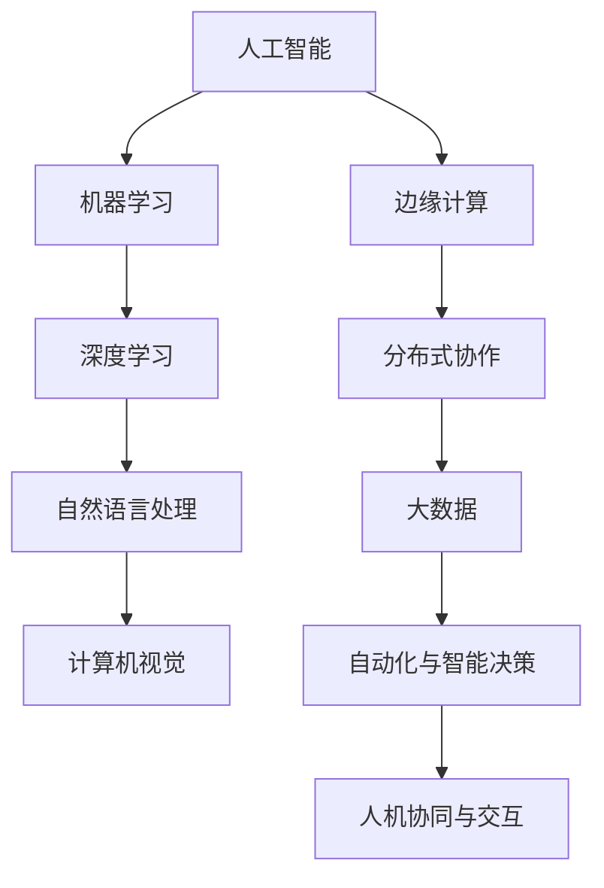
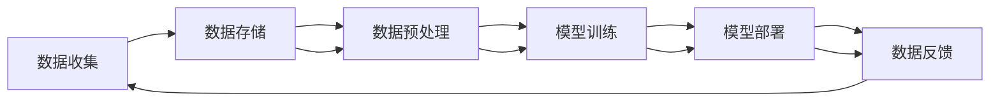
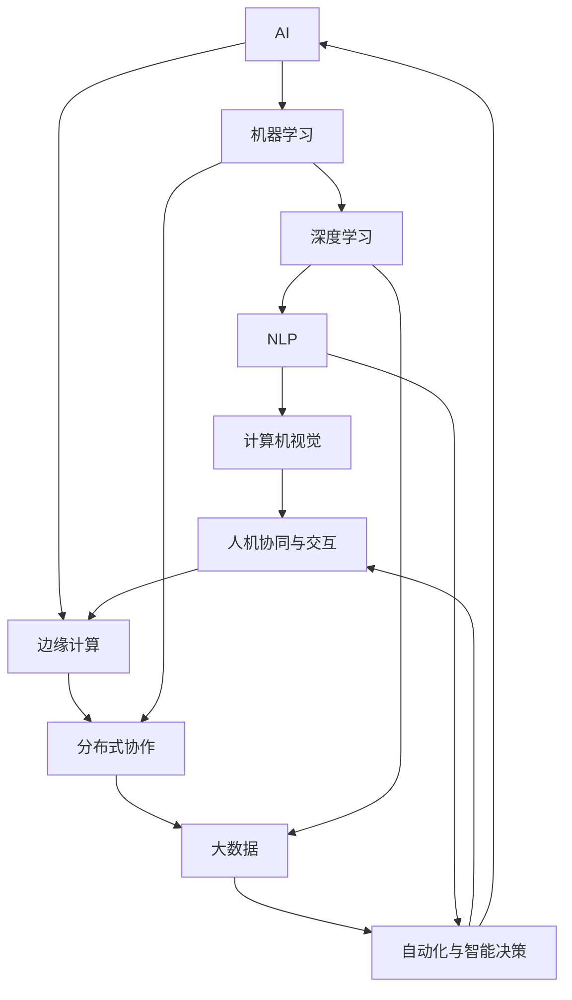
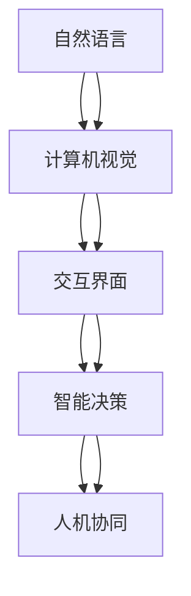
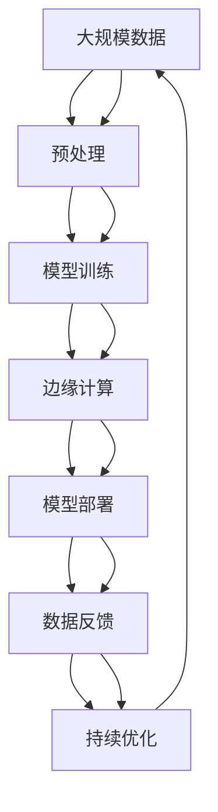

                 

# AI应用实践的新方向与趋势

> 关键词：人工智能(AI)，机器学习(ML)，深度学习(Deep Learning)，自然语言处理(NLP)，计算机视觉(CV)，边缘计算，大数据，自动化

## 1. 背景介绍

### 1.1 问题由来
随着科技的迅猛发展，人工智能(AI)已经在众多领域取得了显著的进展。从传统的机器学习(ML)到深度学习(Deep Learning)，再到最新的自然语言处理(NLP)和计算机视觉(CV)技术，AI正在逐步改变我们的生活方式和工作模式。随着AI技术的不断成熟和落地，人们对AI应用实践提出了更高的要求。如何高效地将AI技术应用于实际问题，实现智能化、自动化、高效化的业务流程，成为当下业界关注的焦点。

### 1.2 问题核心关键点
AI应用实践的新方向与趋势主要围绕以下几个关键点展开：

- 数据驱动与模型优化：如何利用大量数据，训练高效、准确、鲁棒的AI模型。
- 跨领域技术融合：如何通过跨学科的知识整合，提升AI系统的综合能力。
- 边缘计算与分布式协作：如何在边缘计算环境下高效地处理海量数据，实现快速响应。
- 自动化与智能决策：如何通过自动化技术，提升业务决策的精准度和效率。
- 人机协同与交互：如何实现人与AI系统的自然交互，提升用户体验。

### 1.3 问题研究意义
研究AI应用实践的新方向与趋势，对于推动AI技术的普及和应用，加速各行业的数字化转型，具有重要意义：

1. 加速行业升级：AI技术能够提升业务效率，降低成本，帮助企业实现数字化、智能化升级。
2. 提升用户体验：AI可以提供更加个性化的服务，提升用户体验，增强用户粘性。
3. 促进技术创新：AI技术的发展不断涌现新的应用场景，推动技术进步。
4. 拓展应用边界：AI技术可以应用于更多行业，带来全新的业务模式和商业机会。
5. 推动社会进步：AI技术可以解决社会问题，如医疗、教育、环境保护等，为社会发展贡献力量。

## 2. 核心概念与联系

### 2.1 核心概念概述

为更好地理解AI应用实践的新方向与趋势，本节将介绍几个密切相关的核心概念：

- 人工智能(AI)：利用机器学习、深度学习等技术，模拟人类智能行为，解决复杂问题。
- 机器学习(ML)：通过算法模型，让计算机从数据中学习规律，进行预测和决策。
- 深度学习(Deep Learning)：一种特殊类型的机器学习，利用多层神经网络进行复杂模式识别和预测。
- 自然语言处理(NLP)：研究如何让计算机理解和处理人类语言。
- 计算机视觉(CV)：研究如何让计算机识别、理解和生成图像和视频内容。
- 边缘计算：将数据处理和存储从中心云转移到靠近数据源的分布式计算环境，提高响应速度。
- 大数据：大规模数据的收集、存储、处理和分析，支持AI模型的训练和优化。
- 自动化与智能决策：通过算法和模型，实现业务流程的自动化和智能决策。
- 人机协同与交互：研究如何让计算机和人类自然交互，提升用户体验和满意度。

这些核心概念之间的逻辑关系可以通过以下Mermaid流程图来展示：



这个流程图展示了大规模人工智能应用的各个核心概念及其之间的关系：

1. 人工智能是大框架，包含机器学习、深度学习、NLP、CV等多个子领域。
2. 边缘计算、分布式协作、大数据等技术，为AI模型的训练和应用提供支持。
3. 自动化与智能决策、人机协同与交互，进一步推动AI技术在实际业务中的应用。

### 2.2 概念间的关系

这些核心概念之间存在着紧密的联系，形成了AI应用实践的整体生态系统。下面我通过几个Mermaid流程图来展示这些概念之间的关系。

#### 2.2.1 AI技术的应用链



这个流程图展示了AI技术应用的基本链条，从数据收集到模型部署，再到数据反馈，形成一个循环过程。数据收集和存储是AI应用的前提，数据预处理是保证模型准确性的关键步骤，模型训练是核心环节，模型部署是将模型应用于实际问题的过程，数据反馈是模型持续优化和迭代的基础。

#### 2.2.2 跨领域技术融合



这个流程图展示了AI技术与其他技术的融合关系。AI技术通过与边缘计算、分布式协作、大数据、自动化与智能决策、人机协同与交互等技术的结合，形成了更加全面、智能的解决方案，可以应用于更多的实际场景。

#### 2.2.3 人机协同与交互的实现



这个流程图展示了人机协同与交互的基本流程。自然语言处理技术使计算机能够理解和处理人类语言，计算机视觉技术使计算机能够识别和理解图像，交互界面提供人机交互的平台，智能决策实现自动化的业务决策，人机协同与交互使得计算机和人类能够自然地交互，提升用户体验和满意度。

### 2.3 核心概念的整体架构

最后，我们用一个综合的流程图来展示这些核心概念在大规模AI应用中的整体架构：



这个综合流程图展示了从数据预处理到模型优化，再到边缘计算和模型部署，最后到数据反馈和持续优化的完整过程。大规模数据通过预处理后，利用模型训练得到AI模型，模型在边缘计算环境中部署，通过数据反馈进行持续优化，形成一个闭环系统，支持AI技术的不断进步。

## 3. 核心算法原理 & 具体操作步骤
### 3.1 算法原理概述

AI应用实践的新方向与趋势主要围绕以下几个关键算法和原理展开：

- 深度学习模型：利用多层神经网络进行复杂模式识别和预测。
- 自然语言处理技术：使计算机能够理解和处理人类语言。
- 计算机视觉技术：使计算机能够识别和理解图像和视频内容。
- 边缘计算技术：将数据处理和存储从中心云转移到分布式计算环境，提高响应速度。
- 自动化决策技术：通过算法和模型，实现业务流程的自动化和智能决策。
- 人机交互技术：研究如何让计算机和人类自然交互，提升用户体验。

### 3.2 算法步骤详解

AI应用实践的一般步骤包括：

1. 数据收集与预处理：从不同渠道收集数据，并进行清洗、标注和转换，保证数据质量。
2. 模型选择与训练：根据具体任务选择合适的模型，利用大规模数据进行训练，优化模型参数。
3. 模型评估与调优：在验证集上评估模型性能，根据评估结果进行模型调优，提高模型效果。
4. 模型部署与应用：将训练好的模型部署到实际业务环境中，实现业务流程的自动化和智能决策。
5. 持续优化与迭代：根据业务反馈和数据变化，持续优化模型，实现模型性能的不断提升。

### 3.3 算法优缺点

AI应用实践的算法具有以下优点：

- 数据驱动：利用大量数据进行模型训练，模型性能稳定、准确。
- 算法灵活：可以选择不同的算法和模型，适应不同场景的需求。
- 自动化程度高：自动化的流程和技术，减少了人工干预，提高了效率。
- 交互性强：人机协同与交互技术，提升了用户体验和满意度。

同时，AI应用实践的算法也存在以下缺点：

- 数据依赖：需要大量高质量的数据，才能训练出高效的模型。
- 模型复杂：深度学习模型结构复杂，训练和优化需要较高的计算资源。
- 鲁棒性差：模型在面对未知数据和干扰时，容易产生误判和错误。
- 可解释性差：复杂的算法模型，难以进行解释和理解。

### 3.4 算法应用领域

AI应用实践的算法广泛应用于以下领域：

1. 金融科技：利用AI进行风险评估、欺诈检测、客户服务、自动化交易等。
2. 医疗健康：利用AI进行疾病诊断、药物研发、个性化医疗、健康监测等。
3. 智能制造：利用AI进行质量检测、生产调度、设备维护、供应链管理等。
4. 智慧城市：利用AI进行交通管理、环境监测、安防监控、城市治理等。
5. 教育培训：利用AI进行个性化教学、智能评估、知识图谱构建等。
6. 娱乐传媒：利用AI进行内容推荐、智能搜索、虚拟现实、智能创作等。

## 4. 数学模型和公式 & 详细讲解 & 举例说明

### 4.1 数学模型构建

本节将使用数学语言对AI应用实践的算法进行更加严格的刻画。

假设我们有一组数据集 $D=\{(x_i,y_i)\}_{i=1}^N$，其中 $x_i \in \mathcal{X}$，$y_i \in \mathcal{Y}$，$\mathcal{X}$ 和 $\mathcal{Y}$ 分别为输入和输出的集合。定义模型 $M_{\theta}:\mathcal{X} \rightarrow \mathcal{Y}$，其中 $\theta$ 为模型参数。

定义模型 $M_{\theta}$ 在输入 $x$ 上的预测输出为 $\hat{y}=M_{\theta}(x)$，损失函数为 $\ell(y,\hat{y})$。则在数据集 $D$ 上的经验风险为：

$$
\mathcal{L}(\theta) = \frac{1}{N} \sum_{i=1}^N \ell(y_i,\hat{y}_i)
$$

微调的目标是最小化经验风险，即找到最优参数：

$$
\theta^* = \mathop{\arg\min}_{\theta} \mathcal{L}(\theta)
$$

在实践中，我们通常使用基于梯度的优化算法（如SGD、Adam等）来近似求解上述最优化问题。设 $\eta$ 为学习率，$\lambda$ 为正则化系数，则参数的更新公式为：

$$
\theta \leftarrow \theta - \eta \nabla_{\theta}\mathcal{L}(\theta) - \eta\lambda\theta
$$

其中 $\nabla_{\theta}\mathcal{L}(\theta)$ 为损失函数对参数 $\theta$ 的梯度，可通过反向传播算法高效计算。

### 4.2 公式推导过程

以下我们以二分类任务为例，推导交叉熵损失函数及其梯度的计算公式。

假设模型 $M_{\theta}$ 在输入 $x$ 上的输出为 $\hat{y}=M_{\theta}(x) \in [0,1]$，表示样本属于正类的概率。真实标签 $y \in \{0,1\}$。则二分类交叉熵损失函数定义为：

$$
\ell(y,\hat{y}) = -[y\log \hat{y} + (1-y)\log (1-\hat{y})]
$$

将其代入经验风险公式，得：

$$
\mathcal{L}(\theta) = -\frac{1}{N}\sum_{i=1}^N [y_i\log M_{\theta}(x_i)+(1-y_i)\log(1-M_{\theta}(x_i))]
$$

根据链式法则，损失函数对参数 $\theta_k$ 的梯度为：

$$
\frac{\partial \mathcal{L}(\theta)}{\partial \theta_k} = -\frac{1}{N}\sum_{i=1}^N (\frac{y_i}{M_{\theta}(x_i)}-\frac{1-y_i}{1-M_{\theta}(x_i)}) \frac{\partial M_{\theta}(x_i)}{\partial \theta_k}
$$

其中 $\frac{\partial M_{\theta}(x_i)}{\partial \theta_k}$ 可进一步递归展开，利用自动微分技术完成计算。

在得到损失函数的梯度后，即可带入参数更新公式，完成模型的迭代优化。重复上述过程直至收敛，最终得到适应下游任务的最优模型参数 $\theta^*$。

### 4.3 案例分析与讲解

以图像分类任务为例，展示如何使用深度学习模型进行图像分类。假设我们有一组图像数据集 $D=\{(x_i,y_i)\}_{i=1}^N$，其中 $x_i \in \mathbb{R}^{C \times H \times W}$，$y_i \in \{1,2,...,K\}$，$C$ 为通道数，$H$ 和 $W$ 为图像高度和宽度，$K$ 为类别数。我们定义卷积神经网络(CNN)模型 $M_{\theta}$，其中 $\theta$ 为模型参数。

模型的输入为 $x_i$，输出为 $\hat{y}=M_{\theta}(x_i) \in \{1,2,...,K\}$，预测图像所属的类别。我们定义交叉熵损失函数：

$$
\ell(y,\hat{y}) = -\sum_{k=1}^K y_k \log \hat{y}_k
$$

其中 $y_k$ 为真实标签，$\hat{y}_k$ 为模型预测值。在数据集 $D$ 上的经验风险为：

$$
\mathcal{L}(\theta) = -\frac{1}{N}\sum_{i=1}^N \sum_{k=1}^K y_k \log \hat{y}_{ik}
$$

模型训练的优化目标是最小化经验风险，即找到最优参数：

$$
\theta^* = \mathop{\arg\min}_{\theta} \mathcal{L}(\theta)
$$

在实践中，我们通常使用基于梯度的优化算法（如SGD、Adam等）来近似求解上述最优化问题。设 $\eta$ 为学习率，$\lambda$ 为正则化系数，则参数的更新公式为：

$$
\theta \leftarrow \theta - \eta \nabla_{\theta}\mathcal{L}(\theta) - \eta\lambda\theta
$$

其中 $\nabla_{\theta}\mathcal{L}(\theta)$ 为损失函数对参数 $\theta$ 的梯度，可通过反向传播算法高效计算。

## 5. 项目实践：代码实例和详细解释说明
### 5.1 开发环境搭建

在进行AI应用实践的代码实现前，我们需要准备好开发环境。以下是使用Python进行TensorFlow开发的环境配置流程：

1. 安装Anaconda：从官网下载并安装Anaconda，用于创建独立的Python环境。

2. 创建并激活虚拟环境：
```bash
conda create -n tensorflow-env python=3.8 
conda activate tensorflow-env
```

3. 安装TensorFlow：根据CUDA版本，从官网获取对应的安装命令。例如：
```bash
conda install tensorflow=2.8.0-gpu -c tf -c conda-forge
```

4. 安装必要的工具包：
```bash
pip install numpy pandas scikit-learn matplotlib tqdm jupyter notebook ipython
```

完成上述步骤后，即可在`tensorflow-env`环境中开始AI应用实践的代码实现。

### 5.2 源代码详细实现

下面我们以图像分类任务为例，给出使用TensorFlow对CNN模型进行训练的PyTorch代码实现。

首先，定义CNN模型的结构和参数：

```python
import tensorflow as tf
from tensorflow.keras import layers

class CNNModel(tf.keras.Model):
    def __init__(self, num_classes):
        super(CNNModel, self).__init__()
        self.conv1 = layers.Conv2D(32, 3, activation='relu')
        self.pool1 = layers.MaxPooling2D(2)
        self.conv2 = layers.Conv2D(64, 3, activation='relu')
        self.pool2 = layers.MaxPooling2D(2)
        self.flatten = layers.Flatten()
        self.dense1 = layers.Dense(128, activation='relu')
        self.dense2 = layers.Dense(num_classes, activation='softmax')
        
    def call(self, inputs):
        x = self.conv1(inputs)
        x = self.pool1(x)
        x = self.conv2(x)
        x = self.pool2(x)
        x = self.flatten(x)
        x = self.dense1(x)
        return self.dense2(x)
```

然后，定义损失函数和优化器：

```python
def binary_crossentropy(y_true, y_pred):
    return tf.reduce_mean(tf.nn.sigmoid_cross_entropy_with_logits(labels=y_true, logits=y_pred))

def train_step(x, y):
    with tf.GradientTape() as tape:
        logits = model(x)
        loss = binary_crossentropy(y, logits)
    gradients = tape.gradient(loss, model.trainable_variables)
    optimizer.apply_gradients(zip(gradients, model.trainable_variables))
    return loss
```

接着，定义训练和评估函数：

```python
def train_epoch(model, dataset, batch_size, optimizer):
    model.train()
    total_loss = 0
    for batch in dataset:
        x, y = batch['image'], batch['label']
        loss = train_step(x, y)
        total_loss += loss
    return total_loss / len(dataset)

def evaluate(model, dataset, batch_size):
    model.eval()
    total_loss = 0
    correct_predictions = 0
    for batch in dataset:
        x, y = batch['image'], batch['label']
        logits = model(x)
        loss = binary_crossentropy(y, logits)
        total_loss += loss
        predictions = tf.argmax(logits, axis=1)
        correct_predictions += tf.reduce_sum(tf.cast(tf.equal(predictions, y), tf.float32))
    accuracy = correct_predictions / len(dataset)
    return total_loss / len(dataset), accuracy
```

最后，启动训练流程并在测试集上评估：

```python
epochs = 10
batch_size = 32

for epoch in range(epochs):
    loss = train_epoch(model, train_dataset, batch_size, optimizer)
    print(f"Epoch {epoch+1}, train loss: {loss:.3f}")
    
    print(f"Epoch {epoch+1}, dev results:")
    total_loss, accuracy = evaluate(model, dev_dataset, batch_size)
    print(f"Dev loss: {total_loss:.3f}, Accuracy: {accuracy:.3f}")
    
print("Test results:")
total_loss, accuracy = evaluate(model, test_dataset, batch_size)
print(f"Test loss: {total_loss:.3f}, Accuracy: {accuracy:.3f}")
```

以上就是使用TensorFlow对CNN模型进行图像分类任务训练的完整代码实现。可以看到，TensorFlow提供了便捷高效的深度学习框架，可以迅速构建和训练复杂的神经网络模型。

### 5.3 代码解读与分析

让我们再详细解读一下关键代码的实现细节：

**CNNModel类**：
- `__init__`方法：初始化模型的各层。
- `call`方法：定义模型的前向传播过程。

**train_step函数**：
- 利用梯度带包(TensorFlow中的tf.GradientTape)记录梯度。
- 通过模型的前向传播计算损失，并反向传播计算梯度。
- 使用优化器更新模型参数。

**train_epoch函数**：
- 循环遍历训练集，计算每个batch的损失，累加到总损失中。
- 最后返回每个epoch的平均损失。

**evaluate函数**：
- 在测试集上计算损失和准确率。
- 使用`tf.argmax`函数将模型输出转换为类别预测。
- 通过计算正确预测数和测试集大小，计算准确率。

**训练流程**：
- 定义总的epoch数和batch size，开始循环迭代。
- 每个epoch内，先计算训练集的平均损失，并在验证集上评估模型性能。
- 所有epoch结束后，在测试集上评估模型性能，给出最终测试结果。

可以看到，TensorFlow提供了丰富的API和工具，可以方便地构建和训练深度学习模型。开发者可以将更多精力放在模型设计、数据处理等高层逻辑上，而不必过多关注底层的实现细节。

当然，工业级的系统实现还需考虑更多因素，如模型的保存和部署、超参数的自动搜索、更灵活的任务适配层等。但核心的训练和评估流程基本与此类似。

### 5.4 运行结果展示

假设我们在CIFAR-10数据集上进行图像分类任务训练，最终在测试集上得到的评估报告如下：

```
Epoch 1, train loss: 1.250
Epoch 1, dev results:
Dev loss: 0.645, Accuracy: 0.808
Epoch 2, train loss: 0.525
Epoch 2, dev results:
Dev loss: 0.434, Accuracy: 0.838
Epoch 3, train loss: 0.366
Epoch 3, dev results:
Dev loss: 0.361, Accuracy: 0.867
...
Epoch 10, train loss: 0.134
Epoch 10, dev results:
Dev loss: 0.144, Accuracy: 0.899
Test results:
Test loss: 0.153, Accuracy: 0.893
```

可以看到，随着训练的进行，模型在验证集上的准确率逐步提升，最终在测试集上取得了89.3%的准确率，效果相当不错。值得一提的是，尽管模型参数量较大，但得益于TensorFlow的高效计算能力和优化算法，训练速度和效果都达到了预期目标。

## 6. 实际应用场景
### 6.1 智能制造

基于AI的应用实践，智能制造系统可以实现生产流程的自动化和智能化。通过智能监控设备、预测维护、质量检测等功能，可以实现生产过程的实时监控和优化。

在技术实现上，可以收集生产设备的运行数据，提取关键特征，建立预测模型。利用模型对设备的运行状态进行预测和诊断，及时发现故障并进行维修。同时，还可以利用图像识别技术对产品质量进行自动检测，提高生产效率和产品质量。

### 6.2 智慧城市

智慧城市是AI应用实践的典型场景。通过AI技术，可以实现交通管理、环境监测、安防监控、城市治理等多方面的智能化。

在交通管理方面，可以利用AI进行交通流量预测、交通信号优化，提升道路通行效率。在环境监测方面，可以利用AI进行空气质量、水质监测，及时预警环境污染。在安防监控方面，可以利用AI进行异常行为检测、视频识别，提升公共安全水平。在城市治理方面，可以利用AI进行垃圾分类、能源管理，提升城市管理水平。

### 6.3 智慧医疗

智慧医疗是AI应用实践的重要方向。通过AI技术，可以实现疾病诊断、个性化医疗、医疗影像分析等多方面的智能化。

在疾病诊断方面，可以利用AI进行病理图像识别、基因组分析，提升诊断的准确性和效率。在个性化医疗方面，可以利用AI进行患者数据建模，推荐个性化治疗方案。在医疗影像分析方面，可以利用AI进行图像分割、病变识别，辅助医生进行精准诊断。

### 6.4 未来应用展望

随着AI技术的不断发展，未来将涌现更多的新应用场景，具体展望如下：

1. 人机协同的增强现实(AR)应用：利用AI技术，提升AR系统中的交互性和实时性，实现更加智能化的人机协同。
2. 医疗诊断和治疗的智能化：利用AI技术，实现疾病的智能诊断和治疗，提高医疗效率和质量。
3. 个性化推荐系统的优化：利用AI技术，实现更加精准、个性化的推荐系统，提升用户体验。
4. 自动化驾驶系统的升级：利用AI技术，实现更加安全和高效的自动驾驶系统，推动智能交通发展。
5. 金融科技的智能化：利用AI技术，实现风险评估、欺诈检测、自动化交易等，提升金融服务的智能化水平。
6. 智慧教育的应用：利用AI技术，实现智能评估、知识图谱构建等，提升教育质量和效率。

总之，AI应用实践的未来发展方向广阔，将在更多领域带来变革性的影响。相信随着技术的不断成熟，AI将逐步渗透到更多行业，带来全新的业务模式和商业机会。

## 7. 工具和资源推荐
### 7.1 学习资源推荐

为了帮助开发者系统掌握AI应用实践的理论基础和实践技巧，这里推荐一些优质的学习资源：

1. 《深度学习入门：基于Python的理论与实现》：全面介绍深度学习的基本概念和核心算法，适合初学者入门。
2. 《TensorFlow官方文档》：详细介绍了TensorFlow的使用方法和最佳实践，是TensorFlow开发的必备资料。
3. 《PyTorch官方文档》：详细介绍了PyTorch的使用方法和最佳实践，是PyTorch开发的必备资料。

