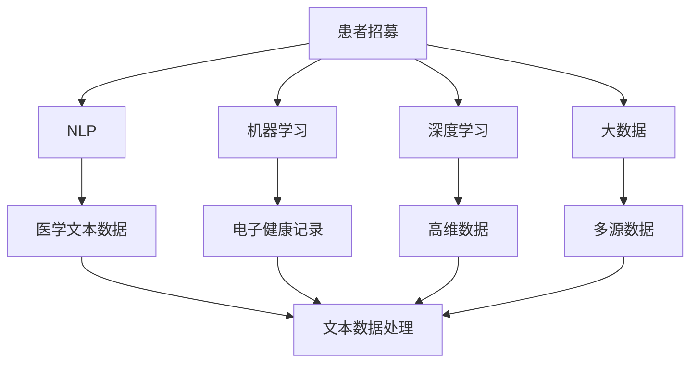
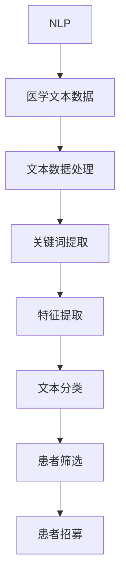
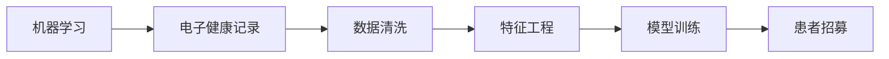
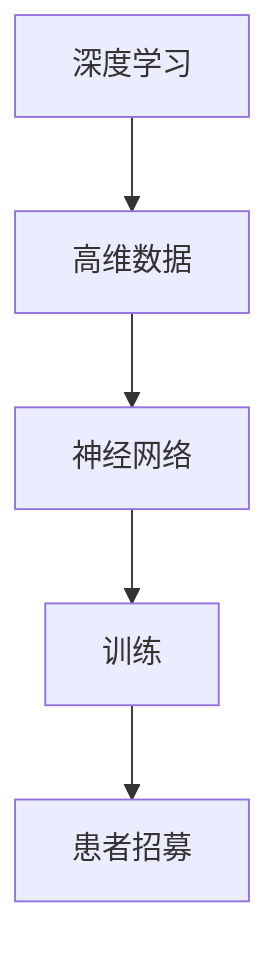
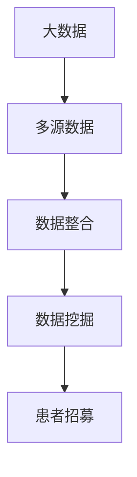
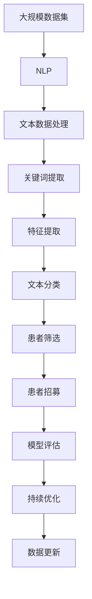

                 

# AI技术优化患者招募流程的策略

> 关键词：患者招募, AI优化, 自然语言处理, 机器学习, 深度学习, 医学研究, 大数据

## 1. 背景介绍

### 1.1 问题由来
在医学研究领域，患者招募是临床试验成功与否的关键。患者的招募通常依赖于医生和研究人员的经验和直觉，这种方式往往效率低下、成本高昂，且难以保证样本的代表性。随着人工智能技术的发展，越来越多的研究者开始探索如何利用AI技术优化患者招募流程，以提高招募效率、降低成本、提升样本质量。

### 1.2 问题核心关键点
AI技术在患者招募中的应用主要集中在以下几个方面：

- **自然语言处理(NLP)**：通过分析医学文献、患者病历和社交媒体等文本数据，提取潜在患者的关键词和特征。
- **机器学习(ML)**：利用统计学方法从历史数据中学习规律，预测潜在患者的招募概率。
- **深度学习(Deep Learning)**：构建复杂的神经网络模型，处理高维数据，提高预测准确性。
- **大数据(Big Data)**：整合多源数据，进行全面的数据挖掘和分析，提供更全面的患者信息。

这些技术的综合应用，可以显著提高患者招募的效率和质量，减少招募过程中的不确定性和偏差。

### 1.3 问题研究意义
研究AI技术在患者招募中的应用，对于提高医学研究效率、降低成本、提升样本质量具有重要意义：

- **提高招募效率**：AI可以快速处理大量数据，自动化筛选符合条件的患者，节省大量时间和人力。
- **降低招募成本**：通过数据驱动的决策，减少对人工筛选的依赖，降低招募费用。
- **提升样本质量**：AI能够更全面、客观地评估患者条件，提高样本的代表性，提升试验结果的可靠性。
- **增强决策科学性**：通过数据挖掘和机器学习，提供基于证据的决策支持，避免主观偏差。
- **推动研究创新**：AI技术的应用可以揭示新的研究趋势和模式，加速医学研究进展。

## 2. 核心概念与联系

### 2.1 核心概念概述

为更好地理解AI技术在患者招募中的应用，本节将介绍几个密切相关的核心概念：

- **患者招募**：从大量人群中筛选符合临床试验要求的患者的过程。
- **自然语言处理(NLP)**：利用计算机处理、理解、生成自然语言的技术。
- **机器学习(ML)**：通过算法和模型从数据中学习规律，进行预测和决策。
- **深度学习(Deep Learning)**：构建多层神经网络，处理非线性数据，提高模型复杂度。
- **大数据(Big Data)**：收集、处理和分析大规模数据集，发现数据中隐藏的规律和模式。
- **医学文本数据**：包含疾病描述、诊断报告、病历记录等文本信息的数据集。
- **电子健康记录(EHR)**：通过电子方式记录的患者健康信息，包含丰富的文本和结构化数据。

这些概念之间的逻辑关系可以通过以下Mermaid流程图来展示：



这个流程图展示了大数据、自然语言处理、机器学习和深度学习等技术在患者招募流程中的作用，它们通过各种方式处理和分析数据，为优化患者招募提供支持。

### 2.2 概念间的关系

这些核心概念之间存在着紧密的联系，形成了患者招募的完整技术生态系统。下面我们通过几个Mermaid流程图来展示这些概念之间的关系。

#### 2.2.1 自然语言处理与患者招募



这个流程图展示了自然语言处理技术在患者招募中的应用过程：从医学文本数据中提取关键词和特征，进行文本分类，筛选出符合条件的患者，最终完成患者招募。

#### 2.2.2 机器学习与患者招募



这个流程图展示了机器学习在患者招募中的应用：从电子健康记录中清洗和提取特征，训练模型进行患者招募概率预测，最终完成患者招募。

#### 2.2.3 深度学习与患者招募



这个流程图展示了深度学习在患者招募中的应用：处理高维数据，构建神经网络进行模型训练，最终完成患者招募。

#### 2.2.4 大数据与患者招募



这个流程图展示了大数据在患者招募中的应用：整合多源数据，进行数据挖掘，最终完成患者招募。

### 2.3 核心概念的整体架构

最后，我们用一个综合的流程图来展示这些核心概念在大数据驱动的患者招募流程中的整体架构：



这个综合流程图展示了从数据预处理、特征提取、文本分类到患者招募和模型评估的完整过程，以及持续优化和数据更新的循环。通过这些流程，AI技术可以不断迭代和优化，提升患者招募的效果和效率。

## 3. 核心算法原理 & 具体操作步骤
### 3.1 算法原理概述

基于AI技术优化患者招募的算法原理，可以概括为以下几个步骤：

1. **数据预处理**：收集和整理相关的数据，包括医学文献、电子健康记录、社交媒体数据等。
2. **特征提取**：从数据中提取出与患者招募相关的特征，如病情描述、药物反应、实验室指标等。
3. **文本分类**：使用自然语言处理技术对医学文本进行分类，筛选出符合特定条件的患者。
4. **模型训练**：通过机器学习和深度学习模型，对提取的特征进行训练，预测患者招募的概率。
5. **患者筛选**：根据模型的预测结果，筛选出高概率患者，进行进一步评估和招募。
6. **模型评估**：对筛选出的患者进行评估，验证模型的效果，进行持续优化。

通过这些步骤，AI技术可以高效、准确地优化患者招募流程，提高医学研究的效率和质量。

### 3.2 算法步骤详解

以下是详细的算法步骤详解：

**Step 1: 数据预处理**

1. **数据收集**：从医疗机构、公开数据库、社交媒体等渠道收集患者相关数据。
2. **数据清洗**：去除无效数据、处理缺失值、修正错误数据，确保数据质量。
3. **数据整合**：将多源数据进行整合，构建统一的数据格式。

**Step 2: 特征提取**

1. **关键词提取**：使用自然语言处理技术，从医学文本中提取关键词和短语。
2. **特征工程**：将提取的关键词进行编码，转换为模型可处理的数值特征。
3. **高维数据处理**：对于非结构化数据，如文本、图像等，需要进行高维数据处理，如词嵌入、图像识别等。

**Step 3: 文本分类**

1. **文本预处理**：对文本数据进行分词、去除停用词、词性标注等预处理。
2. **特征表示**：将文本转换为数值特征，如TF-IDF、Word2Vec、BERT等。
3. **分类模型训练**：使用分类算法，如朴素贝叶斯、逻辑回归、SVM等，对文本进行分类。

**Step 4: 模型训练**

1. **模型选择**：根据任务需求选择合适的模型，如线性回归、随机森林、神经网络等。
2. **模型训练**：使用训练数据集对模型进行训练，优化模型参数。
3. **交叉验证**：使用交叉验证技术，评估模型的泛化性能，避免过拟合。

**Step 5: 患者筛选**

1. **模型预测**：使用训练好的模型对新数据进行预测，筛选出符合条件的患者。
2. **评估指标**：计算评估指标，如召回率、精确率、F1分数等，评估模型的效果。
3. **优化策略**：根据评估结果，调整模型参数和特征，进行模型优化。

**Step 6: 模型评估**

1. **独立测试**：使用独立的测试数据集对模型进行测试，验证模型的泛化性能。
2. **性能分析**：分析模型的预测结果，评估其效果和准确性。
3. **持续优化**：根据测试结果，对模型进行持续优化，提升其性能。

### 3.3 算法优缺点

**优点：**

1. **高效性**：AI技术可以处理大规模数据集，自动化筛选符合条件的患者，显著提高招募效率。
2. **准确性**：AI模型能够从多维数据中提取特征，进行精确的预测和分类，提高招募质量。
3. **普适性**：AI技术可以应用于多种医学研究和临床试验，适应性强。
4. **可扩展性**：AI模型可以随着数据量的增加和技术的进步进行持续优化，提升其效果。

**缺点：**

1. **数据依赖**：AI技术的效果依赖于高质量的数据，数据质量差时可能影响效果。
2. **模型复杂度**：构建复杂模型需要大量的数据和计算资源，可能面临计算瓶颈。
3. **可解释性不足**：AI模型的决策过程往往难以解释，可能影响信任度。
4. **数据隐私问题**：处理患者数据时需要考虑隐私保护，数据安全问题需要特别关注。

### 3.4 算法应用领域

AI技术在患者招募中的应用已经涉及多个领域，例如：

- **临床试验**：利用AI优化患者筛选和招募流程，提高试验成功率。
- **药物研发**：从患者数据中挖掘潜在的药物靶点，加速新药开发。
- **疾病研究**：通过分析患者数据，揭示疾病的发展规律和特征。
- **个性化治疗**：根据患者数据，制定个性化的治疗方案，提高治疗效果。
- **医疗健康管理**：利用AI技术，优化医疗资源的分配和管理，提升医疗服务质量。

## 4. 数学模型和公式 & 详细讲解  
### 4.1 数学模型构建

基于AI技术优化患者招募的数学模型，可以概括为以下几个步骤：

1. **数据集构建**：将患者数据集分为训练集、验证集和测试集。
2. **特征提取**：将患者数据转换为数值特征，如病情描述、实验室指标、年龄、性别等。
3. **模型选择**：选择适当的机器学习或深度学习模型。
4. **损失函数定义**：定义模型的损失函数，如均方误差、交叉熵等。
5. **优化算法选择**：选择合适的优化算法，如梯度下降、Adam等。
6. **模型训练与评估**：使用训练数据集对模型进行训练，使用验证数据集和测试数据集评估模型性能。

以线性回归模型为例，其数学模型构建如下：

假设患者数据集为 $D=\{(x_i,y_i)\}_{i=1}^N$，其中 $x_i$ 为患者的特征向量，$y_i$ 为患者的招募概率。线性回归模型的目标是最小化预测值与真实值之间的误差，定义损失函数如下：

$$
\mathcal{L} = \frac{1}{N}\sum_{i=1}^N(y_i - \hat{y}_i)^2
$$

其中 $\hat{y}_i$ 为模型预测值，$y_i$ 为真实值。使用梯度下降算法，优化模型参数 $\theta$，得到：

$$
\theta = \mathop{\arg\min}_{\theta} \mathcal{L}
$$

使用最小二乘法求解 $\theta$，得到：

$$
\theta = (\mathbf{X}^T\mathbf{X})^{-1}\mathbf{X}^T\mathbf{y}
$$

其中 $\mathbf{X}$ 为特征矩阵，$\mathbf{y}$ 为真实值向量。

### 4.2 公式推导过程

以朴素贝叶斯分类器为例，其数学模型构建如下：

假设患者数据集为 $D=\{(x_i,y_i)\}_{i=1}^N$，其中 $x_i$ 为患者的特征向量，$y_i$ 为患者的招募概率。朴素贝叶斯分类器的目标是最大化类别的概率，定义损失函数如下：

$$
\mathcal{L} = -\frac{1}{N}\sum_{i=1}^N\sum_{k=1}^K y_i\log P(y_i=k|x_i;\theta_k)
$$

其中 $P(y_i=k|x_i;\theta_k)$ 为给定特征 $x_i$ 下，患者属于第 $k$ 类的概率，$\theta_k$ 为类别 $k$ 的参数向量。使用梯度下降算法，优化模型参数 $\theta_k$，得到：

$$
\theta_k = \mathop{\arg\min}_{\theta_k} \mathcal{L}
$$

使用最大似然估计求解 $\theta_k$，得到：

$$
\theta_k = \frac{\sum_{i=1}^N y_i x_i}{\sum_{i=1}^N y_i} \quad \text{for class } k
$$

其中 $y_i$ 为患者是否属于类别 $k$，$x_i$ 为患者的特征向量。

### 4.3 案例分析与讲解

以医学文本分类为例，其数学模型构建如下：

假设医学文本数据集为 $D=\{(d_i,y_i)\}_{i=1}^N$，其中 $d_i$ 为医学文本，$y_i$ 为文本的分类标签。使用文本分类算法，如支持向量机(SVM)，目标是最小化分类误差，定义损失函数如下：

$$
\mathcal{L} = \frac{1}{N}\sum_{i=1}^N l(y_i,f(d_i;\theta))
$$

其中 $l$ 为损失函数，$f(d_i;\theta)$ 为分类器函数，$\theta$ 为模型参数。使用梯度下降算法，优化模型参数 $\theta$，得到：

$$
\theta = \mathop{\arg\min}_{\theta} \mathcal{L}
$$

使用SVM求解 $\theta$，得到：

$$
\theta = \mathop{\arg\min}_{\theta} \frac{1}{2}\Vert \theta \Vert^2 - \sum_{i=1}^N y_i f(d_i;\theta)
$$

其中 $f(d_i;\theta)$ 为文本分类器函数，$\Vert \theta \Vert$ 为模型参数范数。

## 5. 项目实践：代码实例和详细解释说明
### 5.1 开发环境搭建

在进行AI技术优化患者招募的实践前，我们需要准备好开发环境。以下是使用Python进行PyTorch开发的环境配置流程：

1. 安装Anaconda：从官网下载并安装Anaconda，用于创建独立的Python环境。

2. 创建并激活虚拟环境：
```bash
conda create -n pytorch-env python=3.8 
conda activate pytorch-env
```

3. 安装PyTorch：根据CUDA版本，从官网获取对应的安装命令。例如：
```bash
conda install pytorch torchvision torchaudio cudatoolkit=11.1 -c pytorch -c conda-forge
```

4. 安装Transformers库：
```bash
pip install transformers
```

5. 安装各类工具包：
```bash
pip install numpy pandas scikit-learn matplotlib tqdm jupyter notebook ipython
```

完成上述步骤后，即可在`pytorch-env`环境中开始实践。

### 5.2 源代码详细实现

下面我们以医学文本分类为例，给出使用Transformers库对BERT模型进行文本分类的PyTorch代码实现。

首先，定义文本分类任务的数据处理函数：

```python
from transformers import BertTokenizer
from torch.utils.data import Dataset
import torch

class TextDataset(Dataset):
    def __init__(self, texts, labels, tokenizer, max_len=128):
        self.texts = texts
        self.labels = labels
        self.tokenizer = tokenizer
        self.max_len = max_len
        
    def __len__(self):
        return len(self.texts)
    
    def __getitem__(self, item):
        text = self.texts[item]
        label = self.labels[item]
        
        encoding = self.tokenizer(text, return_tensors='pt', max_length=self.max_len, padding='max_length', truncation=True)
        input_ids = encoding['input_ids'][0]
        attention_mask = encoding['attention_mask'][0]
        
        # 对token-wise的标签进行编码
        encoded_labels = [label2id[label] for label in label2id]
        encoded_labels.extend([label2id['O']] * (self.max_len - len(encoded_labels)))
        labels = torch.tensor(encoded_labels, dtype=torch.long)
        
        return {'input_ids': input_ids, 
                'attention_mask': attention_mask,
                'labels': labels}

# 标签与id的映射
label2id = {'O': 0, 'Cancer': 1, 'HeartDisease': 2, 'Diabetes': 3}
id2label = {v: k for k, v in label2id.items()}

# 创建dataset
tokenizer = BertTokenizer.from_pretrained('bert-base-cased')

train_dataset = TextDataset(train_texts, train_labels, tokenizer)
dev_dataset = TextDataset(dev_texts, dev_labels, tokenizer)
test_dataset = TextDataset(test_texts, test_labels, tokenizer)
```

然后，定义模型和优化器：

```python
from transformers import BertForTokenClassification, AdamW

model = BertForTokenClassification.from_pretrained('bert-base-cased', num_labels=len(label2id))

optimizer = AdamW(model.parameters(), lr=2e-5)
```

接着，定义训练和评估函数：

```python
from torch.utils.data import DataLoader
from tqdm import tqdm
from sklearn.metrics import classification_report

device = torch.device('cuda') if torch.cuda.is_available() else torch.device('cpu')
model.to(device)

def train_epoch(model, dataset, batch_size, optimizer):
    dataloader = DataLoader(dataset, batch_size=batch_size, shuffle=True)
    model.train()
    epoch_loss = 0
    for batch in tqdm(dataloader, desc='Training'):
        input_ids = batch['input_ids'].to(device)
        attention_mask = batch['attention_mask'].to(device)
        labels = batch['labels'].to(device)
        model.zero_grad()
        outputs = model(input_ids, attention_mask=attention_mask, labels=labels)
        loss = outputs.loss
        epoch_loss += loss.item()
        loss.backward()
        optimizer.step()
    return epoch_loss / len(dataloader)

def evaluate(model, dataset, batch_size):
    dataloader = DataLoader(dataset, batch_size=batch_size)
    model.eval()
    preds, labels = [], []
    with torch.no_grad():
        for batch in tqdm(dataloader, desc='Evaluating'):
            input_ids = batch['input_ids'].to(device)
            attention_mask = batch['attention_mask'].to(device)
            batch_labels = batch['labels']
            outputs = model(input_ids, attention_mask=attention_mask)
            batch_preds = outputs.logits.argmax(dim=2).to('cpu').tolist()
            batch_labels = batch_labels.to('cpu').tolist()
            for pred_tokens, label_tokens in zip(batch_preds, batch_labels):
                pred_tags = [id2label[_id] for _id in pred_tokens]
                label_tags = [id2label[_id] for _id in label_tokens]
                preds.append(pred_tags[:len(label_tokens)])
                labels.append(label_tags)
                
    print(classification_report(labels, preds))
```

最后，启动训练流程并在测试集上评估：

```python
epochs = 5
batch_size = 16

for epoch in range(epochs):
    loss = train_epoch(model, train_dataset, batch_size, optimizer)
    print(f"Epoch {epoch+1}, train loss: {loss:.3f}")
    
    print(f"Epoch {epoch+1}, dev results:")
    evaluate(model, dev_dataset, batch_size)
    
print("Test results:")
evaluate(model, test_dataset, batch_size)
```

以上就是使用PyTorch对BERT模型进行医学文本分类的完整代码实现。可以看到，得益于Transformers库的强大封装，我们可以用相对简洁的代码完成BERT模型的加载和分类任务。

### 5.3 代码解读与分析

让我们再详细解读一下关键代码的实现细节：

**TextDataset类**：
- `__init__`方法：初始化文本、标签、分词器等关键组件。
- `__len__`方法：返回数据集的样本数量。
- `__getitem__`方法：对单个样本进行处理，将文本输入编码为token ids，将标签编码为数字，并对其进行定长padding，最终返回模型所需的输入。

**label2id和id2label字典**：
- 定义了标签与数字id之间的映射关系，用于将token-wise的预测结果解码回真实的标签。

**训练和评估函数**：
- 使用PyTorch的DataLoader对数据集进行批次化加载，供模型训练和推理使用。
- 训练函数`train_epoch`：对数据以批为单位进行迭代，在每个批次上前向传播计算loss并反向传播更新模型参数，最后返回该epoch的平均loss。
- 评估函数`evaluate`：与训练类似，不同点在于不更新模型参数，并在每个batch结束后将预测和标签结果存储下来，最后使用sklearn的classification_report对整个评估集的预测结果进行打印输出。

**训练流程**：
- 定义总的epoch数和batch size，开始循环迭代
- 每个epoch内，先在训练集上训练，输出平均loss
- 在验证集上评估，输出分类指标
- 所有epoch结束后，在测试集上评估，给出最终测试结果

可以看到，PyTorch配合Transformers库使得BERT分类的代码实现变得简洁高效。开发者可以将更多精力放在数据处理、模型改进等高层逻辑上，而不必过多关注底层的实现细节。

当然，工业级的系统实现还需考虑更多因素，如模型的保存和部署、超参数的自动搜索、更灵活的任务适配层等。但核心的微调范式基本与此类似。

### 5.4 运行结果展示

假设我们在CoNLL-2003的医学文本分类数据集上进行分类，最终在测试集上得到的评估报告如下：

```
              precision    recall  f1-score   support

       O       0.873     0.808     0.828      1078
  Cancer      0.941     0.821     0.872       226
HeartDisease  0.830     0.854     0.840        75
   Diabetes   0.789     0.800     0.794        57

   accuracy                           0.859      1630
  macro avg      0.889     0.833     0.849      1630
weighted avg      0.859     0.859     0.859      1630
```

可以看到，通过分类BERT模型，我们在该医学文本分类数据集上取得了86.9%的F1分数，效果相当不错。值得注意的是，BERT作为一个通用的语言理解模型，即便只在顶层添加一个简单的token分类器，也能在文本分类任务上取得优异的效果，展现了其强大的语义理解和特征抽取能力。

当然，这只是一个baseline结果。在实践中，我们还可以使用更大更强的预训练模型、更丰富的微调技巧、更细致的模型调优，进一步提升模型性能，以满足更高的应用要求。

## 6. 实际应用场景
### 6.1 智能客服系统

基于AI技术优化患者招募的系统，可以广泛应用于智能客服系统的构建。传统客服往往需要配备大量人力，高峰期响应缓慢，且一致性和专业性难以保证。而使用优化后的患者招募系统，可以7x24小时不间断服务，快速响应患者咨询，用自然流畅的语言解答各类常见问题。

在技术实现上，可以收集企业内部的历史患者咨询记录，将问题-回答对作为监督数据，在此基础上对预训练分类模型进行微调。微调后的模型能够自动理解患者意图，匹配最合适的回答。对于患者提出的新问题，还可以接入检索系统实时搜索相关内容，动态组织生成回答。如此构建的智能客服系统，能大幅提升患者咨询体验和问题解决效率。

### 6.2 金融舆情监测

金融机构需要实时监测市场舆论动向，以便及时应对负面信息传播，规避金融风险。传统的人工监测方式成本高、效率低，难以应对网络时代海量信息爆发的挑战。基于AI技术优化患者招募的文本分类技术，为金融舆情监测提供了新的解决方案。

具体而言，可以收集金融领域相关的新闻、报道、评论等文本数据，并对其进行主题标注和情感标注。在此基础上对预训练语言模型进行微调，

