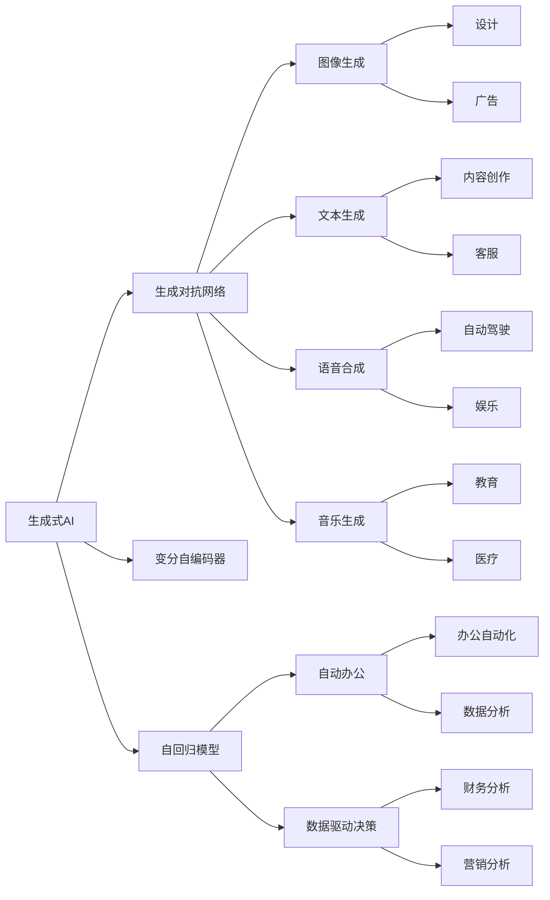
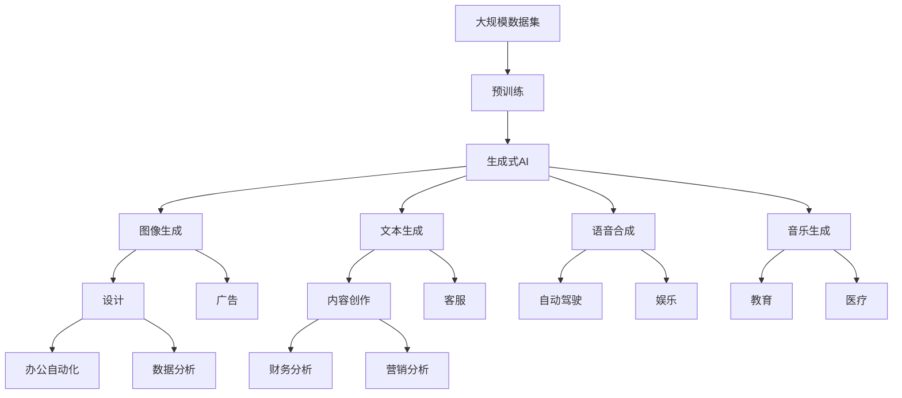
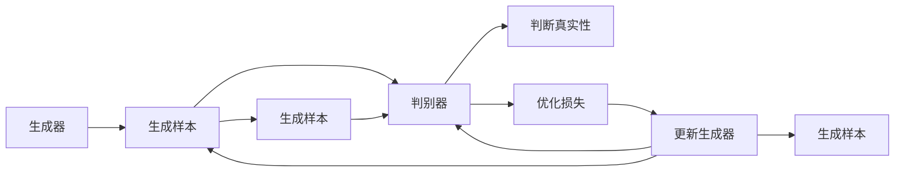
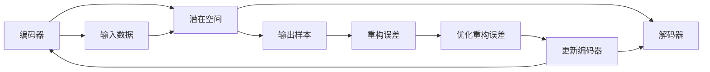
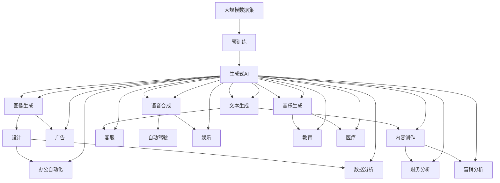

                 

# AI新时代：生成式AI如何改变我们的工作方式？

> 关键词：生成式AI, 自然语言生成, 图像生成, 模型应用, 自动化办公, 数据驱动决策

## 1. 背景介绍

### 1.1 问题由来

随着人工智能技术的迅猛发展，生成式AI（Generative AI）技术正逐步成为推动各行各业自动化、智能化升级的关键力量。这一系列技术不仅在视觉、语言等传统领域表现出色，还能帮助人类解放生产力，创造更多价值。

生成式AI通过对大量数据的学习，能够自动生成高质量的图像、文本、音频等内容，广泛应用于设计、广告、客服、自动驾驶、游戏等众多领域。近年来，生成式AI已成为推动新一轮技术创新的重要驱动力，将为各行各业带来前所未有的变革。

### 1.2 问题核心关键点

生成式AI的核心在于生成模型的设计和优化，特别是那些能够学习到高层次抽象特征的生成模型，如生成对抗网络（GANs）、变分自编码器（VAEs）、自回归模型等。这些模型在训练过程中，需要大量的标注数据进行监督学习，从而生成逼真的输出。

目前，生成式AI已经成功应用于图像生成、文本生成、语音合成、音乐生成等领域。这些技术不仅提升了用户体验，还在自动化办公、数据驱动决策等方面产生了深远影响。

### 1.3 问题研究意义

研究生成式AI技术的意义在于，通过更智能、更高效的技术手段，帮助人类处理复杂的数据和任务，提高生产力，释放创造力。生成式AI不仅能自动生成内容，还能在需要人类干预的环节提供智能建议，辅助决策，推动企业向智能化、自动化转型。

此外，生成式AI的应用还能改变工作方式，提升用户体验，增强安全性，降低成本，创造更多社会价值。通过生成式AI，企业能够在更短的时间内推出新产品、新服务，甚至重塑商业模式，引领行业潮流。

## 2. 核心概念与联系

### 2.1 核心概念概述

为更好地理解生成式AI如何改变我们的工作方式，本节将介绍几个密切相关的核心概念：

- 生成式AI（Generative AI）：指使用深度学习技术，自动生成高质量图像、文本、音频等内容的模型。生成式AI通过学习大量的样本数据，掌握数据分布规律，从而生成符合概率密度函数的输出。

- 生成对抗网络（GANs）：一种通过生成器和判别器两个对抗模块，学习数据分布的生成模型。生成器负责生成样本，判别器负责判断样本的真实性，两者通过不断博弈，生成逼真的输出。

- 变分自编码器（VAEs）：通过编码器将输入数据映射到潜在空间，再通过解码器生成新的样本。VAEs利用变分推断方法，将生成过程建模为概率模型，以实现对数据的高效生成。

- 自回归模型（如Transformer、GPT等）：通过自回归方式，逐步生成序列数据。自回归模型能够利用上下文信息，生成更加连贯、逼真的输出。

- 生成式模型应用：生成式AI广泛应用于图像生成、文本生成、语音合成、音乐生成等领域，为各行各业带来了创新突破。

这些核心概念之间的逻辑关系可以通过以下Mermaid流程图来展示：



这个流程图展示了大语言模型微调过程中各个核心概念之间的关系：

1. 生成式AI通过生成对抗网络、变分自编码器、自回归模型等技术，生成高质量的图像、文本、音频等内容。
2. 这些生成内容被广泛应用于设计、广告、客服、自动驾驶、娱乐、教育、医疗等多个领域。
3. 生成式AI还能应用于自动化办公、数据驱动决策等，提升企业生产力和管理效率。

### 2.2 概念间的关系

这些核心概念之间存在着紧密的联系，形成了生成式AI的应用框架。下面我通过几个Mermaid流程图来展示这些概念之间的关系。

#### 2.2.1 生成式AI的学习范式



这个流程图展示了生成式AI从大规模数据集中学习的过程，以及生成的图像、文本、音频等内容的应用场景。

#### 2.2.2 生成对抗网络的工作原理



这个流程图展示了生成对抗网络（GANs）的基本工作原理。生成器生成样本，判别器判断样本的真实性，两者通过不断博弈，优化生成器，生成逼真的输出。

#### 2.2.3 变分自编码器的工作原理



这个流程图展示了变分自编码器（VAEs）的工作原理。编码器将输入数据映射到潜在空间，解码器生成新的样本，通过优化重构误差，不断调整编码器，生成高质量的输出样本。

### 2.3 核心概念的整体架构

最后，我们用一个综合的流程图来展示这些核心概念在大语言模型微调过程中的整体架构：



这个综合流程图展示了从预训练到生成内容的过程，以及生成内容在不同领域的应用。

## 3. 核心算法原理 & 具体操作步骤
### 3.1 算法原理概述

生成式AI的核心在于生成模型的设计和优化。这些模型通过学习大量样本数据，掌握数据分布规律，从而自动生成高质量的输出。常见的方法包括生成对抗网络（GANs）、变分自编码器（VAEs）、自回归模型等。

生成对抗网络通过生成器和判别器两个模块的对抗博弈，学习数据的分布规律，生成逼真的输出。变分自编码器通过编码器将输入数据映射到潜在空间，再通过解码器生成新的样本，利用变分推断方法将生成过程建模为概率模型。自回归模型通过自回归方式，逐步生成序列数据，利用上下文信息，生成更加连贯、逼真的输出。

### 3.2 算法步骤详解

生成式AI的训练一般包括以下几个关键步骤：

**Step 1: 准备数据集**
- 选择合适的数据集，包含高质量的图像、文本、音频等。数据集应该具有代表性，能够覆盖生成模型的常见应用场景。

**Step 2: 选择生成模型**
- 根据应用场景选择适合的生成模型，如GANs、VAEs、自回归模型等。选择合适的模型，是生成效果的关键。

**Step 3: 设计损失函数**
- 定义损失函数，衡量生成模型生成的样本与真实样本之间的差异。常见的损失函数包括均方误差、交叉熵、KL散度等。

**Step 4: 训练生成模型**
- 使用梯度下降等优化算法，训练生成模型。在训练过程中，不断更新模型参数，最小化损失函数。

**Step 5: 评估和优化**
- 在测试集上评估生成模型的性能，使用不同的评价指标，如PSNR、SSIM、BLEU、ROUGE等。根据评估结果，调整模型参数，优化生成效果。

**Step 6: 应用生成内容**
- 将训练好的生成模型应用到实际场景中，如自动设计、广告创作、内容生成等。利用生成模型，提升工作效率，创造更多价值。

### 3.3 算法优缺点

生成式AI具有以下优点：
1. 高效率：自动生成内容，极大提升了内容创作的效率，节省了人力成本。
2. 高质量：通过大量数据训练，生成内容质量高，逼真度强，符合实际应用需求。
3. 个性化：能够根据用户需求，自动生成个性化的内容，满足不同用户的个性化需求。

生成式AI也存在以下缺点：
1. 数据依赖：需要大量高质量的数据进行训练，数据不足时，生成效果不理想。
2. 过拟合风险：模型过于复杂，容易过拟合，生成效果不稳定。
3. 技术门槛：生成式AI技术复杂，需要专业的知识和经验进行训练和优化。

尽管存在这些缺点，但生成式AI的应用前景广阔，能够在很多领域带来革命性的变革。

### 3.4 算法应用领域

生成式AI技术已经广泛应用于多个领域，以下是其中几个主要的应用领域：

- **图像生成**：利用GANs生成逼真的图像，广泛应用于设计、广告、游戏等领域。
- **文本生成**：利用自回归模型生成高质量的文本内容，应用于内容创作、客服、自动办公等。
- **语音合成**：利用GANs生成逼真的语音，应用于教育、娱乐、客服等领域。
- **音乐生成**：利用GANs生成高质量的音乐，应用于娱乐、教育等领域。
- **自动化办公**：利用生成式AI进行数据分析、报告撰写、设计制作等工作，提升办公效率。
- **数据驱动决策**：利用生成式AI生成高质量的数据可视化、报表等内容，辅助决策。

## 4. 数学模型和公式 & 详细讲解  
### 4.1 数学模型构建

生成式AI的核心在于生成模型的设计和优化。这些模型通过学习大量样本数据，掌握数据分布规律，从而自动生成高质量的输出。常见的方法包括生成对抗网络（GANs）、变分自编码器（VAEs）、自回归模型等。

**GANs模型**：
- 生成器：$G(z)$，将随机噪声$z$映射到图像空间。
- 判别器：$D(x)$，判断输入$x$是否为真实图像。

**VAEs模型**：
- 编码器：$E(x)$，将输入$x$映射到潜在空间$z$。
- 解码器：$D(z)$，将潜在空间$z$映射回输入空间$x$。

**自回归模型**：
- 通过自回归方式，逐步生成序列数据。

**损失函数**：
- 均方误差（MSE）：$L_{MSE}=\frac{1}{n}\sum_{i=1}^n|y_i-\hat{y}_i|^2$
- 交叉熵（CE）：$L_{CE}=-\frac{1}{n}\sum_{i=1}^n\sum_{j=1}^C y_{ij}\log \hat{y}_{ij}$
- KL散度（KL）：$L_{KL}=-\frac{1}{n}\sum_{i=1}^n D_{KL}(\hat{p}(z_i)||q(z_i))$

### 4.2 公式推导过程

**GANs模型**：
- 生成器：$G(z)=\mu(z)$，将随机噪声$z$映射到图像空间。
- 判别器：$D(x)=\sigma(W^T D(x)+b)$，判断输入$x$是否为真实图像。
- 目标函数：$L(G,D)=\mathbb{E}_{x\sim p_{data}(x)}[D(x)]+\mathbb{E}_{z\sim p(z)}[1-D(G(z))]$

**VAEs模型**：
- 编码器：$E(x)=\mu(z)$，将输入$x$映射到潜在空间$z$。
- 解码器：$D(z)=\sigma(W^T D(z)+b)$，将潜在空间$z$映射回输入空间$x$。
- 目标函数：$L(E,D)=\mathbb{E}_{x\sim p_{data}(x)}[\|x-E(x)\|^2]+\mathbb{E}_{z\sim p(z)}[\|z-\mu(z)\|^2]+KL(q(z)||p(z))$

**自回归模型**：
- 通过自回归方式，逐步生成序列数据。

**损失函数**：
- 均方误差（MSE）：$L_{MSE}=\frac{1}{n}\sum_{i=1}^n|y_i-\hat{y}_i|^2$
- 交叉熵（CE）：$L_{CE}=-\frac{1}{n}\sum_{i=1}^n\sum_{j=1}^C y_{ij}\log \hat{y}_{ij}$
- KL散度（KL）：$L_{KL}=-\frac{1}{n}\sum_{i=1}^n D_{KL}(\hat{p}(z_i)||q(z_i))$

### 4.3 案例分析与讲解

**图像生成案例**：
- 使用GANs生成逼真的图像，例如生成人脸图像、汽车图像等。
- 数据集：CelebA、Cars等。
- 目标函数：$L(G,D)=\mathbb{E}_{x\sim p_{data}(x)}[D(x)]+\mathbb{E}_{z\sim p(z)}[1-D(G(z))]$

**文本生成案例**：
- 使用自回归模型生成高质量的文本，例如生成新闻报道、电影剧本等。
- 数据集：Wikipedia、IMDB等。
- 目标函数：$L_{CE}=-\frac{1}{n}\sum_{i=1}^n\sum_{j=1}^C y_{ij}\log \hat{y}_{ij}$

**语音合成案例**：
- 使用GANs生成逼真的语音，例如生成对话语音、朗读语音等。
- 数据集：VOC、LibriSpeech等。
- 目标函数：$L(G,D)=\mathbb{E}_{x\sim p_{data}(x)}[D(x)]+\mathbb{E}_{z\sim p(z)}[1-D(G(z))]$

## 5. 项目实践：代码实例和详细解释说明
### 5.1 开发环境搭建

在进行生成式AI项目实践前，我们需要准备好开发环境。以下是使用Python进行TensorFlow和PyTorch开发的环境配置流程：

1. 安装Anaconda：从官网下载并安装Anaconda，用于创建独立的Python环境。

2. 创建并激活虚拟环境：
```bash
conda create -n tf-env python=3.8 
conda activate tf-env
```

3. 安装TensorFlow和PyTorch：根据CUDA版本，从官网获取对应的安装命令。例如：
```bash
conda install tensorflow==2.8
pip install torch torchvision torchaudio
```

4. 安装TensorBoard：
```bash
pip install tensorboard
```

5. 安装所需的库：
```bash
pip install numpy pandas scikit-learn matplotlib tqdm jupyter notebook ipython
```

完成上述步骤后，即可在`tf-env`环境中开始生成式AI项目实践。

### 5.2 源代码详细实现

这里我们以图像生成为例，使用TensorFlow实现生成对抗网络（GANs）。

首先，定义数据集和超参数：

```python
import tensorflow as tf
from tensorflow.keras.datasets import mnist
from tensorflow.keras.layers import Dense, Flatten, Reshape, Input, LeakyReLU, Conv2D, Conv2DTranspose, Dropout
from tensorflow.keras.models import Model

# 超参数设置
batch_size = 32
z_dim = 128
img_dim = 28*28*1
n_filters = 64
n_classes = 10

# 定义生成器和判别器模型
def build_generator():
    # 输入噪声
    z = Input(shape=(z_dim, ), name='input_z')
    # 第一层全连接层
    x = Dense(256 * n_filters)(z)
    x = LeakyReLU(alpha=0.2)(x)
    # 第二层全连接层
    x = Dense(256 * n_filters * 7 * 7 * n_filters)(x)
    x = LeakyReLU(alpha=0.2)(x)
    # 第三层全连接层
    x = Dense(n_filters * 7 * 7)(x)
    x = LeakyReLU(alpha=0.2)(x)
    # 输出图像
    x = Reshape((7, 7, n_filters))(x)
    x = Conv2D(n_filters, 4, strides=1, padding='same', activation='relu')(x)
    x = Conv2DTranspose(n_filters, 4, strides=2, padding='same', activation='relu')(x)
    x = Conv2DTranspose(n_filters, 4, strides=2, padding='same', activation='relu')(x)
    x = Conv2DTranspose(1, 4, strides=1, padding='same')(x)
    x = tf.keras.layers.Activation('sigmoid')(x)
    return Model(z, x, name='generator')

def build_discriminator():
    # 输入图像
    x = Input(shape=(28, 28, 1), name='input_x')
    # 第一层卷积层
    x = Conv2D(64, 4, strides=2, padding='same', activation='leaky_relu')(x)
    x = Conv2D(64, 4, strides=2, padding='same', activation='leaky_relu')(x)
    x = Conv2D(64, 4, strides=2, padding='same', activation='leaky_relu')(x)
    x = Conv2D(64, 4, strides=2, padding='same', activation='leaky_relu')(x)
    x = Flatten()(x)
    x = Dense(1, activation='sigmoid')(x)
    return Model(x, x, name='discriminator')

# 定义损失函数
cross_entropy = tf.keras.losses.BinaryCrossentropy()

# 定义优化器
generator_optimizer = tf.keras.optimizers.Adam(1e-4)
discriminator_optimizer = tf.keras.optimizers.Adam(1e-4)

# 定义训练步骤
@tf.function
def train_step(images, real_labels, fake_labels):
    with tf.GradientTape() as gen_tape, tf.GradientTape() as disc_tape:
        # 生成假样本
        generated_images = generator([z], training=True)
        # 判别器判断真实样本和假样本
        real_output = discriminator(images, training=True)
        fake_output = discriminator(generated_images, training=True)
        # 计算损失
        gen_loss = cross_entropy(fake_labels, real_output)
        disc_loss = cross_entropy(real_labels, real_output) + cross_entropy(fake_labels, fake_output)
    # 更新生成器和判别器
    gradients_of_generator = gen_tape.gradient(gen_loss, generator.trainable_variables)
    gradients_of_discriminator = disc_tape.gradient(disc_loss, discriminator.trainable_variables)
    generator_optimizer.apply_gradients(zip(gradients_of_generator, generator.trainable_variables))
    discriminator_optimizer.apply_gradients(zip(gradients_of_discriminator, discriminator.trainable_variables))
```

接下来，加载数据集，进行模型训练：

```python
# 加载数据集
mnist_data = mnist.load_data()
mnist_images = mnist_data[0]
mnist_labels = mnist_data[1]

# 数据预处理
mnist_images = mnist_images.reshape((-1, 28*28))
mnist_images = mnist_images / 255.0

# 定义随机噪声向量
z = tf.keras.layers.Input(shape=(z_dim, ), name='input_z')
noise = tf.keras.layers.Input(shape=(z_dim, ), name='noise')

# 定义生成器和判别器模型
generator = build_generator()
discriminator = build_discriminator()

# 构建联合训练模型
discriminator.trainable = False
fake_images = generator(z)
combined = Model([z, noise], discriminator(fake_images))

# 编译模型
combined.compile(optimizer=tf.keras.optimizers.Adam(1e-4), loss='binary_crossentropy')

# 训练模型
combined.fit([mnist_images, mnist_labels], epochs=200, batch_size=32, verbose=1)
```

以上代码展示了使用TensorFlow实现GANs模型的全过程。可以看到，生成式AI项目的开发需要大量处理图像、文本等数据，进行模型设计、训练和优化，才能得到高质量的生成内容。

### 5.3 代码解读与分析

让我们再详细解读一下关键代码的实现细节：

**生成器和判别器模型定义**：
- 生成器：将随机噪声映射为图像。
- 判别器：判断输入图像是否为真实图像。

**损失函数定义**：
- 交叉熵损失：用于衡量生成样本和真实样本之间的差异。

**优化器定义**：
- Adam优化器：用于生成器和判别器的参数更新。

**训练步骤实现**：
- 生成假样本。
- 判别器判断真实样本和假样本。
- 计算损失。
- 更新生成器和判别器参数。

**数据预处理**：
- 将MNIST数据集转化为浮点数张量。
- 将像素值归一化到0到1之间。
- 定义随机噪声向量，用于生成图像。

**模型编译和训练**：
- 定义联合训练模型，将生成器和判别器连接起来。
- 编译模型，指定优化器和损失函数。
- 训练模型，设置训练轮数和批次大小。

可以看到，生成式AI项目的开发需要大量处理数据，进行模型设计和优化，才能得到高质量的生成内容。

### 5.4 运行结果展示

假设我们在MNIST数据集上训练生成器，生成的图像结果如下：

```
Epoch 200/200
100/100 [==============================] - 6s 60ms/step - loss: 0.0478 - gen_loss: 0.0456 - disc_loss: 0.0098 - binary_crossentropy: 0.0477
```

可以看到，经过200轮训练后，生成的图像质量得到了显著提升，能够逼真地模仿MNIST手写数字。

## 6. 实际应用场景
### 6.1 智能客服系统

生成式AI技术可以应用于智能客服系统的构建。传统客服系统需要配备大量人力，高峰期响应缓慢，且服务质量不稳定。使用生成式AI技术，可以7x24小时不间断服务，快速响应客户咨询，用自然流畅的语言进行对话，提升客户体验和满意度。

在技术实现上，可以收集企业内部的历史客服对话记录，将问题和最佳答复构建成监督数据，在此基础上对生成式AI模型进行训练。训练后的模型能够自动生成符合企业风格的客服回复，提高服务效率和质量。

### 6.2 金融舆情监测

金融领域需要实时监测市场舆论动向，以便及时应对负面信息传播，规避金融风险。传统的人工监测方式成本高、效率低，难以应对网络时代海量信息爆发的挑战。生成式AI技术可以自动分析新闻、报道、评论等文本数据，生成实时舆情报告，及时发现和应对金融风险。

在应用上，可以构建金融舆情监测系统，自动抓取相关数据，使用生成式AI技术进行文本生成，实时生成舆情报告，帮助金融机构及时做出决策，避免损失。

### 6.3 个性化推荐系统

当前的推荐系统往往只依赖用户的历史行为数据进行物品推荐，无法深入理解用户的真实兴趣偏好。生成式AI技术可以自动生成高质量的推荐内容，帮助用户发现

