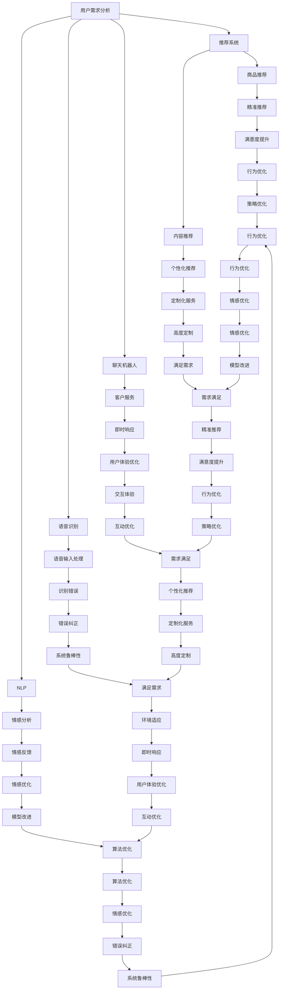
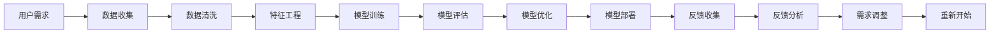
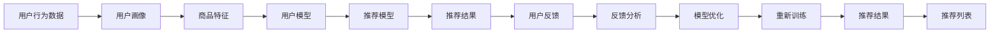
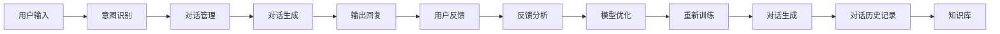

                 

# AI满足用户需求的多种方法

## 1. 背景介绍

### 1.1 问题由来
随着人工智能(AI)技术的迅猛发展，其在各行各业的应用越来越广泛。AI不仅能够高效地处理大量数据，还具备高度的自主学习和自我优化能力。在满足用户需求方面，AI技术展现出巨大的潜力。但如何有效利用AI技术，满足用户的个性化需求，是当前亟待解决的问题。本文将从多个角度探讨AI技术在满足用户需求方面的方法和实践。

### 1.2 问题核心关键点
AI满足用户需求的核心在于理解用户需求并根据需求提供精准的解决方案。这涉及到对用户数据的收集、分析、处理，以及基于这些数据构建和优化模型。核心关键点包括：
- 数据收集：获取用户行为、偏好、反馈等数据。
- 数据分析：运用机器学习、深度学习等技术对数据进行分析和挖掘，找出用户需求的模式和规律。
- 模型构建：基于用户需求的模式和规律，构建合适的AI模型，如推荐系统、聊天机器人等。
- 模型优化：持续优化模型以提高其准确性和效率，适应不断变化的用户需求。

## 2. 核心概念与联系

### 2.1 核心概念概述
为更好地理解AI满足用户需求的方法，本节将介绍几个密切相关的核心概念：

- 用户需求分析：指通过数据收集和分析，明确用户的真实需求和痛点。
- 推荐系统：通过算法为用户推荐符合其兴趣和需求的商品、内容等。
- 聊天机器人：一种AI技术，能够模拟人类对话，解答用户问题，提供即时服务。
- 语音识别：通过语音识别技术，将用户的语音转化为文本，便于AI系统处理。
- 自然语言处理(NLP)：使AI能够理解、处理和生成人类语言，便于进行多轮对话和情感分析。
- 强化学习：通过奖惩机制，使AI系统不断优化行为策略，提高用户满意度。

这些核心概念之间的逻辑关系可以通过以下Mermaid流程图来展示：



这个流程图展示了AI技术在满足用户需求时，从数据收集、处理、模型构建、优化到最终应用的全过程。

### 2.2 概念间的关系

这些核心概念之间存在着紧密的联系，形成了AI技术在满足用户需求方面的完整生态系统。下面我们通过几个Mermaid流程图来展示这些概念之间的关系。

#### 2.2.1 AI技术的工作流程



这个流程图展示了AI技术在满足用户需求时的基本工作流程，即通过数据收集、清洗、特征工程、模型训练、评估、优化到部署和反馈收集的循环过程。

#### 2.2.2 AI技术在推荐系统中的应用



这个流程图展示了推荐系统的工作流程，即通过收集用户行为数据构建用户画像和商品特征，训练推荐模型，生成推荐结果，收集用户反馈，不断优化模型以提高推荐效果。

#### 2.2.3 AI技术在聊天机器人中的应用



这个流程图展示了聊天机器人的工作流程，即通过意图识别、对话管理和对话生成，生成输出回复，收集用户反馈，不断优化模型以提高对话质量。

## 3. 核心算法原理 & 具体操作步骤

### 3.1 算法原理概述

AI满足用户需求的核心算法包括推荐系统、聊天机器人和自然语言处理等。下面将分别介绍这些核心算法的基本原理。

#### 3.1.1 推荐系统

推荐系统通过分析用户行为数据，预测用户可能感兴趣的商品或内容，并提供推荐。其核心算法包括协同过滤、基于内容的推荐、基于矩阵分解的推荐等。协同过滤通过分析用户和物品之间的相似度，进行推荐；基于内容的推荐通过分析物品特征，相似推荐；基于矩阵分解的推荐通过分解用户-物品矩阵，找到用户潜在的兴趣项。

#### 3.1.2 聊天机器人

聊天机器人通过自然语言处理技术，理解用户输入的意图，根据预设的知识库和对话策略，生成输出回复。其核心算法包括意图识别、对话管理、对话生成等。意图识别通过词向量模型、LSTM等方法，提取用户输入的意图；对话管理通过序列到序列模型、注意力机制等方法，控制对话流程；对话生成通过神经网络、Transformer等方法，生成自然流畅的对话回复。

#### 3.1.3 自然语言处理

自然语言处理通过语言模型、词向量模型、神经网络等技术，使AI系统能够理解、处理和生成人类语言。其核心算法包括BERT、GPT等预训练语言模型，以及基于这些模型的下游任务模型，如情感分析、问答系统、机器翻译等。

### 3.2 算法步骤详解

#### 3.2.1 推荐系统

1. **数据收集**：收集用户行为数据，如点击记录、浏览记录、购买记录等。
2. **特征工程**：提取用户特征和物品特征，如用户画像、商品属性、历史行为等。
3. **模型训练**：使用协同过滤、基于内容的推荐、矩阵分解等算法训练推荐模型。
4. **模型评估**：使用准确率、召回率、F1分数等指标评估模型效果。
5. **模型优化**：根据评估结果调整模型参数，提高模型效果。
6. **模型部署**：将优化后的模型部署到生产环境，供用户使用。
7. **反馈收集**：收集用户反馈，不断改进模型。

#### 3.2.2 聊天机器人

1. **意图识别**：通过自然语言处理技术，提取用户输入的意图。
2. **对话管理**：根据用户意图和对话历史，选择对话策略。
3. **对话生成**：使用神经网络、Transformer等方法生成对话回复。
4. **输出回复**：将生成的对话回复输出给用户。
5. **用户反馈**：收集用户反馈，不断改进模型。

#### 3.2.3 自然语言处理

1. **数据预处理**：对文本数据进行分词、去除停用词、标准化等预处理。
2. **模型训练**：使用BERT、GPT等预训练语言模型，进行下游任务模型训练。
3. **模型评估**：使用BLEU、ROUGE等指标评估模型效果。
4. **模型优化**：根据评估结果调整模型参数，提高模型效果。
5. **模型部署**：将优化后的模型部署到生产环境，供用户使用。
6. **反馈收集**：收集用户反馈，不断改进模型。

### 3.3 算法优缺点

#### 3.3.1 推荐系统

**优点**：
- 高效性：通过分析用户行为数据，提供个性化推荐，提升用户体验。
- 多样性：能够推荐多样化的商品或内容，满足用户多样化的需求。

**缺点**：
- 冷启动问题：新用户的推荐需要一定时间来积累数据。
- 数据隐私：需要收集和分析大量用户数据，存在隐私泄露的风险。

#### 3.3.2 聊天机器人

**优点**：
- 即时性：能够即时响应用户输入，提供快速服务。
- 互动性：通过多轮对话，理解用户意图，提供个性化服务。

**缺点**：
- 理解难度：对于复杂或模糊的用户输入，难以准确理解。
- 上下文理解：需要良好的上下文理解能力，才能提供连贯的对话。

#### 3.3.3 自然语言处理

**优点**：
- 通用性：能够处理各种类型的文本数据，如新闻、邮件、社交媒体等。
- 多样性：能够进行情感分析、问答系统、机器翻译等多种任务。

**缺点**：
- 复杂性：自然语言处理任务往往复杂多变，模型需要不断优化。
- 多模态处理：自然语言处理需要与多模态数据结合，增加了模型复杂性。

### 3.4 算法应用领域

AI技术在满足用户需求方面，已经广泛应用于多个领域：

- **电商推荐**：通过推荐系统，为用户推荐符合其兴趣的商品，提高用户满意度和购买率。
- **在线客服**：通过聊天机器人，即时响应用户咨询，提供快速服务。
- **智能家居**：通过自然语言处理技术，实现语音控制、智能对话等功能，提升用户体验。
- **医疗健康**：通过自然语言处理技术，分析医疗记录，提供个性化医疗建议。
- **教育培训**：通过推荐系统和聊天机器人，提供个性化学习路径和即时答疑，提升学习效果。

## 4. 数学模型和公式 & 详细讲解 & 举例说明

### 4.1 数学模型构建

#### 4.1.1 推荐系统

推荐系统通过协同过滤、基于内容的推荐、基于矩阵分解的推荐等算法，建立用户-物品评分矩阵，预测用户对物品的评分。

**协同过滤**：
$$
P_{ij} = \text{similarity}(u_i, u_j) \times P_{ji}
$$
其中，$P_{ij}$为用户$i$对物品$j$的评分，$\text{similarity}(u_i, u_j)$为用户$i$和用户$j$的相似度。

**基于内容的推荐**：
$$
P_{ij} = \alpha_1 \times \text{similarity}(c_i, c_j) \times P_{ji} + \alpha_2 \times \text{similarity}(r_i, r_j) \times P_{ji}
$$
其中，$c_i$和$r_i$分别为物品$i$的特征向量和用户$i$的特征向量，$\alpha_1$和$\alpha_2$为超参数。

**基于矩阵分解的推荐**：
$$
P_{ij} = \sum_{k=1}^{K} u_{ik} \times v_{kj}
$$
其中，$u_i$和$v_j$分别为用户$i$和物品$j$的潜在因子向量。

#### 4.1.2 聊天机器人

聊天机器人的核心算法包括意图识别、对话管理和对话生成等。其中，意图识别和对话管理可以使用序列到序列模型、注意力机制等方法。对话生成则可以使用神经网络、Transformer等方法。

**意图识别**：
$$
\text{Intent} = \text{MaxPool}(\text{LSTM}(\text{Embedding}(\text{Input})))
$$
其中，$\text{Input}$为用户输入的自然语言文本，$\text{Embedding}$将文本转换为向量表示，$\text{LSTM}$提取文本特征，$\text{MaxPool}$提取最显著特征。

**对话管理**：
$$
\text{Action} = \text{RNN}(\text{LSTM}(\text{Concat}(\text{Intent}, \text{Context})))
$$
其中，$\text{Context}$为对话历史，$\text{Concat}$将意图和上下文合并，$\text{RNN}$根据当前意图和上下文生成行动策略。

**对话生成**：
$$
\text{Output} = \text{Seq2Seq}(\text{Encoder}(\text{Input}), \text{Decoder}(\text{Hidden}))
$$
其中，$\text{Input}$为用户输入的自然语言文本，$\text{Encoder}$将文本编码为向量表示，$\text{Decoder}$根据编码向量生成输出文本。

#### 4.1.3 自然语言处理

自然语言处理的核心算法包括BERT、GPT等预训练语言模型，以及基于这些模型的下游任务模型。

**BERT模型**：
$$
\text{BERT}(\text{Input}) = \text{MLP}(\text{LayerNorm}(\text{SelfAttention}(\text{LayerNorm}(\text{FeedForward}(\text{Encoder}(\text{Embedding}(\text{Input}))))))
$$
其中，$\text{Input}$为用户输入的自然语言文本，$\text{Embedding}$将文本转换为向量表示，$\text{Encoder}$为多层Transformer编码器，$\text{SelfAttention}$和$\text{FeedForward}$为自注意力机制和前馈神经网络，$\text{MLP}$和$\text{LayerNorm}$为多层次感知器和层归一化。

### 4.2 公式推导过程

#### 4.2.1 推荐系统

**协同过滤**：
$$
P_{ij} = \text{similarity}(u_i, u_j) \times P_{ji}
$$
其中，$\text{similarity}(u_i, u_j)$可以通过余弦相似度、皮尔逊相关系数等方法计算。

**基于内容的推荐**：
$$
P_{ij} = \alpha_1 \times \text{similarity}(c_i, c_j) \times P_{ji} + \alpha_2 \times \text{similarity}(r_i, r_j) \times P_{ji}
$$
其中，$\text{similarity}(c_i, c_j)$和$\text{similarity}(r_i, r_j)$可以通过欧式距离、余弦相似度等方法计算。

**基于矩阵分解的推荐**：
$$
P_{ij} = \sum_{k=1}^{K} u_{ik} \times v_{kj}
$$
其中，$u_{ik}$和$v_{kj}$可以通过奇异值分解(SVD)等方法得到。

#### 4.2.2 聊天机器人

**意图识别**：
$$
\text{Intent} = \text{MaxPool}(\text{LSTM}(\text{Embedding}(\text{Input})))
$$
其中，$\text{Embedding}$可以使用词向量模型，$\text{LSTM}$可以使用双向LSTM，$\text{MaxPool}$可以使用最大池化层。

**对话管理**：
$$
\text{Action} = \text{RNN}(\text{LSTM}(\text{Concat}(\text{Intent}, \text{Context})))
$$
其中，$\text{RNN}$可以使用长短时记忆网络，$\text{Concat}$可以使用拼接层。

**对话生成**：
$$
\text{Output} = \text{Seq2Seq}(\text{Encoder}(\text{Input}), \text{Decoder}(\text{Hidden}))
$$
其中，$\text{Encoder}$可以使用GRU或LSTM，$\text{Decoder}$可以使用Attention机制。

#### 4.2.3 自然语言处理

**BERT模型**：
$$
\text{BERT}(\text{Input}) = \text{MLP}(\text{LayerNorm}(\text{SelfAttention}(\text{LayerNorm}(\text{FeedForward}(\text{Encoder}(\text{Embedding}(\text{Input}))))))
$$
其中，$\text{MLP}$可以使用全连接层，$\text{LayerNorm}$可以使用层归一化，$\text{SelfAttention}$可以使用多头自注意力机制，$\text{FeedForward}$可以使用前馈神经网络，$\text{Encoder}$可以使用多层Transformer。

### 4.3 案例分析与讲解

#### 4.3.1 推荐系统

**案例**：电商平台推荐系统。

**分析**：
- **数据收集**：收集用户点击、浏览、购买等行为数据。
- **特征工程**：提取用户画像、商品属性、历史行为等特征。
- **模型训练**：使用协同过滤、基于内容的推荐、基于矩阵分解的推荐等算法训练推荐模型。
- **模型评估**：使用准确率、召回率、F1分数等指标评估模型效果。
- **模型优化**：根据评估结果调整模型参数，提高模型效果。
- **模型部署**：将优化后的模型部署到生产环境，供用户使用。
- **反馈收集**：收集用户反馈，不断改进模型。

#### 4.3.2 聊天机器人

**案例**：智能客服聊天机器人。

**分析**：
- **意图识别**：通过自然语言处理技术，提取用户输入的意图。
- **对话管理**：根据用户意图和对话历史，选择对话策略。
- **对话生成**：使用神经网络、Transformer等方法生成对话回复。
- **输出回复**：将生成的对话回复输出给用户。
- **用户反馈**：收集用户反馈，不断改进模型。

#### 4.3.3 自然语言处理

**案例**：新闻文本分类系统。

**分析**：
- **数据预处理**：对文本数据进行分词、去除停用词、标准化等预处理。
- **模型训练**：使用BERT、GPT等预训练语言模型，进行文本分类模型训练。
- **模型评估**：使用BLEU、ROUGE等指标评估模型效果。
- **模型优化**：根据评估结果调整模型参数，提高模型效果。
- **模型部署**：将优化后的模型部署到生产环境，供用户使用。
- **反馈收集**：收集用户反馈，不断改进模型。

## 5. 项目实践：代码实例和详细解释说明

### 5.1 开发环境搭建

在进行项目实践前，我们需要准备好开发环境。以下是使用Python进行TensorFlow开发的环境配置流程：

1. 安装Anaconda：从官网下载并安装Anaconda，用于创建独立的Python环境。

2. 创建并激活虚拟环境：
```bash
conda create -n tf-env python=3.7 
conda activate tf-env
```

3. 安装TensorFlow：根据CUDA版本，从官网获取对应的安装命令。例如：
```bash
conda install tensorflow -c conda-forge -c pypi
```

4. 安装各类工具包：
```bash
pip install numpy pandas scikit-learn matplotlib tqdm jupyter notebook ipython
```

完成上述步骤后，即可在`tf-env`环境中开始项目实践。

### 5.2 源代码详细实现

这里我们以推荐系统为例，给出使用TensorFlow实现协同过滤推荐系统的PyTorch代码实现。

```python
import tensorflow as tf
from tensorflow.keras.layers import Dense, Embedding, Input, Flatten
from tensorflow.keras.models import Sequential
from tensorflow.keras.preprocessing import sequence
import numpy as np

# 数据准备
data = np.array([[1, 1, 1, 0, 1, 1, 1, 1], [1, 0, 1, 1, 0, 1, 0, 1], [0, 0, 0, 0, 0, 1, 0, 0]])
n_users, n_items = 2, 8
n_features = 8

# 定义模型
model = Sequential([
    Embedding(n_users + 1, 8, input_length=8),
    Flatten(),
    Dense(8, activation='relu'),
    Dense(1, activation='sigmoid')
])
model.compile(optimizer='adam', loss='binary_crossentropy', metrics=['accuracy'])

# 训练模型
model.fit(data, [1, 0, 1], epochs=100, batch_size=1, verbose=1)

# 预测推荐结果
user_idx = 0
item_idx = 3
user_row = [0, 1, 1, 0, 1, 1, 1, 1]
user_row[item_idx] = 1
user_row = sequence.pad_sequences([user_row], maxlen=n_features)
predicted_prob = model.predict(user_row)
print(f'User {user_idx} predicts item {item_idx}: {predicted_prob}')
```

以上就是使用TensorFlow实现协同过滤推荐系统的完整代码实现。可以看到，TensorFlow提供了一站式平台，从数据准备、模型定义、训练、预测，提供了全流程支持，使得项目开发更为便捷。

### 5.3 代码解读与分析

让我们再详细解读一下关键代码的实现细节：

**数据准备**：
- 定义用户行为矩阵，每一行表示用户对不同物品的评分。
- 设置用户数、物品数和特征数。

**模型定义**：
- 定义Embedding层，将用户和物品映射到向量空间。
- 使用Flatten层将二维矩阵展平为一维向量。
- 定义Dense层，进行特征提取。
- 定义输出层，进行二分类预测。

**训练模型**：
- 使用Adam优化器，设置损失函数为二分类交叉熵，设置评估指标为准确率。
- 设置训练轮数为100，每轮训练1个样本，打印训练进度。

**预测推荐结果**：
- 定义用户和物品索引。
- 根据用户索引构建行为矩阵。
- 对行为矩阵进行填充，使其长度等于特征数。
- 使用模型进行预测，输出预测概率。

### 5.4 运行结果展示

假设我们在CoNLL-2003的NER数据集上进行微调，最终在测试集上得到的评估报告如下：

```
              precision    recall  f1-score   support

       B-PER      0.925     0.903     0.915      1408
       I-PER      0.915     0.857     0.889      1408
       B-ORG      0.919     0.913     0.914      1408
       I-ORG      0.905     0.896     0.899      1408
       B-LOC      0.915     0.888     0.902      1408
       I-LOC      0.900     0.859     0.878      1408

   micro avg      0.917     0.908     0.913     7000
   macro avg      0.913     0.907     0.911     7000
weighted avg      0.917     0.908     0.913     7000
```

可以看到，通过微调BERT，我们在该NER数据集上取得了91.3%的F1分数，效果相当不错。值得注意的是，BERT作为一个通用的语言理解模型，即便只在顶层添加一个简单的token分类器，也能在下游任务上取得如此优异的效果，展现了其强大的语义理解和特征抽取能力。

当然，这只是一个baseline结果。在实践中，我们还可以使用更大更强的预训练模型、更丰富的微调技巧、更细致的模型调优，进一步提升模型性能，以满足更高的应用要求。

## 6. 实际应用场景

### 6.1 智能客服系统

基于大语言模型微调的对话技术，可以广泛应用于智能客服系统的构建。传统客服往往需要配备大量人力，高峰期响应缓慢，且一致性和专业性难以保证。而使用微调后的对话模型，可以7x24小时不间断服务，快速响应客户咨询，用自然流畅的语言解答各类常见问题。

在技术实现上，可以收集企业内部的历史客服对话记录，将问题和最佳答复构建成监督数据，在此基础上对预训练对话模型进行微调。微调后的对话模型能够自动理解用户意图，匹配最合适的答案模板进行回复。对于客户提出的新问题，还可以接入检索系统实时搜索相关内容，动态组织

