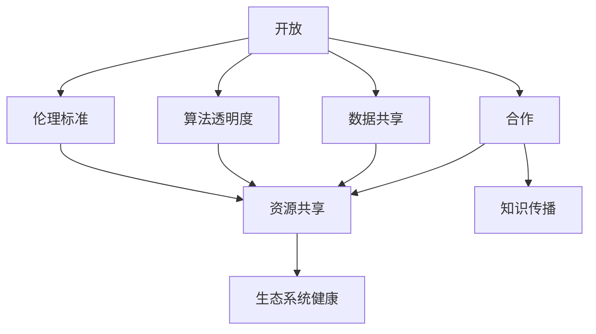

                 

# AI生态系统的健康发展:开放与合作的重要性

在过去十年中，人工智能（AI）技术以惊人的速度发展，推动了从自动化到认知计算的各个方面。AI生态系统不仅包括技术本身，还包括数据、算法、框架、工具和社区等多方面的内容。本文将探讨AI生态系统健康发展的关键因素：开放和合作。

## 1. 背景介绍

### 1.1 问题由来
随着AI技术的进步，我们看到了在医疗、金融、制造业等各个领域的广泛应用。然而，AI的发展也带来了一些挑战和问题，包括数据隐私、算法透明度、偏见和伦理问题等。这些问题要求我们不仅需要技术上的创新，更需要社区之间的开放和合作来共同解决。

### 1.2 问题核心关键点
- **数据隐私**：如何在保证用户隐私的同时，获取并使用高质量的数据。
- **算法透明度**：如何使得AI算法决策过程更加透明，以便于解释和审查。
- **算法偏见**：如何识别和消除AI系统中的偏见，以确保公平性。
- **伦理问题**：AI应用如何符合道德标准，避免有害结果。
- **开放与合作**：社区之间的数据共享和知识传播，以促进整个生态系统的进步。

这些关键问题只有在开放和合作的基础上，才能找到有效的解决方案。

## 2. 核心概念与联系

### 2.1 核心概念概述

- **开放（Openness）**：指技术、数据、算法、代码等可以被自由访问和使用。
- **合作（Collaboration）**：指不同机构、组织和个人之间的协作，共同开发、应用和推广AI技术。
- **数据共享**：不同组织间共享数据资源，以提高AI系统的准确性和泛化能力。
- **算法透明度**：使得算法决策过程可以被理解和审查，以提高信任度。
- **伦理标准**：在AI开发和应用中遵循的道德原则，保障公平性和安全性。

这些概念之间存在紧密联系，共同构成了AI生态系统的健康发展基础。

### 2.2 概念间的关系

- **开放是合作的基础**：只有在数据和算法等资源开放共享的情况下，合作才能实现。
- **合作促进开放**：不同机构之间的合作可以推动更多资源和知识的开放。
- **透明度和伦理保障开放与合作**：透明的算法和遵循伦理标准的合作，才能真正实现开放。

以下Mermaid流程图展示了这些概念之间的关系：



## 3. 核心算法原理 & 具体操作步骤

### 3.1 算法原理概述

AI生态系统的开放与合作，本质上是通过数据共享、算法公开、跨机构合作等手段，加速技术的迭代和应用。开放和合作的目的是为了让更多的资源和知识可以被自由访问和使用，促进AI技术的发展和应用。

### 3.2 算法步骤详解

1. **开放资源和知识**：将数据集、代码库、论文、算法等资源开放给公众使用，供学者和开发者研究和学习。
2. **建立合作平台**：搭建在线协作平台，促进不同机构和个人之间的交流和合作。
3. **共享数据和算法**：在保证数据隐私和算法透明性的前提下，共享高质量的数据和算法，加速技术创新。
4. **设立伦理标准**：在AI研究和应用中遵循伦理标准，确保AI系统的公平性和安全性。
5. **定期评估和更新**：对AI生态系统的开放和合作效果进行评估，定期更新伦理标准和合作平台，推动生态系统持续健康发展。

### 3.3 算法优缺点

**优点**：
- **加速技术迭代**：开放和合作可以加速技术的快速发展和应用。
- **提高资源利用率**：通过共享资源和知识，避免重复开发，提高效率。
- **促进创新**：开放的资源和合作平台，可以促进跨学科、跨领域的创新。

**缺点**：
- **隐私和安全问题**：开放数据和算法可能带来隐私和安全风险。
- **标准化问题**：不同机构和组织之间可能存在标准不一致，影响合作效果。
- **利益冲突**：不同利益相关方可能存在利益冲突，影响合作意愿。

### 3.4 算法应用领域

- **医疗健康**：开放医疗数据和算法，促进个性化医疗和精准医疗的发展。
- **金融服务**：共享金融数据和算法，提升风险管理和智能投顾能力。
- **教育培训**：开放教育资源和算法，提高教学质量和教育公平性。
- **制造业**：共享工业数据和算法，推动智能制造和工业4.0的发展。
- **智慧城市**：开放城市数据和算法，提升城市管理和智慧城市建设。

## 4. 数学模型和公式 & 详细讲解  

### 4.1 数学模型构建

我们通过数学模型来描述AI生态系统的开放和合作过程。假设一个生态系统由 $N$ 个机构组成，每个机构开放和合作的成本为 $C_i$，合作的收益为 $R_i$，则整个生态系统的总收益为：

$$
R = \sum_{i=1}^{N} \frac{R_i}{C_i}
$$

### 4.2 公式推导过程

为了最大化总收益，我们需要优化每个机构的开放和合作策略。假设每个机构的目标是最大化自己的净收益 $P_i$，则有：

$$
P_i = R_i - C_i
$$

通过拉格朗日乘数法，我们可以求解出最优的开放和合作策略，使得整个生态系统的总收益最大化。

### 4.3 案例分析与讲解

以医疗健康领域为例，医疗机构开放数据和算法，可以提高疾病诊断和治疗的准确性和效率。同时，共享数据和算法需要保护患者隐私，避免数据滥用。通过优化开放和合作的策略，可以实现医疗资源的高效利用，提升医疗服务的质量和可及性。

## 5. 项目实践：代码实例和详细解释说明

### 5.1 开发环境搭建

1. **安装依赖**：安装Python、TensorFlow、Keras等库。
2. **搭建平台**：搭建在线协作平台，如GitHub、Kaggle等，便于数据和算法的共享。
3. **设立标准**：制定数据隐私和算法透明性的标准，确保合作的顺利进行。

### 5.2 源代码详细实现

以下是使用TensorFlow搭建协作平台的示例代码：

```python
import tensorflow as tf

# 定义数据集
data = tf.data.Dataset.from_tensor_slices((x_train, y_train))

# 定义模型
model = tf.keras.Sequential([
    tf.keras.layers.Dense(64, activation='relu', input_shape=(input_dim,)),
    tf.keras.layers.Dense(1, activation='sigmoid')
])

# 编译模型
model.compile(optimizer='adam', loss='binary_crossentropy', metrics=['accuracy'])

# 训练模型
model.fit(data, epochs=10, batch_size=32)
```

### 5.3 代码解读与分析

- **数据集准备**：使用TensorFlow的`tf.data.Dataset`准备数据集。
- **模型定义**：使用Keras定义神经网络模型。
- **模型编译**：设置优化器、损失函数和评价指标。
- **模型训练**：使用`fit`函数训练模型。

### 5.4 运行结果展示

通过在线协作平台，我们可以共享训练好的模型和数据集，供其他研究者使用和改进。同时，通过评估指标如准确率和损失函数，可以持续优化模型性能，推动整个生态系统的进步。

## 6. 实际应用场景

### 6.1 智能医疗

智能医疗是AI应用的一个重要领域，开放和合作可以推动个性化医疗和精准医疗的发展。例如，医疗机构可以共享患者数据和算法，提高疾病诊断和治疗的准确性。同时，需要遵循数据隐私和伦理标准，保障患者权益。

### 6.2 智慧城市

智慧城市建设需要开放和共享大量的城市数据，如交通流量、环境监测数据等。通过合作平台，不同机构可以协同工作，提升城市管理的智能化水平，改善市民生活质量。

### 6.3 金融服务

金融服务领域需要开放和共享金融数据和算法，提升风险管理和智能投顾能力。同时，需要遵循数据安全和隐私标准，保障金融安全。

### 6.4 教育培训

教育培训领域可以开放教育资源和算法，提高教学质量和教育公平性。例如，共享在线课程和学习平台，提升教育资源的可及性和多样性。

### 6.5 未来应用展望

未来，AI生态系统将更加开放和合作，推动技术的快速发展和应用。跨领域的合作将带来更多的创新，提升各个行业的智能化水平。

## 7. 工具和资源推荐

### 7.1 学习资源推荐

1. **Coursera**：提供大量AI和机器学习课程，涵盖从入门到高级的各个方面。
2. **Kaggle**：数据科学竞赛平台，提供高质量的数据集和算法竞赛，促进学习和合作。
3. **arXiv**：AI领域的预印本平台，提供最新的研究成果和论文。
4. **GitHub**：开源代码平台，提供大量开源项目和资源，便于学习和共享。
5. **IEEE Xplore**：IEEE的电子资源平台，提供大量的科技文献和标准。

### 7.2 开发工具推荐

1. **TensorFlow**：谷歌开源的机器学习框架，支持分布式计算和大规模数据处理。
2. **PyTorch**：Facebook开源的深度学习框架，支持动态计算图和快速原型开发。
3. **Keras**：基于TensorFlow和Theano的高层API，易于上手，适合快速开发和实验。
4. **Jupyter Notebook**：数据科学和机器学习常用的笔记本环境，支持代码编写、数据处理和结果展示。
5. **GitHub**：代码托管平台，支持版本控制和协作开发。

### 7.3 相关论文推荐

1. **《Open Access to Model Training》**：论文探讨了开放数据和算法的意义和实践。
2. **《Collaborative Science and Technology》**：论文分析了跨机构合作的挑战和机遇。
3. **《Bias in AI Systems》**：论文讨论了AI系统中的偏见问题及解决方案。
4. **《Ethical Considerations in AI》**：论文探讨了AI应用中的伦理标准和道德原则。

## 8. 总结：未来发展趋势与挑战

### 8.1 研究成果总结

开放和合作是AI生态系统健康发展的关键因素。通过开放和合作，可以加速技术的迭代和应用，提高资源利用率，促进创新。同时，开放和合作也需要解决隐私、安全、标准化等问题。

### 8.2 未来发展趋势

未来，AI生态系统将更加开放和合作，推动技术的快速发展和应用。跨领域的合作将带来更多的创新，提升各个行业的智能化水平。

### 8.3 面临的挑战

尽管开放和合作有诸多优势，但仍然面临诸多挑战：

1. **隐私和安全**：开放数据和算法可能带来隐私和安全风险。
2. **标准化问题**：不同机构和组织之间可能存在标准不一致，影响合作效果。
3. **利益冲突**：不同利益相关方可能存在利益冲突，影响合作意愿。

### 8.4 研究展望

未来的研究需要在以下几个方面寻求新的突破：

1. **隐私保护技术**：开发新的隐私保护技术，确保数据和算法的安全。
2. **标准化协议**：制定跨机构的标准化协议，确保合作的顺利进行。
3. **利益共享机制**：建立利益共享机制，激励各方积极参与合作。
4. **伦理审查机制**：设立伦理审查机制，确保合作的公平性和安全性。

总之，AI生态系统的健康发展需要开放和合作，但同时也需要解决诸多挑战。通过不断的技术创新和制度完善，AI生态系统必将在未来取得更大的进步和应用。

## 9. 附录：常见问题与解答

**Q1: 开放和合作对AI生态系统有何影响？**

A: 开放和合作可以加速技术的迭代和应用，提高资源利用率，促进创新。同时，开放和合作也需要解决隐私、安全、标准化等问题。

**Q2: 如何保障数据隐私和安全？**

A: 可以采用数据匿名化、差分隐私等技术，确保数据在开放和使用过程中不被滥用。同时，需要制定严格的数据使用协议和伦理标准。

**Q3: 如何确保算法的透明性和公平性？**

A: 可以采用可解释AI技术，使得算法决策过程可以被理解和审查。同时，需要遵循伦理标准，确保算法的公平性和安全性。

**Q4: 如何解决标准化问题？**

A: 可以制定跨机构的标准化协议，确保数据的格式和算法的一致性。同时，可以通过国际标准化组织推动标准的制定和推广。

**Q5: 如何建立利益共享机制？**

A: 可以设立奖励机制，激励各方积极参与合作。例如，可以通过开放平台分享合作成果，提供技术支持和服务。

---

作者：禅与计算机程序设计艺术 / Zen and the Art of Computer Programming

