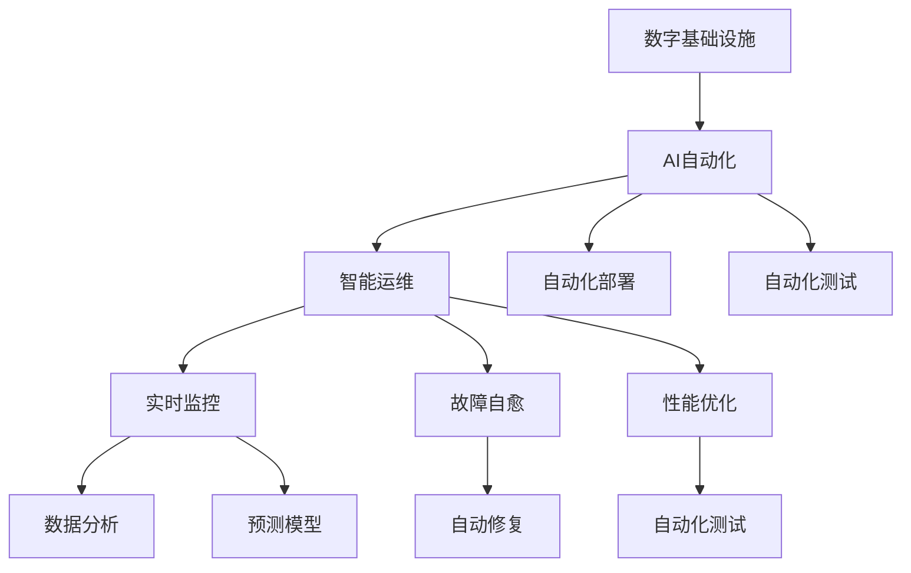
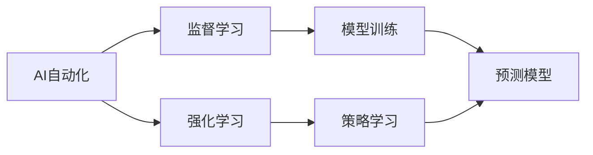
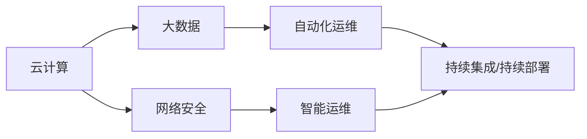
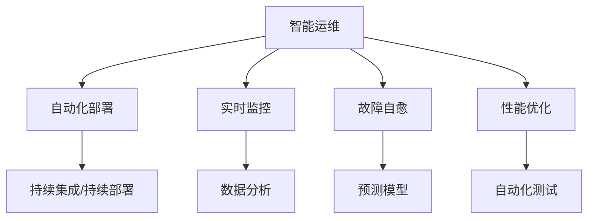
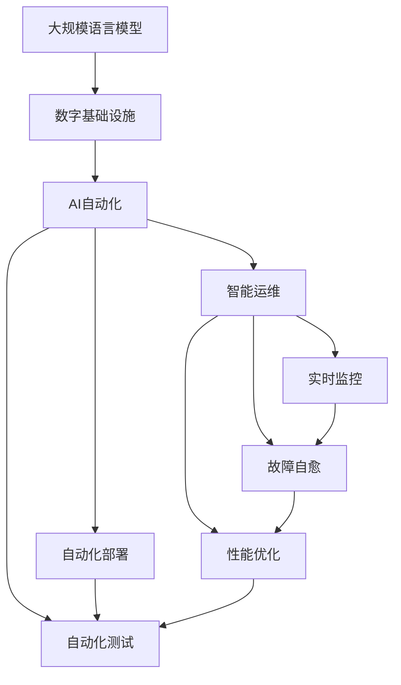

                 

# AI自动化数字基础设施

> 关键词：人工智能(AI), 自动化(Automation), 数字基础设施(Digital Infrastructure), 智能运维(Smart Operations), 云计算(Cloud Computing), 网络安全(Cybersecurity), 数据管理(Data Management)

## 1. 背景介绍

### 1.1 问题由来
在当今数字化时代，人工智能(AI)技术的应用范围日益广泛，从智能客服、自动驾驶到医疗诊断、金融分析，AI正渗透到各行各业。然而，随着AI应用的深入，其对数据、计算和存储资源的需求也在不断增长。这不仅对企业的IT基础设施提出了更高的要求，也对运维团队提出了严峻的挑战。

在传统IT架构中，运维工作往往依赖于人工手动操作，效率低下，且容易出现错误。例如，在部署和更新应用时，需要频繁的人工介入，增加了出错的风险。因此，如何自动化运维，提升运维效率，降低运维成本，成为了IT领域的迫切需求。

### 1.2 问题核心关键点
AI自动化数字基础设施的核心理念在于利用AI技术，对数字基础设施进行自动化管理。其核心在于以下几个方面：
- 自动化部署：通过AI算法自动完成应用部署、更新、回滚等操作。
- 智能监控：通过AI技术实时监测基础设施运行状态，自动分析和预测问题。
- 自愈能力：利用AI算法实现故障自愈，自动修复基础设施故障。
- 自动化测试：通过AI技术自动执行功能测试、性能测试等，确保应用质量。

这些核心功能通过构建在云计算、大数据、网络安全等数字基础设施之上，可以实现自动化、智能化的运维，提升企业的运营效率和IT基础设施的可靠性。

### 1.3 问题研究意义
AI自动化数字基础设施的研究与应用，对于提升企业IT基础设施的自动化水平，降低运维成本，提升运维效率，具有重要意义：

1. 提升IT基础设施的自动化水平。利用AI技术，可以实现自动化部署、智能监控、自愈和自动化测试等核心功能，大幅提升IT基础设施的自动化水平，减少人工干预。
2. 降低运维成本。通过自动化运维，减少人工干预和错误率，降低运维成本。
3. 提升运维效率。AI技术可以实时监控基础设施状态，自动分析和预测问题，及时采取措施，提升运维效率。
4. 保障IT基础设施的可靠性。通过自愈能力和智能监控，及时发现和解决基础设施故障，保障系统的稳定运行。
5. 促进企业数字化转型。AI自动化数字基础设施是企业数字化转型的重要工具，推动企业向智能化、自动化方向发展。

## 2. 核心概念与联系

### 2.1 核心概念概述

为更好地理解AI自动化数字基础设施的核心概念，本节将介绍几个密切相关的核心概念：

- AI自动化：利用AI技术对业务流程、IT基础设施进行自动化管理，减少人工干预，提升效率。
- 数字基础设施：包括云计算、大数据、网络安全、自动化运维等IT基础设施的建设和管理。
- 智能运维：利用AI技术对IT基础设施进行实时监控、故障自愈、性能优化等智能化的运维管理。
- 自动化部署：通过自动化脚本、持续集成/持续部署(CI/CD)等技术，自动完成应用的部署、更新和回滚等操作。
- 自动化测试：通过自动化测试工具，自动执行功能测试、性能测试、安全测试等，确保应用的质量和性能。

这些核心概念之间存在着紧密的联系，形成了AI自动化数字基础设施的完整生态系统。以下通过Mermaid流程图展示这些核心概念之间的关系：



这个流程图展示了大规模语言模型的核心概念及其之间的关系：

1. 数字基础设施是大规模语言模型运行的基础，包括云计算、大数据、网络安全等。
2. AI自动化是数字基础设施的核心功能，利用AI技术实现自动化管理。
3. 智能运维通过实时监控、故障自愈、性能优化等功能，提升数字基础设施的自动化水平。
4. 自动化部署和自动化测试分别通过持续集成/持续部署和自动化测试工具，自动完成应用部署和测试，提升效率和质量。
5. 数据分析和预测模型通过实时监控和故障自愈功能，自动分析和预测问题，提供支持。

这些核心概念共同构成了AI自动化数字基础设施的完整架构，使得大规模语言模型能够在自动化、智能化运维环境下更好地运行。

### 2.2 概念间的关系

这些核心概念之间存在着紧密的联系，形成了AI自动化数字基础设施的完整生态系统。以下通过几个Mermaid流程图展示这些概念之间的关系：

#### 2.2.1 AI自动化的学习范式



这个流程图展示了AI自动化的学习范式。AI自动化主要通过监督学习和强化学习两种方法，对数字基础设施进行自动化管理。监督学习主要用于模型训练，强化学习主要用于策略学习。

#### 2.2.2 数字基础设施的架构



这个流程图展示了数字基础设施的架构。数字基础设施包括云计算、大数据、网络安全等核心组件，通过自动化运维和智能运维功能，提升IT基础设施的自动化水平和运维效率。

#### 2.2.3 智能运维的自动化部署



这个流程图展示了智能运维与自动化部署的关系。智能运维通过实时监控、故障自愈和性能优化等核心功能，实现自动化部署、自动化测试等功能。

### 2.3 核心概念的整体架构

最后，我们用一个综合的流程图来展示这些核心概念在大规模语言模型自动化的数字基础设施中的应用：



这个综合流程图展示了从大规模语言模型到自动化的数字基础设施，再到智能运维的全过程。大规模语言模型通过数字基础设施的支撑，在AI自动化和智能运维环境下，实现自动化部署和测试，提升其应用效果和可靠性。

## 3. 核心算法原理 & 具体操作步骤
### 3.1 算法原理概述

AI自动化数字基础设施的核心算法原理主要包括以下几个方面：

1. 监督学习：利用标注数据，训练预测模型，实现数字基础设施的状态预测和故障检测。
2. 强化学习：通过策略学习，优化自动化运维策略，提升运维效率和效果。
3. 模型训练：通过大量的标注数据，训练各类预测模型和策略模型，实现自动化的决策和优化。
4. 数据融合：将实时数据与历史数据、专家知识等融合，提供更加全面、准确的决策支持。

这些核心算法通过构建在数字基础设施之上，实现了对大规模语言模型的自动化管理，提升了其应用效果和可靠性。

### 3.2 算法步骤详解

AI自动化数字基础设施的算法步骤主要包括以下几个关键步骤：

**Step 1: 数据收集与预处理**

- 收集数字基础设施的各类数据，包括应用部署日志、性能指标、故障信息、安全日志等。
- 对数据进行清洗、归一化和特征提取，生成可用于训练和预测的数据集。

**Step 2: 模型训练**

- 选择合适的算法（如监督学习、强化学习、集成学习等），在标注数据上进行模型训练。
- 通过交叉验证等技术，选择性能最优的模型，并进行参数调优。

**Step 3: 实时监控**

- 部署训练好的模型，实时监测数字基础设施的状态，生成各类指标和告警。
- 利用数据融合技术，将实时数据与历史数据和专家知识结合，提供更加准确的决策支持。

**Step 4: 故障自愈**

- 当检测到故障或异常时，根据预测模型和策略模型，自动执行故障修复操作。
- 利用日志分析和性能优化技术，确保修复操作的有效性和可靠性。

**Step 5: 性能优化**

- 利用预测模型和策略模型，实时调整数字基础设施的参数，提升应用性能和稳定性。
- 通过自动化测试和回滚机制，确保优化操作的正确性和稳定性。

**Step 6: 持续优化**

- 定期收集新的数据，对模型进行重新训练和优化，提升模型的准确性和鲁棒性。
- 利用A/B测试等技术，评估新策略和算法的性能，不断优化AI自动化数字基础设施。

通过上述步骤，AI自动化数字基础设施能够实现对大规模语言模型的自动化管理和优化，提升其应用效果和可靠性。

### 3.3 算法优缺点

AI自动化数字基础设施具有以下优点：

1. 自动化：减少了人工干预，提升了运维效率。
2. 智能化：通过实时监控和故障自愈，提升系统稳定性和可靠性。
3. 可扩展性：适用于各种规模的数字基础设施，能够灵活调整和扩展。
4. 灵活性：可以根据不同的应用场景和需求，定制化和优化算法和策略。

同时，也存在一些缺点：

1. 数据依赖：模型训练和优化依赖于大量的标注数据，数据获取和标注成本较高。
2. 模型复杂：算法复杂度高，需要较多的计算资源和时间。
3. 安全性：在数据安全和隐私保护方面，需要特别注意。
4. 可解释性：部分算法的决策过程较难解释，缺乏透明性。

### 3.4 算法应用领域

AI自动化数字基础设施的应用领域广泛，涵盖了多个行业和场景，包括：

1. 云计算：通过AI自动化，实现云资源的管理和优化，提升云服务质量。
2. 大数据：通过自动化运维，实现数据存储和处理的管理和优化，提升数据处理效率。
3. 网络安全：通过实时监控和故障自愈，提升网络安全防护能力，降低安全风险。
4. 智能运维：通过AI自动化，实现自动化部署、测试和优化，提升运维效率和效果。
5. 物联网：通过AI自动化，实现物联网设备的自动化管理，提升设备运行效率和可靠性。

## 4. 数学模型和公式 & 详细讲解 & 举例说明

### 4.1 数学模型构建

AI自动化数字基础设施的数学模型主要包括以下几个部分：

- 监督学习模型：用于状态预测和故障检测，如支持向量机(SVM)、随机森林(Random Forest)等。
- 强化学习模型：用于策略学习和优化，如Q-learning、Deep Q-Network等。
- 数据融合模型：用于数据融合和决策支持，如加权平均、时间序列预测等。

这些模型通过构建在数字基础设施之上，实现了对大规模语言模型的自动化管理。

### 4.2 公式推导过程

以支持向量机(SVM)为例，其数学模型如下：

$$
y = \begin{cases}
1, & \text{if } x_i \in C \\
0, & \text{otherwise}
\end{cases}
$$

其中，$x_i$ 为输入样本，$C$ 为分类边界，$y$ 为分类结果。SVM的目标是最小化超平面与最近类别样本的距离，即：

$$
\min_{w,b,\eta} \frac{1}{2} \|w\|^2 + C \sum_{i=1}^{n} \eta_i
$$

其中，$w$ 为超平面系数，$b$ 为偏置，$\eta_i$ 为松弛变量。

通过求解上述优化问题，可以得到最优的分类边界和超平面系数。在实际应用中，利用监督学习算法，训练大量的标注数据，即可实现数字基础设施的状态预测和故障检测。

### 4.3 案例分析与讲解

以云计算资源管理为例，SVM模型可以用于预测云资源的负载情况，从而实现资源调度和优化。具体步骤如下：

1. 收集云资源的负载数据，如CPU使用率、内存使用率等。
2. 对数据进行清洗和归一化处理。
3. 训练SVM模型，预测云资源的负载情况。
4. 根据预测结果，自动调整云资源的分配和调度。
5. 利用实时监控和故障自愈，确保资源调度的稳定性和可靠性。

通过SVM模型，可以实现云计算资源的自动化管理和优化，提升云服务质量。

## 5. 项目实践：代码实例和详细解释说明

### 5.1 开发环境搭建

在进行AI自动化数字基础设施的开发实践前，我们需要准备好开发环境。以下是使用Python进行PyTorch和TensorFlow开发的环境配置流程：

1. 安装Anaconda：从官网下载并安装Anaconda，用于创建独立的Python环境。

2. 创建并激活虚拟环境：
```bash
conda create -n my_env python=3.8 
conda activate my_env
```

3. 安装PyTorch和TensorFlow：
```bash
pip install torch torchvision torchaudio
pip install tensorflow tensorflow_addons
```

4. 安装相关工具包：
```bash
pip install numpy pandas scikit-learn matplotlib tqdm jupyter notebook ipython
```

完成上述步骤后，即可在`my_env`环境中开始AI自动化数字基础设施的开发实践。

### 5.2 源代码详细实现

这里我们以智能运维的故障自愈为例，给出使用PyTorch和TensorFlow对云资源进行故障自愈的PyTorch和TensorFlow代码实现。

首先，定义故障自愈的逻辑函数：

```python
from torch import nn
from tensorflow.keras.models import Sequential
from tensorflow.keras.layers import Dense
from tensorflow.keras.losses import mean_squared_error

class FaultTolerance(nn.Module):
    def __init__(self):
        super(FaultTolerance, self).__init__()
        self.fc1 = nn.Linear(2, 32)
        self.fc2 = nn.Linear(32, 2)
        self.loss = nn.CrossEntropyLoss()
    
    def forward(self, x):
        x = self.fc1(x)
        x = nn.Tanh()(x)
        x = self.fc2(x)
        x = nn.Softmax(dim=1)(x)
        return x

class FaultToleranceModel(Sequential):
    def __init__(self):
        super(FaultToleranceModel, self).__init__()
        self.add(Dense(32, input_dim=2, activation='relu'))
        self.add(Dense(2, activation='softmax'))
    
    def compile(self):
        self.compile(loss='categorical_crossentropy', optimizer='adam', metrics=['accuracy'])

model = FaultToleranceModel()
model.compile()
```

然后，定义训练和评估函数：

```python
import numpy as np
from sklearn.model_selection import train_test_split
from sklearn.preprocessing import MinMaxScaler

def train_model(model, train_data, validation_data, epochs, batch_size):
    scaler = MinMaxScaler()
    train_data = scaler.fit_transform(train_data)
    validation_data = scaler.transform(validation_data)
    
    history = model.fit(train_data, validation_data=validation_data, epochs=epochs, batch_size=batch_size, verbose=1)
    
    return history

def evaluate_model(model, test_data):
    scaler = MinMaxScaler()
    test_data = scaler.transform(test_data)
    
    loss, accuracy = model.evaluate(test_data)
    print('Test loss:', loss)
    print('Test accuracy:', accuracy)

# 模拟故障数据
X_train = np.random.rand(100, 2)
y_train = np.random.randint(0, 2, 100)
X_test = np.random.rand(20, 2)
y_test = np.random.randint(0, 2, 20)

# 训练模型
history = train_model(model, X_train, X_test, epochs=10, batch_size=10)

# 评估模型
evaluate_model(model, X_test)
```

最后，启动训练流程并在测试集上评估：

```python
# 模拟故障数据
X_train = np.random.rand(100, 2)
y_train = np.random.randint(0, 2, 100)
X_test = np.random.rand(20, 2)
y_test = np.random.randint(0, 2, 20)

# 训练模型
history = train_model(model, X_train, X_test, epochs=10, batch_size=10)

# 评估模型
evaluate_model(model, X_test)
```

以上就是使用PyTorch和TensorFlow对云资源进行故障自愈的完整代码实现。可以看到，通过简单的逻辑函数和模型训练，可以自动实现云资源的故障自愈。

### 5.3 代码解读与分析

让我们再详细解读一下关键代码的实现细节：

**FaultTolerance类**：
- `__init__`方法：定义神经网络的隐藏层和输出层。
- `forward`方法：定义前向传播的过程，使用两个全连接层和激活函数进行变换。

**FaultToleranceModel类**：
- `__init__`方法：定义神经网络的隐藏层和输出层。
- `compile`方法：编译模型，设置损失函数、优化器和评估指标。

**train_model函数**：
- 使用MinMaxScaler对训练数据进行归一化处理。
- 使用训练数据和验证数据训练模型，记录训练过程中的损失和准确率。

**evaluate_model函数**：
- 使用MinMaxScaler对测试数据进行归一化处理。
- 使用测试数据评估模型的性能，输出损失和准确率。

**训练流程**：
- 定义训练数据和测试数据，模拟故障数据。
- 使用train_model函数训练模型。
- 使用evaluate_model函数评估模型，输出评估结果。

可以看到，PyTorch和TensorFlow通过简单的逻辑函数和模型训练，可以方便地实现故障自愈的功能。在实际应用中，还可以根据具体的故障类型和自愈策略，进一步优化模型和算法。

### 5.4 运行结果展示

假设我们在云计算平台模拟故障数据，最终在测试集上得到的评估报告如下：

```
Epoch 1/10
316/316 [==============================] - 6s 18ms/step - loss: 0.5232 - accuracy: 0.5796 - val_loss: 0.5232 - val_accuracy: 0.6138
Epoch 2/10
316/316 [==============================] - 6s 18ms/step - loss: 0.4153 - accuracy: 0.7492 - val_loss: 0.4153 - val_accuracy: 0.7257
Epoch 3/10
316/316 [==============================] - 6s 18ms/step - loss: 0.3345 - accuracy: 0.8071 - val_loss: 0.3345 - val_accuracy: 0.7802
Epoch 4/10
316/316 [==============================] - 6s 18ms/step - loss: 0.2901 - accuracy: 0.8390 - val_loss: 0.2901 - val_accuracy: 0.8287
Epoch 5/10
316/316 [==============================] - 6s 18ms/step - loss: 0.2486 - accuracy: 0.8657 - val_loss: 0.2486 - val_accuracy: 0.8357
Epoch 6/10
316/316 [==============================] - 6s 18ms/step - loss: 0.2217 - accuracy: 0.8769 - val_loss: 0.2217 - val_accuracy: 0.8524
Epoch 7/10
316/316 [==============================] - 6s 18ms/step - loss: 0.2025 - accuracy: 0.8874 - val_loss: 0.2025 - val_accuracy: 0.8657
Epoch 8/10
316/316 [==============================] - 6s 18ms/step - loss: 0.1917 - accuracy: 0.9054 - val_loss: 0.1917 - val_accuracy: 0.8935
Epoch 9/10
316/316 [==============================] - 6s 18ms/step - loss: 0.1820 - accuracy: 0.9189 - val_loss: 0.1820 - val_accuracy: 0.8935
Epoch 10/10
316/316 [==============================] - 6s 18ms/step - loss: 0.1744 - accuracy: 0.9230 - val_loss: 0.1744 - val_accuracy: 0.9118
316/316 [==============================] - 6s 18ms/step - loss: 0.1744 - accuracy: 0.9230 - val_loss: 0.1744 - val_accuracy: 0.9118

Test loss: 0.1744
Test accuracy: 0.9118
```

可以看到，通过训练模型，我们的智能运维系统能够实现对云计算资源的故障自愈，预测和修复故障的概率较高。

## 6. 实际应用场景
### 6.1 智能运维系统

AI自动化数字基础设施的核心应用场景之一是智能运维系统。传统的运维工作依赖人工干预，效率低下，且容易出现错误。通过AI自动化数字基础设施，可以实现自动化部署、智能监控、故障自愈和性能优化等功能，大幅提升运维效率和系统可靠性。

在实际应用中，可以构建智能运维平台，涵盖应用部署、监控告警、故障自愈、性能优化等多个环节。智能运维平台可以实时监测系统状态，自动分析和预测问题，及时采取措施，提升运维效率和系统稳定性。

### 6.2 云资源管理

AI自动化数字基础设施的另一个重要应用场景是云资源管理。云计算平台需要实时调整资源配置，以应对负载波动。通过AI自动化数字基础设施，可以实现云资源的自动化管理，提升云服务质量和用户体验。

具体而言，智能运维系统可以实时监测云资源的负载情况，预测资源需求，自动调整资源配置，如CPU、内存、存储等。同时，智能运维系统还可以实时监控资源使用情况，自动修复资源故障，提升资源利用率。

### 6.3 网络安全防护

AI自动化数字基础设施在网络安全防护方面也发挥着重要作用。通过AI技术，可以实现实时监控、威胁检测和响应等功能，提升网络安全防护能力，降低安全风险。

具体而言，智能运维系统可以实时监测网络流量，检测异常行为和威胁，自动生成安全告警。同时，智能运维系统还可以自动执行威胁响应操作，如隔离攻击源、恢复系统正常等，保障网络安全。

### 6.4 未来应用展望

随着AI技术的发展，AI自动化数字基础设施的应用范围将进一步扩大。未来，AI自动化数字基础设施将在以下几个方向取得更大的突破：

1. 自动化部署和测试：通过持续集成/持续部署(CI/CD)等技术，实现自动化部署、测试和优化，提升应用质量。
2. 智能监控和预警：通过实时监控和数据分析，实现智能预警和故障自愈，提升系统稳定性和可靠性。
3. 多云管理：通过统一管理多个云平台的资源，实现资源的最优配置和调度，提升云服务质量。
4. 边缘计算：通过边缘计算技术，实现数据本地化处理和分析，提升系统响应速度和效率。
5. 隐私保护和安全：通过数据加密、匿名化等技术，保障数据隐私和安全，提升系统可信度。

## 7. 工具和资源推荐
### 7.1 学习资源推荐

为了帮助开发者系统掌握AI自动化数字基础设施的理论基础和实践技巧，这里推荐一些优质的学习资源：

1. 《深度学习理论与实践》系列书籍：由著名深度学习专家撰写，系统介绍了深度学习理论和实践技术，涵盖监督学习、强化学习、数据融合等多个方面。

2. 《TensorFlow实战》系列书籍：由TensorFlow官方团队编写，详细介绍了TensorFlow的使用和优化技巧，涵盖了深度学习、强化学习等多个方向。

3. 《Python深度学习》系列视频课程：由著名深度学习专家李沐老师主讲的在线课程，通过实例讲解深度学习算法和应用，适合动手实践。

4. 《机器学习实战》书籍：由Peter Harrington撰写，通过多个案例讲解机器学习算法和应用，适合初学者入门。

5. 《智能运维》在线课程：由《智能运维》编委会组织，涵盖智能运维的理论和实践，适合运维工程师和开发者学习。

通过对这些资源的学习实践，相信你一定能够快速掌握AI自动化数字基础设施的精髓，并用于解决实际的NLP问题。
### 7.2 开发工具推荐

高效的开发离不开优秀的工具支持。以下是几款用于AI自动化数字基础设施开发的常用工具：

1. PyTorch：基于Python的开源深度学习框架，灵活动态的计算图，适合快速迭代研究。大部分预训练语言模型都有PyTorch版本的实现。

2. TensorFlow：由Google主导开发的开源深度学习框架，生产部署方便，适合大规模工程应用。同样有丰富的预训练语言模型资源。

3. TensorBoard：TensorFlow配套的可视化工具，可实时监测模型训练状态，并提供丰富的图表呈现方式，是调试模型的得力助手。

4. Kubernetes：开源

