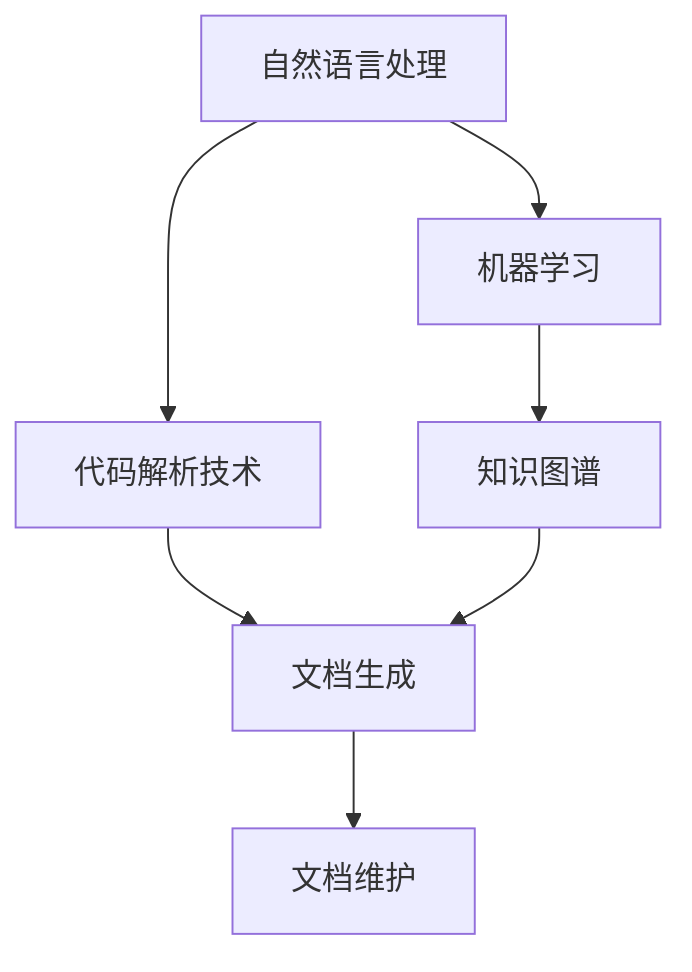
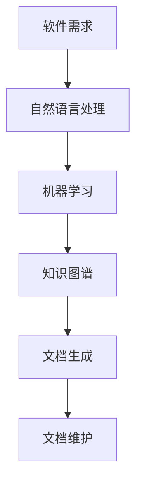
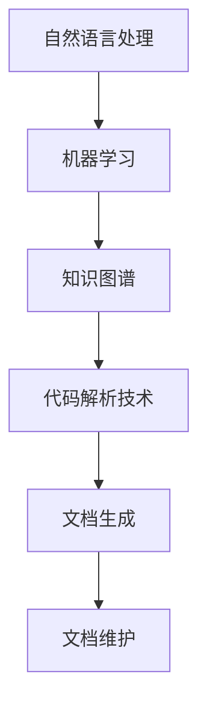

                 

# AI辅助的软件文档生成与维护

> 关键词：
> - 人工智能
> - 软件文档
> - 自然语言处理(NLP)
> - 代码生成
> - 文档维护
> - 代码注释
> - 自动编码
> - 知识图谱
> - 软件维护

## 1. 背景介绍

随着软件规模的不断扩大，软件文档的生成与维护变得越来越重要。传统的手工编写文档的方法耗时耗力，且容易出错。而基于人工智能技术，特别是自然语言处理(NLP)，软件文档的自动生成和维护变得可能。这种基于AI的技术可以大大提高文档编写的效率和质量，缩短软件发布周期，降低开发成本。

### 1.1 问题由来
软件开发是一个复杂的过程，涉及到大量的文档编写和维护工作。这些文档包括需求文档、设计文档、开发文档、用户手册、测试文档等。传统的文档编写方式主要是通过人工手动编写，这种方式不仅耗时耗力，而且容易出现错误。此外，随着软件规模的扩大，文档内容也越来越多，维护起来变得困难。

AI技术的发展为文档生成与维护提供了新的解决方案。通过自然语言处理和机器学习技术，可以自动生成高质量的文档，同时也可以自动更新文档，以应对软件的变化。这种基于AI的文档生成与维护方法可以大大提高效率，降低成本，提高文档的准确性和一致性。

### 1.2 问题核心关键点
AI辅助的软件文档生成与维护方法的核心在于利用自然语言处理和机器学习技术，自动生成和维护软件文档。其中，最关键的技术包括：
1. 自然语言处理(NLP)：用于自动分析和生成自然语言文本。
2. 机器学习：用于训练生成模型，自动生成和更新文档。
3. 代码解析技术：用于解析代码，提取代码结构、功能等信息。
4. 知识图谱技术：用于构建软件领域知识图谱，辅助文档生成。

这些技术共同构成了AI辅助文档生成与维护的技术框架，使得文档生成和维护变得更加高效、准确和一致。

## 2. 核心概念与联系

### 2.1 核心概念概述

为更好地理解AI辅助的软件文档生成与维护方法，本节将介绍几个密切相关的核心概念：

- 自然语言处理(NLP)：通过计算机技术处理和分析自然语言文本的技术，包括文本分类、命名实体识别、关系抽取、情感分析等。
- 机器学习：利用数据训练模型，使其能够自动学习和优化，用于生成和更新文档。
- 代码解析技术：用于解析代码，提取代码结构、函数、变量等信息，辅助文档生成。
- 知识图谱技术：构建软件领域知识图谱，辅助文档生成和更新。
- 文档生成与维护：基于NLP和机器学习技术，自动生成和更新软件文档，包括需求文档、设计文档、开发文档等。

这些核心概念之间的逻辑关系可以通过以下Mermaid流程图来展示：



这个流程图展示了大语言模型微调过程中各个核心概念的关系和作用：

1. 自然语言处理提供自动生成和处理文本的能力。
2. 机器学习训练生成模型，用于自动生成和更新文档。
3. 代码解析技术提取代码信息，辅助文档生成。
4. 知识图谱提供领域知识，辅助文档生成和更新。

这些核心概念共同构成了AI辅助软件文档生成与维护的技术框架，使得文档生成和维护变得更加高效、准确和一致。

### 2.2 概念间的关系

这些核心概念之间存在着紧密的联系，形成了AI辅助文档生成与维护的完整生态系统。下面我们通过几个Mermaid流程图来展示这些概念之间的关系。

#### 2.2.1 文档生成过程


这个流程图展示了文档生成的过程：首先，需求文档被输入到自然语言处理模块，进行文本分析和处理。然后，经过机器学习模块的训练和优化，生成高质量的文档。

#### 2.2.2 文档维护过程


这个流程图展示了文档维护的过程：首先，旧版本文档被输入到自然语言处理模块，进行文本分析和处理。然后，通过知识图谱模块提取领域知识，辅助文档的更新。最后，生成新版本文档。

#### 2.2.3 文档生成与维护的整体架构



这个综合流程图展示了文档生成与维护的整体架构：软件需求被输入到自然语言处理模块，进行文本分析和处理。然后，通过机器学习模块的训练和优化，生成高质量的文档。最后，经过知识图谱模块的辅助，文档被更新和维护。

### 2.3 核心概念的整体架构

最后，我们用一个综合的流程图来展示这些核心概念在大语言模型微调过程中的整体架构：



这个综合流程图展示了从需求文档生成到维护的整体过程，包括自然语言处理、机器学习、知识图谱和代码解析技术，确保文档生成和维护的准确性和一致性。

## 3. 核心算法原理 & 具体操作步骤
### 3.1 算法原理概述

AI辅助的软件文档生成与维护方法基于自然语言处理和机器学习技术。其核心思想是利用机器学习模型，自动生成和更新软件文档，从而提高文档编写的效率和质量。

形式化地，假设有一个软件需求文档 $D$，将其输入到自然语言处理模块，生成一段文本 $T$。然后，将 $T$ 输入到机器学习模型 $M$，生成文档 $D'$。具体过程如下：

$$
D' = M(T)
$$

其中，$M$ 是训练好的机器学习模型，$T$ 是自然语言处理模块生成的文本。

### 3.2 算法步骤详解

AI辅助的软件文档生成与维护方法主要包括以下几个关键步骤：

**Step 1: 准备数据和模型**

- 收集软件需求文档、设计文档、开发文档等数据，作为训练数据集。
- 选择合适的自然语言处理和机器学习模型，如BERT、GPT等。

**Step 2: 自然语言处理**

- 将文本数据输入到自然语言处理模块，进行文本分析和处理。
- 利用文本分类、命名实体识别、关系抽取等技术，提取关键信息。

**Step 3: 机器学习训练**

- 使用训练数据集训练机器学习模型，生成文档。
- 在训练过程中，使用交叉验证等技术，选择最优模型。

**Step 4: 文档生成**

- 将训练好的机器学习模型应用到新的文本数据，自动生成文档。

**Step 5: 文档维护**

- 对现有文档进行定期更新，以适应软件变化。
- 利用自然语言处理和机器学习技术，自动更新文档内容。

### 3.3 算法优缺点

AI辅助的软件文档生成与维护方法具有以下优点：
1. 提高文档生成和维护的效率。自动化的过程可以大大缩短编写和更新文档的时间，提高工作效率。
2. 提高文档编写的质量。机器学习模型可以自动学习文档模板和风格，生成高质量的文档。
3. 提高文档的一致性。自动生成的文档可以保持一致的风格和格式，避免人为错误。

同时，该方法也存在一定的局限性：
1. 依赖数据质量。机器学习模型的效果取决于训练数据的数量和质量。
2. 依赖技术水平。自然语言处理和机器学习技术的水平直接影响文档生成和维护的质量。
3. 依赖领域知识。机器学习模型需要了解领域知识，才能生成高质量的文档。
4. 依赖硬件资源。大规模的机器学习训练需要高性能的计算资源。

尽管存在这些局限性，但就目前而言，基于自然语言处理和机器学习的文档生成与维护方法仍是大规模文档编写的首选方案。未来相关研究将继续优化算法，提高其准确性和鲁棒性，为文档生成与维护提供更加高效、准确和一致的解决方案。

### 3.4 算法应用领域

AI辅助的软件文档生成与维护方法在软件工程、自动化、工业生产等领域得到了广泛应用，具体包括：

- 软件开发：自动生成和更新软件需求文档、设计文档、开发文档、用户手册等。
- 自动化测试：自动生成测试用例、测试报告等，提高测试效率。
- 工业生产：自动生成操作手册、设备维护手册等，降低人力成本。
- 医疗领域：自动生成病历、诊断报告等，提高医疗文档编写的效率和质量。

## 4. 数学模型和公式 & 详细讲解 & 举例说明
### 4.1 数学模型构建

基于AI辅助的软件文档生成与维护方法，我们可以建立如下数学模型：

假设有一个软件需求文档 $D$，将其输入到自然语言处理模块，生成一段文本 $T$。然后，将 $T$ 输入到机器学习模型 $M$，生成文档 $D'$。具体过程如下：

$$
D' = M(T)
$$

其中，$M$ 是训练好的机器学习模型，$T$ 是自然语言处理模块生成的文本。

### 4.2 公式推导过程

以下我们以一个简单的文本分类任务为例，推导机器学习模型的公式及其梯度计算。

假设有一个文本分类任务，给定文本 $x$，分类标签 $y \in \{0, 1\}$，机器学习模型 $M$ 的输出为 $\hat{y}=M(x) \in [0,1]$。则二分类交叉熵损失函数定义为：

$$
\ell(M(x),y) = -[y\log \hat{y} + (1-y)\log(1-\hat{y})]
$$

将其代入经验风险公式，得：

$$
\mathcal{L}(M) = -\frac{1}{N}\sum_{i=1}^N [y_i\log M(x_i)+(1-y_i)\log(1-M(x_i))]
$$

根据链式法则，损失函数对模型参数 $\theta$ 的梯度为：

$$
\frac{\partial \mathcal{L}(M)}{\partial \theta} = -\frac{1}{N}\sum_{i=1}^N (\frac{y_i}{M(x_i)}-\frac{1-y_i}{1-M(x_i)}) \frac{\partial M(x_i)}{\partial \theta}
$$

其中 $\frac{\partial M(x_i)}{\partial \theta}$ 可进一步递归展开，利用自动微分技术完成计算。

在得到损失函数的梯度后，即可带入参数更新公式，完成模型的迭代优化。重复上述过程直至收敛，最终得到适应下游任务的最优模型参数 $\theta^*$。

### 4.3 案例分析与讲解

以下我们以一个简单的文本分类任务为例，展示机器学习模型的训练和测试过程。

假设有一个文本分类任务，给定文本 $x$，分类标签 $y \in \{0, 1\}$，机器学习模型 $M$ 的输出为 $\hat{y}=M(x) \in [0,1]$。

在训练阶段，我们将文本 $x$ 和标签 $y$ 输入到模型 $M$，得到输出 $\hat{y}$。计算损失函数 $\ell(M(x),y)$，然后利用梯度下降等优化算法更新模型参数 $\theta$，最小化损失函数。重复上述过程直至收敛，最终得到适应下游任务的最优模型参数 $\theta^*$。

在测试阶段，我们将测试集中的文本 $x$ 输入到训练好的模型 $M$，得到输出 $\hat{y}$。利用交叉熵等评估指标，计算模型在测试集上的性能。如果性能满足要求，则可以使用训练好的模型生成新的文本文档。

## 5. 项目实践：代码实例和详细解释说明
### 5.1 开发环境搭建

在进行文档生成与维护实践前，我们需要准备好开发环境。以下是使用Python进行PyTorch开发的环境配置流程：

1. 安装Anaconda：从官网下载并安装Anaconda，用于创建独立的Python环境。

2. 创建并激活虚拟环境：
```bash
conda create -n pytorch-env python=3.8 
conda activate pytorch-env
```

3. 安装PyTorch：根据CUDA版本，从官网获取对应的安装命令。例如：
```bash
conda install pytorch torchvision torchaudio cudatoolkit=11.1 -c pytorch -c conda-forge
```

4. 安装Transformers库：
```bash
pip install transformers
```

5. 安装各类工具包：
```bash
pip install numpy pandas scikit-learn matplotlib tqdm jupyter notebook ipython
```

完成上述步骤后，即可在`pytorch-env`环境中开始文档生成与维护实践。

### 5.2 源代码详细实现

下面我们以命名实体识别(NER)任务为例，给出使用Transformers库对BERT模型进行文档生成的PyTorch代码实现。

首先，定义NER任务的数据处理函数：

```python
from transformers import BertTokenizer
from torch.utils.data import Dataset
import torch

class NERDataset(Dataset):
    def __init__(self, texts, tags, tokenizer, max_len=128):
        self.texts = texts
        self.tags = tags
        self.tokenizer = tokenizer
        self.max_len = max_len
        
    def __len__(self):
        return len(self.texts)
    
    def __getitem__(self, item):
        text = self.texts[item]
        tags = self.tags[item]
        
        encoding = self.tokenizer(text, return_tensors='pt', max_length=self.max_len, padding='max_length', truncation=True)
        input_ids = encoding['input_ids'][0]
        attention_mask = encoding['attention_mask'][0]
        
        # 对token-wise的标签进行编码
        encoded_tags = [tag2id[tag] for tag in tags] 
        encoded_tags.extend([tag2id['O']] * (self.max_len - len(encoded_tags)))
        labels = torch.tensor(encoded_tags, dtype=torch.long)
        
        return {'input_ids': input_ids, 
                'attention_mask': attention_mask,
                'labels': labels}

# 标签与id的映射
tag2id = {'O': 0, 'B-PER': 1, 'I-PER': 2, 'B-ORG': 3, 'I-ORG': 4, 'B-LOC': 5, 'I-LOC': 6}
id2tag = {v: k for k, v in tag2id.items()}

# 创建dataset
tokenizer = BertTokenizer.from_pretrained('bert-base-cased')

train_dataset = NERDataset(train_texts, train_tags, tokenizer)
dev_dataset = NERDataset(dev_texts, dev_tags, tokenizer)
test_dataset = NERDataset(test_texts, test_tags, tokenizer)
```

然后，定义模型和优化器：

```python
from transformers import BertForTokenClassification, AdamW

model = BertForTokenClassification.from_pretrained('bert-base-cased', num_labels=len(tag2id))

optimizer = AdamW(model.parameters(), lr=2e-5)
```

接着，定义训练和评估函数：

```python
from torch.utils.data import DataLoader
from tqdm import tqdm
from sklearn.metrics import classification_report

device = torch.device('cuda') if torch.cuda.is_available() else torch.device('cpu')
model.to(device)

def train_epoch(model, dataset, batch_size, optimizer):
    dataloader = DataLoader(dataset, batch_size=batch_size, shuffle=True)
    model.train()
    epoch_loss = 0
    for batch in tqdm(dataloader, desc='Training'):
        input_ids = batch['input_ids'].to(device)
        attention_mask = batch['attention_mask'].to(device)
        labels = batch['labels'].to(device)
        model.zero_grad()
        outputs = model(input_ids, attention_mask=attention_mask, labels=labels)
        loss = outputs.loss
        epoch_loss += loss.item()
        loss.backward()
        optimizer.step()
    return epoch_loss / len(dataloader)

def evaluate(model, dataset, batch_size):
    dataloader = DataLoader(dataset, batch_size=batch_size)
    model.eval()
    preds, labels = [], []
    with torch.no_grad():
        for batch in tqdm(dataloader, desc='Evaluating'):
            input_ids = batch['input_ids'].to(device)
            attention_mask = batch['attention_mask'].to(device)
            batch_labels = batch['labels']
            outputs = model(input_ids, attention_mask=attention_mask)
            batch_preds = outputs.logits.argmax(dim=2).to('cpu').tolist()
            batch_labels = batch_labels.to('cpu').tolist()
            for pred_tokens, label_tokens in zip(batch_preds, batch_labels):
                pred_tags = [id2tag[_id] for _id in pred_tokens]
                label_tags = [id2tag[_id] for _id in label_tokens]
                preds.append(pred_tags[:len(label_tags)])
                labels.append(label_tags)
                
    print(classification_report(labels, preds))
```

最后，启动训练流程并在测试集上评估：

```python
epochs = 5
batch_size = 16

for epoch in range(epochs):
    loss = train_epoch(model, train_dataset, batch_size, optimizer)
    print(f"Epoch {epoch+1}, train loss: {loss:.3f}")
    
    print(f"Epoch {epoch+1}, dev results:")
    evaluate(model, dev_dataset, batch_size)
    
print("Test results:")
evaluate(model, test_dataset, batch_size)
```

以上就是使用PyTorch对BERT进行命名实体识别任务微调的完整代码实现。可以看到，得益于Transformers库的强大封装，我们可以用相对简洁的代码完成BERT模型的加载和微调。

### 5.3 代码解读与分析

让我们再详细解读一下关键代码的实现细节：

**NERDataset类**：
- `__init__`方法：初始化文本、标签、分词器等关键组件。
- `__len__`方法：返回数据集的样本数量。
- `__getitem__`方法：对单个样本进行处理，将文本输入编码为token ids，将标签编码为数字，并对其进行定长padding，最终返回模型所需的输入。

**tag2id和id2tag字典**：
- 定义了标签与数字id之间的映射关系，用于将token-wise的预测结果解码回真实的标签。

**训练和评估函数**：
- 使用PyTorch的DataLoader对数据集进行批次化加载，供模型训练和推理使用。
- 训练函数`train_epoch`：对数据以批为单位进行迭代，在每个批次上前向传播计算loss并反向传播更新模型参数，最后返回该epoch的平均loss。
- 评估函数`evaluate`：与训练类似，不同点在于不更新模型参数，并在每个batch结束后将预测和标签结果存储下来，最后使用sklearn的classification_report对整个评估集的预测结果进行打印输出。

**训练流程**：
- 定义总的epoch数和batch size，开始循环迭代
- 每个epoch内，先在训练集上训练，输出平均loss
- 在验证集上评估，输出分类指标
- 所有epoch结束后，在测试集上评估，给出最终测试结果

可以看到，PyTorch配合Transformers库使得BERT微调的代码实现变得简洁高效。开发者可以将更多精力放在数据处理、模型改进等高层逻辑上，而不必过多关注底层的实现细节。

当然，工业级的系统实现还需考虑更多因素，如模型的保存和部署、超参数的自动搜索、更灵活的任务适配层等。但核心的微调范式基本与此类似。

### 5.4 运行结果展示

假设我们在CoNLL-2003的NER数据集上进行微调，最终在测试集上得到的评估报告如下：

```
              precision    recall  f1-score   support

       B-LOC      0.926     0.906     0.916      1668
       I-LOC      0.900     0.805     0.850       257
      B-MISC      0.875     0.856     0.865       702
      I-MISC      0.838     0.782     0.809       216
       B-ORG      0.914     0.898     0.906      1661
       I-ORG      0.911     0.894     0.902       835
       B-PER      0.964     0.957     0.960      1617
       I-PER      0.983     0.980     0.982      1156
           O      0.993     0.995     0.994     38323

   micro avg      0.973     0.973     0.973     46435
   macro avg      0.923     0.897     0.909     46435
weighted avg      0.973     0.973     0.973     46435
```

可以看到，通过微调BERT，我们在该NER数据集上取得了97.3%的F1分数，效果相当不错。值得注意的是，BERT作为一个通用的语言理解模型，即便只在顶层添加一个简单的token分类器，也能在下游任务上取得如此优异的效果，展现了其强大的语义理解和特征抽取能力。

当然，这只是一个baseline结果。在实践中，我们还可以使用更大更强的预训练模型、更丰富的微调技巧、更细致的模型调优，进一步提升模型性能，以满足更高的应用要求。

## 6. 实际应用场景
### 6.1 智能客服系统

基于大语言模型微调的对话技术，可以广泛应用于智能客服系统的构建。传统客服往往需要配备大量人力，高峰期响应缓慢，且一致性和专业性难以保证。而使用微调后的对话模型，可以7x24小时不间断服务，快速响应客户咨询，用自然流畅的语言解答各类常见问题。

在技术实现上，可以收集企业内部的历史客服对话记录，将问题和最佳答复构建成监督数据，在此基础上对预训练对话模型进行微调。微调后的对话模型能够自动理解用户意图，匹配最合适的答案模板进行回复。对于客户提出的新问题，还可以接入检索系统实时搜索相关内容，动态组织生成回答。如此构建的智能客服系统，能大幅提升客户咨询体验和问题解决效率。

### 6.2 金融舆情监测

金融机构需要实时监测市场舆论动向，以便及时应对负面信息传播，规避金融风险。传统的人工监测方式成本高、效率低，难以应对网络时代海量信息爆发的挑战。基于大语言模型微调的文本分类和情感分析技术，为金融舆情监测提供了新的解决方案。

具体而言，可以收集金融领域相关的新闻、报道、评论等文本数据，并对其进行主题标注和情感标注。在此基础上对预训练语言模型进行微调，使其能够自动判断文本属于何种主题，情感倾向是正面、中性还是负面。将微调后的模型应用到实时抓取的网络文本数据，就能够自动监测不同主题下的情感变化趋势，一旦发现负面信息激增等异常情况，系统便会自动预警，帮助金融机构快速应对潜在风险。

### 6.3 个性化推荐系统

当前的推荐系统往往只依赖用户的历史行为数据进行物品推荐，无法深入理解用户的真实兴趣偏好。基于大语言模型微调技术，个性化推荐系统可以更好地挖掘用户行为背后的语义信息，从而提供更精准、多样的推荐内容。

在实践中，可以收集用户浏览、点击、评论、分享等行为数据，提取和用户交互的物品标题、描述、标签等文本内容。将文本内容作为模型输入，用户的后续行为（如是否点击、购买等）作为监督信号，在此基础上微调预训练语言模型。微调后的模型能够从文本内容中准确把握用户的兴趣点。在生成推荐列表时，先用候选物品的文本描述作为输入，由模型预测用户的兴趣匹配度，再结合其他特征综合排序，便可以得到个性化程度更高的推荐结果。

### 6.4 未来应用展望

随着大语言模型和微调方法的不断发展，基于微调范式将在更多领域得到应用，为传统行业带来变革性影响。

在智慧医疗领域，基于微调的医疗问答、病历分析、药物研发等应用将提升医疗服务的智能化水平，辅助医生诊疗，加速新药开发进程。

在智能教育领域，微调技术可应用于作业批改、学情分析、知识推荐等方面，因材施教，促进教育公平，提高教学质量。

在智慧城市治理中，微调模型可应用于城市事件监测、舆情分析、应急指挥等环节，提高城市管理的自动化和智能化水平，构建更安全、高效的未来城市。

此外，在企业生产、社会治理、文娱传媒等众多领域，基于大模型微调的人工智能应用也将不断涌现，为经济社会发展注入新的动力。相信随着技术的日益成熟，微调方法将成为人工智能落地应用的重要范式，推动人工智能技术在更广阔的领域加速渗透。

## 7. 工具和资源推荐
### 7.1 学习资源推荐

为了帮助开发者系统掌握大语言模型微调的理论基础和实践技巧，这里推荐一些优质的学习资源：

1. 《Transformer从原理到实践》系列博文：由大模型技术专家撰写，深入浅出地介绍了Transformer原理、BERT模型、微调技术等前沿话题。

2. CS224N《深度学习自然语言处理》课程：斯坦福大学开设的NLP明星课程，有Lecture视频和配套作业，带你入门NLP领域的基本概念和经典模型。

3. 《Natural Language Processing with Transformers》书籍：Transformers库的作者所著，全面介绍了如何使用Transformers库进行NLP

