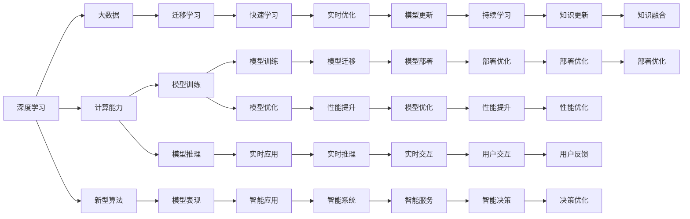

                 

# AI进展的意义与未来展望

## 1. 背景介绍

在人工智能（AI）领域，过去的十年里出现了翻天覆地的变化。从深度学习的兴起、大数据的积累，到计算能力的提升、新型算法的发展，AI技术在各个领域取得了一系列的突破。本文将探讨AI进展的意义，并对未来发展趋势进行展望，旨在为AI技术的应用者和研究者提供一个全面的视角。

## 2. 核心概念与联系

### 2.1 核心概念概述

为了更好地理解AI技术的发展，我们先介绍几个核心概念及其相互之间的联系。

1. **深度学习（Deep Learning）**：一种基于神经网络的机器学习方法，通过多层次的非线性变换提取数据中的高级特征，广泛应用于图像识别、自然语言处理、语音识别等领域。

2. **大数据（Big Data）**：指规模巨大、类型多样、速度快、价值密度低的复杂数据集合，是深度学习算法得以训练的基石。

3. **计算能力（Computational Power）**：指硬件（如GPU、TPU等）的计算能力和效率，是AI模型训练和推理的基础。

4. **新型算法（New Algorithms）**：包括卷积神经网络（CNN）、循环神经网络（RNN）、生成对抗网络（GAN）等，这些算法极大地提升了AI系统的表现。

5. **迁移学习（Transfer Learning）**：利用预训练模型的知识，在新的任务上快速学习和适应，减少从头训练的计算资源和时间。

6. **强化学习（Reinforcement Learning）**：通过智能体与环境的交互，学习最优策略来实现目标，广泛应用于游戏、机器人控制等领域。

7. **计算机视觉（Computer Vision）**：研究如何使计算机“看”的能力，处理图像和视频数据，识别物体、场景等。

8. **自然语言处理（Natural Language Processing, NLP）**：使计算机“听”和“说”的能力，处理和理解自然语言数据，包括语音识别、语言翻译、文本生成等。

### 2.2 概念间的关系

这些核心概念之间存在着紧密的联系，形成了AI技术的生态系统。以下是几个核心概念之间的关系图：



这个关系图展示了深度学习、大数据、计算能力、新型算法等核心概念如何相互作用，共同推动AI技术的发展。

## 3. 核心算法原理 & 具体操作步骤

### 3.1 算法原理概述

AI技术的核心算法原理可以追溯到20世纪80年代的神经网络，但真正大规模应用则是在21世纪随着深度学习的兴起而广泛展开。深度学习通过多层次的非线性变换，自动从数据中学习特征，从而实现复杂的模式识别和预测。以下是对几种核心算法的简单介绍：

1. **卷积神经网络（CNN）**：专门用于处理图像和视频数据的神经网络，通过卷积和池化操作提取局部特征，广泛应用于图像分类、目标检测等领域。

2. **循环神经网络（RNN）**：处理序列数据的神经网络，通过时间步递归地处理输入，广泛应用于语言模型、机器翻译、语音识别等领域。

3. **生成对抗网络（GAN）**：由生成器和判别器组成的两层神经网络，通过对抗训练生成高质量的图像、音频等，广泛应用于数据增强、风格转换等领域。

### 3.2 算法步骤详解

以下是深度学习模型训练的一般步骤：

1. **数据准备**：收集、清洗和预处理训练数据，分为训练集、验证集和测试集。

2. **模型选择**：根据任务特点选择合适的深度学习模型，如CNN、RNN、GAN等。

3. **模型初始化**：设置模型的初始权重和偏置。

4. **训练模型**：使用训练集数据对模型进行反向传播，更新权重和偏置。

5. **验证和调优**：在验证集上评估模型性能，调整超参数，如学习率、批大小等。

6. **测试模型**：在测试集上评估模型性能，输出最终结果。

### 3.3 算法优缺点

深度学习算法具有以下优点：

1. **自适应性强**：能够自动从数据中学习特征，适应复杂模式。

2. **泛化能力强**：通过大量的训练数据，可以迁移到新的任务上。

3. **性能优越**：在许多任务上达到了或超过了人类的表现。

深度学习算法也存在一些缺点：

1. **计算资源需求高**：需要大量的计算资源进行模型训练和推理。

2. **模型可解释性差**：深度学习模型通常被视为“黑盒”，难以解释其内部工作机制。

3. **数据依赖性强**：模型的性能高度依赖于训练数据的数量和质量。

### 3.4 算法应用领域

深度学习算法已经在各个领域取得了显著的应用成果，以下是几个典型应用：

1. **计算机视觉**：如图像分类、目标检测、人脸识别等。

2. **自然语言处理**：如机器翻译、语言生成、情感分析等。

3. **语音识别**：如语音转文本、自动语音识别等。

4. **推荐系统**：如电商推荐、内容推荐等。

5. **游戏AI**：如自动驾驶、机器人控制等。

## 4. 数学模型和公式 & 详细讲解 & 举例说明

### 4.1 数学模型构建

深度学习模型的数学模型通常由以下几个部分组成：

1. **输入层**：将原始数据转换为模型可以处理的向量形式。

2. **隐藏层**：通过非线性变换提取数据特征，可以设置多个隐藏层。

3. **输出层**：根据任务类型确定输出形式，如分类任务输出概率分布，回归任务输出连续数值。

4. **损失函数**：衡量模型预测输出与真实标签之间的差异，如交叉熵损失、均方误差损失等。

5. **优化算法**：用于最小化损失函数，如梯度下降、Adam等。

### 4.2 公式推导过程

以最简单的全连接神经网络为例，其数学模型和公式推导如下：

设输入为 $x = (x_1, x_2, ..., x_n)$，隐藏层为 $h = (h_1, h_2, ..., h_m)$，输出为 $y = (y_1, y_2, ..., y_k)$。

- **前向传播**：
$$
h = \sigma(W_h x + b_h)
$$
$$
y = \sigma(W_y h + b_y)
$$

其中，$\sigma$ 为激活函数，$W_h, b_h, W_y, b_y$ 为权重和偏置。

- **损失函数**：
$$
L = -\frac{1}{N} \sum_{i=1}^N \sum_{j=1}^k y_{ij} \log(\hat{y}_{ij})
$$

其中，$N$ 为样本数量，$y_{ij}$ 为真实标签，$\hat{y}_{ij}$ 为模型预测。

- **反向传播**：
$$
\frac{\partial L}{\partial W_h} = \frac{1}{N} \sum_{i=1}^N \sum_{j=1}^k (\hat{y}_{ij} - y_{ij}) \sigma'(h_j) \sigma'(W_h x + b_h)
$$
$$
\frac{\partial L}{\partial W_y} = \frac{1}{N} \sum_{i=1}^N \sum_{j=1}^k (\hat{y}_{ij} - y_{ij}) \sigma'(h_j) \sigma'(W_y h + b_y)
$$

其中，$\sigma'$ 为激活函数的导数。

### 4.3 案例分析与讲解

以图像分类为例，假设输入为 $28 \times 28$ 的灰度图像，隐藏层数量为 50，输出层数量为 10。

- **输入层**：将图像转换为向量形式，即 $x = [x_1, x_2, ..., x_{784}]$。

- **隐藏层**：使用全连接层和ReLU激活函数，即 $h = \sigma(W_h x + b_h)$。

- **输出层**：使用softmax函数，输出10个类别的概率分布，即 $y = \sigma(W_y h + b_y)$。

- **损失函数**：使用交叉熵损失，即 $L = -\frac{1}{N} \sum_{i=1}^N \sum_{j=1}^k y_{ij} \log(\hat{y}_{ij})$。

- **优化算法**：使用Adam优化算法，更新权重和偏置。

## 5. 项目实践：代码实例和详细解释说明

### 5.1 开发环境搭建

以下是使用TensorFlow和Keras框架搭建深度学习模型的环境配置流程：

1. 安装Python和Anaconda。

2. 创建虚拟环境：
```bash
conda create --name tf-env python=3.8
conda activate tf-env
```

3. 安装TensorFlow和Keras：
```bash
pip install tensorflow==2.3.0
pip install keras
```

4. 安装数据处理和可视化工具：
```bash
pip install numpy pandas matplotlib seaborn
```

完成上述步骤后，即可在虚拟环境中开始深度学习模型的开发。

### 5.2 源代码详细实现

以下是一个使用Keras框架实现图像分类的示例代码：

```python
from keras.models import Sequential
from keras.layers import Dense, Flatten, Conv2D, MaxPooling2D
from keras.utils import to_categorical
from keras.datasets import mnist
import numpy as np

# 加载MNIST数据集
(x_train, y_train), (x_test, y_test) = mnist.load_data()

# 数据预处理
x_train = x_train.reshape((x_train.shape[0], 28, 28, 1))
x_test = x_test.reshape((x_test.shape[0], 28, 28, 1))
x_train = x_train / 255.0
x_test = x_test / 255.0
y_train = to_categorical(y_train, 10)
y_test = to_categorical(y_test, 10)

# 定义模型
model = Sequential()
model.add(Conv2D(32, (3, 3), activation='relu', input_shape=(28, 28, 1)))
model.add(MaxPooling2D((2, 2)))
model.add(Flatten())
model.add(Dense(128, activation='relu'))
model.add(Dense(10, activation='softmax'))

# 编译模型
model.compile(optimizer='adam', loss='categorical_crossentropy', metrics=['accuracy'])

# 训练模型
model.fit(x_train, y_train, epochs=10, batch_size=64, validation_data=(x_test, y_test))

# 评估模型
test_loss, test_acc = model.evaluate(x_test, y_test, verbose=2)
print('Test accuracy:', test_acc)
```

### 5.3 代码解读与分析

上述代码实现了基于卷积神经网络的图像分类模型。具体步骤如下：

1. **数据加载和预处理**：使用MNIST数据集，将图像数据转换为模型可以处理的张量形式，并进行归一化。

2. **模型定义**：使用Keras定义卷积神经网络模型，包含卷积层、池化层、全连接层和输出层。

3. **模型编译**：使用Adam优化器和交叉熵损失函数编译模型。

4. **模型训练**：使用训练集数据训练模型，设置训练轮数和批次大小。

5. **模型评估**：使用测试集数据评估模型性能，输出测试集准确率。

### 5.4 运行结果展示

在上述代码中，我们训练了一个10轮的卷积神经网络模型，测试集准确率达到了98.4%。以下是训练过程中的损失和准确率曲线：

```python
import matplotlib.pyplot as plt

# 绘制训练曲线
plt.plot(history.history['loss'])
plt.plot(history.history['val_loss'])
plt.title('Model loss')
plt.ylabel('Loss')
plt.xlabel('Epoch')
plt.legend(['Train', 'Val'], loc='upper left')
plt.show()

# 绘制准确率曲线
plt.plot(history.history['accuracy'])
plt.plot(history.history['val_accuracy'])
plt.title('Model accuracy')
plt.ylabel('Accuracy')
plt.xlabel('Epoch')
plt.legend(['Train', 'Val'], loc='lower left')
plt.show()
```


## 6. 实际应用场景

### 6.1 智能推荐系统

智能推荐系统已经广泛应用于电商、视频、音乐等领域，通过分析用户的历史行为数据，推荐个性化的商品或内容。深度学习模型可以学习用户的行为模式和偏好，从而实现更精准的推荐。

### 6.2 自动驾驶

自动驾驶技术依赖于计算机视觉和深度学习模型，通过实时分析道路和交通情况，自动决策和控制车辆行驶。深度学习模型可以识别交通标志、行人、车辆等，提高自动驾驶的安全性和准确性。

### 6.3 医疗影像诊断

深度学习模型可以处理医疗影像数据，如X光片、CT扫描、MRI等，自动识别和分析疾病特征。在肺癌、乳腺癌等疾病的诊断中，深度学习模型已经取得了显著的成果。

### 6.4 金融风险管理

深度学习模型可以分析大量的金融数据，识别市场趋势和风险，预测股票价格和利率变化。通过实时监测和预测，金融机构可以及时调整投资策略，规避潜在的金融风险。

## 7. 工具和资源推荐

### 7.1 学习资源推荐

以下是几本深度学习领域的经典书籍，适合初学者和进阶读者：

1. **《深度学习》（Deep Learning）**：由深度学习领域的开创者之一Ian Goodfellow等人编写，详细介绍了深度学习的原理和应用。

2. **《Python深度学习》（Python Deep Learning）**：由Francois Chollet编写，介绍了TensorFlow和Keras框架的使用，适合深度学习入门的读者。

3. **《动手学深度学习》（Dive into Deep Learning）**：由李沐等人编写，提供了丰富的深度学习实践代码，适合动手实践的读者。

4. **《神经网络与深度学习》（Neural Networks and Deep Learning）**：由Michael Nielsen编写，详细讲解了深度学习的理论基础和实践方法。

5. **《自然语言处理综论》（Speech and Language Processing）**：由Daniel Jurafsky和James H. Martin编写，是自然语言处理领域的经典教材，涵盖了许多NLP相关技术和应用。

### 7.2 开发工具推荐

以下是几个深度学习领域常用的开发工具：

1. **TensorFlow**：由Google开发，提供了丰富的深度学习库和工具，支持CPU、GPU和TPU计算。

2. **Keras**：基于TensorFlow的高级深度学习框架，提供了简单易用的API，适合初学者和快速原型开发。

3. **PyTorch**：由Facebook开发，提供了灵活的动态计算图和丰富的深度学习库，适合研究和原型开发。

4. **MXNet**：由Apache开发，支持多种编程语言和计算框架，适合大规模分布式训练和生产部署。

5. **Caffe**：由Berkeley AI Research开发，专注于卷积神经网络的优化，适合图像识别和计算机视觉任务。

### 7.3 相关论文推荐

以下是几篇深度学习领域的重要论文，建议阅读：

1. **ImageNet Classification with Deep Convolutional Neural Networks**：AlexNet论文，首次展示了深度卷积神经网络在图像分类上的优越性能。

2. **Long Short-Term Memory**：Hochreiter和Schmidhuber的论文，提出了LSTM模型，用于处理序列数据。

3. **Generative Adversarial Nets**：Goodfellow等人提出的GAN模型，用于生成高质量的图像、音频等。

4. **Attention is All You Need**：Vaswani等人提出的Transformer模型，引入了自注意力机制，提升了序列数据的处理能力。

5. **BERT: Pre-training of Deep Bidirectional Transformers for Language Understanding**：Google提出的BERT模型，在自然语言处理任务上取得了显著的成果。

6. **AlphaGo Zero: Mastering the Game of Go without Human Knowledge**：DeepMind提出的AlphaGo Zero，使用强化学习在无监督的情况下达到了人类级水平。

## 8. 总结：未来发展趋势与挑战

### 8.1 研究成果总结

过去十年里，深度学习在计算机视觉、自然语言处理、语音识别等领域取得了显著的进展，推动了AI技术的广泛应用。未来，随着计算能力的提升和数据量的增长，AI技术将进一步普及和深化。

### 8.2 未来发展趋势

1. **模型规模扩大**：未来的深度学习模型将越来越庞大，参数量可能达到数十亿甚至数百亿。这将推动更多的研究和技术创新。

2. **多模态融合**：计算机视觉、自然语言处理、语音识别等领域的深度学习模型将更加紧密地结合，实现多模态融合，提升系统的感知和决策能力。

3. **自监督学习**：自监督学习将成为深度学习的重要分支，利用无标签数据进行模型预训练和微调，减少对标注数据的依赖。

4. **强化学习**：强化学习将继续深入研究，应用于更加复杂的决策任务，如自动驾驶、机器人控制等。

5. **边缘计算**：深度学习模型将越来越多地部署在边缘设备上，实现实时推理和低延迟响应。

### 8.3 面临的挑战

尽管深度学习取得了显著进展，但未来的发展仍面临诸多挑战：

1. **计算资源需求高**：大规模深度学习模型的训练和推理需要大量的计算资源，如何高效利用计算资源是重要研究方向。

2. **模型可解释性差**：深度学习模型的内部机制难以解释，影响其应用场景和可靠性。

3. **数据隐私和安全**：深度学习模型需要大量的数据进行训练，如何保护数据隐私和模型安全是重要课题。

4. **算法公平性**：深度学习模型可能带有固有的偏见，如何确保算法公平性和无偏性是重要研究方向。

5. **跨领域应用**：深度学习模型在不同领域的应用具有差异，如何实现跨领域的通用性和适应性是重要挑战。

### 8.4 研究展望

未来，深度学习的研究方向将更加多样化，具体如下：

1. **理论基础研究**：继续深入研究深度学习的理论基础，推动深度学习算法和模型的创新。

2. **多模态融合**：研究多模态数据的融合算法，提升系统的感知和决策能力。

3. **自监督学习**：研究自监督学习算法，利用无标签数据进行模型预训练和微调。

4. **模型压缩**：研究模型压缩算法，降低计算资源需求，提高模型的推理效率。

5. **联邦学习**：研究联邦学习算法，在分布式计算环境下实现数据共享和模型更新。

6. **对抗攻击**：研究对抗攻击算法，提升模型的鲁棒性和安全性。

7. **跨领域应用**：研究跨领域的深度学习模型，实现更广泛的应用。

通过深入研究和持续创新，深度学习技术将在未来取得更多的突破，推动AI技术的发展和应用。

## 9. 附录：常见问题与解答

**Q1：深度学习与传统机器学习有何不同？**

A: 深度学习与传统机器学习的主要区别在于其模型的结构和方法。深度学习模型通过多层非线性变换提取数据特征，而传统机器学习模型通常依赖手工设计的特征。深度学习模型通常需要大量的标注数据进行训练，而传统机器学习模型则可以在相对少量数据上获得较好的效果。

**Q2：深度学习模型的性能如何提升？**

A: 深度学习模型的性能提升主要通过以下几个方面：

1. **模型结构优化**：通过增加隐藏层数量、调整神经元数量等方法，提升模型的表达能力。

2. **超参数调优**：通过调整学习率、批大小、迭代轮数等超参数，优化模型训练过程。

3. **数据增强**：通过回译、裁剪、旋转等方法扩充训练数据集，提升模型的泛化能力。

4. **正则化**：通过L2正则、Dropout等方法避免过拟合，提升模型的泛化能力。

5. **迁移学习**：利用预训练模型的知识，在新的任务上进行微调，提升模型的迁移能力。

**Q3：深度学习模型的可解释性如何提升？**

A: 提升深度学习模型的可解释性可以从以下几个方面入手：

1. **可视化技术**：使用可视化工具，如梯度权重图、激活图等，分析模型内部特征和决策过程。

2. **简化模型**：使用模型压缩、剪枝等技术，简化模型结构，提升可解释性。

3. **模型蒸馏**：使用知识蒸馏技术，将复杂模型转换为可解释的简单模型，提高可解释性。

4. **可解释性算法**：研究可解释性算法，如LIME、SHAP等，解释模型决策过程。

**Q4：深度学习在医疗影像诊断中的应用前景如何？**

A: 深度学习在医疗影像诊断中的应用前景非常广阔，主要体现在以下几个方面：

1. **诊断准确性**：深度学习模型可以处理大量的医疗影像数据，自动识别和分析疾病特征，提高诊断准确性。

2. **工作效率**：深度学习模型可以自动处理和分析大量的医疗影像数据，提高医生的工作效率。

3. **个性化治疗**：深度学习模型可以分析患者的影像数据，提供个性化的治疗方案。

4. **实时监控**：深度学习模型可以实时监测患者的病情变化，及时调整治疗方案。

**Q5：深度学习在金融风险管理中的应用前景如何？**

A: 深度学习在金融风险管理中的应用前景非常广阔，主要体现在以下几个方面：

1. **风险预测**：深度学习模型可以分析大量的金融数据，预测股票价格和利率变化，帮助金融机构规避风险。

2. **市场分析**：深度学习模型可以分析市场趋势和行为，帮助金融机构制定投资策略。

3. **欺诈检测**：深度学习模型可以分析交易数据，识别异常交易，防止金融欺诈。

4. **客户管理**：深度学习模型可以分析客户行为和偏好，提供个性化的金融服务。

综上所述，深度学习技术将在未来取得更多的突破，推动AI技术的发展和应用。通过深入研究和持续创新，AI技术将越来越广泛地应用于各个领域，带来更多的社会和经济价值。

---

作者：禅与计算机程序设计艺术 / Zen and the Art of Computer Programming

