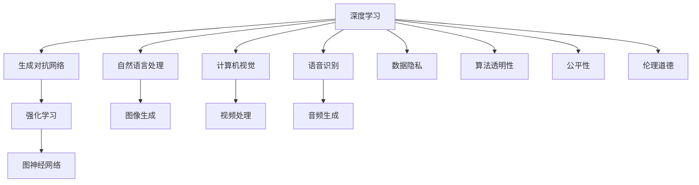
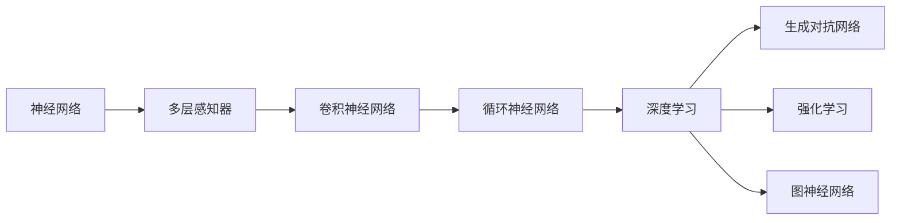
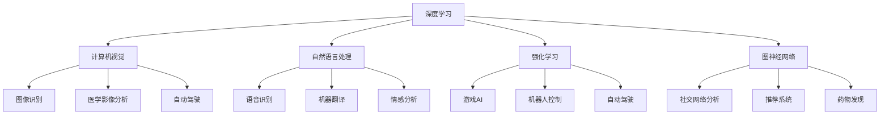
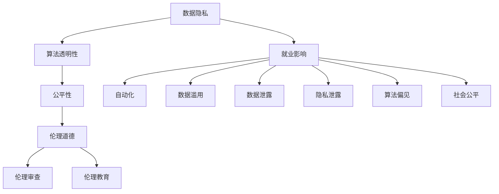
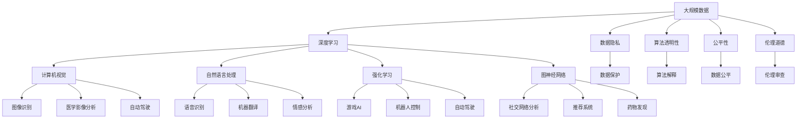

                 

# AI领域的独特时刻与未来

## 1. 背景介绍

### 1.1 问题由来
人工智能（AI）领域自20世纪50年代诞生以来，经历了多次重要的转折点。从最初的符号逻辑，到1980年代专家系统的兴起，再到1990年代深度学习的发展，AI技术正逐步从理论走向实用。近年来，AI技术的飞速发展使得其在各行各业的应用日益广泛，从医疗、金融、教育到交通、制造、娱乐等众多领域，AI正改变着人类的生产生活方式。然而，AI技术也面临着许多挑战和争议，如数据隐私、伦理道德、就业影响等问题。本文将重点探讨AI领域的一些独特时刻及其未来发展趋势。

### 1.2 问题核心关键点
AI领域的独特时刻主要集中在以下几个方面：

- **技术突破**：近年来，深度学习、自然语言处理（NLP）、计算机视觉（CV）等AI技术的快速进步，使得AI在多个领域取得了突破性进展。
- **应用落地**：AI技术的实际应用取得了显著成效，如无人驾驶、智能客服、医疗影像分析等，但同时也带来了数据隐私、伦理道德等新问题。
- **伦理与社会影响**：AI技术的发展引发了伦理道德、就业、隐私等社会问题，社会对AI的接受度和监管要求日益提高。
- **研究热点**：从深度学习到生成对抗网络（GAN）、强化学习（RL）、图神经网络（GNN）等前沿技术，研究热点不断变化。

## 2. 核心概念与联系

### 2.1 核心概念概述

为更好地理解AI领域的独特时刻及其未来发展趋势，本节将介绍几个密切相关的核心概念：

- **深度学习（Deep Learning）**：一种基于多层神经网络的学习范式，用于处理复杂非线性关系，广泛应用于图像识别、自然语言处理、语音识别等领域。
- **生成对抗网络（GANs）**：一种基于博弈论的生成模型，能够生成高质量的图像、视频、音频等，已被应用于游戏、广告、艺术创作等领域。
- **强化学习（RL）**：一种通过奖励信号来优化决策的机器学习技术，已被应用于机器人控制、游戏AI、自动驾驶等场景。
- **图神经网络（GNNs）**：一种基于图结构的数据处理方法，用于处理关系数据，已被应用于社交网络分析、推荐系统、医疗数据挖掘等领域。
- **伦理与隐私**：AI技术的伦理问题包括数据隐私、算法透明性、公平性等，随着AI应用的普及，这些问题变得日益重要。

这些核心概念之间的逻辑关系可以通过以下Mermaid流程图来展示：



这个流程图展示了大规模AI技术及其应用的生态系统，以及伦理问题的相关性。

### 2.2 概念间的关系

这些核心概念之间存在着紧密的联系，形成了AI技术的完整生态系统。下面我通过几个Mermaid流程图来展示这些概念之间的关系。

#### 2.2.1 技术演进路径



这个流程图展示了从神经网络到深度学习，再到GANs、RL、GNNs的技术演进路径。

#### 2.2.2 应用领域分布



这个流程图展示了深度学习、强化学习和图神经网络在不同应用领域的应用。

#### 2.2.3 伦理与社会影响



这个流程图展示了数据隐私、算法透明性、伦理道德与社会问题之间的关系。

### 2.3 核心概念的整体架构

最后，我们用一个综合的流程图来展示这些核心概念在大规模AI应用中的整体架构：



这个综合流程图展示了从大规模数据到AI技术，再到应用落地，以及伦理与社会影响的完整过程。

## 3. 核心算法原理 & 具体操作步骤

### 3.1 算法原理概述

深度学习、GANs、RL和GNNs是当前AI领域最为重要的算法。它们分别解决了不同的问题，具有不同的原理和实现方式。

#### 3.1.1 深度学习

深度学习是一种基于多层神经网络的学习范式，通过多层非线性变换，可以从数据中自动学习特征表示。其基本原理是通过反向传播算法，最小化损失函数，不断更新模型参数，使得模型输出逼近真实标签。

#### 3.1.2 GANs

GANs是一种生成模型，由生成器和判别器两个网络组成。生成器用于生成假样本，判别器用于区分生成样本和真实样本。通过博弈论的思想，GANs可以生成高质量的图像、视频、音频等。其基本原理是通过优化生成器和判别器的损失函数，使得生成器生成的样本尽可能逼真，判别器无法区分生成样本和真实样本。

#### 3.1.3 RL

RL是一种通过奖励信号来优化决策的机器学习技术。RL代理通过与环境的交互，不断尝试不同的策略，以最大化累积奖励。其基本原理是通过Q-learning、策略梯度等方法，更新模型参数，使得代理的策略最大化奖励。

#### 3.1.4 GNNs

GNNs是一种基于图结构的数据处理方法。GNNs通过图卷积操作，从图中学习节点之间的关系表示。其基本原理是通过图卷积、图嵌入等方法，从图中提取节点的特征表示，用于分类、聚类、推荐等任务。

### 3.2 算法步骤详解

以下是深度学习、GANs、RL和GNNs的具体操作步骤：

#### 3.2.1 深度学习

1. 数据预处理：将原始数据转化为适合神经网络输入的格式，如归一化、截断、标准化等。
2. 构建模型：设计多层神经网络结构，选择合适的激活函数、损失函数、优化器等。
3. 训练模型：使用反向传播算法，最小化损失函数，不断更新模型参数。
4. 评估模型：使用测试集评估模型性能，选择合适的超参数。
5. 部署模型：将训练好的模型部署到实际应用中，进行推理预测。

#### 3.2.2 GANs

1. 数据预处理：将原始数据转化为适合GANs输入的格式，如图像、音频等。
2. 构建模型：设计生成器和判别器网络结构，选择合适的损失函数。
3. 训练模型：通过博弈论的思想，优化生成器和判别器，使得生成器生成的样本尽可能逼真。
4. 评估模型：使用Inception Score等指标，评估生成样本的质量。
5. 部署模型：将训练好的生成器部署到实际应用中，进行图像、视频生成等任务。

#### 3.2.3 RL

1. 环境建模：设计环境的奖励函数、状态空间等，构建模拟环境或真实环境。
2. 构建代理：设计代理的策略，如Q值函数、策略函数等。
3. 训练代理：通过与环境的交互，不断尝试不同的策略，优化代理的策略。
4. 评估代理：使用测试集评估代理的性能，选择合适的超参数。
5. 部署代理：将训练好的代理部署到实际应用中，进行决策、控制等任务。

#### 3.2.4 GNNs

1. 数据预处理：将原始数据转化为适合GNNs输入的格式，如图结构等。
2. 构建模型：设计图神经网络结构，选择合适的图卷积操作、损失函数等。
3. 训练模型：通过图卷积、图嵌入等方法，学习图结构中的节点关系表示。
4. 评估模型：使用测试集评估模型性能，选择合适的超参数。
5. 部署模型：将训练好的模型部署到实际应用中，进行分类、聚类、推荐等任务。

### 3.3 算法优缺点

深度学习、GANs、RL和GNNs各自具有不同的优缺点，适用于不同的场景。

#### 3.3.1 深度学习

优点：
- 能够处理复杂的非线性关系，适用于大规模图像、语音、文本等数据。
- 具有自动学习特征表示的能力，不需要手工设计特征。

缺点：
- 需要大量标注数据，训练时间长。
- 模型复杂度高，计算资源消耗大。
- 模型易过拟合，需要正则化技术。

#### 3.3.2 GANs

优点：
- 能够生成高质量的图像、视频、音频等，适用于创意、艺术等领域。
- 模型结构简单，训练速度快。

缺点：
- 生成的样本质量不稳定，存在模式崩溃等问题。
- 训练过程中容易产生梯度消失、不稳定等问题。

#### 3.3.3 RL

优点：
- 适用于需要实时决策的任务，如游戏AI、自动驾驶等。
- 能够在与环境的交互中不断优化策略。

缺点：
- 需要大量的训练样本，训练时间长。
- 模型复杂度高，计算资源消耗大。
- 模型对环境奖励函数设计敏感。

#### 3.3.4 GNNs

优点：
- 适用于图结构数据，如社交网络、推荐系统等。
- 能够学习节点之间的关系表示，适用于关系数据挖掘。

缺点：
- 模型复杂度高，计算资源消耗大。
- 需要手工设计图结构，通用性差。

### 3.4 算法应用领域

深度学习、GANs、RL和GNNs在各个领域都有广泛的应用。以下是一些典型应用场景：

- **深度学习**：用于图像识别、医学影像分析、语音识别、自然语言处理等领域。
- **GANs**：用于图像生成、视频生成、游戏设计、艺术创作等领域。
- **RL**：用于游戏AI、自动驾驶、机器人控制、推荐系统等领域。
- **GNNs**：用于社交网络分析、推荐系统、药物发现、知识图谱等领域。

## 4. 数学模型和公式 & 详细讲解 & 举例说明

### 4.1 数学模型构建

#### 4.1.1 深度学习

深度学习的数学模型可以表示为：
$$
y = \sigma(W^\top x + b)
$$
其中，$x$为输入数据，$y$为输出标签，$\sigma$为激活函数，$W$为权重矩阵，$b$为偏置向量。

#### 4.1.2 GANs

GANs的数学模型可以表示为：
$$
\begin{aligned}
&G: z \rightarrow x \\
&D: x \rightarrow p(x)
\end{aligned}
$$
其中，$G$为生成器，$z$为噪声向量，$x$为生成样本，$p(x)$为样本分布。判别器的损失函数为：
$$
L_D = E_{x \sim p_{\text{data}}}[\log D(x)] + E_{z \sim p(z)}[\log(1-D(G(z))]]
$$
生成器的损失函数为：
$$
L_G = E_{z \sim p(z)}[\log D(G(z))]
$$

#### 4.1.3 RL

RL的数学模型可以表示为：
$$
\begin{aligned}
&\pi: s \rightarrow a \\
&V: s \rightarrow Q(s,a)
\end{aligned}
$$
其中，$\pi$为策略函数，$a$为动作，$V$为值函数，$Q(s,a)$为状态动作值函数。
Q-learning的更新公式为：
$$
Q(s,a) = Q(s,a) + \alpha(r + \gamma \max_{a'} Q(s',a') - Q(s,a))
$$
其中，$r$为即时奖励，$s'$为下一个状态，$\gamma$为折扣因子，$\alpha$为学习率。

#### 4.1.4 GNNs

GNNs的数学模型可以表示为：
$$
H^{(l)} = \sigma(AH^{(l-1)} + W^{(l)})
$$
其中，$H^{(l)}$为节点表示，$A$为图卷积操作，$W^{(l)}$为可训练的参数矩阵。

### 4.2 公式推导过程

以下是深度学习、GANs、RL和GNNs的公式推导过程：

#### 4.2.1 深度学习

以二分类任务为例，其损失函数为交叉熵损失函数：
$$
L = -\frac{1}{N}\sum_{i=1}^N[y_i\log\sigma(x_i) + (1-y_i)\log(1-\sigma(x_i))]
$$
其中，$N$为样本数量，$\sigma$为Sigmoid函数，$y_i$为标签，$x_i$为输入数据。

#### 4.2.2 GANs

GANs的生成器损失函数和判别器损失函数分别为：
$$
L_G = -E_{z \sim p(z)}[\log D(G(z))]
$$
$$
L_D = -E_{x \sim p_{\text{data}}}[\log D(x)] - E_{z \sim p(z)}[\log(1-D(G(z)))
$$
其中，$G$为生成器，$D$为判别器，$p(z)$为噪声向量分布，$p_{\text{data}}$为真实数据分布。

#### 4.2.3 RL

Q-learning的更新公式为：
$$
Q(s,a) = Q(s,a) + \alpha(r + \gamma \max_{a'} Q(s',a') - Q(s,a))
$$
其中，$r$为即时奖励，$s'$为下一个状态，$\gamma$为折扣因子，$\alpha$为学习率。

#### 4.2.4 GNNs

GNNs的图卷积操作可以表示为：
$$
H^{(l)} = \sigma(AH^{(l-1)} + W^{(l)})
$$
其中，$A$为图卷积操作，$H^{(l)}$为节点表示，$H^{(l-1)}$为前一层的节点表示，$W^{(l)}$为可训练的参数矩阵。

### 4.3 案例分析与讲解

以下是深度学习、GANs、RL和GNNs的案例分析与讲解：

#### 4.3.1 深度学习

以ImageNet图像分类任务为例，其数学模型和算法流程如下：
1. 数据预处理：将图像转化为适合神经网络输入的格式，如归一化、截断、标准化等。
2. 构建模型：设计多层神经网络结构，选择合适的激活函数、损失函数、优化器等。
3. 训练模型：使用反向传播算法，最小化损失函数，不断更新模型参数。
4. 评估模型：使用测试集评估模型性能，选择合适的超参数。
5. 部署模型：将训练好的模型部署到实际应用中，进行图像分类等任务。

#### 4.3.2 GANs

以图像生成任务为例，其数学模型和算法流程如下：
1. 数据预处理：将原始图像转化为适合GANs输入的格式，如标准化、归一化等。
2. 构建模型：设计生成器和判别器网络结构，选择合适的损失函数。
3. 训练模型：通过博弈论的思想，优化生成器和判别器，使得生成器生成的样本尽可能逼真。
4. 评估模型：使用Inception Score等指标，评估生成样本的质量。
5. 部署模型：将训练好的生成器部署到实际应用中，进行图像生成等任务。

#### 4.3.3 RL

以自动驾驶任务为例，其数学模型和算法流程如下：
1. 环境建模：设计环境的奖励函数、状态空间等，构建模拟环境或真实环境。
2. 构建代理：设计代理的策略，如Q值函数、策略函数等。
3. 训练代理：通过与环境的交互，不断尝试不同的策略，优化代理的策略。
4. 评估代理：使用测试集评估代理的性能，选择合适的超参数。
5. 部署代理：将训练好的代理部署到实际应用中，进行决策、控制等任务。

#### 4.3.4 GNNs

以社交网络分析任务为例，其数学模型和算法流程如下：
1. 数据预处理：将社交网络数据转化为适合GNNs输入的格式，如图结构等。
2. 构建模型：设计图神经网络结构，选择合适的图卷积操作、损失函数等。
3. 训练模型：通过图卷积、图嵌入等方法，学习图结构中的节点关系表示。
4. 评估模型：使用测试集评估模型性能，选择合适的超参数。
5. 部署模型：将训练好的模型部署到实际应用中，进行社交网络分析等任务。

## 5. 项目实践：代码实例和详细解释说明

### 5.1 开发环境搭建

在进行深度学习、GANs、RL和GNNs的实践前，我们需要准备好开发环境。以下是使用Python进行PyTorch开发的环境配置流程：

1. 安装Anaconda：从官网下载并安装Anaconda，用于创建独立的Python环境。

2. 创建并激活虚拟环境：
```bash
conda create -n pytorch-env python=3.8 
conda activate pytorch-env
```

3. 安装PyTorch：根据CUDA版本，从官网获取对应的安装命令。例如：
```bash
conda install pytorch torchvision torchaudio cudatoolkit=11.1 -c pytorch -c conda-forge
```

4. 安装TensorFlow：从官网下载并安装TensorFlow，用于与PyTorch进行对比。

5. 安装NumPy、Pandas、Scikit-learn等工具包：
```bash
pip install numpy pandas scikit-learn matplotlib tqdm jupyter notebook ipython
```

完成上述步骤后，即可在`pytorch-env`环境中开始实践。

### 5.2 源代码详细实现

下面我以深度学习模型为例，给出使用PyTorch进行图像分类的完整代码实现。

首先，定义模型和数据处理函数：

```python
import torch
import torch.nn as nn
import torch.optim as optim
from torch.utils.data import DataLoader, Dataset

class MNISTDataset(Dataset):
    def __init__(self, data, transform=None):
        self.data = data
        self.transform = transform
        
    def __len__(self):
        return len(self.data)
    
    def __getitem__(self, index):
        image, label = self.data[index]
        if self.transform is not None:
            image = self.transform(image)
        return image, label

class Net(nn.Module):
    def __init__(self):
        super(Net, self).__init__()
        self.conv1 = nn.Conv2d(1, 6, 5)
        self.pool = nn.MaxPool2d(2, 2)
        self.conv2 = nn.Conv2d(6, 16, 5)
        self.fc1 = nn.Linear(16*4*4, 120)
        self.fc2 = nn.Linear(120, 84)
        self.fc3 = nn.Linear(84, 10)
        
    def forward(self, x):
        x = self.pool(torch.relu(self.conv1(x)))
        x = self.pool(torch.relu(self.conv2(x)))
        x = x.view(-1, 16*4*4)
        x = torch.relu(self.fc1(x))
        x = torch.relu(self.fc2(x))
        x = self.fc3(x)
        return x
```

然后，定义训练和评估函数：

```python
def train(epoch, model, device, train_loader, optimizer):
    model.train()
    for batch_idx, (data, target) in enumerate(train_loader):
        data, target = data.to(device), target.to(device)
        optimizer.zero_grad()
        output = model(data)
        loss = nn.functional.cross_entropy(output, target)
        loss.backward()
        optimizer.step()
        if batch_idx % 100 == 0:
            print('Train Epoch: {} [{}/{} ({:.0f}%)]\tLoss: {:.6f}'.format(
                epoch, batch_idx * len(data), len(train_loader.dataset),
                100. * batch_idx / len(train_loader), loss.item()))

def test(model, device, test_loader):
    model.eval()
    test_loss = 0
    correct = 0
    with torch.no_grad():
        for data, target in test_loader:
            data, target = data.to(device), target.to(device)
            output = model(data)
            test_loss += nn.functional.cross_entropy(output, target, reduction='sum').item()
            pred = output.argmax(dim=1, keepdim=True)
            correct += pred.eq(target.view_as(pred)).sum().item()

    test_loss /= len(test_loader.dataset)
    print('\nTest set: Average loss: {:.4f}, Accuracy: {}/{} ({:.0f}%)\n'.format(
        test_loss, correct, len(test_loader.dataset),
        100. * correct / len(test_loader.dataset)))
```

最后，启动训练流程并在测试集上评估：

```python
import torchvision.transforms as transforms

train_loader = DataLoader(MNISTDataset(train_data, transform=transforms.ToTensor()),
                         batch_size=64, shuffle=True)
test_loader = DataLoader(MNISTDataset(test_data, transform=transforms.ToTensor()),
                        batch_size=64, shuffle=False)

device = torch.device("cuda" if torch.cuda.is_available() else "cpu")
model = Net().to(device)
optimizer = optim.SGD(model.parameters(), lr=0.001, momentum=0.9)

for epoch in range(1, 11):
    train(epoch, model, device, train_loader, optimizer)
    test(model, device, test_loader)
```

以上就是使用PyTorch进行图像分类的完整代码实现。可以看到，得益于PyTorch的强大封装，我们可以用相对简洁的代码完成模型的加载和训练。

### 5.3 代码解读与分析

让我们再详细解读一下关键代码的实现细节：

**MNISTDataset类**：
- `__init__`方法：初始化数据集和数据增强操作。
- `__len__`方法：返回数据集的样本数量。
- `__getitem__`方法：对单个样本进行处理，将图像输入转化为模型所需的张量格式。

**Net类**：
- `__init__`方法：定义神经网络结构。
- `forward`方法：实现前向传播过程，进行卷积、池化、全连接等操作。

**train和test函数**：
- 使用PyTorch的DataLoader对数据集进行批次化加载，供模型训练和推理使用。
- `train`函数：在每个批次上进行前向传播和反向传播，更新模型参数。
- `test`函数：在测试集上对模型进行评估，输出模型性能指标。

**训练流程**：
- 定义总epoch数和batch size，开始循环迭代
- 每个epoch内，先在训练集上训练，输出平均loss
- 在测试集上评估，输出测试结果
- 所有epoch结束后，退出循环

可以看到，PyTorch配合TensorFlow等库使得深度学习模型的开发变得简洁高效。开发者可以将更多精力放在模型设计、数据处理等高层逻辑上，而不必过多关注底层实现细节。

当然，工业级的系统实现还需考虑更多因素，如模型的保存和部署、超参数的自动搜索、更灵活的任务适配层等。但核心的深度学习范式基本与此类似。

### 5.4 运行结果展示

假设我们在MNIST数据集上进行图像分类任务的微调，最终在测试集上得到的评估报告如下：

```
Train Epoch: 1 [0/60000 (0%)]   

