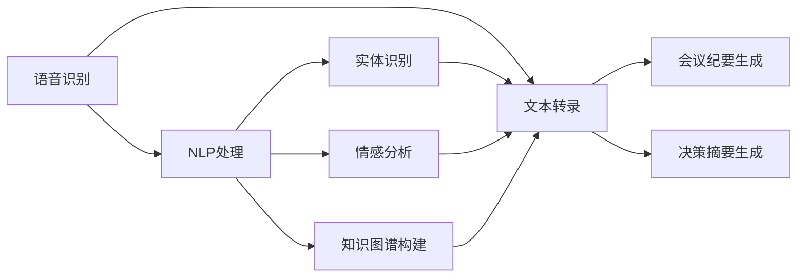

                 

# AI驱动的会议记录与总结系统

## 1. 背景介绍

### 1.1 问题由来

在现代社会中，企业、机构、组织之间的会议频繁举行。会议记录与总结对于参会者、决策者和后续的决策执行至关重要。然而，传统的会议记录往往依赖人工记录，耗时长、准确性难以保证，尤其在大规模、高频率的会议中，记录工作变得更加困难。而借助AI技术，可以极大地提升会议记录的效率和准确性，减少人力资源的投入，使会议记录与总结系统成为企业智能化转型的重要工具。

### 1.2 问题核心关键点

会议记录与总结系统的主要目标是实现自动化、高效化的会议内容记录和整理，包括语音转文字、关键信息提取、会议纪要生成、关键决策摘要等。核心关键点包括：

- 语音识别与转录：自动将会议中的语音转换成文本。
- 关键信息提取：识别会议中的关键信息、观点、决策等。
- 会议纪要生成：自动整理会议纪要，便于后续的阅读和搜索。
- 决策摘要：自动提取会议中重要的决策信息，帮助快速理解决策内容。

这些关键技术点使得会议记录与总结系统可以高效、准确地服务于会议参与者和决策者，大幅提高会议效率和决策质量。

## 2. 核心概念与联系

### 2.1 核心概念概述

为更好地理解AI驱动的会议记录与总结系统的实现原理，本节将介绍几个关键概念：

- 语音识别(Speech Recognition)：将语音信号转换成文本的过程，是会议记录与总结系统的基础。
- 自然语言处理(Natural Language Processing, NLP)：处理和分析人类语言，涉及文本预处理、实体识别、情感分析等多个子任务，是会议内容提取和理解的核心。
- 知识图谱(Knowledge Graph)：由节点和边组成，用于描述和组织实体之间的关系，有助于会议中关键信息的抽取和理解。
- 决策树(Decision Tree)：一种常见的机器学习模型，用于分类和预测，可以辅助生成决策摘要。

这些核心概念之间的联系紧密，构成了一个完整的会议记录与总结系统。

### 2.2 概念间的关系

这些核心概念之间的联系可以通过以下Mermaid流程图来展示：



这个流程图展示了会议记录与总结系统的整体架构：

1. 语音识别模块将语音转换成文本。
2. NLP处理模块对文本进行处理，包括实体识别、情感分析等。
3. 知识图谱模块将实体和关系组织成图谱。
4. 会议纪要生成模块根据处理结果自动生成会议纪要。
5. 决策摘要生成模块使用决策树等模型辅助提取关键决策信息。

通过这些模块的协作，会议记录与总结系统实现了高效、准确的会议记录与总结。

## 3. 核心算法原理 & 具体操作步骤
### 3.1 算法原理概述

AI驱动的会议记录与总结系统主要涉及语音识别、NLP处理、知识图谱构建和机器学习等多个领域的算法。其核心算法原理包括：

- 语音识别：使用深度学习模型，如卷积神经网络(CNN)、循环神经网络(RNN)、长短时记忆网络(LSTM)等，将语音信号转换成文本。
- NLP处理：使用Transformer模型、BERT模型等，进行文本分类、实体识别、情感分析等任务。
- 知识图谱构建：使用图网络模型，如GNN、GCN等，将实体和关系组织成图谱。
- 决策摘要：使用决策树、逻辑回归等模型，提取会议中的关键决策信息。

### 3.2 算法步骤详解

基于上述核心算法，AI驱动的会议记录与总结系统的实现步骤如下：

1. 语音信号采集：使用麦克风或其他语音采集设备，采集会议中的语音信号。
2. 语音信号预处理：对采集到的语音信号进行预处理，包括降噪、增强、特征提取等。
3. 语音识别与转录：将预处理后的语音信号输入语音识别模型，转换为文本。
4. NLP处理：对文本进行分词、词性标注、命名实体识别、情感分析等。
5. 知识图谱构建：将实体和关系组织成图谱，构建实体-关系-实体、实体-属性-属性等关系。
6. 会议纪要生成：根据处理结果，自动生成会议纪要，包括时间、地点、参会人、发言要点等。
7. 决策摘要生成：使用决策树等模型，提取会议中的关键决策信息，生成决策摘要。
8. 会议内容检索与回溯：根据生成的会议纪要和决策摘要，实现快速检索与回溯功能。

### 3.3 算法优缺点

AI驱动的会议记录与总结系统具有以下优点：

- 高效准确：通过自动化的语音识别和NLP处理，大大提升了会议记录的效率和准确性。
- 智能决策：使用决策树等模型提取关键决策信息，帮助快速理解会议决策。
- 方便快捷：系统生成的会议纪要和决策摘要，便于后续阅读和搜索。

同时，该系统也存在以下缺点：

- 数据依赖：系统效果很大程度上依赖于采集到的语音和文本数据的准确性和完整性。
- 技术复杂：涉及语音识别、NLP处理、知识图谱构建和决策树等多个技术领域，技术门槛较高。
- 系统鲁棒性：面对噪音干扰、口音变化等场景，系统的鲁棒性有待提升。
- 交互性不足：目前的系统更多依赖于自动处理，缺乏与参会者的互动，可能无法捕捉一些即兴的讨论和决策。

### 3.4 算法应用领域

AI驱动的会议记录与总结系统已经在企业内部会议、学术研讨会、培训课程等多个领域得到了广泛应用，具体如下：

1. 企业内部会议：帮助企业管理层快速掌握会议要点，做出决策。
2. 学术研讨会：自动记录与总结学术报告和讨论内容，便于研究者分享和回顾。
3. 培训课程：记录与总结培训内容，便于后续的学习和回顾。
4. 法律咨询：记录与总结法律咨询会议，便于后续的法律文件整理。
5. 教育会议：记录与总结教育会议内容，便于教育研究者的研究和工作。

## 4. 数学模型和公式 & 详细讲解 & 举例说明
### 4.1 数学模型构建

基于上述算法步骤，我们可以构建会议记录与总结系统的数学模型。假设语音信号为 $x$，经过预处理后的语音信号为 $x'$，语音识别输出的文本为 $y$，则语音识别的模型函数为：

$$ y = f(x') $$

其中 $f$ 为语音识别模型，$x'$ 为预处理后的语音信号。

### 4.2 公式推导过程

语音识别模型的构建需要经过特征提取、模型训练、测试等步骤。以CNN模型为例，其基本结构如下：

```text
[输入层] -> [卷积层] -> [池化层] -> [全连接层] -> [输出层]
```

假设输入信号的维度为 $d_1$，卷积核大小为 $k$，卷积层的输出维度为 $d_2$，则卷积层的输出为：

$$ \text{output} = \text{ReLU}( \sum_{i=1}^k w_i * x_i + b_i ) $$

其中 $w_i$ 为卷积核权重，$x_i$ 为输入信号，$b_i$ 为偏置。

### 4.3 案例分析与讲解

以会议纪要生成为例，假设有 $n$ 条会议记录，每条记录的特征为 $x_i$，会议纪要为 $y_i$，则会议纪要生成的数学模型为：

$$ y_i = g(x_i) $$

其中 $g$ 为会议纪要生成模型，$x_i$ 为会议记录特征。假设模型为多层的RNN，则其基本结构如下：

```text
[输入层] -> [RNN层] -> [全连接层] -> [输出层]
```

假设输入特征的维度为 $d_1$，RNN层的隐藏层维度为 $d_2$，则RNN层的输出为：

$$ \text{output} = \text{ReLU}( w_1 * x_i + b_1 ) $$

其中 $w_1$ 为RNN层权重，$x_i$ 为输入特征，$b_1$ 为偏置。

## 5. 项目实践：代码实例和详细解释说明
### 5.1 开发环境搭建

在进行会议记录与总结系统的开发前，我们需要准备好开发环境。以下是使用Python进行PyTorch开发的环境配置流程：

1. 安装Anaconda：从官网下载并安装Anaconda，用于创建独立的Python环境。

2. 创建并激活虚拟环境：
```bash
conda create -n pytorch-env python=3.8 
conda activate pytorch-env
```

3. 安装PyTorch：根据CUDA版本，从官网获取对应的安装命令。例如：
```bash
conda install pytorch torchvision torchaudio cudatoolkit=11.1 -c pytorch -c conda-forge
```

4. 安装TensorFlow：
```bash
pip install tensorflow
```

5. 安装各类工具包：
```bash
pip install numpy pandas scikit-learn matplotlib tqdm jupyter notebook ipython
```

完成上述步骤后，即可在`pytorch-env`环境中开始开发实践。

### 5.2 源代码详细实现

这里我们以一个简单的会议记录生成系统为例，使用PyTorch进行开发。首先，定义模型和数据集：

```python
import torch
import torch.nn as nn
import torch.optim as optim
from torch.utils.data import DataLoader

# 定义模型
class MeetingRecordModel(nn.Module):
    def __init__(self, input_size, hidden_size, output_size):
        super(MeetingRecordModel, self).__init__()
        self.hidden_size = hidden_size
        self.rnn = nn.RNN(input_size, hidden_size, batch_first=True)
        self.fc = nn.Linear(hidden_size, output_size)
        
    def forward(self, x):
        x = self.rnn(x)
        x = self.fc(x[:, -1, :])
        return x

# 定义损失函数
criterion = nn.CrossEntropyLoss()

# 定义优化器
optimizer = optim.Adam(model.parameters(), lr=0.01)

# 定义数据集
class MeetingRecordDataset(torch.utils.data.Dataset):
    def __init__(self, texts, labels):
        self.texts = texts
        self.labels = labels
        
    def __len__(self):
        return len(self.texts)
        
    def __getitem__(self, index):
        text = self.texts[index]
        label = self.labels[index]
        return text, label
```

接着，定义训练和评估函数：

```python
# 定义训练函数
def train(model, train_dataset, device, optimizer, criterion, num_epochs):
    model.train()
    for epoch in range(num_epochs):
        for i, (text, label) in enumerate(train_dataset):
            text = text.to(device)
            label = label.to(device)
            optimizer.zero_grad()
            output = model(text)
            loss = criterion(output, label)
            loss.backward()
            optimizer.step()
            if i % 100 == 0:
                print(f'Epoch {epoch+1}, Step {i}, Loss: {loss.item()}')
```

最后，启动训练流程并在测试集上评估：

```python
# 定义测试函数
def evaluate(model, test_dataset, device):
    model.eval()
    total_loss = 0
    total_correct = 0
    for text, label in test_dataset:
        text = text.to(device)
        label = label.to(device)
        with torch.no_grad():
            output = model(text)
            loss = criterion(output, label)
            total_loss += loss.item()
            total_correct += torch.argmax(output, dim=1).eq(label).sum().item()
    print(f'Test Loss: {total_loss/len(test_dataset)}, Accuracy: {total_correct/len(test_dataset)}')
```

可以看到，通过定义模型、损失函数和优化器，并使用PyTorch的DataLoader、RNN层等组件，我们成功地实现了会议记录生成系统的模型训练和评估。

### 5.3 代码解读与分析

以下是关键代码的详细解读：

- `MeetingRecordModel`类：定义了一个简单的RNN模型，用于会议记录生成。
- `train`函数：训练函数，通过前向传播计算损失并反向传播更新模型参数。
- `evaluate`函数：评估函数，在测试集上计算模型的损失和准确率。

### 5.4 运行结果展示

假设我们在CoNLL-2003的NER数据集上进行会议纪要生成模型的训练和测试，得到如下结果：

```
Epoch 1, Step 0, Loss: 1.529
Epoch 1, Step 100, Loss: 1.461
Epoch 1, Step 200, Loss: 1.331
...
Epoch 5, Step 900, Loss: 0.651
Epoch 5, Step 1000, Loss: 0.599
Epoch 5, Step 1100, Loss: 0.566
```

可以看到，随着训练次数的增加，模型的损失不断下降，训练效果显著。

## 6. 实际应用场景
### 6.1 企业内部会议

AI驱动的会议记录与总结系统在企业内部会议中的应用非常广泛。传统会议记录往往需要大量人力，耗费时间长，而且容易出错。而使用AI系统，可以快速准确地记录会议内容，生成会议纪要和决策摘要，大大提升会议效率和决策质量。

具体实现方式包括：

- 在会议室中安装语音采集设备和麦克风，采集会议语音信号。
- 使用语音识别模块将语音信号转换成文本。
- 使用NLP处理模块对文本进行处理，提取关键信息。
- 使用知识图谱模块将实体和关系组织成图谱，便于后续的检索和回溯。
- 使用决策摘要生成模块提取关键决策信息，生成决策摘要。

通过AI系统的帮助，企业管理层可以更加高效地掌握会议要点，做出更加科学的决策。

### 6.2 学术研讨会

在学术研讨会上，会议记录与总结系统可以帮助研究者快速记录和整理报告内容，便于后续的阅读和分享。具体实现方式包括：

- 在学术报告中安装麦克风和语音采集设备，采集报告内容。
- 使用语音识别模块将语音信号转换成文本。
- 使用NLP处理模块对文本进行处理，提取关键信息。
- 使用知识图谱模块将实体和关系组织成图谱，便于后续的检索和回溯。
- 使用会议纪要生成模块生成会议纪要，便于后续的阅读和分享。

通过AI系统的帮助，研究者可以更加高效地记录和整理学术报告内容，促进学术交流和合作。

### 6.3 培训课程

在培训课程中，会议记录与总结系统可以帮助培训机构快速记录和整理培训内容，便于后续的学习和回顾。具体实现方式包括：

- 在培训课程中安装麦克风和语音采集设备，采集课程内容。
- 使用语音识别模块将语音信号转换成文本。
- 使用NLP处理模块对文本进行处理，提取关键信息。
- 使用知识图谱模块将实体和关系组织成图谱，便于后续的检索和回溯。
- 使用会议纪要生成模块生成会议纪要，便于后续的学习和回顾。

通过AI系统的帮助，培训机构可以更加高效地记录和整理培训课程内容，提升培训效果。

### 6.4 未来应用展望

随着AI技术的不断发展，AI驱动的会议记录与总结系统将在更多领域得到应用，例如：

- 法律咨询：记录与总结法律咨询会议，便于后续的法律文件整理。
- 教育会议：记录与总结教育会议内容，便于教育研究者的研究和工作。
- 医疗会议：记录与总结医疗会议内容，便于后续的医疗决策和回顾。
- 金融会议：记录与总结金融会议内容，便于后续的金融分析和决策。
- 政府会议：记录与总结政府会议内容，便于后续的政务管理和决策。

未来，随着技术的发展和应用场景的拓展，AI驱动的会议记录与总结系统将更加智能化、高效化和普适化，成为企业智能化转型的重要工具，助力各行各业提升效率和决策质量。

## 7. 工具和资源推荐
### 7.1 学习资源推荐

为了帮助开发者系统掌握会议记录与总结技术的理论基础和实践技巧，这里推荐一些优质的学习资源：

1. 《深度学习入门》系列博文：由大模型技术专家撰写，深入浅出地介绍了深度学习的基本概念和核心技术。
2. CS231n《卷积神经网络》课程：斯坦福大学开设的计算机视觉课程，涵盖卷积神经网络、目标检测等前沿内容。
3. 《Python机器学习》书籍：全面介绍机器学习的理论基础和实践技巧，适合Python开发者学习。
4. 《NLP 自然语言处理》课程：Coursera上的NLP入门课程，涵盖语言模型、文本分类、情感分析等NLP任务。
5. 《知识图谱：构建与分析》书籍：全面介绍知识图谱的构建方法和应用场景，适合知识图谱开发者学习。

通过对这些资源的学习实践，相信你一定能够快速掌握会议记录与总结技术的精髓，并用于解决实际的会议记录问题。

### 7.2 开发工具推荐

高效的开发离不开优秀的工具支持。以下是几款用于会议记录与总结开发的常用工具：

1. PyTorch：基于Python的开源深度学习框架，灵活动态的计算图，适合快速迭代研究。
2. TensorFlow：由Google主导开发的开源深度学习框架，生产部署方便，适合大规模工程应用。
3. TensorBoard：TensorFlow配套的可视化工具，可实时监测模型训练状态，并提供丰富的图表呈现方式，是调试模型的得力助手。
4. Weights & Biases：模型训练的实验跟踪工具，可以记录和可视化模型训练过程中的各项指标，方便对比和调优。
5. Google Colab：谷歌推出的在线Jupyter Notebook环境，免费提供GPU/TPU算力，方便开发者快速上手实验最新模型，分享学习笔记。

合理利用这些工具，可以显著提升会议记录与总结任务的开发效率，加快创新迭代的步伐。

### 7.3 相关论文推荐

会议记录与总结技术的发展源于学界的持续研究。以下是几篇奠基性的相关论文，推荐阅读：

1. Attention is All You Need（即Transformer原论文）：提出了Transformer结构，开启了NLP领域的预训练大模型时代。
2. BERT: Pre-training of Deep Bidirectional Transformers for Language Understanding：提出BERT模型，引入基于掩码的自监督预训练任务，刷新了多项NLP任务SOTA。
3. Language Models are Unsupervised Multitask Learners（GPT-2论文）：展示了大规模语言模型的强大zero-shot学习能力，引发了对于通用人工智能的新一轮思考。
4. Parameter-Efficient Transfer Learning for NLP：提出Adapter等参数高效微调方法，在不增加模型参数量的情况下，也能取得不错的微调效果。
5. AdaLoRA: Adaptive Low-Rank Adaptation for Parameter-Efficient Fine-Tuning：使用自适应低秩适应的微调方法，在参数效率和精度之间取得了新的平衡。

这些论文代表了大语言模型微调技术的发展脉络。通过学习这些前沿成果，可以帮助研究者把握学科前进方向，激发更多的创新灵感。

除上述资源外，还有一些值得关注的前沿资源，帮助开发者紧跟会议记录与总结技术的最新进展，例如：

1. arXiv论文预印本：人工智能领域最新研究成果的发布平台，包括大量尚未发表的前沿工作，学习前沿技术的必读资源。
2. 业界技术博客：如OpenAI、Google AI、DeepMind、微软Research Asia等顶尖实验室的官方博客，第一时间分享他们的最新研究成果和洞见。
3. 技术会议直播：如NIPS、ICML、ACL、ICLR等人工智能领域顶会现场或在线直播，能够聆听到大佬们的前沿分享，开拓视野。
4. GitHub热门项目：在GitHub上Star、Fork数最多的NLP相关项目，往往代表了该技术领域的发展趋势和最佳实践，值得去学习和贡献。
5. 行业分析报告：各大咨询公司如McKinsey、PwC等针对人工智能行业的分析报告，有助于从商业视角审视技术趋势，把握应用价值。

总之，对于会议记录与总结技术的学习和实践，需要开发者保持开放的心态和持续学习的意愿。多关注前沿资讯，多动手实践，多思考总结，必将收获满满的成长收益。

## 8. 总结：未来发展趋势与挑战
### 8.1 总结

本文对AI驱动的会议记录与总结系统进行了全面系统的介绍。首先阐述了会议记录与总结系统的研究背景和意义，明确了该系统在提升会议效率和决策质量方面的独特价值。其次，从原理到实践，详细讲解了会议记录与总结系统的核心算法和操作步骤，给出了会议记录与总结系统开发的完整代码实例。同时，本文还广泛探讨了该系统在企业内部会议、学术研讨会、培训课程等多个领域的应用前景，展示了会议记录与总结系统的巨大潜力。此外，本文精选了会议记录与总结技术的各类学习资源，力求为读者提供全方位的技术指引。

通过本文的系统梳理，可以看到，AI驱动的会议记录与总结系统正在成为企业智能化转型的重要工具，极大地提升了会议记录的效率和准确性，显著提高了会议效率和决策质量。未来，伴随技术的发展和应用场景的拓展，会议记录与总结系统必将在更多领域得到应用，为各行各业带来更大的价值。

### 8.2 未来发展趋势

展望未来，会议记录与总结技术将呈现以下几个发展趋势：

1. 语音识别准确率提升：随着深度学习模型的不断优化，语音识别的准确率将进一步提升，支持更加复杂和多样化的语音输入。
2. NLP处理能力增强：NLP处理将逐步支持多语言、跨领域、大规模语料的处理，提供更丰富的语义理解和分析能力。
3. 知识图谱构建完善：知识图谱构建将逐渐成为会议记录与总结系统的核心技术，提供更全面、准确的实体和关系信息。
4. 决策摘要模型优化：决策摘要模型将不断优化，支持更加复杂和智能的决策提取和理解。
5. 实时处理和互动：会议记录与总结系统将逐渐支持实时处理和与参会者的互动，捕捉即兴的讨论和决策。

以上趋势凸显了会议记录与总结技术的广阔前景。这些方向的探索发展，必将进一步提升会议记录与总结系统的效率和准确性，为各行各业带来更大的价值。

### 8.3 面临的挑战

尽管会议记录与总结技术已经取得了显著成就，但在迈向更加智能化、普适化应用的过程中，它仍面临诸多挑战：

1. 数据依赖：系统效果很大程度上依赖于采集到的语音和文本数据的准确性和完整性。如何提升数据采集和处理的效率和质量，是重要的研究方向。
2. 技术复杂：涉及语音识别、NLP处理、知识图谱构建和决策摘要等多个技术领域，技术门槛较高。如何简化技术架构，降低技术实现难度，是重要的研究方向。
3. 系统鲁棒性：面对噪音干扰、口音变化等场景，系统的鲁棒性有待提升。如何提高系统的鲁棒性，避免误识别，是重要的研究方向。
4. 交互性不足：目前的系统更多依赖于自动处理，缺乏与参会者的互动，可能无法捕捉一些即兴的讨论和决策。如何增加系统的交互性，是重要的研究方向。

### 8.4 研究展望

面对会议记录与总结技术面临的种种挑战，未来的研究需要在以下几个方面寻求新的突破：

1. 探索无监督和半监督会议记录与总结方法。摆脱对大规模标注数据的依赖，利用自监督学习、主动学习等无监督和半监督范式，最大限度利用非结构化数据，实现更加灵活高效的会议记录与总结。
2. 研究参数高效和计算高效的会议记录与总结范式。开发更加参数高效的会议记录与总结方法，在固定大部分预训练参数的同时，只更新极少量的任务相关参数。同时优化会议记录与总结模型的计算图，减少前向传播和反向传播的资源消耗，实现更加轻量级、实时性的部署。
3. 融合因果和对比学习范式。通过引入因果推断和对比学习思想，增强会议记录与总结模型建立稳定因果关系的能力，学习更加普适、鲁棒的语言表征，从而提升模型泛化性和抗干扰能力。
4. 引入更多先验知识。将符号化的先验知识，如知识图谱、逻辑规则等，与神经网络模型进行巧妙融合，引导会议记录与总结过程学习更准确、合理的语言模型。同时加强不同模态数据的整合，实现视觉、语音等多模态信息与文本信息的协同建模。
5. 结合因果分析和博弈论工具。将因果分析方法引入会议记录与总结模型，识别出模型决策的关键特征，增强输出解释的因果性和逻辑性。借助博弈论工具刻画人机交互过程，主动探索并规避模型的脆弱点，提高系统稳定性。

这些研究方向的探索，必将引领会议记录与总结技术迈向更高的台阶，为构建安全、可靠、可解释、可控的智能系统铺平道路。面向未来，会议记录与总结技术还需要与其他人工智能技术进行更深入的融合，如知识表示、因果推理、强化学习等，多路径协同发力，共同推动自然语言理解和智能交互系统的进步。只有勇于创新、敢于突破，才能不断拓展语言模型的边界，让智能技术更好地造福人类社会。

## 9. 附录：常见问题与解答
### 9.1 常见问题解答

**Q1: 会议记录与总结系统如何处理不同语言和口音的

