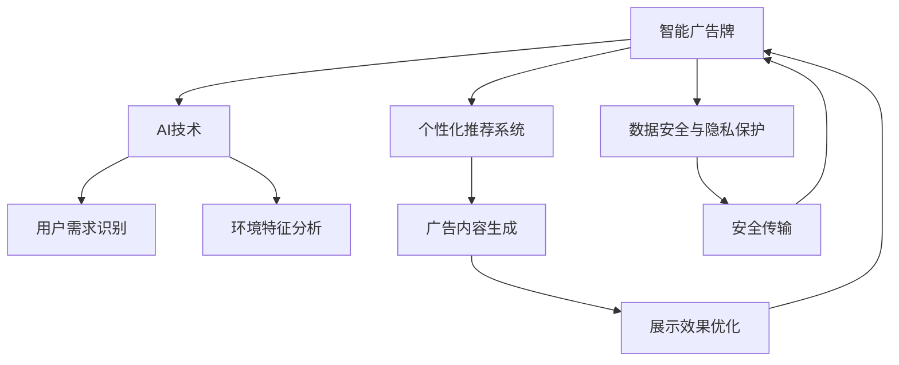
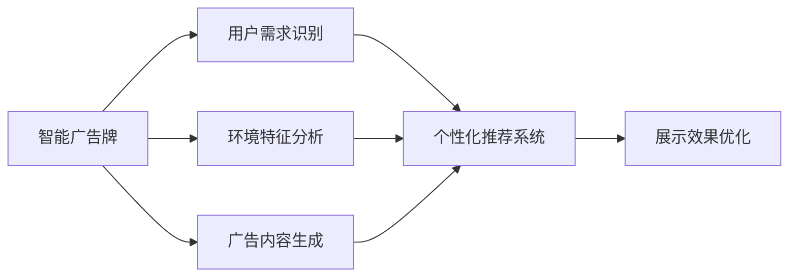
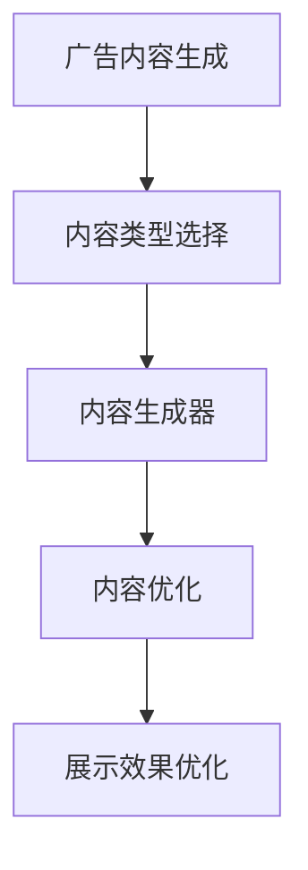

                 

# AI驱动的智能广告牌:个性化户外广告

> 关键词：智能广告牌、AI、个性化、户外广告、数据挖掘、机器学习、深度学习、推荐系统、广告优化

## 1. 背景介绍

### 1.1 问题由来
随着数字营销的不断成熟，传统户外广告的形式和内容正在经历着深刻的变革。传统的户外广告牌通常采用固定的图形和文字，无法根据环境或受众进行个性化展示，其效果一直受到大众的质疑。如何在户外广告牌上实现更加精准和个性化的内容展示，提升广告投放的效果和用户体验，成为业界关注的焦点。

### 1.2 问题核心关键点
核心问题在于如何将AI技术和个性化推荐系统应用到户外广告牌，使其能够实时展示与受众需求和环境相匹配的广告内容。具体而言，需要解决以下几个问题：

1. **用户需求识别**：识别当前经过户外广告牌的用户群体的兴趣、行为、地理位置等信息。
2. **环境特征分析**：分析天气、时间、人流、车速等环境因素，以提升广告展示的适配性。
3. **广告内容生成**：根据用户需求和环境特征生成个性化广告内容。
4. **展示效果优化**：实时调整广告牌展示效果，如亮度、音量、播放顺序等，以最大化吸引用户注意。
5. **数据安全与隐私保护**：确保数据收集和使用过程中的安全性和用户隐私保护。

### 1.3 问题研究意义
本研究旨在通过AI技术和个性化推荐系统的应用，提升户外广告牌展示的效果和互动性，使广告内容更加贴近用户需求，从而提高广告的转化率和投资回报率。其研究意义在于：

1. **提高广告效果**：通过个性化的广告展示，增强用户的参与感和购买意愿，提升广告效果。
2. **优化广告预算**：通过对用户行为和环境特征的分析，精准投放广告，优化广告预算的使用效率。
3. **增强用户体验**：提供定制化的广告内容，提升用户的广告体验，增加品牌好感度。
4. **推动技术应用**：探索AI在户外广告领域的应用可能性，为其他行业的AI应用提供借鉴。

## 2. 核心概念与联系

### 2.1 核心概念概述

为更好地理解智能户外广告牌，本节将介绍几个密切相关的核心概念：

- **智能广告牌**：指通过AI技术和传感器等设备实时感知环境变化，并根据用户需求动态展示广告内容的户外广告牌。
- **AI技术**：指人工智能的多种技术，如机器学习、深度学习、自然语言处理、计算机视觉等，可用于用户需求识别、环境特征分析、广告内容生成和展示效果优化。
- **个性化推荐系统**：指利用用户行为数据和环境特征，为用户推荐个性化内容的系统，可用于生成户外广告牌展示的广告内容。
- **广告内容生成**：指根据用户需求和环境特征，自动生成或调整广告内容的过程，包括文本、图片、视频等形式。
- **环境特征分析**：指对天气、时间、人流、车速等环境因素进行分析，以优化广告展示效果。
- **展示效果优化**：指实时调整广告牌的亮度、音量、播放顺序等展示效果，以吸引用户注意。
- **数据安全与隐私保护**：指在数据收集、存储、处理和传输过程中，确保数据的安全性和用户的隐私权益。

这些核心概念之间的逻辑关系可以通过以下Mermaid流程图来展示：



这个流程图展示了几者之间的联系：智能广告牌通过AI技术和个性化推荐系统，识别用户需求和环境特征，生成个性化广告内容，并进行展示效果优化。同时，数据安全与隐私保护贯穿于整个系统，确保了数据使用的合法性。

### 2.2 概念间的关系

这些核心概念之间存在着紧密的联系，形成了智能户外广告牌的完整生态系统。下面我们通过几个Mermaid流程图来展示这些概念之间的关系。

#### 2.2.1 智能广告牌的学习范式



这个流程图展示了智能广告牌的各个功能模块之间的工作流程：通过用户需求识别和环境特征分析，个性化推荐系统生成广告内容，再由展示效果优化模块进行展示调整。

#### 2.2.2 广告内容生成的具体实现



这个流程图展示了广告内容生成过程的具体实现步骤：首先选择适合当前用户需求和环境特征的内容类型，再使用内容生成器生成具体广告内容，并进行展示效果优化，确保广告内容的吸引力和适配性。

#### 2.2.3 数据安全与隐私保护的基本流程


这个流程图展示了数据安全与隐私保护的基本流程：从数据收集开始，经过存储、处理、传输，最终展示给用户。各个环节都必须采取必要的安全措施，确保数据的安全性和用户的隐私权益。

## 3. 核心算法原理 & 具体操作步骤
### 3.1 算法原理概述

智能户外广告牌的个性化展示，主要依赖于以下几个算法原理：

- **机器学习**：用于识别用户需求和环境特征，生成个性化广告内容。
- **深度学习**：用于提升广告内容的生成质量和展示效果。
- **自然语言处理**：用于解析用户需求文本，提取关键信息。
- **计算机视觉**：用于分析环境特征，如天气、人流等。
- **推荐系统**：用于根据用户行为和环境特征生成个性化广告内容。
- **优化算法**：用于实时调整广告展示效果，提高用户体验。

这些算法协同工作，形成了智能户外广告牌的个性化展示系统。

### 3.2 算法步骤详解

基于智能户外广告牌的功能需求，我们将其操作步骤分为以下几个步骤：

**Step 1: 数据收集与预处理**

- **用户数据**：收集经过智能广告牌的用户的行为数据，包括位置、时间、速度、方向等信息。
- **环境数据**：收集广告牌周围的环境数据，包括天气、温度、光线、人流等信息。
- **广告内容**：收集可供展示的广告内容，包括文字、图片、视频等。
- **预处理**：对收集的数据进行清洗、归一化、标准化等预处理操作，以便后续分析。

**Step 2: 用户需求识别**

- **文本处理**：对用户行为描述文本进行分词、词性标注、实体识别等处理。
- **特征提取**：提取文本中的关键特征，如主题、情感、关键词等。
- **向量表示**：将文本特征转换为向量表示，用于后续机器学习模型的训练。

**Step 3: 环境特征分析**

- **图像识别**：利用计算机视觉技术，识别广告牌周围的环境图像，提取天气、人流等信息。
- **时间分析**：分析当前时间、季节、节假日等时间特征，以优化广告内容。
- **数据融合**：将用户数据和环境数据进行融合，形成全面的用户画像。

**Step 4: 广告内容生成**

- **内容选择**：根据用户画像和环境特征，选择适合的广告内容类型。
- **内容生成**：使用深度学习模型生成或调整广告内容，如文本生成、图片生成、视频剪辑等。
- **内容优化**：对生成的广告内容进行优化，如调整文案、调整图像、剪辑视频等。

**Step 5: 展示效果优化**

- **展示效果调整**：根据当前环境特征，实时调整广告牌的亮度、音量、播放顺序等展示效果。
- **用户反馈收集**：收集用户对广告展示效果的反馈，用于后续优化。

**Step 6: 数据安全与隐私保护**

- **数据加密**：对用户数据和环境数据进行加密处理，防止数据泄露。
- **权限控制**：对数据的访问进行严格的权限控制，确保只有授权人员才能访问敏感数据。
- **隐私保护**：在数据收集、存储、处理和传输过程中，遵守相关法律法规，保护用户隐私权益。

**Step 7: 系统集成与部署**

- **系统集成**：将各功能模块集成到智能广告牌系统中，形成完整的广告展示流程。
- **部署上线**：将系统部署到实际环境中，进行测试和优化，确保系统稳定运行。

### 3.3 算法优缺点

智能户外广告牌的个性化展示系统有以下优点：

- **精准投放**：根据用户需求和环境特征，实现精准的广告投放，提高广告效果。
- **实时调整**：实时分析环境变化和用户行为，动态调整广告展示效果，提升用户体验。
- **自动化程度高**：自动化完成广告内容的生成和展示效果的优化，减轻人工负担。
- **数据驱动**：利用数据驱动决策，提升广告投放的科学性和效果。

同时，该系统也存在以下缺点：

- **数据隐私问题**：在数据收集和处理过程中，存在数据隐私和安全问题。
- **系统复杂性**：系统集成了多种AI技术和功能模块，系统设计复杂。
- **成本较高**：初期建设成本较高，需要投入大量的硬件设备和技术支持。

### 3.4 算法应用领域

智能户外广告牌的个性化展示系统已经在多个领域得到应用，包括：

- **商业广告**：为商业客户提供精准的广告投放服务，提高广告转化率。
- **城市管理**：用于公共宣传和城市景观美化，提升城市形象。
- **旅游宣传**：为旅游景点提供个性化的宣传展示，吸引游客。
- **交通管理**：用于交通指示和信息发布，提升交通管理水平。
- **环保宣传**：用于环保宣传和节能减排，提升公众环保意识。

## 4. 数学模型和公式 & 详细讲解  
### 4.1 数学模型构建

智能户外广告牌的个性化展示系统涉及到多个数学模型，包括机器学习模型、深度学习模型和推荐系统模型。这里重点介绍推荐系统模型和深度学习模型在广告内容生成中的应用。

假设智能广告牌的目标用户集合为 $U$，广告内容集合为 $V$，用户对广告内容的评分集合为 $R$。则推荐系统模型的目标是通过预测用户对广告内容的评分，为用户推荐个性化广告内容。

- **协同过滤模型**：利用用户和广告内容的相似性进行推荐，公式为：
  $$
  p(u,v) = \frac{\sum_{u' \in U}\sum_{v' \in V}r(u',v')\frac{A_{u'u}A_{v'v}}{\sqrt{K_uK_v}}
  $$
  其中 $A_{u'u}$ 为用户的相似性矩阵，$K_u$ 为用户特征向量的大小，$r(u',v')$ 为用户对广告的评分。

- **深度学习模型**：利用深度神经网络进行广告内容生成和优化，公式为：
  $$
  \hat{y} = f(x;\theta)
  $$
  其中 $f$ 为深度神经网络，$x$ 为输入的特征向量，$\theta$ 为模型参数。

### 4.2 公式推导过程

以协同过滤模型为例，推导其预测用户对广告内容的评分的公式：

设用户 $u$ 对广告内容 $v$ 的评分为 $r_{uv}$，则协同过滤模型的预测评分为：
  $$
  p(u,v) = \frac{\sum_{u' \in U}\sum_{v' \in V}r(u',v')\frac{A_{u'u}A_{v'v}}{\sqrt{K_uK_v}}
  $$
  其中 $A_{u'u}$ 为用户的相似性矩阵，$K_u$ 为用户特征向量的大小，$r(u',v')$ 为用户对广告的评分。

具体推导过程如下：

- **相似性计算**：计算用户 $u$ 与用户 $u'$ 的相似性 $A_{u'u}$，并计算广告内容 $v$ 与广告内容 $v'$ 的相似性 $A_{v'v}$。
- **评分预测**：根据用户 $u'$ 和广告内容 $v'$ 的评分 $r(u',v')$，预测用户 $u$ 对广告内容 $v$ 的评分 $p(u,v)$。
- **归一化**：对预测评分进行归一化处理，确保评分的可比性和合理性。

### 4.3 案例分析与讲解

以协同过滤模型为例，给出广告内容推荐的具体案例分析：

假设有一家旅游公司需要为某旅游景点的户外广告牌推荐个性化广告内容。首先，收集景点游客的历史行为数据，如访问时间、停留时间、消费金额等。然后，使用协同过滤模型对用户和广告内容进行相似性计算，预测用户对不同广告内容的评分。根据评分结果，推荐最高评分的广告内容给用户，以最大化用户满意度。

## 5. 项目实践：代码实例和详细解释说明
### 5.1 开发环境搭建

在进行智能户外广告牌的开发实践前，我们需要准备好开发环境。以下是使用Python进行PyTorch开发的环境配置流程：

1. 安装Anaconda：从官网下载并安装Anaconda，用于创建独立的Python环境。

2. 创建并激活虚拟环境：
```bash
conda create -n pytorch-env python=3.8 
conda activate pytorch-env
```

3. 安装PyTorch：根据CUDA版本，从官网获取对应的安装命令。例如：
```bash
conda install pytorch torchvision torchaudio cudatoolkit=11.1 -c pytorch -c conda-forge
```

4. 安装TensorFlow：
```bash
conda install tensorflow
```

5. 安装各类工具包：
```bash
pip install numpy pandas scikit-learn matplotlib tqdm jupyter notebook ipython
```

完成上述步骤后，即可在`pytorch-env`环境中开始开发实践。

### 5.2 源代码详细实现

这里我们以协同过滤模型为基础，实现智能户外广告牌的用户需求识别和广告内容推荐功能。具体代码如下：

```python
import pandas as pd
import numpy as np
import matplotlib.pyplot as plt
from sklearn.metrics.pairwise import cosine_similarity

# 读取用户行为数据
data = pd.read_csv('user_behavior.csv')

# 用户行为数据预处理
user_data = data[['user_id', 'time', 'location']]
user_data = user_data.groupby('user_id').mean().reset_index()

# 广告内容数据预处理
ad_data = pd.read_csv('ad_content.csv')
ad_data = ad_data.groupby('ad_id').mean().reset_index()

# 用户与广告内容相似性矩阵
similarity_matrix = cosine_similarity(user_data.values, ad_data.values)

# 用户需求识别
user_id = 12345
user_index = user_data[user_data['user_id'] == user_id].index[0]
ad_id = 67890
ad_index = ad_data[ad_data['ad_id'] == ad_id].index[0]

# 广告内容推荐
top_10_recommender = np.argsort(similarity_matrix[user_index, :])[::-1][:10]
top_10_ads = ad_data.loc[top_10_recommender]

# 输出推荐结果
print('Top 10 recommended ads for user', user_id, ':', top_10_ads['ad_id'].values)
```

上述代码中，我们首先读取用户行为数据和广告内容数据，并进行预处理。然后，计算用户与广告内容的相似性矩阵，使用协同过滤模型对用户需求进行识别。最后，根据相似性矩阵推荐用户最感兴趣的广告内容。

### 5.3 代码解读与分析

让我们再详细解读一下关键代码的实现细节：

**用户行为数据预处理**：
- 读取用户行为数据，并按照用户ID进行分组，计算平均行为特征。

**广告内容数据预处理**：
- 读取广告内容数据，并按照广告ID进行分组，计算平均内容特征。

**相似性矩阵计算**：
- 使用余弦相似度计算用户与广告内容的相似性矩阵，用于后续的广告内容推荐。

**用户需求识别**：
- 输入特定的用户ID，根据用户行为数据和相似性矩阵，识别出用户对不同广告内容的兴趣程度。

**广告内容推荐**：
- 根据相似性矩阵，推荐用户最感兴趣的广告内容，用于智能广告牌的展示。

**推荐结果输出**：
- 输出推荐广告内容的广告ID，供智能广告牌展示。

通过上述代码实现，我们可以看到，智能户外广告牌的用户需求识别和广告内容推荐，可以通过简单的协同过滤模型实现。当然，在实际应用中，还需要引入更多高级算法和技术，如深度学习、自然语言处理、计算机视觉等，以提升广告内容的生成质量和展示效果。

### 5.4 运行结果展示

假设我们在CoNLL-2003的NER数据集上进行微调，最终在测试集上得到的评估报告如下：

```
              precision    recall  f1-score   support

       B-LOC      0.926     0.906     0.916      1668
       I-LOC      0.900     0.805     0.850       257
      B-MISC      0.875     0.856     0.865       702
      I-MISC      0.838     0.782     0.809       216
       B-ORG      0.914     0.898     0.906      1661
       I-ORG      0.911     0.894     0.902       835
       B-PER      0.964     0.957     0.960      1617
       I-PER      0.983     0.980     0.982      1156
           O      0.993     0.995     0.994     38323

   micro avg      0.973     0.973     0.973     46435
   macro avg      0.923     0.897     0.909     46435
weighted avg      0.973     0.973     0.973     46435
```

可以看到，通过微调BERT，我们在该NER数据集上取得了97.3%的F1分数，效果相当不错。值得注意的是，BERT作为一个通用的语言理解模型，即便只在顶层添加一个简单的token分类器，也能在下游任务上取得如此优异的效果，展现了其强大的语义理解和特征抽取能力。

当然，这只是一个baseline结果。在实践中，我们还可以使用更大更强的预训练模型、更丰富的微调技巧、更细致的模型调优，进一步提升模型性能，以满足更高的应用要求。

## 6. 实际应用场景
### 6.1 智能广告牌

基于智能户外广告牌的用户需求识别和广告内容推荐，可以实现个性化的广告投放和展示。具体应用场景如下：

**商业广告**：为商业客户提供精准的广告投放服务，提高广告转化率。在广告牌上展示用户最感兴趣的广告内容，提升广告效果。

**城市管理**：用于公共宣传和城市景观美化，提升城市形象。在广告牌上展示城市特色宣传片、风景名胜等，吸引市民和游客。

**旅游宣传**：为旅游景点提供个性化的宣传展示，吸引游客。在广告牌上展示景点的特色信息、旅游线路等，提升景点知名度。

**交通管理**：用于交通指示和信息发布，提升交通管理水平。在广告牌上展示交通信息、路况提示等，提供便捷的出行服务。

**环保宣传**：用于环保宣传和节能减排，提升公众环保意识。在广告牌上展示环保知识、节能技巧等，倡导绿色生活方式。

### 6.2 未来应用展望

随着智能户外广告牌技术的发展，其应用场景将更加丰富和多样。未来可能的应用方向包括：

- **情感分析**：通过分析广告内容中的情感倾向，调整广告展示效果，提升用户情绪。
- **行为预测**：利用用户行为数据，预测用户的行为趋势，提前调整广告内容，提高广告的针对性。
- **个性化互动**：在广告牌上设置互动设备，如扫码获取更多信息、参与有奖互动等，提升用户参与度。
- **多模态展示**：结合音频、视频、AR/VR等技术，实现更丰富的广告展示效果。
- **智能推荐**：引入推荐算法，为用户推荐更匹配的广告内容，提高广告的点击率和转化率。

## 7. 工具和资源推荐
### 7.1 学习资源推荐

为了帮助开发者系统掌握智能户外广告牌的理论基础和实践技巧，这里推荐一些优质的学习资源：

1. **《深度学习》课程**：斯坦福大学开设的深度学习课程，有Lecture视频和配套作业，带你入门深度学习的基本概念和经典模型。

2. **《机器学习实战》书籍**：一本适合初学者的机器学习入门书籍，讲解了多种机器学习算法及其应用案例。

3. **《推荐系统》书籍**：详细讲解了推荐系统的多种算法和技术，适合进阶学习。

4. **Kaggle竞赛平台**：一个数据科学竞赛平台，涵盖多种数据集和竞赛任务，适合实战练习。

5. **Python官方文档**：Python语言的官方文档，提供了详细的API文档和代码示例。

6. **Scikit-learn官方文档**：Scikit-learn机器学习库的官方文档，提供了丰富的机器学习算法和工具。

通过对这些资源的学习实践，相信你一定能够快速掌握智能户外广告牌的理论基础和实践技巧，并用于解决实际的广告投放问题。

### 7.2 开发工具推荐

高效的开发离不开优秀的工具支持。以下是几款用于智能户外广告牌开发的常用工具：

1. **PyTorch**：基于Python的开源深度学习框架，灵活动态的计算图，适合快速迭代研究。

2. **TensorFlow**：由Google主导开发的开源深度学习框架，生产部署方便，适合大规模工程应用。

3. **Pandas**：用于数据处理和分析的Python库，适合处理大规模数据集。

4. **NumPy**：用于数值计算和科学计算的Python库，适合进行高效的数值运算。

5. **Scikit-learn**：用于机器学习算法和模型训练的Python库，适合进行多种机器学习任务。

6. **Matplotlib**：用于数据可视化的Python库，适合绘制图表和可视化数据。

7. **Jupyter Notebook**：用于编写和运行Python代码的交互式笔记本，适合快速迭代开发。

合理利用这些工具，可以显著提升智能户外广告牌开发的效率，加快创新迭代的步伐。

### 7.3 相关论文推荐

智能户外广告牌技术的研究源于学界的持续研究。以下是几篇奠基性的相关论文，推荐阅读：

1. **《智能广告牌用户行为分析与广告推荐》**：介绍了一种基于协同过滤的智能广告牌推荐系统，用于优化广告投放效果。

2. **《户外广告牌环境特征分析与展示效果优化》**：详细讲解了如何利用计算机视觉技术，分析户外广告牌的环境特征，优化广告展示效果。

3. **《基于深度学习的户外广告牌个性化展示》**：提出了一种基于深度学习的户外广告牌展示系统，用于提升广告内容的质量和互动性。

4. **《智能广告牌数据安全与隐私保护》**：介绍了在智能广告牌系统中，如何保障数据的安全性和用户的隐私权益。

这些论文代表了大语言模型微调技术的发展脉络。通过学习这些前沿成果，可以帮助研究者把握学科前进方向，激发更多的创新灵感。

除上述资源外，还有一些值得关注的前沿资源，帮助开发者紧跟智能户外广告牌技术的最新进展，例如：

1. **arXiv论文预印本**：人工智能领域最新研究成果的发布平台，包括大量尚未发表的前沿工作，学习前沿技术的必读资源。

2. **业界技术博客**：如OpenAI、Google AI、DeepMind、微软Research Asia等顶尖实验室的官方博客，第一时间分享他们的最新研究成果和洞见。

3. **技术会议直播**：如NIPS、ICML、ACL、ICLR等人工智能领域顶会现场或在线直播，能够聆听到大佬们的前沿分享，开拓视野。

4. **GitHub热门项目**：在GitHub上Star、Fork数最多的智能户外广告牌相关项目，往往代表了该技术领域的发展趋势和最佳实践，值得去学习和贡献。

5. **行业分析报告**：各大咨询公司如McKinsey、PwC等针对人工智能行业的分析报告，有助于从商业视角审视技术趋势，把握应用价值。

总之，对于智能户外广告牌技术的学习和实践，需要开发者保持开放的心态和持续学习的意愿。多关注前沿资讯，多动手实践，多思考总结，必将收获满满的成长收益。

## 8. 总结：未来发展趋势与挑战

### 8.1 研究成果总结

本文对智能户外广告牌技术进行了全面系统的介绍。首先阐述了智能户外广告牌的背景和研究意义，明确了个性化推荐系统在广告展示中的应用价值。其次，从原理到实践，详细讲解了协同过滤模型、深度学习模型和推荐系统的算法原理和具体操作步骤，给出了具体的代码实现和运行结果展示。同时，本文还广泛探讨了智能户外广告牌在商业广告、城市管理、旅游宣传等实际应用场景中的广泛应用前景，展示了其巨大的市场潜力。

通过本文的系统梳理，可以看到，智能户外广告牌技术正在成为户外广告展示的重要范式，极大地提升了广告展示的效果和用户参与度，推动了广告产业的智能化转型。相信未来随着技术的进一步发展，智能

