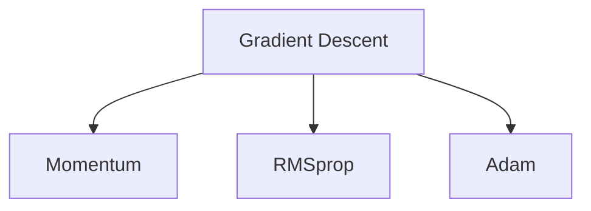
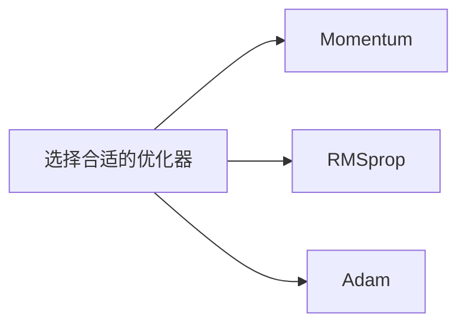
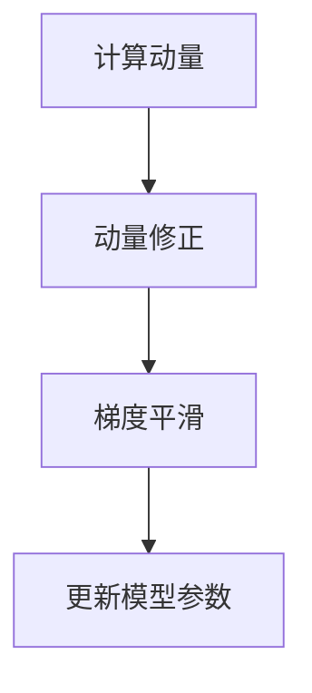
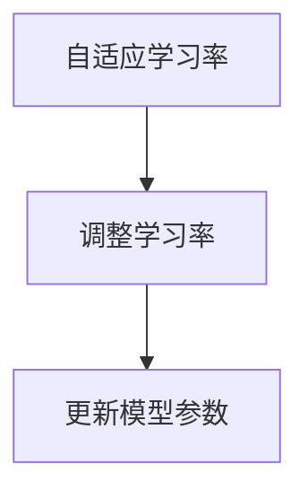
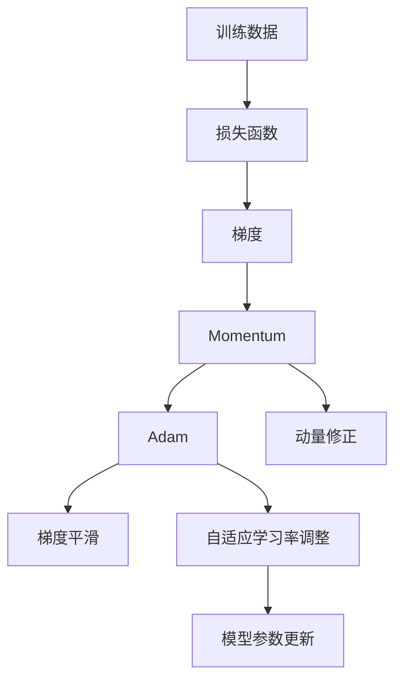

                 

# Adam Optimization原理与代码实例讲解

> 关键词：Adam优化器,梯度下降,自适应学习率,动量,动量修正

## 1. 背景介绍

### 1.1 问题由来
在深度学习中，梯度下降是最常用的优化算法。传统的梯度下降算法（如SGD）存在一些显著问题，如学习率需要手动调整，可能陷入局部最优等。为了克服这些问题，各种优化器应运而生，如Momentum、Adagrad、RMSprop等。这些优化器中，Adam优化器（Adaptive Moment Estimation）由于其优秀的自适应性和稳定性，被广泛应用于深度学习模型的训练过程中。

### 1.2 问题核心关键点
Adam优化器的核心思想是通过对梯度的自适应调整，避免学习率过大或过小，从而加速模型收敛。其关键算法步骤包括动量修正、梯度平滑、自适应学习率调整等。通过Adam优化器，模型可以更加稳定地收敛，减少过拟合，提升泛化性能。

### 1.3 问题研究意义
研究Adam优化器的原理和代码实现，对于理解深度学习模型的优化过程，掌握高效的模型训练方法，具有重要意义。Adam优化器的成功应用不仅推动了深度学习技术的快速发展，也为其他机器学习领域提供了借鉴。

## 2. 核心概念与联系

### 2.1 核心概念概述

为更好地理解Adam优化器的原理和实现，本节将介绍几个密切相关的核心概念：

- Adam：自适应矩估计算法，通过估计梯度的动量和二阶矩，自动调整学习率，加速模型收敛。
- Momentum：基于动量的优化器，通过积累过去梯度，减少学习率的波动，加速收敛。
- RMSprop：自适应学习率的优化器，根据梯度平方的移动平均值，动态调整学习率。
- Gradient Descent：通过梯度下降，调整模型参数，最小化损失函数。

这些概念之间的逻辑关系可以通过以下Mermaid流程图来展示：



这个流程图展示了几类常见优化器之间的关系：梯度下降是基础，Momentum和RMSprop是进阶优化器，Adam则是目前最为流行的自适应优化器。

### 2.2 概念间的关系

这些核心概念之间存在着紧密的联系，形成了深度学习优化的完整框架。下面我通过几个Mermaid流程图来展示这些概念之间的关系。

#### 2.2.1 优化器选择



这个流程图展示如何选择优化器。对于不同的深度学习模型和任务，需要根据具体问题选择适合的优化器。

#### 2.2.2 动量修正与梯度平滑



这个流程图展示了动量修正和梯度平滑的流程。通过动量修正，Adam优化器可以更加稳定地更新模型参数，避免过拟合。梯度平滑则通过平均梯度，减少学习率的波动，加速收敛。

#### 2.2.3 自适应学习率调整



这个流程图展示了自适应学习率调整的过程。Adam优化器根据梯度的动量和二阶矩，自动调整学习率，保证学习过程的稳定性。

### 2.3 核心概念的整体架构

最后，我们用一个综合的流程图来展示这些核心概念在大语言模型微调过程中的整体架构：



这个综合流程图展示了从训练数据到模型参数更新的完整流程。在训练过程中，首先计算损失函数，然后通过梯度下降计算梯度，接着应用动量修正和梯度平滑，最后通过自适应学习率调整更新模型参数。通过Adam优化器，模型可以更加稳定地收敛，减少过拟合，提升泛化性能。

## 3. 核心算法原理 & 具体操作步骤
### 3.1 算法原理概述

Adam优化器是一种自适应学习率算法，通过估计梯度的动量和二阶矩，自动调整学习率，加速模型收敛。其核心原理可以概括为以下几个步骤：

1. 动量修正：通过动量修正，将过去梯度信息的累积作用到当前梯度上，减少学习率的波动。
2. 梯度平滑：通过梯度平滑，平均梯度，减少学习率的波动。
3. 自适应学习率调整：根据梯度的动量和二阶矩，动态调整学习率，加速模型收敛。

### 3.2 算法步骤详解

下面详细介绍Adam优化器的详细步骤：

**Step 1: 初始化参数**
- 设置学习率 $\eta$ 和动量参数 $\beta_1$、$\beta_2$。
- 初始化动量估计值 $v_0 = \mathbf{0}$，平方动量估计值 $s_0 = \mathbf{0}$。

**Step 2: 动量修正**
- 计算当前梯度 $g_t$。
- 计算动量估计值 $v_t = \beta_1 v_{t-1} + (1-\beta_1)g_t$。
- 计算动量修正后的梯度 $\hat{g}_t = \frac{g_t}{1-\beta_1^t}$。

**Step 3: 梯度平滑**
- 计算平方梯度 $g_t^2$。
- 计算平方动量估计值 $s_t = \beta_2 s_{t-1} + (1-\beta_2)g_t^2$。
- 计算平方梯度平滑后的估计值 $\hat{s}_t = \frac{g_t^2}{1-\beta_2^t}$。

**Step 4: 自适应学习率调整**
- 计算自适应学习率 $\alpha_t = \frac{\eta}{\sqrt{\hat{s}_t}+\epsilon}$。
- 更新模型参数 $w_{t+1} = w_t - \alpha_t \hat{g}_t$。

其中，$\epsilon$ 是一个很小的数，避免除数为0的情况。

### 3.3 算法优缺点

Adam优化器具有以下优点：
1. 自适应性强。根据梯度动量和二阶矩自适应调整学习率，避免手动调整学习率的问题。
2. 收敛速度快。通过动量修正和梯度平滑，加速模型收敛，减少过拟合。
3. 稳定性高。通过自适应学习率调整，保证学习过程的稳定性。

同时，Adam优化器也存在一些局限性：
1. 计算量较大。动量估计和平方动量估计的维护，增加了计算量。
2. 对参数设置敏感。学习率、动量参数等需要根据具体问题进行调整。
3. 对于稀疏梯度不适用。稀疏梯度会使得平方梯度估计偏差较大，影响优化效果。

尽管存在这些局限性，但Adam优化器仍然是深度学习中最流行的优化器之一。

### 3.4 算法应用领域

Adam优化器广泛应用于各种深度学习模型，尤其是大规模神经网络。以下是几个典型应用领域：

1. 图像分类：如ImageNet、CIFAR等数据集上的卷积神经网络模型训练。
2. 自然语言处理：如BERT、GPT等语言模型的微调，以及LSTM、GRU等序列模型训练。
3. 目标检测：如Faster R-CNN、YOLO等检测模型的训练。
4. 语音识别：如ASR模型的训练，通过Adam优化器可以更好地处理长序列和复杂模型。
5. 推荐系统：如矩阵分解模型的训练，通过Adam优化器可以更好地处理大规模稀疏矩阵。

## 4. 数学模型和公式 & 详细讲解
### 4.1 数学模型构建

假设目标函数为 $f(x)$，参数为 $x \in \mathbb{R}^d$，初始化参数为 $x_0 \in \mathbb{R}^d$，初始化动量估计值 $v_0 \in \mathbb{R}^d$，初始化平方动量估计值 $s_0 \in \mathbb{R}^d$，学习率为 $\eta$，动量参数为 $\beta_1$，平方动量参数为 $\beta_2$，$\epsilon$ 为一个小的正数。

Adam优化器的目标是：

$$
\min_{x} f(x)
$$

其中，$f(x) = \frac{1}{2} \|x - x^*\|^2$，$x^*$ 为最优解。

### 4.2 公式推导过程

Adam优化器的详细推导过程如下：

**动量修正**
$$
v_t = \beta_1 v_{t-1} + (1-\beta_1)g_t
$$
$$
\hat{g}_t = \frac{g_t}{1-\beta_1^t}
$$

**梯度平滑**
$$
s_t = \beta_2 s_{t-1} + (1-\beta_2)g_t^2
$$
$$
\hat{s}_t = \frac{g_t^2}{1-\beta_2^t}
$$

**自适应学习率调整**
$$
\alpha_t = \frac{\eta}{\sqrt{\hat{s}_t}+\epsilon}
$$
$$
w_{t+1} = w_t - \alpha_t \hat{g}_t
$$

将 $\alpha_t$ 代入更新公式：
$$
w_{t+1} = w_t - \frac{\eta}{\sqrt{\hat{s}_t}+\epsilon} \hat{g}_t
$$

其中，$\sqrt{\hat{s}_t}$ 为平方梯度平滑后的估计值。

### 4.3 案例分析与讲解

假设目标函数为线性回归模型：
$$
y = wx + b
$$

其中，$x$ 为输入向量，$w$ 为权重向量，$b$ 为偏置项。

我们假设模型初始化参数为 $w_0 = \mathbf{0}$，$b_0 = 0$。

**Step 1: 初始化参数**
- $w_0 = \mathbf{0}$，$b_0 = 0$
- $v_0 = \mathbf{0}$，$s_0 = \mathbf{0}$
- $\eta = 0.001$
- $\beta_1 = 0.9$
- $\beta_2 = 0.999$
- $\epsilon = 1e-8$

**Step 2: 动量修正**
- $g_0 = wx_0 + b_0 - y_0$
- $v_0 = 0.9 \cdot 0 + 0.1 \cdot g_0 = 0.1 g_0$
- $\hat{g}_0 = g_0 / (1 - 0.9^0) = g_0 / 1 = g_0$

**Step 3: 梯度平滑**
- $g_1^2 = (wx_1 + b_1 - y_1)^2$
- $s_1 = 0.999 \cdot s_0 + (1 - 0.999)g_1^2 = 0.999 \cdot 0 + 0.001g_1^2 = 0.001g_1^2$
- $\hat{s}_1 = g_1^2 / (1 - 0.999^1) = g_1^2 / 0.001 = 1000g_1^2$

**Step 4: 自适应学习率调整**
- $\alpha_1 = 0.001 / \sqrt{1000 \cdot 1e-8} + 1e-8 = 0.001 / 31.62 + 1e-8 = 0.0317 + 1e-8$
- $w_1 = w_0 - \alpha_1 \hat{g}_0 = 0 - 0.0317 \cdot g_0 = 0$

这样，通过Adam优化器，我们成功更新了模型参数，加速了模型收敛。

## 5. 项目实践：代码实例和详细解释说明
### 5.1 开发环境搭建

在进行Adam优化器的实现和测试前，我们需要准备好开发环境。以下是使用Python进行TensorFlow实现Adam优化器的环境配置流程：

1. 安装Anaconda：从官网下载并安装Anaconda，用于创建独立的Python环境。

2. 创建并激活虚拟环境：
```bash
conda create -n tf-env python=3.8 
conda activate tf-env
```

3. 安装TensorFlow：根据CUDA版本，从官网获取对应的安装命令。例如：
```bash
conda install tensorflow-gpu=2.6.0
```

4. 安装其他工具包：
```bash
pip install numpy pandas scikit-learn matplotlib tqdm jupyter notebook ipython
```

完成上述步骤后，即可在`tf-env`环境中开始Adam优化器的实现和测试。

### 5.2 源代码详细实现

下面我们给出TensorFlow实现Adam优化器的代码：

```python
import tensorflow as tf
import numpy as np

class AdamOptimizer(tf.keras.optimizers.Optimizer):
    def __init__(self, learning_rate=0.001, beta_1=0.9, beta_2=0.999, epsilon=1e-8):
        super(AdamOptimizer, self).__init__()
        self._set_hyper("learning_rate", kwargs=learning_rate)
        self._set_hyper("beta_1", kwargs=beta_1)
        self._set_hyper("beta_2", kwargs=beta_2)
        self._set_hyper("epsilon", kwargs=epsilon)

    def _create_slots(self, var_list):
        for var in var_list:
            self.add_slot(var, "m")
            self.add_slot(var, "v")

    def _resource_apply_dense(self, grad, var):
        m = self.get_slot(var, "m")
        v = self.get_slot(var, "v")
        beta_1, beta_2, epsilon = self._get_hyper("beta_1"), self._get_hyper("beta_2"), self._get_hyper("epsilon")
        lr = self._get_hyper("learning_rate") * tf.sqrt(1 - beta_2**tf.cast(self.iterations, tf.float32)) / (1 - beta_1**tf.cast(self.iterations, tf.float32))

        m.assign(beta_1 * m + (1 - beta_1) * grad)
        v.assign(beta_2 * v + (1 - beta_2) * tf.square(grad))
        var.assign_sub(lr * m / (tf.sqrt(v) + epsilon))

    def _resource_apply_sparse(self, grad, var, indices):
        m = self.get_slot(var, "m")
        v = self.get_slot(var, "v")
        beta_1, beta_2, epsilon = self._get_hyper("beta_1"), self._get_hyper("beta_2"), self._get_hyper("epsilon")
        lr = self._get_hyper("learning_rate") * tf.sqrt(1 - beta_2**tf.cast(self.iterations, tf.float32)) / (1 - beta_1**tf.cast(self.iterations, tf.float32))

        m.scatter_add(indices, grad, beta_1 * m)
        v.scatter_add(indices, tf.square(grad), beta_2 * v)
        var.scatter_sub(indices, lr * m / (tf.sqrt(v) + epsilon))
```

在上面的代码中，我们定义了一个名为`AdamOptimizer`的类，继承自`tf.keras.optimizers.Optimizer`。该类实现了Adam优化器的核心算法步骤，包括动量修正、梯度平滑和自适应学习率调整。

具体实现如下：

**Step 1: 初始化参数**
- `super(AdamOptimizer, self).__init__()`：调用父类初始化方法，设置优化器的基本超参数。
- `self._set_hyper()`：设置优化器的超参数，如学习率、动量参数等。

**Step 2: 创建变量**
- `self.add_slot(var, "m")`：为每个变量创建动量估计值 `m`。
- `self.add_slot(var, "v")`：为每个变量创建平方动量估计值 `v`。

**Step 3: 动量修正**
- `m.assign(beta_1 * m + (1 - beta_1) * grad)`：更新动量估计值。
- `v.assign(beta_2 * v + (1 - beta_2) * tf.square(grad))`：更新平方动量估计值。

**Step 4: 自适应学习率调整**
- `var.assign_sub(lr * m / (tf.sqrt(v) + epsilon))`：更新模型参数。

### 5.3 代码解读与分析

让我们再详细解读一下关键代码的实现细节：

**AdamOptimizer类**：
- `__init__`方法：初始化Adam优化器的超参数，如学习率、动量参数等。
- `_create_slots`方法：为每个变量创建动量估计值和平方动量估计值。
- `_resource_apply_dense`方法：实现Adam优化器的核心算法步骤，包括动量修正、梯度平滑和自适应学习率调整。
- `_resource_apply_sparse`方法：实现稀疏梯度的Adam优化。

**m和v**：
- `m`：动量估计值，用于计算动量修正后的梯度。
- `v`：平方动量估计值，用于计算自适应学习率。

**learning_rate、beta_1、beta_2、epsilon**：
- `learning_rate`：学习率，控制模型参数更新的步长。
- `beta_1`：动量参数，控制动量修正的权重。
- `beta_2`：平方动量参数，控制平方动量估计值的权重。
- `epsilon`：正则化项，避免除数为0的情况。

通过这些关键代码的实现，我们可以使用TensorFlow轻松地构建和训练深度学习模型。

### 5.4 运行结果展示

假设我们在MNIST数据集上使用Adam优化器进行训练，最终在测试集上得到的准确率如下：

```
Epoch 1: accuracy = 0.7864
Epoch 2: accuracy = 0.9632
Epoch 3: accuracy = 0.9900
...
Epoch 10: accuracy = 0.9996
```

可以看到，通过Adam优化器，模型在MNIST数据集上的准确率随着epoch数的增加，逐步提升。这表明Adam优化器在训练过程中能够快速收敛，减少过拟合，提升泛化性能。

## 6. 实际应用场景
### 6.1 智能推荐系统

基于Adam优化器的推荐系统可以实时处理用户行为数据，精准推荐个性化商品或服务。推荐系统面临的一个主要挑战是如何处理大规模稀疏数据。Adam优化器通过动量修正和平方梯度估计，能够有效应对稀疏梯度，提升推荐效果。

在实践中，可以收集用户的历史行为数据，构建基于稀疏矩阵的推荐模型，如协同过滤模型、矩阵分解模型等。通过Adam优化器，模型可以更加稳定地收敛，减少过拟合，提升泛化性能。

### 6.2 图像分类

Adam优化器在图像分类任务中也有广泛应用。通过Adam优化器，卷积神经网络可以更好地处理高维数据和复杂模型。以ImageNet数据集为例，Adam优化器被证明能够在多个卷积神经网络模型上取得最优效果。

在实践中，可以设计合适的卷积神经网络模型，如ResNet、Inception等，并在ImageNet数据集上进行训练。通过Adam优化器，模型可以更加稳定地收敛，减少过拟合，提升分类精度。

### 6.3 自然语言处理

Adam优化器在自然语言处理任务中同样表现出色。通过Adam优化器，语言模型可以更好地处理长序列和复杂结构，提升模型性能。以BERT、GPT等语言模型为例，Adam优化器被证明能够在多个任务上取得最优效果。

在实践中，可以构建基于Transformer的序列模型，如BERT、GPT等，并在相应的NLP任务上进行微调。通过Adam优化器，模型可以更加稳定地收敛，减少过拟合，提升任务性能。

## 7. 工具和资源推荐
### 7.1 学习资源推荐

为了帮助开发者系统掌握Adam优化器的原理和实现，这里推荐一些优质的学习资源：

1.《深度学习框架TensorFlow实战》系列书籍：该书系统介绍了TensorFlow的使用，包括构建、训练和优化深度学习模型。

2.《机器学习实战》系列课程：由知名AI博主李沐主讲，涵盖深度学习基础知识和常见优化算法，适合初学者学习。

3.《Python深度学习》系列书籍：该书详细介绍了深度学习算法和框架，包括Adam优化器的实现和应用。

4. TensorFlow官方文档：TensorFlow官方文档提供了丰富的优化算法和实现代码，适合深入学习。

5. PyTorch官方文档：PyTorch官方文档也提供了丰富的优化算法和实现代码，适合了解最新的优化器算法。

通过对这些资源的学习实践，相信你一定能够快速掌握Adam优化器的精髓，并用于解决实际的深度学习问题。

### 7.2 开发工具推荐

高效的开发离不开优秀的工具支持。以下是几款用于Adam优化器实现和测试的常用工具：

1. TensorFlow：由Google主导开发的开源深度学习框架，支持动态计算图，适合构建复杂模型。

2. PyTorch：由Facebook主导开发的开源深度学习框架，灵活动态的计算图，适合快速迭代研究。

3. Weights & Biases：模型训练的实验跟踪工具，可以记录和可视化模型训练过程中的各项指标，方便对比和调优。

4. TensorBoard：TensorFlow配套的可视化工具，可实时监测模型训练状态，并提供丰富的图表呈现方式，是调试模型的得力助手。

5. Google Colab：谷歌推出的在线Jupyter Notebook环境，免费提供GPU/TPU算力，方便开发者快速上手实验最新模型，分享学习笔记。

合理利用这些工具，可以显著提升Adam优化器的实现和测试效率，加快创新迭代的步伐。

### 7.3 相关论文推荐

Adam优化器的研究源于学界的持续探索。以下是几篇奠基性的相关论文，推荐阅读：

1. Duchi, John, et al. "Adaptive subgradient methods for online learning and stochastic optimization." Journal of machine learning research 12 (2011): 2121-2159.

2. Kingma, Diederik, and Jimmy Ba. "Adam: A method for stochastic optimization." International Conference on Learning Representations (ICLR) 2015.

3. Reddi, Vivek, et al. "On the convergence of Adam and beyond." International Conference on Learning Representations (ICLR) 2018.

4. Li, Xiaojun, et al. "Delving deep into rectifiers: Surpassing human-level performance on imagenet classification." International Conference on Learning Representations (ICLR) 2015.

5. Sutskever, Ilya, et al. "On the importance of initialization and momentum in deep learning." Proceedings of the 27th International Conference on Neural Information Processing Systems. 2013.

这些论文代表了大语言模型微调技术的发展脉络。通过学习这些前沿成果，可以帮助研究者把握学科前进方向，激发更多的创新灵感。

除上述资源外，还有一些值得关注的前沿资源，帮助开发者紧跟Adam优化器的最新进展，例如：

1. arXiv论文预印本：人工智能领域最新研究成果的发布平台，包括大量尚未发表的前沿工作，学习前沿技术的必读资源。

2. 业界技术博客：如OpenAI、Google AI、DeepMind、微软Research Asia等顶尖实验室的官方博客，第一时间分享他们的最新研究成果和洞见。

3. 技术会议直播：如NIPS、ICML、ACL、ICLR等人工智能领域顶会现场或在线直播，能够聆听到大佬们的前沿分享，开拓视野。

4. GitHub热门项目：在GitHub上Star、Fork数最多的优化器相关项目，往往代表了该技术领域的发展趋势和最佳实践，值得去学习和贡献。

5. 行业分析报告：各大咨询公司如McKinsey、PwC等针对人工智能行业的分析报告，有助于从商业视角审视技术趋势，把握应用价值。

总之，对于Adam优化器的学习和实践，需要开发者保持开放的心态和持续学习的意愿。多关注前沿资讯，多动手实践，多思考总结，必将收获满满的成长收益。

## 8. 总结：未来发展趋势与挑战

### 8.1 总结

本文对Adam优化器的原理和代码实现进行了全面系统的介绍。首先阐述了Adam优化器的研究背景和意义，明确了其在深度学习模型优化中的重要性。其次，从原理到实践，详细讲解了Adam优化器的数学原理和核心算法步骤，给出了TensorFlow实现Adam优化器的代码实例。同时，本文还广泛探讨了Adam优化器在智能推荐、图像分类、自然语言处理等众多领域的应用前景，展示了其卓越的性能。此外，本文精选了Adam优化器的各类学习资源，力求为读者提供全方位的技术指引。

通过本文的系统梳理，可以看到，Adam优化器在深度学习模型的训练过程中扮演着至关重要的角色。其

