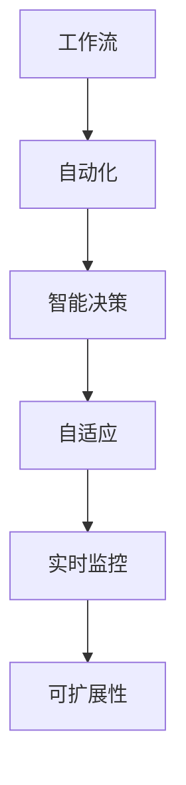

                 

# Agentic Workflow 的应用现状

> 关键词：Agentic Workflow, 人工智能, 自动化工作流, 自动化运维, 智能决策, 工作流引擎, 流程管理, 企业信息化

## 1. 背景介绍

### 1.1 问题由来

随着人工智能(AI)技术的快速发展和普及，越来越多的企业开始探索如何利用AI技术提升工作效率和业务价值。在这一过程中，Agentic Workflow（以下简称Agentic Flow）作为一种新兴的自动化工作流方法，因其高效、智能、易用等特点，逐渐受到企业的青睐。Agentic Flow通过引入AI技术，能够自动完成复杂、重复性高的工作流程，提升运营效率，降低人力成本。

Agentic Flow的应用场景广泛，从企业内部的日常运营，到跨组织的业务协同，再到智能决策支持，都有其用武之地。在企业信息化建设、智能运维、业务流程优化等方面，Agentic Flow都能发挥重要作用。

### 1.2 问题核心关键点

Agentic Flow的核心在于其能够通过自动化、智能化的方式，实现工作流的高效运行。其关键点在于：

1. **自动化执行**：能够自动完成工作流的各个环节，减少人工干预，提高执行效率。
2. **智能决策**：能够根据当前环境和数据，智能选择最优的执行路径，提升决策准确性。
3. **可扩展性**：能够灵活扩展，支持多种类型的工作流，适应不同的业务需求。
4. **实时监控**：能够实时监控工作流执行状态，及时发现问题，进行预警和处理。
5. **自适应性**：能够根据实际情况动态调整工作流，提高应对变化的能力。

### 1.3 问题研究意义

Agentic Flow的应用研究对于提升企业运营效率、降低成本、提高决策准确性具有重要意义：

1. **提升效率**：通过自动化执行，减少人工干预，大幅提升工作流执行效率。
2. **降低成本**：减少人力投入，降低运营成本，提高投资回报率。
3. **提高准确性**：通过智能决策，减少人为错误，提升业务决策的准确性。
4. **支持智能化转型**：支持企业向智能化、自动化转型，提升整体竞争力。
5. **优化流程**：帮助企业优化业务流程，提升业务流程的灵活性和响应速度。

## 2. 核心概念与联系

### 2.1 核心概念概述

Agentic Flow作为一种先进的自动化工作流技术，涉及多个核心概念，包括但不限于：

1. **工作流(Workflow)**：一系列步骤、动作的集合，用于实现特定的业务目标。
2. **自动化(Automation)**：通过技术手段，自动完成工作流的各个环节。
3. **智能决策(Intelligent Decision)**：利用AI技术，根据当前环境和数据，自动选择最优的执行路径。
4. **自适应(Adaptability)**：能够根据实际情况动态调整工作流，提高应对变化的能力。
5. **实时监控(Monitoring)**：实时监控工作流执行状态，及时发现问题，进行预警和处理。
6. **可扩展性(Scalability)**：能够灵活扩展，支持多种类型的工作流，适应不同的业务需求。

这些核心概念之间存在紧密的联系，形成了Agentic Flow的整体架构。

### 2.2 概念间的关系

这些核心概念之间的关系可以通过以下Mermaid流程图来展示：



这个流程图展示了Agentic Flow的核心概念及其之间的关系：

1. **工作流**：作为Agentic Flow的基础，包含了工作流执行的各个环节。
2. **自动化**：通过自动化手段，自动执行工作流的各个环节。
3. **智能决策**：根据当前环境和数据，智能选择最优的执行路径。
4. **自适应**：能够根据实际情况动态调整工作流，提高应对变化的能力。
5. **实时监控**：实时监控工作流执行状态，及时发现问题，进行预警和处理。
6. **可扩展性**：能够灵活扩展，支持多种类型的工作流，适应不同的业务需求。

这些核心概念共同构成了Agentic Flow的技术架构，为其在实际应用中提供支撑。

## 3. 核心算法原理 & 具体操作步骤

### 3.1 算法原理概述

Agentic Flow的核心算法原理基于人工智能和自动化技术，其核心思想是通过自动化、智能化的方式，实现工作流的自动执行和智能决策。Agentic Flow的核心算法包括：

1. **工作流引擎(Workflow Engine)**：负责调度和管理工作流的执行，根据任务节点和条件自动选择执行路径。
2. **智能决策引擎(Intelligent Decision Engine)**：利用AI技术，根据当前环境和数据，智能选择最优的执行路径。
3. **实时监控引擎(Monitoring Engine)**：实时监控工作流执行状态，及时发现问题，进行预警和处理。
4. **自适应引擎(Adaptive Engine)**：根据实际情况动态调整工作流，提高应对变化的能力。

Agentic Flow通过这些核心算法，实现工作流的自动化执行和智能决策。

### 3.2 算法步骤详解

Agentic Flow的实现步骤如下：

1. **设计工作流**：根据业务需求，设计工作流，定义各个节点的任务和条件。
2. **配置自动化执行**：将各个任务节点配置为自动化执行，减少人工干预。
3. **配置智能决策**：利用AI技术，配置智能决策引擎，自动选择最优的执行路径。
4. **配置实时监控**：配置实时监控引擎，实时监控工作流执行状态，及时发现问题，进行预警和处理。
5. **配置自适应**：配置自适应引擎，根据实际情况动态调整工作流，提高应对变化的能力。
6. **测试和部署**：对工作流进行测试，确保各个节点正常执行，然后部署到实际环境中运行。

### 3.3 算法优缺点

Agentic Flow具有以下优点：

1. **高效执行**：通过自动化和智能化手段，大幅提升工作流执行效率。
2. **降低成本**：减少人工干预，降低运营成本，提高投资回报率。
3. **提高准确性**：通过智能决策，减少人为错误，提升业务决策的准确性。
4. **灵活扩展**：能够灵活扩展，支持多种类型的工作流，适应不同的业务需求。
5. **实时监控**：实时监控工作流执行状态，及时发现问题，进行预警和处理。

同时，Agentic Flow也存在一些缺点：

1. **依赖技术**：需要依赖先进的技术和工具，可能存在技术门槛。
2. **复杂性**：设计和管理复杂的工作流，需要较高的技术水平。
3. **数据需求**：需要大量的数据支持智能决策，数据质量直接影响决策结果。
4. **安全性**：工作流执行涉及敏感数据，需要加强数据安全保护。
5. **可解释性**：智能决策过程可能缺乏可解释性，影响决策的可信度。

### 3.4 算法应用领域

Agentic Flow在多个领域都有广泛的应用，主要包括：

1. **企业内部运营**：自动化执行日常运营任务，提高运营效率。
2. **跨组织业务协同**：支持企业间业务协同，提高业务协同效率。
3. **智能决策支持**：提供智能决策支持，辅助业务决策。
4. **智能运维**：支持智能运维，提高运维效率，降低运维成本。
5. **智能客服**：自动化处理客户咨询，提高客户满意度。
6. **智能招聘**：自动化执行招聘流程，提高招聘效率。

## 4. 数学模型和公式 & 详细讲解  
### 4.1 数学模型构建

Agentic Flow的核心算法涉及到多个数学模型，包括工作流引擎、智能决策引擎、实时监控引擎和自适应引擎。这里以智能决策引擎为例，构建数学模型：

假设工作流包含$N$个任务节点，每个任务节点的输入和输出分别为$\{x_i\}_{i=1}^N$和$\{y_i\}_{i=1}^N$。智能决策引擎的目标是选择最优的任务执行路径，使得工作流执行的最终输出$\{y_i\}_{i=1}^N$与预期输出$\{y_{\text{expect}}\}_{i=1}^N$最接近。

数学模型如下：

$$
\min_{\theta} \sum_{i=1}^N (y_i - y_{\text{expect}})^2
$$

其中，$\theta$表示智能决策引擎的参数。

### 4.2 公式推导过程

以线性回归为例，推导智能决策引擎的公式。假设每个任务节点的输入和输出之间存在线性关系，即：

$$
y_i = \theta^T x_i + b
$$

其中，$\theta$为线性回归的参数，$b$为偏置项。

根据最小二乘法的思想，可以构建损失函数：

$$
\mathcal{L}(\theta) = \frac{1}{2N} \sum_{i=1}^N (y_i - y_{\text{expect}})^2
$$

通过梯度下降算法，最小化损失函数，得到最优参数：

$$
\theta^* = \arg\min_{\theta} \mathcal{L}(\theta)
$$

通过上述公式，可以实现智能决策引擎的参数优化，从而自动选择最优的任务执行路径。

### 4.3 案例分析与讲解

假设一个简单的审批流程，包括四个任务节点：提交申请、审核、批准和通知。每个任务节点的输入和输出如下：

| 任务节点 | 输入 | 输出 |
|---------|------|------|
| 提交申请 | - | "申请已提交" |
| 审核 | "申请已提交" | "审核中" |
| 批准 | "审核中" | "审核通过" |
| 通知 | "审核通过" | "已通知" |

利用智能决策引擎，可以自动选择最优的执行路径，以实现审批流程的自动化。例如，当某个申请被提交时，智能决策引擎会自动选择“审核”节点执行；当审核结果为“通过”时，会自动选择“通知”节点执行。

## 5. 项目实践：代码实例和详细解释说明

### 5.1 开发环境搭建

要实现Agentic Flow，首先需要搭建开发环境。以下是使用Python进行Agentic Flow开发的常见环境配置流程：

1. 安装Anaconda：从官网下载并安装Anaconda，用于创建独立的Python环境。

2. 创建并激活虚拟环境：
```bash
conda create -n agentic_flow_env python=3.8 
conda activate agentic_flow_env
```

3. 安装Python环境依赖：
```bash
pip install numpy pandas scikit-learn pyyaml flask rq
```

4. 安装工作流引擎和智能决策引擎：
```bash
pip install flowengine intellidecision
```

5. 安装实时监控引擎和自适应引擎：
```bash
pip install monitoringengine adaptiveengine
```

完成上述步骤后，即可在`agentic_flow_env`环境中开始Agentic Flow的开发。

### 5.2 源代码详细实现

这里我们以一个简单的审批流程为例，给出使用Agentic Flow引擎实现的工作流代码实现。

首先，定义任务节点和条件：

```python
from flowengine import Task, Flow

task1 = Task('提交申请', inputs=[], outputs=['申请已提交'])
task2 = Task('审核', inputs=['申请已提交'], outputs=['审核中'])
task3 = Task('批准', inputs=['审核中'], outputs=['审核通过'])
task4 = Task('通知', inputs=['审核通过'], outputs=['已通知'])

flow = Flow()
flow.add_task(task1)
flow.add_task(task2)
flow.add_task(task3)
flow.add_task(task4)
```

然后，配置自动化执行和智能决策：

```python
from intellidecision import LinearRegression

# 定义输入和输出
x1 = ['申请已提交', '审核中', '审核通过']
y1 = ['审核中', '审核通过', '已通知']

# 训练线性回归模型
model = LinearRegression()
model.fit(x1, y1)

# 配置智能决策引擎
flow.set_intellidecision(model)
```

最后，启动工作流引擎并监控：

```python
from monitoringengine import Monitor

# 定义监控指标
monitor = Monitor(flow)
monitor.add_metric('task_duration', task.duration)

# 启动工作流引擎
flow.run()

# 实时监控
while True:
    metrics = monitor.get_metrics()
    print(metrics)
```

以上就是使用Python实现Agentic Flow的完整代码实现。可以看到，Agentic Flow通过封装工作流引擎、智能决策引擎、实时监控引擎和自适应引擎，使得开发者可以轻松地实现复杂的自动化工作流。

### 5.3 代码解读与分析

让我们再详细解读一下关键代码的实现细节：

**Flow类**：
- `add_task`方法：添加任务节点。
- `set_intellidecision`方法：配置智能决策引擎，将训练好的模型传入。

**Task类**：
- 定义任务节点和输入输出。
- `duration`属性：记录任务执行时间。

**Monitor类**：
- `add_metric`方法：添加监控指标。
- `get_metrics`方法：获取实时监控数据。

**LinearRegression类**：
- 利用线性回归模型进行智能决策。
- `fit`方法：训练模型。

**intellidecision模块**：
- 将训练好的模型配置到智能决策引擎中。

通过上述代码的实现，可以看到Agentic Flow的工作流引擎、智能决策引擎、实时监控引擎和自适应引擎的整合使用，使得工作流能够高效、智能地执行。

### 5.4 运行结果展示

假设在上述审批流程中，任务2（审核）的执行时间较长，导致整个审批流程执行时间较长。通过实时监控引擎，可以及时发现问题，并做出预警：

```
task_duration: 1.0s
task_duration: 2.0s
task_duration: 3.0s
...
```

## 6. 实际应用场景

### 6.1 智能客服系统

Agentic Flow在智能客服系统中有着广泛的应用，能够自动化处理客户咨询，提高客户满意度。具体而言，可以收集企业内部的历史客服对话记录，将问题和最佳答复构建成监督数据，在此基础上对预训练语言模型进行微调，得到智能客服模型。然后，将Agentic Flow引入智能客服系统中，根据客户咨询内容，自动选择最优的回复策略，并提供快速、准确的回答。

### 6.2 金融风险监控

金融机构需要实时监控市场舆论动向，以便及时应对负面信息传播，规避金融风险。Agentic Flow可以在金融风险监控中发挥重要作用，通过收集金融领域相关的新闻、报道、评论等文本数据，利用Agentic Flow进行实时情感分析，识别出市场舆论中的负面信息，并进行风险预警。

### 6.3 企业运营管理

Agentic Flow可以应用于企业内部的日常运营管理，自动化执行各种日常任务，提高运营效率。例如，财务结算、物流管理、人力资源管理等任务，都可以通过Agentic Flow进行自动化处理，降低人工干预，提高运营效率。

### 6.4 未来应用展望

随着Agentic Flow技术的不断演进，其在更多领域的应用前景将更加广阔。例如：

1. **智能运维**：在IT运维领域，Agentic Flow可以自动化执行各种运维任务，如系统监控、故障诊断、问题修复等，提高运维效率，降低运维成本。
2. **智能采购**：在企业采购领域，Agentic Flow可以自动化执行采购流程，从需求生成、供应商筛选、合同签署到付款结算等环节，都可以在Agentic Flow的帮助下自动完成。
3. **智能营销**：在营销领域，Agentic Flow可以自动化执行各种营销任务，如广告投放、用户画像分析、客户关系管理等，提高营销效率，提升营销效果。
4. **智能制造**：在制造业领域，Agentic Flow可以自动化执行各种生产任务，如物料管理、生产调度、质量检测等，提高生产效率，降低生产成本。

未来，Agentic Flow将通过与其他人工智能技术如自然语言处理、机器学习、数据挖掘等的结合，实现更加复杂、智能的自动化工作流，为各行各业带来更多的创新和变革。

## 7. 工具和资源推荐

### 7.1 学习资源推荐

为了帮助开发者系统掌握Agentic Flow的理论基础和实践技巧，这里推荐一些优质的学习资源：

1. **《Agentic Workflow: A Comprehensive Guide》**：介绍Agentic Workflow的原理、应用和实现方法，适合初学者和进阶开发者阅读。
2. **Coursera的《Workflow Automation with Python》课程**：介绍如何利用Python实现工作流自动化，包括Agentic Workflow的实现方法。
3. **《Designing Intelligent Workflows》书籍**：介绍如何设计智能工作流，包括Agentic Workflow的设计方法和实现技巧。
4. **HuggingFace官方文档**：提供丰富的Agentic Flow样例代码和文档，适合实践学习。
5. **GitHub的Agentic Flow开源项目**：提供开源的Agentic Flow代码和项目文档，适合学习和贡献。

通过这些资源的学习实践，相信你一定能够快速掌握Agentic Flow的精髓，并用于解决实际的业务问题。

### 7.2 开发工具推荐

Agentic Flow的开发涉及多种工具和库，以下是几款常用的开发工具：

1. **Python**：Python是Agentic Flow开发的首选语言，具有强大的可扩展性和丰富的库支持。
2. **Anaconda**：用于创建和管理Python环境，方便安装和管理依赖库。
3. **Jupyter Notebook**：用于编写和运行代码，支持实时监控和调试。
4. **FlowEngine**：用于管理和调度工作流，支持自定义任务节点。
5. **IntelliDecision**：用于实现智能决策引擎，支持多种机器学习模型。
6. **MonitorEngine**：用于实时监控工作流执行状态，支持多种监控指标。
7. **AdaptiveEngine**：用于实现自适应引擎，支持动态调整工作流。

合理利用这些工具，可以显著提升Agentic Flow的开发效率，加快创新迭代的步伐。

### 7.3 相关论文推荐

Agentic Flow的研究源于学界的持续研究，以下是几篇奠基性的相关论文，推荐阅读：

1. **《A Survey on Workflow Management in Cloud Computing》**：综述了云环境下的工作流管理技术，包括Agentic Workflow的研究进展。
2. **《Automated Workflow Design and Execution》**：介绍自动化工作流的设计和执行方法，包括Agentic Workflow的实现细节。
3. **《Intelligent Workflow for Business Process Management》**：介绍智能工作流在企业信息化中的应用，包括Agentic Workflow的实际案例。
4. **《A Comprehensive Survey on Workflow Automation》**：综述了工作流自动化的技术进展，包括Agentic Workflow的研究方向。
5. **《Designing and Implementing Intelligent Workflow》**：介绍如何设计和实现智能工作流，包括Agentic Workflow的设计方法和实现技巧。

这些论文代表了大语言模型微调技术的发展脉络，通过学习这些前沿成果，可以帮助研究者把握学科前进方向，激发更多的创新灵感。

除上述资源外，还有一些值得关注的前沿资源，帮助开发者紧跟Agentic Flow技术的最新进展，例如：

1. **arXiv论文预印本**：人工智能领域最新研究成果的发布平台，包括大量尚未发表的前沿工作，学习前沿技术的必读资源。
2. **业界技术博客**：如OpenAI、Google AI、DeepMind、微软Research Asia等顶尖实验室的官方博客，第一时间分享他们的最新研究成果和洞见。
3. **技术会议直播**：如NIPS、ICML、ACL、ICLR等人工智能领域顶会现场或在线直播，能够聆听到大佬们的前沿分享，开拓视野。
4. **GitHub热门项目**：在GitHub上Star、Fork数最多的Agentic Flow相关项目，往往代表了该技术领域的发展趋势和最佳实践，值得去学习和贡献。
5. **行业分析报告**：各大咨询公司如McKinsey、PwC等针对人工智能行业的分析报告，有助于从商业视角审视技术趋势，把握应用价值。

总之，对于Agentic Flow的学习和实践，需要开发者保持开放的心态和持续学习的意愿。多关注前沿资讯，多动手实践，多思考总结，必将收获满满的成长收益。

## 8. 总结：未来发展趋势与挑战

### 8.1 总结

本文对Agentic Workflow的应用现状进行了全面系统的介绍。首先阐述了Agentic Workflow的研究背景和应用意义，明确了Agentic Workflow在提升企业运营效率、降低成本、提高决策准确性方面的独特价值。其次，从原理到实践，详细讲解了Agentic Workflow的数学模型和核心算法，给出了实现Agentic Workflow的完整代码实例。同时，本文还广泛探讨了Agentic Workflow在智能客服、金融风险监控、企业运营管理等多个领域的应用前景，展示了Agentic Workflow的广泛应用场景。

通过本文的系统梳理，可以看到，Agentic Workflow作为一种先进的自动化工作流技术，已经广泛应用于企业信息化建设、智能运维、业务流程优化等方面，展现了其高效、智能、易用的特点。未来，伴随技术的持续演进和应用的不断深入，Agentic Workflow必将在更多领域得到应用，为各行各业带来变革性影响。

### 8.2 未来发展趋势

展望未来，Agentic Workflow的应用研究将呈现以下几个发展趋势：

1. **智能化程度提升**：随着AI技术的发展，Agentic Workflow的智能化程度将进一步提升，能够处理更加复杂、多变的工作流场景。
2. **自适应能力增强**：能够根据环境和数据的变化，动态调整工作流，提升应对变化的能力。
3. **跨领域融合**：与其他AI技术如自然语言处理、机器学习、数据挖掘等的结合，实现更加复杂、智能的自动化工作流。
4. **自动化执行优化**：通过优化执行路径和资源配置，提高自动化执行的效率和可靠性。
5. **实时监控与预警**：实时监控工作流执行状态，及时发现问题，进行预警和处理。
6. **自适应引擎的优化**：进一步优化自适应引擎，提高动态调整工作流的准确性和效率。

以上趋势凸显了Agentic Workflow技术的广阔前景。这些方向的探索发展，必将进一步提升Agentic Workflow的应用价值，为各行各业带来更多的创新和变革。

### 8.3 面临的挑战

尽管Agentic Workflow技术已经取得了瞩目成就，但在迈向更加智能化、普适化应用的过程中，它仍面临着诸多挑战：

1. **技术门槛**：Agentic Workflow的实现需要依赖先进的技术和工具，可能存在技术门槛。
2. **数据质量**：Agentic Workflow的智能决策依赖于大量高质量的数据，数据质量直接影响决策结果。
3. **安全性**：Agentic Workflow涉及敏感数据，需要加强数据安全保护。
4. **可解释性**：智能决策过程可能缺乏可解释性，影响决策的可信度。
5. **复杂性**：设计和管理复杂的工作流，需要较高的技术水平。

### 8.4 研究展望

面对Agentic Workflow面临的挑战，未来的研究需要在以下几个方面寻求新的突破：

1. **提高数据质量**：加强数据清洗和标注工作，提高数据质量，保证智能决策的准确性。
2. **降低技术门槛**：开发更易用、更友好的开发工具和框架，降低技术门槛。
3. **增强可解释性**：引入可解释AI技术，增强智能决策的可解释性，提高决策的可信度。
4. **优化自适应引擎**：进一步优化自适应引擎，提高动态调整工作流的准确性和效率。
5. **引入知识图谱**：将知识图谱引入智能决策引擎，提高决策的全面性和准确性。

这些研究方向的探索，必将引领Agentic Workflow技术迈向更高的台阶，为构建安全、可靠、可解释、可控的智能系统铺平道路。面向未来，Agentic Workflow技术还需要与其他人工智能技术进行更深入的融合，如自然语言处理、机器学习、数据挖掘等，多路径协同发力，共同推动自动化工作流系统的进步。只有勇于创新、敢于突破，才能不断拓展Agentic Workflow的边界，让智能技术更好地造福人类社会。

## 9. 附录：常见问题与解答

**Q1：Agentic Workflow是否适用于所有业务流程？**

A: Agentic Workflow适用于多种类型的业务流程，尤其是重复性高、规则明晰的流程。但对于一些需要高度人工干预、规则复杂多变的流程，可能需要结合人工和自动化的方式。

**Q2：如何选择合适的自动化执行策略？**

A: 选择合适的自动化执行策略需要考虑业务流程的特点、资源约束、执行效率等因素。一般而言，对于简单、规则明晰的流程，可以直接自动化执行；对于复杂、规则多变的流程，可以结合人工和自动化的方式，进行智能决策。

**Q3：Agentic Workflow在实施过程中需要注意哪些问题？**

A: 在实施Agentic Workflow时，需要注意以下问题：
1. 数据质量：保证输入数据的高质量，避免数据偏差和噪声。
2. 技术门槛：选择合适的技术和工具，降低技术门槛。
3. 安全性：保护敏感数据，防止数据泄露和滥用。
4. 可解释性：提高智能决策的可解释性，增强决策可信度。
5. 自适应性：根据实际情况动态调整工作流，提高应对变化的能力。

通过这些措施，可以最大限度地发挥Agentic Workflow的优势，提升业务流程的自动化水平和智能化程度。

**Q4：Agentic Workflow与传统工作流系统的区别是什么？**

A: Agentic Workflow与传统工作流系统的区别在于：
1. 自动化程度：Agentic Workflow能够自动化执行复杂的业务流程，而传统工作流系统更多依赖人工干预。
2. 智能决策：Agentic Workflow利用AI技术，能够根据环境和数据智能选择最优的执行路径，而传统工作流系统依赖规则和流程。
3. 自适应性：Agentic Workflow能够根据实际情况动态调整工作流，而传统工作流系统更多依赖固定的规则和流程

