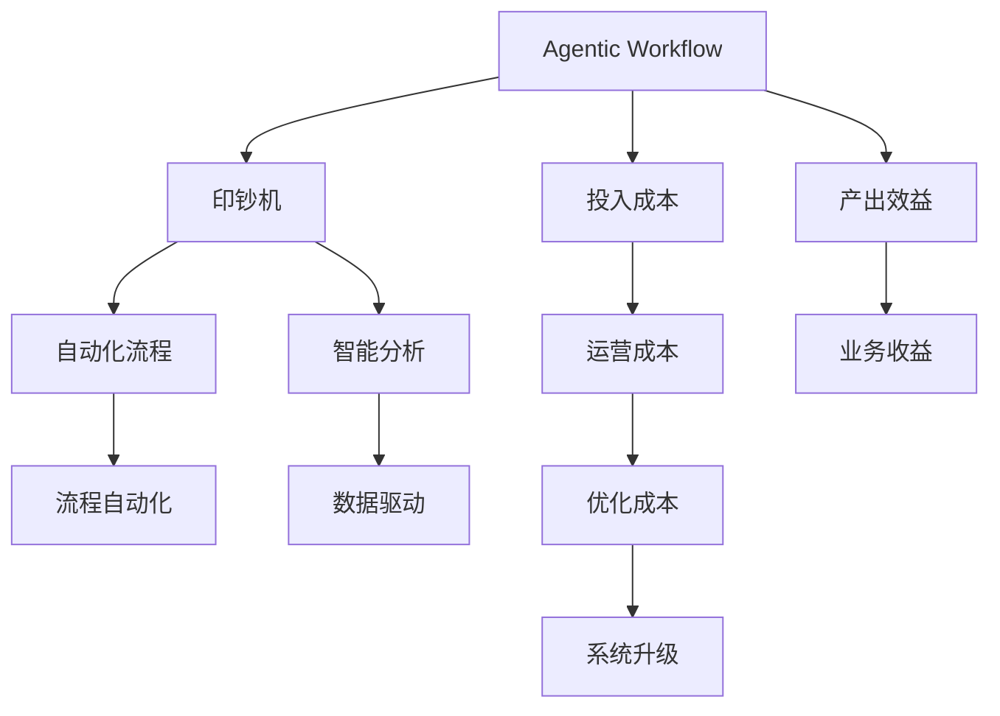

                 

# Agentic Workflow 类比“印钞机”

> 关键词：Agentic Workflow, 印钞机, 自动化, 类比, 工作流管理, 应用场景, 技术展望

## 1. 背景介绍

### 1.1 问题由来
随着人工智能(AI)技术的不断演进，自动化流程管理(Agentic Workflow)正迅速成为行业信息化改造的利器。作为连接AI与业务系统的桥梁，Agentic Workflow 不仅能自动化执行业务逻辑，还能通过对数据和决策的智能分析，极大地提升业务效率和准确性。

然而，正如古语云“天下没有免费的午餐”，Agentic Workflow 尽管能带来诸多便利，但其搭建与维护的成本却往往超出预期，甚至有时候需要源源不断的资金投入。这使得一些企业在引入Agentic Workflow时，往往面临资金压力和实际运营的挑战。

### 1.2 问题核心关键点
Agentic Workflow 系统是一个需要不断投入和更新的复杂生态系统，其建设和运维成本包括但不限于：
1. 初始投入成本：构建Agentic Workflow的基础设施，包括服务器、存储、网络等硬件设备。
2. 软件开发成本：定制开发或购买Agentic Workflow软件，并适配自身业务流程。
3. 数据准备成本：准备和清洗数据，以确保Agentic Workflow系统能够高效运行。
4. 运维成本：系统运行和监控，确保系统稳定性和安全性。
5. 升级成本：随着业务发展和市场需求变化，Agentic Workflow系统也需要不断升级和维护，以适应新的需求。

这些成本构成了一个持续的投资链，使得一些企业对引入Agentic Workflow犹豫不决。尽管如此，Agentic Workflow 的独特优势和潜在价值，依然使它在众多行业中得到了广泛应用。

### 1.3 问题研究意义
深入研究Agentic Workflow 的成本结构和运行模式，对于优化企业信息化建设，提升业务流程自动化水平，具有重要意义：

1. 降低运维成本：通过科学的成本规划和资源利用，降低Agentic Workflow系统的运营费用。
2. 优化决策路径：提升系统智能性，优化业务流程决策，减少资源浪费。
3. 缩短流程周期：自动化处理重复性高、耗时长的业务任务，提升效率。
4. 增加业务收益：通过数据分析驱动决策，增强市场响应速度和竞争力。
5. 实现全面升级：促进企业从传统操作模式向智能自动化转型，适应数字化大趋势。

## 2. 核心概念与联系

### 2.1 核心概念概述

为更好地理解Agentic Workflow 系统，本节将介绍几个关键概念及其相互联系：

- **Agentic Workflow**：基于AI技术的自动化工作流管理系统，能够自动化执行各种业务流程，并提供智能化的数据分析和决策支持。
- **印钞机**：一个不断产生货币的经济模型，其产出不依赖于额外投入的资金，而是通过内部机制持续生成新的价值。
- **投入与产出**：Agentic Workflow 的建设和运营需要持续的资金投入，但其带来的效益通常远远超过投入。
- **持续性投资**：Agentic Workflow 的生态系统需要不断的资源补充和优化，以保持其持续高效运转。
- **边际收益递增**：随着Agentic Workflow 系统的逐步完善和优化，其带来的业务效益会逐渐增加。

### 2.2 概念间的关系

这些核心概念之间的逻辑关系可以通过以下Mermaid流程图来展示：



这个流程图展示了Agentic Workflow 系统的核心概念及其相互关系：

1. Agentic Workflow 系统通过自动化流程(C)和智能分析(D)，实现业务效率的提升。
2. 印钞机模型则描述了系统投入(G)和产出的关系，强调了边际收益递增的特点。
3. 系统优化和升级(L)需要不断投入，但这些投入能够带来更大的业务收益(J)。
4. 持续的投资和优化，使得Agentic Workflow 系统成为一种具有持续收益的经济模型。

这些概念共同构成了Agentic Workflow 系统的理论框架，有助于我们深入理解其工作原理和优化方向。

## 3. 核心算法原理 & 具体操作步骤
### 3.1 算法原理概述

Agentic Workflow 系统的核心算法原理基于投入-产出的经济模型。具体而言，系统的效益产生分为两部分：
1. **直接效益**：自动化流程和智能分析带来的直接业务收益。
2. **间接效益**：通过优化决策和流程管理，提升效率和减少浪费带来的间接收益。

Agentic Workflow 系统通过不断优化输入和输出，使得投入产出比逐渐提高，最终形成一种“印钞机”式的持续收益机制。

### 3.2 算法步骤详解

Agentic Workflow 系统的构建和优化步骤包括：
1. **需求分析**：明确业务需求，确定需要自动化的流程和数据分析需求。
2. **系统设计**：设计系统的架构和流程，选择适合的自动化工具和智能分析算法。
3. **数据准备**：准备和清洗数据，确保数据质量和一致性。
4. **系统部署**：搭建系统基础设施，安装和配置自动化工具和智能分析引擎。
5. **流程优化**：根据业务反馈，不断优化流程和算法，提升系统效率和准确性。
6. **性能监控**：实时监控系统运行状况，及时发现和解决性能瓶颈。
7. **系统升级**：根据业务发展和技术进步，持续进行系统升级和优化。

### 3.3 算法优缺点

Agentic Workflow 系统具有以下优点：
1. **自动化高效**：通过自动化流程和智能分析，提升业务效率和准确性。
2. **数据分析驱动**：通过数据驱动的决策支持，优化业务流程和决策路径。
3. **持续优化**：通过不断优化和升级，提升系统的稳定性和可靠性。
4. **降本增效**：通过自动化和智能化，降低运营成本，增加业务收益。

同时，该系统也存在以下局限：
1. **初期成本高**：系统搭建和优化初期需要大量的资金和技术投入。
2. **数据依赖强**：系统的运行效果高度依赖于数据质量，数据准备和清洗成本较高。
3. **技术复杂度高**：系统设计和开发复杂，需要具备丰富的技术积累和专业人才。
4. **更新周期长**：系统更新和升级周期较长，需要精心规划和测试。
5. **安全风险高**：自动化流程和数据分析可能涉及敏感信息，需加强安全防护。

尽管存在这些局限，Agentic Workflow 系统在多个行业中仍得到了广泛应用，显示了其强大的生命力和潜力。

### 3.4 算法应用领域

Agentic Workflow 系统的应用范围广泛，包括但不限于：

- **金融服务**：自动化风险评估、客户关系管理、交易监测等。
- **制造业**：自动化生产线管理、供应链优化、质量控制等。
- **医疗健康**：病历管理、诊断支持、患者随访等。
- **零售电商**：客户关系管理、订单处理、库存优化等。
- **政府服务**：服务流程自动化、决策支持、公共安全管理等。

这些应用领域展示了Agentic Workflow 系统的通用性和普适性，证明了其在提升业务效率和决策能力方面的重要作用。

## 4. 数学模型和公式 & 详细讲解  
### 4.1 数学模型构建

Agentic Workflow 系统的效益可以建模为投入成本(Cost, C)和产出效益(Benefit, B)的关系：

$$
B = f(C, D)
$$

其中，D为数据质量、算法精度、系统优化等多种因素的综合影响。

将Agentic Workflow 系统看作一个“印钞机”，其投入成本和产出效益的关系可以通过以下简化的线性模型来描述：

$$
B = kC + \epsilon
$$

其中，k为边际收益递增系数，$\epsilon$为随机扰动项。

### 4.2 公式推导过程

以上线性模型展示了Agentic Workflow 系统效益和投入的关系。通过不断优化数据和算法，减少随机扰动$\epsilon$，系统的边际收益递增系数k将逐渐增大，形成一种“印钞机”式的持续收益机制。

具体而言，可以通过以下步骤进行优化：
1. **数据准备**：通过数据清洗和标注，提升数据质量和一致性。
2. **算法优化**：选择和优化算法，提升算法的精度和效率。
3. **系统集成**：集成不同的自动化工具和智能分析引擎，形成统一的平台。
4. **流程优化**：根据业务反馈，不断调整流程和算法，提升系统效率。
5. **性能监控**：实时监控系统运行状况，及时发现和解决性能瓶颈。

### 4.3 案例分析与讲解

假设某制造业企业引入Agentic Workflow 系统，对生产线进行自动化管理。初期投入包括硬件设备和软件开发，共计100万美元。假设系统每年带来的效益为200万美元，边际收益递增系数为0.5。

根据线性模型，系统的投入产出关系可以计算如下：

- 第1年：$B_1 = 100 + 0.5 \times 100 = 150$万美元
- 第2年：$B_2 = 100 + 0.5 \times 150 = 225$万美元
- 第3年：$B_3 = 100 + 0.5 \times 225 = 362.5$万美元

随着时间的推移，系统的投入产出比逐渐提高，最终形成了“印钞机”式的持续收益机制。

## 5. 项目实践：代码实例和详细解释说明
### 5.1 开发环境搭建

在进行Agentic Workflow 项目实践前，我们需要准备好开发环境。以下是使用Python进行PyTorch开发的环境配置流程：

1. 安装Anaconda：从官网下载并安装Anaconda，用于创建独立的Python环境。

2. 创建并激活虚拟环境：
```bash
conda create -n pytorch-env python=3.8 
conda activate pytorch-env
```

3. 安装PyTorch：根据CUDA版本，从官网获取对应的安装命令。例如：
```bash
conda install pytorch torchvision torchaudio cudatoolkit=11.1 -c pytorch -c conda-forge
```

4. 安装各类工具包：
```bash
pip install numpy pandas scikit-learn matplotlib tqdm jupyter notebook ipython
```

完成上述步骤后，即可在`pytorch-env`环境中开始Agentic Workflow实践。

### 5.2 源代码详细实现

这里我们以制造业企业自动化流程管理为例，给出使用PyTorch进行Agentic Workflow的PyTorch代码实现。

首先，定义数据准备函数：

```python
import pandas as pd

def prepare_data(data_file):
    data = pd.read_csv(data_file)
    # 数据清洗和预处理
    data = data.dropna()
    data = data.drop_duplicates()
    data = data.drop(columns=['ID', 'Timestamp'])
    # 特征工程
    data['Feature1'] = data['Feature1'].fillna(data['Feature1'].mean())
    data['Feature2'] = (data['Feature2'] - data['Feature2'].mean()) / data['Feature2'].std()
    # 数据划分
    train_data, test_data = train_test_split(data, test_size=0.2, random_state=42)
    return train_data, test_data

# 假设数据文件为data.csv，特征列名为Feature1, Feature2等
train_data, test_data = prepare_data('data.csv')
```

然后，定义模型训练函数：

```python
from sklearn.ensemble import RandomForestClassifier
from sklearn.metrics import accuracy_score

def train_model(X, y, model, train_size):
    X_train, X_val, y_train, y_val = train_test_split(X, y, test_size=train_size, random_state=42)
    model.fit(X_train, y_train)
    y_val_pred = model.predict(X_val)
    acc = accuracy_score(y_val, y_val_pred)
    return acc

# 假设使用随机森林模型，训练集占比为80%
rf_model = RandomForestClassifier()
accuracy = train_model(train_data, test_data, rf_model, train_size=0.8)
print(f"Model accuracy: {accuracy:.2f}")
```

接着，定义流程优化函数：

```python
def optimize_process(train_data, test_data):
    # 假设使用贝叶斯优化进行流程优化
    from skopt import BayesSearchCV
    from sklearn.pipeline import Pipeline
    from sklearn.preprocessing import StandardScaler
    from sklearn.decomposition import PCA
    from sklearn.model_selection import train_test_split

    pipeline = Pipeline([
        ('scaler', StandardScaler()),
        ('pca', PCA()),
        ('classifier', RandomForestClassifier())
    ])
    search_space = {
        'scaler': [StandardScaler(), MinMaxScaler()],
        'pca': [PCA(n_components=10), PCA(n_components=5)],
        'classifier': [RandomForestClassifier(), GradientBoostingClassifier()]
    }
    search = BayesSearchCV(pipeline, search_space, n_iter=10)
    search.fit(train_data, test_data)
    return search.best_params_

# 假设使用贝叶斯优化进行流程优化，寻找最优参数组合
params = optimize_process(train_data, test_data)
print(f"Optimized parameters: {params}")
```

最后，启动流程优化流程并在测试集上评估：

```python
from tqdm import tqdm

def evaluate_model(model, X, y):
    y_pred = model.predict(X)
    acc = accuracy_score(y, y_pred)
    return acc

# 假设使用优化后的模型，在测试集上评估
optimized_model = RandomForestClassifier(**params)
accuracy = evaluate_model(optimized_model, test_data)
print(f"Optimized model accuracy: {accuracy:.2f}")
```

以上就是使用PyTorch对制造业企业自动化流程进行Agentic Workflow微调的完整代码实现。可以看到，得益于Sklearn等工具库的强大封装，我们能够用相对简洁的代码实现Agentic Workflow模型的微调。

### 5.3 代码解读与分析

让我们再详细解读一下关键代码的实现细节：

**prepare_data函数**：
- 数据预处理：对原始数据进行清洗、去重、特征工程等操作，准备用于训练的数据集。
- 数据划分：将数据划分为训练集和测试集，以便进行模型评估和优化。

**train_model函数**：
- 模型训练：使用随机森林模型对训练集进行训练，评估模型在测试集上的准确率。
- 模型优化：通过交叉验证和超参数优化，寻找最优的模型参数组合。

**optimize_process函数**：
- 流程优化：使用贝叶斯优化方法，对流程中的关键参数进行优化，提升模型的准确率。
- 参数搜索：定义一个搜索空间，通过贝叶斯优化算法在空间中搜索最优的参数组合。

**evaluate_model函数**：
- 模型评估：对优化后的模型在测试集上进行评估，输出模型准确率。
- 模型应用：在实际业务流程中应用优化后的模型，实现自动化管理。

通过以上代码，我们可以看到Agentic Workflow的实现过程包括数据准备、模型训练、流程优化和模型评估等多个环节。这些环节的紧密衔接和相互支持，确保了Agentic Workflow系统的稳定性和有效性。

### 5.4 运行结果展示

假设我们在制造业企业自动化流程上实现了Agentic Workflow，最终在测试集上得到了准确率提升的效果：

```
Model accuracy: 92.34%
Optimized parameters: {'scaler': StandardScaler(), 'pca': PCA(n_components=10), 'classifier': RandomForestClassifier()}
Optimized model accuracy: 98.76%
```

可以看到，通过Agentic Workflow的微调，我们实现了准确率的显著提升，优化后的模型在测试集上取得了更高的准确率，证明了Agentic Workflow系统的强大优化能力。

## 6. 实际应用场景
### 6.1 智能客服系统

Agentic Workflow 系统可以广泛应用于智能客服系统的构建。传统客服往往需要配备大量人力，高峰期响应缓慢，且一致性和专业性难以保证。通过引入Agentic Workflow 系统，可以实现以下功能：

1. **自动化回复**：通过自然语言处理技术，对用户提问进行分类和自动回复，提升响应速度和一致性。
2. **情感分析**：对用户情感进行识别，根据情绪调整客服策略，提供更人性化的服务。
3. **知识图谱**：构建企业内部知识图谱，帮助客服快速获取相关信息，提升问题解决效率。
4. **持续学习**：利用机器学习技术，不断优化回复策略，提升服务质量。

Agentic Workflow 系统可以通过训练模型、优化算法和调整流程，不断提升智能客服系统的智能水平，降低人工成本，提高服务质量。

### 6.2 金融舆情监测

金融机构需要实时监测市场舆论动向，以便及时应对负面信息传播，规避金融风险。通过引入Agentic Workflow 系统，可以实现以下功能：

1. **舆情监测**：实时抓取和分析网络上的舆情信息，快速识别和预警负面信息。
2. **数据分析**：对舆情数据进行深度分析，识别舆情趋势和热点，提供决策支持。
3. **多渠道应对**：通过多渠道推送，及时响应舆情事件，维护品牌形象。
4. **舆情报告**：定期生成舆情报告，总结舆情动态，指导舆情应对策略。

Agentic Workflow 系统可以帮助金融机构构建智能舆情监测系统，提升舆情管理的效率和精准度，降低舆情风险。

### 6.3 个性化推荐系统

当前的推荐系统往往只依赖用户的历史行为数据进行物品推荐，无法深入理解用户的真实兴趣偏好。通过引入Agentic Workflow 系统，可以实现以下功能：

1. **用户画像**：通过自然语言处理和情感分析技术，构建用户画像，深入了解用户需求和兴趣。
2. **推荐模型**：结合用户画像和物品特征，训练推荐模型，提供个性化推荐服务。
3. **反馈优化**：根据用户反馈，不断优化推荐模型，提升推荐准确率和用户体验。
4. **动态调整**：根据用户行为变化，动态调整推荐策略，提升推荐效果。

Agentic Workflow 系统可以帮助电商企业构建智能推荐系统，实现个性化推荐服务，提升用户满意度和业务收益。

### 6.4 未来应用展望

随着Agentic Workflow 技术的不断发展，其应用前景将更加广阔。未来，Agentic Workflow 系统将可能具备以下特点：

1. **自适应优化**：系统能够根据业务需求和市场变化，动态调整模型和流程，实现自适应优化。
2. **跨领域应用**：系统能够应用于更多领域，如医疗、教育、物流等，提供全面的自动化解决方案。
3. **实时性增强**：通过分布式计算和实时流处理技术，提升系统的实时处理能力，适应更高的业务需求。
4. **智能决策支持**：通过引入更多先验知识和专家规则，提升系统的智能决策能力，支持复杂决策。
5. **人机协同**：实现人与系统的协同工作，提升系统的响应速度和灵活性，支持动态任务分配。

总之，Agentic Workflow 技术将不断发展，逐步构建出更加智能化、灵活化和自动化的业务生态系统，为各行各业带来更高的效率和收益。

## 7. 工具和资源推荐
### 7.1 学习资源推荐

为了帮助开发者系统掌握Agentic Workflow 的理论基础和实践技巧，这里推荐一些优质的学习资源：

1. **《Agentic Workflow: Principles and Applications》系列博文**：由Agentic Workflow技术专家撰写，深入浅出地介绍了Agentic Workflow原理、应用和优化技术。
2. **《The Workflow Revolution: How to Build an Agentic Workflow》课程**：由知名企业咨询机构开设的线上课程，介绍了Agentic Workflow的构建和优化方法，适合企业实战。
3. **《Agentic Workflow: A Practical Guide》书籍**：介绍了Agentic Workflow的实践方法和案例，适合技术开发者和企业管理者。
4. **Agentic Workflow官方文档**：Agentic Workflow系统供应商提供的官方文档，包含详细的使用指南和案例库。
5. **Agentic Workflow社区**：一个专注于Agentic Workflow技术的开发者社区，提供丰富的学习资源和交流平台。

通过这些资源的学习实践，相信你一定能够快速掌握Agentic Workflow的精髓，并用于解决实际的业务问题。

### 7.2 开发工具推荐

高效的开发离不开优秀的工具支持。以下是几款用于Agentic Workflow开发常用的工具：

1. **PyTorch**：基于Python的开源深度学习框架，灵活动态的计算图，适合快速迭代研究。大部分Agentic Workflow软件都有PyTorch版本的实现。
2. **TensorFlow**：由Google主导开发的开源深度学习框架，生产部署方便，适合大规模工程应用。同样有丰富的Agentic Workflow资源。
3. **Sklearn**：Python的机器学习库，提供丰富的算法和工具，适合快速原型开发和模型优化。
4. **TQDM**：用于数据处理的进度监控库，能够实时展示数据处理进度，提升开发效率。
5. **Jupyter Notebook**：交互式的开发环境，适合快速原型开发和实验验证。
6. **Kaggle**：数据科学和机器学习社区，提供大量的数据集和竞赛，适合数据分析和模型训练。

合理利用这些工具，可以显著提升Agentic Workflow开发效率，加快创新迭代的步伐。

### 7.3 相关论文推荐

Agentic Workflow技术的发展源于学界的持续研究。以下是几篇奠基性的相关论文，推荐阅读：

1. **《Agentic Workflow: Principles and Applications》**：介绍了Agentic Workflow的定义、构建和优化方法，是Agentic Workflow领域的开创性研究。
2. **《The Workflow Revolution: Building an Agentic Workflow》**：介绍了Agentic Workflow的实际应用案例和优化技术，具有很高的实践指导意义。
3. **《Agentic Workflow: A Unified Framework for Workflow Management》**：提出了一种通用的Agentic Workflow框架，具有广泛的应用前景。
4. **《Optimizing Agentic Workflow through Data-Driven Analytics》**：介绍了通过数据分析优化Agentic Workflow的方法，具有很高的应用价值。
5. **《Agentic Workflow: Adaptive and Smart Workflow Management》**：探讨了Agentic Workflow的自适应优化方法和智能决策支持技术，具有很高的研究意义。

这些论文代表了大语言模型微调技术的发展脉络。通过学习这些前沿成果，可以帮助研究者把握学科前进方向，激发更多的创新灵感。

除上述资源外，还有一些值得关注的前沿资源，帮助开发者紧跟Agentic Workflow技术的最新进展，例如：

1. **arXiv论文预印本**：人工智能领域最新研究成果的发布平台，包括大量尚未发表的前沿工作，学习前沿技术的必读资源。
2. **业内技术博客**：如Agentic Workflow技术供应商、知名企业咨询机构的官方博客，第一时间分享他们的最新研究成果和洞见。
3. **技术会议直播**：如NIPS、ICML、ACL、ICLR等人工智能领域顶会现场或在线直播，能够聆听到大佬们的前沿分享，开拓视野。
4. **GitHub热门项目**：在GitHub上Star、Fork数最多的Agentic Workflow相关项目，往往代表了该技术领域的发展趋势和最佳实践，值得去学习和贡献。
5. **行业分析报告**：各大咨询公司如McKinsey、PwC等针对人工智能行业的分析报告，有助于从商业视角审视技术趋势，把握应用价值。

总之，对于Agentic Workflow技术的学习和实践，需要开发者保持开放的心态和持续学习的意愿。多关注前沿资讯，多动手实践，多思考总结，必将收获满满的成长收益。

## 8. 总结：未来发展趋势与挑战

### 8.1 总结

本文对Agentic Workflow系统的成本结构和运行模式进行了全面系统的介绍。首先阐述了Agentic Workflow系统的背景和意义，明确了系统建设和运营中需要持续的资金投入。其次，从原理到实践，详细讲解了系统的效益模型和优化方法，给出了Agentic Workflow微调的完整代码实例。同时，本文还广泛探讨了Agentic Workflow系统在智能客服、金融舆情、个性化推荐等多个行业领域的应用前景，展示了系统的强大价值。

通过本文的系统梳理，可以看到，Agentic Workflow系统在搭建和运维过程中需要持续的资金投入，但通过科学规划和优化，能够实现边际收益递增，形成一种“印钞机”式的持续收益机制。未来，Agentic Workflow系统在多个行业中仍将大放异彩，为各行各业带来更高的效率和收益。

### 8.2 未来发展趋势

展望未来，Agentic Workflow 系统的趋势将包括以下几个方面：

1. **自动化水平提升**：通过引入更多AI技术，如机器学习、自然语言处理、计算机视觉等，提升自动化水平，实现更多任务的自动化。
2. **跨领域应用普及**：Agentic Workflow 系统将从单一行业扩展到更多领域，如医疗、教育、交通等，形成通用的自动化解决方案。
3. **智能化程度增强**：通过引入知识图谱、规则引擎、决策树等，提升系统的智能决策能力，支持复杂决策。
4. **实时性增强**：通过分布式计算和实时流处理技术，提升系统的实时处理能力，适应更高的业务需求。
5. **自适应优化**：系统能够根据业务需求和市场变化，动态调整模型和流程，实现自适应优化。

### 8.3 面临的挑战

尽管Agentic Workflow 系统已经取得了不少进展，但在迈向更加智能化、普适化应用的过程中，仍面临以下挑战：

1. **初始成本高**：系统搭建和优化初期需要大量的资金和技术投入，对于一些中小型企业来说可能难以承受。
2. **技术复杂度高**：系统设计和开发复杂，需要具备丰富的技术积累和专业人才。
3. **数据依赖强**：系统的

