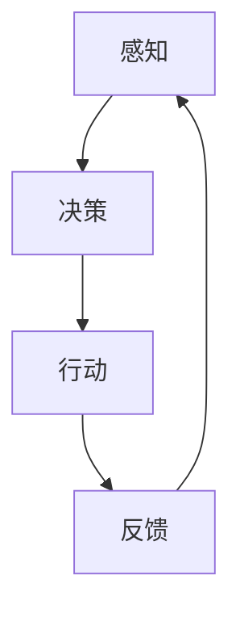

                 

## 1. 背景介绍

在现代AI领域，Agent代理正逐渐成为关键的组成部分。无论是在游戏、机器人、自动化决策系统，还是其他复杂系统，Agent代理都扮演着重要的角色。Agent代理，是一种在复杂环境中自主行动的实体，其决策基于对环境的感知和内在的目标。本文将深入探讨Agent代理在AI中的实战方法，包括其核心概念、算法原理、实际应用以及未来的发展方向。

## 2. 核心概念与联系

### 2.1 核心概念概述

Agent代理是一种能够在复杂环境中自主行动的实体，其决策基于对环境的感知和内在的目标。Agent代理可以分为多个类型，包括：

- **感知型Agent**：这类Agent仅依赖环境感知来决策，如移动机器人、自动驾驶汽车。
- **决策型Agent**：这类Agent在决策时会考虑额外的信息，如经济模型、行为理论等，如股市自动化交易系统、推荐系统。
- **学习型Agent**：这类Agent能够通过与环境的交互进行学习和改进，如强化学习中的Q-learning。

Agent代理的核心工作流程包括：

1. **感知**：Agent代理感知环境，提取有用信息。
2. **决策**：Agent代理基于当前感知和内在目标，作出决策。
3. **行动**：Agent代理在环境中执行决策。
4. **反馈**：Agent代理接收环境的反馈，调整感知和决策。

### 2.2 核心概念原理和架构的 Mermaid 流程图



该图展示了Agent代理的基本工作流程。从感知到行动再到反馈，这是一个不断迭代和优化的过程。

## 3. 核心算法原理 & 具体操作步骤

### 3.1 算法原理概述

Agent代理的核心算法原理主要包括以下几个方面：

1. **感知与表示**：Agent代理需要对环境进行感知，并使用适当的表示方法来理解感知结果。
2. **决策模型**：Agent代理需要设计合适的决策模型来指导其行动。
3. **行动策略**：Agent代理需要选择合适的行动策略来执行决策。
4. **学习机制**：Agent代理需要具备学习机制，以便在不断的交互中优化其决策和行动策略。

### 3.2 算法步骤详解

Agent代理的实际操作步骤包括以下几个阶段：

1. **环境建模**：根据任务要求，建立环境的数学模型。
2. **感知设计**：设计Agent代理的感知模块，提取环境信息。
3. **决策模块设计**：设计决策模型，包括状态评估、奖励函数等。
4. **行动策略设计**：选择合适的行动策略，如确定性策略、随机策略等。
5. **学习机制设计**：选择合适的学习算法，如Q-learning、SARSA、策略梯度等。
6. **仿真与测试**：使用仿真环境对Agent代理进行测试和优化。
7. **部署与应用**：将优化后的Agent代理部署到实际环境中进行应用。

### 3.3 算法优缺点

Agent代理算法具有以下优点：

1. **自主性**：Agent代理能够自主地在环境中行动，无需外部干预。
2. **灵活性**：Agent代理能够根据环境的变化灵活调整其策略。
3. **可扩展性**：Agent代理可以应用于各种复杂系统，如游戏、机器人、经济模型等。

但同时，Agent代理也存在一些缺点：

1. **复杂性**：Agent代理的设计和实现相对复杂，需要综合考虑多方面的因素。
2. **泛化能力**：Agent代理在特定环境中的表现可能难以泛化到其他环境。
3. **学习效率**：Agent代理在复杂环境中可能需要较长的学习时间才能达到理想的效果。

### 3.4 算法应用领域

Agent代理的应用领域非常广泛，涵盖了游戏、机器人、自动化决策系统、推荐系统等多个领域。具体应用包括：

1. **游戏AI**：如AlphaGo、OpenAI Five等，能够在复杂的游戏中进行自主决策。
2. **自动化驾驶**：如自动驾驶汽车，需要能够在复杂交通环境中安全导航。
3. **自动化交易**：如自动交易系统，需要能够根据市场数据进行决策和交易。
4. **推荐系统**：如个性化推荐，需要能够根据用户行为进行推荐。
5. **机器人**：如服务机器人，需要能够在不同环境中执行各种任务。

## 4. 数学模型和公式 & 详细讲解

### 4.1 数学模型构建

Agent代理的数学模型主要包括以下几个部分：

1. **状态空间**：环境的当前状态，可以表示为$S$。
2. **行动空间**：Agent代理可以采取的行动，可以表示为$A$。
3. **奖励函数**：环境对Agent代理行动的奖励，可以表示为$R(s,a)$。
4. **状态转移概率**：环境根据Agent代理行动的下一个状态转移概率，可以表示为$P(s_{t+1}|s_t,a_t)$。

### 4.2 公式推导过程

以Q-learning算法为例，其数学公式如下：

$$
Q(s_t,a_t) \leftarrow Q(s_t,a_t) + \alpha [R(s_t,a_t) + \gamma \max Q(s_{t+1},a_{t+1}) - Q(s_t,a_t)]
$$

其中，$Q(s_t,a_t)$表示在状态$s_t$下采取行动$a_t$的Q值，$\alpha$为学习率，$\gamma$为折扣因子。

### 4.3 案例分析与讲解

以AlphaGo为例，其核心算法为深度Q网络（DQN）。AlphaGo通过使用深度神经网络来构建Q值函数，并在大量历史游戏中进行学习和优化。其步骤如下：

1. **感知设计**：AlphaGo使用CNN来处理棋盘上的状态，提取有用的特征。
2. **决策模型设计**：AlphaGo使用深度Q网络来估计每个状态的Q值，并使用策略梯度算法来优化决策策略。
3. **行动策略设计**：AlphaGo使用蒙特卡罗树搜索（MCTS）来评估每个可能行动的价值，并采用贪婪策略选择最优行动。
4. **学习机制设计**：AlphaGo在每一轮游戏后，使用Q-learning算法来更新其Q值函数。
5. **仿真与测试**：AlphaGo使用游戏仿真环境进行测试和优化。
6. **部署与应用**：AlphaGo最终在围棋比赛中取得了战胜人类世界冠军的惊人成果。

## 5. 项目实践：代码实例和详细解释说明

### 5.1 开发环境搭建

Agent代理的开发环境需要Python3.6及以上版本，以及TensorFlow或PyTorch等深度学习框架。具体搭建步骤如下：

1. 安装Python和pip。
2. 安装TensorFlow或PyTorch。
3. 安装必要的库，如OpenAI Gym、GymAtari等。

### 5.2 源代码详细实现

以DQN算法为例，代码实现如下：

```python
import numpy as np
import tensorflow as tf
import gym

class DQNAgent:
    def __init__(self, state_size, action_size):
        self.state_size = state_size
        self.action_size = action_size
        self.memory = []
        self.gamma = 0.95
        self.epsilon = 1.0
        self.epsilon_min = 0.01
        self.epsilon_decay = 0.995
        self.learning_rate = 0.001
        self.model = self._build_model()

    def _build_model(self):
        model = tf.keras.models.Sequential()
        model.add(tf.keras.layers.Dense(24, input_dim=self.state_size, activation='relu'))
        model.add(tf.keras.layers.Dense(24, activation='relu'))
        model.add(tf.keras.layers.Dense(self.action_size, activation='linear'))
        model.compile(loss='mse', optimizer=tf.keras.optimizers.Adam(lr=self.learning_rate))
        return model

    def remember(self, state, action, reward, next_state, done):
        self.memory.append((state, action, reward, next_state, done))

    def act(self, state):
        if np.random.rand() <= self.epsilon:
            return np.random.randint(self.action_size)
        act_values = self.model.predict(state)
        return np.argmax(act_values[0])

    def replay(self, batch_size):
        minibatch = np.random.choice(len(self.memory), batch_size, replace=False)
        for state, action, reward, next_state, done in minibatch:
            target = reward
            if not done:
                target = (reward + self.gamma * np.amax(self.model.predict(next_state)[0]))
            target_f = self.model.predict(state)
            target_f[0][action] = target
            self.model.fit(state, target_f, epochs=1, verbose=0)
        if self.epsilon > self.epsilon_min:
            self.epsilon *= self.epsilon_decay
```

### 5.3 代码解读与分析

- **类定义**：定义了一个名为DQNAgent的类，用于实现深度Q网络算法。
- **模型构建**：在初始化时，构建了一个包含两个全连接层的神经网络模型。
- **记忆操作**：使用一个列表来存储历史经验，包括状态、行动、奖励、下一个状态和是否结束。
- **行动策略**：在行动时，如果随机数小于$\epsilon$，则采取随机行动；否则使用模型预测值，选择最大Q值对应的行动。
- **经验回放**：从记忆中随机选择一批样本，根据目标Q值更新模型。

### 5.4 运行结果展示

假设我们训练一个DQN代理，让其在Atari游戏中学习打“Breakout”。我们随机选择一批样本，并输出模型预测值和真实Q值，代码如下：

```python
import gym

env = gym.make('Breakout-v4')
state_size = env.observation_space.shape[0]
action_size = env.action_space.n

agent = DQNAgent(state_size, action_size)

for episode in range(5):
    state = env.reset()
    state = np.reshape(state, [1, state_size])
    done = False
    while not done:
        action = agent.act(state)
        next_state, reward, done, _ = env.step(action)
        next_state = np.reshape(next_state, [1, state_size])
        agent.remember(state, action, reward, next_state, done)
        state = next_state
env.close()
```

训练完毕后，我们可以观察到代理的平均Q值随时间的变化，代码如下：

```python
import matplotlib.pyplot as plt

plt.plot(agent.q_values)
plt.xlabel('Episodes')
plt.ylabel('Q value')
plt.show()
```

## 6. 实际应用场景

### 6.1 智能游戏

智能游戏是Agent代理的经典应用场景之一。AlphaGo、AlphaStar等Agent代理在围棋、星际争霸等复杂游戏中取得了巨大成功，展现了其在自主决策和策略优化方面的强大能力。

### 6.2 机器人

Agent代理在机器人领域也有广泛应用。机器人可以使用传感器感知环境，并根据任务要求自主行动。例如，机器人可以用于自动化仓库管理、自动化制造等场景。

### 6.3 金融决策

金融决策领域也需要Agent代理来处理大量的市场数据，并根据市场变化进行实时决策。例如，股票交易系统可以使用Agent代理进行交易策略优化。

### 6.4 未来应用展望

未来，Agent代理将在更多领域得到应用。随着技术的发展，Agent代理将变得更加智能化和自适应，能够处理更加复杂的任务。

1. **多模态Agent代理**：Agent代理将能够处理多种模态的信息，如视觉、听觉、文本等，增强其在多感官场景中的决策能力。
2. **协同Agent代理**：Agent代理将能够与其他Agent代理协同工作，实现更复杂、更高效的决策。
3. **深度强化学习**：Agent代理将结合深度强化学习技术，提升其在复杂环境中的学习能力和决策精度。
4. **自适应学习**：Agent代理将具备自适应学习的能力，能够根据环境变化动态调整策略。

## 7. 工具和资源推荐

### 7.1 学习资源推荐

1. **《强化学习：原理与实践》**：Sutton和Barto的经典教材，全面介绍了强化学习的理论基础和实际应用。
2. **《Python深度学习》**：Francois Chollet的深度学习入门书籍，详细讲解了TensorFlow和Keras的使用。
3. **《Deep Q Learning》**：Volodymyr Mnih等人的深度Q学习论文，是深度强化学习的经典之作。
4. **DeepMind AI Blog**：DeepMind的官方博客，提供了大量的AI技术研究和最新成果。
5. **OpenAI Gym**：一个Python环境，用于AI和强化学习的实验和研究。

### 7.2 开发工具推荐

1. **TensorFlow**：由Google开发的深度学习框架，支持复杂的模型构建和训练。
2. **PyTorch**：Facebook开发的深度学习框架，易于使用，适合快速迭代研究。
3. **GymAtari**：OpenAI Gym的一个扩展，支持Atari游戏环境的开发和测试。
4. **Matplotlib**：Python的数据可视化库，支持各种图表的绘制。
5. **Jupyter Notebook**：一个交互式笔记本环境，适合进行数据分析和机器学习实验。

### 7.3 相关论文推荐

1. **AlphaGo**：DeepMind的论文《Human-level Control of Go with Deep Reinforcement Learning》。
2. **AlphaStar**：OpenAI的论文《Human-Level General Game Playing with Deep Reinforcement Learning》。
3. **DQN**：Mnih等人的论文《Human-level Control of Go with Deep Reinforcement Learning》。
4. **MCTS**：Kocsis等人的论文《Deep Reinforcement Learning for Planning Computation Trees》。
5. **Gym**：Mujanaga等人的论文《Mastering the Game of Go without Human Knowledge》。

## 8. 总结：未来发展趋势与挑战

### 8.1 研究成果总结

本文详细介绍了Agent代理在AI中的实战方法，包括其核心概念、算法原理、实际应用以及未来的发展方向。Agent代理在复杂系统中的应用已经取得了显著的成果，如AlphaGo、AlphaStar等。未来，Agent代理将在更多领域得到应用，其智能化和自适应能力将进一步提升。

### 8.2 未来发展趋势

1. **多模态Agent代理**：Agent代理将处理多种模态的信息，增强其在多感官场景中的决策能力。
2. **协同Agent代理**：Agent代理将能够与其他Agent代理协同工作，实现更复杂、更高效的决策。
3. **深度强化学习**：Agent代理将结合深度强化学习技术，提升其在复杂环境中的学习能力和决策精度。
4. **自适应学习**：Agent代理将具备自适应学习的能力，能够根据环境变化动态调整策略。

### 8.3 面临的挑战

1. **复杂性**：Agent代理的设计和实现相对复杂，需要综合考虑多方面的因素。
2. **泛化能力**：Agent代理在特定环境中的表现可能难以泛化到其他环境。
3. **学习效率**：Agent代理在复杂环境中可能需要较长的学习时间才能达到理想的效果。

### 8.4 研究展望

未来，Agent代理的研究需要在以下几个方面寻求新的突破：

1. **优化算法**：开发更加高效、稳定的优化算法，提升Agent代理的学习效率和决策精度。
2. **模型结构**：设计更加合适的模型结构，提高Agent代理的泛化能力和自适应能力。
3. **多任务学习**：研究Agent代理在多个任务中的协同学习，提升其处理复杂任务的能力。
4. **安全性和鲁棒性**：确保Agent代理在面对异常和攻击时的安全性和鲁棒性。

## 9. 附录：常见问题与解答

**Q1：Agent代理与传统算法有何不同？**

A: Agent代理与传统算法的主要不同在于其自主性和自适应性。Agent代理能够自主地在环境中行动，并根据环境变化动态调整策略，而传统算法需要手动设计决策规则，难以应对复杂的动态环境。

**Q2：Agent代理的优缺点有哪些？**

A: Agent代理的优点包括自主性、灵活性和可扩展性。缺点包括复杂性、泛化能力和学习效率。

**Q3：Agent代理在金融决策中的应用有哪些？**

A: Agent代理在金融决策中的应用包括股票交易系统、风险管理、金融预测等。

**Q4：Agent代理在智能游戏中的应用有哪些？**

A: Agent代理在智能游戏中的应用包括AlphaGo、AlphaStar、星际争霸等。

**Q5：Agent代理的未来发展方向有哪些？**

A: Agent代理的未来发展方向包括多模态Agent代理、协同Agent代理、深度强化学习、自适应学习等。

---

作者：禅与计算机程序设计艺术 / Zen and the Art of Computer Programming

