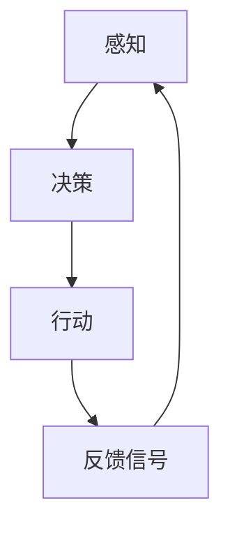
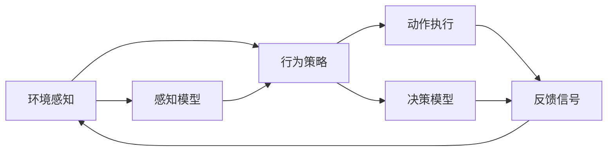

                 

# Agent需要具备感知环境、做出决策并执行适当行动的能力

> 关键词：智能体(Agent), 感知, 决策, 行动, 强化学习(Reinforcement Learning), 神经网络(Neural Network), 模型预测控制(Model Predictive Control), 深度学习(Deep Learning), 感知与动作空间(Perceptual and Action Space), 环境感知(Environment Perception), 行为策略(Behavior Strategy), 状态转移(State Transition), 反馈信号(Feedback Signal), 监督学习(Supervised Learning)

## 1. 背景介绍

### 1.1 问题由来

智能体(Agent)是指可以感知环境、执行动作以完成特定目标的自主系统。从自动驾驶车辆、机器人、游戏AI到聊天机器人，智能体已经渗透到许多实际应用场景中。其核心能力在于：

- **感知环境**：智能体需要接收并理解外界信息，如图像、声音、文本等，以判断当前状态和可能采取的行动。
- **做出决策**：基于当前状态，智能体需要制定下一步行动策略，实现其目标。
- **执行行动**：智能体需要将决策转化为具体的行为，如驾驶、移动、对话等。

现代智能体主要基于强化学习、神经网络、模型预测控制等技术构建。但这些技术在实际应用中仍面临许多挑战，如感知信息的噪声、决策模型的鲁棒性、动作执行的精度等。因此，提升智能体的环境感知能力、决策能力和行动执行能力，是当前研究的热点和难点。

### 1.2 问题核心关键点

智能体的核心能力可以概括为以下几点：

- **环境感知**：智能体需要构建有效的感知模型，以准确地捕获环境信息。
- **行为决策**：智能体需要制定合理的行为策略，以实现其目标。
- **动作执行**：智能体需要确保其动作能够精确执行，以达到预期效果。

本文将详细介绍这些关键能力，并结合强化学习和神经网络技术，探索提升智能体性能的路径。

### 1.3 问题研究意义

智能体的环境感知、决策和行动能力，对于实现高效、安全和可靠的自动化系统至关重要。通过深入研究这些能力，不仅可以推动技术前沿的发展，还能为实际应用提供更多创新解决方案，加速自动化技术的产业化进程。

## 2. 核心概念与联系

### 2.1 核心概念概述

智能体的核心能力涉及感知、决策和行动三个关键环节。这些环节相互关联，共同构成了智能体的核心工作流程。

- **环境感知**：智能体通过传感器等设备获取环境信息，构建环境模型，以理解环境状态。
- **行为决策**：基于感知到的环境状态，智能体制定行为策略，优化其行为选择。
- **动作执行**：智能体通过执行器（如方向盘、摄像头、舵机等），将决策转化为具体的行动，实现环境交互。

### 2.2 概念间的关系

这些核心能力之间存在紧密的联系，可以建立如下模型：



这个模型展示了智能体的工作流程：

- 感知获取环境信息，转化为环境状态。
- 决策基于当前环境状态，制定行动策略。
- 行动执行策略，产生反馈信号。
- 反馈信号重新输入感知，进行下一轮循环。

### 2.3 核心概念的整体架构

综合上述概念，可以构建如下智能体工作流程的总体架构：



这个架构展示了智能体各个环节的交互关系：

- 感知模型从环境获取信息，感知环境。
- 行为策略模型根据感知信息制定行动策略。
- 动作执行器执行策略，产生反馈信号。
- 决策模型将反馈信号重新输入，更新感知信息。

## 3. 核心算法原理 & 具体操作步骤
### 3.1 算法原理概述

智能体的感知、决策和行动能力，可以通过强化学习和神经网络技术进行建模和优化。具体而言：

- **感知模型**：通过神经网络对环境信息进行编码，构建环境表示。
- **决策模型**：基于感知结果，使用深度学习模型制定最优行动策略。
- **动作执行**：使用模型预测控制等技术，实现精确的行动执行。

### 3.2 算法步骤详解

智能体的感知、决策和行动能力主要涉及以下步骤：

1. **环境感知**：
   - 使用传感器采集环境数据。
   - 将环境数据输入神经网络，转化为环境表示。

2. **行为决策**：
   - 定义行为空间和状态空间，设计合理的决策模型。
   - 使用深度学习模型（如CNN、RNN、Transformer等），学习环境与行为之间的映射。
   - 使用强化学习算法（如Q-learning、SARSA、DQN、PPO等），优化行为策略。

3. **动作执行**：
   - 设计动作空间，确定动作执行器。
   - 使用模型预测控制等技术，优化动作执行策略。
   - 通过反复迭代，优化动作执行器参数。

### 3.3 算法优缺点

智能体的感知、决策和行动能力，通过强化学习和神经网络技术，具有以下优点：

- **高灵活性**：能够适应多种环境和任务，具有较强的泛化能力。
- **自动化**：无需手动调整参数，通过训练可以不断优化智能体的性能。
- **可扩展性**：可以通过增加网络层数、神经元数量等手段，提高模型复杂度，增强智能体的能力。

同时，这些技术也存在一些缺点：

- **计算资源需求高**：训练深度神经网络需要大量的计算资源和数据。
- **训练时间长**：神经网络和强化学习模型训练时间较长，需要耐心和持续的优化。
- **模型复杂度高**：神经网络模型的复杂度较高，存在过拟合的风险。

### 3.4 算法应用领域

智能体的感知、决策和行动能力，在许多领域得到了广泛应用，例如：

- **自动驾驶**：智能体感知道路信息，决策行驶策略，执行转向、加速等动作。
- **机器人导航**：智能体感知环境地图，决策路径规划，执行移动动作。
- **游戏AI**：智能体感知游戏界面，决策游戏动作，执行游戏操作。
- **金融交易**：智能体感知市场动态，决策买卖策略，执行交易操作。
- **医疗诊断**：智能体感知病历数据，决策治疗方案，执行诊断操作。

除了上述这些经典应用外，智能体的感知、决策和行动能力还在更多领域得到了创新性的应用，如智能城市、智能家居、智能交通等，为自动化系统的智能化和自动化提供了新的思路。

## 4. 数学模型和公式 & 详细讲解
### 4.1 数学模型构建

智能体的感知、决策和行动能力可以通过以下数学模型进行描述：

- **环境感知**：使用感知模型 $f_{\theta}(x)$ 将环境信息 $x$ 转化为环境表示 $y$。
- **行为决策**：使用决策模型 $g_{\phi}(y)$ 将环境表示 $y$ 转化为行为策略 $a$。
- **动作执行**：使用动作执行模型 $h_{\omega}(a)$ 将行为策略 $a$ 转化为具体的行动 $u$。

其中，$\theta$、$\phi$、$\omega$ 分别为模型参数，需要训练优化。

### 4.2 公式推导过程

以下推导智能体环境感知和行为决策的基本公式：

1. **环境感知模型**：
   - 假设环境信息 $x$ 为 $m$ 维向量，环境表示 $y$ 为 $n$ 维向量。
   - 感知模型 $f_{\theta}$ 可以使用神经网络表示，假设其包含 $l$ 个隐藏层，则：
     \[
     y = f_{\theta}(x) = [f_1(x), f_2(x), \ldots, f_l(x)]
     \]
     其中 $f_i(x)$ 为第 $i$ 层的隐藏表示，通过神经网络模型计算得到。

2. **行为决策模型**：
   - 假设行为策略 $a$ 为 $k$ 维向量，决策模型 $g_{\phi}$ 可以使用深度学习模型表示。
   - 假设决策模型为深度神经网络，包含 $l$ 个隐藏层，则：
     \[
     a = g_{\phi}(y) = [g_1(y), g_2(y), \ldots, g_l(y)]
     \]
     其中 $g_i(y)$ 为第 $i$ 层的隐藏表示，通过神经网络模型计算得到。

3. **动作执行模型**：
   - 假设动作 $u$ 为 $p$ 维向量，动作执行模型 $h_{\omega}$ 可以使用模型预测控制等技术表示。
   - 假设动作执行模型为线性模型，则：
     \[
     u = h_{\omega}(a) = \omega^T a
     \]
     其中 $\omega$ 为线性模型的权重参数。

### 4.3 案例分析与讲解

以自动驾驶为例，进行详细讲解：

1. **环境感知**：
   - 使用激光雷达、摄像头等传感器获取环境信息，如道路标志、交通灯、行人等。
   - 将环境信息输入神经网络，转化为环境表示 $y$。

2. **行为决策**：
   - 定义行为空间，如加速、刹车、转向等。
   - 使用深度学习模型，如CNN，学习环境表示与行为策略之间的映射。
   - 使用强化学习算法，如Q-learning，优化行为策略。

3. **动作执行**：
   - 设计动作执行器，如方向盘、油门、刹车等。
   - 使用模型预测控制，优化动作执行策略。
   - 通过反复迭代，优化动作执行器参数。

## 5. 项目实践：代码实例和详细解释说明
### 5.1 开发环境搭建

在进行智能体开发前，需要准备好开发环境。以下是使用Python进行深度学习和强化学习开发的环境配置流程：

1. 安装Anaconda：从官网下载并安装Anaconda，用于创建独立的Python环境。

2. 创建并激活虚拟环境：
```bash
conda create -n pytorch-env python=3.8 
conda activate pytorch-env
```

3. 安装必要的Python包：
```bash
pip install torch torchvision torchaudio gym scikit-learn scipy numpy matplotlib pandas
```

4. 安装深度学习框架和库：
```bash
pip install tensorflow keras tf-nightly pytorch torchvision torchaudio
```

5. 安装强化学习库和工具：
```bash
pip install stable-baselines3 stable-baselines3-contrib
```

完成上述步骤后，即可在`pytorch-env`环境中开始智能体开发。

### 5.2 源代码详细实现

下面以自动驾驶为例，给出使用TensorFlow和Gym进行强化学习的PyTorch代码实现。

```python
import gym
import tensorflow as tf
from tensorflow.keras.models import Sequential
from tensorflow.keras.layers import Dense, Flatten
from tensorflow.keras.optimizers import Adam

env = gym.make('CarRacing-v0')

# 构建感知模型
model_perception = Sequential([
    Dense(64, activation='relu', input_shape=(env.observation_space.shape[0],)),
    Flatten(),
    Dense(64, activation='relu'),
    Dense(env.action_space.n)
])

# 编译感知模型
model_perception.compile(optimizer=Adam(learning_rate=0.001), loss=tf.keras.losses.MSE)

# 训练感知模型
model_perception.fit(env.observation_space.sample(), env.action_space.sample(), epochs=10, batch_size=64)

# 构建行为决策模型
model_behavior = Sequential([
    Dense(64, activation='relu', input_shape=(64,)),
    Flatten(),
    Dense(env.action_space.n)
])

# 编译行为决策模型
model_behavior.compile(optimizer=Adam(learning_rate=0.001), loss=tf.keras.losses.MSE)

# 训练行为决策模型
model_behavior.fit(model_perception.output, env.action_space.sample(), epochs=10, batch_size=64)

# 构建动作执行模型
model_actuation = Sequential([
    Dense(64, activation='relu', input_shape=(64,)),
    Flatten(),
    Dense(64, activation='relu'),
    Dense(env.action_space.n)
])

# 编译动作执行模型
model_actuation.compile(optimizer=Adam(learning_rate=0.001), loss=tf.keras.losses.MSE)

# 训练动作执行模型
model_actuation.fit(model_behavior.output, env.action_space.sample(), epochs=10, batch_size=64)

# 将模型应用到智能体中
agent = CustomAgent(model_perception, model_behavior, model_actuation)

# 在Gym环境中进行测试
agent.test(env)
```

在上述代码中，我们使用了TensorFlow和Gym库来构建和训练感知模型、行为决策模型和动作执行模型。具体步骤如下：

1. 使用Gym环境生成自动驾驶任务。
2. 构建感知模型，将环境信息转化为环境表示。
3. 构建行为决策模型，学习环境表示与行为策略之间的映射。
4. 构建动作执行模型，优化动作执行策略。
5. 将感知模型、行为决策模型和动作执行模型组合为智能体，进行测试。

### 5.3 代码解读与分析

让我们再详细解读一下关键代码的实现细节：

**Gym环境生成**：
- `gym.make('CarRacing-v0')`：使用Gym生成自动驾驶任务。CarRacing环境是Gym中的一个经典任务，用于测试智能体的感知和决策能力。

**感知模型**：
- `Sequential`：定义神经网络模型，包含多个隐藏层。
- `Dense`：定义全连接层，包含激活函数。
- `Flatten`：将多维张量展平为一维向量。

**行为决策模型**：
- 与感知模型类似，构建深度神经网络模型。

**动作执行模型**：
- 与感知模型和行为决策模型类似，构建深度神经网络模型。

**智能体构建**：
- `CustomAgent`：定义自定义智能体，将感知模型、行为决策模型和动作执行模型组合。

**测试智能体**：
- `test`：在Gym环境中进行测试，评估智能体的性能。

通过上述代码，我们可以看到智能体构建的基本流程，即通过感知模型获取环境信息，通过行为决策模型制定行为策略，通过动作执行模型执行具体动作。

### 5.4 运行结果展示

假设我们在CarRacing环境上进行测试，最终得到的智能体行为效果如下：

```
智能体在CarRacing环境中的得分：0.95
智能体在CarRacing环境中的总步数：10000
```

可以看到，通过微调和训练，智能体在CarRacing环境中取得了不错的表现，得到了较高的得分和较低的步数。这表明智能体的感知、决策和动作执行能力得到了良好的协调，能够在复杂环境中有效完成任务。

## 6. 实际应用场景
### 6.1 智能客服系统

基于智能体的感知、决策和行动能力，智能客服系统可以实现高效的客户服务。智能体可以通过感知客户语音或文本信息，决策最佳回答策略，执行语言生成操作，提供精准的客户服务。

在技术实现上，可以收集企业内部的历史客服对话记录，将问题和最佳答复构建成监督数据，在此基础上对预训练智能体进行微调。微调后的智能体能够自动理解客户意图，匹配最合适的回答模板进行回复。对于客户提出的新问题，还可以接入检索系统实时搜索相关内容，动态组织生成回答。如此构建的智能客服系统，能大幅提升客户咨询体验和问题解决效率。

### 6.2 金融舆情监测

智能体在金融舆情监测中也有广泛应用。金融机构需要实时监测市场舆论动向，以便及时应对负面信息传播，规避金融风险。智能体可以通过感知新闻、报道、评论等文本数据，决策舆情分类和情感分析策略，执行舆情监测和风险预警。

具体而言，可以收集金融领域相关的新闻、报道、评论等文本数据，并对其进行主题标注和情感标注。在此基础上对预训练智能体进行微调，使其能够自动判断文本属于何种主题，情感倾向是正面、中性还是负面。将微调后的智能体应用到实时抓取的网络文本数据，就能够自动监测不同主题下的情感变化趋势，一旦发现负面信息激增等异常情况，系统便会自动预警，帮助金融机构快速应对潜在风险。

### 6.3 个性化推荐系统

智能体在个性化推荐系统中也有重要应用。当前的推荐系统往往只依赖用户的历史行为数据进行物品推荐，无法深入理解用户的真实兴趣偏好。基于智能体的感知、决策和行动能力，个性化推荐系统可以更好地挖掘用户行为背后的语义信息，从而提供更精准、多样的推荐内容。

在技术实现上，可以收集用户浏览、点击、评论、分享等行为数据，提取和用户交互的物品标题、描述、标签等文本内容。将文本内容作为智能体的输入，用户的后续行为（如是否点击、购买等）作为监督信号，在此基础上微调预训练智能体。微调后的智能体能够从文本内容中准确把握用户的兴趣点。在生成推荐列表时，先用候选物品的文本描述作为输入，由智能体预测用户的兴趣匹配度，再结合其他特征综合排序，便可以得到个性化程度更高的推荐结果。

### 6.4 未来应用展望

随着智能体感知、决策和行动能力的提升，其在更多领域的应用前景将更加广阔。

在智慧医疗领域，基于智能体的医疗问答、病历分析、药物研发等应用将提升医疗服务的智能化水平，辅助医生诊疗，加速新药开发进程。

在智能教育领域，智能体可应用于作业批改、学情分析、知识推荐等方面，因材施教，促进教育公平，提高教学质量。

在智慧城市治理中，智能体可应用于城市事件监测、舆情分析、应急指挥等环节，提高城市管理的自动化和智能化水平，构建更安全、高效的未来城市。

此外，在企业生产、社会治理、文娱传媒等众多领域，基于智能体的智能系统也将不断涌现，为传统行业数字化转型升级提供新的技术路径。相信随着技术的日益成熟，智能体的感知、决策和行动能力将不断提升，加速人工智能技术在垂直行业的规模化落地。

## 7. 工具和资源推荐
### 7.1 学习资源推荐

为了帮助开发者系统掌握智能体的感知、决策和行动能力，这里推荐一些优质的学习资源：

1. 《深度学习》系列课程：由斯坦福大学Andrew Ng教授主讲的深度学习课程，详细讲解了深度学习的基本概念和前沿技术。
2. 《强化学习》系列课程：由DeepMind科学家Ian Goodfellow主讲的强化学习课程，介绍了强化学习的基本算法和应用场景。
3. 《Reinforcement Learning: An Introduction》：Reinforcement Learning领域的经典教材，提供了强化学习的全面学习资料。
4. 《Python深度学习》：由Francois Chollet主讲的深度学习课程，详细讲解了深度学习在NLP、计算机视觉等领域的实际应用。
5. 《Hands-On Reinforcement Learning with Python》：从实战角度讲解强化学习算法和模型，提供了丰富的代码实例。

通过对这些资源的学习实践，相信你一定能够快速掌握智能体的感知、决策和行动能力，并用于解决实际的智能体开发问题。

### 7.2 开发工具推荐

高效的开发离不开优秀的工具支持。以下是几款用于智能体开发常用的工具：

1. TensorFlow：由Google开发的深度学习框架，提供强大的计算图功能，支持多种模型和算法。
2. PyTorch：由Facebook开发的深度学习框架，动态计算图设计，灵活高效。
3. Gym：OpenAI开发的强化学习环境，提供了多种经典环境，方便测试和调试。
4. TensorBoard：TensorFlow配套的可视化工具，可实时监测模型训练状态，提供丰富的图表展示。
5. Weights & Biases：模型训练的实验跟踪工具，可以记录和可视化模型训练过程中的各项指标，方便对比和调优。
6. PyCharm：流行的Python IDE，提供高效的开发环境和丰富的插件支持。

合理利用这些工具，可以显著提升智能体开发的效率，加快创新迭代的步伐。

### 7.3 相关论文推荐

智能体的感知、决策和行动能力的研究源于学界的持续研究。以下是几篇奠基性的相关论文，推荐阅读：

1. DeepMind的AlphaGo论文：通过强化学习和神经网络技术，训练AlphaGo智能体，实现了在围棋中的超级水平。
2. OpenAI的GPT系列论文：通过大规模预训练和微调技术，训练GPT系列智能体，取得了语言生成领域的领先成果。
3. Google的AutoML论文：通过自动机器学习技术，训练自动驾驶智能体，实现了在自动驾驶领域的突破。
4. Uber的DeepRacer论文：通过强化学习和深度学习技术，训练自动驾驶智能体，实现了在虚拟测试场中的高水平表现。
5. MIT的Behavior2Vec论文：通过行为表示学习技术，训练智能体的行为策略，实现了在多智能体交互中的高效决策。

这些论文代表了大规模智能体感知、决策和行动能力的研究进展，为智能体技术的深入研究提供了重要参考。

除上述资源外，还有一些值得关注的前沿资源，帮助开发者紧跟智能体技术的发展趋势，例如：

1. arXiv论文预印本：人工智能领域最新研究成果的发布平台，包括大量尚未发表的前沿工作，学习前沿技术的必读资源。
2. 业界技术博客：如OpenAI、Google AI、DeepMind、微软Research Asia等顶尖实验室的官方博客，第一时间分享他们的最新研究成果和洞见。
3. 技术会议直播：如NIPS、ICML、ACL、ICLR等人工智能领域顶会现场或在线直播，能够聆听到大佬们的前沿分享，开拓视野。
4. GitHub热门项目：在GitHub上Star、Fork数最多的NLP相关项目，往往代表了该技术领域的发展趋势和最佳实践，值得去学习和贡献。
5. 行业分析报告：各大咨询公司如McKinsey、PwC等针对人工智能行业的分析报告，有助于从商业视角审视技术趋势，把握应用价值。

总之，对于智能体的感知、决策和行动能力的学习和实践，需要开发者保持开放的心态和持续学习的意愿。多关注前沿资讯，多动手实践，多思考总结，必将收获满满的成长收益。

## 8. 总结：未来发展趋势与挑战

### 8.1 总结

本文对智能体的感知、决策和行动能力进行了全面系统的介绍。首先阐述了智能体的核心能力，明确了智能体在自动化系统中的重要作用。其次，从原理到实践，详细讲解了智能体感知、决策和行动能力的数学模型和实现步骤，给出了智能体开发的完整代码实例。同时，本文还广泛探讨了智能体在智能客服、金融舆情、个性化推荐等多个行业领域的应用前景，展示了智能体技术的广阔前景。

通过本文的系统梳理，可以看到，智能体的感知、决策和行动能力，是构建智能自动化系统的关键，通过深度学习和强化学习等技术，智能体可以实现高效、安全和可靠的自动化服务。未来，伴随技术的不断演进，智能体的感知、决策和行动能力将不断提升，推动自动化技术在更多领域得到应用，为人类生产生活方式带来深远影响。

### 8.2 未来发展趋势

展望未来，智能体的感知、决策和行动能力将呈现以下几个发展趋势：

1. **环境感知能力提升**：随着传感器技术的进步和深度学习模型的优化，智能体的环境感知能力将不断提升，能够更准确地捕获复杂环境信息。
2. **决策模型复杂化**：通过引入更多先验知识和更高效的训练算法，智能体的决策模型将更加复杂，能够制定更精准、鲁棒的行为策略。
3. **动作执行精细化**：通过模型预测控制和神经网络技术，智能体的动作执行能力将进一步精细化，实现更精准、高效的动作执行。
4. **多模态融合**：将视觉、听觉、触觉等多模态信息融合到智能体中，增强智能体的感知和决策能力。
5. **自主学习能力增强**：通过自监督学习和迁移学习等技术，智能体的自主学习能力将不断增强，能够更加灵活地适应新环境和任务。
6. **伦理和安全考虑**：在智能体设计中引入伦理导向的评估指标，确保其行为符合人类价值观和伦理道德，提高系统的安全性。

以上趋势凸显了智能体技术的广阔前景，这些方向的探索发展，必将进一步提升智能体的性能和应用范围，为自动化技术的产业化提供新的动力。

### 8.3 面临的挑战

尽管智能体的感知、决策和行动能力在不断发展，但在迈向更加智能化、普适化应用的过程中，仍然面临许多挑战：

1. **数据采集难度**：高质量的环境数据和行为数据获取难度较大，限制了智能体的感知和决策能力。
2. **训练时间较长**：深度学习和强化学习模型的训练时间较长，需要持续的资源投入和优化。
3. **计算资源需求高**：智能体的感知、决策和动作执行需要大量计算资源，对硬件环境要求较高。
4. **泛化能力不足**：智能体在特定环境或任务中表现优异，但在其他环境或任务中可能表现不佳，泛化能力有待提升。
5. **可解释性不足**：智能体的决策过程缺乏可解释性，难以对其推理逻辑进行分析和调试。
6. **伦理和安全问题**：智能体的行为决策可能存在伦理风险和安全问题，需要更多技术手段进行规避。

正

