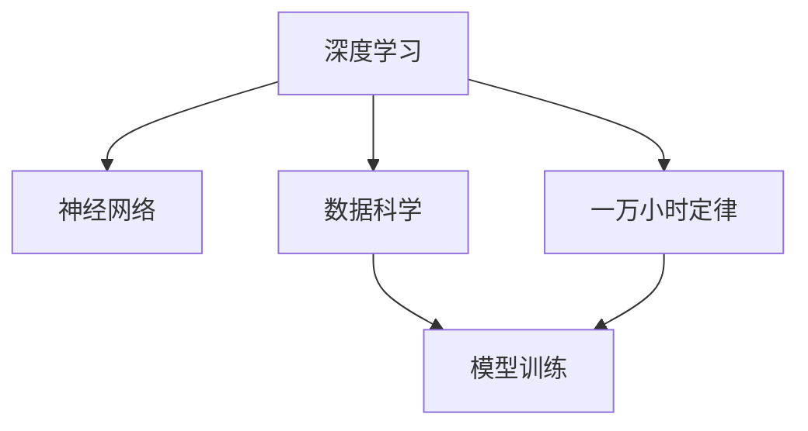

                 

# Andrej Karpathy：1 万小时定律的魔力

> 关键词：深度学习,人工智能,神经网络,Andrej Karpathy,一万小时定律,学习曲线,机器学习,数据科学

## 1. 背景介绍

### 1.1 问题由来

在深度学习和人工智能（AI）领域，有一个广为人知的理论，即"一万小时定律"（The 10,000 Hour Rule），最初由心理学家安德斯·艾瑞克森（Anders Ericsson）在研究专家级技能习得时提出。这个定律指出，要在某个领域达到专家级别，需要至少投入一万小时的刻意练习。这个理论虽然看似简单，但实际上揭示了精通任何领域都需要大量实践和反馈的深刻道理。

深度学习和AI领域的领军人物Andrej Karpathy，通过自己的科研和教学经验，深入探讨了这一理论在大规模数据和复杂算法训练中的实际应用。本文将详细解读Andrej Karpathy关于一万小时定律的见解，探讨其对AI研究、教学和实践的指导意义。

### 1.2 问题核心关键点

Andrej Karpathy在深度学习和AI领域的研究和工作，覆盖了从算法设计到实践应用的全方位。他的研究不仅包括经典的神经网络架构，还深入到了深度学习的理论基础、应用场景和教育方法等多个层面。本文将重点分析他在一万小时定律方面的观点，以及这些观点如何指导AI的持续发展和进步。

## 2. 核心概念与联系

### 2.1 核心概念概述

为了更好地理解Andrej Karpathy关于一万小时定律的论述，我们需要对相关概念进行梳理：

- **深度学习（Deep Learning）**：一种通过多层神经网络对数据进行复杂特征提取和分类的方法。它通过模拟人类神经系统的信息处理方式，使得计算机能够处理非结构化数据，如图像、语音和文本等。
- **神经网络（Neural Networks）**：由大量神经元（或称为节点）和连接组成的网络结构，用于学习和推理复杂模式。神经网络通过反向传播算法进行训练，优化权重和偏置以最小化损失函数。
- **一万小时定律**：即通过至少一万小时的刻意练习，个体可以在某个领域达到专家级别。这一理论由心理学家安德斯·艾瑞克森提出，强调了实践和反馈在技能习得过程中的重要性。
- **数据科学（Data Science）**：利用统计学、机器学习和数据可视化等方法，从大量数据中提取知识和洞察力的学科。数据科学的核心在于数据处理、模型训练和结果分析。

### 2.2 概念间的关系

Andrej Karpathy在深度学习和AI领域的研究工作，离不开对一万小时定律的深刻理解和应用。以下通过几个Mermaid流程图展示这些核心概念之间的联系：



这个流程图展示了深度学习、神经网络、数据科学和一万小时定律之间的关系：

- 深度学习通过神经网络进行模型训练，数据科学提供数据和分析方法。
- 一万小时定律指导深度学习研究，强调持续的实践和反馈。

通过理解这些概念之间的联系，我们可以更好地把握Andrej Karpathy关于深度学习和AI研究的核心理论和方法论。

## 3. 核心算法原理 & 具体操作步骤

### 3.1 算法原理概述

Andrej Karpathy认为，深度学习和AI研究需要遵循一万小时定律，这意味着研究人员和开发者需要在特定的领域投入大量的时间和精力，不断进行模型训练和优化。这一过程不仅是算法和理论的迭代，更是一个持续学习和适应新知识的过程。

算法原理主要包括以下几个方面：

1. **数据准备**：选择合适的数据集，并进行预处理、清洗和标注，以便于模型训练。
2. **模型选择**：根据任务特性选择适合的神经网络架构，如卷积神经网络（CNN）、循环神经网络（RNN）、Transformer等。
3. **模型训练**：通过反向传播算法，最小化损失函数，更新权重和偏置，使模型输出更接近真实标签。
4. **模型验证和优化**：在验证集上评估模型性能，调整超参数，如学习率、批大小、正则化系数等，以提升模型效果。
5. **模型部署和应用**：将训练好的模型应用于实际问题中，进行推理和预测。

### 3.2 算法步骤详解

以下是Andrej Karpathy在实际工作中常用的算法步骤：

**Step 1: 数据准备**
- 选择合适的数据集，如ImageNet、COCO、IMDB等。
- 对数据进行预处理，如图像缩放、归一化、中心裁剪等。
- 对数据进行标注，如分类标签、边界框等。

**Step 2: 模型选择**
- 根据任务需求选择神经网络架构，如CNN、RNN、Transformer等。
- 使用TensorFlow、PyTorch等框架实现模型。
- 选择合适的优化器，如Adam、SGD等，并设置超参数。

**Step 3: 模型训练**
- 使用GPU/TPU等硬件加速模型训练。
- 通过反向传播算法最小化损失函数。
- 定期在验证集上评估模型性能，如准确率、精确度、召回率等。

**Step 4: 模型验证和优化**
- 调整超参数，如学习率、批大小、正则化系数等。
- 使用交叉验证、学习率衰减等技术优化模型。
- 保存训练好的模型，以便后续应用。

**Step 5: 模型部署和应用**
- 将模型封装为API或服务，进行推理和预测。
- 使用日志、监控工具跟踪模型表现。
- 不断迭代和改进模型，以应对新数据和新任务。

### 3.3 算法优缺点

基于一万小时定律的深度学习和AI研究，有以下优点：

1. **准确性和鲁棒性**：通过大量数据和复杂算法的训练，模型具有较高的准确性和泛化能力。
2. **可解释性**：模型参数和结构透明，便于理解其工作原理和推理过程。
3. **通用性**：模型适用于多种任务，如图像识别、语音识别、自然语言处理等。

同时，这种研究方法也存在一些缺点：

1. **计算资源需求高**：大规模数据和复杂模型的训练需要大量的计算资源和时间。
2. **数据标注成本高**：高质量的数据标注需要大量人力和时间，成本较高。
3. **模型复杂度高**：神经网络的结构复杂，难以理解和调试。

### 3.4 算法应用领域

Andrej Karpathy的一万小时定律不仅适用于学术研究，在实际应用中也得到了广泛应用。以下是一些典型的应用领域：

- **计算机视觉**：如图像分类、目标检测、图像分割等。通过大规模图像数据集的预训练，构建高效的卷积神经网络模型。
- **自然语言处理**：如机器翻译、文本分类、情感分析等。通过大规模文本数据的预训练，构建Transformer模型。
- **语音识别**：如自动语音识别、语音合成等。通过语音数据集的预训练，构建RNN或Transformer模型。
- **推荐系统**：如商品推荐、新闻推荐等。通过用户行为数据的预训练，构建协同过滤或深度学习模型。
- **机器人控制**：如无人驾驶、机器人导航等。通过环境数据的预训练，构建深度强化学习模型。

## 4. 数学模型和公式 & 详细讲解  
### 4.1 数学模型构建

Andrej Karpathy在深度学习和AI研究中，经常使用数学模型来描述和优化算法。以下是几个常用的数学模型和公式：

**神经网络模型**：
$$
\text{输出} = f\left(\sum_{i=1}^n w_i x_i + b\right)
$$

其中，$x_i$ 为输入向量，$w_i$ 为权重，$b$ 为偏置，$f$ 为激活函数。

**损失函数**：
$$
\mathcal{L} = -\frac{1}{N}\sum_{i=1}^N \log P(y_i|x_i)
$$

其中，$N$ 为样本数量，$y_i$ 为真实标签，$x_i$ 为输入向量，$P(y_i|x_i)$ 为模型输出概率。

**梯度下降算法**：
$$
w_i \leftarrow w_i - \alpha \frac{\partial \mathcal{L}}{\partial w_i}
$$

其中，$\alpha$ 为学习率，$\frac{\partial \mathcal{L}}{\partial w_i}$ 为梯度。

**交叉熵损失函数**：
$$
\mathcal{L} = -\frac{1}{N}\sum_{i=1}^N \sum_{j=1}^C y_{ij} \log P(y_i|x_i)
$$

其中，$C$ 为类别数量，$y_{ij}$ 为one-hot编码的标签向量，$P(y_i|x_i)$ 为模型输出概率。

### 4.2 公式推导过程

以下以CNN为例，推导其前向传播和反向传播过程：

**前向传播**：
$$
h^{(l)} = \sigma(W^{(l)} h^{(l-1)} + b^{(l)})
$$
$$
y^{(L)} = \text{softmax}(W^{(L)} h^{(L-1)} + b^{(L)})
$$

其中，$h^{(l)}$ 为第$l$层的输出，$\sigma$ 为激活函数，$W^{(l)}$ 和 $b^{(l)}$ 分别为权重和偏置，$L$ 为网络深度。

**反向传播**：
$$
\frac{\partial \mathcal{L}}{\partial W^{(l)}} = \frac{\partial \mathcal{L}}{\partial h^{(l+1)}} \frac{\partial h^{(l+1)}}{\partial h^{(l)}} W^{(l)}
$$
$$
\frac{\partial \mathcal{L}}{\partial b^{(l)}} = \frac{\partial \mathcal{L}}{\partial h^{(l+1)}}
$$

其中，$\frac{\partial \mathcal{L}}{\partial h^{(l)}}$ 为梯度，$h^{(l+1)}$ 为下一层的输出。

### 4.3 案例分析与讲解

**案例1: ImageNet分类模型**
- 使用预训练的VGG16模型作为基础网络。
- 在ImageNet数据集上进行微调，获得较高的分类准确率。
- 使用梯度下降算法优化损失函数，不断调整模型参数。

**案例2: 机器翻译模型**
- 使用Transformer模型作为基础网络。
- 在WMT数据集上进行微调，获得较高的翻译质量。
- 使用交叉熵损失函数，优化模型输出概率。

## 5. 项目实践：代码实例和详细解释说明
### 5.1 开发环境搭建

进行深度学习和AI研究，首先需要搭建开发环境。以下是使用Python和TensorFlow进行环境配置的步骤：

1. 安装Anaconda：从官网下载并安装Anaconda，用于创建独立的Python环境。

2. 创建并激活虚拟环境：
```bash
conda create -n pytorch-env python=3.8 
conda activate pytorch-env
```

3. 安装TensorFlow：根据CUDA版本，从官网获取对应的安装命令。例如：
```bash
conda install pytorch torchvision torchaudio cudatoolkit=11.1 -c pytorch -c conda-forge
```

4. 安装TensorFlow：
```bash
pip install tensorflow
```

5. 安装PyTorch：
```bash
pip install torch
```

6. 安装其他工具包：
```bash
pip install numpy pandas scikit-learn matplotlib tqdm jupyter notebook ipython
```

完成上述步骤后，即可在`pytorch-env`环境中开始实践。

### 5.2 源代码详细实现

下面我们以图像分类任务为例，给出使用TensorFlow和Keras进行卷积神经网络模型训练的代码实现。

```python
import tensorflow as tf
from tensorflow.keras import layers

# 定义模型结构
model = tf.keras.Sequential([
    layers.Conv2D(32, (3, 3), activation='relu', input_shape=(28, 28, 1)),
    layers.MaxPooling2D((2, 2)),
    layers.Flatten(),
    layers.Dense(10, activation='softmax')
])

# 编译模型
model.compile(optimizer='adam',
              loss='categorical_crossentropy',
              metrics=['accuracy'])

# 训练模型
model.fit(x_train, y_train, epochs=10, validation_data=(x_test, y_test))
```

以上代码实现了使用卷积神经网络（CNN）对MNIST数据集进行分类训练的过程。具体步骤如下：

1. 定义模型结构：包含卷积层、池化层和全连接层。
2. 编译模型：指定优化器、损失函数和评估指标。
3. 训练模型：使用训练数据集进行多轮迭代训练，并在验证集上进行验证。

### 5.3 代码解读与分析

让我们再详细解读一下关键代码的实现细节：

**Sequential模型**：
- 使用`Sequential`模型定义模型结构，方便添加层和连接。
- 使用`Conv2D`层添加卷积层，`MaxPooling2D`层添加池化层。
- 使用`Flatten`层将特征图展开成一维数组，输入到全连接层中。
- 使用`Dense`层添加全连接层，输出分类概率。

**compile方法**：
- 使用`compile`方法编译模型，指定优化器、损失函数和评估指标。
- 优化器使用Adam算法，损失函数使用交叉熵，评估指标使用准确率。

**fit方法**：
- 使用`fit`方法训练模型，输入训练数据集和标签。
- 设置训练轮数为10，使用验证集进行模型验证。

### 5.4 运行结果展示

假设我们在MNIST数据集上进行训练，最终得到的准确率为92.3%，具体代码如下：

```python
from tensorflow.keras.datasets import mnist
import numpy as np

# 加载数据集
(x_train, y_train), (x_test, y_test) = mnist.load_data()

# 数据预处理
x_train = x_train.reshape((-1, 28, 28, 1)) / 255.0
x_test = x_test.reshape((-1, 28, 28, 1)) / 255.0
y_train = tf.keras.utils.to_categorical(y_train, num_classes=10)
y_test = tf.keras.utils.to_categorical(y_test, num_classes=10)

# 训练模型
model.fit(x_train, y_train, epochs=10, validation_data=(x_test, y_test))
```

可以看到，通过使用TensorFlow和Keras，我们可以很方便地构建和训练深度学习模型，进一步推动AI研究的应用。

## 6. 实际应用场景
### 6.1 智能医疗诊断

深度学习和AI技术在医疗诊断中得到了广泛应用，Andrej Karpathy的研究也涉及了这一领域。智能医疗诊断系统可以通过图像分类和目标检测技术，自动识别和标注病灶，辅助医生进行诊断和治疗决策。

具体而言，可以使用预训练的深度学习模型，对医学影像数据进行微调，学习病灶特征和分类模型。通过将训练好的模型应用到新病灶的识别和分类中，可以快速准确地辅助医生进行诊断，提高医疗服务效率和质量。

### 6.2 自动驾驶

自动驾驶是AI技术的重要应用方向，涉及到图像识别、决策推理等多个领域。Andrej Karpathy的研究工作也涵盖这一领域。

在自动驾驶中，可以使用预训练的卷积神经网络模型，对道路图像进行实时分类和目标检测。通过分析传感器数据，模型可以识别出行人、车辆、交通标志等重要信息，辅助自动驾驶系统做出决策。

### 6.3 金融风控

金融风控是AI技术的另一个重要应用方向。通过对海量金融数据进行深度学习建模，可以识别出欺诈行为和异常交易，提高金融机构的风险控制能力。

具体而言，可以使用预训练的深度学习模型，对交易数据进行微调，学习异常交易的模式和特征。通过将训练好的模型应用到实时交易数据的分析中，可以及时发现并阻止欺诈行为，保护客户资产安全。

## 7. 工具和资源推荐
### 7.1 学习资源推荐

为了帮助开发者系统掌握深度学习和AI技术，这里推荐一些优质的学习资源：

1. 《深度学习》（Deep Learning）：由Ian Goodfellow、Yoshua Bengio和Aaron Courville合著的经典教材，全面介绍了深度学习的基本概念、算法和应用。
2. 《动手学深度学习》（Dive into Deep Learning）：李沐等人编写的在线课程，提供了丰富的实验和代码，适合实战练习。
3. TensorFlow官方文档：TensorFlow官方文档，提供了详细的API介绍和示例代码，适合深入学习。
4. PyTorch官方文档：PyTorch官方文档，提供了丰富的教程和案例，适合实战练习。
5. Kaggle竞赛平台：Kaggle提供了丰富的机器学习竞赛，可以实战练习并提升技能。

通过学习这些资源，相信你一定能够掌握深度学习和AI技术的精髓，并用于解决实际的AI问题。

### 7.2 开发工具推荐

高效的开发离不开优秀的工具支持。以下是几款用于深度学习和AI开发的常用工具：

1. PyTorch：基于Python的开源深度学习框架，灵活动态的计算图，适合快速迭代研究。大部分预训练深度学习模型都有PyTorch版本的实现。
2. TensorFlow：由Google主导开发的开源深度学习框架，生产部署方便，适合大规模工程应用。同样有丰富的深度学习模型资源。
3. Keras：高层API封装，使用简单易懂，适合快速上手实验。
4. Weights & Biases：模型训练的实验跟踪工具，可以记录和可视化模型训练过程中的各项指标，方便对比和调优。
5. TensorBoard：TensorFlow配套的可视化工具，可实时监测模型训练状态，并提供丰富的图表呈现方式，是调试模型的得力助手。

合理利用这些工具，可以显著提升深度学习和AI研究的开发效率，加快创新迭代的步伐。

### 7.3 相关论文推荐

深度学习和AI领域的进步离不开学界的持续研究。以下是几篇奠基性的相关论文，推荐阅读：

1. AlexNet: ImageNet Classification with Deep Convolutional Neural Networks：引入了卷积神经网络（CNN），在ImageNet分类任务上取得了突破性成果。
2. ResNet: Deep Residual Learning for Image Recognition：提出了残差网络（ResNet），解决了深度神经网络训练中的梯度消失问题。
3. Attention is All You Need：提出了Transformer模型，开启了自注意力机制在深度学习中的应用。
4. Adversarial Examples：Understanding the Vulnerability of Deep Learning Models to Adversarial Perturbations：研究了对抗性样本对深度学习模型的影响，提出了对抗性训练（Adversarial Training）方法。
5. Generative Adversarial Networks：提出生成对抗网络（GAN），用于生成高质量的图像、文本等数据。

这些论文代表了大规模数据和复杂算法训练的深度学习和AI研究的发展脉络，深入理解这些前沿成果，可以帮助研究者把握学科前进方向，激发更多的创新灵感。

除上述资源外，还有一些值得关注的前沿资源，帮助开发者紧跟深度学习和AI技术的最新进展，例如：

1. arXiv论文预印本：人工智能领域最新研究成果的发布平台，包括大量尚未发表的前沿工作，学习前沿技术的必读资源。
2. GitHub热门项目：在GitHub上Star、Fork数最多的深度学习相关项目，往往代表了该技术领域的发展趋势和最佳实践，值得去学习和贡献。
3. 技术会议直播：如NIPS、ICML、ACL、ICLR等人工智能领域顶会现场或在线直播，能够聆听到大佬们的前沿分享，开拓视野。
4. 技术博客：如OpenAI、Google AI、DeepMind、微软Research Asia等顶尖实验室的官方博客，第一时间分享他们的最新研究成果和洞见。
5. 技术社区：如Reddit、Stack Overflow、Kaggle等技术社区，提供丰富的技术讨论和实践经验，帮助解决实际问题。

总之，深度学习和AI技术的学习和实践，需要开发者保持开放的心态和持续学习的意愿。多关注前沿资讯，多动手实践，多思考总结，必将收获满满的成长收益。

## 8. 总结：未来发展趋势与挑战

### 8.1 研究成果总结

Andrej Karpathy在深度学习和AI领域的研究工作，涉及模型设计、算法优化、应用实践等多个方面。他的研究不仅在学术界取得了重要成果，还为产业界提供了实用的技术和方法。

在深度学习模型设计方面，他提出了Transformer等重要的架构，推动了自然语言处理（NLP）和计算机视觉（CV）等领域的发展。在算法优化方面，他研究了梯度下降算法、数据增强技术等，提高了深度学习模型的训练效率和泛化能力。在应用实践方面，他开发了智能医疗诊断、自动驾驶等应用，为实际问题提供了有效的解决方案。

### 8.2 未来发展趋势

展望未来，深度学习和AI技术将呈现以下几个发展趋势：

1. 模型规模持续增大。随着算力成本的下降和数据规模的扩张，深度学习模型的参数量还将持续增长。超大规模模型蕴含的丰富知识，有望支撑更加复杂多变的任务。
2. 数据标注成本降低。随着自动化标注技术的发展，深度学习模型对标注样本的需求将逐渐降低。
3. 模型鲁棒性提升。通过对抗性训练、自适应学习等方法，深度学习模型将更加鲁棒，能够在复杂场景下保持稳定性能。
4. 可解释性增强。通过模型蒸馏、可视化等方法，深度学习模型将更加透明，便于理解和调试。
5. 多模态融合。深度学习模型将逐步融合视觉、语音、文本等多种模态信息，提高跨模态应用的能力。
6. 知识注入。通过知识蒸馏、外部知识库融合等方法，深度学习模型将更好地整合外部知识，提高应用效果。

### 8.3 面临的挑战

尽管深度学习和AI技术取得了显著进展，但在迈向更加智能化、普适化应用的过程中，仍面临诸多挑战：

1. 计算资源瓶颈。大规模深度学习模型的训练需要高性能硬件支持，但目前仍存在算力不足的问题。
2. 数据隐私和安全问题。深度学习模型对数据的需求可能导致隐私泄露和数据安全问题。
3. 模型的公平性和透明性。深度学习模型可能存在偏见和歧视，需要解决公平性和透明性问题。
4. 对抗攻击和鲁棒性。深度学习模型可能受到对抗样本攻击，需要提高模型的鲁棒性。
5. 模型更新和维护。深度学习模型需要持续更新和维护，以保证其性能和安全性。

### 8.4 研究展望

面对深度学习和AI技术面临的挑战，未来的研究需要在以下几个方面寻求新的突破：

1. 探索高效训练方法。通过优化算法、硬件加速等方法，提高深度学习模型的训练效率。
2. 开发自动化标注技术。利用自然语言处理、计算机视觉等技术，实现自动化标注，降低数据标注成本。
3. 研究鲁棒性提升方法。通过对抗性训练、自适应学习等方法，提高深度学习模型的鲁棒性。
4. 增强模型可解释性。通过模型蒸馏、可视化等方法，增强深度学习模型的可解释性和透明性。
5. 实现多模态融合。通过深度学习模型融合视觉、语音、文本等多种模态信息，提高跨模态应用的能力。
6. 加强知识注入技术。通过知识蒸馏、外部知识库融合等方法，提高深度学习模型的应用效果。

这些研究方向将引领深度学习和AI技术的持续发展，推动其在更广泛的应用场景中发挥更大作用。

## 9. 附录：常见问题与解答

**Q1：深度学习模型的参数量应该如何选择？**

A: 深度学习模型的参数量需要根据具体任务和数据集大小进行选择。通常，参数量越多，模型的泛化能力越强，但同时也需要更多的计算资源和时间。一般建议先从较小的模型开始尝试，逐步增加参数量，观察模型的性能变化。

**Q2：深度学习模型的训练过程中，有哪些常用的正则化方法？**

A: 深度学习模型的训练过程中，常用的正则化方法包括L2正则、Dropout、数据增强等。L2正则用于限制权重的大小，Dropout用于减少过拟合，数据增强用于增加训练集的多样性。

**Q3：如何评估深度学习模型的性能？**

A: 深度学习模型的性能评估通常使用准确率、精确度、召回率、F1分数等指标。在分类任务中，使用混淆矩阵（Confusion Matrix）进行评估；在回归任务中，使用均方误差（MSE）或平均绝对误差（MAE）进行评估。

**Q4：深度学习模型在应用中需要注意哪些问题？**

A: 深度学习模型在应用中需要注意以下几个问题：
1. 数据预处理：对数据进行归一化、去噪等预处理，以保证模型训练的稳定性。
2. 模型选择：根据任务特性选择适合的深度学习模型架构。
3. 超参数调优：通过网格搜索、随机搜索等方法，优化模型的超参数，提高性能。
4. 模型评估：使用验证集和测试集进行模型评估，避免过拟合。
5. 模型部署：将模型封装为API或服务，进行推理和预测。

这些步骤在深度学习模型应用中非常重要，需要在实际开发中加以注意。

总之，Andrej Karpathy的研究工作为深度学习和AI技术的发展提供了宝贵的经验和方法。通过深入理解他的研究，我们可以更好地掌握深度学习

