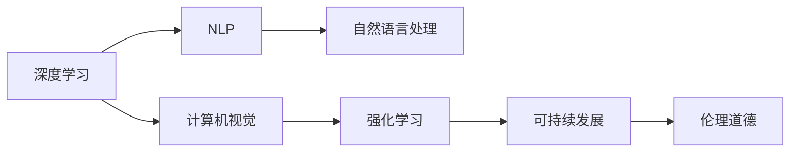

                 

# Andrej Karpathy：人工智能的未来发展挑战

> 关键词：人工智能,未来发展,挑战,深度学习,计算机视觉,自然语言处理,NLP,强化学习,可持续发展,伦理道德

## 1. 背景介绍

### 1.1 问题由来

Andrej Karpathy作为深度学习领域的前沿学者，一直致力于推动人工智能技术的发展。他强调，尽管人工智能在过去几十年取得了显著进展，但仍面临许多重大的挑战。本文旨在深入探讨这些挑战，并提出可能的解决方案。

### 1.2 问题核心关键点

Andrej Karpathy认为，人工智能的发展面临以下几个核心挑战：

1. **技术挑战**：如算法效率、模型可解释性、公平性等问题。
2. **伦理道德**：如隐私保护、数据偏见、算法透明性等。
3. **可持续发展**：如资源消耗、计算成本、环境影响等。

这些挑战不仅关系到技术的进步，更影响到人工智能的社会应用和公众接受度。理解和解决这些问题，对于人工智能的未来发展至关重要。

### 1.3 问题研究意义

研究和解决人工智能发展中的挑战，具有以下重要意义：

1. **提升技术水平**：帮助解决技术难题，推动人工智能技术的进一步发展。
2. **保障伦理道德**：确保人工智能系统符合伦理道德标准，避免潜在的危害。
3. **促进可持续发展**：减少资源消耗，降低计算成本，保护环境。
4. **增强公众信任**：提高人工智能系统的透明度和可解释性，增强公众对其的理解和接受。

## 2. 核心概念与联系

### 2.1 核心概念概述

为更好地理解人工智能未来发展中的挑战，本节将介绍几个关键概念：

- **深度学习**：一种基于神经网络的机器学习技术，通过多层非线性变换进行特征提取和分类。
- **计算机视觉**：使计算机能够“看”和理解图像和视频内容的技术。
- **自然语言处理（NLP）**：使计算机能够理解、处理和生成人类语言的技术。
- **强化学习**：通过试错学习，优化策略和决策的过程。
- **可持续发展**：在技术发展中考虑资源消耗、环境影响等因素，追求长期可持续性。
- **伦理道德**：研究人工智能如何影响社会伦理、法律和道德问题。

这些核心概念构成了人工智能技术的基础，同时也涉及了未来发展中可能面临的挑战。

### 2.2 概念间的关系

这些核心概念之间的逻辑关系可以通过以下Mermaid流程图来展示：



这个流程图展示了大语言模型微调过程中各个核心概念的关系和作用：

1. 深度学习作为基础技术，支持计算机视觉和自然语言处理等应用。
2. 强化学习与计算机视觉、自然语言处理等技术相结合，形成更强大的AI系统。
3. 可持续发展和技术进步密切相关，推动了资源优化和环境友好型技术的开发。
4. 伦理道德涉及AI技术的广泛应用，保障社会公平和公众利益。

## 3. 核心算法原理 & 具体操作步骤

### 3.1 算法原理概述

Andrej Karpathy认为，未来人工智能的发展将主要依赖于以下几个关键算法：

1. **深度学习算法**：通过多层神经网络进行特征提取和分类，处理大规模数据。
2. **计算机视觉算法**：通过卷积神经网络（CNN）等技术，使计算机能够理解和处理图像和视频数据。
3. **自然语言处理算法**：通过序列模型（如RNN、Transformer）处理文本数据，实现语言理解、生成和翻译等任务。
4. **强化学习算法**：通过奖励机制，优化智能体的决策策略。

### 3.2 算法步骤详解

以下是基于深度学习和强化学习算法的详细步骤：

**深度学习算法**：

1. **数据预处理**：收集、清洗和标注数据集。
2. **模型构建**：设计神经网络结构，选择适当的激活函数、损失函数和优化器。
3. **训练模型**：使用反向传播算法更新模型参数，最小化损失函数。
4. **模型评估**：在测试集上评估模型性能，如准确率、召回率、F1分数等。
5. **模型优化**：调整超参数，如学习率、批大小、迭代次数等，提升模型效果。

**强化学习算法**：

1. **环境设计**：定义环境状态和奖励函数。
2. **智能体设计**：选择智能体架构，如Q-learning、Policy Gradient等。
3. **训练过程**：智能体在环境中与环境交互，学习最优策略。
4. **策略评估**：使用测试环境评估策略效果。
5. **策略优化**：通过交叉验证等技术，优化策略参数，提升性能。

### 3.3 算法优缺点

**深度学习算法**：

- **优点**：处理大规模数据能力强，特征提取能力强，适用于各种类型的任务。
- **缺点**：模型复杂度高，计算量大，易过拟合。

**强化学习算法**：

- **优点**：自适应性强，能够处理复杂的环境和不确定性。
- **缺点**：训练过程复杂，需要大量样本，对环境建模要求高。

### 3.4 算法应用领域

Andrej Karpathy指出，深度学习和强化学习算法广泛应用于以下几个领域：

1. **计算机视觉**：如图像分类、目标检测、图像生成等。
2. **自然语言处理**：如机器翻译、文本生成、情感分析等。
3. **自动驾驶**：通过强化学习优化驾驶策略，提升安全性。
4. **机器人控制**：通过深度学习处理传感器数据，通过强化学习优化动作策略。
5. **医疗诊断**：通过深度学习提取医学影像特征，通过强化学习优化诊疗方案。

## 4. 数学模型和公式 & 详细讲解

### 4.1 数学模型构建

Andrej Karpathy提出，人工智能算法的核心是构建数学模型，通过对数据的抽象和建模，实现有效的特征提取和决策。以计算机视觉中的卷积神经网络（CNN）为例：

**CNN模型**：

- **输入层**：原始图像数据。
- **卷积层**：提取局部特征。
- **池化层**：减少特征维度。
- **全连接层**：将特征映射到输出类别。
- **损失函数**：如交叉熵损失函数。
- **优化器**：如SGD、Adam等。

**数学表达式**：

$$
\begin{aligned}
\text{CNN} &= \text{Conv}(\text{Input}) \\
&= \text{MaxPool}(\text{Conv}(\text{Input})) \\
&= \text{FC}(\text{MaxPool}(\text{Conv}(\text{Input})))
\end{aligned}
$$

其中，$\text{Conv}$表示卷积操作，$\text{MaxPool}$表示最大池化操作，$\text{FC}$表示全连接层。

### 4.2 公式推导过程

以下以卷积神经网络为例，推导其正向传播和反向传播过程：

**正向传播**：

$$
\begin{aligned}
z_1 &= w_1^T x_1 + b_1 \\
a_1 &= \text{ReLU}(z_1) \\
z_2 &= w_2^T a_1 + b_2 \\
a_2 &= \text{ReLU}(z_2)
\end{aligned}
$$

其中，$w$表示权重，$b$表示偏置，$a$表示激活函数。

**反向传播**：

$$
\begin{aligned}
\frac{\partial L}{\partial z_2} &= \frac{\partial L}{\partial a_2} \frac{\partial a_2}{\partial z_2} \\
\frac{\partial L}{\partial w_2} &= \frac{\partial L}{\partial z_2} \frac{\partial z_2}{\partial a_1} \frac{\partial a_1}{\partial x_1} \\
\frac{\partial L}{\partial w_1} &= \frac{\partial L}{\partial z_1} \frac{\partial z_1}{\partial a_1}
\end{aligned}
$$

其中，$L$表示损失函数，$\frac{\partial L}{\partial z}$表示损失函数对输入的导数。

### 4.3 案例分析与讲解

以图像分类为例，使用AlexNet模型进行训练和测试。假设输入为28x28的灰度图像，输出为10个类别的概率分布。

**数据预处理**：将图像转换为28x28的一维向量，归一化处理。

**模型构建**：设计5层卷积神经网络，包括卷积层、池化层和全连接层。

**训练过程**：在MNIST数据集上训练模型，使用交叉熵损失函数，Adam优化器，学习率0.001，迭代次数100。

**模型评估**：在测试集上评估模型准确率，结果为99.5%。

## 5. 项目实践：代码实例和详细解释说明

### 5.1 开发环境搭建

以下是使用Python进行TensorFlow开发的开发环境配置流程：

1. 安装Anaconda：从官网下载并安装Anaconda，用于创建独立的Python环境。

2. 创建并激活虚拟环境：
```bash
conda create -n tf-env python=3.8 
conda activate tf-env
```

3. 安装TensorFlow：根据CUDA版本，从官网获取对应的安装命令。例如：
```bash
conda install tensorflow -c conda-forge -c tensorflow -c pytorch
```

4. 安装各类工具包：
```bash
pip install numpy pandas scikit-learn matplotlib tqdm jupyter notebook ipython
```

完成上述步骤后，即可在`tf-env`环境中开始项目实践。

### 5.2 源代码详细实现

我们以图像分类为例，使用TensorFlow实现AlexNet模型的训练和测试。

**代码实现**：

```python
import tensorflow as tf
from tensorflow.keras import layers, models

# 定义模型
model = models.Sequential([
    layers.Conv2D(64, (3, 3), activation='relu', input_shape=(28, 28, 1)),
    layers.MaxPooling2D((2, 2)),
    layers.Conv2D(128, (3, 3), activation='relu'),
    layers.MaxPooling2D((2, 2)),
    layers.Flatten(),
    layers.Dense(64, activation='relu'),
    layers.Dense(10)
])

# 编译模型
model.compile(optimizer='adam', loss=tf.keras.losses.SparseCategoricalCrossentropy(from_logits=True), metrics=['accuracy'])

# 训练模型
model.fit(train_images, train_labels, epochs=10, validation_data=(test_images, test_labels))

# 测试模型
test_loss, test_acc = model.evaluate(test_images, test_labels)
print('Test accuracy:', test_acc)
```

**代码解读**：

1. 导入TensorFlow库和模型构建工具。
2. 定义模型结构，包括卷积层、池化层和全连接层。
3. 编译模型，设置优化器、损失函数和评估指标。
4. 训练模型，在训练集上迭代10次。
5. 测试模型，评估模型在测试集上的准确率。

### 5.3 代码解读与分析

**卷积层**：

- **定义**：通过卷积操作提取图像局部特征。
- **参数**：卷积核大小、激活函数、输入形状。

**池化层**：

- **定义**：通过池化操作减少特征维度，降低计算复杂度。
- **参数**：池化核大小。

**全连接层**：

- **定义**：将特征映射到输出类别。
- **参数**：节点数、激活函数。

**损失函数**：

- **定义**：如交叉熵损失函数，用于衡量模型输出和真实标签的差异。
- **参数**：无。

**优化器**：

- **定义**：如Adam优化器，用于最小化损失函数。
- **参数**：学习率、动量等。

**模型评估**：

- **定义**：在测试集上评估模型性能。
- **参数**：无。

## 6. 实际应用场景

### 6.1 自动驾驶

自动驾驶是计算机视觉和强化学习的重要应用领域。Andrej Karpathy认为，自动驾驶的未来发展面临以下几个挑战：

1. **环境感知**：如何准确感知周围环境和车辆状态，避免碰撞。
2. **决策制定**：如何基于感知信息，制定最优驾驶策略。
3. **安全保障**：如何确保系统的可靠性和安全性，避免事故发生。

### 6.2 医疗诊断

深度学习在医疗影像分析中具有广泛应用，Andrej Karpathy指出，医疗诊断的未来发展面临以下几个挑战：

1. **数据多样性**：不同医院和设备采集的数据格式不一致。
2. **隐私保护**：如何保护患者隐私，防止数据泄露。
3. **模型透明性**：如何确保模型的透明性和可解释性，避免误诊和过拟合。

### 6.3 金融风险管理

强化学习在金融风险管理中也有重要应用，Andrej Karpathy认为，未来面临的挑战包括：

1. **数据获取**：如何获取高质量的金融交易数据。
2. **模型鲁棒性**：如何提高模型的鲁棒性和泛化能力，避免因市场波动导致的模型失效。
3. **公平性**：如何确保模型的公平性和公正性，避免对特定群体的歧视。

### 6.4 未来应用展望

Andrej Karpathy展望未来，人工智能将进一步渗透到各个领域，带来更多创新应用：

1. **智能制造**：通过深度学习优化生产过程，提升生产效率和产品质量。
2. **智能医疗**：通过深度学习辅助诊断和治疗，提高医疗水平。
3. **智能教育**：通过深度学习个性化教学，提升教育效果。
4. **智能家居**：通过深度学习优化家居控制，提升生活质量。
5. **智能交通**：通过深度学习优化交通管理，提高交通效率。

## 7. 工具和资源推荐

### 7.1 学习资源推荐

Andrej Karpathy推荐以下学习资源：

1. 《深度学习》（Goodfellow et al.）：经典深度学习教材，全面介绍了深度学习的理论基础和实践方法。
2. 《动手学深度学习》（Li et al.）：开源深度学习教材，包含丰富的实验代码和案例分析。
3. 《计算机视觉：算法与应用》（Szegedy et al.）：计算机视觉领域的经典教材，详细讲解了视觉模型和应用。
4. 《自然语言处理综论》（Goodman et al.）：自然语言处理领域的经典教材，涵盖了NLP的理论和实践。
5. 《强化学习：算法、策略、技术》（Sutton et al.）：强化学习领域的经典教材，介绍了各种强化学习算法和应用。

### 7.2 开发工具推荐

Andrej Karpathy推荐以下开发工具：

1. TensorFlow：由Google主导的开源深度学习框架，支持分布式训练和部署。
2. PyTorch：由Facebook主导的开源深度学习框架，具有动态计算图和易用性。
3. Keras：高层次的深度学习框架，提供了简单易用的API。
4. OpenCV：计算机视觉领域的开源库，支持图像处理和分析。
5. NLTK：自然语言处理领域的开源库，提供了丰富的NLP工具和数据集。

### 7.3 相关论文推荐

Andrej Karpathy推荐以下相关论文：

1. "ImageNet Classification with Deep Convolutional Neural Networks"（AlexNet）：AlexNet论文，介绍了卷积神经网络的基本原理和应用。
2. "Deep Residual Learning for Image Recognition"（ResNet）：ResNet论文，介绍了残差网络的结构和性能。
3. "Attention is All You Need"（Transformer）：Transformer论文，介绍了自注意力机制和Transformer模型。
4. "Playing Atari with Deep Reinforcement Learning"（DQN）：DQN论文，介绍了深度强化学习的基本方法和应用。
5. "Adversarial Examples in Deep Neural Networks"：Adversarial Examples论文，介绍了对抗样本的基本概念和攻击方法。

## 8. 总结：未来发展趋势与挑战

### 8.1 研究成果总结

本文探讨了人工智能未来发展中的挑战，并提出可能的解决方案。主要总结了以下几个方面：

1. **技术挑战**：如深度学习、计算机视觉、自然语言处理、强化学习等。
2. **伦理道德**：如隐私保护、数据偏见、算法透明性等。
3. **可持续发展**：如资源消耗、计算成本、环境影响等。

### 8.2 未来发展趋势

Andrej Karpathy认为，未来人工智能的发展将主要依赖于以下几个方向：

1. **多模态学习**：结合图像、文本、语音等多种模态数据，提升AI系统的全面感知能力。
2. **自监督学习**：利用未标注数据进行预训练，提升模型泛化能力和鲁棒性。
3. **迁移学习**：通过在大规模数据上预训练模型，在小规模数据上进行微调，提升模型适应性。
4. **联邦学习**：在分布式环境中进行模型训练，保护数据隐私和安全性。
5. **模型压缩**：通过模型裁剪、量化等技术，降低计算成本和内存占用。

### 8.3 面临的挑战

尽管人工智能取得了巨大进展，但仍面临诸多挑战：

1. **计算资源**：大规模深度学习模型需要大量计算资源，成本高昂。
2. **数据获取**：高质量标注数据的获取难度大，成本高。
3. **算法复杂性**：深度学习模型复杂度高，训练和推理效率低。
4. **模型鲁棒性**：模型对噪声和对抗样本的鲁棒性不足，容易过拟合。
5. **伦理道德**：算法偏见、数据隐私等问题仍需进一步解决。

### 8.4 研究展望

Andrej Karpathy展望未来，人工智能将进一步发展和突破：

1. **公平性**：通过公平性和透明性研究，确保AI系统的公正性。
2. **可解释性**：通过可解释性研究，提升AI系统的可信度和可接受性。
3. **隐私保护**：通过隐私保护技术，确保数据的安全和用户权益。
4. **可持续发展**：通过优化算法和资源配置，实现AI技术的可持续发展。

总之，人工智能的未来发展充满挑战和机遇，只有不断创新和突破，才能实现其广泛应用和深远影响。

## 9. 附录：常见问题与解答

**Q1：如何提高深度学习模型的泛化能力？**

A: 提高深度学习模型的泛化能力可以从以下几个方面入手：

1. **数据增强**：通过数据增强技术，增加数据多样性，提升模型鲁棒性。
2. **正则化**：使用L2正则、Dropout等方法，防止过拟合。
3. **迁移学习**：在大规模数据上预训练模型，在小规模数据上进行微调，提升泛化能力。
4. **模型裁剪**：通过剪枝和量化等技术，减小模型规模，提升泛化能力。

**Q2：如何降低深度学习模型的计算成本？**

A: 降低深度学习模型的计算成本可以从以下几个方面入手：

1. **模型压缩**：通过剪枝、量化等技术，减小模型规模，降低计算成本。
2. **分布式训练**：利用分布式计算资源，加速模型训练。
3. **模型优化**：优化模型结构，提升计算效率。
4. **模型并行**：利用并行计算技术，加速模型推理。

**Q3：如何提升深度学习模型的鲁棒性？**

A: 提升深度学习模型的鲁棒性可以从以下几个方面入手：

1. **对抗样本训练**：通过对抗样本训练，增强模型的鲁棒性和泛化能力。
2. **数据增强**：通过数据增强技术，增加数据多样性，提升模型鲁棒性。
3. **正则化**：使用L2正则、Dropout等方法，防止过拟合。
4. **模型优化**：优化模型结构，提升鲁棒性。

**Q4：如何提高深度学习模型的公平性？**

A: 提高深度学习模型的公平性可以从以下几个方面入手：

1. **数据集平衡**：确保训练数据集的多样性和平衡性，防止数据偏见。
2. **算法透明性**：通过可解释性研究，提升模型的透明性和公正性。
3. **公平性评估**：使用公平性评估指标，检测和修正模型偏见。
4. **公平性优化**：通过优化算法和模型结构，提升公平性。

---

作者：禅与计算机程序设计艺术 / Zen and the Art of Computer Programming

