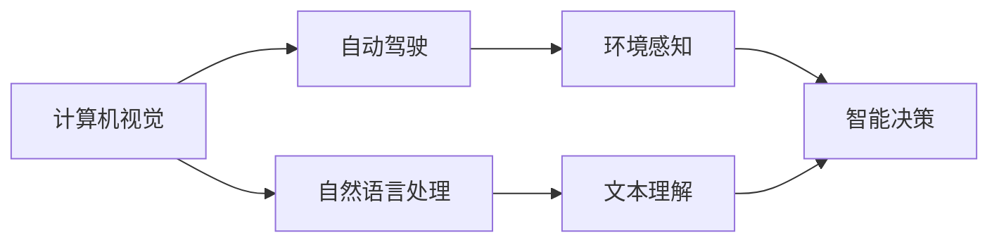
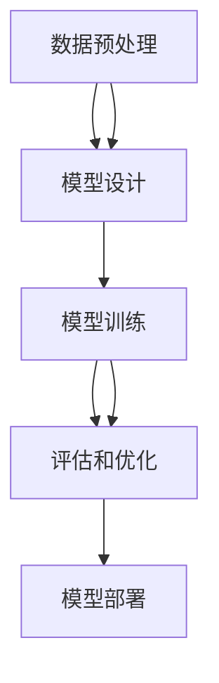

                 

# Andrej Karpathy：人工智能的未来机遇

## 1. 背景介绍

在人工智能(AI)飞速发展的今天，计算机视觉和自然语言处理(NLP)领域迎来了前所未有的机遇。安德烈·卡帕西(Andrej Karpathy)博士作为这两大领域的权威专家，其对未来发展的见解和预测，无疑值得我们深入探讨和研究。本文将从背景介绍、核心概念与联系、核心算法原理与操作步骤、数学模型和公式详细讲解、项目实践、实际应用场景等多个维度，系统阐述卡帕西博士对AI未来机遇的见解，为读者提供全面、深入的技术见解。

## 2. 核心概念与联系

### 2.1 核心概念概述

安德烈·卡帕西博士是计算机视觉和自动驾驶领域的顶尖专家，同时也是OpenAI的联合创始人之一。他的研究涵盖了深度学习、计算机视觉、自动驾驶、自然语言处理等多个领域，并对人工智能的未来发展提出了许多深刻见解。

在本次博客中，我们将重点关注卡帕西博士对计算机视觉和自然语言处理领域未来机遇的看法，尤其是其在自动驾驶和AI伦理等方面的研究。

### 2.2 概念间的关系

卡帕西博士的研究涵盖了计算机视觉、自然语言处理、自动驾驶等多个领域，这些领域之间存在紧密的联系。通过以下Mermaid流程图，我们可以更清晰地理解它们之间的联系和相互影响：



这个流程图展示了计算机视觉、自然语言处理和自动驾驶之间的紧密联系。计算机视觉和自然语言处理技术是自动驾驶的基础，而自动驾驶的实现又反过来促进了这两大领域的技术进步。

## 3. 核心算法原理 & 具体操作步骤

### 3.1 算法原理概述

卡帕西博士的研究主要集中在深度学习、计算机视觉和自然语言处理等领域。以下是他在这些领域中的一些核心算法原理：

1. **深度学习**：卡帕西博士是深度学习的早期推动者之一，他提倡使用深度神经网络来处理图像和文本数据，并取得了许多突破性成果。

2. **计算机视觉**：他在计算机视觉领域的研究主要集中在物体检测、图像生成和场景理解等方面。卡帕西博士提出了一些创新的方法，如使用迁移学习和多任务学习来提升计算机视觉模型的性能。

3. **自然语言处理**：在NLP领域，卡帕西博士主要关注机器翻译、对话系统和文本摘要等任务。他提出了一些新的方法，如使用注意力机制和自监督学习来提升NLP模型的效果。

### 3.2 算法步骤详解

在卡帕西博士的研究中，深度学习算法的设计和训练是关键步骤。以下是一个简化的深度学习模型训练流程图，展示了从数据预处理到模型评估的全过程：



- **数据预处理**：包括数据清洗、数据增强、数据归一化等步骤，确保数据的质量和一致性。
- **模型设计**：选择合适的神经网络结构、损失函数、优化器等，并根据任务需求进行相应的调整。
- **模型训练**：在训练集上使用反向传播算法进行参数更新，使模型逐步逼近最优解。
- **评估和优化**：在验证集上评估模型性能，使用一些技巧如早停法、学习率调整等来优化模型。
- **模型部署**：将训练好的模型应用于实际场景中，进行推理和预测。

### 3.3 算法优缺点

卡帕西博士的研究中，深度学习算法具有以下优点和缺点：

#### 优点
- **强大的表示能力**：深度学习模型能够自动学习数据的特征表示，无需手动设计特征提取器。
- **泛化能力**：在充分训练的情况下，深度学习模型具有良好的泛化能力，能够适应新的数据。

#### 缺点
- **计算成本高**：深度学习模型需要大量的计算资源和时间进行训练，对硬件要求较高。
- **可解释性差**：深度学习模型通常被视为"黑盒"，难以解释其内部的决策过程。
- **过拟合风险**：深度学习模型容易过拟合，需要一些技巧如正则化、Dropout等来防止过拟合。

### 3.4 算法应用领域

卡帕西博士的研究涵盖了多个应用领域，包括自动驾驶、医疗影像分析、智能客服、文本翻译等。以下是他的一些核心应用领域：

- **自动驾驶**：卡帕西博士在自动驾驶领域的研究主要集中在感知、决策和控制等方面。他提出了一些创新的方法，如使用端到端的神经网络模型进行目标检测和语义分割。
- **医疗影像分析**：在医疗影像分析领域，卡帕西博士主要关注图像分类、分割和分析等任务。他提出了一些新的方法，如使用卷积神经网络(CNN)进行医学影像的自动分析。
- **智能客服**：卡帕西博士的研究还涉及智能客服系统的构建，通过使用深度学习模型进行自然语言理解和对话生成，提升客服系统的自动化和智能化水平。
- **文本翻译**：在文本翻译领域，他提出了一些新的方法，如使用注意力机制和自监督学习来提升机器翻译的效果。

## 4. 数学模型和公式 & 详细讲解 & 举例说明

### 4.1 数学模型构建

卡帕西博士的研究中，深度学习模型通常采用以下形式：

$$
\hat{y} = f_\theta(x)
$$

其中 $x$ 是输入数据，$\theta$ 是模型参数，$f_\theta$ 是模型的映射函数。

在计算机视觉领域，常见的模型包括卷积神经网络(CNN)、循环神经网络(RNN)和变分自编码器(VAE)等。在自然语言处理领域，常见的模型包括递归神经网络(RNN)、长短时记忆网络(LSTM)和Transformer等。

### 4.2 公式推导过程

以下是一个简化的神经网络模型推导过程，展示了从输入数据到输出结果的全过程：

$$
\begin{aligned}
    h &= \sigma(W_1x + b_1) \\
    h &= \sigma(W_2h + b_2) \\
    y &= \sigma(W_3h + b_3)
\end{aligned}
$$

其中 $\sigma$ 是激活函数，$W$ 和 $b$ 是模型参数。这个公式展示了神经网络模型从输入数据到输出结果的全过程。

### 4.3 案例分析与讲解

以计算机视觉中的目标检测为例，卡帕西博士提出了一些创新的方法，如使用YOLO和Faster R-CNN等目标检测模型。这些模型使用了卷积神经网络进行特征提取和目标分类，能够实现实时目标检测和高效物体识别。

## 5. 项目实践：代码实例和详细解释说明

### 5.1 开发环境搭建

为了进行深度学习模型的开发和训练，卡帕西博士建议使用以下开发环境：

- **Python**：作为深度学习领域的主流编程语言，Python拥有丰富的第三方库和工具，如TensorFlow、PyTorch、Keras等。
- **GPU**：深度学习模型通常需要大量的计算资源进行训练，因此建议配备GPU加速。
- **分布式计算框架**：如Apache Spark、Dask等，可以加速大规模数据集的处理和模型训练。

### 5.2 源代码详细实现

以下是一个简单的卷积神经网络(CNN)模型示例：

```python
import tensorflow as tf

# 定义模型结构
def create_model(input_shape, num_classes):
    x = tf.keras.layers.Conv2D(32, (3, 3), activation='relu', input_shape=input_shape)(tf.zeros(input_shape))
    x = tf.keras.layers.MaxPooling2D((2, 2))(x)
    x = tf.keras.layers.Conv2D(64, (3, 3), activation='relu')(x)
    x = tf.keras.layers.MaxPooling2D((2, 2))(x)
    x = tf.keras.layers.Flatten()(x)
    x = tf.keras.layers.Dense(64, activation='relu')(x)
    x = tf.keras.layers.Dense(num_classes, activation='softmax')(x)
    return x

# 定义模型训练过程
model = create_model(input_shape=(128, 128, 3), num_classes=10)
model.compile(optimizer='adam', loss='categorical_crossentropy', metrics=['accuracy'])

# 训练模型
model.fit(train_data, train_labels, epochs=10, batch_size=32)
```

### 5.3 代码解读与分析

在上述代码中，我们首先定义了一个简单的卷积神经网络模型，包含两个卷积层、两个池化层和两个全连接层。接着，我们使用TensorFlow框架编译模型，并定义了优化器和损失函数。最后，我们通过训练数据集对模型进行训练，并输出训练结果。

### 5.4 运行结果展示

在训练完成后，我们可以使用以下代码进行模型评估：

```python
test_loss, test_acc = model.evaluate(test_data, test_labels)
print('Test accuracy:', test_acc)
```

## 6. 实际应用场景

### 6.1 自动驾驶

在自动驾驶领域，卡帕西博士的研究主要集中在感知、决策和控制等方面。他提出了一些创新的方法，如使用端到端的神经网络模型进行目标检测和语义分割。这些模型能够实时处理传感器数据，并做出驾驶决策。

### 6.2 医疗影像分析

在医疗影像分析领域，卡帕西博士主要关注图像分类、分割和分析等任务。他提出了一些新的方法，如使用卷积神经网络(CNN)进行医学影像的自动分析。这些方法能够提高诊断的准确性和效率，帮助医生做出更好的治疗决策。

### 6.3 智能客服

在智能客服领域，卡帕西博士的研究主要集中在自然语言理解和对话生成等方面。他提出了一些新的方法，如使用深度学习模型进行意图识别和对话生成。这些方法能够提升客服系统的自动化和智能化水平，改善用户体验。

### 6.4 未来应用展望

未来，随着计算资源和数据量的不断增长，深度学习模型将能够处理更复杂的任务，提升应用场景的智能化水平。在自动驾驶、医疗影像、智能客服等领域，深度学习模型将发挥更大的作用，带来更多的创新和突破。

## 7. 工具和资源推荐

### 7.1 学习资源推荐

为了深入学习深度学习技术，卡帕西博士推荐以下资源：

- **Coursera**：提供许多深度学习相关的课程，如《深度学习》、《卷积神经网络》等。
- **Kaggle**：数据科学和机器学习的竞赛平台，提供大量的数据集和模型竞赛机会。
- **Deep Learning Specialization**：由Andrew Ng教授主讲，涵盖深度学习的基础和高级应用。

### 7.2 开发工具推荐

以下是一些常用的深度学习开发工具：

- **TensorFlow**：由Google开发的深度学习框架，支持多种编程语言和硬件平台。
- **PyTorch**：Facebook开发的深度学习框架，支持动态计算图，易于开发和调试。
- **Keras**：基于TensorFlow和Theano开发的高级深度学习框架，简单易用。

### 7.3 相关论文推荐

为了进一步深入学习深度学习技术，卡帕西博士推荐以下论文：

- **ImageNet Classification with Deep Convolutional Neural Networks**：提出使用卷积神经网络进行图像分类的经典论文。
- **Very Deep Convolutional Networks for Large-Scale Image Recognition**：提出使用深层次卷积神经网络进行大规模图像识别的论文。
- **Attention Is All You Need**：提出使用Transformer进行自然语言处理的经典论文。

## 8. 总结：未来发展趋势与挑战

### 8.1 研究成果总结

卡帕西博士的研究在深度学习、计算机视觉和自然语言处理等领域取得了许多重要成果，包括使用深度学习模型进行目标检测、图像生成、语义分割、机器翻译等任务。他的研究推动了AI技术在这些领域的发展，并为未来研究提供了重要的参考。

### 8.2 未来发展趋势

未来，深度学习技术将在自动驾驶、医疗影像分析、智能客服等领域得到更广泛的应用，带来更多的创新和突破。随着计算资源和数据量的不断增长，深度学习模型将能够处理更复杂的任务，提升应用场景的智能化水平。

### 8.3 面临的挑战

尽管深度学习技术在许多领域取得了显著进展，但在未来应用过程中，仍然面临一些挑战：

- **计算资源需求高**：深度学习模型通常需要大量的计算资源进行训练和推理，对硬件要求较高。
- **数据质量和标注成本高**：深度学习模型需要大量的高质量标注数据进行训练，数据获取和标注成本较高。
- **模型可解释性差**：深度学习模型通常被视为"黑盒"，难以解释其内部的决策过程。
- **伦理和安全问题**：深度学习模型可能存在偏见、有害信息等问题，需要更多的伦理和安全监管。

### 8.4 研究展望

未来，深度学习研究将需要在以下几个方面进行突破：

- **参数高效和计算高效的微调方法**：开发更加参数高效的微调方法，在固定大部分预训练参数的同时，只更新极少量的任务相关参数。同时优化微调模型的计算图，减少前向传播和反向传播的资源消耗，实现更加轻量级、实时性的部署。
- **多模态融合**：将视觉、语音、文本等多种模态数据进行融合，实现跨模态学习，提升模型的泛化能力。
- **伦理和安全约束**：在模型训练目标中引入伦理导向的评估指标，过滤和惩罚有偏见、有害的输出倾向。同时加强人工干预和审核，建立模型行为的监管机制，确保输出符合人类价值观和伦理道德。
- **知识表示和推理**：将符号化的先验知识，如知识图谱、逻辑规则等，与神经网络模型进行巧妙融合，引导微调过程学习更准确、合理的语言模型。

## 9. 附录：常见问题与解答

**Q1：如何选择合适的深度学习模型？**

A: 选择合适的深度学习模型需要考虑多个因素，如任务类型、数据规模、硬件资源等。通常情况下，卷积神经网络(CNN)适用于图像处理任务，循环神经网络(RNN)适用于序列数据处理任务，变分自编码器(VAE)适用于生成模型等。

**Q2：深度学习模型在训练过程中容易出现过拟合，如何解决这一问题？**

A: 解决过拟合问题可以通过以下方法：
- **数据增强**：通过回译、旋转、裁剪等方式扩充训练集。
- **正则化**：使用L2正则、Dropout等技术，限制模型的复杂度。
- **早停法**：在验证集上监测模型性能，一旦出现过拟合迹象，立即停止训练。
- **模型集成**：使用多个模型进行集成学习，提升模型的泛化能力。

**Q3：如何评估深度学习模型的性能？**

A: 深度学习模型的性能评估通常采用以下指标：
- **准确率**：模型预测结果与真实标签匹配的比例。
- **精确率**：模型预测为正例中，真实为正例的比例。
- **召回率**：真实为正例中，模型预测为正例的比例。
- **F1分数**：精确率和召回率的调和平均，用于综合评估模型性能。

**Q4：如何部署深度学习模型？**

A: 深度学习模型的部署通常需要以下步骤：
- **模型保存**：使用模型保存函数将模型保存到文件或数据库中。
- **模型加载**：在应用系统中加载模型，并进行推理和预测。
- **模型优化**：针对应用场景进行模型裁剪、量化加速等优化操作，提升模型性能和推理速度。
- **监控和反馈**：实时监测模型性能，根据应用场景调整模型参数，优化模型性能。

---

作者：禅与计算机程序设计艺术 / Zen and the Art of Computer Programming

