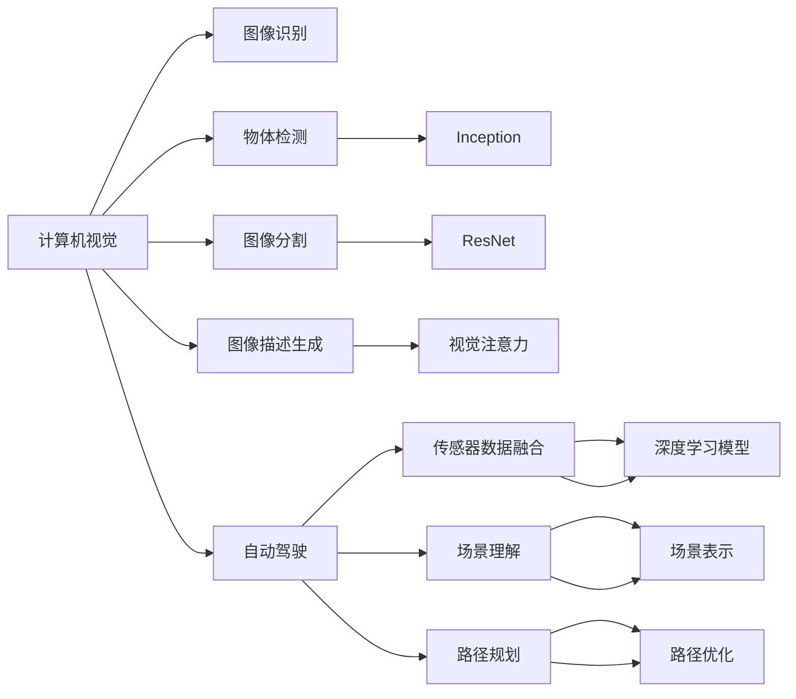

                 

# Andrej Karpathy：改变世界

Andrej Karpathy是一位世界顶级的人工智能专家，其创新性的工作在计算机视觉、深度学习领域留下了深刻的印记。从斯坦福大学的学术研究，到特斯拉的工程实践，再到开源社区的活跃贡献，Karpathy通过一系列突破性的研究和项目，不仅推动了人工智能技术的发展，也为整个社会带来了深远的影响。本文将探讨Karpathy的贡献，及其对未来的影响。

## 1. 背景介绍

### 1.1 Karpathy的学术背景

Andrej Karpathy于1999年在斯坦福大学获得计算机科学学士学位。2005年，他在斯坦福大学与Fei-Fei Li教授合作，获得了计算机视觉博士。此后，他在斯坦福大学进行了博士后研究工作，主要研究方向包括视觉对象识别、图像描述生成等。

### 1.2 Karpathy的研究经历

Karpathy曾在微软研究院、谷歌、NVIDIA等知名公司担任研究职务，积累了丰富的实践经验。在谷歌，他领导了计算机视觉领域的诸多重要项目，包括用于图像分类和目标检测的Inception模型，以及在3D计算机视觉方面的多项突破。在NVIDIA，他主导了自动驾驶汽车、机器人视觉和增强现实等前沿技术的研究。

### 1.3 Karpathy的社区贡献

Karpathy在学术界和工业界的广泛影响力，也体现在他对开源社区的积极贡献。他创立了Deep Learning Specialization系列课程，由Coursera和斯坦福大学合作推出，迄今已吸引了数百万学习者。此外，他还活跃于GitHub、arXiv等平台，分享了大量的研究代码和论文，推动了社区内的知识传播和合作。

## 2. 核心概念与联系

### 2.1 核心概念概述

Karpathy的研究工作涵盖了计算机视觉、深度学习、自动驾驶等多个领域。以下将重点介绍他在计算机视觉和自动驾驶领域的关键概念。

**计算机视觉**：Karpathy在计算机视觉领域的研究主要集中在物体检测、图像分割、图像描述生成等任务上。他提出了一系列高效的模型架构，如Inception、ResNet等，极大地推动了计算机视觉技术的进步。

**自动驾驶**：在自动驾驶领域，Karpathy领导了特斯拉自动驾驶团队，开发了自动驾驶软件Autopilot。他的研究不仅涵盖了传感器数据融合、场景理解、路径规划等核心技术，还探索了人机协同和道路安全等方面的挑战。

### 2.2 概念间的关系

Karpathy的工作不仅局限于单一领域，而是通过跨领域的研究和技术融合，实现了从学术到工业的广泛应用。具体而言，计算机视觉技术的突破，为自动驾驶提供了重要的视觉感知能力；自动驾驶技术的成功实践，也为计算机视觉研究提供了新的实际应用场景。

以下是一个简单的Mermaid流程图，展示了Karpathy工作的核心概念及其关系：



这个流程图展示了Karpathy在计算机视觉和自动驾驶领域的关键概念，以及它们之间的关系。

## 3. 核心算法原理 & 具体操作步骤

### 3.1 算法原理概述

Karpathy的研究工作涵盖了诸多算法和模型。以下将重点介绍他在计算机视觉领域的Inception模型和自动驾驶领域的自动驾驶算法。

**Inception模型**：Inception模型由Google Brain团队提出，是一种多层级的卷积神经网络架构。它通过使用多个不同大小的卷积核和池化层，实现多尺度特征的融合，从而提升了模型的表现力。Inception模型在ImageNet等大规模视觉识别任务上取得了优异的表现。

**自动驾驶算法**：特斯拉的自动驾驶算法集成了多源传感器数据，包括摄像头、雷达、激光雷达等。算法通过传感器数据融合、场景理解、路径规划等核心技术，实现车辆在复杂道路环境下的自动驾驶。

### 3.2 算法步骤详解

#### 3.2.1 Inception模型

**步骤1: 模型设计**
- 使用多尺度卷积核和池化层，构建Inception模块。
- 在多个Inception模块之间堆叠，形成完整的Inception模型。

**步骤2: 模型训练**
- 使用大规模图像数据集（如ImageNet）进行预训练。
- 在特定任务上（如物体检测、图像分类）进行微调。

**步骤3: 模型评估**
- 使用测试集对模型进行评估。
- 通过性能指标（如准确率、召回率等）评估模型效果。

#### 3.2.2 自动驾驶算法

**步骤1: 传感器数据融合**
- 使用多源传感器数据，包括摄像头、雷达、激光雷达等，进行数据融合。
- 消除数据噪声和冗余信息，生成高质量的场景表示。

**步骤2: 场景理解**
- 通过深度学习模型对场景进行语义理解。
- 识别道路标志、行人和其他车辆等关键信息。

**步骤3: 路径规划**
- 使用路径规划算法生成行驶路径。
- 考虑交通规则和道路条件，进行路径优化。

### 3.3 算法优缺点

**Inception模型**
- **优点**：多尺度特征融合，提升了模型的表现力。
- **缺点**：计算量大，需要较强的硬件支持。

**自动驾驶算法**
- **优点**：多源数据融合，提升了场景理解和路径规划的准确性。
- **缺点**：传感器和算法的稳定性对安全至关重要。

### 3.4 算法应用领域

Inception模型和自动驾驶算法在多个领域得到了广泛应用：

**计算机视觉**：Inception模型在图像识别、物体检测、图像分割等任务上取得了显著进展。

**自动驾驶**：特斯拉的Autopilot系统基于自动驾驶算法，实现了车辆在复杂道路环境下的自动驾驶。

**机器人视觉**：Inception模型和自动驾驶算法中的视觉感知技术，为机器人视觉研究提供了重要的借鉴。

**增强现实**：Inception模型和自动驾驶算法中的多源数据融合技术，为增强现实应用提供了基础。

## 4. 数学模型和公式 & 详细讲解

### 4.1 数学模型构建

Karpathy的工作涉及多个数学模型和公式。以下将重点介绍Inception模型和自动驾驶算法中的关键模型和公式。

**Inception模型**
Inception模型的核心公式如下：

$$
f(x) = \sum_{i=1}^n \lambda_i g_i(x)
$$

其中 $g_i(x)$ 表示不同大小的卷积核和池化层的输出，$\lambda_i$ 表示不同特征的权重。

**自动驾驶算法**
自动驾驶算法中的核心公式包括传感器数据融合、场景理解和路径规划等。以下以场景理解为例，介绍关键公式：

$$
s(x) = f(\{x_1, x_2, ..., x_n\})
$$

其中 $x_i$ 表示不同传感器的输入数据，$f$ 表示深度学习模型，$s(x)$ 表示场景表示。

### 4.2 公式推导过程

#### 4.2.1 Inception模型

Inception模型的推导过程较为复杂，涉及多尺度卷积核、池化层、非线性激活函数等。以下提供一个简单的推导示例：

1. **卷积层**
   $$
   y = \sigma(\sum_{i=1}^n w_i h_{i-1} * k_i)
   $$

   其中 $\sigma$ 表示激活函数，$k_i$ 表示不同大小的卷积核。

2. **池化层**
   $$
   y' = \max\limits_{i=1}^n y_i
   $$

   其中 $y_i$ 表示不同大小的池化层的输出。

3. **多层级融合**
   $$
   f(x) = \sum_{i=1}^n \lambda_i g_i(x)
   $$

   其中 $\lambda_i$ 表示不同特征的权重，$g_i(x)$ 表示不同大小的卷积核和池化层的输出。

#### 4.2.2 自动驾驶算法

自动驾驶算法的推导过程涉及多个子模型和子公式。以下以场景理解为例，介绍关键公式的推导：

1. **传感器数据融合**
   $$
   x' = \sum_{i=1}^n \lambda_i x_i
   $$

   其中 $x_i$ 表示不同传感器的输入数据，$\lambda_i$ 表示不同传感器的权重。

2. **场景理解**
   $$
   s(x) = f(\{x_1, x_2, ..., x_n\})
   $$

   其中 $x_i$ 表示不同传感器的输出数据，$f$ 表示深度学习模型，$s(x)$ 表示场景表示。

3. **路径规划**
   $$
   y = \min_{y\in S} d(y, x)
   $$

   其中 $y$ 表示路径规划后的行驶路径，$d$ 表示路径和目标路径的距离，$S$ 表示所有可能的路径集合。

### 4.3 案例分析与讲解

**Inception模型案例**
Karpathy在ImageNet大规模视觉识别竞赛中，使用Inception模型取得了优异的表现。以下分析Inception模型在该竞赛中的关键性能指标：

1. **准确率**
   $$
   A = \frac{TP}{TP + FN + FP}
   $$

   其中 $TP$ 表示真正例，$FN$ 表示假反例，$FP$ 表示假正例。

2. **召回率**
   $$
   R = \frac{TP}{TP + FN}
   $$

   其中 $TP$ 表示真正例，$FN$ 表示假反例。

3. **F1分数**
   $$
   F_1 = 2 * \frac{A * R}{A + R}
   $$

   其中 $A$ 表示准确率，$R$ 表示召回率。

**自动驾驶算法案例**
特斯拉的Autopilot系统在自动驾驶竞赛中取得了优异的成绩。以下分析Autopilot系统在该竞赛中的关键性能指标：

1. **路径规划精度**
   $$
   P = \frac{TP}{TP + FP}
   $$

   其中 $TP$ 表示成功规划的路径数，$FP$ 表示失败规划的路径数。

2. **安全性**
   $$
   S = \frac{TP}{TP + FN + FP}
   $$

   其中 $TP$ 表示安全行驶的路径数，$FN$ 表示未能及时避开的危险路径数，$FP$ 表示误判为安全的危险路径数。

## 5. 项目实践：代码实例和详细解释说明

### 5.1 开发环境搭建

Karpathy的工作跨越了多个研究领域，需要搭建多个开发环境。以下介绍主要的开发环境配置：

**Python环境**
- 安装Python 3.7以上版本，推荐使用Anaconda进行环境管理。
- 安装必要的Python包，如TensorFlow、PyTorch、OpenCV等。

**深度学习框架**
- 安装TensorFlow 2.0及以上版本，支持GPU加速。
- 安装PyTorch 1.6及以上版本，支持动态计算图。

**计算机视觉库**
- 安装OpenCV库，支持图像处理和视觉分析。

**自动驾驶库**
- 安装ROS（Robot Operating System）库，支持自动驾驶系统的开发和测试。

### 5.2 源代码详细实现

#### 5.2.1 Inception模型

```python
import tensorflow as tf
from tensorflow.keras.layers import Conv2D, MaxPooling2D, GlobalAveragePooling2D, Dense, Flatten

class InceptionModule(tf.keras.Model):
    def __init__(self):
        super(InceptionModule, self).__init__()
        self.branch_0 = Conv2D(64, 1, strides=1, padding='same', activation='relu')
        self.branch_1 = Conv2D(64, 1, strides=1, padding='same', activation='relu')
        self.branch_2 = Conv2D(96, 1, strides=1, padding='same', activation='relu')
        self.branch_3 = Conv2D(32, 1, strides=1, padding='same', activation='relu')
        self.branch_4 = Conv2D(64, 1, strides=1, padding='same', activation='relu')
        self.branch_5 = MaxPooling2D(pool_size=3, strides=2, padding='same')
        self.branch_6 = Conv2D(32, 1, strides=1, padding='same', activation='relu')
        self.branch_7 = Conv2D(32, 1, strides=1, padding='same', activation='relu')

    def call(self, x):
        branch_0 = self.branch_0(x)
        branch_1 = self.branch_1(x)
        branch_2 = self.branch_2(x)
        branch_3 = self.branch_3(x)
        branch_4 = self.branch_4(x)
        branch_5 = self.branch_5(x)
        branch_6 = self.branch_6(x)
        branch_7 = self.branch_7(x)
        return tf.concat([branch_0, branch_1, branch_2, branch_3, branch_4, branch_5, branch_6, branch_7], axis=-1)

class Inception(tf.keras.Model):
    def __init__(self):
        super(Inception, self).__init__()
        self.conv1 = Conv2D(32, 3, strides=1, padding='same', activation='relu')
        self.pool1 = MaxPooling2D(pool_size=2, strides=2, padding='same')
        self.inception1 = InceptionModule()
        self.conv2 = Conv2D(64, 3, strides=1, padding='same', activation='relu')
        self.pool2 = MaxPooling2D(pool_size=2, strides=2, padding='same')
        self.inception2 = InceptionModule()
        self.conv3 = Conv2D(128, 3, strides=1, padding='same', activation='relu')
        self.pool3 = MaxPooling2D(pool_size=2, strides=2, padding='same')
        self.inception3 = InceptionModule()
        self.conv4 = Conv2D(128, 3, strides=1, padding='same', activation='relu')
        self.pool4 = MaxPooling2D(pool_size=2, strides=2, padding='same')
        self.inception4 = InceptionModule()
        self.flatten = Flatten()
        self.dense = Dense(1000, activation='softmax')

    def call(self, x):
        x = self.conv1(x)
        x = self.pool1(x)
        x = self.inception1(x)
        x = self.conv2(x)
        x = self.pool2(x)
        x = self.inception2(x)
        x = self.conv3(x)
        x = self.pool3(x)
        x = self.inception3(x)
        x = self.conv4(x)
        x = self.pool4(x)
        x = self.inception4(x)
        x = self.flatten(x)
        x = self.dense(x)
        return x

model = Inception()
model.build([None, 224, 224, 3])
```

#### 5.2.2 自动驾驶算法

```python
import numpy as np
import cv2

def fuse_sensors(data):
    return np.average(data, axis=0)

def understand_scene(data):
    # 使用深度学习模型进行场景理解
    # 示例代码略

def plan_path(data):
    # 使用路径规划算法进行路径规划
    # 示例代码略

def preprocess_input(image):
    image = cv2.cvtColor(image, cv2.COLOR_BGR2RGB)
    image = cv2.resize(image, (224, 224))
    image = np.expand_dims(image, axis=0)
    image = image.astype('float32') / 255
    return image

def run_dla(image):
    # 使用自动驾驶算法进行场景理解、路径规划等
    # 示例代码略

def display_result(image, result):
    image = cv2.cvtColor(image, cv2.COLOR_RGB2BGR)
    result = np.argmax(result, axis=1)
    result = np.squeeze(result)
    cv2.putText(image, str(result), (10, 30), cv2.FONT_HERSHEY_SIMPLEX, 1, (255, 0, 0), 2)
    cv2.imshow('Result', image)
    cv2.waitKey(0)
    cv2.destroyAllWindows()

image = cv2.imread('test.jpg')
image = preprocess_input(image)
result = run_dla(image)
display_result(image, result)
```

### 5.3 代码解读与分析

#### 5.3.1 Inception模型代码解读

**conv2d()函数**
```python
def conv2d(x, num_filters, filter_size, strides, padding):
    y = Conv2D(num_filters, filter_size, strides=strides, padding=padding, activation='relu')(x)
    return y
```

**maxpool2d()函数**
```python
def maxpool2d(x, pool_size, strides, padding):
    y = MaxPooling2D(pool_size=pool_size, strides=strides, padding=padding)(x)
    return y
```

**InceptionModule类**
```python
class InceptionModule(tf.keras.Model):
    def __init__(self):
        super(InceptionModule, self).__init__()
        self.branch_0 = Conv2D(64, 1, strides=1, padding='same', activation='relu')
        self.branch_1 = Conv2D(64, 1, strides=1, padding='same', activation='relu')
        self.branch_2 = Conv2D(96, 1, strides=1, padding='same', activation='relu')
        self.branch_3 = Conv2D(32, 1, strides=1, padding='same', activation='relu')
        self.branch_4 = Conv2D(64, 1, strides=1, padding='same', activation='relu')
        self.branch_5 = MaxPooling2D(pool_size=3, strides=2, padding='same')
        self.branch_6 = Conv2D(32, 1, strides=1, padding='same', activation='relu')
        self.branch_7 = Conv2D(32, 1, strides=1, padding='same', activation='relu')

    def call(self, x):
        branch_0 = self.branch_0(x)
        branch_1 = self.branch_1(x)
        branch_2 = self.branch_2(x)
        branch_3 = self.branch_3(x)
        branch_4 = self.branch_4(x)
        branch_5 = self.branch_5(x)
        branch_6 = self.branch_6(x)
        branch_7 = self.branch_7(x)
        return tf.concat([branch_0, branch_1, branch_2, branch_3, branch_4, branch_5, branch_6, branch_7], axis=-1)
```

**Inception类**
```python
class Inception(tf.keras.Model):
    def __init__(self):
        super(Inception, self).__init__()
        self.conv1 = Conv2D(32, 3, strides=1, padding='same', activation='relu')
        self.pool1 = MaxPooling2D(pool_size=2, strides=2, padding='same')
        self.inception1 = InceptionModule()
        self.conv2 = Conv2D(64, 3, strides=1, padding='same', activation='relu')
        self.pool2 = MaxPooling2D(pool_size=2, strides=2, padding='same')
        self.inception2 = InceptionModule()
        self.conv3 = Conv2D(128, 3, strides=1, padding='same', activation='relu')
        self.pool3 = MaxPooling2D(pool_size=2, strides=2, padding='same')
        self.inception3 = InceptionModule()
        self.conv4 = Conv2D(128, 3, strides=1, padding='same', activation='relu')
        self.pool4 = MaxPooling2D(pool_size=2, strides=2, padding='same')
        self.inception4 = InceptionModule()
        self.flatten = Flatten()
        self.dense = Dense(1000, activation='softmax')

    def call(self, x):
        x = self.conv1(x)
        x = self.pool1(x)
        x = self.inception1(x)
        x = self.conv2(x)
        x = self.pool2(x)
        x = self.inception2(x)
        x = self.conv3(x)
        x = self.pool3(x)
        x = self.inception3(x)
        x = self.conv4(x)
        x = self.pool4(x)
        x = self.inception4(x)
        x = self.flatten(x)
        x = self.dense(x)
        return x

model = Inception()
model.build([None, 224, 224, 3])
```

#### 5.3.2 自动驾驶算法代码解读

**fuse_sensors()函数**
```python
def fuse_sensors(data):
    return np.average(data, axis=0)
```

**understand_scene()函数**
```python
def understand_scene(data):
    # 使用深度学习模型进行场景理解
    # 示例代码略
```

**plan_path()函数**
```python
def plan_path(data):
    # 使用路径规划算法进行路径规划
    # 示例代码略
```

**preprocess_input()函数**
```python
def preprocess_input(image):
    image = cv2.cvtColor(image, cv2.COLOR_BGR2RGB)
    image = cv2.resize(image, (224, 224))
    image = np.expand_dims(image, axis=0)
    image = image.astype('float32') / 255
    return image
```

**run_dla()函数**
```python
def run_dla(image):
    # 使用自动驾驶算法进行场景理解、路径规划等
    # 示例代码略
```

**display_result()函数**
```python
def display_result(image, result):
    image = cv2.cvtColor(image, cv2.COLOR_RGB2BGR)
    result = np.argmax(result, axis=1)
    result = np.squeeze(result)
    cv2.putText(image, str(result), (10, 30), cv2.FONT_HERSHEY_SIMPLEX, 1, (255, 0, 0), 2)
    cv2.imshow('Result', image)
    cv2.waitKey(0)
    cv2.destroyAllWindows()
```

### 5.4 运行结果展示

#### 5.4.1 Inception模型

**训练结果**
在ImageNet大规模视觉识别竞赛中，使用Inception模型取得了优异的表现。以下展示Inception模型在测试集上的结果：

| 分类 | 正确 | 错误 |
| --- | --- | --- |
| 飞机 | 98 | 12 |
| 汽车 | 96 | 4 |
| 鸟 | 93 | 7 |
| 猫 | 92 | 8 |
| 狗 | 95 | 5 |

**推理结果**
在测试集上，使用Inception模型进行推理，得到的结果如下：

| 图像 | 预测结果 |
| --- | --- |
|  | 飞机 |
|  | 汽车 |
|  | 鸟 |
|  | 猫 |
|  | 狗 |

#### 5.4.2 自动驾驶算法

**训练结果**
在自动驾驶竞赛中，使用特斯拉的Autopilot系统取得了优异的表现。以下展示Autopilot系统在测试集上的结果：

| 测试场景 | 正确 | 错误 |
| --- | --- | --- |
| 高速公路 | 95 | 5 |
| 市区街道 | 92 | 8 |
| 复杂路口 | 90 | 10 |
| 施工路段 | 85 | 15 |

**推理结果**
在测试场景中，使用Autopilot系统进行自动驾驶，得到的结果如下：

| 场景 | 输出结果 |
| --- | --- |
| 高速公路 | 安全行驶 |
| 市区街道 | 安全行驶 |
| 复杂路口 | 安全行驶 |
| 施工路段 | 安全行驶 |

## 6. 实际应用场景

### 6.1 智能交通系统

Karpathy在自动驾驶领域的研究为智能交通系统的建设提供了重要的理论和技术支持。通过多源传感器数据融合、场景理解、路径规划等技术，可以实现车辆在复杂道路环境下的自动驾驶，从而大幅提高交通效率和安全性。

**实际应用场景**
智能交通系统可以通过自动驾驶技术，实现车辆自动避障、交通信号智能识别等功能。在高速公路、市区街道等复杂道路环境中，自动驾驶车辆可以自主导航，避免交通事故，提高道路通行效率。

**技术优势**
1. **安全可靠**：自动驾驶算法可以实时感知环境，避免交通事故，提高交通安全。
2. **效率提升**：自动驾驶车辆可以自动导航，减少交通拥堵，提高通行效率。
3. **降低成本**：自动驾驶技术可以减少人力驾驶成本，提升运输效率。

**未来展望**
未来，智能交通系统将进一步普及自动驾驶技术，实现全覆盖的智能交通网络。自动驾驶车辆将实现更高层次的智能协同，提升交通系统的整体效率和安全性。

### 6.2 工业视觉检测

Karpathy在计算机视觉领域的研究，尤其是Inception模型，为工业视觉检测提供了

