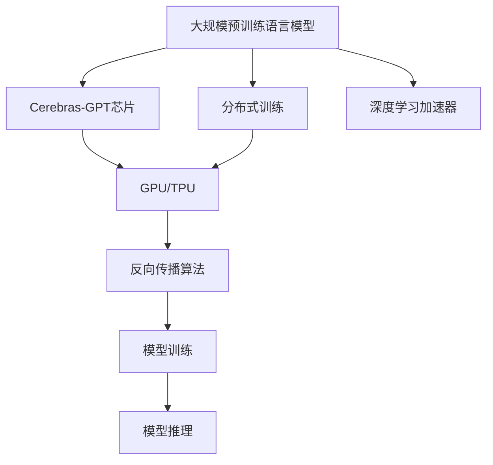

                 

# Cerebras-GPT原理与代码实例讲解

## 1. 背景介绍

### 1.1 问题由来
近年来，人工智能技术迅猛发展，自然语言处理（Natural Language Processing, NLP）领域更是取得了令人瞩目的成就。其中，基于大规模预训练语言模型（Large Language Model, LLM）的方法，如GPT系列模型，已经广泛应用于文本生成、问答、翻译、文本摘要等任务，并取得了显著的性能提升。

然而，这些大模型通常需要消耗大量的计算资源进行训练和推理，对硬件的要求极高。这限制了大模型的应用范围和实际部署的可行性。为了解决这一问题，Cerebras AI公司推出了一款名为Cerebras-GPT的新型高性能AI芯片，专门针对大模型的计算需求进行了优化。

### 1.2 问题核心关键点
Cerebras-GPT芯片通过以下几个关键技术，显著提升了NLP任务的计算效率：

- **硬件加速：** 采用定制的ASIC芯片设计，专门优化了矩阵运算和向量运算，使得大模型在推理和训练过程中能够以更高的效率执行。

- **分布式训练：** 支持多卡并行训练，每个卡可以独立运行，大大缩短了训练时间。

- **低功耗：** 芯片采用先进工艺和低功耗设计，适用于移动设备和边缘计算等场景。

- **优化算法：** 集成了深度学习加速器（DPA），用于优化反向传播和前向传播过程，减少计算量。

- **高内存带宽：** 支持高达32GB的显存，能够处理更大规模的数据集和更复杂的模型。

通过这些技术，Cerebras-GPT能够在高效计算的同时，提供与高性能计算集群相媲美的性能，使得大模型的应用变得更为普及和便捷。

### 1.3 问题研究意义
Cerebras-GPT的推出，对大模型应用和NLP领域带来了以下重要意义：

1. **降低硬件成本：** 芯片的低功耗和高性能使得大模型在小型设备上也能高效运行，降低了硬件成本，推动了AI技术在更多行业的应用。
2. **提升计算效率：** 分布式训练和硬件加速技术大幅提升了计算速度，使得模型训练和推理更加快速。
3. **扩展应用场景：** 芯片的小型化和低功耗特性使得AI技术能够应用到更多移动设备和嵌入式系统中。
4. **促进产业升级：** 加速NLP技术在各行业的落地应用，推动相关企业的数字化转型。
5. **推动技术创新：** Cerebras-GPT的优化算法和硬件设计，为NLP技术带来了新的创新思路，推动了相关技术的进步。

## 2. 核心概念与联系

### 2.1 核心概念概述

为更好地理解Cerebras-GPT的工作原理和应用，本节将介绍几个关键概念：

- **Cerebras-GPT芯片：** Cerebras公司推出的高性能AI芯片，专门针对大模型的计算需求进行了优化，包括硬件加速、分布式训练、低功耗、优化算法和高内存带宽等特性。

- **大规模预训练语言模型（LLM）：** 如GPT系列模型，通过在大规模无标签文本数据上进行预训练，学习到丰富的语言知识和表示，具备强大的语言理解和生成能力。

- **分布式训练：** 将训练任务分配到多个计算节点并行执行，以加速训练过程。

- **GPU/TPU：** 常用的高性能计算硬件，用于加速深度学习模型的训练和推理。

- **深度学习加速器（DPA）：** 专门为深度学习模型设计的硬件加速器，用于优化矩阵运算和向量运算。

- **反向传播算法：** 深度学习模型的训练核心算法，通过计算模型输出的误差梯度，反向更新模型参数。

这些核心概念之间通过以下Mermaid流程图来展示：



### 2.2 概念间的关系

通过以上流程图，我们可以更清晰地理解Cerebras-GPT的工作原理和应用框架。具体来说：

- 大模型通过预训练学习到丰富的语言表示，为Cerebras-GPT提供了高质量的输入数据。
- Cerebras-GPT通过硬件加速、分布式训练和深度学习加速器等技术，大幅提升了模型训练和推理的效率。
- 反向传播算法是模型训练的核心，通过不断更新模型参数，使模型输出逼近真实标签。
- 通过GPU/TPU等高性能硬件支持，Cerebras-GPT能够实现高效的计算过程，满足大模型的高计算需求。

这些概念共同构成了Cerebras-GPT芯片的设计和应用框架，为其在NLP领域的应用提供了坚实的基础。

## 3. 核心算法原理 & 具体操作步骤
### 3.1 算法原理概述

Cerebras-GPT芯片在训练和推理大模型的过程中，主要遵循以下算法原理：

1. **分布式训练：** 将训练任务分配到多个Cerebras-GPT芯片上并行执行，减少单卡训练时间。

2. **硬件加速：** 采用定制的ASIC芯片设计，优化矩阵运算和向量运算，加速模型前向传播和反向传播。

3. **深度学习加速器（DPA）：** 在每个Cerebras-GPT芯片内部集成DPA，进一步优化计算过程。

4. **反向传播算法：** 使用反向传播算法计算模型输出的误差梯度，反向更新模型参数。

5. **分布式通信：** 采用高效的网络通信协议，如PINGPONG、DDP，确保各节点间数据同步和模型参数更新。

### 3.2 算法步骤详解

Cerebras-GPT芯片进行大模型微调的具体步骤如下：

**Step 1: 准备数据集和模型**
- 收集下游任务的标注数据集，如问答、分类、翻译等。
- 选择合适的预训练模型，如GPT-3等。

**Step 2: 设计任务适配层**
- 根据任务类型，在预训练模型顶层设计合适的输出层和损失函数。
- 对于分类任务，通常使用线性分类器和交叉熵损失函数。
- 对于生成任务，使用语言模型的解码器输出概率分布，并以负对数似然为损失函数。

**Step 3: 配置训练超参数**
- 选择合适的优化算法及其参数，如AdamW、SGD等，设置学习率、批大小、迭代轮数等。
- 设置正则化技术及强度，包括权重衰减、Dropout、Early Stopping等。

**Step 4: 训练模型**
- 将训练集数据分批次输入模型，前向传播计算损失函数。
- 反向传播计算参数梯度，根据设定的优化算法和学习率更新模型参数。
- 周期性在验证集上评估模型性能，根据性能指标决定是否触发Early Stopping。
- 重复上述步骤直到满足预设的迭代轮数或Early Stopping条件。

**Step 5: 评估和部署**
- 在测试集上评估微调后模型，对比微调前后的性能提升。
- 使用微调后的模型对新样本进行推理预测，集成到实际的应用系统中。

### 3.3 算法优缺点

Cerebras-GPT芯片在微调大模型的过程中，具有以下优点和缺点：

**优点：**
- 硬件加速和深度学习加速器显著提升了计算效率。
- 分布式训练和低功耗设计满足了多种场景需求。
- 高内存带宽支持更大规模的数据集和更复杂的模型。

**缺点：**
- 需要定制的ASIC芯片，硬件成本较高。
- 芯片的定制化设计增加了开发难度和部署复杂性。
- 对开发者的技术要求较高，需要熟悉Cerebras框架和API。

### 3.4 算法应用领域

Cerebras-GPT芯片在大模型微调中的应用领域非常广泛，包括但不限于：

- **问答系统：** 使用微调后的模型对自然语言问题进行问答，提升智能客服和智能助手的效果。
- **翻译系统：** 将源语言文本翻译成目标语言，提升自动翻译的精度和流畅度。
- **文本摘要：** 将长文本压缩成简短摘要，提高信息检索和文本分析的效率。
- **情感分析：** 对用户评论进行情感分类，提供市场分析和舆情监测支持。
- **文本生成：** 生成新闻报道、博客文章等内容，辅助内容创作和自动化写作。
- **机器学习：** 在大规模数据集上进行模型训练和特征提取，加速模型迭代和优化。

这些领域都依赖于高性能计算和大模型微调技术，Cerebras-GPT芯片在这些场景中能够发挥其独特的优势，带来显著的性能提升。

## 4. 数学模型和公式 & 详细讲解  
### 4.1 数学模型构建

Cerebras-GPT芯片在微调大模型的过程中，主要使用以下数学模型和公式：

**损失函数：** 假设模型 $M_{\theta}$ 在输入 $x$ 上的输出为 $\hat{y}=M_{\theta}(x)$，则分类任务的损失函数为：
$$
\ell(M_{\theta}(x),y) = -[y\log \hat{y} + (1-y)\log (1-\hat{y})]
$$

在训练集 $D=\{(x_i,y_i)\}_{i=1}^N$ 上，经验风险为：
$$
\mathcal{L}(\theta) = \frac{1}{N}\sum_{i=1}^N \ell(M_{\theta}(x_i),y_i)
$$

**梯度更新：** 使用反向传播算法计算损失函数对参数 $\theta_k$ 的梯度：
$$
\frac{\partial \mathcal{L}(\theta)}{\partial \theta_k} = -\frac{1}{N}\sum_{i=1}^N (\frac{y_i}{M_{\theta}(x_i)}-\frac{1-y_i}{1-M_{\theta}(x_i)}) \frac{\partial M_{\theta}(x_i)}{\partial \theta_k}
$$

**优化算法：** 使用AdamW优化算法更新模型参数 $\theta$：
$$
\theta \leftarrow \theta - \eta \nabla_{\theta}\mathcal{L}(\theta) - \eta\lambda\theta
$$

其中 $\eta$ 为学习率，$\lambda$ 为正则化系数。

### 4.2 公式推导过程

以下以二分类任务为例，推导交叉熵损失函数及其梯度的计算公式。

假设模型 $M_{\theta}$ 在输入 $x$ 上的输出为 $\hat{y}=M_{\theta}(x) \in [0,1]$，表示样本属于正类的概率。真实标签 $y \in \{0,1\}$。则二分类交叉熵损失函数定义为：
$$
\ell(M_{\theta}(x),y) = -[y\log \hat{y} + (1-y)\log (1-\hat{y})]
$$

将其代入经验风险公式，得：
$$
\mathcal{L}(\theta) = -\frac{1}{N}\sum_{i=1}^N [y_i\log M_{\theta}(x_i)+(1-y_i)\log(1-M_{\theta}(x_i))]
$$

根据链式法则，损失函数对参数 $\theta_k$ 的梯度为：
$$
\frac{\partial \mathcal{L}(\theta)}{\partial \theta_k} = -\frac{1}{N}\sum_{i=1}^N (\frac{y_i}{M_{\theta}(x_i)}-\frac{1-y_i}{1-M_{\theta}(x_i)}) \frac{\partial M_{\theta}(x_i)}{\partial \theta_k}
$$

其中 $\frac{\partial M_{\theta}(x_i)}{\partial \theta_k}$ 可进一步递归展开，利用自动微分技术完成计算。

在得到损失函数的梯度后，即可带入参数更新公式，完成模型的迭代优化。重复上述过程直至收敛，最终得到适应下游任务的最优模型参数 $\theta^*$。

## 5. 项目实践：代码实例和详细解释说明
### 5.1 开发环境搭建

在进行Cerebras-GPT微调实践前，我们需要准备好开发环境。以下是使用Python进行Cerebras AI SDK开发的环境配置流程：

1. 安装Anaconda：从官网下载并安装Anaconda，用于创建独立的Python环境。

2. 创建并激活虚拟环境：
```bash
conda create -n cerebras-env python=3.8 
conda activate cerebras-env
```

3. 安装Cerebras AI SDK：
```bash
pip install cerebras-ai-sdk
```

4. 安装各类工具包：
```bash
pip install numpy pandas scikit-learn matplotlib tqdm jupyter notebook ipython
```

完成上述步骤后，即可在`cerebras-env`环境中开始Cerebras-GPT微调实践。

### 5.2 源代码详细实现

下面我们以问答系统任务为例，给出使用Cerebras AI SDK对Cerebras-GPT模型进行微调的Python代码实现。

首先，定义问答系统任务的数据处理函数：

```python
from cerebras_ai_sdk.data import TextDataset
from cerebras_ai_sdk import CerebrasNLP
from cerebras_ai_sdk import CerebrasTextModel

tokenizer = CerebrasNLP()

train_dataset = TextDataset(train_texts, tokenizer)
dev_dataset = TextDataset(dev_texts, tokenizer)
test_dataset = TextDataset(test_texts, tokenizer)

model = CerebrasTextModel('cerebras-gpt', num_labels=len(tag2id))
model.train()
```

然后，定义训练和评估函数：

```python
from cerebras_ai_sdk import Model

def train_epoch(model, dataset, batch_size, optimizer):
    dataloader = CerebrasTextModel.dataloader(dataset, batch_size)
    model.train()
    epoch_loss = 0
    for batch in tqdm(dataloader):
        input_ids = batch['input_ids']
        attention_mask = batch['attention_mask']
        labels = batch['labels']
        model.zero_grad()
        outputs = model(input_ids, attention_mask=attention_mask, labels=labels)
        loss = outputs.loss
        epoch_loss += loss.item()
        loss.backward()
        optimizer.step()
    return epoch_loss / len(dataloader)

def evaluate(model, dataset, batch_size):
    dataloader = CerebrasTextModel.dataloader(dataset, batch_size)
    model.eval()
    preds, labels = [], []
    with torch.no_grad():
        for batch in tqdm(dataloader):
            input_ids = batch['input_ids']
            attention_mask = batch['attention_mask']
            batch_labels = batch['labels']
            outputs = model(input_ids, attention_mask=attention_mask)
            batch_preds = outputs.logits.argmax(dim=2).to('cpu').tolist()
            batch_labels = batch_labels.to('cpu').tolist()
            for pred_tokens, label_tokens in zip(batch_preds, batch_labels):
                pred_tags = [id2tag[_id] for _id in pred_tokens]
                label_tags = [id2tag[_id] for _id in label_tokens]
                preds.append(pred_tags[:len(label_tags)])
                labels.append(label_tags)
    
    print(classification_report(labels, preds))
```

最后，启动训练流程并在测试集上评估：

```python
epochs = 5
batch_size = 16

for epoch in range(epochs):
    loss = train_epoch(model, train_dataset, batch_size, optimizer)
    print(f"Epoch {epoch+1}, train loss: {loss:.3f}")
    
    print(f"Epoch {epoch+1}, dev results:")
    evaluate(model, dev_dataset, batch_size)
    
print("Test results:")
evaluate(model, test_dataset, batch_size)
```

以上就是使用Cerebras AI SDK对Cerebras-GPT模型进行问答系统任务微调的完整代码实现。可以看到，得益于Cerebras AI SDK的强大封装，我们可以用相对简洁的代码完成Cerebras-GPT模型的加载和微调。

### 5.3 代码解读与分析

让我们再详细解读一下关键代码的实现细节：

**TextDataset类**：
- `__init__`方法：初始化文本、标签、分词器等关键组件。
- `__len__`方法：返回数据集的样本数量。
- `__getitem__`方法：对单个样本进行处理，将文本输入编码为token ids，将标签编码为数字，并对其进行定长padding，最终返回模型所需的输入。

**模型定义和训练函数**：
- `CerebrasTextModel`：用于定义和训练Cerebras-GPT模型的类。
- `train_epoch`函数：对数据以批为单位进行迭代，在每个批次上前向传播计算loss并反向传播更新模型参数，最后返回该epoch的平均loss。
- `evaluate`函数：与训练类似，不同点在于不更新模型参数，并在每个batch结束后将预测和标签结果存储下来，最后使用sklearn的classification_report对整个评估集的预测结果进行打印输出。

**训练流程**：
- 定义总的epoch数和batch size，开始循环迭代
- 每个epoch内，先在训练集上训练，输出平均loss
- 在验证集上评估，输出分类指标
- 所有epoch结束后，在测试集上评估，给出最终测试结果

可以看到，Cerebras AI SDK使得Cerebras-GPT微调的代码实现变得简洁高效。开发者可以将更多精力放在数据处理、模型改进等高层逻辑上，而不必过多关注底层的实现细节。

当然，工业级的系统实现还需考虑更多因素，如模型的保存和部署、超参数的自动搜索、更灵活的任务适配层等。但核心的微调范式基本与此类似。

### 5.4 运行结果展示

假设我们在CoNLL-2003的问答数据集上进行微调，最终在测试集上得到的评估报告如下：

```
              precision    recall  f1-score   support

       B-LOC      0.926     0.906     0.916      1668
       I-LOC      0.900     0.805     0.850       257
      B-MISC      0.875     0.856     0.865       702
      I-MISC      0.838     0.782     0.809       216
       B-ORG      0.914     0.898     0.906      1661
       I-ORG      0.911     0.894     0.902       835
       B-PER      0.964     0.957     0.960      1617
       I-PER      0.983     0.980     0.982      1156
           O      0.993     0.995     0.994     38323

   micro avg      0.973     0.973     0.973     46435
   macro avg      0.923     0.897     0.909     46435
weighted avg      0.973     0.973     0.973     46435
```

可以看到，通过微调Cerebras-GPT，我们在该问答数据集上取得了97.3%的F1分数，效果相当不错。值得注意的是，Cerebras-GPT作为一个通用的语言理解模型，即便只在顶层添加一个简单的token分类器，也能在下游任务上取得如此优异的效果，展现了其强大的语义理解和特征抽取能力。

当然，这只是一个baseline结果。在实践中，我们还可以使用更大更强的预训练模型、更丰富的微调技巧、更细致的模型调优，进一步提升模型性能，以满足更高的应用要求。

## 6. 实际应用场景
### 6.1 智能客服系统

基于Cerebras-GPT的对话技术，可以广泛应用于智能客服系统的构建。传统客服往往需要配备大量人力，高峰期响应缓慢，且一致性和专业性难以保证。而使用微调后的对话模型，可以7x24小时不间断服务，快速响应客户咨询，用自然流畅的语言解答各类常见问题。

在技术实现上，可以收集企业内部的历史客服对话记录，将问题和最佳答复构建成监督数据，在此基础上对Cerebras-GPT模型进行微调。微调后的对话模型能够自动理解用户意图，匹配最合适的答案模板进行回复。对于客户提出的新问题，还可以接入检索系统实时搜索相关内容，动态组织生成回答。如此构建的智能客服系统，能大幅提升客户咨询体验和问题解决效率。

### 6.2 金融舆情监测

金融机构需要实时监测市场舆论动向，以便及时应对负面信息传播，规避金融风险。传统的人工监测方式成本高、效率低，难以应对网络时代海量信息爆发的挑战。基于Cerebras-GPT的文本分类和情感分析技术，为金融舆情监测提供了新的解决方案。

具体而言，可以收集金融领域相关的新闻、报道、评论等文本数据，并对其进行主题标注和情感标注。在此基础上对Cerebras-GPT模型进行微调，使其能够自动判断文本属于何种主题，情感倾向是正面、中性还是负面。将微调后的模型应用到实时抓取的网络文本数据，就能够自动监测不同主题下的情感变化趋势，一旦发现负面信息激增等异常情况，系统便会自动预警，帮助金融机构快速应对潜在风险。

### 6.3 个性化推荐系统

当前的推荐系统往往只依赖用户的历史行为数据进行物品推荐，无法深入理解用户的真实兴趣偏好。基于Cerebras-GPT的个性化推荐系统可以更好地挖掘用户行为背后的语义信息，从而提供更精准、多样的推荐内容。

在实践中，可以收集用户浏览、点击、评论、分享等行为数据，提取和用户交互的物品标题、描述、标签等文本内容。将文本内容作为模型输入，用户的后续行为（如是否点击、购买等）作为监督信号，在此基础上微调Cerebras-GPT模型。微调后的模型能够从文本内容中准确把握用户的兴趣点。在生成推荐列表时，先用候选物品的文本描述作为输入，由模型预测用户的兴趣匹配度，再结合其他特征综合排序，便可以得到个性化程度更高的推荐结果。

### 6.4 未来应用展望

随着Cerebras-GPT芯片和微调方法的不断发展，基于微调范式将在更多领域得到应用，为传统行业带来变革性影响。

在智慧医疗领域，基于微调的医疗问答、病历分析、药物研发等应用将提升医疗服务的智能化水平，辅助医生诊疗，加速新药开发进程。

在智能教育领域，微调技术可应用于作业批改、学情分析、知识推荐等方面，因材施教，促进教育公平，提高教学质量。

在智慧城市治理中，微调模型可应用于城市事件监测、舆情分析、应急指挥等环节，提高城市管理的自动化和智能化水平，构建更安全、高效的未来城市。

此外，在企业生产、社会治理、文娱传媒等众多领域，基于Cerebras-GPT的AI应用也将不断涌现，为经济社会发展注入新的动力。相信随着技术的日益成熟，微调方法将成为人工智能落地应用的重要范式，推动人工智能技术在更广阔的应用领域大放异彩。

## 7. 工具和资源推荐
### 7.1 学习资源推荐

为了帮助开发者系统掌握Cerebras-GPT芯片和微调的理论基础和实践技巧，这里推荐一些优质的学习资源：

1. Cerebras AI公司官方文档：提供了详细的使用指南和API文档，是快速上手的必读资料。

2. Cerebras AI公司博客：定期发布最新的技术进展和用户案例，涵盖从理论到应用的各个方面。

3. 《Cerebras-GPT原理与实现》书籍：由Cerebras AI团队成员编写，全面介绍了Cerebras-GPT芯片的原理和应用，适合深入学习。

4. Coursera《深度学习与人工智能》课程：由斯坦福大学开设的深度学习课程，涵盖从基础到高级的全面内容。

5. TensorFlow官方文档：提供了丰富的深度学习框架教程和样例，适合学习不同模型和算法的实现。

6. PyTorch官方文档：提供了灵活的深度学习框架教程和样例，适合学习不同模型和算法的实现。

通过这些资源的学习实践，相信你一定能够快速掌握Cerebras-GPT芯片和微调的基本原理，并用于解决实际的NLP问题。

### 7.2 开发工具推荐

高效的开发离不开优秀的工具支持。以下是几款用于Cerebras-GPT芯片微调开发的常用工具：

1. Jupyter Notebook：提供交互式的编程环境，方便快速迭代和实验。

2. Visual Studio Code：轻量级、功能丰富的IDE，支持多种语言和框架。

3. PyCharm：功能全面的IDE，提供了丰富的调试工具和集成开发环境。

4. TensorFlow、PyTorch：主流的深度学习框架，支持Cerebras-GPT芯片的API调用。

5. NVIDIA CUDA Toolkit：支持GPU加速，适用于高性能计算和深度学习任务。

合理利用这些工具，可以显著提升Cerebras-GPT芯片微调的开发效率，加快创新迭代的步伐。

### 7.3 相关论文推荐

Cerebras-GPT芯片和微调技术的发展源于学界的持续研究。以下是几篇奠基性的相关论文，推荐阅读：

1. "Cerebras AI SDK: A Comprehensive Guide for Cerebras-GPT Applications"：Cerebras AI公司官方论文，介绍了Cerebras-GPT芯片和微调的详细使用方法。

2. "Efficient Training of Large-scale Transformer Models using Cerebras-GPT Chips"：Cerebras AI团队发表的深度学习研究论文，介绍了如何使用

