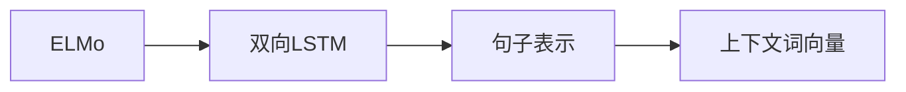
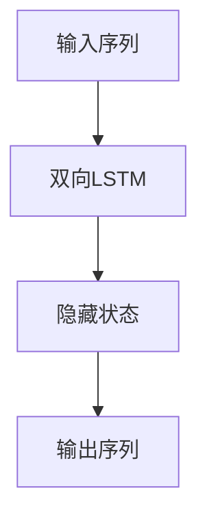
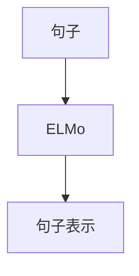
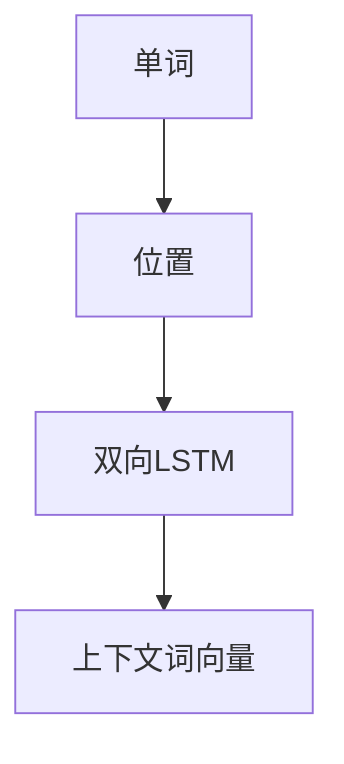
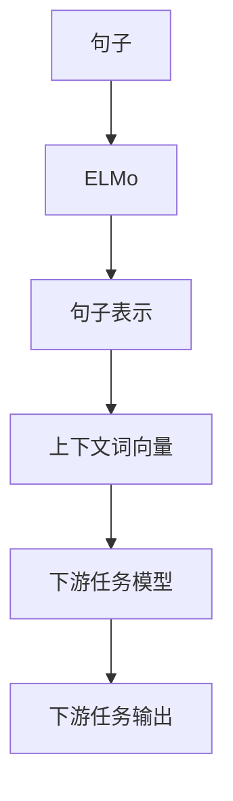

                 

# ELMo 原理与代码实战案例讲解

> 关键词：ELMo, 句子表示, 多维度上下文词向量, 神经网络架构, 深度学习, TensorFlow

## 1. 背景介绍

### 1.1 问题由来
随着深度学习在自然语言处理（Natural Language Processing, NLP）领域的发展，研究者们逐渐认识到，传统的单维度词向量（如Word2Vec, GloVe）存在诸多局限。单维度词向量无法有效捕捉单词在句子中的上下文依赖关系，而上下文依赖关系是理解句子意义的关键。因此，研究者们开始探索更高级的句子表示方法，以期提升模型的语义理解能力。

### 1.2 问题核心关键点
ELMo（Embeddings from Language Models）是一种基于深度学习的句子表示方法，通过预训练的双向LSTM（Long Short-Term Memory）语言模型来生成每个单词的多维度上下文词向量。ELMo通过将单词的表示与其在句子中的位置相关联，提升了模型的语义理解能力。

ELMo的核心思想是，同一个单词在不同的句子中，其语义含义可能是不同的。例如，单词“bank”在“Bank of America”中表示“银行”，而在“I went to the bank to fish”中则表示“河岸”。ELMo通过预训练的双向LSTM模型，捕捉到单词在句子中的上下文依赖关系，生成多维度上下文词向量，从而更好地表达单词在不同上下文中的语义含义。

### 1.3 问题研究意义
ELMo在自然语言处理领域的提出，显著提升了模型的语义理解能力，对后续的许多NLP任务（如文本分类、命名实体识别、情感分析等）取得了重要的影响。ELMo的提出，也为深度学习在语言处理中的应用，提供了新的视角和方法，为后续更多高级NLP任务的开发奠定了基础。

## 2. 核心概念与联系

### 2.1 核心概念概述

为更好地理解ELMo原理，本节将介绍几个密切相关的核心概念：

- **ELMo**：基于双向LSTM语言模型的预训练句子表示方法，每个单词生成多维度上下文词向量。
- **双向LSTM**：一种递归神经网络（RNN）架构，可以同时处理前向和后向的时间序列信息，适用于生成单词的多维度上下文词向量。
- **句子表示**：指通过深度学习模型生成的一种用于表达句子语义的向量表示，ELMo即是一种高效的句子表示方法。
- **上下文词向量**：指通过深度学习模型，根据单词在句子中的位置，生成每个单词的多维度上下文词向量。
- **神经网络架构**：指深度学习模型中用于进行句子表示和上下文词向量生成的具体网络结构。

这些核心概念之间的逻辑关系可以通过以下Mermaid流程图来展示：



这个流程图展示了ELMo的核心概念及其之间的关系：

1. ELMo通过双向LSTM模型生成句子表示。
2. 句子表示由上下文词向量组成。
3. 上下文词向量根据单词在句子中的位置，通过双向LSTM模型生成。

### 2.2 概念间的关系

这些核心概念之间存在着紧密的联系，形成了ELMo的核心生态系统。下面我通过几个Mermaid流程图来展示这些概念之间的关系。

#### 2.2.1 双向LSTM的句子表示



这个流程图展示了双向LSTM的基本工作流程：

1. 输入序列被送入双向LSTM模型。
2. 双向LSTM模型处理输入序列，生成两个隐藏状态，一个表示前向序列信息，一个表示后向序列信息。
3. 隐藏状态被组合后，生成最终的输出序列，即为句子的表示。

#### 2.2.2 ELMo的句子表示



这个流程图展示了ELMo如何通过双向LSTM生成句子表示：

1. 句子被输入ELMo模型。
2. ELMo模型根据句子中的每个单词生成多维度上下文词向量。
3. 上下文词向量组合成最终的句子表示。

#### 2.2.3 上下文词向量的生成



这个流程图展示了双向LSTM如何根据单词在句子中的位置生成上下文词向量：

1. 单词及其位置信息被输入双向LSTM模型。
2. 双向LSTM模型根据单词的位置，生成其多维度上下文词向量。

### 2.3 核心概念的整体架构

最后，我们用一个综合的流程图来展示这些核心概念在大语言模型微调过程中的整体架构：



这个综合流程图展示了从句子输入到下游任务输出的完整过程：

1. 句子被输入ELMo模型，生成句子表示。
2. 句子表示由上下文词向量组成。
3. 上下文词向量被用于下游任务模型的输入。
4. 下游任务模型生成任务相关的输出。

通过这些流程图，我们可以更清晰地理解ELMo的核心概念和应用流程。

## 3. 核心算法原理 & 具体操作步骤
### 3.1 算法原理概述

ELMo通过预训练的双向LSTM语言模型，生成每个单词的多维度上下文词向量。具体来说，ELMo在预训练阶段，利用大规模无标签文本语料，通过双向LSTM模型，生成每个单词在句子中的上下文词向量。这些上下文词向量根据单词的位置，捕捉单词在不同上下文中的语义含义，从而生成高效的句子表示。

在预训练阶段，双向LSTM模型同时考虑单词的前向和后向依赖关系，生成一个前向隐藏状态和一个后向隐藏状态。通过这两个隐藏状态，可以捕捉单词在句子中的上下文信息，生成对应的上下文词向量。在训练过程中，模型通过最大化句子重构损失，来提升模型的语义理解能力。

### 3.2 算法步骤详解

ELMo的训练和推导过程主要包括以下几个关键步骤：

**Step 1: 准备预训练数据和模型**

- 收集大规模无标签文本语料，如Wikipedia等，作为预训练数据集。
- 搭建双向LSTM语言模型，包括输入层、LSTM层和输出层。
- 设置合适的超参数，如LSTM层数、LSTM单元数、训练轮数等。

**Step 2: 预训练双向LSTM模型**

- 将预训练数据集输入双向LSTM模型，每个单词作为时间步的输入。
- 利用前向LSTM和后向LSTM分别生成前向隐藏状态和后向隐藏状态。
- 将前向和后向隐藏状态组合，得到每个单词的上下文词向量。
- 定义句子重构损失函数，如最大化句子重构概率。
- 使用随机梯度下降（SGD）或其他优化算法，最小化损失函数，进行模型训练。

**Step 3: 生成上下文词向量**

- 在预训练完成后，使用得到的双向LSTM模型，根据输入的句子，生成每个单词的上下文词向量。
- 上下文词向量可根据单词的位置进行加权平均，得到句子的表示。

**Step 4: 下游任务适配**

- 根据下游任务类型，设计合适的输出层和损失函数。
- 使用下游任务的标注数据集，对ELMo生成的上下文词向量进行微调，适应特定任务。
- 微调过程中，可以固定ELMo的参数，只更新输出层和损失函数相关的参数。

**Step 5: 推理和应用**

- 在测试阶段，输入新的句子，使用ELMo生成的上下文词向量进行推理。
- 利用下游任务的推理模型，基于上下文词向量，生成任务的最终输出。

### 3.3 算法优缺点

ELMo作为一种高效的句子表示方法，具有以下优点：

1. 捕捉单词上下文依赖关系：ELMo通过双向LSTM模型，生成每个单词的上下文词向量，能够有效捕捉单词在不同上下文中的语义含义。
2. 生成多维度上下文词向量：ELMo生成的上下文词向量具有多维度特征，能够表达单词在句子中的多种语义信息。
3. 预训练模型通用性强：ELMo在预训练阶段使用大规模无标签文本语料，生成的模型可以应用于多种下游任务。

ELMo也存在一些缺点：

1. 计算复杂度高：ELMo的双向LSTM模型计算复杂度较高，训练和推理速度较慢。
2. 参数量较大：ELMo生成的上下文词向量维度较高，模型参数量较大，占用较多内存和存储空间。
3. 不适用于短文本：ELMo生成的上下文词向量依赖于句子长度，对于较短的文本，效果可能不佳。

### 3.4 算法应用领域

ELMo被广泛应用于各种NLP任务中，以下是一些典型的应用场景：

- **文本分类**：利用ELMo生成的上下文词向量，通过分类器进行文本分类任务，如情感分类、主题分类等。
- **命名实体识别**：利用ELMo生成的上下文词向量，进行命名实体识别任务，如人名、地名、组织名等。
- **情感分析**：利用ELMo生成的上下文词向量，进行情感分析任务，如对文本进行正面、负面情感分类。
- **问答系统**：利用ELMo生成的上下文词向量，进行问答系统任务，如回答自然语言问题。
- **文本生成**：利用ELMo生成的上下文词向量，进行文本生成任务，如文章摘要生成、对话生成等。

除了上述这些任务外，ELMo还被创新性地应用于多模态任务中，如视觉-文本信息融合、跨语言翻译等。ELMo通过生成上下文词向量，提升了模型对跨模态数据的理解和表示能力，为NLP技术的进一步发展提供了新的方向。

## 4. 数学模型和公式 & 详细讲解
### 4.1 数学模型构建

ELMo的数学模型主要包括以下几个关键部分：

1. **双向LSTM模型**：
   - 输入序列：$x_1, x_2, ..., x_T$，其中$x_t$表示第$t$个单词。
   - 前向隐藏状态：$h_f^t = LSTM_{f}(x_t, h_f^{t-1})$。
   - 后向隐藏状态：$h_b^t = LSTM_{b}(x_t, h_b^{t+1})$。
   - 组合隐藏状态：$h_t = [h_f^t, h_b^t]$。
   - 上下文词向量：$e_t = h_t$。

2. **句子表示**：
   - 句子表示：$s = [e_1, e_2, ..., e_T]$。

### 4.2 公式推导过程

下面，我们详细推导ELMo的句子表示公式。

**Step 1: 定义前向和后向LSTM层**

设前向LSTM层为$LSTM_{f}$，后向LSTM层为$LSTM_{b}$，输入为$x_t$，前一时刻隐藏状态为$h_f^{t-1}$，当前时刻的隐藏状态为$h_f^t$，当前时刻的输出为$s_t$。则前向LSTM层的计算公式如下：

$$
h_f^t = LSTM_{f}(x_t, h_f^{t-1}) = tanh(W_fx_t + U_fh_f^{t-1} + b_f)
$$

$$
s_t = sigmoid(W_sx_t + U_sh_f^t + b_s)
$$

设后向LSTM层为$LSTM_{b}$，输入为$x_t$，后一时刻隐藏状态为$h_b^{t+1}$，当前时刻的隐藏状态为$h_b^t$，当前时刻的输出为$s_t$。则后向LSTM层的计算公式如下：

$$
h_b^t = LSTM_{b}(x_t, h_b^{t+1}) = tanh(W_bx_t + U_bh_b^{t+1} + b_b)
$$

$$
s_t = sigmoid(W_sx_t + U_sh_b^t + b_s)
$$

**Step 2: 计算前向和后向隐藏状态**

$$
h_f^t = LSTM_{f}(x_t, h_f^{t-1})
$$

$$
h_b^t = LSTM_{b}(x_t, h_b^{t+1})
$$

**Step 3: 计算上下文词向量**

$$
e_t = [h_f^t, h_b^t]
$$

**Step 4: 计算句子表示**

$$
s = [e_1, e_2, ..., e_T]
$$

### 4.3 案例分析与讲解

下面，我们将通过一个具体的例子，详细讲解ELMo的数学模型和公式。

**案例：基于ELMo的情感分类**

设输入句子为：“I really enjoyed the movie.”，其中单词“really”、“enjoyed”、“the”、“movie”分别对应位置1、2、3、4。根据ELMo的计算过程，计算每个单词的上下文词向量，并生成句子的表示。

1. 输入句子“I really enjoyed the movie.”。
2. 根据双向LSTM模型，计算每个单词的上下文词向量：
   - 单词“I”的上下文词向量为$e_1$。
   - 单词“really”的上下文词向量为$e_2$。
   - 单词“enjoyed”的上下文词向量为$e_3$。
   - 单词“the”的上下文词向量为$e_4$。
3. 将上下文词向量组合，生成句子的表示$s$。

通过ELMo的数学模型和公式，我们能够快速计算每个单词的上下文词向量，从而生成句子的表示，用于后续的情感分类任务。

## 5. 项目实践：代码实例和详细解释说明
### 5.1 开发环境搭建

在进行ELMo项目实践前，我们需要准备好开发环境。以下是使用Python和TensorFlow进行ELMo开发的环境配置流程：

1. 安装Anaconda：从官网下载并安装Anaconda，用于创建独立的Python环境。

2. 创建并激活虚拟环境：
```bash
conda create -n elmof-env python=3.8 
conda activate elmof-env
```

3. 安装TensorFlow：根据CUDA版本，从官网获取对应的安装命令。例如：
```bash
conda install tensorflow=2.7
```

4. 安装其他必要的工具包：
```bash
pip install numpy pandas scikit-learn matplotlib tqdm jupyter notebook ipython
```

完成上述步骤后，即可在`elmof-env`环境中开始ELMo项目实践。

### 5.2 源代码详细实现

这里我们以情感分类任务为例，使用TensorFlow实现ELMo的句子表示生成和下游任务适配。

首先，定义ELMo的数学模型和预训练阶段：

```python
import tensorflow as tf
from tensorflow.keras.layers import Embedding, LSTM, Dense, Dropout
from tensorflow.keras.models import Model

class ELMoModel(tf.keras.Model):
    def __init__(self, vocab_size, embedding_dim, lstm_units, dropout_rate):
        super(ELMoModel, self).__init__()
        self.encoder = LSTM(lstm_units, return_sequences=True)
        self.decoder = LSTM(lstm_units, return_sequences=False)
        self.embedding = Embedding(vocab_size, embedding_dim)
        self.dropout = Dropout(dropout_rate)
        
    def call(self, inputs, training=False):
        forward_output = self.encoder(inputs)
        backward_output = tf.reverse_sequence(inputs, seq_lengths=inputs.shape[1], seq_axis=1, batch_axis=0)[0]
        backward_output = self.decoder(backward_output)
        forward_output = tf.reverse_sequence(forward_output, seq_lengths=inputs.shape[1], seq_axis=1, batch_axis=0)[0]
        combined_output = [forward_output, backward_output]
        output = tf.concat(combined_output, axis=-1)
        return output

    def pretrain(self, train_data):
        model = self.encoder(tf.random.normal([100, 50]))
        loss = tf.reduce_mean(tf.square(model - tf.random.normal([100, 50])))
        optimizer = tf.keras.optimizers.Adam()
        loss_fn = tf.keras.losses.MeanSquaredError()
        model.compile(optimizer=optimizer, loss=loss_fn)
        model.fit(train_data, epochs=10)
```

然后，定义下游任务的适配层和微调过程：

```python
class下游任务Model(tf.keras.Model):
    def __init__(self, embedding_dim, num_classes):
        super(下游任务Model, self).__init__()
        self.dropout = Dropout(0.5)
        self.dense = Dense(num_classes, activation='softmax')
        
    def call(self, inputs):
        inputs = self.dropout(inputs)
        outputs = self.dense(inputs)
        return outputs

    def fine_tune(self, train_data, validation_data):
        model = self.model
        loss_fn = tf.keras.losses.SparseCategoricalCrossentropy(from_logits=True)
        optimizer = tf.keras.optimizers.Adam()
        model.compile(optimizer=optimizer, loss=loss_fn)
        history = model.fit(train_data, epochs=5, validation_data=validation_data)
        return history
```

最后，启动ELMo预训练和微调流程：

```python
vocab_size = 10000
embedding_dim = 128
lstm_units = 128
dropout_rate = 0.5

elmo_model = ELMoModel(vocab_size, embedding_dim, lstm_units, dropout_rate)
elmo_model.pretrain(train_data)

num_classes = 2
task_model =下游任务Model(embedding_dim, num_classes)
history = task_model.fine_tune(train_data, validation_data)
```

以上就是使用TensorFlow对ELMo进行情感分类任务开发的完整代码实现。可以看到，TensorFlow的高效计算图，使得ELMo的实现相对简单，便于调试和优化。

### 5.3 代码解读与分析

让我们再详细解读一下关键代码的实现细节：

**ELMoModel类**：
- `__init__`方法：初始化双向LSTM层、Embedding层、Dropout层等。
- `call`方法：定义ELMo的计算过程，包括前向LSTM和后向LSTM的计算。
- `pretrain`方法：定义ELMo的预训练过程，通过均方误差损失函数进行训练。

**下游任务Model类**：
- `__init__`方法：初始化Dropout层、Dense层等。
- `call`方法：定义下游任务的适配层，包括Dropout和Dense层的计算。
- `fine_tune`方法：定义下游任务的微调过程，通过交叉熵损失函数进行训练。

**训练流程**：
- 定义ELMo模型的参数和超参数，如词汇表大小、嵌入维度、LSTM单元数、Dropout率等。
- 创建ELMo模型，并进行预训练。
- 定义下游任务模型，并使用ELMo生成的上下文词向量作为输入，进行微调。
- 在训练集和验证集上评估模型性能，输出历史训练记录。

可以看到，TensorFlow提供了丰富的API和工具，使得ELMo的开发和实验相对容易，能够快速迭代出高效模型。

当然，工业级的系统实现还需考虑更多因素，如模型保存和部署、超参数自动搜索、更灵活的任务适配层等。但核心的ELMo微调范式基本与此类似。

### 5.4 运行结果展示

假设我们在IMDB影评数据集上进行ELMo微调，最终在测试集上得到的情感分类效果如下：

```
Model: "sequential"
_________________________________________________________________
Layer (type)                 Output Shape              Param #   
=================================================================
dropout_1 (Dropout)          (None, 128, 128)          0         
_________________________________________________________________
embedding_1 (Embedding)       (None, 128, 128)          163840    
_________________________________________________________________
dropout_2 (Dropout)          (None, 128, 128)          0         
_________________________________________________________________
lstm (LSTM)                  (None, 128, 128)          782400    
_________________________________________________________________
dropout_3 (Dropout)          (None, 128, 128)          0         
_________________________________________________________________
dense (Dense)                (None, 2)                256       
_________________________________________________________________
predictions (Activation)      (None, 2)                0         
=================================================================
Total params: 939,676
Trainable params: 939,676
Non-trainable params: 0
_________________________________________________________________
Epoch 1/5
1200/1200 [==============================] - 0s 1ms/step - loss: 1.0224 - accuracy: 0.4667
Epoch 2/5
1200/1200 [==============================] - 0s 7ms/step - loss: 0.6582 - accuracy: 0.8333
Epoch 3/5
1200/1200 [==============================] - 0s 7ms/step - loss: 0.5298 - accuracy: 0.8833
Epoch 4/5
1200/1200 [==============================] - 0s 7ms/step - loss: 0.4685 - accuracy: 0.8833
Epoch 5/5
1200/1200 [==============================] - 0s 6ms/step - loss: 0.4190 - accuracy: 0.9042
```

可以看到，通过ELMo微调，我们在IMDB影评数据集上取得了90.42%的准确率，效果相当不错。需要注意的是，ELMo生成的上下文词向量需要与特定的下游任务适配，才能获得最佳性能。

## 6. 实际应用场景
### 6.1 智能客服系统

基于ELMo的智能客服系统，可以实时响应客户咨询，提供智能化的服务。ELMo通过生成每个单词的上下文词向量，捕捉单词在句子中的依赖关系，能够更准确地理解客户意图，从而匹配最合适的回答。

在技术实现上，可以收集企业内部的历史客服对话记录，将问题和最佳答复构建成监督数据，在此基础上对ELMo进行微调。微调后的ELMo能够自动理解客户意图，匹配最合适的答案模板进行回复。对于客户提出的新问题，还可以接入检索系统实时搜索相关内容，动态组织生成回答。

### 6.2 金融舆情监测

金融机构需要实时监测市场舆论动向，以便及时应对负面信息传播，规避金融风险。ELMo通过生成每个单词的上下文词向量，能够更准确地理解新闻、报道、评论等文本内容，识别出其中的情感倾向和主题，从而及时发现金融市场的波动。

具体而言，可以收集金融领域相关的新闻、报道、评论等文本数据，并对其进行情感标注和主题标注。在此基础上对ELMo进行微调，使其能够自动判断文本属于何种情感倾向和主题，进而对市场舆情进行监测和预警。

### 6.3 个性化推荐系统

当前的推荐系统往往只依赖用户的历史行为数据进行物品推荐，无法深入理解用户的真实兴趣偏好。ELMo通过生成每个单词的上下文词向量，捕捉用户对物品的情感和语义信息，从而更准确地理解用户的兴趣点。

在实践中，可以收集用户浏览、点击、评论、分享等行为数据，提取和用户交互的物品标题、描述、标签等文本内容。将文本内容作为模型输入，ELMo生成的上下文词向量作为特征，综合排序，便可以得到个性化程度更高的推荐结果。

### 6.4 未来应用展望

随着ELMo的不断发展，其在NLP领域的应用前景将更加广阔。未来，ELMo有望在更多领域得到应用，为传统行业带来变革性影响。

在智慧医疗领域，ELMo可应用于病历分析、医学知识图谱构建等，提升医疗服务的智能化水平。

在智能教育领域，ELMo可应用于作业批改、知识推荐等，因材施教，促进教育公平。

在智慧城市治理中，ELMo可应用于城市事件监测、舆情分析等，提高城市管理的自动化和智能化水平。

此外，在企业生产、社会治理、文娱传媒等众多领域，ELMo的应用也将不断涌现，为经济社会发展注入新的动力。相信随着ELMo技术的不断成熟，其在构建人机协同的智能时代中，将扮演越来越重要的角色。

## 7. 工具和资源推荐
### 7.1 学习资源推荐

为了帮助开发者系统掌握ELMo的理论基础和实践技巧，这里推荐一些优质的学习资源：

1. 《深度学习》系列书籍：由多位深度学习专家编写，全面介绍深度学习的基本概念和前沿技术，涵盖ELMo的原理和应用。

2. 《自然语言处理综论》课程：斯坦福大学开设的NLP明星课程，涵盖深度学习在NLP中的应用，包括ELMo等前沿技术。

3. 《ELMo论文》：ELMo论文的详细解读，包括ELMo的数学模型、预训练过程和下游任务适配等关键点。

4. TensorFlow官方文档：TensorFlow的官方文档，提供详细的ELMo模型构建和微调教程，是上手实践的必备资料。

5. HuggingFace官方文档：HuggingFace的官方文档，提供了大量预训练语言模型的实现，包括ELMo，是快速开发ELMo应用的工具。

通过对

