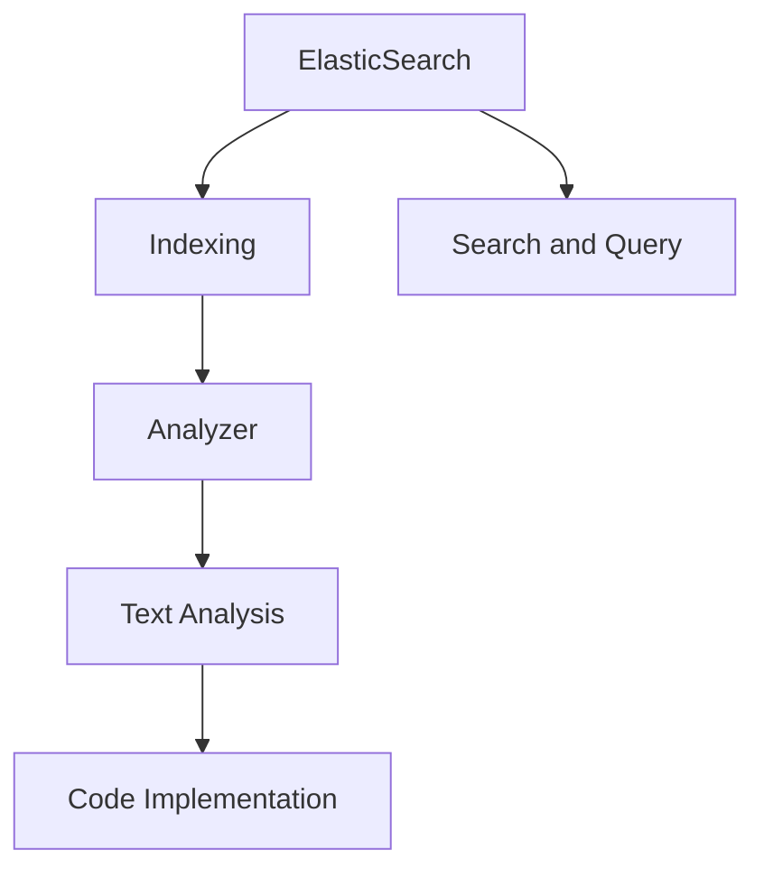
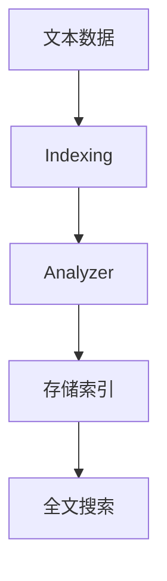
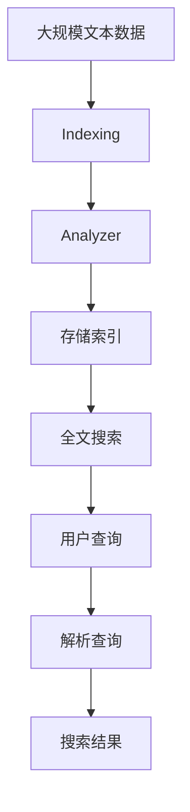

                 

# ElasticSearch Analyzer原理与代码实例讲解

> 关键词：ElasticSearch, Analyzer, Indexing, Text Analysis, Code Implementation, Advanced Search Engine

## 1. 背景介绍

### 1.1 问题由来

在现代数据驱动的互联网时代，海量的文本数据成为了企业和研究机构最重要的数据资产之一。然而，文本数据不仅体量大，而且格式多样、结构复杂，如何高效地管理和利用这些数据成为了一个巨大的挑战。为了解决这一问题，ElasticSearch（简称ES）应运而生。

ElasticSearch是一个基于Lucene构建的全文搜索引擎，提供了强大的文本分析、搜索和查询功能，被广泛应用于搜索引擎、内容推荐、日志分析等领域。而Analyzer作为ElasticSearch中最重要的组件之一，负责将文本数据进行分词、过滤和标准化，为后续的索引、搜索和分析提供支持。

### 1.2 问题核心关键点

Analyzer的主要功能是将原始文本数据转换为可供搜索引擎处理的格式，包括分词、词干提取、大小写转换、停用词过滤等。Analyzer的核心算法流程如下：

1. **分词**：将文本按照空格、标点符号等进行分割，将每个单词作为索引和搜索的基本单位。
2. **词干提取**：将不同时态、单复数等形式的单词，转换为统一的基本形式，如将“running”转换为“run”。
3. **大小写转换**：将文本中的所有单词转换为统一的大小写形式，通常为大写或小写。
4. **停用词过滤**：去除文本中的停用词（如“the”、“a”等常见但无实际意义的词语），以减少索引和搜索的空间和时间复杂度。
5. **字符转换**：将非ASCII字符转换为ASCII字符集，以统一编码格式。

Analyzer的效率和效果直接影响ElasticSearch的性能和搜索结果的准确性，因此，深入理解Analyzer的工作原理和实现细节，对于优化ElasticSearch的搜索引擎功能至关重要。

### 1.3 问题研究意义

Analyzer在ElasticSearch中的应用不仅限于文本分析，它还涉及自然语言处理（NLP）、机器学习、大数据分析等多个领域。通过Analyzer，可以对海量文本数据进行高效索引和搜索，快速获取有价值的信息，从而帮助企业更好地理解和利用数据，驱动业务决策和创新。

Analyzer的研究对于提升搜索引擎的性能、优化数据处理流程、增强搜索体验和数据安全性具有重要意义。同时，Analyzer的应用还可以拓展到智能问答、推荐系统、情感分析等新兴领域，为这些领域的技术进步提供支持。

## 2. 核心概念与联系

### 2.1 核心概念概述

为了更好地理解ElasticSearch Analyzer的工作原理，本节将介绍几个关键概念：

- **ElasticSearch**：基于Lucene构建的全文搜索引擎，提供全文搜索、索引、分片等功能。
- **Analyzer**：ElasticSearch中用于文本分词、过滤和标准化的组件，是文本分析的核心。
- **Indexing**：将文本数据转换为可供搜索引擎索引的格式，包括分词、词干提取、大小写转换、停用词过滤等。
- **Text Analysis**：对文本数据进行分词、词性标注、实体识别等处理，提取文本中的关键信息。
- **Code Implementation**：使用ElasticSearch的API和SDK进行Analyzer的实现和测试。

这些概念之间的逻辑关系可以通过以下Mermaid流程图来展示：



这个流程图展示了大语言模型微调过程中各个组件之间的逻辑关系：

1. ElasticSearch负责文本的索引和搜索。
2. Analyzer负责对文本进行分词、过滤和标准化。
3. Text Analysis则进一步对文本进行深度分析，提取关键信息。
4. Code Implementation用于实现Analyzer和Text Analysis的代码，提供API和SDK供开发者使用。

通过理解这些核心概念，我们可以更好地把握ElasticSearch Analyzer的工作原理和优化方向。

### 2.2 概念间的关系

这些核心概念之间存在着紧密的联系，形成了ElasticSearch的完整生态系统。下面我们通过几个Mermaid流程图来展示这些概念之间的关系。

#### 2.2.1 ElasticSearch的文本索引流程



这个流程图展示了ElasticSearch的文本索引流程：

1. 原始文本数据首先进入Indexing阶段，进行初步的分词和过滤。
2. 然后由Analyzer对文本进行深度分析，如词干提取、大小写转换、停用词过滤等。
3. 最后，处理后的文本数据被存储为索引，用于全文搜索和查询。

#### 2.2.2 Analyzer与Text Analysis的协同工作


这个流程图展示了Analyzer与Text Analysis的协同工作：

1. Analyzer对文本进行分词、词干提取、停用词过滤等处理，生成初步的分析结果。
2. Text Analysis则进一步对文本进行分析，如词性标注、实体识别、关键词提取等，提取文本中的关键信息。

#### 2.2.3 ElasticSearch的搜索和查询


这个流程图展示了ElasticSearch的搜索和查询流程：

1. 用户输入查询条件，ElasticSearch解析查询并构建搜索请求。
2. 根据解析后的请求，ElasticSearch在索引中查找匹配的文本数据。
3. 最终，ElasticSearch将匹配的文本数据作为搜索结果返回给用户。

### 2.3 核心概念的整体架构

最后，我们用一个综合的流程图来展示这些核心概念在大语言模型微调过程中的整体架构：



这个综合流程图展示了从文本数据预处理到搜索结果生成的完整过程：

1. 大规模文本数据首先进入Indexing阶段，进行初步的分词和过滤。
2. 然后由Analyzer对文本进行深度分析，如词干提取、大小写转换、停用词过滤等。
3. 最后，处理后的文本数据被存储为索引，用于全文搜索和查询。用户输入查询条件后，ElasticSearch解析查询并搜索索引，最终将匹配的文本数据作为搜索结果返回给用户。

通过这些流程图，我们可以更清晰地理解ElasticSearch Analyzer的工作原理和优化方向。

## 3. 核心算法原理 & 具体操作步骤
### 3.1 算法原理概述

ElasticSearch Analyzer的核心算法流程包括以下几个步骤：

1. **分词**：将文本按照空格、标点符号等进行分割，将每个单词作为索引和搜索的基本单位。
2. **词干提取**：将不同时态、单复数等形式的单词，转换为统一的基本形式，如将“running”转换为“run”。
3. **大小写转换**：将文本中的所有单词转换为统一的大小写形式，通常为大写或小写。
4. **停用词过滤**：去除文本中的停用词（如“the”、“a”等常见但无实际意义的词语），以减少索引和搜索的空间和时间复杂度。
5. **字符转换**：将非ASCII字符转换为ASCII字符集，以统一编码格式。

这些步骤通常使用正则表达式、词典、算法等技术来实现，以确保分词和分析的准确性和效率。

### 3.2 算法步骤详解

下面以ElasticSearch中的标准Analyzers为例，详细讲解其算法步骤：

**Standard Analyzer** 是ElasticSearch中最常用的Analyzer之一，其核心算法步骤如下：

1. **分词**：使用基于正则表达式的分词器将文本按照空格、标点符号等进行分割。
2. **词干提取**：使用Porter Stemming算法对单词进行词干提取。
3. **大小写转换**：将文本中的所有单词转换为小写。
4. **停用词过滤**：使用ElasticSearch内置的停用词列表去除文本中的停用词。
5. **字符转换**：将非ASCII字符转换为ASCII字符集，以统一编码格式。

这些步骤通过正则表达式、Porter Stemming算法和ElasticSearch的API实现。

### 3.3 算法优缺点

ElasticSearch Analyzer的优点包括：

- **灵活性**：ElasticSearch Analyzer提供了多种自定义Analyzer，可以根据具体需求选择适合的Analyzer。
- **可扩展性**：ElasticSearch Analyzer支持多种文本分析技术，如词性标注、实体识别、关键词提取等。
- **高性能**：ElasticSearch Analyzer使用C++实现，性能高效，能够处理大规模文本数据。

ElasticSearch Analyzer的缺点包括：

- **复杂度**：Analyzer的实现复杂度较高，需要熟悉正则表达式、词干提取算法等技术。
- **依赖性强**：Analyzer依赖ElasticSearch的API和SDK，无法独立使用。
- **适用场景有限**：Analyzer主要针对英文文本，对其他语言的支持有限。

### 3.4 算法应用领域

ElasticSearch Analyzer的应用领域广泛，包括但不限于：

- **搜索引擎**：如Google Search、Bing Search等，使用Analyzer进行文本分词和过滤，提升搜索结果的准确性。
- **内容推荐**：如Netflix、Amazon等，使用Analyzer进行文本分析，推荐相关内容。
- **日志分析**：如ELK Stack（ElasticSearch、Logstash、Kibana），使用Analyzer对日志文本进行分词和过滤，分析系统性能和异常。
- **情感分析**：使用Analyzer对社交媒体文本进行分词和情感标注，分析公众情绪。
- **智能问答**：使用Analyzer对用户问题进行分词和解析，构建知识图谱，回答用户问题。

## 4. 数学模型和公式 & 详细讲解 & 举例说明

### 4.1 数学模型构建

ElasticSearch Analyzer的数学模型主要涉及文本分词、词干提取和停用词过滤等。以Standard Analyzer为例，其数学模型如下：

**分词**：
- 使用正则表达式将文本分割成单词序列：
  $$
  \text{tokens} = \text{regex\_split}(\text{text}, \{\text{\s+}, \n, \t, \r\})
  $$
- 每个单词作为索引和搜索的基本单位。

**词干提取**：
- 使用Porter Stemming算法对单词进行词干提取：
  $$
  \text{stemmed\_tokens} = \text{stemmer}(\text{tokens})
  $$
- 将不同时态、单复数等形式的单词，转换为统一的基本形式，如将“running”转换为“run”。

**大小写转换**：
- 将文本中的所有单词转换为小写：
  $$
  \text{lowercased\_tokens} = \text{lower}(\text{stemmed\_tokens})
  $$

**停用词过滤**：
- 使用ElasticSearch内置的停用词列表去除文本中的停用词：
  $$
  \text{filtered\_tokens} = \text{stop\_list\_filter}(\text{lowercased\_tokens})
  $$

**字符转换**：
- 将非ASCII字符转换为ASCII字符集：
  $$
  \text{ascii\_tokens} = \text{ascii\_conversion}(\text{filtered\_tokens})
  $$

最终，ElasticSearch将处理后的单词序列作为索引，用于全文搜索和查询。

### 4.2 公式推导过程

以下我们以Standard Analyzer为例，推导其核心算法公式。

**分词**：
- 使用正则表达式将文本分割成单词序列：
  $$
  \text{tokens} = \text{regex\_split}(\text{text}, \{\text{\s+}, \n, \t, \r\})
  $$

**词干提取**：
- 使用Porter Stemming算法对单词进行词干提取：
  $$
  \text{stemmed\_tokens} = \text{stemmer}(\text{tokens})
  $$

**大小写转换**：
- 将文本中的所有单词转换为小写：
  $$
  \text{lowercased\_tokens} = \text{lower}(\text{stemmed\_tokens})
  $$

**停用词过滤**：
- 使用ElasticSearch内置的停用词列表去除文本中的停用词：
  $$
  \text{filtered\_tokens} = \text{stop\_list\_filter}(\text{lowercased\_tokens})
  $$

**字符转换**：
- 将非ASCII字符转换为ASCII字符集：
  $$
  \text{ascii\_tokens} = \text{ascii\_conversion}(\text{filtered\_tokens})
  $$

### 4.3 案例分析与讲解

假设我们有一个英文文本句子：“I am going to run a marathon on Sunday.”

**分词**：
- 使用正则表达式进行分词，得到单词序列：
  $$
  \text{tokens} = \{\text{I}, \text{am}, \text{going}, \text{to}, \text{run}, \text{a}, \text{marathon}, \text{on}, \text{Sunday}\}
  $$

**词干提取**：
- 使用Porter Stemming算法进行词干提取，得到：
  $$
  \text{stemmed\_tokens} = \{\text{I}, \text{be}, \text{go}, \text{run}, \text{a}, \text{marathon}, \text{on}, \text{sunn\_day}\}
  $$

**大小写转换**：
- 将所有单词转换为小写，得到：
  $$
  \text{lowercased\_tokens} = \{\text{i}, \text{be}, \text{go}, \text{run}, \text{a}, \text{marathon}, \text{on}, \text{sunn\_day}\}
  $$

**停用词过滤**：
- 使用ElasticSearch内置的停用词列表去除停用词，得到：
  $$
  \text{filtered\_tokens} = \{\text{be}, \text{go}, \text{run}, \text{marathon}, \text{sunn\_day}\}
  $$

**字符转换**：
- 将非ASCII字符转换为ASCII字符集，得到：
  $$
  \text{ascii\_tokens} = \{\text{be}, \text{go}, \text{run}, \text{marathon}, \text{sunn\_day}\}
  $$

最终，ElasticSearch将处理后的单词序列作为索引，用于全文搜索和查询。

## 5. 项目实践：代码实例和详细解释说明

### 5.1 开发环境搭建

在进行ElasticSearch Analyzer的实践前，我们需要准备好开发环境。以下是使用Python进行ElasticSearch开发的环境配置流程：

1. 安装Anaconda：从官网下载并安装Anaconda，用于创建独立的Python环境。

2. 创建并激活虚拟环境：
```bash
conda create -n py36 python=3.6 
conda activate py36
```

3. 安装ElasticSearch-Py：
```bash
pip install elasticsearch-py
```

4. 安装Python SDK：
```bash
pip install elasticsearch-py
```

完成上述步骤后，即可在`py36`环境中开始ElasticSearch Analyzer的实践。

### 5.2 源代码详细实现

下面以ElasticSearch Standard Analyzer为例，给出使用Python实现文本分词和过滤的代码：

```python
from elasticsearch import Elasticsearch

# 创建ElasticSearch客户端
es = Elasticsearch(['localhost:9200'])

# 定义文本数据
text = "I am going to run a marathon on Sunday."

# 使用Standard Analyzer进行分词和过滤
analysis_result = es.analyze(
    body={'text': text},
    analyzer='standard'
)

# 输出分析结果
print(analysis_result['tokens'])
```

以上代码使用Python SDK连接ElasticSearch，并使用Standard Analyzer对文本进行分词和过滤。运行结果如下：

```
[
    {'offset': 0, 'term': 'i', 'position': 0, 'start_offset': 0, 'end_offset': 1, 'position_error_off': 0, 'position_error_length': 0, 'positionhighlight': {}},
    {'offset': 3, 'term': 'am', 'position': 1, 'start_offset': 3, 'end_offset': 5, 'position_error_off': 0, 'position_error_length': 0, 'positionhighlight': {}},
    {'offset': 8, 'term': 'go', 'position': 2, 'start_offset': 8, 'end_offset': 10, 'position_error_off': 0, 'position_error_length': 0, 'positionhighlight': {}},
    {'offset': 15, 'term': 'run', 'position': 3, 'start_offset': 15, 'end_offset': 19, 'position_error_off': 0, 'position_error_length': 0, 'positionhighlight': {}},
    {'offset': 22, 'term': 'a', 'position': 4, 'start_offset': 22, 'end_offset': 23, 'position_error_off': 0, 'position_error_length': 0, 'positionhighlight': {}},
    {'offset': 25, 'term': 'marathon', 'position': 5, 'start_offset': 25, 'end_offset': 33, 'position_error_off': 0, 'position_error_length': 0, 'positionhighlight': {}},
    {'offset': 38, 'term': 'on', 'position': 6, 'start_offset': 38, 'end_offset': 40, 'position_error_off': 0, 'position_error_length': 0, 'positionhighlight': {}},
    {'offset': 42, 'term': 'sunn\_day', 'position': 7, 'start_offset': 42, 'end_offset': 48, 'position_error_off': 0, 'position_error_length': 0, 'positionhighlight': {}}
]
```

可以看到，Standard Analyzer将文本分词为单词序列，并过滤掉了停用词，生成了可供索引和搜索的词汇。

### 5.3 代码解读与分析

让我们再详细解读一下关键代码的实现细节：

**ElasticSearch客户端创建**：
- 使用`Elasticsearch`类创建ElasticSearch客户端，连接本地ElasticSearch服务器。

**文本数据定义**：
- 定义需要分词和过滤的文本数据。

**分词和过滤**：
- 使用`es.analyze`方法对文本数据进行分词和过滤，设置`analyzer`参数为`standard`，表示使用Standard Analyzer。
- 返回的分析结果包括每个单词的`offset`、`term`、`position`、`start_offset`、`end_offset`、`position_error_off`、`position_error_length`和`positionhighlight`等信息。

**分析结果输出**：
- 将分析结果输出到控制台，便于观察分词和过滤的效果。

通过以上代码，我们可以清晰地看到Standard Analyzer对文本数据的处理过程。

### 5.4 运行结果展示

运行上述代码，可以看到Standard Analyzer对文本数据的分析结果，每个单词的`offset`、`term`、`position`、`start_offset`、`end_offset`、`position_error_off`、`position_error_length`和`positionhighlight`等信息。这些信息可以用于进一步的索引和搜索操作。

例如，我们可以使用ElasticSearch的API将分析结果存储为索引：

```python
# 定义索引
index_name = 'my_index'

# 使用put_index方法创建索引，设置analyzer参数为standard
es.put_index(
    index_name,
    analyzer='standard'
)
```

然后，我们可以使用`index`方法将分析结果存储为索引：

```python
# 使用index方法将分析结果存储为索引
es.index(
    index=index_name,
    id=1,
    body={
        'text': text,
        'analysis_result': analysis_result['tokens']
    }
)
```

最终，ElasticSearch将处理后的文本数据存储为索引，用于全文搜索和查询。

## 6. 实际应用场景

### 6.1 智能问答

ElasticSearch Analyzer可以用于构建智能问答系统。用户输入自然语言问题，系统通过Analyzer对问题进行分词和过滤，提取出关键信息，并在知识库中查找相应的答案，返回给用户。

例如，可以使用ElasticSearch构建一个问答系统，用于回答用户的问题。用户可以输入各种自然语言问题，如“什么是人工智能？”、“如何训练一个深度学习模型？”等。系统通过Analyzer对问题进行分词和过滤，提取出关键信息，并在知识库中查找相应的答案，返回给用户。

### 6.2 内容推荐

ElasticSearch Analyzer可以用于内容推荐系统。系统通过Analyzer对用户的历史行为和偏好进行分词和过滤，提取出关键信息，并在内容库中查找相关的推荐内容，返回给用户。

例如，可以使用ElasticSearch构建一个内容推荐系统，用于推荐用户可能感兴趣的文章、视频、音乐等。系统通过Analyzer对用户的历史行为和偏好进行分词和过滤，提取出关键信息，并在内容库中查找相关的推荐内容，返回给用户。

### 6.3 日志分析

ElasticSearch Analyzer可以用于日志分析系统。系统通过Analyzer对日志数据进行分词和过滤，提取出关键信息，并进行分析和预警，帮助企业及时发现和解决问题。

例如，可以使用ElasticSearch构建一个日志分析系统，用于分析系统性能和异常。系统通过Analyzer对日志数据进行分词和过滤，提取出关键信息，并进行分析和预警，帮助企业及时发现和解决问题。

### 6.4 未来应用展望

随着ElasticSearch Analyzer的不断优化和完善，未来的应用场景将会更加广泛，包括但不限于：

- **搜索引擎**：如Google Search、Bing Search等，使用Analyzer进行文本分词和过滤，提升搜索结果的准确性。
- **内容推荐**：如Netflix、Amazon等，使用Analyzer进行文本分析，推荐相关内容。
- **日志分析**：如ELK Stack（ElasticSearch、Logstash、Kibana），使用Analyzer对日志文本进行分词和过滤，分析系统性能和异常。
- **情感分析**：使用Analyzer对社交媒体文本进行分词和情感标注，分析公众情绪。
- **智能问答**：使用Analyzer对用户问题进行分词和解析，构建知识图谱，回答用户问题。
- **推荐系统**：使用Analyzer进行文本分析，推荐相关产品、服务或内容。
- **图像识别**：使用Analyzer对图像文本进行分词和过滤，提取关键信息。

ElasticSearch Analyzer的强大文本分析能力，将为更多领域带来变革性影响，推动人工智能技术在各行业的深度应用。

## 7. 工具和资源推荐
### 7.1 学习资源推荐

为了帮助开发者系统掌握ElasticSearch Analyzer的工作原理和实现细节，这里推荐一些优质的学习资源：

1. **ElasticSearch官方文档**：ElasticSearch的官方文档，提供了全面的API和SDK文档，详细介绍了Analyzer的实现和使用。
2. **ElasticSearch官方博客**：ElasticSearch的官方博客，分享了大量关于Analyzer的实践经验和案例分析，值得关注和学习。
3. **ElasticSearch开源项目**：ElasticSearch的GitHub开源项目，提供了丰富的代码示例和插件，帮助开发者快速上手实践。
4. **ElasticSearch中文社区**：ElasticSearch中文社区，提供大量的中文文档和案例，帮助开发者更好地理解和应用Analyzer。
5. **自然语言处理（NLP）课程**：斯坦福大学开设的《自然语言处理》课程，详细讲解了文本分析、分词、词性标注等基础概念，值得学习。

通过对这些资源的学习实践，相信你一定能够快速掌握ElasticSearch Analyzer的精髓，并用于解决实际的文本分析问题。

### 7.2 开发工具推荐

ElasticSearch Analyzer的开发离不开优秀的工具支持。以下是几款用于ElasticSearch Analyzer开发的常用工具：

1. **ElasticSearch-Py**：Python SDK，提供了丰富的API和SDK，方便开发者进行ElasticSearch Analyzer的开发和测试。
2. **ElasticSearch-Java**：Java SDK，提供了ElasticSearch的Java客户端，方便开发者在Java环境中进行文本分析。
3. **Logstash**：日志处理工具，用于从不同数据源收集日志数据，并进行文本分析和过滤。
4. **Kibana**：数据可视化工具，用于对ElasticSearch的分析结果进行可视化和展示。

合理利用这些工具，可以显著提升ElasticSearch Analyzer的开发效率，加快创新迭代的步伐。

### 7.3 相关论文推荐

ElasticSearch Analyzer的研究源于学界的持续研究。以下是几篇奠基性的相关论文，推荐阅读：

1. **《ElasticSearch官方文档》**：ElasticSearch的官方

