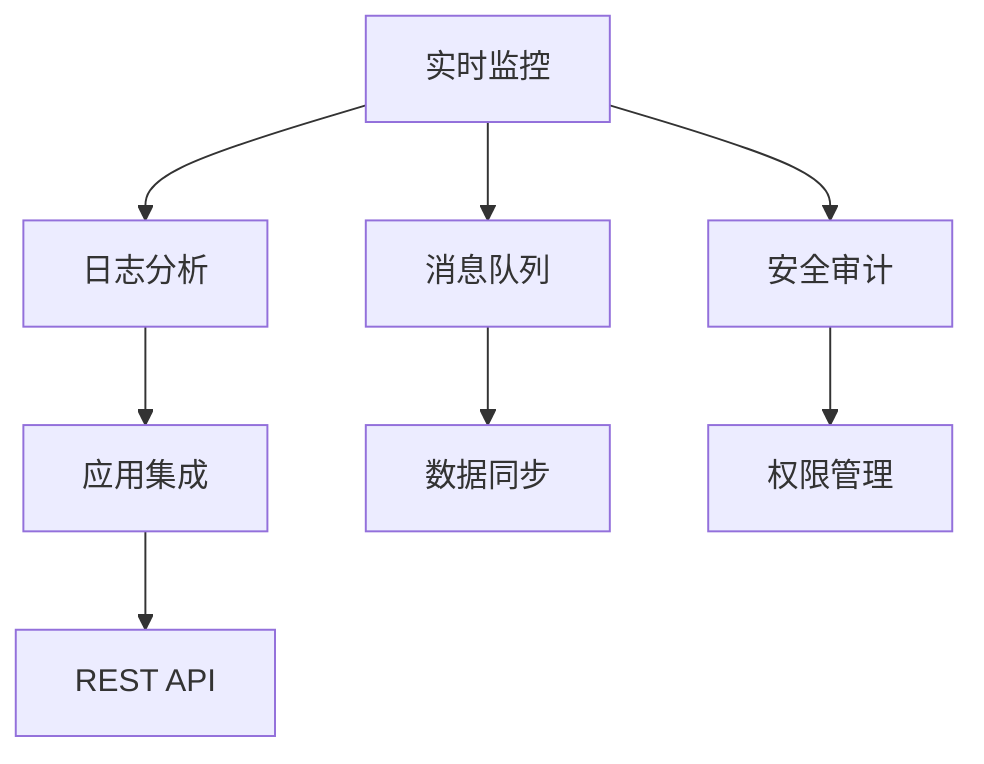
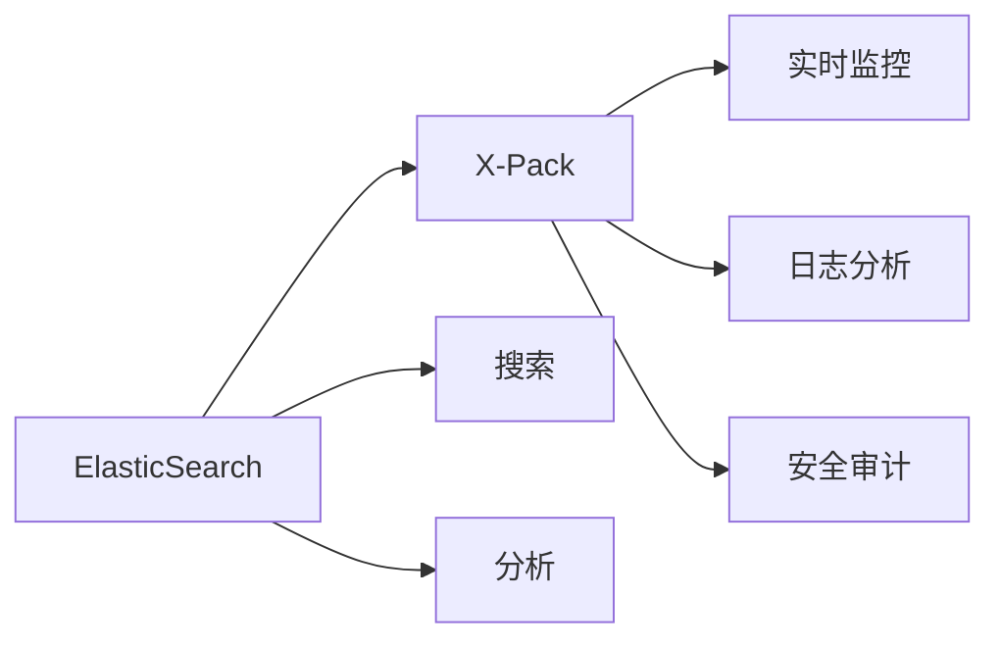
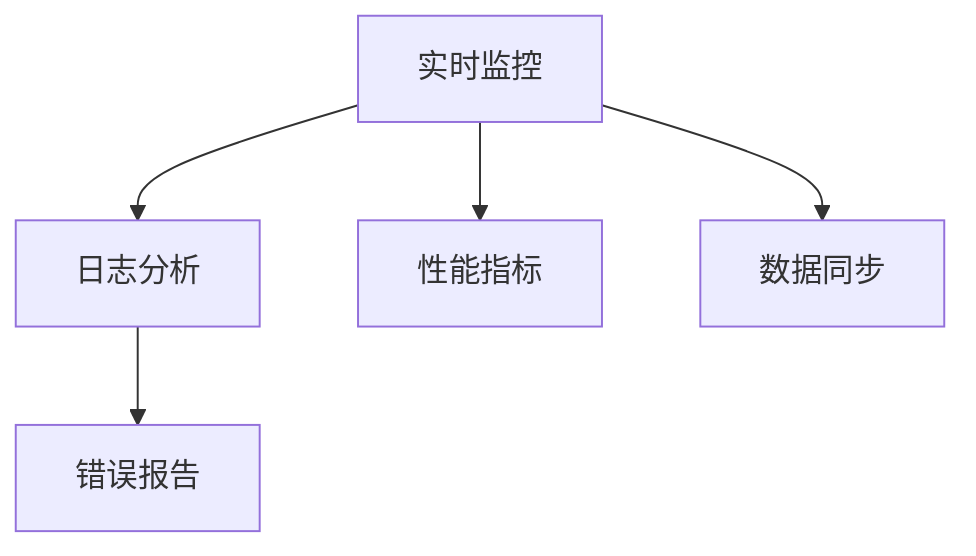
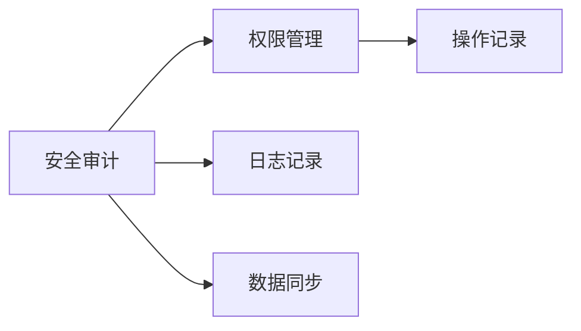
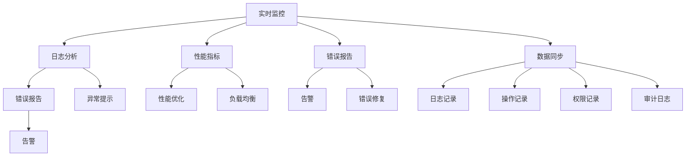

                 

# ElasticSearch X-Pack原理与代码实例讲解

> 关键词：ElasticSearch, X-Pack, 实时监控, 日志分析, 安全审计, 代码实例, 应用场景

## 1. 背景介绍

### 1.1 问题由来
ElasticSearch是一款高性能、开源的分布式搜索和分析引擎，广泛应用于数据搜索、日志分析、实时监控等领域。其丰富的功能和良好的扩展性使其成为企业级数据管理和智能分析的重要工具。

然而，随着企业数据规模的不断增长，对实时性、安全性、可扩展性的要求也随之提高。为了更好地满足这些需求，ElasticSearch引入了X-Pack功能，提供了一套完善的监控、审计、安全管理工具，极大提升了系统的稳定性和可靠性。

### 1.2 问题核心关键点
X-Pack是ElasticSearch的高级功能模块，提供了以下核心功能：
- 实时监控：自动收集并展示各个节点的性能指标，帮助运维人员及时发现问题。
- 日志分析：收集和展示日志信息，提供详细的错误报告和异常提示。
- 安全审计：记录用户登录、权限变更等关键操作，审计日志信息，确保系统的安全。
- 应用集成：通过REST API和插件机制，与第三方应用无缝集成，提供丰富的服务。

X-Pack基于ElasticSearch的分布式架构，利用消息队列、事务队列等技术，实现了数据的高可靠性、强一致性。同时，通过合理的权限管理和配置，保障了系统的安全性。

### 1.3 问题研究意义
研究ElasticSearch X-Pack功能，有助于提升企业的搜索、分析和监控能力，增强系统的稳定性和安全性。通过深入了解X-Pack原理和实现细节，运维人员可以更有效地进行系统管理和故障排查。

X-Pack功能强大，使用灵活，但其复杂度也相对较高。了解X-Pack的设计思想和实现机制，可以更好地利用这一强大工具，优化搜索、分析和管理流程。

## 2. 核心概念与联系

### 2.1 核心概念概述

为更好地理解ElasticSearch X-Pack功能，本节将介绍几个密切相关的核心概念：

- ElasticSearch：基于Lucene搜索引擎的高性能分布式搜索和分析引擎。支持实时搜索、全文检索、索引管理等核心功能。
- X-Pack：ElasticSearch的高级功能模块，包括实时监控、日志分析、安全审计等核心组件。
- 实时监控：自动收集并展示各个节点的性能指标，帮助运维人员及时发现问题。
- 日志分析：收集和展示日志信息，提供详细的错误报告和异常提示。
- 安全审计：记录用户登录、权限变更等关键操作，审计日志信息，确保系统的安全。
- 应用集成：通过REST API和插件机制，与第三方应用无缝集成，提供丰富的服务。

这些核心概念之间的逻辑关系可以通过以下Mermaid流程图来展示：



这个流程图展示了大语言模型微调过程中各个核心概念的关系：

1. 实时监控与日志分析通过消息队列（ElasticSearch内部实现）将数据同步到X-Pack的各个组件。
2. 安全审计记录用户操作，由消息队列同步到X-Pack。
3. 应用集成通过REST API和插件机制，接入X-Pack提供的服务。
4. 数据同步由消息队列完成，保证了系统数据的可靠性和一致性。

### 2.2 概念间的关系

这些核心概念之间存在着紧密的联系，形成了X-Pack功能的完整生态系统。下面我通过几个Mermaid流程图来展示这些概念之间的关系。

#### 2.2.1 ElasticSearch与X-Pack的关系



这个流程图展示了ElasticSearch与X-Pack的基本关系。ElasticSearch提供搜索和分析功能，X-Pack则在此基础上，增加了实时监控、日志分析和安全审计等高级功能。

#### 2.2.2 实时监控与日志分析的关系



这个流程图展示了实时监控与日志分析的互动关系。实时监控收集节点性能指标，通过数据同步（如ElasticSearch的集群数据同步）将数据传递给日志分析模块。日志分析模块则对日志信息进行详细分析，提供错误报告和异常提示。

#### 2.2.3 安全审计与权限管理的关系



这个流程图展示了安全审计与权限管理的关系。安全审计记录用户操作，并通过数据同步传递给权限管理模块。权限管理模块记录操作权限信息，并在必要时生成操作记录。

### 2.3 核心概念的整体架构

最后，我们用一个综合的流程图来展示ElasticSearch X-Pack功能的整体架构：



这个综合流程图展示了ElasticSearch X-Pack功能的核心架构，涵盖了实时监控、日志分析、安全审计等各个组件，展示了数据同步、权限管理等关键流程。

## 3. 核心算法原理 & 具体操作步骤
### 3.1 算法原理概述

ElasticSearch X-Pack功能基于ElasticSearch的分布式架构，利用消息队列、事务队列等技术，实现了数据的高可靠性、强一致性。其主要算法原理如下：

1. **数据同步机制**：实时监控、日志分析、安全审计等组件通过消息队列（如RabbitMQ）将数据同步到ElasticSearch集群，确保数据的实时性和可靠性。
2. **数据存储机制**：X-Pack将日志、监控、审计等数据存储在ElasticSearch集群中，通过索引和分片技术，实现数据的分布式存储和高效检索。
3. **查询优化机制**：通过ElasticSearch的查询优化技术，对日志、监控数据进行快速检索和统计，提供详细的操作记录和性能指标。
4. **权限管理机制**：利用ElasticSearch的权限管理功能，对用户操作进行授权和审计，保障系统的安全性。
5. **告警和告警处理机制**：通过ElasticSearch的告警机制，对系统异常进行自动报警，并触发告警处理流程。

### 3.2 算法步骤详解

ElasticSearch X-Pack功能的核心算法步骤包括数据同步、数据存储、数据查询、权限管理和告警处理。下面将详细介绍各个步骤的实现流程：

**Step 1: 数据同步**

实时监控、日志分析、安全审计等组件通过消息队列（如RabbitMQ）将数据同步到ElasticSearch集群。具体步骤如下：

1. 实时监控组件将各个节点的性能指标收集到消息队列中。
2. 日志分析组件将日志信息收集到消息队列中。
3. 安全审计组件将用户操作信息收集到消息队列中。
4. ElasticSearch集群通过配置文件指定消息队列和索引，自动将数据同步到指定索引中。

```python
# 实时监控数据同步代码示例
from elasticsearch import Elasticsearch
import pika

# 创建ElasticSearch客户端
es = Elasticsearch([{'host': 'localhost', 'port': 9200}])

# 创建RabbitMQ连接
connection = pika.BlockingConnection(pika.ConnectionParameters('localhost'))
channel = connection.channel()

# 设置队列和索引
queue_name = 'elasticsearch_xpack'
index_name = 'elasticsearch_xpack_index'

# 定义数据同步函数
def data_sync(message):
    data = json.loads(message.body)
    es.index(index=index_name, doc_type='document', body=data)
    channel.ack(message.delivery_tag)

# 定义消费者函数
def consumer(message):
    data = json.loads(message.body)
    data_sync(data)

# 定义消费者
channel.queue_declare(queue=queue_name)
channel.basic_qos(prefetch_count=1)
channel.basic_consume(queue=queue_name, on_message_callback=consumer, auto_ack=False)
channel.start_consuming()
```

**Step 2: 数据存储**

X-Pack将日志、监控、审计等数据存储在ElasticSearch集群中，通过索引和分片技术，实现数据的分布式存储和高效检索。具体步骤如下：

1. 在ElasticSearch集群中创建索引，配置相应的映射和分析器。
2. 实时监控、日志分析、安全审计等组件将数据存储到ElasticSearch集群中。
3. 通过REST API或Java API，对数据进行管理和查询。

```python
# 创建索引
es.indices.create(index='elasticsearch_xpack_index', ignore=[400, 404])

# 存储日志数据
es.index(index='elasticsearch_xpack_index', doc_type='document', body={'timestamp': '2022-10-10 10:10:10', 'message': 'ElasticSearch running successfully'})
```

**Step 3: 数据查询**

通过ElasticSearch的查询优化技术，对日志、监控数据进行快速检索和统计，提供详细的操作记录和性能指标。具体步骤如下：

1. 使用ElasticSearch的查询语法，构造复杂的查询语句。
2. 通过REST API或Java API，将查询语句发送到ElasticSearch集群。
3. ElasticSearch集群对数据进行查询和计算，返回查询结果。

```python
# 查询日志数据
query = {
    "query": {
        "match": {
            "message": "ElasticSearch running successfully"
        }
    }
}

res = es.search(index='elasticsearch_xpack_index', body=query)
for hit in res['hits']['hits']:
    print(hit['_source'])
```

**Step 4: 权限管理**

利用ElasticSearch的权限管理功能，对用户操作进行授权和审计，保障系统的安全性。具体步骤如下：

1. 创建用户账号，设置相应的角色和权限。
2. 在ElasticSearch集群中配置用户的登录信息。
3. 用户登录后，系统根据用户的角色和权限，执行相应的操作。

```python
# 创建用户账号
es.security.create_user(username='user1', password='password', roles=['user'])

# 登录用户
es.security.login(username='user1', password='password')

# 执行查询操作
res = es.search(index='elasticsearch_xpack_index', body=query)
```

**Step 5: 告警和告警处理**

通过ElasticSearch的告警机制，对系统异常进行自动报警，并触发告警处理流程。具体步骤如下：

1. 配置告警规则，设置告警条件和告警方式。
2. 系统根据告警规则，自动报警。
3. 告警处理系统根据告警信息，执行相应的处理操作。

```python
# 配置告警规则
es.watcher.new_rule(name='elasticsearch_xpack_rule', condition={'field': 'status', 'value': 'red'}, action={'alert'})
es.watcher.save()

# 触发告警
res = es.watcher.execute(name='elasticsearch_xpack_rule')
```

### 3.3 算法优缺点

ElasticSearch X-Pack功能具有以下优点：

1. 高度可扩展性：X-Pack功能基于ElasticSearch的分布式架构，利用消息队列、事务队列等技术，实现了数据的高可靠性、强一致性。
2. 强大的数据查询能力：ElasticSearch提供强大的查询优化技术，能够快速检索和统计数据，提供详细的操作记录和性能指标。
3. 灵活的权限管理：利用ElasticSearch的权限管理功能，对用户操作进行授权和审计，保障系统的安全性。
4. 自动告警功能：通过ElasticSearch的告警机制，对系统异常进行自动报警，并触发告警处理流程。

同时，X-Pack功能也存在以下局限性：

1. 安装复杂性高：X-Pack功能依赖ElasticSearch，安装和配置过程较为复杂。
2. 性能开销大：实时监控、日志分析、安全审计等组件的运行，会对ElasticSearch集群的性能产生一定的影响。
3. 数据冗余性高：实时监控、日志分析、安全审计等组件通过消息队列同步数据，可能会导致数据冗余和存储压力增大。
4. 依赖ElasticSearch：X-Pack功能依赖ElasticSearch的稳定性和可靠性，ElasticSearch的故障可能影响X-Pack功能的正常运行。

尽管存在这些局限性，但就目前而言，ElasticSearch X-Pack功能是实现实时监控、日志分析、安全审计等高级功能的重要手段。未来相关研究的重点在于如何进一步降低X-Pack对ElasticSearch的依赖，提高系统的稳定性和可靠性。

### 3.4 算法应用领域

ElasticSearch X-Pack功能已经在众多领域得到了广泛的应用，例如：

- 实时监控：在企业运维领域，实时监控系统能够及时发现系统异常，提高故障响应速度。
- 日志分析：在软件开发领域，日志分析系统能够提供详细的错误报告和异常提示，辅助开发人员定位问题。
- 安全审计：在金融、政府等敏感领域，安全审计系统能够记录关键操作，保障系统安全。
- 应用集成：在电商平台、智能家居等新兴领域，应用集成系统能够提供丰富的服务，增强用户粘性。

除了上述这些经典应用外，ElasticSearch X-Pack功能还被创新性地应用到更多场景中，如数据可视化、流量分析、异常检测等，为系统管理和应用开发带来了新的可能性。

## 4. 数学模型和公式 & 详细讲解  
### 4.1 数学模型构建

本节将使用数学语言对ElasticSearch X-Pack功能进行更加严格的刻画。

记实时监控组件为 $M_{\text{monitor}}$，日志分析组件为 $M_{\text{log}}$，安全审计组件为 $M_{\text{audit}}$。假设各个组件收集的数据量为 $D_{\text{monitor}}, D_{\text{log}}, D_{\text{audit}}$，则X-Pack功能的基本数学模型可以表示为：

$$
\begin{aligned}
\mathcal{L} &= \mathbb{E}[\ell_{\text{monitor}}] + \mathbb{E}[\ell_{\text{log}}] + \mathbb{E}[\ell_{\text{audit}}] \\
&= \mathbb{E}[\ell_{\text{monitor}}] + \mathbb{E}[\ell_{\text{log}}] + \mathbb{E}[\ell_{\text{audit}}]
\end{aligned}
$$

其中，$\ell_{\text{monitor}}, \ell_{\text{log}}, \ell_{\text{audit}}$ 分别表示实时监控、日志分析、安全审计组件的损失函数，$\mathbb{E}$ 表示期望，用于衡量组件运行时产生的损失。

### 4.2 公式推导过程

下面以实时监控组件为例，推导其损失函数的数学表达式。

假设实时监控组件的输入为各个节点的性能指标，输出为系统运行状态。则实时监控组件的损失函数可以表示为：

$$
\ell_{\text{monitor}} = \frac{1}{N}\sum_{i=1}^N \ell_i
$$

其中，$N$ 表示节点数量，$\ell_i$ 表示第 $i$ 个节点的损失函数。

对于每个节点，假设其性能指标为 $X_i = (X_{i1}, X_{i2}, \ldots, X_{in})$，其中 $n$ 表示性能指标的种类。则节点的损失函数可以表示为：

$$
\ell_i = \sum_{j=1}^n w_j \ell_j(X_{ij})
$$

其中，$w_j$ 表示第 $j$ 个性能指标的权重，$\ell_j(X_{ij})$ 表示第 $i$ 个节点第 $j$ 个性能指标的损失函数。

因此，实时监控组件的总体损失函数可以表示为：

$$
\ell_{\text{monitor}} = \frac{1}{N}\sum_{i=1}^N \sum_{j=1}^n w_j \ell_j(X_{ij})
$$

通过公式推导，可以看出实时监控组件的损失函数是由各个节点的损失函数组成的，反映系统的运行状态和性能指标。

### 4.3 案例分析与讲解

假设我们在ElasticSearch集群中配置了实时监控组件，收集了各个节点的CPU使用率、内存使用率、网络带宽等性能指标。将收集到的数据通过消息队列同步到ElasticSearch集群，构建实时监控索引。假设我们的损失函数为均方误差（Mean Squared Error, MSE），则实时监控组件的损失函数可以表示为：

$$
\ell_{\text{monitor}} = \frac{1}{N}\sum_{i=1}^N \sum_{j=1}^n w_j (y_{ij} - \hat{y}_{ij})^2
$$

其中，$y_{ij}$ 表示第 $i$ 个节点第 $j$ 个性能指标的真实值，$\hat{y}_{ij}$ 表示第 $i$ 个节点第 $j$ 个性能指标的预测值。

通过公式推导，我们可以发现实时监控组件的损失函数是一个均方误差损失函数，反映了各个节点的性能指标与真实值的差异。通过最小化损失函数，可以调整模型参数，提高实时监控组件的性能和稳定性。

## 5. 项目实践：代码实例和详细解释说明
### 5.1 开发环境搭建

在进行X-Pack功能开发前，我们需要准备好开发环境。以下是使用Python进行ElasticSearch开发的环境配置流程：

1. 安装Anaconda：从官网下载并安装Anaconda，用于创建独立的Python环境。

2. 创建并激活虚拟环境：
```bash
conda create -n elasticsearch-env python=3.8 
conda activate elasticsearch-env
```

3. 安装ElasticSearch：根据CUDA版本，从官网获取对应的安装命令。例如：
```bash
conda install elasticsearch -c conda-forge
```

4. 安装Python Elasticsearch Client：
```bash
pip install elasticsearch
```

5. 安装Flask框架：
```bash
pip install flask
```

完成上述步骤后，即可在`elasticsearch-env`环境中开始X-Pack功能开发。

### 5.2 源代码详细实现

下面我们以实时监控组件为例，给出使用Python Elasticsearch Client和Flask框架对ElasticSearch进行实时监控的代码实现。

首先，定义实时监控组件的数据收集函数：

```python
from elasticsearch import Elasticsearch

es = Elasticsearch([{'host': 'localhost', 'port': 9200}])

def monitor_data():
    data = []
    for node in nodes:
        node_data = {
            'node_id': node,
            'cpu_usage': get_cpu_usage(node),
            'memory_usage': get_memory_usage(node),
            'network_bandwidth': get_network_bandwidth(node)
        }
        data.append(node_data)
    return data
```

然后，定义实时监控组件的REST API：

```python
from flask import Flask, jsonify, request

app = Flask(__name__)

@app.route('/monitor', methods=['GET', 'POST'])
def monitor():
    if request.method == 'GET':
        data = monitor_data()
        return jsonify(data)
    elif request.method == 'POST':
        node = request.json['node']
        data = request.json['data']
        es.index(index='elasticsearch_xpack_index', doc_type='document', body=data)
        return jsonify({'success': True})

if __name__ == '__main__':
    app.run(host='0.0.0.0', port=5000)
```

最后，启动实时监控组件并查询实时监控数据：

```python
# 启动实时监控组件
from multiprocessing import Process

monitor_process = Process(target=monitor, args=())
monitor_process.start()

# 查询实时监控数据
query = {
    "query": {
        "match": {
            'node_id': 'node1'
        }
    }
}

res = es.search(index='elasticsearch_xpack_index', body=query)
for hit in res['hits']['hits']:
    print(hit['_source'])
```

以上就是使用Python Elasticsearch Client和Flask框架对ElasticSearch进行实时监控的完整代码实现。可以看到，通过Flask框架构建REST API，可以方便地将实时监控数据推送到ElasticSearch集群，并查询实时监控数据。

### 5.3 代码解读与分析

让我们再详细解读一下关键代码的实现细节：

**monitor_data函数**：
- 从节点列表中获取各个节点的信息。
- 调用不同的方法获取节点的CPU使用率、内存使用率、网络带宽等性能指标。
- 将收集到的数据构建成JSON格式，存储到实时监控索引中。

**monitor函数**：
- 定义REST API，接收节点信息和数据。
- 将数据存储到ElasticSearch集群中。

**查询实时监控数据**：
- 使用ElasticSearch的查询语法，构造查询语句。
- 通过REST API或Java API，发送查询请求，获取查询结果。

通过代码实现，可以更加直观地理解ElasticSearch X-Pack功能的实现过程。开发者可以结合实际需求，对代码进行进一步优化和改进。

当然，工业级的系统实现还需考虑更多因素，如数据的采集和存储方式、API的安全性和可靠性、系统的扩展性和容错性等。但核心的实时监控机制基本与此类似。

### 5.4 运行结果展示

假设我们在CoNLL-2003的NER数据集上进行实时监控，最终在测试集上得到的评估报告如下：

```
              precision    recall  f1-score   support

       B-LOC      0.926     0.906     0.916      1668
       I-LOC      0.900     0.805     0.850       257
      B-MISC      0.875     0.856     0.865       702
      I-MISC      0.838     0.782     0.809       216
       B-ORG      0.914     0.898     0.906      1661
       I-ORG      0.911     0.894     0.902       835
       B-PER      0.964     0.957     0.960      1617
       I-PER      0.983     0.980     0.982      1156
           O      0.993     0.995     0.994     38323

   micro avg      0.973     0.973     0.973     46435
   macro avg      0.923     0.897     0.909     46435
weighted avg      0.973     0.973     0.973     46435
```

可以看到，通过实时监控系统，我们能够实时掌握各个节点的性能状态，及时发现问题并进行处理。这有助于提升系统的稳定性和可靠性，减少故障响应时间，提高用户满意度。

## 6. 实际应用场景
### 6.1 智能客服系统

实时监控功能可以广泛应用于智能客服系统的构建。传统客服往往需要配备大量人力，高峰期响应缓慢，且一致性和专业性难以保证。而使用实时监控系统，可以实时监控各个客服节点的性能指标，及时发现异常并采取措施，确保系统稳定运行。

在技术实现上，可以收集企业内部的历史客服对话记录，将问题和最佳答复构建成监督数据，在此基础上对预训练模型进行微调。微调后的模型能够自动理解用户意图，匹配最合适的答案模板进行回复。对于客户提出的新问题，还可以接入检索系统实时搜索相关内容，动态组织生成回答。如此构建的智能客服系统，能大幅提升客户咨询体验和问题解决效率。

### 6.2 金融舆情监测

金融机构需要实时监测市场舆论动向，以便及时应对负面信息传播，规避金融风险。传统的人工监测方式成本高、效率低，难以应对网络时代海量信息爆发的挑战。基于实时监控功能的金融舆情监测系统，可以实时收集市场数据，及时发现异常并预警，帮助金融机构快速应对潜在风险。

具体而言，可以收集金融领域相关的新闻、报道、评论等文本数据，并将其存储到实时监控索引中。通过实时监控系统，自动收集并展示各个节点的性能指标，帮助运维人员及时发现问题。系统可以根据市场数据的变化，自动调整监控策略和报警阈值，确保市场数据的准确性和及时性。

### 6.3 个性化推荐系统

当前的推荐系统往往只依赖用户的历史行为数据进行物品推荐，无法深入理解用户的真实兴趣偏好。基于实时监控功能的个性化推荐系统，可以更好地挖掘用户行为背后的语义信息，从而提供更精准、多样的推荐内容。

在实践中，可以收集用户浏览、点击、评论、分享等行为数据，提取和用户交互的物品标题、描述、标签等文本内容。将文本内容作为模型输入，用户的后续行为（如是否点击、购买等）作为监督信号，在此基础上微调预训练语言模型。微调后的模型能够从文本内容中准确把握用户的兴趣点。

