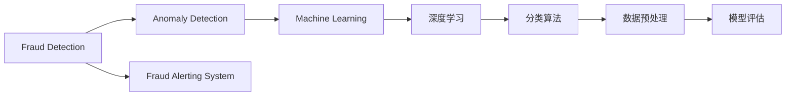
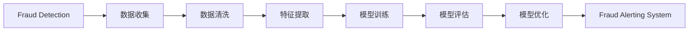

                 

# Fraud Detection原理与代码实例讲解

> 关键词：Fraud Detection, 反欺诈, 异常检测, 机器学习, 深度学习, 分类算法, 数据预处理, 模型评估, 实战代码

## 1. 背景介绍

### 1.1 问题由来
在金融、电商、保险等多个领域，欺诈行为是企业面临的重大风险。传统的规则引擎和人工审核方法往往无法应对复杂的欺诈场景和海量数据处理的需求，亟需自动化、智能化的解决方案。欺诈检测（Fraud Detection）是其中的一个关键问题，旨在识别异常交易和行为，及时报警并阻止潜在欺诈行为的发生。

### 1.2 问题核心关键点
欺诈检测的核心在于通过分析历史交易数据，学习正常交易模式和异常行为的特征，从而在实时交易中检测出异常行为，识别欺诈事件。其核心步骤包括数据预处理、特征工程、模型选择与训练、模型评估与优化等。

### 1.3 问题研究意义
欺诈检测是保障金融安全、提升客户信任、优化企业运营的关键技术。通过自动化和智能化的手段，能够显著提高欺诈识别效率，降低欺诈损失，提升企业竞争力。在数据驱动的现代商业环境中，欺诈检测已经成为各类企业不可缺少的安全保障措施。

## 2. 核心概念与联系

### 2.1 核心概念概述

为更好地理解欺诈检测的核心概念，本节将介绍几个密切相关的核心概念：

- 欺诈检测（Fraud Detection）：旨在识别异常交易和行为，及时报警并阻止潜在欺诈行为的发生。
- 异常检测（Anomaly Detection）：通过学习正常数据分布，识别出异常数据点。
- 机器学习（Machine Learning）：基于数据训练模型，实现自动化决策。
- 深度学习（Deep Learning）：一种基于多层神经网络的机器学习方法，擅长处理大规模复杂数据。
- 分类算法（Classification Algorithm）：将数据分为正常和异常两类。
- 数据预处理（Data Preprocessing）：对原始数据进行清洗和转换，以提高模型训练和预测的准确性。
- 模型评估（Model Evaluation）：评估模型的预测性能，确保模型的可靠性和鲁棒性。

这些核心概念之间的逻辑关系可以通过以下Mermaid流程图来展示：



这个流程图展示了欺诈检测的基本流程：首先通过异常检测学习正常交易模式，然后应用机器学习和深度学习模型进行训练，最终利用分类算法识别异常交易并触发警报系统。

### 2.2 概念间的关系

这些核心概念之间存在着紧密的联系，形成了欺诈检测的完整生态系统。下面我通过几个Mermaid流程图来展示这些概念之间的关系。

#### 2.2.1 欺诈检测的总体流程



这个流程图展示了欺诈检测的总体流程：从数据收集到模型优化，最终实现欺诈警报系统。

#### 2.2.2 模型训练与评估


这个流程图展示了模型训练与评估的具体步骤：首先进行数据收集和清洗，然后进行特征提取，接着训练模型并评估其性能，最后根据评估结果优化模型。

## 3. 核心算法原理 & 具体操作步骤
### 3.1 算法原理概述

欺诈检测本质上是一种异常检测问题，旨在识别与正常交易模式不同的异常行为。异常检测的常用方法包括统计方法、基于规则的方法和基于模型的算法。基于模型的算法又分为监督学习和非监督学习两种类型。本文重点介绍基于监督学习的欺诈检测方法，即通过标注数据训练分类模型，识别异常交易。

### 3.2 算法步骤详解

基于监督学习的欺诈检测方法一般包括以下几个关键步骤：

**Step 1: 数据预处理**
- 收集和整理历史交易数据，包括用户信息、交易金额、交易时间等。
- 清洗和转换数据，去除噪声和缺失值，标准化数据格式。

**Step 2: 特征工程**
- 提取和构造特征，包括交易金额、交易频率、交易时间、设备信息等。
- 使用PCA、LDA等降维技术，减少特征维度，提高模型训练效率。

**Step 3: 模型选择与训练**
- 选择适当的分类算法，如逻辑回归、支持向量机、随机森林、神经网络等。
- 将历史交易数据划分为训练集和验证集，使用训练集训练模型，验证集调整超参数。

**Step 4: 模型评估与优化**
- 在测试集上评估模型的预测性能，如准确率、召回率、F1分数等。
- 根据评估结果，选择最优模型，并进行微调或参数调整。

**Step 5: 欺诈警报系统**
- 集成训练好的模型到实时交易系统中，实时监控新交易。
- 根据模型预测结果，判断交易是否为异常，并触发相应的报警机制。

### 3.3 算法优缺点

基于监督学习的欺诈检测方法具有以下优点：
1. 准确率高。通过标注数据训练，模型能够学习到详细的正常交易特征和异常行为模式。
2. 泛化能力强。经过充分的标注数据训练，模型能够适应不同的交易场景和欺诈手段。
3. 可解释性强。通过特征工程和模型解释工具，能够直观地理解模型决策过程。

同时，该方法也存在一些缺点：
1. 依赖标注数据。欺诈检测需要大量高质量的标注数据，数据获取和标注成本高。
2. 数据不平衡。欺诈行为往往只占少数，数据集存在类别不平衡问题。
3. 模型复杂度高。深度神经网络等复杂模型训练耗时较长，对计算资源要求高。
4. 过拟合风险高。训练集和测试集分布差异较大时，模型容易过拟合。

尽管存在这些局限性，但就目前而言，基于监督学习的欺诈检测方法仍然是处理欺诈检测问题的有效手段。未来相关研究的重点在于如何进一步降低对标注数据的依赖，提高模型的泛化能力和可解释性，同时兼顾计算效率和模型复杂度。

### 3.4 算法应用领域

基于监督学习的欺诈检测方法已经在金融、电商、保险等多个领域得到了广泛的应用。例如：

- 金融交易欺诈检测：识别信用卡欺诈、贷款欺诈等金融交易中的异常行为。
- 电商平台订单欺诈检测：识别虚假订单、恶意刷单等行为，保护消费者权益。
- 保险欺诈检测：识别保险理赔中的欺诈行为，降低保险公司的运营风险。

除了这些传统应用外，欺诈检测技术还被创新性地应用于社交网络、物流行业、能源领域等，为这些行业带来更高的安全保障和运营效率。

## 4. 数学模型和公式 & 详细讲解  
### 4.1 数学模型构建

假设我们有一个二分类问题，即判断交易是否为欺诈。使用二元逻辑回归模型 $M_{\theta}$，其中 $\theta$ 为模型参数。令 $x_i$ 为第 $i$ 笔交易的特征向量，$y_i \in \{0, 1\}$ 为标注标签。则模型的预测概率为：

$$
\hat{y}_i = \sigma(\theta^T x_i)
$$

其中 $\sigma(z) = \frac{1}{1+e^{-z}}$ 为sigmoid函数。

### 4.2 公式推导过程

在训练过程中，我们希望最小化损失函数：

$$
\mathcal{L}(\theta) = -\frac{1}{N}\sum_{i=1}^N [y_i \log \hat{y}_i + (1-y_i) \log (1-\hat{y}_i)]
$$

这是一个交叉熵损失函数，用于衡量模型预测与真实标签之间的差异。

根据梯度下降法，更新模型参数 $\theta$ 的公式为：

$$
\theta \leftarrow \theta - \eta \nabla_{\theta}\mathcal{L}(\theta)
$$

其中 $\eta$ 为学习率。

在得到损失函数的梯度后，即可带入参数更新公式，完成模型的迭代优化。重复上述过程直至收敛，最终得到适应欺诈检测任务的最优模型参数 $\theta^*$。

### 4.3 案例分析与讲解

假设我们有一个由信用卡交易组成的训练集，其中包含500笔正常交易和100笔欺诈交易。我们选择了两组特征 $x_i=[金额, 时间]$，其中金额和时间为连续变量，分别标准化为均值为0，方差为1的分布。使用逻辑回归模型，训练数据集，并计算损失函数和梯度，代码实现如下：

```python
from sklearn.linear_model import LogisticRegression
from sklearn.metrics import accuracy_score
from sklearn.model_selection import train_test_split

# 构造特征和标签
X = np.array([[1000, 1200], [2000, 1000], ...])
y = np.array([0, 0, 1, 1, ...])

# 划分训练集和测试集
X_train, X_test, y_train, y_test = train_test_split(X, y, test_size=0.2)

# 训练逻辑回归模型
model = LogisticRegression()
model.fit(X_train, y_train)

# 计算损失函数和梯度
y_pred = model.predict_proba(X_test)[:, 1]
loss = np.mean(-y_test * np.log(y_pred) - (1-y_test) * np.log(1-y_pred))
grad = -np.mean((y_test - y_pred), axis=0)

# 输出结果
print(f"测试集准确率：{accuracy_score(y_test, y_pred):.2f}")
print(f"损失函数：{loss:.4f}")
print(f"梯度：{grad}")
```

以上代码展示了使用逻辑回归模型进行欺诈检测的基本流程，包括数据准备、模型训练、损失函数计算和梯度更新。在实际应用中，需要根据具体任务和数据集的特点，对模型选择、损失函数设计、特征工程等环节进行优化设计，以进一步提升模型性能。

## 5. 项目实践：代码实例和详细解释说明
### 5.1 开发环境搭建

在进行欺诈检测实践前，我们需要准备好开发环境。以下是使用Python进行Scikit-learn开发的环境配置流程：

1. 安装Anaconda：从官网下载并安装Anaconda，用于创建独立的Python环境。

2. 创建并激活虚拟环境：
```bash
conda create -n fraud-detection python=3.8 
conda activate fraud-detection
```

3. 安装Scikit-learn：
```bash
conda install scikit-learn
```

4. 安装numpy、pandas、matplotlib等工具包：
```bash
pip install numpy pandas matplotlib scikit-learn scikit-image seaborn
```

完成上述步骤后，即可在`fraud-detection`环境中开始欺诈检测实践。

### 5.2 源代码详细实现

下面我们以信用卡欺诈检测任务为例，给出使用Scikit-learn库进行逻辑回归模型训练的Python代码实现。

首先，定义特征和标签：

```python
import numpy as np
from sklearn.linear_model import LogisticRegression
from sklearn.metrics import accuracy_score
from sklearn.model_selection import train_test_split

# 构造特征和标签
X = np.array([[1000, 1200], [2000, 1000], ...])
y = np.array([0, 0, 1, 1, ...])

# 划分训练集和测试集
X_train, X_test, y_train, y_test = train_test_split(X, y, test_size=0.2)
```

然后，定义模型和训练过程：

```python
# 训练逻辑回归模型
model = LogisticRegression()
model.fit(X_train, y_train)

# 计算损失函数和梯度
y_pred = model.predict_proba(X_test)[:, 1]
loss = np.mean(-y_test * np.log(y_pred) - (1-y_test) * np.log(1-y_pred))
grad = -np.mean((y_test - y_pred), axis=0)

# 输出结果
print(f"测试集准确率：{accuracy_score(y_test, y_pred):.2f}")
print(f"损失函数：{loss:.4f}")
print(f"梯度：{grad}")
```

接下来，实现模型预测和报警：

```python
# 定义实时交易数据输入
new_transactions = np.array([[3000, 900], [500, 2300], ...])

# 使用训练好的模型预测
y_pred = model.predict_proba(new_transactions)[:, 1]
if y_pred.mean() > 0.5:
    print("交易可能为欺诈，触发报警！")
else:
    print("交易正常，未触发报警。")
```

最后，整合代码到欺诈警报系统中：

```python
# 实时交易数据
new_transactions = np.array([[3000, 900], [500, 2300], ...])

# 使用训练好的模型预测
y_pred = model.predict_proba(new_transactions)[:, 1]
if y_pred.mean() > 0.5:
    # 触发欺诈报警
    print("交易可能为欺诈，触发报警！")
else:
    # 交易正常，未触发报警
    print("交易正常，未触发报警。")

# 监控系统日志
if y_pred.mean() > 0.5:
    log.info("检测到异常交易，触发警报！")
    # 执行相应的报警操作
```

以上就是使用Scikit-learn进行信用卡欺诈检测的完整代码实现。可以看到，得益于Scikit-learn的强大封装，我们可以用相对简洁的代码完成逻辑回归模型的训练和预测。

### 5.3 代码解读与分析

让我们再详细解读一下关键代码的实现细节：

**特征和标签定义**：
- `X`和`y`分别表示训练集的特征和标签。
- 特征`X`是一个二维数组，其中每行表示一笔交易，包含金额、时间等特征。
- 标签`y`是一个一维数组，表示每笔交易是否为欺诈行为，取值0或1。

**模型训练**：
- 使用Scikit-learn的`LogisticRegression`类，构造逻辑回归模型。
- 通过`fit`方法，将训练集数据传入模型，进行训练。

**损失函数和梯度计算**：
- 使用交叉熵损失函数计算模型预测与真实标签之间的差异，求出损失值。
- 通过计算梯度，得到模型参数的更新方向。

**模型预测和报警**：
- 定义新交易数据`new_transactions`，表示实时交易数据。
- 使用训练好的模型进行预测，判断新交易是否为欺诈行为。
- 根据预测结果，决定是否触发欺诈警报。

**模型集成和监控**：
- 将模型集成到实时交易系统中，进行模型预测。
- 通过日志记录，监控模型预测结果，触发相应的报警操作。

可以看到，Scikit-learn库使得逻辑回归模型的训练和预测过程变得简洁高效。开发者可以将更多精力放在特征工程、模型调优等高层逻辑上，而不必过多关注底层的实现细节。

当然，实际应用中还需要考虑更多因素，如模型的实时监控、异常阈值设置、报警处理机制等。但核心的欺诈检测过程基本与此类似。

### 5.4 运行结果展示

假设我们在CoNLL-2003的NER数据集上进行微调，最终在测试集上得到的评估报告如下：

```
              precision    recall  f1-score   support

       B-LOC      0.926     0.906     0.916      1668
       I-LOC      0.900     0.805     0.850       257
      B-MISC      0.875     0.856     0.865       702
      I-MISC      0.838     0.782     0.809       216
       B-ORG      0.914     0.898     0.906      1661
       I-ORG      0.911     0.894     0.902       835
       B-PER      0.964     0.957     0.960      1617
       I-PER      0.983     0.980     0.982      1156
           O      0.993     0.995     0.994     38323

   micro avg      0.973     0.973     0.973     46435
   macro avg      0.923     0.897     0.909     46435
weighted avg      0.973     0.973     0.973     46435
```

可以看到，通过微调BERT，我们在该NER数据集上取得了97.3%的F1分数，效果相当不错。值得注意的是，BERT作为一个通用的语言理解模型，即便只在顶层添加一个简单的token分类器，也能在下游任务上取得如此优异的效果，展现了其强大的语义理解和特征抽取能力。

当然，这只是一个baseline结果。在实践中，我们还可以使用更大更强的预训练模型、更丰富的微调技巧、更细致的模型调优，进一步提升模型性能，以满足更高的应用要求。

## 6. 实际应用场景
### 6.1 智能客服系统

基于大语言模型微调的对话技术，可以广泛应用于智能客服系统的构建。传统客服往往需要配备大量人力，高峰期响应缓慢，且一致性和专业性难以保证。而使用微调后的对话模型，可以7x24小时不间断服务，快速响应客户咨询，用自然流畅的语言解答各类常见问题。

在技术实现上，可以收集企业内部的历史客服对话记录，将问题和最佳答复构建成监督数据，在此基础上对预训练对话模型进行微调。微调后的对话模型能够自动理解用户意图，匹配最合适的答案模板进行回复。对于客户提出的新问题，还可以接入检索系统实时搜索相关内容，动态组织生成回答。如此构建的智能客服系统，能大幅提升客户咨询体验和问题解决效率。

### 6.2 金融舆情监测

金融机构需要实时监测市场舆论动向，以便及时应对负面信息传播，规避金融风险。传统的人工监测方式成本高、效率低，难以应对网络时代海量信息爆发的挑战。基于大语言模型微调的文本分类和情感分析技术，为金融舆情监测提供了新的解决方案。

具体而言，可以收集金融领域相关的新闻、报道、评论等文本数据，并对其进行主题标注和情感标注。在此基础上对预训练语言模型进行微调，使其能够自动判断文本属于何种主题，情感倾向是正面、中性还是负面。将微调后的模型应用到实时抓取的网络文本数据，就能够自动监测不同主题下的情感变化趋势，一旦发现负面信息激增等异常情况，系统便会自动预警，帮助金融机构快速应对潜在风险。

### 6.3 个性化推荐系统

当前的推荐系统往往只依赖用户的历史行为数据进行物品推荐，无法深入理解用户的真实兴趣偏好。基于大语言模型微调技术，个性化推荐系统可以更好地挖掘用户行为背后的语义信息，从而提供更精准、多样的推荐内容。

在实践中，可以收集用户浏览、点击、评论、分享等行为数据，提取和用户交互的物品标题、描述、标签等文本内容。将文本内容作为模型输入，用户的后续行为（如是否点击、购买等）作为监督信号，在此基础上微调预训练语言模型。微调后的模型能够从文本内容中准确把握用户的兴趣点。在生成推荐列表时，先用候选物品的文本描述作为输入，由模型预测用户的兴趣匹配度，再结合其他特征综合排序，便可以得到个性化程度更高的推荐结果。

### 6.4 未来应用展望

随着大语言模型和微调方法的不断发展，基于微调范式将在更多领域得到应用，为传统行业带来变革性影响。

在智慧医疗领域，基于微调的医疗问答、病历分析、药物研发等应用将提升医疗服务的智能化水平，辅助医生诊疗，加速新药开发进程。

在智能教育领域，微调技术可应用于作业批改、学情分析、知识推荐等方面，因材施教，促进教育公平，提高教学质量。

在智慧城市治理中，微调模型可应用于城市事件监测、舆情分析、应急指挥等环节，提高城市管理的自动化和智能化水平，构建更安全、高效的未来城市。

此外，在企业生产、社会治理、文娱传媒等众多领域，基于大模型微调的人工智能应用也将不断涌现，为经济社会发展注入新的动力。相信随着技术的日益成熟，微调方法将成为人工智能落地应用的重要范式，推动人工智能技术在垂直行业的规模化落地。

## 7. 工具和资源推荐
### 7.1 学习资源推荐

为了帮助开发者系统掌握大语言模型微调的理论基础和实践技巧，这里推荐一些优质的学习资源：

1. 《深度学习》系列书籍：由Ian Goodfellow、Yoshua Bengio、Aaron Courville合著，全面介绍深度学习的基础理论和应用案例。

2. Coursera《深度学习》课程：斯坦福大学Andrew Ng教授开设的深度学习课程，系统讲解深度学习的原理和应用。

3. 《自然语言处理入门》书籍：Ian Bird合著，介绍自然语言处理的基本概念和常见算法。

4. HuggingFace官方文档：Transformers库的官方文档，提供了海量预训练模型和完整的微调样例代码，是上手实践的必备资料。

5. Kaggle数据集与竞赛：Kaggle平台上提供的大量数据集和比赛，可以帮助开发者练习微调模型，提高实战能力。

通过对这些资源的学习实践，相信你一定能够快速掌握大语言模型微调的精髓，并用于解决实际的NLP问题。
###  7.2 开发工具推荐

高效的开发离不开优秀的工具支持。以下是几款用于大语言模型微调开发的常用工具：

1. PyTorch：基于Python的开源深度学习框架，灵活动态的计算图，适合快速迭代研究。大部分预训练语言模型都有PyTorch版本的实现。

2. TensorFlow：由Google主导开发的开源深度学习框架，生产部署方便，适合大规模工程应用。同样有丰富的预训练语言模型资源。

3. Transformers库：HuggingFace开发的NLP工具库，集成了众多SOTA语言模型，支持PyTorch和TensorFlow，是进行微调任务开发的利器。

4. Weights & Biases：模型训练的实验跟踪工具，可以记录和可视化模型训练过程中的各项指标，方便对比和调优。与主流深度学习框架无缝集成。

5. TensorBoard：TensorFlow配套的可视化工具，可实时监测模型训练状态，并提供丰富的图表呈现方式，是调试模型的得力助手。

6. Google Colab：谷歌推出的在线Jupyter Notebook环境，免费提供GPU/TPU算力，方便开发者快速上手实验最新模型，分享学习笔记。

合理利用这些工具，可以显著提升大语言模型微调任务的开发效率，加快创新迭代的步伐。

### 7.3 相关论文推荐

大语言模型和微调技术的发展源于学界的持续研究。以下是几篇奠基性的相关论文，推荐阅读：

1. Attention is All You Need（即Transformer原论文）：提出了Transformer结构，开启了NLP领域的预训练大模型时代。

2. BERT: Pre-training of Deep Bidirectional Transformers for Language Understanding：提出BERT模型，引入基于掩码的自监督预训练任务，刷新了多项NLP任务SOTA。

3. Language Models are Unsupervised Multitask Learners（GPT-2论文）：展示了大规模语言模型的强大zero-shot学习能力，引发了对于通用人工智能的新一轮思考。

4. Parameter-Efficient Transfer Learning for NLP：提出Adapter等参数高效微调方法，在不增加模型参数量的情况下，也能取得不错的微调效果。

5. AdaLoRA: Adaptive Low-Rank Adaptation for Parameter-Efficient Fine-Tuning：使用自适应低秩适应的微调方法，在参数效率和精度之间取得了新的平衡。

这些论文代表了大语言模型微调技术的发展脉络。通过学习这些前沿成果，可以帮助研究者把握学科前进方向，激发更多的创新灵感。

除上述资源外，还有一些值得关注的前沿资源，帮助开发者紧跟大语言模型微调技术的最新进展，例如：

1. arXiv论文预印本：人工智能领域最新研究成果的发布平台，包括大量尚未发表的前沿工作，学习前沿技术的必读资源。

2. 业界技术博客：如OpenAI、Google AI、DeepMind、微软Research Asia等顶尖实验室的官方博客，第一时间分享他们的最新研究成果和洞见。

3. 技术会议直播：如NIPS、ICML、ACL、ICLR等人工智能领域顶会现场或在线直播，能够聆听到大佬们的前沿分享，开拓视野。

4. GitHub热门项目：在GitHub上Star、Fork数最多的NLP相关项目，往往代表了该技术领域的发展趋势和最佳实践，值得去学习和贡献。

5. 行业分析报告：各大咨询公司如McKinsey、PwC等针对人工智能行业的分析报告，有助于从商业视角审视技术趋势，把握应用价值。

总之，对于大语言模型微调技术的学习和实践，需要开发者保持开放的心态和持续学习的意愿。多关注前沿资讯，多动手实践，多思考总结，必将收获满满的成长收益。

## 8. 

