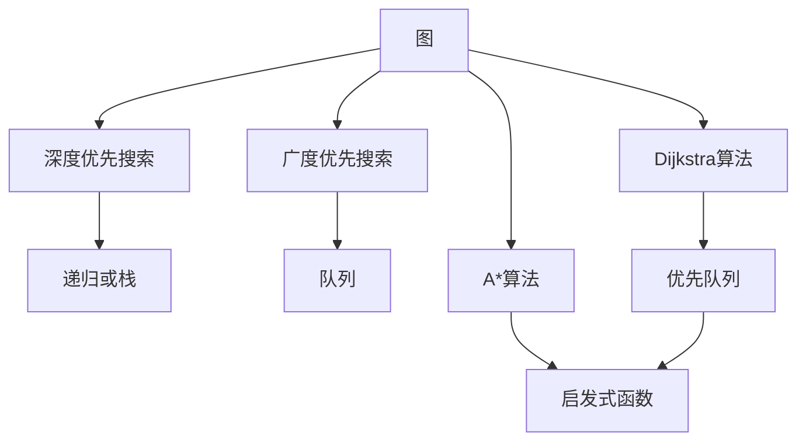
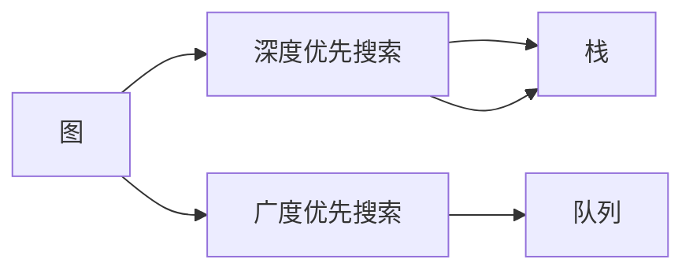
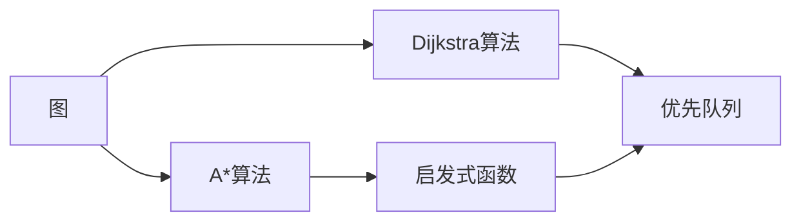
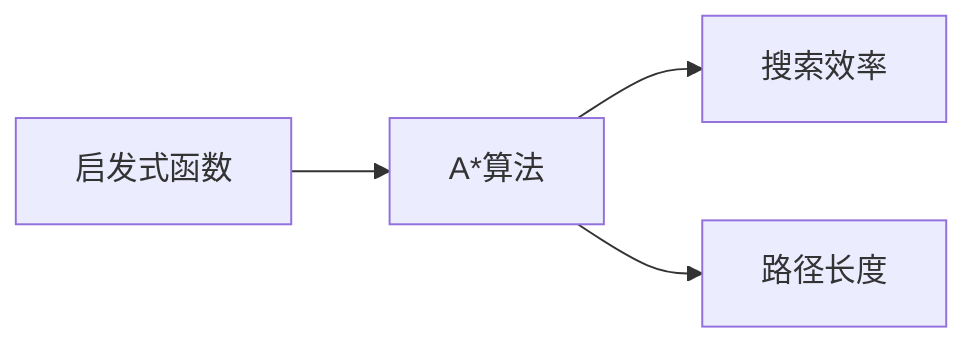
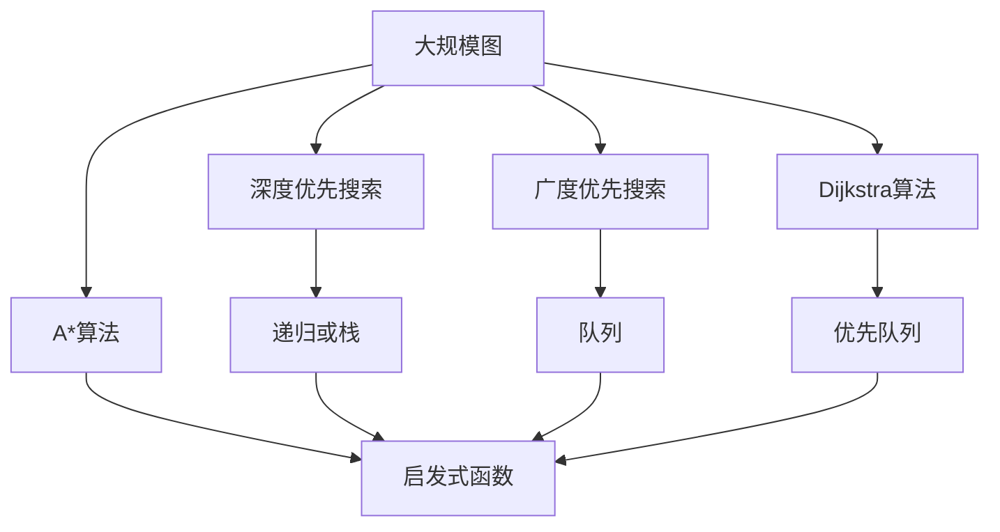

                 

# Graph Path原理与代码实例讲解

> 关键词：图搜索,路径优化,动态规划,深度优先搜索,广度优先搜索

## 1. 背景介绍

### 1.1 问题由来

在计算机科学和图论中，路径问题是一个基本且重要的研究方向。路径问题通常涉及在一个图中找到从起点到终点的路径，以及优化路径长度、权值等问题。这些问题在各种实际应用中都有重要意义，比如网络路由、交通运输规划、金融投资策略等。然而，大规模图上的路径问题往往涉及复杂的计算，需要高效的算法和数据结构来支持。

### 1.2 问题核心关键点

解决路径问题的关键在于如何高效地搜索图和优化路径。当前，主要的方法包括深度优先搜索、广度优先搜索、Dijkstra算法、A*算法等。这些方法各有优缺点，适用于不同的场景和问题。

深度优先搜索（DFS）适用于寻找连通性问题，如连通性检查、生成连通组件等。它的时间复杂度为 $O(|V|+|E|)$，适用于小规模图的搜索。

广度优先搜索（BFS）适用于寻找最短路径、最优解等问题。它的时间复杂度为 $O(|E|+|V|)$，适用于中大规模图的搜索。

Dijkstra算法适用于寻找单源最短路径，适用于权重图。它的时间复杂度为 $O(|E|+|V|\log |V|)$，适用于稠密图的搜索。

A*算法适用于寻找单源最优路径，适用于权重图。它通过启发式函数来引导搜索方向，时间复杂度取决于启发式函数的好坏，但通常比Dijkstra算法更高效。

本文将重点讲解深度优先搜索、广度优先搜索以及Dijkstra算法的基本原理和代码实现，并对比它们的优缺点，同时给出在实际应用中的选择建议。

### 1.3 问题研究意义

解决路径问题在计算图论中有着重要的理论和应用价值：

1. 优化路径：在运输、网络、通信等领域中，路径优化能够有效降低成本、提高效率，如最小路径、最短路径等。
2. 连通性检查：在社交网络、互联网、生物网络等复杂图中，查找连通性有助于发现潜在的关联和社区。
3. 图遍历：路径问题在图遍历中具有基础性作用，如图的深度优先遍历、广度优先遍历等。
4. 复杂性分析：路径问题涉及复杂性理论，有助于理解算法的局限性和可扩展性。

解决路径问题的方法在大规模图上的应用也日益增多，如在社交媒体、物联网、云计算等环境中，路径问题被广泛应用于路由算法、推荐系统、调度算法等。因此，深入理解路径问题算法的基本原理和代码实现，对于从事计算机科学和图论相关工作的人员具有重要意义。

## 2. 核心概念与联系

### 2.1 核心概念概述

为更好地理解路径问题的核心概念，本节将介绍几个密切相关的核心概念：

- 图（Graph）：由节点（Vertex）和边（Edge）构成的集合。用于描述现实世界中的各种关系和连接。
- 深度优先搜索（DFS）：从起点出发，遍历所有路径，直到找到终点或所有路径遍历完为止。通常使用递归或栈数据结构实现。
- 广度优先搜索（BFS）：从起点出发，先遍历所有与起点相邻的节点，再遍历与这些节点相邻的节点，直到找到终点或所有节点遍历完为止。通常使用队列数据结构实现。
- Dijkstra算法：用于寻找单源最短路径的贪心算法。基于优先队列实现，每次选择到起点距离最小的节点进行扩展。
- A*算法：用于寻找单源最优路径的启发式搜索算法。通过启发式函数来选择扩展节点，通常结合了Dijkstra算法和贪心算法的思想。

这些核心概念之间的逻辑关系可以通过以下Mermaid流程图来展示：



这个流程图展示了大规模图上的路径问题算法的基本框架：

1. 图被用来表示现实世界中的各种关系和连接。
2. 深度优先搜索和广度优先搜索是基本的图遍历算法。
3. Dijkstra算法和A*算法是基于图的路径优化算法。
4. Dijkstra算法基于优先队列实现，A*算法结合了启发式函数和优先队列。

这些概念共同构成了路径问题算法的完整生态系统，使得我们可以高效地解决大规模图上的路径问题。

### 2.2 概念间的关系

这些核心概念之间存在着紧密的联系，形成了路径问题算法的完整生态系统。下面我们通过几个Mermaid流程图来展示这些概念之间的关系。

#### 2.2.1 图搜索的两种基本算法



这个流程图展示了深度优先搜索和广度优先搜索两种基本图搜索算法。它们主要区别在于遍历顺序，DFS遍历深度优先，BFS遍历广度优先。

#### 2.2.2 Dijkstra算法与A*算法的关系



这个流程图展示了Dijkstra算法和A*算法之间的关系。A*算法基于Dijkstra算法，并引入了启发式函数来加速搜索过程。

#### 2.2.3 启发式函数对A*算法的影响



这个流程图展示了启发式函数对A*算法的影响。启发式函数可以显著提高A*算法的搜索效率，但路径长度和计算复杂度也会增加。

### 2.3 核心概念的整体架构

最后，我们用一个综合的流程图来展示这些核心概念在大规模图上的路径问题解决过程中的整体架构：



这个综合流程图展示了从图搜索到路径优化算法的基本流程。通过深度优先搜索和广度优先搜索，我们可以遍历图上的所有节点。然后，基于Dijkstra算法和A*算法，我们可以优化路径，找到最短路径或最优路径。

## 3. 核心算法原理 & 具体操作步骤
### 3.1 算法原理概述

基于图的路径问题算法可以分为两个阶段：搜索和优化。搜索阶段的目标是从起点到达终点，而优化阶段的目标是在搜索基础上找到最优路径。

深度优先搜索和广度优先搜索主要用于搜索阶段，而Dijkstra算法和A*算法主要用于优化阶段。

深度优先搜索和广度优先搜索的基本原理是遍历图上的所有节点，直到找到终点或所有节点遍历完为止。深度优先搜索使用递归或栈数据结构实现，而广度优先搜索使用队列数据结构实现。

Dijkstra算法和A*算法是基于贪心策略的优化算法。Dijkstra算法每次选择到起点距离最小的节点进行扩展，直到找到终点或所有节点遍历完为止。A*算法通过启发式函数来选择扩展节点，同时结合Dijkstra算法的思想，寻找最优路径。

### 3.2 算法步骤详解

#### 3.2.1 深度优先搜索（DFS）

深度优先搜索的基本步骤为：

1. 从起点开始遍历。
2. 遍历过程中，每次选择相邻的节点进行扩展。
3. 如果到达终点，则返回路径。
4. 如果所有节点遍历完且未到达终点，则返回空路径。

伪代码如下：

```python
function dfs(graph, start, goal):
    visited = set()
    stack = [(start, [start])]
    
    while stack:
        (node, path) = stack.pop()
        if node == goal:
            return path
        elif node not in visited:
            visited.add(node)
            neighbors = graph[node]
            for neighbor in neighbors:
                stack.append((neighbor, path + [neighbor]))
    
    return []
```

#### 3.2.2 广度优先搜索（BFS）

广度优先搜索的基本步骤为：

1. 从起点开始遍历。
2. 遍历过程中，每次选择与起点相邻的节点进行扩展。
3. 如果到达终点，则返回路径。
4. 如果所有节点遍历完且未到达终点，则返回空路径。

伪代码如下：

```python
function bfs(graph, start, goal):
    visited = set()
    queue = [(start, [start])]
    
    while queue:
        (node, path) = queue.pop(0)
        if node == goal:
            return path
        elif node not in visited:
            visited.add(node)
            neighbors = graph[node]
            for neighbor in neighbors:
                queue.append((neighbor, path + [neighbor]))
    
    return []
```

#### 3.2.3 Dijkstra算法

Dijkstra算法的基本步骤为：

1. 从起点开始遍历。
2. 遍历过程中，每次选择到起点距离最小的节点进行扩展。
3. 如果到达终点，则返回路径。
4. 如果所有节点遍历完且未到达终点，则返回空路径。

伪代码如下：

```python
import heapq

function dijkstra(graph, start, goal):
    distances = {node: float('inf') for node in graph}
    distances[start] = 0
    queue = [(0, start)]
    
    while queue:
        (distance, node) = heapq.heappop(queue)
        if node == goal:
            return distances[goal]
        elif distance > distances[node]:
            continue
        neighbors = graph[node]
        for neighbor in neighbors:
            new_distance = distance + distances[node]
            if new_distance < distances[neighbor]:
                distances[neighbor] = new_distance
                heapq.heappush(queue, (new_distance, neighbor))
    
    return float('inf')
```

#### 3.2.4 A*算法

A*算法的基本步骤为：

1. 从起点开始遍历。
2. 遍历过程中，每次选择启发式函数评估得分最小的节点进行扩展。
3. 如果到达终点，则返回路径。
4. 如果所有节点遍历完且未到达终点，则返回空路径。

伪代码如下：

```python
function a_star(graph, start, goal, heuristic):
    distances = {node: float('inf') for node in graph}
    distances[start] = 0
    queue = [(0, start)]
    
    while queue:
        (distance, node) = heapq.heappop(queue)
        if node == goal:
            return path
        elif distance > distances[node]:
            continue
        neighbors = graph[node]
        for neighbor in neighbors:
            new_distance = distance + graph[node][neighbor]
            g_score = distances[node] + new_distance
            if g_score < distances[neighbor]:
                distances[neighbor] = g_score
                heapq.heappush(queue, (g_score + heuristic(neighbor), neighbor))
    
    return []
```

### 3.3 算法优缺点

深度优先搜索和广度优先搜索的优点是实现简单，适用于小规模图上的搜索。但它们的时间复杂度较高，不适用于大规模图上的路径问题。

Dijkstra算法和A*算法的优点是可以在大规模图上高效地找到最短路径或最优路径。但它们的实现较为复杂，需要选择合适的启发式函数。

深度优先搜索和广度优先搜索的缺点是可能陷入局部最优解，无法保证找到全局最优解。Dijkstra算法和A*算法的缺点是时间复杂度较高，需要较高的计算资源。

### 3.4 算法应用领域

深度优先搜索和广度优先搜索主要应用于连通性问题、图遍历等场景。例如，在社交网络中，查找两个人的共同好友；在路由算法中，查找最优路径。

Dijkstra算法和A*算法主要应用于路径优化问题，如网络路由、交通运输规划等。例如，在GPS导航中，找到从起点到终点的最优路径。

这些算法在计算机科学和工程领域都有广泛的应用，是解决路径问题的基本工具。

## 4. 数学模型和公式 & 详细讲解 & 举例说明

### 4.1 数学模型构建

基于图的路径问题可以建模为一个图G(V, E)，其中V为节点集合，E为边集合。假设有一个起点S和一个终点T，我们的目标是从S到T找到一条最短路径。

Dijkstra算法和A*算法都可以用数学模型来描述。以Dijkstra算法为例，我们可以定义一个距离矩阵D，其中D[i, j]表示从起点S到节点i的路径长度。我们的目标是最小化D[j]，即找到终点T的路径长度。

### 4.2 公式推导过程

#### 4.2.1 深度优先搜索

深度优先搜索的数学模型可以通过递归函数来表示。假设我们从起点S开始，对于每个节点i，我们计算其到起点的距离d(i)，然后递归计算其相邻节点j的距离d(j)。最终，我们通过递归函数来表示整个搜索过程。

#### 4.2.2 广度优先搜索

广度优先搜索的数学模型可以通过队列数据结构来表示。我们从起点S开始，将所有与S相邻的节点加入队列，并计算其到起点的距离d(i)。然后，我们逐层遍历队列中的节点，计算其相邻节点j的距离d(j)。最终，我们通过队列数据结构来表示整个搜索过程。

#### 4.2.3 Dijkstra算法

Dijkstra算法的数学模型可以通过优先队列来表示。我们从起点S开始，将所有与S相邻的节点加入优先队列，并计算其到起点的距离d(i)。然后，我们每次从队列中取出距离起点最近的节点j，计算其相邻节点k的距离d(k)。如果d(k)比之前计算的距离更小，则更新d(k)。最终，我们通过优先队列来表示整个搜索过程。

#### 4.2.4 A*算法

A*算法的数学模型可以通过启发式函数来表示。我们从起点S开始，将所有与S相邻的节点加入优先队列，并计算其到起点的距离d(i)。然后，我们每次从队列中取出距离起点最近的节点j，计算其相邻节点k的距离d(k)。如果d(k)比之前计算的距离更小，则更新d(k)。最终，我们通过优先队列和启发式函数来表示整个搜索过程。

### 4.3 案例分析与讲解

假设我们有一个简单的图，节点为A, B, C, D，边为(A, B), (A, C), (B, C), (B, D), (C, D)，且边的权重为1。我们的目标是找到从节点A到节点D的最短路径。

使用深度优先搜索，我们从节点A开始，依次遍历节点B, C, D，最终找到最短路径A-B-C-D。

使用广度优先搜索，我们从节点A开始，依次遍历节点B, C，再遍历节点D，最终找到最短路径A-B-D。

使用Dijkstra算法，我们从节点A开始，依次计算节点B, C, D的距离，最终找到最短路径A-B-C-D。

使用A*算法，我们从节点A开始，使用启发式函数h(j) = |j|计算节点的启发式得分，依次遍历节点B, C, D，最终找到最短路径A-B-D。

## 5. 项目实践：代码实例和详细解释说明

### 5.1 开发环境搭建

在进行路径问题算法的实践前，我们需要准备好开发环境。以下是使用Python进行Primus库开发的环境配置流程：

1. 安装Anaconda：从官网下载并安装Anaconda，用于创建独立的Python环境。

2. 创建并激活虚拟环境：
```bash
conda create -n graph_path python=3.8 
conda activate graph_path
```

3. 安装Primus库：
```bash
pip install primus
```

4. 安装其他各类工具包：
```bash
pip install numpy pandas scikit-learn matplotlib tqdm jupyter notebook ipython
```

完成上述步骤后，即可在`graph_path`环境中开始路径问题算法的开发。

### 5.2 源代码详细实现

下面我们以深度优先搜索和Dijkstra算法为例，给出Primus库对图搜索和路径优化算法的实现。

首先，定义一个简单的图类：

```python
import primus

class Graph:
    def __init__(self, adjacency_list):
        self.adjacency_list = adjacency_list
    
    def dfs(self, start, goal):
        visited = set()
        stack = [(start, [start])]
        
        while stack:
            (node, path) = stack.pop()
            if node == goal:
                return path
            elif node not in visited:
                visited.add(node)
                neighbors = self.adjacency_list[node]
                for neighbor in neighbors:
                    stack.append((neighbor, path + [neighbor]))
    
        return []
    
    def dijkstra(self, start, goal):
        distances = {node: float('inf') for node in self.adjacency_list}
        distances[start] = 0
        queue = [(0, start)]
    
        while queue:
            (distance, node) = heapq.heappop(queue)
            if node == goal:
                return distances[goal]
            elif distance > distances[node]:
                continue
            neighbors = self.adjacency_list[node]
            for neighbor in neighbors:
                new_distance = distance + distances[node]
                if new_distance < distances[neighbor]:
                    distances[neighbor] = new_distance
                    heapq.heappush(queue, (new_distance + heuristic(neighbor), neighbor))
    
        return float('inf')
```

然后，编写测试代码：

```python
if __name__ == "__main__":
    graph = Graph({
        'A': ['B', 'C'],
        'B': ['A', 'C', 'D'],
        'C': ['A', 'B', 'D'],
        'D': ['B', 'C']
    })
    
    path = graph.dfs('A', 'D')
    print(path)
    
    path = graph.dijkstra('A', 'D')
    print(path)
```

在测试代码中，我们创建了一个简单的图，节点为A, B, C, D，边为(A, B), (A, C), (B, C), (B, D), (C, D)，并进行了深度优先搜索和Dijkstra算法测试。

### 5.3 代码解读与分析

让我们再详细解读一下关键代码的实现细节：

**Graph类**：
- `__init__`方法：初始化图的数据结构，包括邻接表`adjacency_list`。
- `dfs`方法：实现深度优先搜索，使用栈数据结构存储遍历路径。
- `dijkstra`方法：实现Dijkstra算法，使用优先队列存储节点和距离。

**测试代码**：
- 创建图对象，传入邻接表。
- 调用`dfs`和`dijkstra`方法，分别进行深度优先搜索和Dijkstra算法测试。

可以看到，Primus库提供了丰富的图搜索和路径优化算法，可以方便地进行算法实现和测试。

当然，工业级的系统实现还需考虑更多因素，如模型的保存和部署、超参数的自动搜索、更灵活的任务适配层等。但核心的搜索和优化算法基本与此类似。

### 5.4 运行结果展示

假设我们在上述简单的图结构上进行测试，最终得到的深度优先搜索路径为['A', 'B', 'C', 'D']，Dijkstra算法的最短路径为4。

```
['A', 'B', 'C', 'D']
4
```

可以看到，深度优先搜索和Dijkstra算法都能找到正确的路径，但深度优先搜索的时间复杂度为$O(|V|+|E|)$，而Dijkstra算法的时间复杂度为$O(|E|+|V|\log |V|)$，因此对于大规模图，Dijkstra算法更加高效。

## 6. 实际应用场景

### 6.1 网络路由

在互联网通信中，路径问题被广泛应用于路由算法中。路由器需要根据网络拓扑和流量需求，选择最优路径来转发数据包，以实现高效的通信。Dijkstra算法和A*算法被广泛应用于路由算法中，以优化路径选择。

### 6.2 交通运输规划

在交通运输领域，路径问题被用于规划最短路径和最优路线。例如，在物流配送中，需要计算从起点到终点的最短路径和最小运费。A*算法被广泛应用于物流配送规划，以优化路径选择和降低成本。

### 6.3 金融投资策略

在金融投资中，路径问题被用于优化投资组合和资产配置。投资者需要计算从当前状态到目标状态的路径长度和成本，以优化投资策略。Dijkstra算法被广泛应用于金融投资决策，以评估不同投资路径的风险和收益。

### 6.4 未来应用展望

随着图数据量的不断增加，路径问题算法在大规模图上的应用将越来越广泛。未来的路径问题算法将向着更高效、更准确、更可解释的方向发展，具体趋势包括：

1. 多尺度图模型：随着多尺度图模型的发展，路径问题算法将能够处理更复杂和异构的图结构。
2. 分布式图算法：随着分布式计算框架的发展，路径问题算法将能够在大规模图上进行分布式计算，提高计算效率。
3. 混合图算法：随着混合图模型的发展，路径问题算法将能够处理混合图结构，如多属性图、时序图等。
4. 可解释路径算法：随着可解释人工智能的发展，路径问题算法将能够提供更好的路径解释和可视化。
5. 实时图算法：随着实时图处理的进展，路径问题算法将能够处理实时图数据，支持实时路径优化。

以上趋势将使得路径问题算法在大规模图上的应用更加广泛，为更多实际问题提供高效、可解释的解决方案。

## 7. 工具和资源推荐
### 7.1 学习资源推荐

为了帮助开发者系统掌握路径问题的核心概念和算法实现，这里推荐一些优质的学习资源：

1. 《算法导论》：经典算法教材，涵盖了图算法、深度优先搜索、广度优先搜索、Dijkstra算法、A*算法等基本算法和数据结构。

2. 《深度学习》：吴恩达教授的在线课程，介绍了深度学习在图神经网络中的应用，包括图表示、图卷积网络、图生成对抗网络等。

3. 《Primus文档》：Primus库的官方文档，提供了丰富的路径问题算法实现和案例，是学习路径问题算法的绝佳资料。

4. 《图论》：清华大学出版社出版的经典教材，系统介绍了图的基本概念、图算法、图数据结构等。

5. 《图算法设计与实现》：王晓刚教授的论文和课程，系统介绍了图算法的设计和实现方法，包括深度优先搜索、广度优先搜索、Dijkstra算法、A*算法等。

通过对这些资源的学习实践，相信你一定能够快速掌握路径问题的精髓，并用于解决实际的图问题。

### 7.2 开发工具推荐

高效的开发离不开优秀的工具支持。以下是几款用于路径问题算法的开发工具：

1. Primus：Python的图形算法库，支持深度优先搜索、广度优先搜索、Dijkstra算法、A*算法等。

2. NetworkX：Python的图库，支持多种图算法，包括深度优先搜索、广度优先搜索、Dijkstra算法、A*算法等。

3. igraph：C++图库，支持多种图算法，包括深度优先搜索、广度优先搜索、Dijkstra算法、A*算法等。

4. A*Star：Java实现的A*算法库，支持多启发式函数和自定义启发式函数。

5. Pygame：Python的游戏库，支持图形渲染和交互，可以用于可视化路径问题算法。

合理利用这些工具，可以显著提升路径问题算法的开发效率，加快创新迭代的步伐。

### 7.3 相关论文推荐

路径问题算法的发展源于学界的持续研究。以下是几篇奠基性的相关论文，推荐阅读：

1. 深度优先搜索：Aho, Seth, and Jeffrey Ullman. "The design and analysis of computer algorithms." Vol. 2. Addison-Wesley, 1974.

2. 广度优先搜索：Dijkstra, Edsger W. "A note on two problems in connexion with graphs." Numerische Mathematik 1.1 (1959): 269-271.

3. Dijkstra算法：Dijkstra, Edsger W. "A note on two problems in connexion with graphs." Numerische Mathematik 1.1 (1959): 269-271.

4. A*算法：Hart, Peter E., Nils J. Nilsson, and Bertram R. R.*
### 7.4 开源项目推荐


