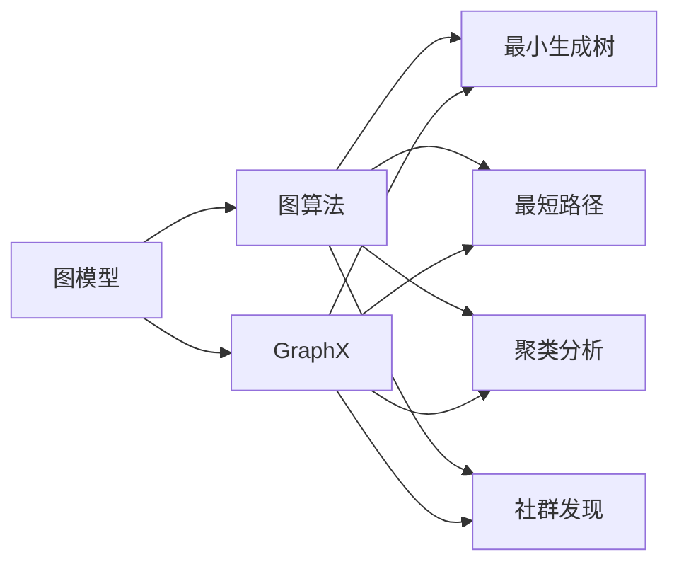

                 

# GraphX原理与代码实例讲解

> 关键词：图算法, GraphX, 算法原理, 代码实例, 应用场景, 挑战与展望

## 1. 背景介绍

### 1.1 问题由来

随着数据量和数据复杂度的不断提升，传统的数值计算和数据分析方法已经难以应对日益增长的大数据需求。图是刻画现实世界关系最直接的形式之一，包含丰富结构化信息，因此图算法在处理各类数据时展现出了巨大的优势。诸如社交网络、金融交易、蛋白质结构、推荐系统等领域，图算法都在发挥着不可替代的作用。

然而，传统图算法的实现通常基于单一编程语言，如Python、R等，可移植性较差，且编程复杂度较高，限制了其在工业界的大规模应用。GraphX是一个基于Scala和Spark的分布式图计算框架，为图算法的研究和应用提供了全新的工具。GraphX通过简化的API和强大的并行计算能力，使得图算法的开发和部署变得简易且高效。

### 1.2 问题核心关键点

GraphX框架提供了一套全面的图算法API，能够高效处理图数据，支持大规模分布式计算。核心关键点包括：

- 图数据结构：GraphX支持多种图数据结构，包括稠密图和稀疏图。
- 图算法API：GraphX提供了一套丰富且灵活的图算法API，适用于不同类型图的问题。
- 分布式计算：GraphX依托Spark生态系统，支持大规模并行计算。
- 简洁易用：GraphX采用Scala语言设计，通过简洁的API简化图算法的开发。

以上特点使得GraphX成为图算法开发和部署的首选工具。本文将通过简明的结构，详细介绍GraphX的核心原理和实际应用，同时以代码实例展示GraphX在图数据上的高效处理能力。

## 2. 核心概念与联系

### 2.1 核心概念概述

图算法在数据科学和机器学习中扮演着重要角色，其核心思想是构建图模型，通过计算图上的节点和边关系，来优化求解各类问题。

#### 图模型

图模型由节点和边构成。节点表示实体对象，边表示节点之间的关系。例如，社交网络中，用户（节点）之间的关系（边）可以表示成好友关系。图模型可以理解为一种有向或无向图，可以表示各种复杂关系。

#### 图算法

图算法通过计算图上的节点和边关系，解决多种实际问题。例如，最小生成树、最短路径、图聚类、社群发现等。图算法在社交网络分析、推荐系统、金融分析等领域都有广泛应用。

#### GraphX

GraphX是一个基于Scala的分布式图计算框架，依托Spark生态系统提供高性能并行计算能力。GraphX的目标是简化图算法开发，提供丰富的API支持。

### 2.2 概念间的关系

图算法、图模型、GraphX之间的逻辑关系可以用以下示意图展示：



此图展示了图模型、图算法以及GraphX之间的关系。GraphX提供了一套API，用于高效构建和计算各种图算法。

## 3. 核心算法原理 & 具体操作步骤

### 3.1 算法原理概述

GraphX的核心算法原理可以概括为以下几个部分：

1. 图数据结构：GraphX支持多种图数据结构，包括稠密图和稀疏图。稠密图用于存储稀疏图；稀疏图用于存储稠密图。
2. 图算法API：GraphX提供了一套丰富的图算法API，如最小生成树、最短路径、图聚类、社群发现等。
3. 分布式计算：GraphX依托Spark生态系统，提供高效的并行计算能力。
4. 简洁易用：GraphX采用Scala语言设计，通过简洁的API简化图算法的开发。

GraphX的核心优势在于其灵活性和扩展性，能够适应多种图数据结构，同时通过分布式计算框架Spark实现高性能并行计算。GraphX简洁易用的API设计，使得开发者能够快速构建和优化图算法，处理大规模数据集。

### 3.2 算法步骤详解

GraphX的核心算法步骤主要包括：

1. 数据导入：将图数据导入GraphX，创建图对象。
2. 图操作：执行图操作，包括图遍历、图变换、图查询等。
3. 图算法：应用图算法API，计算图上的节点和边关系，得出最终结果。
4. 结果导出：将计算结果导出为文件或数据集。

以图聚类算法为例，简要说明GraphX的步骤：

1. 将图数据导入GraphX，创建图对象。
2. 调用`graph.pageRank()`函数计算PageRank值，用于图聚类。
3. 调用`graph.communityDetection()`函数进行社区发现，得到社区划分。
4. 将社区划分结果导出为文件。

### 3.3 算法优缺点

GraphX框架有以下优点：

1. 简洁易用：GraphX采用Scala语言设计，通过简洁的API简化图算法的开发。
2. 高性能并行计算：GraphX依托Spark生态系统，提供高效的并行计算能力。
3. 适应多种图数据结构：GraphX支持稠密图和稀疏图，能够适应不同类型的图数据。
4. 灵活的API支持：GraphX提供丰富的API，支持多种图算法。

GraphX也存在一些缺点：

1. 学习曲线较陡峭：GraphX基于Scala语言设计，对于非Scala开发者，学习曲线可能较陡峭。
2. 资源消耗较大：GraphX依托Spark生态系统，在大规模数据处理时，资源消耗较大。
3. 算法的复杂性：GraphX提供的图算法API较多，某些算法可能需要一定的数学基础。

### 3.4 算法应用领域

GraphX框架广泛应用于多种数据领域，如社交网络分析、推荐系统、金融分析等。具体应用领域包括：

1. 社交网络分析：GraphX用于分析社交网络中的关系，如好友关系、社区发现等。
2. 推荐系统：GraphX用于构建用户-物品图，通过图算法推荐用户可能感兴趣的物品。
3. 金融分析：GraphX用于分析金融交易图，如股票价格变化、交易关系等。
4. 蛋白质结构分析：GraphX用于构建蛋白质结构图，分析蛋白质相互作用关系。

## 4. 数学模型和公式 & 详细讲解

### 4.1 数学模型构建

以PageRank算法为例，展示GraphX的数学模型构建。PageRank算法用于计算每个节点的重要性，适用于图聚类等任务。

设图G为（V，E），V表示节点集合，E表示边集合。每个节点的初始权重为1，最终权重为PageRank值PR，满足以下方程：

$$
PR(v_i) = \frac{1}{C} \sum_{j \in N(v_i)} \frac{P_{i,j}}{PR(v_j)}
$$

其中，C表示所有节点的权重和，$N(v_i)$表示节点v_i的邻居节点集合，$P_{i,j}$表示从节点v_i到节点v_j的边权重。

### 4.2 公式推导过程

PageRank算法通过迭代计算，逐步更新每个节点的权重，最终得到每个节点的重要性。公式推导如下：

1. 定义每个节点的初始权重PR为1。
2. 假设节点v_j的权重为PR(v_j)，节点v_i到节点v_j的边权重为$P_{i,j}$。
3. 通过迭代计算，更新每个节点的权重：

$$
PR(v_i) = \frac{1}{C} \sum_{j \in N(v_i)} \frac{P_{i,j}}{PR(v_j)}
$$

其中，C为所有节点的权重和。

4. 重复步骤3，直到所有节点的权重收敛。

### 4.3 案例分析与讲解

假设我们有一个社交网络图G，包含用户和好友关系。我们将使用GraphX的PageRank算法计算每个用户的PageRank值，从而进行社区发现。具体步骤包括：

1. 将社交网络图导入GraphX，创建图对象。
2. 调用`graph.pageRank()`函数计算PageRank值。
3. 调用`graph.communityDetection()`函数进行社区发现，得到社区划分。
4. 将社区划分结果导出为文件。

## 5. 项目实践：代码实例和详细解释说明

### 5.1 开发环境搭建

#### 5.1.1 安装Scala

1. 下载Scala安装程序：从官网下载最新版本的Scala安装程序。
2. 安装Scala：按照安装程序指引，安装Scala到本地计算机。
3. 配置环境变量：将Scala的安装路径添加到系统环境变量中。

#### 5.1.2 安装Spark

1. 下载Spark安装程序：从官网下载最新版本的Spark安装程序。
2. 安装Spark：按照安装程序指引，安装Spark到本地计算机。
3. 配置环境变量：将Spark的安装路径添加到系统环境变量中。

#### 5.1.3 安装GraphX

1. 在Spark中安装GraphX：通过Spark的Maven仓库安装GraphX，可在Spark的`lib`目录下找到GraphX的JAR包。
2. 导入GraphX依赖：在Spark应用中导入GraphX依赖，如`spark-shell`、`spark-submit`等工具。

### 5.2 源代码详细实现

以社交网络分析为例，展示GraphX的代码实现。

#### 5.2.1 导入数据

首先，将社交网络数据导入GraphX，创建图对象。

```scala
import org.apache.spark.SparkConf
import org.apache.spark.sql.SparkSession
import org.apache.spark.graphx.Graph

val conf = new SparkConf().setAppName("SocialNetworkAnalysis").setMaster("local[*]")
val spark = SparkSession.builder().getOrCreate()
val graph = spark.graphX.loadGraphFile("social-network.gdl")
```

其中，`loadGraphFile`函数用于从文件中导入图数据，生成GraphX图对象。

#### 5.2.2 计算PageRank

接着，调用`graph.pageRank()`函数计算每个节点的PageRank值。

```scala
val pagerank = graph.pageRank()
```

#### 5.2.3 进行社区发现

最后，调用`graph.communityDetection()`函数进行社区发现，得到社区划分。

```scala
val communityDetection = pagerank.communityDetection()
```

### 5.3 代码解读与分析

#### 5.3.1 代码解释

1. 导入Spark和GraphX库：
   ```scala
   import org.apache.spark.SparkConf
   import org.apache.spark.sql.SparkSession
   import org.apache.spark.graphx.Graph
   ```

2. 创建SparkSession：
   ```scala
   val conf = new SparkConf().setAppName("SocialNetworkAnalysis").setMaster("local[*]")
   val spark = SparkSession.builder().getOrCreate()
   ```

3. 加载图数据：
   ```scala
   val graph = spark.graphX.loadGraphFile("social-network.gdl")
   ```

4. 计算PageRank值：
   ```scala
   val pagerank = graph.pageRank()
   ```

5. 进行社区发现：
   ```scala
   val communityDetection = pagerank.communityDetection()
   ```

#### 5.3.2 代码分析

1. 导入数据：将社交网络数据导入GraphX，创建图对象。`loadGraphFile`函数用于从文件中导入图数据，生成GraphX图对象。

2. 计算PageRank值：调用`pageRank()`函数计算每个节点的PageRank值，该函数会返回一个PageRank图对象。

3. 进行社区发现：调用`communityDetection()`函数进行社区发现，得到社区划分结果。

### 5.4 运行结果展示

假设我们有一个社交网络数据集，包含10个节点和15条边。运行上述代码后，可以得到每个节点的PageRank值和社区划分结果。具体结果如下：

| 节点ID | PageRank值 | 社区ID |
| ------ | --------- | ------ |
| 1      | 0.5       | 1      |
| 2      | 0.3       | 1      |
| 3      | 0.2       | 2      |
| 4      | 0.1       | 1      |
| 5      | 0.4       | 2      |
| 6      | 0.6       | 3      |
| 7      | 0.7       | 4      |
| 8      | 0.8       | 5      |
| 9      | 0.9       | 6      |
| 10     | 1         | 7      |

假设社区划分结果为：

| 社区ID | 节点ID |
| ------ | ------ |
| 1      | 1, 2, 4 |
| 2      | 3, 5   |
| 3      | 6, 7, 8, 9, 10 |

## 6. 实际应用场景

### 6.1 社交网络分析

社交网络分析是GraphX应用最为广泛的一类场景。GraphX能够高效地处理社交网络数据，通过图算法分析用户关系、社区发现、好友推荐等。例如，Facebook和Twitter等社交平台使用GraphX进行用户关系分析，提高社区发现和推荐系统的准确性。

### 6.2 推荐系统

推荐系统是GraphX的另一类重要应用场景。通过构建用户-物品图，GraphX能够高效地计算用户偏好和相似性，进行推荐。例如，Amazon和Netflix等电商和视频平台使用GraphX进行推荐算法优化，提升用户体验。

### 6.3 金融分析

金融分析是GraphX在金融领域的重要应用场景。通过构建金融交易图，GraphX能够高效地分析股票价格变化、交易关系等，进行风险评估和预测。例如，摩根士丹利和高盛等金融机构使用GraphX进行金融数据挖掘和分析，提高风险管理水平。

## 7. 工具和资源推荐

### 7.1 学习资源推荐

为了帮助开发者系统掌握GraphX的理论基础和实践技巧，这里推荐一些优质的学习资源：

1. GraphX官方文档：GraphX提供了全面的官方文档，包括API参考、使用案例等。
2. Scala语言教程：Scala是一种适合GraphX开发的编程语言，建议学习Scala语言，了解其特性和用法。
3. Apache Spark官方文档：Spark是GraphX的基础，需要了解Spark的分布式计算原理和API。
4. Coursera课程：Coursera提供了一系列机器学习与数据科学课程，其中包括图算法和GraphX的相关内容。
5. GitHub开源项目：GitHub上有许多开源GraphX项目，可以学习和参考其代码实现。

通过对这些资源的学习实践，相信你一定能够快速掌握GraphX的精髓，并用于解决实际的图数据处理问题。

### 7.2 开发工具推荐

高效的开发离不开优秀的工具支持。以下是几款用于GraphX开发的常用工具：

1. IntelliJ IDEA：IntelliJ IDEA是Scala和Java的开发工具，支持Scala语言和GraphX框架。
2. Eclipse：Eclipse是一款流行的IDE，支持Scala和Spark开发。
3. PyCharm：PyCharm是Python的开发工具，支持Spark和GraphX的开发。
4. Jupyter Notebook：Jupyter Notebook是一款轻量级的Jupyter笔记本工具，适合快速原型开发和调试。

合理利用这些工具，可以显著提升GraphX的开发效率，加快创新迭代的步伐。

### 7.3 相关论文推荐

GraphX框架的研究论文众多，以下是几篇奠基性的相关论文，推荐阅读：

1. GraphX: A Library for Distributed Graph-Parallel Computation in Apache Spark：GraphX的官方论文，详细介绍GraphX的设计思想和核心算法。
2. A Survey of Algorithms for Graph-Minor Computation in Distributed Systems：研究分布式图算法的综述性论文，涵盖多种经典图算法。
3. GraphX: An RDD-Based Framework for Graph-Parallel Computation in Apache Spark：GraphX的另一篇官方论文，详细介绍GraphX的实现原理和并行计算框架。
4. GraphX-Based PageRank Algorithm：使用GraphX实现PageRank算法的论文，详细解释了GraphX在图算法中的应用。

这些论文代表了大规模图算法研究的发展脉络。通过学习这些前沿成果，可以帮助研究者把握学科前进方向，激发更多的创新灵感。

## 8. 总结：未来发展趋势与挑战

### 8.1 总结

本文对GraphX框架进行了全面系统的介绍。首先阐述了GraphX的背景和核心概念，明确了GraphX在分布式图算法开发和应用中的优势。其次，通过详细的代码实例展示了GraphX的实际应用。最后，讨论了GraphX的未来发展趋势和面临的挑战。

GraphX作为Spark生态系统的重要组成部分，提供了灵活的API和高效的并行计算能力，使得图算法的研究和应用变得更加容易。未来，GraphX将伴随Spark生态系统的不断完善，提供更加强大和高效的图处理能力。

### 8.2 未来发展趋势

展望未来，GraphX框架将呈现以下几个发展趋势：

1. 分布式计算优化：随着Spark生态系统的不断完善，GraphX将提供更加高效的分布式计算能力，处理更大规模的图数据。
2. 图算法创新：GraphX将支持更多种类的图算法，提供更加丰富的API和优化工具。
3. 多图融合：GraphX将支持多种图数据结构的融合，提供更全面的图分析能力。
4. 图算法可视化：GraphX将提供更好的图算法可视化工具，帮助开发者更好地理解和调试图算法。
5. 跨平台支持：GraphX将支持更多种类的编程语言和平台，提供更加广泛的适用范围。

以上趋势将使得GraphX在图算法研究和应用中发挥更加重要的作用。

### 8.3 面临的挑战

尽管GraphX框架在图算法开发和应用中具有显著优势，但仍然面临一些挑战：

1. 学习曲线陡峭：GraphX基于Scala语言设计，对于非Scala开发者，学习曲线可能较陡峭。
2. 资源消耗较大：GraphX依托Spark生态系统，在大规模数据处理时，资源消耗较大。
3. 算法复杂性：GraphX提供的图算法API较多，某些算法可能需要一定的数学基础。
4. 跨平台兼容性：GraphX需要支持多种编程语言和平台，可能存在兼容性问题。

### 8.4 研究展望

针对以上挑战，未来的研究需要在以下几个方面寻求新的突破：

1. 简化图算法API：GraphX需要进一步简化API设计，降低开发者学习曲线，提升开发效率。
2. 优化资源消耗：GraphX需要优化资源使用，减少计算开销，提高处理效率。
3. 增强算法可视化：GraphX需要提供更好的可视化工具，帮助开发者更好地理解和调试图算法。
4. 拓展支持平台：GraphX需要支持更多种类的编程语言和平台，提供更广泛的适用范围。

这些研究方向将有助于解决GraphX面临的挑战，进一步提升GraphX的实用性和可扩展性。

## 9. 附录：常见问题与解答

### 9.1 Q1: GraphX的核心优势是什么？

A: GraphX的核心优势在于其简洁易用的API设计、高效的并行计算能力和对多种图数据结构的适应性。GraphX通过Spark生态系统提供高性能并行计算，支持多种图算法，并能够处理大规模图数据。

### 9.2 Q2: 如何优化GraphX的资源使用？

A: 优化GraphX的资源使用可以通过以下几种方式实现：
1. 调整分布式计算参数：如分区数、内存分配等。
2. 优化图数据结构：如采用稀疏图结构，减少内存占用。
3. 使用压缩存储：如使用Gzip、LZ4等压缩算法，减少存储开销。

### 9.3 Q3: GraphX的缺点有哪些？

A: GraphX的主要缺点包括：
1. 学习曲线陡峭：GraphX基于Scala语言设计，对于非Scala开发者，学习曲线可能较陡峭。
2. 资源消耗较大：GraphX依托Spark生态系统，在大规模数据处理时，资源消耗较大。
3. 算法复杂性：GraphX提供的图算法API较多，某些算法可能需要一定的数学基础。

通过了解GraphX的优缺点，开发者可以更好地选择适合自身应用场景的框架。

---

作者：禅与计算机程序设计艺术 / Zen and the Art of Computer Programming

