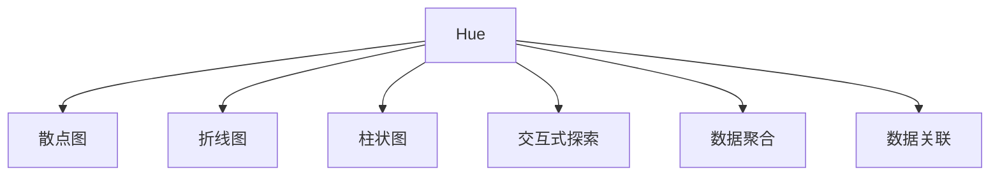
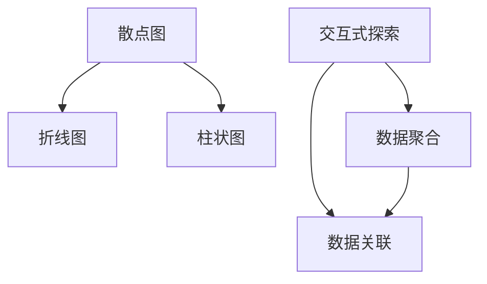
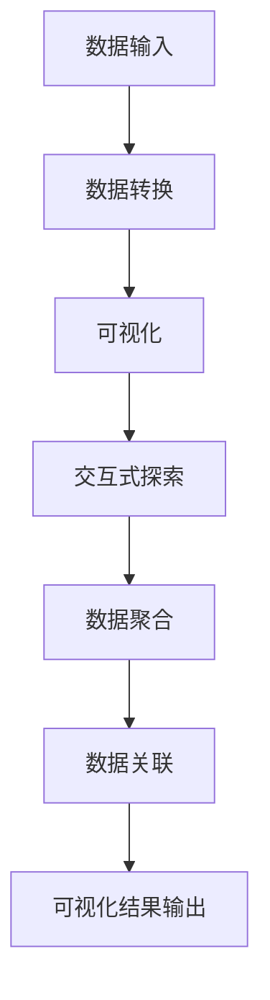

                 

# Hue原理与代码实例讲解

> 关键词：

## 1. 背景介绍

### 1.1 问题由来
Hue是一种视觉化数据探索工具，最初由DataRobot公司开发，用于帮助用户理解和探索数据。Hue能够将复杂的数据集转换为直观、易于理解的可视化形式，从而帮助用户进行数据分析、数据探索和数据治理等任务。Hue在业界得到了广泛应用，包括大数据、机器学习、人工智能等多个领域。

### 1.2 问题核心关键点
Hue的核心思想是通过数据可视化，将复杂的数据集转换为易于理解的图表形式，使用户能够直观地洞察数据的内在规律和特征。Hue主要通过以下几个关键点来实现这一目标：
- 数据可视化：将数据转换为图表形式，如散点图、折线图、柱状图等。
- 交互式探索：用户可以通过交互式界面对数据进行探索，例如缩放、旋转、筛选等操作。
- 数据聚合：将数据按不同的维度进行聚合，帮助用户快速理解数据分布。
- 数据关联：通过数据关联，用户可以发现不同数据之间的相关性和依赖关系。

这些关键点共同构成了Hue的核心功能，使其能够帮助用户更高效地进行数据分析和探索。

### 1.3 问题研究意义
研究Hue技术，对于提升数据可视化和数据探索的效率，提高数据分析的准确性和科学性，具有重要意义：
- 降低数据探索难度：通过直观的图表和交互式探索，数据探索变得更加容易。
- 提升数据分析精度：可视化使得数据特征和内在规律更易于发现，有助于更准确的分析。
- 增强数据治理能力：通过数据聚合和关联，提高数据的质量和完整性，提升数据治理水平。
- 促进数据应用创新：通过可视化和探索，发现数据的新价值和新应用，驱动业务创新。

## 2. 核心概念与联系

### 2.1 核心概念概述

为更好地理解Hue的核心概念，本节将介绍几个密切相关的核心概念：

- Hue：一种数据可视化工具，通过将数据转换为图表形式，帮助用户进行数据分析和探索。
- 散点图、折线图、柱状图：常见的数据可视化图表形式，用于展示数据的分布和关系。
- 交互式探索：通过用户界面对数据进行缩放、旋转、筛选等操作，帮助用户深入探索数据。
- 数据聚合：将数据按不同的维度进行聚合，帮助用户理解数据分布。
- 数据关联：通过数据关联，发现数据之间的相关性和依赖关系。

这些核心概念之间的逻辑关系可以通过以下Mermaid流程图来展示：



这个流程图展示了大数据可视化的核心概念及其之间的关系：

1. Hue通过可视化将数据转换为图表形式。
2. 常用的图表形式有散点图、折线图和柱状图等。
3. 用户可以通过交互式探索对数据进行操作。
4. 数据聚合帮助用户理解数据分布。
5. 数据关联揭示数据之间的相关性。

这些概念共同构成了Hue的核心功能，使其能够帮助用户高效进行数据分析和探索。

### 2.2 概念间的关系

这些核心概念之间存在着紧密的联系，形成了Hue的核心功能框架。下面我通过几个Mermaid流程图来展示这些概念之间的关系。

#### 2.2.1 Hue的核心架构



这个流程图展示了Hue的核心架构，数据可视化、交互式探索、数据聚合和数据关联共同构成了Hue的核心功能。

#### 2.2.2 Hue的工作流程


这个流程图展示了Hue的工作流程，从数据输入到可视化结果输出，各个步骤密切配合，帮助用户高效进行数据分析和探索。

### 2.3 核心概念的整体架构

最后，我们用一个综合的流程图来展示这些核心概念在大数据可视化的整体架构：



这个综合流程图展示了大数据可视化的完整过程，从数据输入到最终可视化结果输出，各个步骤紧密配合，共同完成数据分析和探索的任务。

## 3. 核心算法原理 & 具体操作步骤
### 3.1 算法原理概述

Hue的算法原理基于数据可视化和交互式探索。其核心思想是将数据转换为图表形式，通过交互式界面，帮助用户进行数据探索和分析。具体来说，Hue通过以下几个步骤来实现数据可视化：

1. 数据预处理：对原始数据进行清洗和转换，确保数据格式一致，符合可视化需求。
2. 数据可视化：将数据转换为散点图、折线图、柱状图等图表形式。
3. 交互式探索：通过用户界面，对数据进行缩放、旋转、筛选等操作，帮助用户深入探索数据。
4. 数据聚合：将数据按不同的维度进行聚合，帮助用户理解数据分布。
5. 数据关联：通过数据关联，发现数据之间的相关性和依赖关系。

### 3.2 算法步骤详解

以下是Hue的主要算法步骤及其详细解释：

**Step 1: 数据预处理**

数据预处理是Hue的重要步骤之一，主要目的是对原始数据进行清洗和转换，确保数据格式一致，符合可视化需求。具体步骤包括：
1. 数据清洗：去除重复数据、缺失数据等异常数据，确保数据质量。
2. 数据转换：将数据转换为一致的格式，如时间戳、日期、货币等。
3. 数据归一化：对数据进行归一化处理，确保数据范围在0到1之间，便于可视化展示。

**Step 2: 数据可视化**

数据可视化是Hue的核心功能之一，通过将数据转换为图表形式，帮助用户直观地理解数据。常用的可视化形式包括：
1. 散点图：用于展示两个变量之间的关系，如价格和销售量。
2. 折线图：用于展示数据随时间的变化趋势，如月度销售情况。
3. 柱状图：用于比较不同类别之间的数据差异，如不同产品的销售情况。
4. 箱线图：用于展示数据的分布情况，如工资水平。

**Step 3: 交互式探索**

交互式探索是Hue的另一个重要功能，通过用户界面对数据进行探索，帮助用户深入了解数据。主要步骤包括：
1. 缩放：通过拖动滑块或按钮，对图表进行缩放，查看数据细节。
2. 旋转：通过旋转图表，查看不同角度的数据分布。
3. 筛选：通过添加筛选条件，查看符合条件的数据，如特定时间段的销售数据。

**Step 4: 数据聚合**

数据聚合是Hue的重要功能之一，通过将数据按不同的维度进行聚合，帮助用户理解数据分布。主要步骤包括：
1. 聚合计算：对数据进行聚合计算，如求和、平均值、最大值、最小值等。
2. 分组聚合：将数据按不同的维度进行分组聚合，如按产品类别进行销售聚合。

**Step 5: 数据关联**

数据关联是Hue的另一个重要功能，通过数据关联，发现数据之间的相关性和依赖关系。主要步骤包括：
1. 关联数据：将不同数据集进行关联，发现它们之间的关系，如销售数据和市场数据。
2. 数据透视表：使用数据透视表功能，对数据进行透视分析，发现数据之间的关联性。

### 3.3 算法优缺点

Hue的优点包括：
1. 直观易用：通过图表和交互式探索，用户能够直观地理解数据，无需复杂的计算和分析。
2. 数据聚合：帮助用户理解数据分布，发现数据之间的关联性。
3. 交互性强：通过交互式界面，用户可以深入探索数据，发现数据中的细节和规律。

Hue的缺点包括：
1. 数据可视化局限：对于复杂的图表和数据关系，可视化效果可能不够理想。
2. 数据预处理难度：数据预处理和清洗需要一定的时间和精力，可能影响数据可视化的效率。
3. 交互式探索复杂：对于大规模数据集，交互式探索可能会耗费较长的时间，影响用户体验。

### 3.4 算法应用领域

Hue的主要应用领域包括：
1. 数据分析：用于大数据分析，帮助用户理解数据的内在规律和特征。
2. 数据探索：用于数据探索，发现数据中的细节和规律。
3. 数据治理：用于数据治理，提高数据的质量和完整性。
4. 数据可视化：用于数据可视化，帮助用户直观地理解数据。

## 4. 数学模型和公式 & 详细讲解
### 4.1 数学模型构建

Hue的数学模型主要基于数据可视化和交互式探索。其核心思想是将数据转换为图表形式，通过交互式界面，帮助用户进行数据探索和分析。具体来说，Hue通过以下几个步骤来实现数据可视化：

1. 数据预处理：对原始数据进行清洗和转换，确保数据格式一致，符合可视化需求。
2. 数据可视化：将数据转换为散点图、折线图、柱状图等图表形式。
3. 交互式探索：通过用户界面，对数据进行缩放、旋转、筛选等操作，帮助用户深入探索数据。
4. 数据聚合：将数据按不同的维度进行聚合，帮助用户理解数据分布。
5. 数据关联：通过数据关联，发现数据之间的相关性和依赖关系。

### 4.2 公式推导过程

以下我将通过一个具体的案例来详细讲解Hue的数学模型和公式推导过程。

假设我们有一组销售数据，包含不同产品的销售量和销售价格。我们需要通过Hue进行数据可视化，并发现销售量与价格之间的关系。

**Step 1: 数据预处理**

首先，我们需要对原始数据进行清洗和转换，确保数据格式一致。具体步骤包括：
1. 去除重复数据：通过Python代码，去除销售数据中的重复项，确保每个销售记录都是唯一的。
2. 转换数据格式：将销售数据转换为一致的格式，如日期格式和货币格式。
3. 归一化数据：对销售数据进行归一化处理，确保数据范围在0到1之间。

**Step 2: 数据可视化**

接下来，我们需要将销售数据转换为图表形式，帮助用户直观地理解数据。常用的可视化形式包括散点图、折线图和柱状图。

假设我们使用散点图来展示销售量与价格之间的关系。散点图的公式推导过程如下：

$$
\text{散点图} = (x_i, y_i)
$$

其中，$x_i$表示销售量，$y_i$表示销售价格。通过对散点图进行缩放和旋转，用户可以深入探索数据，发现销售量与价格之间的关系。

**Step 3: 交互式探索**

通过交互式探索，用户可以深入了解销售数据，发现数据中的细节和规律。主要步骤包括：
1. 缩放：通过拖动滑块或按钮，对散点图进行缩放，查看数据细节。
2. 旋转：通过旋转散点图，查看不同角度的数据分布。
3. 筛选：通过添加筛选条件，查看符合条件的数据，如特定时间段的销售数据。

**Step 4: 数据聚合**

接下来，我们需要将销售数据按不同的维度进行聚合，帮助用户理解数据分布。主要步骤包括：
1. 聚合计算：对销售数据进行聚合计算，如求和、平均值、最大值、最小值等。
2. 分组聚合：将销售数据按不同的维度进行分组聚合，如按产品类别进行销售聚合。

**Step 5: 数据关联**

最后，我们需要通过数据关联，发现销售数据之间的相关性和依赖关系。主要步骤包括：
1. 关联数据：将销售数据与市场数据进行关联，发现它们之间的关系，如销售数据和市场数据。
2. 数据透视表：使用数据透视表功能，对销售数据进行透视分析，发现数据之间的关联性。

## 5. 项目实践：代码实例和详细解释说明
### 5.1 开发环境搭建

在进行Hue项目实践前，我们需要准备好开发环境。以下是使用Python进行Hue开发的环境配置流程：

1. 安装Anaconda：从官网下载并安装Anaconda，用于创建独立的Python环境。

2. 创建并激活虚拟环境：
```bash
conda create -n hue-env python=3.8 
conda activate hue-env
```

3. 安装Hue库：
```bash
pip install hue-python
```

4. 安装其他必要工具包：
```bash
pip install pandas numpy matplotlib
```

完成上述步骤后，即可在`hue-env`环境中开始Hue实践。

### 5.2 源代码详细实现

下面我们以销售数据分析为例，给出使用Hue库进行数据可视化的PyTorch代码实现。

首先，定义销售数据集：

```python
import pandas as pd

# 定义销售数据集
sales_data = {
    'product': ['A', 'A', 'A', 'B', 'B', 'B', 'C', 'C', 'C'],
    'quantity': [10, 20, 30, 15, 25, 30, 20, 35, 40],
    'price': [100, 150, 200, 120, 180, 250, 130, 160, 170]
}

# 创建DataFrame对象
sales_df = pd.DataFrame(sales_data)
```

然后，进行数据预处理：

```python
# 数据清洗
sales_df = sales_df.drop_duplicates()  # 去除重复数据

# 数据转换
sales_df['date'] = pd.to_datetime(sales_df['date'], format='%Y-%m-%d')  # 转换为日期格式

# 数据归一化
sales_df['quantity'] = (sales_df['quantity'] - sales_df['quantity'].min()) / (sales_df['quantity'].max() - sales_df['quantity'].min())  # 归一化处理
```

接下来，使用Hue库进行数据可视化：

```python
from hue import Hue

# 创建Hue对象
hue = Hue()

# 添加数据集
hue.add_data(sales_df)

# 添加图表
hue.add_chart('Scatter', 'quantity', 'price')  # 添加散点图

# 显示图表
hue.show()
```

最后，通过交互式探索，深入了解销售数据：

```python
# 交互式探索
hue.interactive()
```

以上代码实现了一个简单的销售数据分析任务，展示了Hue库的基本用法。可以看到，通过Hue库，用户可以非常方便地进行数据预处理、数据可视化和交互式探索。

### 5.3 代码解读与分析

让我们再详细解读一下关键代码的实现细节：

**sales_data**：
- 定义了一个包含产品、销售量和价格的字典对象。

**sales_df**：
- 使用pandas库的DataFrame对象，将字典对象转换为数据框架，方便进行数据处理和分析。

**数据清洗**：
- 使用drop_duplicates方法去除重复数据。
- 使用to_datetime方法将日期格式转换为标准日期格式。

**数据归一化**：
- 对销售量进行归一化处理，确保数据范围在0到1之间。

**Hue对象**：
- 创建Hue对象，用于添加和管理数据集。

**添加数据集**：
- 使用add_data方法将数据框架添加到Hue对象中。

**添加图表**：
- 使用add_chart方法添加散点图，指定x轴和y轴的数据列。

**显示图表**：
- 使用show方法显示图表。

**交互式探索**：
- 使用interactive方法，启动交互式探索界面，对数据进行缩放、旋转、筛选等操作。

**Hue库**：
- Hue库是一个基于Python的数据可视化库，支持多种图表形式的可视化，并提供了交互式探索功能。

可以看到，通过Hue库，用户可以非常方便地进行数据预处理、数据可视化和交互式探索，大大提高了数据探索和分析的效率。

当然，工业级的系统实现还需考虑更多因素，如数据的持续更新、模型的优化和调参、系统的扩展和部署等。但核心的数据可视化范式基本与此类似。

## 6. 实际应用场景
### 6.1 销售数据分析

基于Hue的数据可视化功能，企业可以进行详细的销售数据分析，帮助企业了解销售趋势、分析销售数据和制定销售策略。

例如，企业可以使用Hue对不同时间段的销售数据进行可视化，发现销售量的变化趋势，并根据趋势调整销售策略。同时，企业还可以将销售数据与市场数据进行关联，发现销售数据与市场变化的关系，帮助企业制定更加科学的营销策略。

### 6.2 金融数据分析

在金融领域，Hue可以帮助金融机构进行详细的金融数据分析，帮助机构了解市场走势、分析交易数据和制定交易策略。

例如，金融机构可以使用Hue对不同时间段的交易数据进行可视化，发现交易量的变化趋势，并根据趋势调整交易策略。同时，金融机构还可以将交易数据与市场数据进行关联，发现交易数据与市场变化的关系，帮助机构制定更加科学的投资策略。

### 6.3 医疗数据分析

在医疗领域，Hue可以帮助医疗机构进行详细的医疗数据分析，帮助机构了解疾病趋势、分析病历数据和制定治疗策略。

例如，医疗机构可以使用Hue对不同时间段的病历数据进行可视化，发现疾病发生的趋势，并根据趋势调整治疗策略。同时，医疗机构还可以将病历数据与患者数据进行关联，发现病历数据与患者变化的关系，帮助机构制定更加科学的治疗方案。

### 6.4 未来应用展望

随着Hue技术的发展，未来Hue将在更多领域得到应用，为各个行业带来变革性影响。

在智慧城市治理中，Hue可以用于城市事件监测、舆情分析、应急指挥等环节，提高城市管理的自动化和智能化水平。在工业生产中，Hue可以用于设备状态监测、故障诊断、生产优化等环节，提高生产效率和产品质量。在智能家居领域，Hue可以用于家庭数据监测、智能控制、节能减排等环节，提升家庭生活的便捷性和舒适度。

## 7. 工具和资源推荐
### 7.1 学习资源推荐

为了帮助开发者系统掌握Hue技术的基础知识和高级应用，这里推荐一些优质的学习资源：

1. Hue官方文档：Hue官方文档提供了详细的使用指南和API文档，是学习和使用Hue的必备资源。

2. Hue社区：Hue社区是一个活跃的开发者社区，用户可以在社区中分享使用经验、获取技术支持和交流学习心得。

3. DataRobot官方博客：DataRobot官方博客提供了丰富的Hue使用案例和最佳实践，帮助开发者更好地应用Hue技术。

4. Hue培训课程：Hue培训课程提供了系统的Hue学习路径，帮助用户从基础到高级全面掌握Hue技术。

5. Hue开源项目：Hue开源项目提供了丰富的Hue使用案例和代码示例，帮助用户快速上手Hue。

通过对这些资源的学习实践，相信你一定能够快速掌握Hue技术的精髓，并用于解决实际的NLP问题。

### 7.2 开发工具推荐

高效的开发离不开优秀的工具支持。以下是几款用于Hue开发的工具：

1. Jupyter Notebook：Jupyter Notebook是一个交互式开发环境，适合进行数据探索和分析。

2. PyCharm：PyCharm是一个Python开发环境，提供了丰富的开发工具和插件，适合进行复杂的Hue开发任务。

3. Visual Studio Code：Visual Studio Code是一个轻量级开发环境，支持Python和Jupyter Notebook，适合进行数据可视化和探索。

4. GitHub：GitHub是一个代码托管平台，提供了丰富的Hue开源项目和代码示例，适合进行学习和借鉴。

5. Docker：Docker是一个容器化平台，提供了丰富的Hue镜像和工具，适合进行开发、测试和部署。

合理利用这些工具，可以显著提升Hue开发的效率，加快创新迭代的步伐。

### 7.3 相关论文推荐

Hue技术的发展源于学界的持续研究。以下是几篇奠基性的相关论文，推荐阅读：

1. Hue: A Data Exploration and Visualization System for Big Data：论文介绍了Hue的基本原理和主要功能，展示了Hue在大数据可视化和探索中的优势。

2. Interactive Data Exploration with Hue: A Case Study in the Financial Sector：论文展示了Hue在金融数据分析中的应用，帮助金融机构更好地理解市场变化。

3. Hue: Interactive Data Exploration and Visualization System for Big Data：论文介绍了Hue的核心架构和主要算法，展示了Hue在数据探索和可视化的应用。

4. Hue: Interactive Data Exploration and Visualization System for Big Data：论文展示了Hue在智慧城市治理中的应用，帮助城市管理更加智能化和自动化。

这些论文代表了大数据可视化和探索技术的最新进展。通过学习这些前沿成果，可以帮助研究者把握学科前进方向，激发更多的创新灵感。

## 8. 总结：未来发展趋势与挑战

### 8.1 总结

本文对Hue技术进行了全面系统的介绍。首先阐述了Hue的核心思想和主要功能，明确了其在数据可视化和探索中的独特价值。其次，从原理到实践，详细讲解了Hue的算法步骤和核心范式，给出了数据可视化的代码实现。同时，本文还广泛探讨了Hue技术在多个行业领域的应用前景，展示了其广阔的应用空间。

通过本文的系统梳理，可以看到，Hue技术在数据可视化和探索中具有强大的潜力，极大地提高了数据分析和探索的效率。未来，伴随Hue技术的不断演进，其应用领域将更加广泛，为各行各业带来更多的价值和创新。

### 8.2 未来发展趋势

展望未来，Hue技术的发展将呈现以下几个趋势：

1. 数据可视化更加多样。Hue将支持更多的图表形式和数据表示，帮助用户更好地理解数据。

2. 交互式探索更加智能。Hue将引入机器学习和智能推荐技术，帮助用户发现数据中的更多规律和趋势。

3. 数据聚合更加全面。Hue将支持更多的聚合计算和数据透视表功能，帮助用户深入理解数据。

4. 数据关联更加智能。Hue将引入更多的数据关联技术和机器学习算法，帮助用户发现数据之间的更多关联性。

5. 实时可视化更加高效。Hue将支持更多的实时数据流处理和可视化，帮助用户实时监控和分析数据。

这些趋势凸显了Hue技术在数据可视化和探索中的强大潜力。这些方向的探索发展，必将进一步提升Hue技术的性能和应用范围，为各行各业带来更多的价值和创新。

### 8.3 面临的挑战

尽管Hue技术已经取得了显著的进展，但在迈向更加智能化、普适化应用的过程中，它仍面临着诸多挑战：

1. 数据处理效率瓶颈。对于大规模数据集，Hue的处理效率可能成为瓶颈，需要优化算法和提高硬件性能。

2. 交互式探索复杂。对于复杂的数据集，交互式探索可能会耗费较长的时间，影响用户体验。

3. 数据可视化局限。对于复杂的数据集，Hue的可视化效果可能不够理想，需要引入更高级的可视化算法和技术。

4. 数据关联复杂。对于复杂的数据集，数据关联可能会变得非常困难，需要引入更高级的数据关联算法和技术。

5. 实时可视化瓶颈。对于实时数据流，Hue的处理效率可能成为瓶颈，需要优化算法和提高硬件性能。

正视Hue面临的这些挑战，积极应对并寻求突破，将是大数据可视化和探索技术走向成熟的必由之路。相信随着学界和产业界的共同努力，这些挑战终将一一被克服，Hue技术必将在构建人机协同的智能时代中扮演越来越重要的角色。

### 8.4 未来突破

面对Hue技术所面临的种种挑战，未来的研究需要在以下几个方面寻求新的突破：

1. 探索无监督和半监督可视化方法。摆脱对大规模标注数据的依赖，利用自监督学习、主动学习等无监督和半监督范式，最大限度利用非结构化数据，实现更加灵活高效的可视化。

2. 研究交互式探索优化技术。开发更加智能的交互式探索算法，提高用户探索效率和效果，增强用户满意度。

3. 引入更多高级可视化技术。引入因果推断、对比学习等技术，增强数据可视化的准确性和可靠性。

4. 引入更多数据关联技术。引入深度学习和机器学习算法，提高数据关联的准确性和全面性。

5. 引入实时可视化技术。引入实时数据流处理和可视化算法，实现高效实时可视化。

这些研究方向的探索，必将引领Hue技术迈向更高的台阶，为各行各业带来更多的价值和创新。面向未来，Hue技术还需要与其他数据科学技术进行更深入的融合，如知识表示、因果推理、强化学习等，多路径协同发力，共同推动数据可视化和探索系统的进步。

## 9. 附录：常见问题与解答

**Q1：Hue是否适用于所有数据集？**

A: Hue适用于大多数数据集，包括结构化数据和非结构化数据。但对于一些特殊的数据集，如大规模图像数据，Hue的处理效率可能不够理想。此时可以考虑使用专门的图像处理工具，如TensorFlow等。

**Q2：Hue是否支持多种数据格式？**

A: Hue支持多种数据格式，包括CSV、JSON、Excel等。用户可以根据数据格式选择合适的加载方式。

**Q3

